# ERSTE SCHRITTE IN DER SCHACHKOMPOSITION


> V. M. ARTSCHAKOW


> KIEW "RADYANSKA SCHKOLA" 1987
> 75.581 A88
> ARTSCHAKOW V. M. Erste Schritte in der Schachkomposition.— Kiew: Rad.
> schk., 1987. —144 S.— (Wenn die Hausaufgaben erledigt sind).— 25 Kopeken. 150 000 Exemplare.
> In diesem Buch wird über die Entwicklungsgeschichte, Ästhetik und Ethik sowie die Thematik der Schachkomposition sowie über die Technik der Erstellung von Schachproblemen und Studien berichtet.
> Es richtet sich an Schüler der Mittel- und Oberstufe sowie an einen weiten Leserkreis.
> Das Manuskript wurde rezensiert von: Schiedsrichter republikanischer Kategorie A. B. Moldawansky, Internationaler Schiedsrichter und Meister des Sports der UdSSR V. A. Melnichenko.

## ZEICHENERKLÄRUNG

| Zeichen | Bedeutung                        |
| ------- | -------------------------------- |
| ++      | Doppel-Schach                    |
| +       | Schach                           |
| X       | Matt                             |
| =       | gleichwertiger Zug               |
| ==      | Remisstellung                    |
| :       | Schlag                           |
| !       | guter Zug                        |
| !!      | hervorragender Zug               |
| ?       | schlechter Zug oder falsche Spur |
| 0—0     | kurze Rochade                    |
| 0—0—0   | lange Rochade                    |
| ИЛ      | verwendete Literatur             |

$$
A \frac{4802000000—329}{M 210(04)—87} ** 352—87
$$

© Verlag "Radyanska Schkola", 1987

---

- [ERSTE SCHRITTE IN DER SCHACHKOMPOSITION](#erste-schritte-in-der-schachkomposition)
  - [ZEICHENERKLÄRUNG](#zeichenerklärung)
  - [VOM AUTOR](#vom-autor)
  - [KOMPOSITION — DIE POESIE DES SCHACHS](#komposition--die-poesie-des-schachs)
  - [OBLIGATORISCHE UND KÜNSTLERISCHE ANFORDERUNGEN AN DIE SCHACHKOMPOSITION](#obligatorische-und-künstlerische-anforderungen-an-die-schachkomposition)
  - [THEMATIK VON SCHACHAUFGABEN UND STUDIEN](#thematik-von-schachaufgaben-und-studien)
  - [PRAKTIKUM FÜR SCHACHKOMPONISTEN](#praktikum-für-schachkomponisten)
    - [Aufgabe Nr. 1. Nebenlösung beseitigen](#aufgabe-nr-1-nebenlösung-beseitigen)
    - [Aufgabe Nr. 2. Das Dual beseitigen](#aufgabe-nr-2-das-dual-beseitigen)
    - [Aufgabe Nr. 3. Unlösbarkeit beheben](#aufgabe-nr-3-unlösbarkeit-beheben)
    - [Aufgabe Nr. 4. Stellen Sie die Positionen anhand der Lösung wieder her](#aufgabe-nr-4-stellen-sie-die-positionen-anhand-der-lösung-wieder-her)
    - [Haben Sie richtig korrigiert](#haben-sie-richtig-korrigiert)
  - [Anhang](#anhang)
    - [Großmeister der UdSSR in Schachkomposition](#großmeister-der-udssr-in-schachkomposition)
    - [Meister des Sports der UdSSR in Schachkomposition](#meister-des-sports-der-udssr-in-schachkomposition)
    - [Kandidat des Meisters des Sports in Schachkomposition](#kandidat-des-meisters-des-sports-in-schachkomposition)
    - [Erste Klasse in Schachkomposition](#erste-klasse-in-schachkomposition)
    - [Zweite Klasse in Schachkomposition](#zweite-klasse-in-schachkomposition)
    - [Dritte Klasse in Schachkomposition](#dritte-klasse-in-schachkomposition)
    - [Bedingungen für die Erfüllung der Klassenanforderungen](#bedingungen-für-die-erfüllung-der-klassenanforderungen)
    - [Lösungen der Probleme und Studien](#lösungen-der-probleme-und-studien)
  - [VERWENDETE LITERATUR](#verwendete-literatur)
  - [PERSONENVERZEICHNIS](#personenverzeichnis)

---

## VOM AUTOR

Man fragt mich oft, wie ich begonnen habe, Schachkompositionen zu entwerfen. Natürlich habe ich zuerst gelernt, Schach zu spielen. Danach war ich Meister der Schule, des Aero-Clubs, des Bataillons, der Lehranstalt usw. Parallel zum praktischen Spiel befasste ich mich mit dem Lösen von Problemen und Studien. Mein erstes Problem entwarf ich, nachdem ich das Buch von W. N. Panow "Schach für Anfänger" gelesen hatte. Ich schickte es an den Wettbewerb der Zeitung "Junger Leninets" und erhielt die Antwort, dass mein "Werk" mehrere Nebenlösungen habe (deren Existenz ich nicht geahnt hatte), die Idee jedoch interessant sei. "Arbeiten Sie weiter", ermutigte mich die Redaktion.

Die Schönheit von Schachkombinationen und die Tiefe von Problemideen erschlossen sich mir nach dem aufmerksamen Studium der Sammlung "Die Schachaufgabe". Gleichzeitig festigte sich in mir die Überzeugung, dass sich die Qualifikation als Komponist umso schneller steigert, je besser man Probleme und Studien löst: deren Analyse und Untersuchung wirken sich unmittelbar auf die Beschleunigung der technischen Perfektionierung eines angehenden Schachkomponisten aus.
Um zu lernen, wie man Schachaufgaben und Studien komponiert, ist es notwendig:

1. Ein qualifizierter Schachpraktiker zu sein. Dies erleichtert es dem angehenden Komponisten, Mängel in der Komposition zu entdecken und diese schnell zu beheben.
2. In der Lage zu sein, Schachaufgaben und Studien zu lösen und zu analysieren.
3. Die obligatorischen und künstlerischen Anforderungen der Schachkomposition sowie die ästhetischen und ethischen Normen der Erstellung eines Schachwerks zu kennen.
4. Die Themenwelt von Aufgaben und Studien in der Schachkomposition zu studieren.
5. Über ausreichende technische Fertigkeiten in der Komposition zu verfügen, da allgemein bekannt ist, dass technisches Können die Umsetzung komplexester Vorhaben ermöglicht und dass hohe technische Kunst die Fähigkeit ist, das optimale Schema für eine ökonomische Umsetzung einer Idee zu finden.

Ein Wendepunkt im Leben eines Schachkomponisten tritt ein, wenn er, geprägt vom Werk anderer, beginnt, durch sein eigenes Schaffen Schachliebhaber zu prägen.

Ich gestehe offen, dass mich das Angebot, ein Buch über die Komposition von Schachaufgaben und Studien zu schreiben, ins Grübeln gebracht hat. Denn während die Fragen der Lösung von Schachkompositionen bereits weitgehend in der Literatur beleuchtet wurden (zum Beispiel in den Büchern "Wie man Schachaufgaben löst" von A. P. Guljajew und "Wie man Schachstudien löst" von Ju. L. Awerbach), gibt es über deren Komposition nur wenig Material.

Zum Thema der Studienkomposition gelang es mir nur, den Artikel "Über die Studienkomposition" im Buch "Ausgewählte Schachstudien" von A. O. Herbstman sowie den Artikel des Großmeisters W. A. Korolkow "Technologie der Schachetüde" zu finden, der im Februar 1968 in der offiziellen Zeitschrift der Ständigen Kommission für Schachkomposition der FIDE, "Problems", veröffentlicht wurde. Bereits bei der Vorbereitung des Manuskripts für die Veröffentlichung erwarb ich das hervorragende Buch des internationalen Großmeisters G. M. Kasparyan "Geheimnisse des Studienkomponisten".

Zur Komposition von Aufgaben stand mir lediglich der Artikel des internationalen Großmeisters L. I. Loschinsky "Turnierwettbewerb von Drei-Züger-Aufgaben" aus der Sammlung "Die Schachaufgabe" (1951) zur Verfügung. Und erst im Zuge der Arbeit an diesem Buch hatte ich das Glück, auf das Werk eines weiteren bekannten Großmeisters, W. F. Rudenko, zu stoßen – "Verfolgung des Themas" (1983), in dem das mich interessierende Material im ersten Teil "Schachkomposition" enthalten ist.

Die oben genannten und andere Werke haben mir beim Schreiben dieses Buches geholfen, und die darin enthaltenen Kommentare, die für einen angehenden Schachkomponisten von großem Interesse sind, wurden von uns fast vollständig oder teilweise im Original mit den entsprechenden Verweisen auf die Urheberschaft beibehalten.

Das Buch, das Informationen über die Geschichte der Entwicklung der Schachkomposition, die formalen und künstlerischen Anforderungen an sie, die Thematik und die Technik ihrer Erstellung vereint, ist im Wesentlichen das erste Lehrbuch für diejenigen, die lernen möchten, Schachprobleme und Studien zu komponieren.

Im Buch werden die wichtigsten und aktuellsten Themen behandelt. Zur Charakterisierung dieser werden nur typische Beispiele aufgeführt, die für diejenigen, die ihre ersten Schritte in der Schachkomposition machen, verständlich sind. Der Autor strebte nach einer populären Darstellung des Materials, die allen Schachliebhabern zugänglich ist.

Das Buch erhebt keinen Anspruch auf Vollständigkeit. Selbst wenn man kontinuierlich in die Tiefen des Ozeans eintaucht, ist es unmöglich, alle Perlen zu bergen. Wir räumen ein, dass bei einigen Lesern die Meinung entstehen könnte, dass bestimmte Probleme oder Studien in einer anderen thematischen Rubrik hätten aufgeführt werden sollen. Doch viele Kompositionen sind in ihrem Inhalt so ideenreich, dass sie mit gleichem Recht aus verschiedenen kreativen Aspekten betrachtet werden können.
Wenn mein Buch einem angehenden Schachkomponisten in irgendeiner Weise hilft, den Pfad zur Poesie des Schachs zu finden, werde ich meinen, dass ich meine Aufgabe erfüllt habe.

## KOMPOSITION — DIE POESIE DES SCHACHS

Schachkomposition, das heißt das Erstellen von Schachproblemen und Studien, basiert auf den Mitteln und Regeln des praktischen Spiels und stellt einen speziellen Bereich der Kreativität dar. Sie offenbart die Schönheit von Schachkombinationen, die sich ständig weiterentwickeln und immer neue Liebhaber des weisen Spiels anziehen.

Die Komposition wird bildlich als die Poesie des Schachs bezeichnet. Denn sie spiegelt die Praxis des Schachspiels wider, so wie die Kunst das reale Leben spiegelt. Ein wahrer Schachkomponist bringt die Figuren dazu, das Maximum auf dem Schachbrett zu leisten, ihre noch nicht erschlossene Kraft zu entfalten und nutzt die Gesetze und Regeln dieses alten Spiels umfassend aus. Genau diese schöpferischen Merkmale sind den sowjetischen Schachkomponisten in vollem Umfang eigen. Indem sie die besten Traditionen aller Schulen und Richtungen aufgreifen und weiterentwickeln, streben sie gleichzeitig danach, Innovation effektiv mit ästhetischen Prinzipien und einfachen Methoden des Ideenausdrucks zu verbinden.

Die Entstehung der Schachkomposition wird auf die Wende vom VIII. zum IX. Jahrhundert datiert, als erste Versuche unternommen wurden, Mansuben zu erstellen ("Mansub" bedeutet wörtlich aus dem Arabischen "das, was errichtet, gestiftet oder eingerichtet wurde", also in unserem Verständnis – zusammengestellt). Ein charakteristisches Merkmal der Mansuben war vor allem ihre Nähe zur praktischen Partie. Aus moderner Sicht erscheinen sie inhaltlich naiv, leicht zu lösen und konstruktiv primitiv, mit einem erzwungenen Spielverlauf, der ausschließlich auf einen äußeren Effekt abzielt.

**Nr. 1. Dilaram-Matt, Istanbuler Manuskript, 1140, Matt in 5 Zügen**  


Wahrscheinlich eines der ersten Mansuben und zweifellos das berühmteste war das arabische Problem (Diagramm Nr. 1), das den poetischen Namen "Dilaram-Matt" trägt. Folgende Legende erklärt diesen Namen.

Ein gewisser Adliger, ein leidenschaftlicher Schachspieler, der außergewöhnlich sicher in seinen schachlichen Talenten war, verspielte sein gesamtes Vermögen. Besessen von seinem Spieltrieb wettete er, dass er seinen Gegner dennoch besiegen würde, und setzte als letzten Einsatz seine geliebte Frau – die schöne Dilaram.

Doch das Glück schien ihn endgültig verlassen zu haben, und die Partie erreichte eine Position, in der der weiße König matt gesetzt werden musste. Verzweifelt suchte der Adlige nach einer Rettungsmöglichkeit und war bereits bereit aufzugeben. Doch im allerletzten Moment gelang es Dilaram, zufällig einen Blick auf das Brett zu werfen, und sie flüsterte ihrem unglücklichen Ehemann zu: "Opfere beide Türme und rette mich!".

Es gab nichts mehr zu verlieren, und Weiß spielte folgsam **1. Th8+! Kxh8 2. Lf5+** (nach den damaligen Regeln konnten die Alfil-Läufer nur genau ein Feld diagonal ziehen, konnten dafür aber Figuren überspringen) **2... Kg8**.

Die Position schien zum Ausgangszustand zurückzukehren, aber **3. Th8+ Kxh8 4. g7+ Kg8 5. Sh6X**. Alles war gerettet...

Natürlich kann niemand die Authentizität dieser Überlieferung bestätigen. Andernfalls würde die Schachgeschichte die schöne Dilaram mit vollem Recht als Pionierin der Schachkomposition unter den Frauen anerkennen. In einem anderen Punkt ist diese Geschichte jedoch durchaus glaubwürdig: Sie lässt vermuten, dass Mansuben keine Endspiele aus gespielten Partien waren, sondern speziell konstruierte Positionen.

**Nr. 2. Abu-Na'im, IX. Jahrhundert, Matt in 3 Zügen**  


Die Mansuba (Nr. 2) wurde vor fast tausendzweihundert Jahren erstellt und in alten arabischen Manuskripten von Al-Adli (9. Jahrhundert) gefunden: **1. Sh5+! Th5 2. Tg6+ Kg6 3. Te6#**.

Die Schachkomposition wird in orthodoxe, unorthodoxe, Märchenschach-Kompositionen und besondere Arten von Kompositionen unterteilt. Die orthodoxe Komposition basiert vollständig auf dem Ziel (Matt des Königs), dem Material (Brett und Figuren) und den Mitteln des Schachspiels (Spielregeln).

Um vorzugreifen, sagen wir, dass sich die Schule der sowjetischen Schachkomposition als integraler Bestandteil der allgemeinen Schachbewegung entwickelt hat und ihre Hauptrichtung die orthodoxe Komposition ist. Daher werden wir uns im Folgenden vor allem mit dem orthodoxen Bereich der Schachkomposition befassen.

Je nach Aufgabenstellung unterscheidet man zwei Arten von Kompositionen – Aufgaben und Studien.

Eine Schachaufgabe ist eine künstliche Position auf dem Brett, in der eine Seite (in der Regel Weiß) der anderen Seite (Schwarz) in einer bestimmten Anzahl von Zügen Matt setzt. Daher ist bei Aufgaben nicht die Anzahl der Figuren oder die Stärke der Seiten entscheidend. Schwarz mag nur den König haben, während Weiß seine gesamte Armee besitzt, doch dies bestimmt nicht den Erfolg von Weiß. Das Wichtigste ist, einen getarnten Weg zu finden, den gegnerischen König in der vorgegebenen Anzahl von Zügen mattzusetzen.

Eine Schachstudie ist ebenfalls eine künstliche Position, unterscheidet sich jedoch von der Aufgabe dadurch, dass sie näher am Endspiel einer praktischen Partie steht. In einer Studie beginnt Weiß (sofern in den Bedingungen nicht festgelegt ist, dass Schwarz den ersten Zug macht), aber das Ziel ist nicht das Matt in einer streng festgelegten Anzahl von Zügen, sondern das Gewinnen (ein entscheidender Vorteil) oder das Erreichen eines Remis. Die Anzahl der Züge ist (im Gegensatz zu Aufgaben) nicht durch eine konkrete Zahl begrenzt. An die Ausgangsposition einer Studie werden höhere Anforderungen gestellt. Sie sollte so weit wie möglich an eine Position aus einer tatsächlich gespielten Partie erinnern.

Eine Studie zu lösen ist weitaus schwieriger als eine Aufgabe. Eine gute Studie ist in der Regel sehr individuell, und um ihre Lösung zu finden, bedarf es sowohl bestimmter Theoriekenntnisse als auch kreativer Intuition. Die Lösung einer Studie wird im Vergleich zur Analyse einer Partieposition dadurch erleichtert, dass in einer praktischen Partie die Chancen beider Seiten nicht immer klar sind, während Weiß in einer Studie einen mathematisch präzisen, trotz aller Versuche unvermeidlichen Weg (wenn auch den einzigen) zum Gewinn oder zum Remis hat.

**Nr. 3. "Civis Bononiae", 13. Jahrhundert, Matt in 2 Zügen**  


Die Besonderheit der Studie wird besser verständlich, wenn man ihre Entwicklung seit dem Mittelalter betrachtet. Ihr schachliches Erbe ist uns durch zwei italienische Manuskripte überliefert – "Bonus Socius" und "Civis Bononiae". Fast alle Kompositionen dieser Sammlungen hatten eine Lösung, die mit einem Matt endete, was bedeutet, dass sie nach unserer heutigen Einteilung als Probleme zu betrachten sind. Auf Diagramm Nr. 3 ist eines davon zu sehen: **1. Tf7+ K:f7 2. Sg6X**.

**Nr. 4. "Civis Bononiae", 14. Jahrhundert, Gewinn**  


Daher ist es nicht überraschend, dass man beim Durchblättern dieser beiden Enzyklopädien nur eine einzige Studie (Nr. 4) finden kann, die allerdings mittlerweile ein Klassiker geworden ist: **1. Th5!! T:h5 2. Ta6+ K:c5 3. Ta5+** und **4. T:h5** mit Gewinn.

Nach dem Erscheinen von "Bonus Socius" und "Civis Bononiae" vergingen weitere zwei Jahrhunderte, doch in der Komposition gab es kaum Veränderungen. Die europäischen Aufgaben waren faktisch dieselben Mansuben, nur unter einem anderen Namen. Man kann daher davon ausgehen, dass die Mansuben fast bis zur Mitte des 19. Jahrhunderts bestanden, als es zu ihrer klaren und formalen Unterteilung in Probleme und Studien kam. Tatsächlich finden sich bereits im Traktat von R. López (15. Jahrhundert) Positionen, die sowohl in ihrem Aufbau als auch in ihrer Lösung selbst aus heutiger Sicht durchaus als Studien zu bezeichnen sind.

**Nr. 5. R. López, 15. Jahrhundert, Gewinn**  


Nr. 5. Weiß erreicht den Sieg durch die präzise Wahl des ersten Zuges: **1. Td4!** (Nur so!) **1... Ta2 2. Kc7 Tc2+ 3. Kb6 Tb2+ 4. Kc6 Tc2+ 5. Kb5 Tb2+ 6. Tb4**, und gewinnt.

**Nr. 6. Damiano, 16. Jahrhundert, Gewinn**  


Der Beginn des 16. Jahrhunderts war geprägt durch das Erscheinen eines zweiten gedruckten Werkes, das neue Spielregeln darlegte. Das Traktat trug den Titel "Dieses Buch lehrt das Schachspiel und enthält Aufgaben". Sein Autor war der portugiesische Apotheker Damiano. Hier ist eines der Werke (Nr. 6) aus diesem Traktat: **1. c5 h4 2. c6 h3 3. c7 h2 4. c8D h1D 5. Dg8+ Kh6 6. Dh8+** mit Gewinn.

Der Beginn des folgenden, 17. Jahrhunderts, ist mit dem Namen G. Polerio verbunden, der als Begründer der italienischen Schachschule gilt, sowie mit seinen Nachfolgern P. Carrera und A. Salvio.

**Nr. 7. A. Salvio, 1634, Matt in 4 Zügen**  


In Diagramm Nr. 7 findet sich eine Aufgabe mit einer ungewöhnlichen Bedingung: Weiß beginnt und setzt in 4 Zügen matt; Schwarz beginnt und wird ebenfalls mattgesetzt, jedoch erst in 8 Zügen; A — **1. Sf6 Kh1 2. Sg4 h2! 3. Kf1 g5 4. Sf2#** und B — **1... Kh1 2. Sf6 Kh2 3. Sg4+Kh1 4. Kf1 g5 5. Kf2 h2 6. Se3 g4 7. Sf1 g3+ 8. S:g3#**.

Aufgaben mit Endspiel-Materialverhältnissen gab es schon vor Salvio, doch erst er hob die Nähe zu Endspielen in praktischen Partien deutlich hervor.

In der ersten Hälfte des 18. Jahrhunderts erlangte P. Stamma große Bekanntheit. Trotz widersprüchlicher Bewertungen seines Werks ist Stammas Bedeutung für die Entwicklung der Komposition enorm: die östliche Mansuba wurde wiederbelebt und erhielt einen neuen Atem.

**Nr. 8. P. Stamma, 1737, Gewinn**  


Nr. 8. Es wurde ein kombinatorisches Opfer eingeleitet: **1. Tc1! T:c1 2. a7 Ka3 3. Kc3! Ka2 4. a8D+ Kb1 5. Da3** mit dem unvermeidlichen **6. Db2#**.

Der Gründer der französischen Opéra Comique, François-André Danican Philidor, wurde als Schachspieler noch berühmter. Im Jahr 1749 veröffentlichte er das Buch "Analyse du jeu des Échecs" (Analyse des Schachspiels). Kein Schachbuch hatte zuvor ein so glückliches Schicksal: In den letzten 200 Jahren wurde es mehr als hundertmal herausgegeben.

**Nr. 9. P. Philidor, 1749, Gewinn**  


In der Position (Nr. 9), die als Remis galt, fand Philidor eine Variante, die Weiß zum Sieg führt: **1. Tf8+ Te8 2. Tf7 Te2 3. Th7 Te3 4. Td7+ Ke8 5. Ta7 Kf8 6. Tf7+ Ke8 7. Tf4! Kd8 8. Le4! Ke8 9. Lg6 Kd8 10. Tf8+** und gewinnt.

**Nr. 10. D. Lolli, 1763, Gewinn**  


In Diagramm Nr. 10 ist eine Quartett-Studie (das heißt eine Studie mit vier Steinen) dargestellt, die im dritten Teil des Buches von D. Lolli "Observations sur la théorie et la pratique du jeu des échecs" (Beobachtungen zur Theorie und Praxis des Schachspiels) enthalten ist. Die Lösung ist nicht schwierig, aber einprägsam: **1. Db3 Kd2 2. Db2 Kd1 3. Kf3! Kd2 4. Kf2 Kd1 5. Dd4+** und Weiß gewinnt.

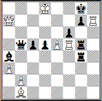

Der folgende Vierzüger — Weiß: **Kd8, Da7, Tf5, Th7, Lb1, p p. a3, b2, e5** (8); Schwarz: **Kg8, Db5, Tg4, Tg5, La4, p p. c5, d5, f6, g7** (9) — eines unbekannten Autors, enthalten in einer türkischen Handschrift: **1. Df7+! K:f7 2. T:f6+ Kg8 3. Th8+ K:h8 4. Tf8#**.

Die Zeit bis zur Mitte des 19. Jahrhunderts war für die Schachaufgabe und die Studie eine Phase der Synthese, doch später entwickelten sie autonome Wege. Hier ist der deutsche Schachspieler und Komponist J. Mendheim zu erwähnen, der Autor mehrerer Bücher. Das bedeutendste davon ist "Aufgaben für Schachspieler", welches zweiundachtzig Werke enthält.

**Nr. 11. J. Mendheim, 1832, Remis**


Nr. 11. Ein Fund, der bereits Zeitgenossen Aufmerksamkeit verschaffte: **1. Sd7 a2 2. S:f6 a1D+ 3. Ke6** — und Remis.

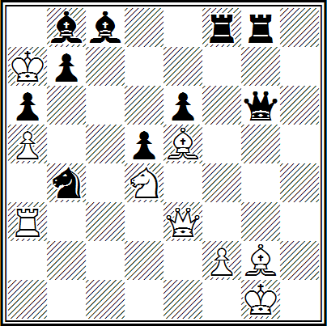

J. Mendgeheim, der als Erster die Schönheit der korrekten Mattsetzungen erkannte, entwickelte intensiv das bis heute aktuelle Spiel der Batterie, d. h. einer Stellung von zwei Figuren derselben Farbe auf einer Linie, bei der das Wegziehen der vorderen Figur (nach der die Batterie benannt ist) die Wirkung der weitreichenden Figur aktiviert: Weiß **Kg1, De3, Ta3, Le5, Lg2, Sd4, Ba5, f2**(8); Schwarz — **Ka7, Dg6, Tf8, Tg8, Lb8, Lc8, Sb4, Ba6, b7, d5, e6** (11). Matt in neun Zügen — **1. Sb5++ Ka8 2. Da7+! L:a7 3. Sc7+ Kb8 4. S:a6++ Ka8 5. Sc7+ Kb8 6. S:d5+ Ka8 7. Sb6+ L:b6 8. ab+ Sa6 9. T:a6X**.

Das Jahr 1836 markiert zudem die Gründung der weltweit ersten Schachzeitschrift "Palamède", deren Herausgeber Louis-Charles Labourdonnais war — einer der stärksten Schachspieler jener Zeit.

**Nr. 12. L. Ch. Labourdonnais "Palamède", 1837, Matt in 6 Zügen**  


Nr. 12. Die Stellung von Weiß ist so kritisch, dass Notmaßnahmen erforderlich sind: **1. c8S+! Ke8 2. Dg6+ Kf8 3. Df6+ Kg8 4. Se7+-** mit Matt in zwei Zügen.

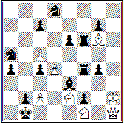

Interessant ist auch die symbolische Aufgabe mit patriotischem Inhalt des ersten russischen Schachmeisters Alexander Dmitrijewitsch Petrow (1794–1867) mit dem Titel "Napoleons Flucht von Moskau nach Paris", die 1838 in der Zeitschrift "Palamède" veröffentlicht wurde (erstmals wurde diese Aufgabe in einer leicht anderen Form in A. D. Petrows Buch "Das Schachspiel in systematischer Ordnung" veröffentlicht, das bereits 1824 erschien) — Weiß: **Kh2, Dh1, Lg6, Se2, Sf1, Bc2, c5, d4(8)**; Schwarz **Kb1, Tf4, Tf6, Le3, Sa5, Sd8, Ba4, b2, c4, c7, e6, f2, g4, g7(14)** — Matt in vierzehn Zügen.

Dies war vermutlich die weltweit erste originelle Aufgabe, die zu den symbolischen skakografischen Werken der Schachkomposition zählt. (Das Wort "Skakografie" leitet sich aus zwei griechischen Begriffen ab: scacho — Schach und grapho — schreiben.) "Skakografie", schrieb der russische Meister I. S. Schumow, "ist die Kunst, verschiedene Gegenstände oder abstrakte Vorstellungen auf dem Schachbrett darzustellen." Wie eine Art schachliches "Echo" reagierten symbolische Aufgaben auf verschiedene Ereignisse im politischen und militärischen Leben Russlands im 19. Jahrhundert.

In der vorliegenden Aufgabe wird Napoleons Flucht von Moskau nach Paris dargestellt. Das Feld a1 stellt Moskau dar, h8 Paris, die weißen Springer die russische Kavallerie und der schwarze König Napoleon. Das schachliche Schicksal des schwarzen Königs b1 erinnert sehr an das glorlose Ende des französischen Kaisers, der seine vielvölkische Armee in den weiten Weiten Russlands verlor.

Die Verfolgung des Königs durch die weißen Lanzen erinnert an die unaufhörliche Jagd der russischen Kavallerie unter Platov auf den Kaiser. Und als würde die Ironie noch gesteigert, trifft der einsame schwarze König auf seinem langen Weg häufig auf Überreste seines Heeres (Springer a5 und d8, Bauern a4, c4, c7), denen die Rettung ihres Gebieters bereits gleichgültig ist. Die Aufgabe wird nicht gelöst, sondern demonstriert.

**1. Sd2++ Ka2 2. Sc3+ Ka3 3. Sdb1+ Kb4 4. Sa2+ Kb5 5. Sbc3+ Ka6.**

In diesem Moment führt der Zug *6. Da8#* zum Matt. Dieser Zug darf jedoch nicht ausgeführt werden. Es stellt sich heraus, dass es zu früh ist, im sechsten Zug mattzusetzen, da die Aufgabe gemäß den Bedingungen in vierzehn Zügen gelöst werden muss.

In dem Bestreben, der historischen Wahrheit so nahe wie möglich zu kommen, gelang es Petrow durch dieses "Verbot", eine weitere Idee in die Aufgabe brillant einzubauen: Er deutet subtil auf die ungenutzte Möglichkeit hin, Napoleon bei der Überquerung des Flusses Berezina gefangen zu nehmen (wie bekannt, geschah dies durch die Schuld der unfähigen Kommandeure Tschitschagow und Wittgenstein, die Napoleon durch ein falsches Manöver in die Irre führten).

Die Diagonale a8–h1 stellt den Fluss Berezina dar. Als sich der schwarze König infolge des Angriffs der weißen Springer auf dem Feld a6 befand, hätte man ihn sofort mit dem Zug *6. Da8#* mattsetzen können, aber stattdessen drängten die Springer den König weiter auf das Feld h8. A. D. Petrow schreibt in einer Anmerkung zum sechsten Zug der Weißen: "Die Dame hätte Napoleons Weg versperren sollen, dann wäre er nicht nach Paris entkommen und hätte Schach und Matt erhalten."

Somit muss anstelle von *6. Da8#* der Zug **6. Sb4+** gespielt werden.

Danach geht die "Jagd" weiter: **6...Ka7 7. Sb5+ Kb8 8. Sa6+ Kc8** (die französischen Truppen sind hinter die Berezina zurückgedrängt worden) **9. Sa7+ Kd7 10. Sb8+ Ke7 11. Sc8+ Kf8 12. Sd7+ Kg8 13. Se7+ Kh8**, und die russische Armee beendet den Krieg siegreich — **14. Kg2#**.

Das originelle Werk von A. D. Petrow ist eines der besten Beispiele für eine symbolische Schachaufgabe mit militärischem Thema. Es erlangte schnell weltweite Bekanntheit. Viele Generationen der besten russischen und ausländischen Meister der Schachkomposition lernten an dieser Aufgabe, militärische Manöver auf dem Schachbrett darzustellen. Zwar mag diese Aufgabe manchen wie ein leichtes Spiel erscheinen, doch man erinnere sich, dass sie seinerzeit Schachzeitschriften auf der ganzen Welt durchlief und bis heute populär bleibt.

Somit war A. D. Petrow nicht nur der erste russische Schachmaestro, sondern auch der erste Schachkomponist.

**Nr. 13. A. D. Petrow, 1846, Matt in 6 Zügen**  


Nr. 13. **1. D:f4+ K:f4 2. Tf1+ Kg4 3. Tf4+!** (Zwei effektvolle Opfer im Stil von Stamma.) **3...K:f4 4. 0-0+!** (Kurze Rochade!) **4...Kg4 5. Se3+ Kh4 6. Sf3#**.

Neben A. D. Petrow waren im Russland des 19. Jahrhunderts auch K. A. Jaenisch, I. S. Schumow und insbesondere A. W. Galitzki als Autoren interessanter Kompositionen sehr bekannt.

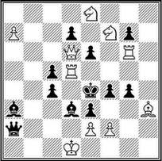

Der bedeutendste russische Meister und Komponist des letzten Jahrhunderts, K. A. Jaenisch, nannte eine seiner Aufgaben "Der eiserne Käfig von Tamerlan" — Weiß: **Kd1, Dd6, Td5, Tg6, Lh3, Se8, Sf7, pp. a7, e2, f2 (10)**; Schwarz: **Ke4, Da2, Sa3, Ld3, pp. c4, c5, d7, c3, e6, f4, g4, g7 (12)** — ein ersticktes Matt in zehn Zügen. So gerät der schwarze König in Gefangenschaft: **1. f3+ gxf3 2. exd4+ cxd4 3. Lf5+ exf5 4. Te6+ dxe6 5. Td4+ cxd4 6. La8+ Dd5 7. Lxd5+ exd5 8. Sf6+ gxf6 9. De5+ fxe5 10. Sg5#** — der König im Käfig!

Auf diese Weise hielt K. A. Jaenisch mithilfe einer alten Kombination für ein ersticktes Matt symbolisch den grausamen Umgang des zentralasiatischen Eroberers Tamerlan (Timur) mit seinen Gefangenen fest.

**Nr. 14. K. Jaenisch, 1837, Matt in 15 Zügen**  


Nr. 14. **1. Kg3 f5 2. Kf2 f4 3. Kf1 h5 4. Kf2 h4 5. Kf1 h3 6. Se5!** (Genau rechtzeitig! Sonst würden die Schwarzen sich verwirren.) **6...Kh2 7. Kf2 Kh1 8. Sg4 f3 9. Kf1 f2 10. S:f2+ Kh2 11. Se4 Kh1 12. Kf2 Kh2 13. Sd2 Kh1 14. Sf1 h2 15. Sg3#**.

Der russische Meister I. S. Schumow erlangte besondere Bekanntheit durch seine skachografischen Kompositionen. Wobei die symbolischen Werke von A. D. Petrow und K. A. Jaenisch in ihrem vielseitigen Schaffen eher episodischen Charakter hatten, arbeitete I. S. Schumow viele Jahre lang beharrlich und aus voller Überzeugung an der Schaffung symbolischer Aufgaben. Dies bezeugt sein Buch, das Anfang 1867 unter dem intrigierenden Titel "Sammlung skachografischer und anderer Schachaufgaben, einschließlich eines vollständigen Schach-ABC – matte politische, humoristische und fantastische..." erschien.

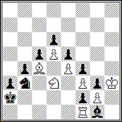

Zum Beispiel ist die folgende Aufgabe — Weiß: **Kh3, Tf1, Lc4, Sd3, Bauern d5, e4, f3, g2 (8)** und Schwarz: **Ka2, Lg1, Sb3, Bauern a3, b4, c5, d6, e5, f2, f4, g3 (11)** — ein Matt in acht Zügen. Sie wurde 1878 in der Zeitschrift "Wsemirnaja Illustratsija" veröffentlicht, und der Autor versucht darin, eine der wichtigsten Phasen des Russisch-Türkischen Krieges darzustellen — den heroischen Übergang der russischen Krieger über das Balkangebirge.

Die bildhaft angeordneten Figuren und Bauern stellen den kontinuierlichen Hindernisstreifen eines schwer passierbaren Gebirgszuges dar. Allein die Kette schwarzer Bauern ist bemerkenswert. Der Autor der Aufgabe schrieb zu dieser Komposition die folgenden Verse:

```text
Die Helden überquerten den Balkan!
Ihr schrecklicher Weg war nicht schnell:
Frost, die Türken und die Stürme —
All die feindlichen Mächte der grimmigen Berge,
Vereint zu bösen Hindernissen,
Versuchten acht Tage lang vergeblich,
Die kühnen Kräfte zu zerschlagen,
Die Bogatyre aufzuhalten.
Die Natur selbst ist besiegt!
Und fortan wird der Bulatstahl entscheiden!
Doch hier werden wir bis zum achten Zug
Leicht vorankommen — und Schwarz ist matt.
```

Die Lösung entwickelt sich wie folgt. Vom ersten bis zum siebten Zug bewegt sich der weiße König entlang der "Gebirgskette": **1. Kg4—f5—e6—d7—c6—b5—a4**. Und die Schwarzen? In dieser Zeit bewegen sie hilflos ihren Läufer nur vom Feld g1 nach h2 und von h2 zurück nach g1. Und schließlich folgt im achten Zug der entscheidende Schlag — **8. Lxb3#**.

Die russische Armee, deren "Rolle" auf dem Schachbrett vom weißen König "gespielt" wurde, hat dem türkischen Pascha "Matt" gesetzt.

**№ 15. I. Schumow, 1878, Matt in 4 Zügen nur mit dem Springer**  


Hier ist eine weitere, jedoch orthodoxe Komposition von I. S. Schumow (№ 15): **1. Tf6 b5 2. cxb ed 3. b7+ und 4. b8S#**. Der Kern der Aufgabe liegt darin, dass das Matt im vierten Zug nicht durch den Springer gesetzt wird, der bereits auf dem Brett steht, sondern durch einen neu entstandenen.

Der herausragende Problemist A. W. Galitzki stand an den Anfängen der modernen Schachaufgabe in Russland. Charakteristisch für ihn war das Streben nach einer künstlerischen Form bei Einhaltung aller konstruktiven Anforderungen, mit einer schönen, nicht offensichtlichen Lösung, um in den Aufgaben prägnante, interessante Kombinationen zu schaffen.

**Nr. 16. A. Galitzki, "Schachblatt", 1892, 1. Preis, Matt in 2 Zügen**  


Zum Beispiel (Nr. 16), mit einer schwierigen, effektvollen Hauptvariante: **1. La4!** (Zugzwang) — **1... Lxe4 2. Ld1X**, die eine Falle des weißen Läufers enthält.

**Nr. 17. A. Galitzki, "Strategie", 1911, Matt in 3 Zügen**  


Die Aufgabe (Nr. 17) zeichnet sich durch ein paradoxes Springeropfer aus. Das lineare *1. Se3(5)?* oder *1. h3?* führt zum Patt. Mit dem Manöver **1. Sb6** bereiten die Weißen auf den Zug **1... Kg4** die Antwort **2. Sbd5 Kh5 3. Sf6X** oder **2... h5 3. h3X** vor, und nach **1... axb** nutzen sie die Pattauflösung **2. h3 b5 3. g4X**.

Obwohl sich die Schachkomposition in Inhalt und Form in verschiedenen Entwicklungsphasen änderte, blieb sie in einem Punkt konstant: Sie fasste die Prinzipien und Gesetze der Entwicklung des Schachspiels poetisch und künstlerisch zusammen. Aus diesem Grund ist jeder historischen Epoche der Entwicklung der Komposition, ihres ideellen Gehalts und ihrer technischen Umsetzung ein eigener Stil, eine eigene Handschrift und ein eigenes schöpferisches Niveau eigen.

Alle Arten der Schachkunst — das praktische Spiel und die Komposition — formen sich nach denselben Prinzipien, einheitlichen Regeln und zeitgeprüften Gesetzen. Doch trotz der Gemeinsamkeiten und der Verbindung des praktischen Spiels mit der Komposition bestimmt jede Form ihre eigenen schöpferischen Mittel und spricht ihre eigene künstlerische Sprache.

Zum Beispiel vergleichen wir eine Partie, die hinter den Kulissen eines internationalen Turniers in London im Jahr 1851 gespielt wurde, mit der Aufgabe (Nr. 18).

**A. Anderssen — L. Kieseritzky**
**Königsgambit**

Hunderten von Seiten in Schachzeitschriften und Büchern sind dieser Partie gewidmet. Sie ist charakteristisch für Anderssens Spielweise. Während Kieseritzky ständig kleine Fallen stellte, strebte Anderssen danach, um jeden Preis einen Vorteil in der Figurenentwicklung zu erlangen und damit die Voraussetzungen für eine Kombination zu schaffen.

**1. e4 e5 2. f4 exf4 3. Lc4 Dh4+ 4. Kf1 b5.**

Der polnische Meister Lionel Kieseritzky war ein herausragender Schachspieler seiner Zeit, der für seine ungewöhnlichen taktischen Ideen berühmt war. Dies ist eine davon: Indem Schwarz den Gambitbauern zurückgewinnt, lässt er den Angriff des weißen Läufers auf das Feld f7 zu, öffnet seinen eigenen Figuren jedoch die Linien am Damenflügel.

**5. Lxb5 Sf6 6. Sf3 Dh6 7. d3 Sh5.**
Die Schwarzen drohen bereits, die Initiative zu übernehmen. *8. Kg1* ist nicht möglich (um *8...Sg3+* zu vermeiden) wegen *8...Db6+*.

**8. Sh4 Dg5?**

Dieses Manöver, das auf entsprechenden taktischen Überlegungen beruht, widerlegen die Weißen mit einem unerwarteten Figurenopfer. Richtig wäre *8...g6!* gewesen, um den Springer vom Feld f5 fernzuhalten und *9...Le7* zu drohen; im Falle von *9. g4 Sf6! 10. Sg2 Dh3 11. L:f4 S:g4* erhalten die Schwarzen Gegenspiel (angemerkt von Meister J. Neishtadt).

**9. Sf5 c6.**

Hier liegt der Plan der Schwarzen: Wenn der Läufer zurückweicht (wie sonst sollte man spielen?), folgt *10...d5!* mit aktivem Gegenspiel.

**10. g4! Sf6 11. Tg1!**

Eine wirkungsvolle Methode – durch das Opfern einer Figur vereiteln die Weißen die Absichten des Gegners und zwingen ihn zum Rückzug an allen Fronten.

**11... cb 12. h4 Dg6 13. h5 Dg5 14. Df3 Sg8 15. L:f4 Df6 16. Sc3.**

Hierin besteht die Idee Andersens: Für die Figur erhielt er einen enormen Entwicklungsvorteil, der ganz natürlich vielfältige Angriffsmöglichkeiten eröffnet. Die Schwarzen hingegen haben keine ausreichende Verteidigung.

**16. ... Lc5.**

Später werden Kritiker diesen Zug verurteilen, da die Weißen den Druck einfach und überzeugend durch *17. d4!* hätten liquidieren können. Was also den Schwarzen zu raten? Andere Fortsetzungen sind schließlich nicht viel besser. Dieser Zug stellt den Gegner zumindest vor einige Probleme. Hier zeigen sich die Nachteile der verzögerten Entwicklung der Schwarzen! Dass sie in eine solche Position geraten sind, spricht wenig für ihr Spiel. Andersen hingegen, seinem Prinzip treu – immer anzugreifen – nimmt weitere materielle Verluste in Kauf.

**17. Sd5?!**

Der Beginn eines schönen Plans, der das Opfern beider Türme vorsieht. Doch der Zug *17. d4* wäre einfacher, besser gewesen und hätte den Schwarzen Gegenchancen gelassen.

**17. ... D:b2 18. Ld6!**

Ein schöner Zug. Die Weißen bieten das Opfer beider Türme an, um den schwarzen König in ein Mattnetz zu treiben. *18...L:d6* ist nicht möglich wegen eines Matts in vier Zügen. (Die folgenden zwei Züge werden in vielen Handbüchern fälschlicherweise in umgekehrter Reihenfolge aufgeführt.)

**18. ... L:g1?**

Auch die Schwarzen bleiben ihrem Prinzip treu – alles zu nehmen, was möglich ist, da das Opfer schließlich auch ein Fehler sein könnte. Doch der mit diesem Zug verbundene Zeitverlust ist für die Schwarzen fatal. Gegenchancen hätten die Schwarzen durch *18...D:a1+ 19. Ke2 Db2!* erhalten. Nun ist der weiße Angriff unaufhaltsam.

**19. e5!!**

Schneidet die schwarze Dame von der Verteidigung des Feldes g7 ab.

**19. ... D:a1+ 20. Ke2 Sa6?**

Die Schwarz verteidigen das Feld c7, um einer offensichtlichen Mattdrohung entgegenzuwirken (*21. S:g7+ und 22. Lxc7*), übersehen jedoch, dass Weiß gleichzeitig eine zweite, maskierte Drohung geschaffen hat. Beide Drohungen hätten durch den besten Verteidigungszug *20...Sa6* abgewehrt werden können. Doch auch in diesem Fall, wie der Begründer der russischen Schachschule Michail Iwanowitsch Tschigorin bewies, wäre dies nutzlos gewesen, da Weiß auch danach nach *21. Sc7+ Kd8 22. Sxa6 Lb6 23. Dxa8* usw. mit unaufhaltsamen Drohungen einen Vorteil erlangt hätte.

**21. S:g7+ Kd8 22. Df6+ S:f6**

Das Damenopfer lenkt den Springer von der Verteidigung des Feldes e7 ab.

**23. Lxe7**.

Die abschließende Kombination ist tiefgründig und effektvoll. Siebzig Jahre später schrieb der herausragende tschechoslowakische Großmeister Richard Réti: "Die unsterbliche Partie, trotz ihrer zahlreichen Fehler. Denn ihre Fehler waren Fehler, die für jene Zeit typisch waren, während ihre unsterbliche Schönheit in den unsterblichen Ideen Andersens liegt."

**Nr. 18. C. Bayer, "Era", 1856, 1. Preis, Matt in 9 Zügen**  


Nr. 18. **1. Tb7! Dxb7 2. Lxg6+ Kxg6 3. Dg8+ Kxf5 4. Dg4+ Ke5 5. Dh5+ Tf5 6. f4+ Lxf4 7. Dxe2+ Lxe2 8. Te4+ dxe4**.

Somit wurden nacheinander alle weißen Figuren geopfert, und im Finale wird der weiße König von dem einzigen überlebenden Bauern unterstützt, der den entscheidenden Schlag versetzt — **9. dxe4**. Wie wir sehen, entsprechen beide Arten des Schachschaffens einer Epoche — der Blütezeit der Kombinationsperiode. In der praktischen Partie wurde die gesamte Fülle an Ideen, Plänen und taktischen Elementen genutzt. In der Aufgabe ist das Endziel des Spiels ebenfalls das Matt, und die Kriterien zur Bewertung ihrer künstlerischen Qualitäten sind Wirtschaftlichkeit, Einzigartigkeit der Lösung sowie die vollständige und erschöpfende Darstellung der Kombination.

"Der innere Gehalt einer Aufgabe", schrieb der deutsche Problemist F. Klett bereits 1878 in seiner Sammlung "Das Schachproblem", "besteht in der Kombination, das heißt in einer Kette von Ideen und Schlussfolgerungen, die mit einer unausweichlichen Konsequenz, wobei sie einander gemäß den Schachgesetzen aus entwickeln, zum Endergebnis führen — dem Matt. Der Wert einer Kombination ergibt sich einerseits aus ihrer Schwierigkeit, andererseits aus ihrer Schönheit."

Das ist richtig. Aber worin liegt dann der Unterschied zwischen einem Werk des praktischen Spiels und einer Komposition?

In einer praktischen Partie kämpfen zwei Gegner, während der kreative Prozess in der Komposition darin besteht, Stellungen mit einer bestimmten Aufgabe für eine der Seiten zu schaffen, in denen eine oder andere Idee in künstlerischer Form realisiert wird. In ihr konzentrieren sich gewissermaßen maximal die Ideen des praktischen Spiels, die in ihrer reinen Form wahrscheinlich niemals in einer Partie am Schachbrett vorkommen würden. Darüber schreibt der Schachweltmeister A. A. Aljechin in seinem Vorwort zum Sammelband von Aufgaben und Studien von F. Lazar (1928) anschaulich:

«... Die Idee der Komposition an sich ist mir zutiefst sympathisch. Ich wäre glücklich, ganz allein zu erschaffen, ohne die Notwendigkeit, wie es in einer Partie geschieht, meinen Plan mit dem Plan des Gegners abzustimmen, um etwas von Wert zu erreichen.

Ach, dieser Gegner, dieser Ihnen aufgezwungene Mitarbeiter. Jedes Mal weichen seine Vorstellungen von Schönheit von den Ihren ab, und die Mittel (Kraft, Vorstellungskraft, Technik) erweisen sich so oft als unzureichend, um Ihren Absichten aktiv beizustehen. Wie viele Enttäuschungen bringt er dem wahren Künstler im Schachwesen, der nicht nur auf den Sieg, sondern vor allem auf die Schaffung eines Werkes mit bleibendem Wert strebt.

Welch ein Leiden (unbekannt in irgendeinem anderen Bereich der Kunst oder Wissenschaft), zu spüren, dass Ihr Gedanke, Ihre Fantasie unausweichlich durch die Natur der Dinge durch den Gedanken und die Fantasie eines anderen gefesselt sind, die allzu oft mittelmäßig und immer tief verschieden von den Ihren sind...

Der Atem der wahren Kunst, befreit von allem, was mit unserer subjektiven Persönlichkeit verbunden ist, drückt sich in voller Freude in der Schöpfung des Komponisten aus: in seiner (von ihm allein geschaffenen) Aufgabe, in seiner Studie».

Und doch dient das reale Schachspiel als Grundlage für die Existenz der Komposition.

«Für die Schachaufgabe als Kunstwerk — schrieb der Begründer der Schachaufgabe in Russland, A. V. Galizki, — bildet die Schachpartie die Natur, das reale Leben. So wie die Natur — die Welt der Farben und Klänge — Elemente und Material für ein Werk der Malerei oder Musik liefert, so nehmen wir aus dem Schachspiel die Elemente für die Aufgabe, das Material für ihren Aufbau».

Die untrennbare Verbindung zwischen Komposition und Partie liegt nicht nur in der Gemeinsamkeit der Spieldisziplin, im gegenseitigen Durchdringen und der Bereicherung durch Ideen und Kombinationen, sondern auch, wie in jeder wahrhaftigen Kunst, in der emotionalen und ästhetischen Wirkung auf die Gefühle und Gedanken des Menschen. Und diese spezifische Besonderheit der Schachkunst ist beiden ihren Formen eigen: der Praxis und dem Komponieren; die bildende Kraft der Schachkunst liegt im kulturellen, gehaltvollen und kreativen Austausch.

Die gesamte Vielfalt der allgemeinen Schachbewegung, an der der Mensch teilnimmt und die auf ihn einwirkt, drückt sich in einem kreativen Ansatz zur Schachkunst aus: der Mensch wird in der gesamten Breite seiner Interessen und seiner Verbindungen zur Schachwelt erkennbar.

So drückt beispielsweise das Ergebnis einer gespielten Partie die Gefühle und die Einstellung eines Menschen zum Schach aus.

Was die Schachkomposition betrifft, so sind ihr aufgrund spezifischer Besonderheiten eigene Gesetze logischer und historischer Natur eigen. Im Laufe ihrer Entwicklung hat sie ein ganzes Arsenal an ihr eigenen künstlerischen Prinzipien, Ideen, Themen usw. hervorgebracht.

Wie bereits erwähnt, formierte sich die Schachkomposition als eigenständiger Bereich des Schaffens endgültig in der Mitte des letzten Jahrhunderts. Dieser Zeitraum gilt als Anfangsphase der Bildung einer Reihe von Schulen, Richtungen und Stilen. Kurz darauf erfolgte die konkret klare Herausbildung dreier eigenständiger Richtungen der Aufgabenkomposition: der *tschechischen*, *deutschen* und *englischen* Schule.

Charakteristisch für die Werke der tschechischen Schule ist das Vorhandensein von mindestens drei Varianten, die mit Modellmatts enden, das heißt, als primäres Element der Aufgabe wurde die Kombination schöner Mattpositionen vorausgesetzt, die gleichzeitig rein und ökonomisch sind. *Reines Matt* – ein Matt in einer Aufgabe oder einer Studie, bei dem alle Felder dem König aus einem einzigen Grund unzugänglich sind: sie sind entweder durch eigene Figuren besetzt oder werden genau einmal von gegnerischen Figuren angegriffen. *Ökonomisches Matt* – ein Matt in einer Aufgabe oder einer Studie, an dem alle Figuren teilnehmen, mit Ausnahme des weißen Königs und der Bauern aufgrund ihrer geringen Beweglichkeit.

Für die Aufgaben der deutschen (oder altdeutschen) Schule galt eine effektive, in einer Hauptvariante klar ausgeführte Kombination als Hauptelement, die von Opfern weißer Figuren begleitet wurde und in der Regel mit einem Modellmatt endete.

Im Gegensatz zur deutschen Schule betrachtete die englische Schule den Zweizüger als ihr primäres Genre. Die grundlegenden Anforderungen dieser Schule sind Vielfalt und Breite des Spiels bei maximal möglicher konstruktiver Klarheit. Diese lassen sich am einfachsten und anschaulichsten in der Form eines Zweizügers umsetzen.

Seitdem hat jedoch eine kritische Überprüfung der Ansichten über den Inhalt der Aufgaben der altdeutschen und englischen Schulen stattgefunden. Diese Revision erwies sich als äußerst fruchtbar und führte zur Entstehung neuer, heute weit verbreiteter Richtungen der Problemkomposition, die als logische und strategische Schulen bezeichnet werden.

Betrachtet man den unmittelbaren Prozess der Komposition, so bemerkt man, dass dieser in der Wahl einer Idee oder eines Themas und der Suche nach den Mitteln zu ihrer konstruktiven Umsetzung besteht. Zunächst betrachten wir drei Arten von Aufgaben: den Zwei-, Drei- und Mehrzüger.

**Nr. 19. C. Mansfield, "Ajedrez Argentino", 1927, Matt in 2 Zügen**  


Diagramm Nr. 19. Die Aufgabe wurde von dem englischen internationalen Kompositions-Großmeister Comins Mansfield (1896–1984) entworfen. Ein glänzender erster Zug **1. De7!** — die Dame scheint sich vom Geschehen zu entfernen — mit der Drohung **2. Txe6#**. Es ergibt sich eine Reihe subtiler Varianten: **1... Sxg7 2. Tf6#, 1... Sxf4 2. Tc3#, 1... Sxd4 2. Tc4#, 1... Sxe5 2. Txe5#, 1... Sdx5 2. Sf6#, 1... Sc7 2. Txe7#, 2...Kd5+ 2. Tc2#** und **1... Td5 2. Lxg5#**.

Achten Sie auf die Rolle der weißen Dame — ihre Position zementiert sozusagen das gesamte Spiel. In der Aufgabe wird die Idee der Halbfesselung realisiert: Nach dem Zug einer der schwarzen Figuren, die sich zwischen dem schwarzen König und der weißen Dame befinden, wird die andere gefesselt.

**Nr. 20. L. Loshinsky, I. UdSSR-Meisterschaft, 1947, 1. Platz, Matt in 3 Zügen**  


Nr. 20. Nach dem versteckten Einleitungszug **1. Db1!!** (im Hinterhalt) droht **2. Sh5+ Kxe4 3. Te3#**. Schwarz verteidigt sich, indem das Feld d4 frei gemacht wird: **1... Td5 2. Td4!!** und **3. Sh5#** oder **3. exd4#**; **1... Td6 2. Td5!!** — erneut im Fahrwasser des schwarzen Turms — **3. Sh5#** oder **3. Lxe5#**, **1... Td7 2. Td6!!** — der weiße Turm wird wie von einem Magneten angezogen.

Ihr Inhalt beschränkt sich jedoch nicht auf die aufgeführten Varianten; bei Zügen des schwarzen Turms entlang der Horizontalen **1... Tc4, 1... Tb4** und **1... Ta4** stellt sich der weiße Turm erneut daneben – **2. Tc3, 2. Tb3** und **2. Ta3** mit anschließendem **3. Sh5#**.

**№ 21. L. Loshinsky, "Schach-Moskau", 1964, 1. Preis, Matt in 6 Zügen**  


№ 21. Nach der Analyse der Lösung dieses Sechs-Zügers möchte man sagen: "Das Märchen wurde Wirklichkeit!" Vier schwarze Damen auf dem Schachbrett sind eine unglaublich furchteinflößende Kraft, doch selbst sie können das Matt des schwarzen Königs nicht verhindern: **1. Sd7 g1=D 2. Lc7 a1=D 3. Lf3 d1=D** und **4. Td4** – auf den Schnittpunkt der Wirkungslinien der schwarzen Damen. Wenn nun **4. ...Dd4**, dann **5. Lxd5+ Dxd5 6. Sf4#**; auf **4. ...Da1xd4** folgt **5. Sc5+ Dxc5 6. Te5#**; im Falle von **4. ...Dxd4** entscheidet **5. Sf4+ Dxf4 6. Lxd5#** und schließlich **4. ...Dgxd4 5. Te5+ Dxe5 6. Sc5#**.

**№ 22. A. Kazantsev, "Problem", 1967, 1. Preis, Gewinn**  


Als wäre sie aus einer Partie herausgegriffen, № 22: **1. e7! Sa3+ 2. Kb6 Sc4+ 3. Kc5 Da4 4. Txb4 Da7+ 5. Kxc4 Dxe7** – die Schwarzen scheinen ihr Ziel erreicht zu haben; die Hoffnung der Weißen – die zukünftige Dame – ist vernichtet. Doch ... **6. Sg6+! fxg6 7. Lf6+! Dxf6 8. Kd5+ Kg5 9. h4+ Kf5 10. g4+ hxg4 11. Tf4+ Lxf4 12. e4#** – alle Figuren sind geopfert, und einer von zwei verbleibenden Bauern setzt matt.

**№ 23. G. Zakhodyakin, "Schach-Blatt", 1930, 1. Preis, Remis**  


№ 23. Die Weißen haben keine Möglichkeit, die Umwandlung des schwarzen Fußsoldaten zu verhindern. Und sei es so... **1. g7+ Sxg7 2. Sf7+ Kg8 3. Lc5! f1=D 4. Sh6+ Kh8 5. Ld6!!** – und Remis. Ein fantastisches Zusammenspiel der weißen Figuren: Der Läufer kontrolliert den schwarzen Springer, der Bauer schützt den Springer, und der Springer den Läufer und den Bauern. Zum Beispiel **5. ...S— 6. Le5+ Sg7 7. Ld6**.

Wie wir sehen, werden Ideen, die im praktischen Spiel nur vereinzelt vorkommen, manchmal unklar erscheinen und zuweilen ganz im Hintergrund bleiben, in einer Komposition voll und deutlich realisiert.

Folglich erfordert es vom Autor kreative Vorstellungskraft, eine klare ideelle Konzeption und großes Können in deren Umsetzung, damit eine Aufgabe oder eine Studie zu einem Kunstwerk wird. Nur in diesem Fall wird das Werk den Schachliebhaber bewegen und inspirieren, da in einem echten Kunstwerk die künstlerische Form untrennbar mit dem thematischen Inhalt verbunden ist.

Wie die Erfahrung der Klassiker der Schachkomposition – der Brüder Platov, A. A. Troitzki, L. I. Kubbel, G. Ripka und anderen – gezeigt hat, sind die Möglichkeiten zur Bereicherung der Technik bei der Erstellung von Aufgaben und Studien wahrhaft unerschöpflich. Die von Problemisten und Studienkomponisten angewandten technischen Kniffe trugen zur künstlerischen Umsetzung der Idee bei, die die Grundlage des Werkes bildete.

Das Verständnis des Gesagten wird durch die Analyse zweier Positionen erleichtert, die in den goldenen Fundus der Schachkunst eingegangen sind. Eine davon ist eine bemerkenswerte Studie der Brüder Platov, die noch vor der Großen Oktobersozialistischen Revolution erstellt wurde; die andere ist ein Vierzüger des Großmeisters der UdSSR J. G. Wladimirow, der den zweiten Platz bei der VIII. Meisterschaft der Sowjetunion für Schachkomposition belegte.

**№ 24. V. und M. Platov, "Rigaer Tageblatt", 1909, 1. Preis, Gewinn**  


№ 24. Diese Studie ist dafür bekannt, dass Wladimir Iljitsch Lenin sie bemerkte und ihr eine hohe Bewertung beimass.

Die Lösung führen wir mit Kommentaren des Meisters des Sports für Schachkomposition A. S. Gurvich aus seinem Buch "Studien" (1961) an:

"In der Studie gibt es nur 4–5 Züge, aber wie tief und scharf man denken muss, um sie zu finden. Stellen Sie sich vor, dass diese Position in einer Partie entstanden ist: folglich ist im Voraus nicht bekannt, dass es hier eine originelle Gewinnmöglichkeit gibt.

Ein Schachspieler, der banal denkt, wird nach dem Einleitungszug *1. Lf6* und dem offensichtlichen *1... d4* sofort sehen, dass sein materieller Überlegenheit illusorisch ist, da der schwarze Bauer unweigerlich zur Dame wird, aber sofort wird ihm die Erfahrung eine Kombination nahelegen, mit der man die frisch beförderte Dame gewinnen kann. Er wird unweigerlich *2. Sf3* spielen und nach *2... a1D* triumphierend antworten: *3. L:d4+ D:d4 4. S:d4 K:d4*.

Nachdem er die Hauptgefahr relativ leicht beseitigt hat, wird unser Schachspieler schnell bemerken, dass der Gegner noch einen Tempozug für die Schlagen des Bauern d3 verlieren muss, was man nutzen kann, um den schwarzen Bauern h7 zu gewinnen und anschließend den eigenen zur Dame zu befördern. Doch nach *5. Kg4 K:d3 6. Kg5 Ke4 7. Kh6 Kf5 8. K:h7 Kf6* stellt sich heraus, dass es keinen Gewinn gibt, da auf *9. h6* (andernfalls geht der Bauer verloren) *9. ...Kf7* folgt und der weiße König eingesperrt ist. So erweist sich in dieser Position die gewohnte, schablonhafte Kombination als machtlos.

Doch nicht so bewegt sich der frische, scharfe, beharrliche und tiefe Gedanke, der es versteht, sich an das Unsichtbare zu klammern."

Nach **1. Lf6 d4** wird der nächste Zug der Weißen, **2. Se2!!**, unserem Schachspieler wie eine bloße Laune erscheinen. Denn hier erfüllt der Springer dieselbe Rolle wie auf dem Feld f3 – er greift den Bauern d4 ein zweites Mal an, und dass er dabei unter den Schlag des Königs gerät, ist von keiner praktischen Bedeutung, da der Springer aufgrund von 3. Lxd4 nicht geschlagen werden kann. Doch wenn die Weißen nach **2...Da1** "entgegen jeder Vernunft" **3. Sc1!!** spielen, auf das rettende 3. Lxd4+ verzichten und den Springer zudem erneut anbieten, versetzt dies dem "Weltbild" des schematisch denkenden Schachspielers einen schweren Schlag.

Was ist jedoch auf dem Brett passiert? Wenn man den Springer schlägt, wird die Dame gewonnen, allerdings nicht mehr auf der langen, sondern auf einer anderen Diagonale und unter Beibehaltung des Läufers. Nicht schlagen? Doch bei dem Springer auf c1 ist der Zug des Läufers nach g5 kein Schach, sondern... Matt. Ein völlig unerwartetes, verblüffend schönes Matt im Zentrum des Brettes.

Es ist jedoch Schwarz am Zug; sie können die Dame oder den König bewegen. Leider geraten die Schwarzen, wenn sie die einzige Möglichkeit nutzen, den König aus dem Mattnetz zu befreien (nach d2), in eine Springergafel (*4. Sb3+*) und verlieren die Dame. Wenn sie sich hingegen mit dem Zug **3...Da5** gegen das Matt wehren – da sie das Feld g5 von nirgendwo anders mehr unter Beschuss nehmen können –, folgt erst jetzt **4. Lxd4+**, und ob der König nun den Läufer schlägt oder nach d2 zurückweicht, die Springergafel auf b3 bringt den Weißen erneut den Sieg.

Welch reicher Komplex an schönen Ideen verbirgt sich in diesem vierzugigen Spiel einer so einfachen und leichten Stellung: ein Matt, das unrealistisch erscheint, so geisterhaft sein Auftreten ist, und vier verschiedene Wege, die Dame zu gewinnen, wobei keiner davon derjenige ist, der in der Ausgangsstellung sofort ins Auge springt.

Wie viel schwieriger ist es doch, die zwei wunderwirksamen Züge 2. Se2 und 3. Sc1 zu finden, als eine zehnzugige Remiskombination bis zum Ende zu berechnen. Und wenn es jemandem im praktischen Kampf gelungen wäre, die Geheimnisse dieser Stellung zu durchdringen und sie zu seinem Vorteil zu beenden, welches der "Evergreen"-Partien könnte da mit ihr mithalten?!

Und so kommentierte der damalige Schachweltmeister Dr. E. Lasker das Meisterwerk der Gebrüder Platov:

«Jeder Schachspieler sollte an dieser Studie das größte Vergnügen finden. Warum? Weil der Gewinn durch strengste Sparsamkeit der Mittel erreicht wird? Weil die beweglicheren und widerstandsfähigeren Figuren Schwarz bei allen Versuchen, wie durch Zauberei, den schwachen Figuren von Weiß zum Opfer fallen? Oder weil Weiß um jeden Preis versucht, ein Remis zu vermeiden? Vielleicht ist es im Grunde das, was uns freut, dass das Banale, das Gewöhnliche hier durch die Kraft des Denkens besiegt wird.»

Der Vierzieher ist das schwierigste Genre des modernen Problems, das die Breite eines Dreiziehers mit der Tiefe einer mehrzügen Kombination verbindet. Die technischen Schwierigkeiten bei der Konstruktion solcher Aufgaben sind sehr groß. Um sie zu überwinden, ist eine virtuose Technik erforderlich (was nicht jedem Komponisten möglich ist).

**Nr. 25. J. Wladimirow, "Problemblad", 1966, 1. Preis, Matt in 4 Zügen**  


Hier (Nr. 25) wird ein rätselhaftes Konzept präsentiert – ein zyklischer Wechsel der weißen Züge in der Lösung. Der glänzende Eröffnungszug **1. Kb1!!** ist organisch mit der Drohung **2. Tb4+ Kc5 3. Tb5+** und 4. **Txc5** verbunden. Die Hauptvarianten sind: **1... Sd7 2. Tc3+ dxc3 3. Se3+ fxe3 4. dx3**, **1... Se6 2. d3+ exd3 3. Tc3+ dxc3 4. Sxe3** und **1... Te5 2. Se3+ fxe3 3. d3+ exd3 4. Txc3**.

Es ist anzumerken: In der ersten Variante ist der zweite Zug von Weiß der vierte Zug von Weiß aus der dritten Variante, der dritte ist der zweite und der vierte ist der dritte. Eine Analogie sehen wir in der zweiten Variante im Verhältnis zur ersten und in der dritten im Verhältnis zur zweiten. Dies charakterisiert den zyklischen Wechsel der weißen Züge in der Lösung.

Tatsächlich ergibt sich die Schwierigkeit der Lösung aus der Tiefe des Konzepts, der Unauffälligkeit des Spiels, den leisen, nicht forcierten Zügen, die den Eindruck einer Schwächung der weißen Position erwecken sollen. Die Kombination wird durch Opfer der stärksten Figuren, die schwierigen ersten und nachfolgenden Züge der Fortsetzung sowie die Reinheit und Ökonomie des Finales verschönert.

**Nr. 26. M. Lipton, 1960, Matt in 2 Zügen**  


Betrachten Sie die Aufgabe (Nr. 26), bei der der Versuch einer Lösung durch die kurze Rochade *1. 0–0?!* mit der Drohung *2. Txe1*: *1... Ke4+ 2. Sx5* und *1... Ke2+ 2. Sd4* nicht funktioniert, da *1... bxc*. Ein Manöver mit dem Turm in die andere Richtung führt jedoch zum Erfolg — **1. 0–0–0!** mit der gleichen Drohung: **1... Ke4+ 2. Sg5** und **1... Ke2+ 2. Sf4**.

Es scheint, als wäre diese fantastische Stellung überhaupt nur in einer Komposition möglich. Würde in einer praktischen Partie jemals eine annähernd ähnliche Position entstehen? Doch die Partie zwischen dem amerikanischen Meister Ed. Lasker und dem Engländer D. Thomas (Nr. 27) führt uns in die Welt des Unglaublichen.

**Nr. 27. Ed. Lasker — D. Thomas, London, 1911, Weiß am Zug**  


In dieser Stellung opfert Weiß die Dame (!) und "zieht" den schwarzen "Monarchen" in den Nahkampf und treibt ihn in die hinteren Reihen, wo er kapituliert: **11. Dh7+!! Kxh7 12. Sxf6++ Kh6** (Aber nicht *12...Kh8* aufgrund von *13. Sg6#*) **13. Seg4+ Kg5 14. h4+ Kf4 15. g3+ Kf3 16. Le2+** (Nach *16. Kf1!* hätten die Schwarzen einen Zug früher mattgesetzt worden, aber dies ist keine Komposition, bei der der gegnerische König in einer vorgegebenen Anzahl von Zügen mattgesetzt werden muss) **16. ...Kg2 17. Th2+ Kg1 18. 0-0-0x!** oder **18. Sxd2.**

Doch das ist noch nicht alles. Es stellt sich heraus, dass man noch früher mattsetzen konnte und... ebenfalls durch eine Rochade, allerdings die kurze. Im vierzehnten Zug hätte man *14. f4+ Kxf4 15. g3+ Kf3 16. 0-0x!* spielen müssen (Sowie auch *16. Tf1+ Kg2 17. Tf2+ Kg1 18. 0-0x*).

Praxis und Komposition bereichern einander. Es stellt sich die Frage: Hat es für praktische Schachspieler einen Sinn, sich mit den Werken von Komponisten zu befassen? Zweifellos. Dies schult den kombinatorischen Blick und ermöglicht es, Aufgaben- und Studienideen in einer Partie anzuwenden.

**Nr. 28. M. Liburkin, "Schach in der UdSSR", 1934, 1. ehrende Erwähnung, Gewinn**  


In dieser Studie (Nr. 28) gewinnt Weiß, wenn es ihm gelingt, den Turm gegen beide schwarzen Springer abzutauschen. Doch einen solchen "vorteilhaften" Tausch durchzuführen, erweist sich als nicht so einfach: **1. Th8 Sfd7 2. Kc7 Ka7** (Ein Abwartezug.) **3. Te8!! Sf6! 4. Txb8 Se8+** (Der Springer kann nicht geschlagen werden, da dies zum Patt führen würde!) **5. Kd7!!** (Doch die Schwarzen geben nicht auf) **5. ...Sc7!** (Und hier folgt ein effektvolles Finale.) **6. Ta8+! Sxa8 7. Kc8 Sc7 8. Sxc7!**, schließlich hat Weiß den Turm abgetauscht.

Es ist anzumerken, dass diese Stellung nach dem fünften Zug in einer Partie berühmter Großmeister im Berlin von 1914 entstand. Die Partie endete so, wie es in der Studie gezeigt wird. Ch. R. Capablanca siegte gegen E. Lasker. Der inspirierte Schachkünstler M. S. Liburkin verwandelte sie in ein herausragendes Werk.

**Nr. 29. J. Kaem-NN, Dnepropetrowsk, 1956, Schwarz am Zug**  


In einer der Partien (Nr. 29), in der der Dnepropetrowsker Meisterkandidat J. Kaem mit Weiß spielte, rettete Weiß nach **1... a2** eine studienartige Pattmöglichkeit — **2. Ta3 Txa3 3. Td3+! Txd3**, Patt.

**Nr. 30. J. Kaem und V. Rudenko, "Schach in der UdSSR", 1957, Remis**  


Ein praktizierender Schachspieler nannte dieses Endspiel dem künftigen Internationalen Großmeister für Kompositionen V. F. Rudenko, und bald darauf entstand die Studie (Nr. 30). Nach **1. O-O-O+! Kg2 2. Tg5+ Lg4! 3. Txg4+ Kh3 4. Ta4 a2** entstand die bekannte Pattposition (Nr. 29).

**Nr. 31. A. Arulaid – B. Hugenidze, Woroschilowgrad, 1955, Weiß am Zug**  


Man hört von Schachspielern recht häufig von dem Nutzen von Aufgaben und Studien im praktischen Spiel.

Die Stellung (Nr. 31) kam in einer Partie vor, die bei einem Turnier in Woroschilowgrad im Jahr 1955 gespielt wurde. "Eingeschüchtert" von den gefährlichen schwarzen Bauern, die danach strebten, zu Damen zu werden, gaben die Weißen auf. Jedoch gab es für sie einen Weg zur Rettung: **1. Kd6! Kc8 2. Tc1+ Kb7 3. Tb1+ Ka6 4. Kc6 Ka5 5. Kc5 Ka4 6. Kc4 Ka3 7. Kc3 Ka2 8. Tf1! h5 9. Kd3 h4 10. Ke3 h3 11. Kf3** mit einem Remis.

**Nr. 32. B. Horwitz und I. Kling, 1851, Remis**  


Und doch wurde die Idee eines solchen Plans bereits über hundert Jahre vor dieser Partie in einer Studie (Nr. 32) aufgezeigt: **1. Kf4 Kh3 2. Kf3 Kh2 3. Ke3!** usw.

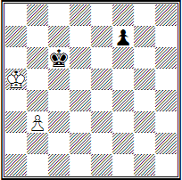

Internationalgrossmeister L. A. Polugaevsky führt als "lustigen Kasus" das Ende einer Partie zweier starker Großmeister an: L. Ljubojevic (Weiß) aus Jugoslawien und dem amerikanischen Schachspieler W. Brown, gespielt bei einem internationalen Turnier in Amsterdam im Jahr 1972 — Weiß: **Ka5, Bauer b3 (2)** und Schwarz: **Kc6, Bauer f7 (2)** — Schwarz am Zug.

Nach *39. ...f5? 40. Kb4* folgte eine Remise-Einigung, die beide Spieler als folgerichtiges Ergebnis betrachteten. Der Kasus lag nach Meinung von L. A. Polugaevsky darin, dass... einer der Zuschauer darauf hinwies, dass Schwarz mittels **39. ...Kd5!** den Sieg erringt: **40. b4 f5 41. b5 f4 42. b6 Kc6 43. Kab6 f3 44. b7 f2 45. b8D f1D+ 46. Ka5 Da1+** oder **40. Kb4 Kd4**, und Weiß hat keine Verteidigung.

**Nr. 33. N. Grigoriev 1928 Gewinn**  


Es steht außer Frage, dass die Großmeister mit der Studie (Nr. 33) nicht vertraut waren, doch der Amateur kannte sie offensichtlich. Denn diese Stellung ist fast ein Spiegelbild der Studie von N. D. Grigoriev, nur mit vertauschten Farben.

**1. Kd4! b5**.

Es hilft nicht *1... Kb5 2. Kd5 Ka6 3. f4! Kb7 4. f5 Kc7 5. Ke6! Kd8 6. Kf7 b5 7. f6 b4 8. Kg7 b3 9. f7* usw.

**2. f4 b4 3. f5 b3 4. Kc3 Ka3 5. f6 b2 6. f7 b1D 7. f8D+**.

Auf *7...Ka4* folgt *8. Da8+ Kb5 9. Db8+* mit Gewinn.

**7...Ka2 8. Da8x**.

**Nr. 34. Opochensky – P. Keres Buenos Aires, 1939 Schwarz am Zug**


Diagramm Nr. 34. Ende der Partie K. Opochensky — P. Keres, gespielt bei der Schacholympiade in Buenos Aires 1939: **1... Kb2 2. Tb8+ Ka2! 3. Tc8 Th4+ 4. Ka5 Kb2 5. Tb8+ Ka3 6. Tc8 Th5+ 7. Ka6 Kb4 8. Tb8+ Ka4 9. Tc8 Th6+ 10. Ka7 T:h7-+**

Möglicherweise hätte der damals noch junge Paul Keres länger grübeln müssen, bevor er die Partie zu einem siegreichen Ende führte, wenn er die bekannte Studie von E. Lasker nicht gekannt hätte — Diagramm Nr. 35.

**Nr. 35. E. Lasker, "Deutsches Wochenschach", 1890, Gewinn**  


Dies ist eine klassische Studie im Bereich der Turmendspiele. Die hier auftretende systematische Bewegung ist von großer praktischer Bedeutung. Ohne diese Studie wäre die Theorie der Turmendspiele nicht so vollständig.

Die Aufgabe scheint schwer lösbar, da der schwarze Bauer stark ist. Übrigens, stünde der schwarze König auf dem Feld a7, wären alle Versuche der Weißen zu gewinnen vergeblich. Ein geringfügiger Unterschied in der Position des Königs führt zu fatalen Folgen.

**1. Kb8!** Man darf nicht zögern. Nach *1. Tf3 Ka7!* ist den Schwarzen nichts mehr zu befürchten.

**1... Tb2+ 2. Ka8 Tc2 3. Tf6+ Ka5.** Hier und im Folgenden weicht der schwarze König auf der a-Linie zurück, um Schach auf der b-Linie geben zu können. Ein Zug nach b5 ist nicht einmal in Erwägung zu ziehen. Es würde sofort **4. Kb7** folgen und der Kampf wäre beendet.

**4. Kb8(b7) Tb2+ 5. Ka7 Tc2 6. Tf5+ Ka4. 7. Kb7.** Natürlich wäre auch 7. Kb6 möglich, aber das wäre wie ein unwegräumbares Staubkorn auf dem reinen Antlitz der Studie.

**7... Tb2+ 8. Ka6 Tc2 9. Tf4+ Ka3 10. Kb6.** Droht *11. T:f2*.

**10... Tb2+ 11. Ka5.** Gute Arbeit. Der König schafft es, den Bauern abzusichern, und beteiligt sich aktiv am Angriff.

**11... Tc2 12. Tf3+ Ka2 13. T:f2! T:f2 14. c8=D**, und Weiß gewinnt. Sieg.

Folglich half P. P. Keres das Rezept der Studie von E. Lasker. Tatsächlich beschäftigte sich unser herausragender Großmeister selbst aktiv mit der Komposition und veröffentlichte seit 1929 etwa 180 Aufgaben und 30 Studien. Er ging mehrfach als Sieger aus sehr angesehenen Wettbewerben hervor. Bei der ersten Meisterschaft der Sowjetunion für Schachkomposition belegte er im Bereich der Studien den 3. Platz.

Die Gedanken von P. P. Keres zur Komposition harmonieren mit denen von Aljechin:
«Komposition ist ein Bereich, der schon immer große Aufmerksamkeit bei Schachliebhabern erregt hat. Hier besteht die Möglichkeit, eigene Ideen ohne die Einmischung eines Gegners zu verwirklichen, was eine vollständige künstlerische Freiheit bedeutet. Es ist bekannt, dass jeder Schachspieler, ob Anfänger oder Erfahrenster, eine besondere Freude empfindet, wenn er nach langem Überlegen die Lösung einer kniffligen Position – einer "Nuss" – findet...».

Um ein Schachkomponist zu sein, reicht es nicht aus, eine "schöpferische Ader" oder Interesse am Schachspiel zu besitzen. Ebenso genügen nicht etwa die Qualitäten, die für einen exzellenten Mathematiker oder Physiker erforderlich sind. Komposition ist nach unserer Ansicht in erster Linie eine Kunst, da sie einen kreativen Prozess darstellt.

Ein Schachkomponist muss im Gegensatz zu einem Schriftsteller oder Künstler seine Werke "sparsam" konstruieren: Er darf nicht "verschwenderisch" sein, sondern muss genau jenes Material – Bauern und Figuren – verwenden, das für das gewählte Schema des Problems oder der Studie notwendig ist, um Defekte zu vermeiden, während die Seele die Zufriedenheit erfährt. Auch die Wahl des Schemas sollte in der einfachsten Variante erfolgen – was nicht leicht zu erreichen ist.

Beständigkeit, Wille, die Fähigkeit, Schwierigkeiten zu überwinden, sowie Ausdauer und Geduld sind unverzichtbare Eigenschaften eines wahren Komponisten. Dass er über eine schöpferische Fantasie verfügen muss, versteht sich von selbst. Denn ohne diese ist es unmöglich, die Ziele der Schachkomposition zu erreichen.

Ich erinnere mich an die naiven Befürchtungen meiner eigenen Anfänge, als es schien, als hätten die etablierten Komponisten bereits alles geschafft und alles erfunden. Die Genres waren längst definiert, die Themen entdeckt. Und ich entdeckte immer wieder das bereits Entdeckte. Die weitere praktische Tätigkeit bewies jedoch, wie sehr ich mich geirrt hatte. Es stellte sich heraus, dass Ideen vorangebracht werden, um neue, noch komplexere zu entdecken.

Als das erste Zwei-Zug-Problem gelang, entstand der unwiderstehliche Drang, ein zweites zu setzen. Dann kam der Wunsch, ein Drei-Zug-Problem, ein Mehr-Zug-Problem und schließlich eine Studie zu "konstruieren".

Sich ein Ziel setzen, suchen, finden und sich irren, experimentieren, sich freuen und enttäuschen, und schließlich – der Triumph des Sieges. Ist das nicht eine große Genugtuung? Und jeder empfindet sie, der auf der Suche ist, insbesondere aber derjenige, der Neues, Unbekanntes findet. Und je schwieriger das Ziel zu erreichen ist, desto größer ist die Genugtuung, wenn es erreicht wurde.

Von der ersten Mansuba bis zu den modernen Aufgaben und Studien ist eine enorme Distanz zurückgelegt worden. Die Schachkomposition ist in der Presse recht weit verbreitet. In jeder Region unseres Landes arbeiten Schachkommissionen und Verbände, uns stehen erstklassige Vereinsgebäude zur Verfügung, in denen Millionen von Schachliebhabern trainieren, sowie die Hilfe erfahrener Trainer.

## OBLIGATORISCHE UND KÜNSTLERISCHE ANFORDERUNGEN AN DIE SCHACHKOMPOSITION

Es wurde bereits erwähnt, dass sich im Prozess der Entwicklung der Komposition künstlerische und formale Anforderungen an Schachwerke herausgebildet haben, deren Kenntnis für den Komponisten und den Löser unerlässlich ist.

Eine Aufgabe oder Studie gilt als korrekt, wenn sie eine Lösung besitzt und diese Lösung einzigartig ist, sowie wenn die Stellung der Figuren im Spiel aus ihrer Ausgangsposition erreicht werden kann. Hier sind einige Beispiele.

**№ 36. Ju. Suschkow 1981 Matt in 2 Zügen**  


№ 36. Zunächst wird die Drohung *2. Sg6#*, die nach *1. Sf-?* entsteht, durch den Zug *1... d4* widerlegt, wodurch der Läufer e4 befreit wird (auf *1... Tg8* folgt *2. Df6#*). Daher spielen Weiß genauer *1. Sd6!?*, um die Drohung und die Variante beizubehalten (nach *1... d4* ist nun *2. T:e4#* möglich). Jedoch ist *1... Sd4!* – der Läufer ist wieder befreit. Schließlich wird der korrigierte Zug *1. S:g3!?* durch eine dritte Befreiung des Läufers *1... Ld4!* widerlegt.

Weiß verzichtet dann auf die Möglichkeit, Matt mit 2. Sg6# zu setzen, und befreit deshalb denselben Läufer selbst – **1. Sd4!** mit der Drohung **2. Se2#**, wobei die Dame blockiert wird, die in der Variante **1... Tg8** matt setzt, und dem schwarzen König ein freies Feld überlassen wird. Doch nun eröffnen die Schwarzen, indem sie **1... Ke5** spielen, den Weißen die Möglichkeit, den Zug **2. Sg6#** zu machen. Auf **1... S:d4** und **1... L:d4** folgen die Matts **2. Ld6#** und **2. D:g3#**. Wenn **1... Ld3**, dann **2. Se6#**.

Die Paradoxie der Aufgabe wird noch dadurch verstärkt, dass der Einleitungszug genau auf das Feld gemacht wird, auf dem die Schwarzen die Realisierung der weißen Absichten verhindern.

**№ 37. W. Melnichenko und W. Rudenko "Schach", 1980, 1. Preis Matt in 3 Zügen**  


№ 37. Die Autoren haben ein klassisches Werk über das moderne Vladimirov-Thema (oder aserbaidschanische Thema) in drei Varianten geschaffen. Das Verdienst der Komponisten liegt zudem darin, dass es ihnen gelang, ein bekanntes Zwei-Zug-Thema in einer spezifischen Drei-Zug-Form bei leichter Konstruktion auszuarbeiten und dabei das Paradoxon der Änderung der Zugfolge geschickt zu motivieren.

Die Versuche *1. Ta8?*, *1. Tb8?*, *1. Tc8?* werden von Schwarz mit den Zügen *1... Ta7!*, *1... Tb7!* und *1... Tc7!* widerlegt, wonach *2. e4?* wegen des En-Passant-Schlags nicht funktioniert.

In der Lösung folgt nach **1.e4!** ein Zugzwang; die ersten Züge aus den Versuchen erfolgen auf die Züge, die zuvor die Versuche widerlegten: **1... Ta7 2. Ta8!, 1... Tb7 2. Tb8!** und **1... Tc7 2. Tc8!**, und Schwarz befindet sich erneut im Zugzwang, da das Recht auf den En-Passant-Schlag verloren gegangen ist (falls jedoch 1... dxe4, dann 2. Th4! mit dem unaufhaltsamen 3. Tc4#). Eine bekannte Regel des Schachspiels bildete die Grundlage für den Wechsel des Spielverlaufs in der Aufgabe.

**№ 38. J. Breuer, 1938, Matt in 5 Zügen**  


Hier (№ 38) verleiht die Anordnung aller acht schwarzen Bauern der Position eine natürliche Wirkung. Zudem scheint die Aufgabe — Matt in fünf Zügen — fast unmöglich. Tatsächlich: Das lineare 1. Td1 oder 1. Tc1 führt nicht zum Ziel, da der angegriffene Bauer sofort durch einen Kameraden gedeckt wird.

Die Belagerung der Bauernbastionen muss von der anderen Seite des Brettes aus erfolgen — **1. 0-0-0!** Die Rochade ist in Aufgaben zulässig, sofern kein Beweis vorliegt, dass der König oder der Turm ihre Ausgangsfelder verlassen haben. **1... d5** ist die natürliche Verteidigung, aber nun ist ein einfacher, typischer Trick zum Durchbrechen der Bauernkette möglich: **2. Tf1! f5 3. Te1**, und in der Bauernfestung entsteht eine Lücke, da der Bauer e6 nicht mehr verteidigbar ist und der entscheidende Zug folgt: **4. T:e6 (e5)** mit dem unvermeidlichen **5. Te8#**.

**№ 39. B. Horwitz und I. Kling, 1851, Gewinn**  


Eine Endspielstudie (№ 39) hingegen muss, wie wir bereits erwähnt haben, so weit wie möglich dem Ende einer tatsächlich gespielten Partie ähneln.

Zwei schwarze Bauern drängen unaufhaltsam zur ersten Reihe und scheinen kurz davor zu stehen, zu einer gewaltigen Macht zu werden — indem sie sich in Damen verwandeln. Doch Weiß ergreift Notmaßnahmen und gewinnt:

**1. Da6+! Ke3 2. De6+ Kf3 3. Df5+ Ke3 4. Df2+ Kd3 5. Df3+** mit anschließendem **6. D:e2!** Falls **2... Kd3**, dann **3. Df5+ Kd4 4. Df4+ Kd3 5. Df3+** und **6. D:e2** ebenfalls mit Gewinn.

Die betrachteten Werke aller Hauptgattungen der Komposition belegen, dass Eindeutigkeit, Klarheit und Reinheit der Lösung die Hauptkriterien für die Vollkommenheit eines Schachwerks – einer Aufgabe oder einer Studie – sind.

Die wichtigsten künstlerischen Anforderungen an eine Komposition sind: Ausdruckskraft der Idee, Ökonomie und Schönheit der Lösung. Diese werden durch die Prinzipien der Einheit von Form und Inhalt sowie der harmonischen Übereinstimmung der ideellen Absicht und der zur ihrer Umsetzung eingesetzten Mittel bestimmt.

Die Ausdruckskraft der Idee liegt in der deutlichen Hervorhebung der thematischen Varianten, die die Absicht des Autors verkörpern. Eine Komposition, in der diese Absicht in einer maximalen Anzahl ideeller Varianten zum Ausdruck kommt, wird als Rekordaufgabe oder Rekordstudie bezeichnet, beziehungsweise als Task-Aufgabe und Task-Studie.

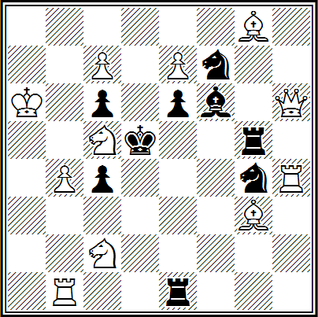

**G. Baev, 1930**. Weiß: **Ka6, Dh6, Tb1, Th4, Lg3, Lg8, Sc2, Sc5, Bb4, c7, e7 (11)** und Schwarz: **Kd5, Te1, Tg5, Lf6, Sf7, Sg4, Bc4, c6, e6 (9)** — Matt in zwei Zügen.

Das betrachtete Beispiel ist eine Rekordaufgabe (mit anderen Worten eine Task-Aufgabe) — sechs Verdeckungen schwarzer Figuren auf einem Feld. Aufgrund der Komplexität der Idee musste der Problemsteller im ersten Zug einen Bauern in einen Springer umwandeln: **1. c8S!** mit der Drohung **2. Sb6#** — **1... e5 2. L:f7#, 1... Sge5 2. Td4#, 1... Le5 2. D:e6#, 1... S7e5 2. L:e6#, 1... Tge5 2. Dd2# und 1... Te5 2. Td1#**.

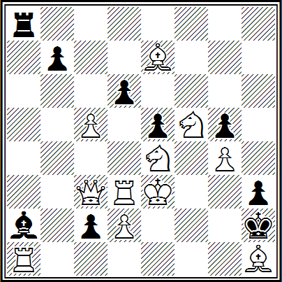

**L. Loshinsky, 1940**. Weiß: **Ke3, Dc3, Ta1, Td3, Le7, Lh1, Se4, Sf5, Bc5, d2, g4 (11)** und Schwarz: **Kh2, Ta8, La2, Bb7, c2, d6, e5, g5, h3 (9)** — Matt in drei Zügen.

Ebenfalls eine Task-Aufgabe. In sechs Varianten (das ist das maximal Mögliche!) wird das Ventil-Thema dargestellt: Der schwarze Läufer schaltet, während er den Weg des Turms zum Feld a1 öffnet, dessen Wirkung auf anderen Linien aus.

**1. Tc1!** mit der Drohung **2. Lf3** und **3. Th1#**: **1... Lb3 2. T:d6 und 3. D:e5#, 1... Lc4 2. Se:d6, 1... Ld5 2. cd, 1... Le6 2. L:d6, 1... Lf7 2. Sf:d6, 1... Lg8 2. Kf2 und 3. T:h3#**.

Es scheint, als seien die weißen Figuren nicht ausreichend belastet, aber das ist nicht der Fall: Alle verdecken entweder Linien, kontrollieren Felder oder spielen in mindestens zwei Varianten.

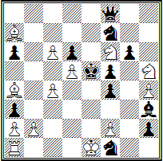

**V. Savchenko. "Schach-Moskau", 1970, 1. Preis.** Weiß: **Ke1, Ta1, La4, La7, Sf6, Sh5, Ba2, b2, c4, c6, d5, f2, h4 (13)** und Schwarz: **Ke5, Df8, Lh3, Sf1, Sf7, Ba3, a6, d6, f4, f5, g6, h2 (12)** — Matt in acht Zügen.

*1. Td1?* funktioniert nicht wegen *1... Sd2 2. T:d2 h1D+!*. Auf den ersten Blick ändert auch **1. 0—0—0** wenig, da ein neues Schach entstanden ist — **1... ab+**, und es geht weder *2. K:b2 Db8+!* noch *2. Kb1 Sd2+!*.

Doch nun wurde das Unerwartete unternommen: **2. Kc2! Db1+ 3. Kc3 Db2+ 4. Kd3!**, wobei zum dritten Mal auf den Schlag der Dame verzichtet wurde! Die Drohungen **5. Sd7x** und **5. Te1+** erzwingen ein weiteres Damenopfer, das Weiß bereits annimmt: **4. ...De2+ (4. ...Da3+ 5. Lb3) 5. Kxe2 f3+ (5. ...Sg3+ 6. Kd3 Lf1+ 7. Rxf1) 6. Ke1.**

Der König ist in seine Ausgangsposition zurückgekehrt, aber in der Stellung der Schwarzen ist eine "Schwäche" entstanden – das Feld f3 ist blockiert, und nach **6. ...Sd2** folgt **7. Sd7+ Ke4 8. Lc2x**. Eine außerordentlich effektive und präzise ausgeführte logische Kombination!

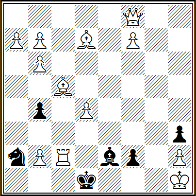

**W. Korolkow, 1929**. Weiß: **Kh1, Df8, Tc2, Lc5, Ld7, pp. a7, b2, b6, b7, d4, f7, h2 (12)** und Schwarz: **Sd1, Le2, Sa2, pp. b4, f2, h3 (6)** — Gewinn.

Weiß hat eine kolossale Materialüberlegenheit, aber seinem Monarchen drohen Mattangriffe, und ein heftiger Angriff beginnt.

**1. Td2!+ Sc1**. Wenn *1... Kxd2*, dann *2. Dh6+* und *3. Dxh3*, wodurch sofort alle Drohungen beseitigt werden.

**2. Td1!+ Kxd1 3. La4+ b3!** Vorsorglich wird der Läufer von der Diagonalen a4-e8 auf die Diagonale a2-g8 überführt. Deutlich schwächer ist *3...Ke1 4. Lxb4+ Sc3 5. Lxc3+ Kf1 6. Lb5 Lxb5*, und das Feld c6 muss verteidigt werden – 7. Dc8! und das bekannte 8. Dh3+.

**4. Lxb3+ Ke1 5. Lb4+ Sc3!** Die Feinheit des Opfers wird nach dem elften Zug der Schwarzen klar werden.

**6. Lxc3+ Kf1**. Die ersten Anzeichen eines Patts treten auf – es gibt kein *7. Ld5? Lf3+ 8. Lxf3*, Patt.

**7. Lc4! Lxc4 8. Dc5!** Das Feld d5 muss verteidigt werden – genau deshalb *3...b3!*

**8... Ld3 9. Db5!** Die Reihen der Weißen schwinden.

**9... Lxb5 10. b8S!** – und werden sofort durch neue Kämpfer verstärkt!

**10... Ld3! 11. a8L!!** Aber nicht *11. a8D? Le4+ 12. Dxe4*, Patt.

**11... Le2!** Drohend ist *12...Lf3+ 13. Lxf3*, Patt. Der zusätzliche Sinn des Opfers *5...Sc3!* wird deutlich – es dient nicht nur der "Materialreduzierung" zugunsten eines Patts, sondern lockt den weißen Läufer auf das Feld c3, wo er zwischen seinen eigenen Bauern b2 und d4 eingezwickt ist und daher den schwarzen König nicht aus dem Patt befreien kann, indem er die Diagonale a5-e1 verlässt.

**12. f8T!!**, und Gewinn (nicht *12... Lf3 13. Txf3*, und das Feld e2 ist frei). Drei weiße Bauern in Folge haben sich in verschiedene schwache Figuren verwandelt! Und sie verharren auf dem Brett als Erinnerung an die Rätsel, die die Schwarzen den Weißen gestellt haben, und an den einfallsreichen Kampf der Parteien (siehe IL Nr. 19).

Man muss sagen, dass derzeit über dreihundert Kompositionsthemen bekannt sind, doch alle basieren nur auf sieben grundlegenden taktischen Ideen: Blockieren von Feldern am schwarzen König, Besetzen dieser Felder mit weißen Figuren, Ablenkung, Übersperrung, Fesselung schwarzer Figuren (durch Selbstfesselung oder Halbfesselung), Entfesselung weißer Figuren und Schachgebote gegen den weißen König.

Da jedoch der Aufbau von Aufgabenkompositionen, in denen eine Idee in einer maximalen Anzahl von Varianten verkörpert wird, in der Regel zu sperrigen, wenig künstlerischen Werken führt, die eher von technischem Interesse sind, widerspricht dies natürlich dem Prinzip der Ausdruckskraft und der Ökonomie der Form. Denn die Ökonomie der Form zwingt den Autor, sein Vorhaben mit minimalen Mitteln umzusetzen. Die allgemeinen Prinzipien der Formökonomie unterteilen sich ihrerseits in drei Unterprinzipien: Ökonomie der Ausgangsposition, des Spiels und des Finales.

**Nr. 40. L. Kubbel, 1939, Matt in 2 Zügen**  


Zum Beispiel zeichnet sich die Ökonomie der Ausgangsposition durch die Beteiligung aller Figuren an der Lösung aus. Hier (Nr. 40) ist in miniaturhafter Form die Idee der langen weißen Rochade in Verbindung mit einem Schach gegen den König realisiert: **1. O-O-O! a1D+ 2. Sb1#** und **1... Kc3 2. Se4#**.

**Nr. 41. S. Loyd, 1857, Matt in 3 Zügen**  


Figuren, die dazu dienen, Nebenlösungen (Duals), Unlösbarkeit usw. zu vermeiden, sind technische Figuren und spielen eine unterstützende Rolle. Zum Beispiel ist (Nr. 41) die Lösung einer Miniatur-Aufgabe (Gesamtzahl der Figuren nicht mehr als fünf): **1. Tf4!** — Zugzwang: **1... Kxg3 2. O-O! Kh3 3. Tf1#** und **1... Kxh1 2. Sf2 Kh2 3. Th4#** — sehr interessant. Aber wozu dient hier der Bauer g3? Es stellt sich heraus, dass die Aufgabe ohne ihn Nebenlösungen hätte: *1. Tfg1+ Kf3 2. Th4 Ke3 3. Tg3#* und *1. Thg1+ Kh2 2. Tg8 und 3. Th1#*. Folglich ist dies eine technische Figur, die einen Defekt der Aufgabe behebt.

Daher muss der Komponist eine Verringerung der Anzahl technischer Figuren und die Verwendung aller weißen Figuren in den thematischen Varianten anstreben und dadurch die Leichtigkeit der Konstruktion eines Schachwerks gewährleisten.

**Nr. 42. R. Kofman, 1939, Matt in 3 Zügen**  


In einfacher Form gelang es dem Autor (Nr. 42) zum ersten Mal in einem Dreizüger mit Modellmatts, das Thema des komplexen Blockierens in drei Varianten durchzuführen: **1. Lc2! Ta6 2. d4+ (Drohung) cxd3 3. f4#**, **1... c4 2. Sc6+ Kd5 3. Le4#** und **1... cxb2 2. Sxb4 Tf5 3. Te4#**.

Hier wurden die Prinzipien der Formökonomie strikt eingehalten: Die Ökonomie der Mittel und insbesondere die Ungezwungenheit des Aufbaus sind beeindruckend.

**Nr. 43. R. Réti, 1928, Remis**  


Die letzte Anforderung – die maximale Annäherung der Ausgangsposition an eine Position aus einer praktischen Partie – muss bei der Komposition von Endspielstudien zwingend erfüllt werden. Als Beispiel für das Gesagte eignet sich bestens die berühmte Studie des tschechischen Großmeisters R. Réti (Nr. 43), die an das Ende einer Partie erinnert, die in einer hoffnungslosen Situation vertagt wurde. Doch, so erstaunlich es auch sein mag, ein einziger weißer Bauer erzwingt ein Remis gegen drei verbundene Freibauern des Gegners.

**1. Kg6 Kb6 2. Kxg7 h5 3. Kxf6 h4 4. Ke5 h3 5. Kd6 h2 6. c7**, und Remis. Es ändert nichts an der Sache und **1... h5 2. Kxg7! h4 3. Kxf6 Kb6 4. Ke5! Kxc6 5. Kf4 h3 6. Kg3 h2 7. Kxh2** – der König holt den Bauern an der Schwelle zu seiner Umwandlung ein.

Das Hauptkriterium, das die Ökonomie des Spiels in einer Aufgabe charakterisiert, ist die Übereinstimmung der Anzahl der Züge der Lösung mit dem Kompositionsplan. Das heißt, wenn zur vollständigen Umsetzung der Idee nur drei Züge erforderlich sind, ist die Umsetzung des Plans im Genre der Mehrzugaufgaben völlig ungerechtfertigt.

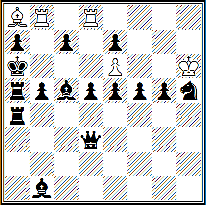

**A. Popandopulo. "Wetschornij Kyjiw", Wettbewerb zum 1500. Jahrestag der Stadt Kiew, 1982, 3. ehrende Erwähnung**. Weiß: **Kh6, Tb8, Td8, La8, p. e6 (5)** und Schwarz: **Ka6, Dd3, Ta4, Ta5, Lb1, Lc5, Kh5, pp. a7, b5, c7, d5, e7, e5, f5, g5 (15)** — Matt in fünfzehn Zügen.

Die in der Ausgangsposition bereits stehenden zwei weißen Batterien können keinen entscheidenden Schlag versetzen – es fehlt ihnen an Reichweite. Hätte es jedoch den weißen Bauern e6 nicht gegeben, wäre die Entstehung einer dritten, gegensätzigen Batterie möglich gewesen, die dann den Ausgang des Kampfes entschieden hätte. Alle Batterien – zwei unterstützende und die Hauptbatterie – kommen zweimal zum Einsatz.

**1. Lb7+ Kb6 2. Lc8+ Kc6 3. Ld7+ Kd6.** (Auf 6. ...K folgt 7. Tf8#.) **6. Lc8+ Kc6 7. Lb7+ Kb6 8. Lxd5+ Ka6** — der König ist in seine Ausgangsposition zurückgekehrt. **9. Td6+! cxd6 10. Le6 De4 11. Lc8+ Db7 12. Txb7 Le4 13. Tb8+ Lb7 14. Txb7 und 15. Tb8#**.

Somit endet das Hauptspiel (das erzwungene Manöver von Weiß) mit einem effektvollen Turmopfer, während der letzte Teil der Lösung einen künstlich verlängerten, wenig interessanten Charakter hat. Es stellt sich die Frage: Warum sah sich der bekannte sowjetische Mehrzug-Komponist veranlasst, der Hauptidee einen "Fremdkörper" beizufügen?

Was die Ökonomie des Spiels in der Studie betrifft, so wird diese durch die künstliche Verlängerung der Lösung nicht beeinträchtigt und kehrt nach einigen Zügen zum ursprünglichen Plan des Autors zurück. Zudem müssen in einer Studie alle Figuren ihre Möglichkeiten maximal ausschöpfen (gemeint sind ihre Beweglichkeit, Dynamik usw.), das heißt, ihr Wirkungsgrad muss bis zum Äußersten gesteigert werden.

**Nr. 44. A. Troitsky, UdSSR-Meisterschaft, 1929, 7. Platz, Gewinn**  


Nr. 44. Äußerst selten finden sich in der weltweiten Schachliteratur Stellungen, in denen die Aufgabe zu gewinnen ein solches Erstaunen auslösen würde wie in der betrachteten Studie. Bei einem Remis-Materialverhältnis bescheidener Kräfte befinden sich die gegnerischen Figuren in maximaler Entfernung voneinander, und es gibt keinerlei Anzeichen für eine gegenseitige Abhängigkeit. Alle vorhandenen Kräfte auf dem Brett sind frei.

Könnte in diesem Totremis-Endspiel tatsächlich ein Geheimnis verborgen sein? Unvorstellbar. Und doch: **1. Lh6!**, und über dem schwarzen König schwebt sofort die Drohung eines Matts. Wenn er seinen Winkel nicht unverzüglich verlässt, sondern stattdessen ein Läufer- oder Bauernzug gemacht wird, so entsteht sofort ein Mattnetz.

Zum Beispiel: *1... c5* (oder *1... Lb7 2. Se4*) *2. Sb5*, und auf jede Antwort werden die Weißen mit *3. Sd6!* den gegnerischen König auf den Feldern h8 und g8 unter "Hausarrest" stellen, bis der triumphierende weiße König am Ort der Hinrichtung eintrifft: *3... L— 4. Kc2 Kg8 5. Kd2 Lf3 6. Ke3 Lc6 (g2) 7. Kf4 c4 8. Ke5 c3 9. Kf6 Ld7* (Gedroht wurde *10. Sf5* oder *10. Sc8* und *11. Se7—*) *10. Se4 c2 11. Ke7 L— (11... c1=D 12. Sf6+ Kh8 13. Lxc1 L— 14. Kf8) 12. Sf6+ Kh8 13. Kf8 und 14. Lg7#*, oder *9... Lh3! 10. Se4 c2 11. Ke7 c1=D 12. Sf6+ Kh8 13. Lxc1 Kg7 14. Sh5+ Kg6 15. Sf4+* und gewinnt.

Folglich müssen die Schwarzen ohne Zeitverlust **1... Kg8** spielen und nach **2. Se4** den König rechtzeitig in die Freiheit führen. Doch nach **2... Kf7** ändern die Weißen ihren gesamten Spielplan grundlegend und verlagern ihren Angriff von der Ecke h8 auf a8!

Wir haben gesehen, wie die Weißen bei einem Zug des Läufers oder des Bauern "c" den gegnerischen König und den Bauern "h" schnell paralysierten. Wenn die Schwarzen jedoch die ersten zwei Tempi für die Flucht des Königs nutzen, paralysieren die Weißen mit dem Zug **3. Sc5** sofort den Läufer a8 und den Bauern "c", die noch keine Zeit hatten, sich zu bewegen. Der Springer kämpft energisch an zwei Fronten und wählt im kritischen Moment jene, an der der Gegner zögert.

Nun besteht das Ziel der Weißen darin, den Läufer zu gewinnen, wofür sie gleichzeitig drei strategische Aufgaben erfüllen müssen:

1. den schwarzen König nicht zur Hilfe seines Läufers durchzulassen;
2. dem schwarzen König nicht die Möglichkeit zu geben, den weißen Springer von seiner Schlüsselposition zu vertreiben;
3. die starke Gegenchance der Schwarzen zu neutralisieren, die mit dem Vorstoß des Bauern "h" verbunden ist, welcher nun dieselbe Rolle als "Befreier" spielen soll, die in den Matt-Varianten der Bauer "c" zu übernehmen versuchte.

**3... Kg6.**

Für Schwarz ergibt es keinen Sinn, *3... Ke8* zu spielen, da sie nach *4. Lg5 h5 5. Lh4* zur Hauptvariante zurückkehren müssen und dabei zwei Tempi verlieren. Auf *4...h6* können Weiß sogar mit dem Gewinn eines Bauern antworten, den schwarzen König nach c8 durchlassen und den Läufer nach f4 stellen, um die Felder b8 und c7 zu kontrollieren.

In dieser Position kann der schwarze Läufer nicht über das Feld b7 aus seiner Gefangenschaft ausbrechen: Das Feld c8 ist durch den eigenen König blockiert, das Feld a6 wird vom Springer kontrolliert, und genau so, wie in den Mattvarianten der blockierte König auf den Feldern g8 und h8 verharren musste, ist nun der blockierte Läufer gezwungen, auf den Feldern a8 und b7 zu verharren, bis der weiße König zu ihm gelangt und ihn schlägt.

Somit ist auch in dieser Ecke jeder Widerstand aussichtslos. Der schwarze König könnte seinem Läufer hier nur helfen, wenn es ihm gelänge, das gesamte Brett zu umrunden und das Feld b6 zu erreichen, woraufhin der Läufer über b7 und c8 in die Freiheit entkommt.

**4. Lf8 h5! 5. Kc2 Kf5 6. Ld6! Kg4 7. Kd2 Kf3 8. Ke1 Kg2**. Der erbitterte Kampf hat sich in die dritte Ecke des Brettes verlagert!

**9. Le7 Kg3 10. Kf1 Kf3**. Die Hoffnungen auf den h-Bauern sind ebenfalls gescheitert, und Schwarz sucht einen weiteren und bereits letzten Ausweg.

**11. Ld6 Ke3 12. Le5!** Um den König nicht über d4 nach c4 zu lassen.

**12... Kd2 13. Kg2 Kc2 14. Kh3 Kb1**. Hier gelangt der König hin, auf der Suche nach einer Lücke zum "festgesetzten" Läufer!

**15. Kh4 Ka2 16. Kxh5 Ka3**.

Die letzte Hoffnung, aber...

**17. Lc3!**

Schwarz erleidet die Niederlage in der vierten Ecke des Brettes. Sie sind gezwungen, denselben trostlosen Rückweg mit dem König anzutreten, ohne sich ihrem verdammten Läufer nähern zu dürfen, da der weiße Läufer im richtigen Moment mit einem einzigen Zug die vielstufigen Manöver des schwarzen Königs zunichtemacht, während der weiße König ungehindert dem Feld a8 entgegenzieht.

Eine grandiose Studie! Trotz extrem begrenzter Kräfte stellt Weiß eine eiserne Herrschaft über das gesamte Brett her, stellt sich dem Gegner in allen Bereichen entgegen – sowohl im Zentrum als auch an den Rändern – und behauptet überall seine Hegemonie.

In Bezug auf den Umfang des Spiels, der durch die Koordination des Königs mit nur zwei Leichtfiguren auf einem freien Brett erreicht werden kann, ist dies ein beispielloses Werk! (Kommentare siehe IL Nr. 13).

Vergleichen Sie nun die folgenden zwei Studien.

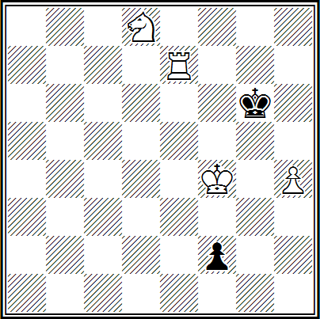

**G. Kasparyan, 1936**. Weiß: **Kf4; Te7, Sd8, p. h4 (4)** und Schwarz: **Kg6, p. f2 (2)** — Gewinn.

**1. h5+! Kh6!**

Nicht *1... Kxh5 2. Th7+* und *3. Th1*, *1... Kf6 2. Tf7X*.

**2. Sf7+ Kxh5.**
Wenn *2...Kh7*, dann *3. Sg5+ Kg8 4. Te8+ Kg7 5. h6+ Kg6 6. Kg4! f6 7. Te6+ Df6 8. Txf6+ Kxf6 9. Kh5*.

**3. Te5+ Kh4!**

Auf *3...Kg6* folgt *4. Tg5+ Kf7 5. Tf5+ und 6. Kg4* oder *4...Kh7 5. Th5+ und 6. Th1*.

**4. Sg5! f1D+ 5. Sf3+ Kh3 6. Th5+ Kg2 7. Th2#.**

Ein eleganter finaler Matt wird durch eine gute Einleitung mit dem Opfer eines weißen Bauern vorbereitet; weißer Turm und Springer nehmen Positionen für den abschließenden Angriff ein (Züge ab 3. Te5+), der schwarze König gelangt auf das fatale Feld g2. Doch die Konfliktsituation ist dieselbe – der Turm kann den Bauern nicht aufhalten, während er sich auf der benachbarten Linie "e" befindet; es gibt kein Konterspiel der Schwarzen – nur ein zielloses Ausweichen mit dem König. Es gibt ein einleitendes Spiel, aber kein Spiel mit einer Idee, keine Gleichberechtigung der Seiten im Kampf!

**Nr. 45. Z. Birnow, 1947, Gewinn**  


Nr. 45. **1. Tg7+ Kb6 2. a8S++!!**

Nur so. Jede andere Fortsetzung raubt den Weißen die Initiative.

**2...Ka6.**

Interessanterweise gerieten die Schwarzen sofort in ein Mattnetz. Sowohl auf a5 als auch auf c6 wären sie unmittelbar bestraft worden, wobei beim Matt auf dem Feld c6 ihr eigener Bauer d6 eine traurige Rolle für die Schwarzen spielen würde, der beabsichtigt, am Kampf teilzunehmen und sich noch beweisen wird.

**3. Sc7+ Ka5!**

Auf *3...Kb6* folgt *4. Sd5+ Ka6 (c6) 5. Sb4+* und *6. Sxc2*. Falls jedoch *3...Ka7 (b7)*, dann *4. Se6+*, wodurch das Feld g5 unter Beschuss genommen wird, und dann *5. Tg1* mit Gewinn, da der Läufer keinen Zug nach g5 hat.

**4. Tg1.**

Es schiene alles vorbei zu sein, aber der Kampf beginnt erst jetzt.

**4...Lg5!**

Indem sie die Umwandlung des Bauern androhen, zwingen die Schwarzen die Weißen, das Opfer anzunehmen. Aber wozu? Schließlich wird der Läufer mit Schach geschlagen und der Turm kehrt nach g1 zurück. Aber sehen wir es uns an.

**5. Txg5+ d5+!**

Ein scharfer Zug! Auf den Schach antworteten die Schwarzen mit einem Schach und zwingen die Weißen ein zweites Mal, das Opfer anzunehmen.

**6. Txd5+,**

wonach der Turm nicht mehr in die erste Reihe zurückkehren kann, um den Bauern aufzuhalten (die römische Idee!).

**6...Ka4.**

Natürlich nicht *6...Kb5 7. Tb5+ Kxc7 8. Tc5+* und *9. Kb5 (d5)*. Nun ist der Angriff der Weißen beendet, und mit nur einem einzigen Bauern verbleibend, scheinen die Schwarzen ihr Ziel erreicht zu haben: die Umwandlung in eine Dame kann nicht mehr verhindert werden. Doch auch die Weißen haben ihr scharfes Wort. Nach

**7. Sb5 c1D+.**

antworten sie ihrerseits auf den Schach mit einem Schach, aber einem weitaus bedrohlicheren!

**8. Sc3+ Ka3 9. Ta5+ Kb2 10. Ta2#.**

Die Umwandlung des Bauern in einen Springer, die Opfer schwarzer Figuren, die römische Idee, gegenseitige Schachs beider Seiten und schließlich ein effektvolles Matt – es ist erstaunlich, wie all dies harmonisch in der bezaubernden Miniatur von Z. Birnow verschmolz (siehe IL Nr. 13).

«Nur um eine einzige Ausgangseinheit mehr, und doch erstrahlt die Studie in neuen, leuchtenden Farben. Hier gibt es ein angenehm mit dem Finale verknüpftes Einleitungsspiel (das Erscheinen des weißen Springers), ein wahrhaft ideenreiches Spiel (das einen Konflikt erzeugt, der zu der bemerkten Nachbarschaft der Bewegungslinien des weißen Turms und des schwarzen Bauern führt), und dasselbe ökonomische korrekte Matt (das den Streit zwischen Weiß und Schwarz entscheidet)» (Kommentar von Internationalmeister Ap. Kuznetsov).

Die folgenden Beispiele charakterisieren die Möglichkeiten, ein Einleitungsspiel zu finden, ohne zusätzliches Material hinzuzufügen.

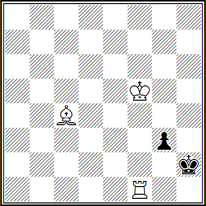

**R. Réti, 1925**. Weiß: **Kf5, Tf1, Lc4 (3)** und Schwarz: **Kh2, p. g3 (2)** — Gewinn.

**1. Tf3!**

In den "Hinterhalt" hinter dem Bauern g3 auf der dritten Reihe.

**1... g2 2. Lf1!** In den "Hinterhalt" hinter dem Bauern g2 auf der Diagonale f1—h3.

**2...g1D 3. Th3#.**

Die Lösung ist klar und effektvoll. Und ist ein Einleitungsspiel überhaupt nötig?

**Nr. 46. N. Kralin, 1963, Gewinn**  


Nr. 46. Die gleichen Figuren wie bei R. Réti.

**1. Tf2!!**

Dies wirkt paradox, da es dem schwarzen Bauern erlaubt, mit Tempo vorzurücken.

**1... g3 2. Tf3!**

"Hinterhalt" à la Réti.

**2...Kh2!**

Klar ist, dass *2...Kg4? 3. Ke4 g2 4. Le6+ Kh4 5. Th3+, 6. Tg3+ und 7. Txg2* schwach ist; raffinierter ist die Variante *2...Kh4!? 3. Tf4+ Kg5 (3...Kh3 4. Lc4 g2 5. Lf1) 4. Ke4 g2 5. Tf8! g1D 6. Tg8+ und 7. Txg1*.

**3. Lc4! g2 4. Lf1!**

"Hinterhalt" à la Réti.

**4. ... g1D 5. Th3#.**

Eindeutig besser: Die Lösung ist schwieriger (1. Tf2!!), der schwarze König gelangt auf das Mattfeld (2...Kh2!) und die Dynamik der Studie ist höher — der schwarze König zieht, Turm und Läufer von Weiß machen jeweils zwei Züge, der schwarze Bauer zieht nicht zweimal, sondern dreimal, und die Notwendigkeit des Zuges 1. Tf2! ist elegant — das Feld f1, auf das der Läufer strebt, muss geschützt werden (siehe IL Nr. 19).

Damit die Endstellung ökonomisch wird, ist es notwendig, dass so viele der auf dem Brett verbliebenen Figuren wie möglich an ihr beteiligt sind. Dieser Umstand sollte von Schachkomponisten bei der Konstruktion von Kompositionen berücksichtigt werden, die mit korrekten Mattstellungen enden. In diesen werden die Anforderungen an die Reinheit des Matts (beim schwarzen König wird jedes Feld nur aus einem Grund kontrolliert — entweder ist es durch eine eigene Figur besetzt oder wird einmalig von einer weißen Figur angegriffen) und an die Ökonomie des Matts (wenn alle auf dem Brett verbliebenen weißen Figuren, außer dem König und den Bauern aufgrund ihrer geringen Beweglichkeit, an der Erzeugung des Mattbildes beteiligt sind) eingehalten.

**Nr. 47. S. Kryuchkov, 1927, Matt in 3 Zügen**  


Hier (Nr. 47) ist das Matt in der Variante **1. Lc6 e1D 2. Lg2+ Kg1 3. Sf3#** – rein und ökonomisch – alle Felder um den schwarzen König sind jeweils nur einmal gedeckt: das Feld f2 ist durch einen eigenen Bauern blockiert, und die anderen sind von den weißen Figuren jeweils nur einmal angegriffen (das Matt ist rein); an der Erstellung des Mattbildes sind alle weißen Figuren außer dem König beteiligt – das Matt ist ökonomisch.

In der Variante **1... e1S 2. Lb5+ Sd3 3. Dd1#** ist das Matt ebenfalls korrekt: denn der weiße Läufer nimmt aufgrund der Fesselung des Springers aktiv am Mattbild teil und widerlegt 3...Se1! Es ist also sehr wesentlich, wenn bei der Erstellung eines Matts oder Patt eine weiße Figur beteiligt ist, die ein Feld beim schwarzen König fesselt und blockiert.

Die Bedingung für ein korrektes Matt besteht darin, dass Schwarz, sofern dies überhaupt möglich ist, Züge machen muss, die zu einer korrekten Mattstellung führen.

Zum Beispiel ist hier in der Bedrohungsvariante die Schlagfigur des Läufers: **1... bxc 2. Sf3!** und **3. Dh3#** oder **2...e1D 3. Sh2#** – das sind zwei reine und ökonomische Matts. Insgesamt gibt es folglich drei Varianten mit vier korrekten Matts (siehe IL Nr. 27).

Bei der Komposition von Studien muss die Anforderung erfüllt werden, die Ausgangsstellung so weit wie möglich an eine Position aus einer praktischen Partie anzunähern. Wir präsentieren Ihnen zwei Studien.

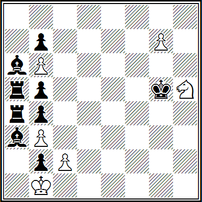

**W. Mandinyan, 1915–1946**. Weiß: **Kb1, Sh5, Bb3, b6, c2, g7 (6)** und Schwarz: **Kg5, Ta4, Ta5, La3, La6, Bb2, b4, b5, b7 (9)** – Gewinn.

**1. Sg3 Kh6 2. g8T Kh7 3. Tg5 Kh6 4. Tg4 Kh7 5. Sf5 Kh8 6. Sh6 (e7) Kh7 7. Sg8 Kh8 8. Tg6 Kh7 9. Tg3 Kh8 10. c4 Kh7** (Falls Schwarz den Bauern schlägt, folgt 11. Sf6 mit anschließendem Matt auf g8.) **11. c5 Kh8 12. c6 Kh7 13. c7**, und Weiß gewinnt.

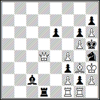

**W. Korolkov, 1936**. Weiß: **Kh3, Dd4, Tf1, Tg1, Lg3, Bf2, f4, g5, h2, h6 (10)** und Schwarz: **Kh5, Td1, Lc2, Sh4, Be6, f3, g2, g6, h7 (9)** – Gewinn.

**1. Dc5 Lf5+ 2. D:f5 exf5 3. Te1 Tc1 4. Td1 Tb1 5. Tc1** (Falls 5. Tg1, dann 5. ...g1S+ 6. T:g1 Sg2, und Schwarz rettet sich) **5. ...Ta1 6. Tb1 T:b1 7. T:b1 g1D 8. T:g1 Sg2 9. T:g2 fg 10. K:g2**, und Weiß gewinnt.

Vergleichen Sie nun die betrachteten Studien mit den folgenden zwei.

**Nr. 48. A. Kasanzew, 1947–1948, Remis**  


Nr. 48. In einer einfachen Stellung sehen wir klassisches Figurenmaterial.

**1. d6.**

Die einzige Chance, den schwarzen Läufer zu schwächen, während er gleichzeitig gegen zwei Freibauern kämpfen muss.

**1... Sb5 2. dxe5 Ke5.**

Nun stehen beide Umwandlungsfelder der weißen Bauern unter der Kontrolle von Schwarz: h8 durch den Läufer und e8 durch die Drohung einer Gabel auf d6; der a-Bauer hingegen kann ungehindert vorrücken.

**3. e8S!**
Die erste Überraschung. Der Springer pariert nicht nur die Drohung einer Gabel, sondern greift auch den Läufer an, dessen einziges Rückzugsfeld h8 ist.

**3...Lh8 4. h7 a3 5. Kg8 K:c6 6. K:h8 Kf7.**

Die Stellung der Weißen ist nun völlig hoffnungslos.

**7. Sd6+!**

Ein weitsichtiger Gedanke.

**7. ...Kf8 8. S:b5 a2 9. Sd4!**

Und in dieser "ausweglosen" Lage nimmt der weiße Springer eine Position ein, von der aus er sowohl das Feld a1 als auch f8 erreichen kann. Nun eröffnet sich für Weiß eine weitere Möglichkeit zur "Studienhaften" Rettung.

**9. ...a1T! 10. Se6+ Kf7 11. Sd8+ Kg8! 12. Kg8 Ta8.**

Und der dritte Bauer kann nicht zum Dame befördert werden. Doch am Ende wenden die Weißen erneut ihre grandiose Kombination an: Sie befördern den Bauern zum Springer.

**13. h8S+! Kh5 14. Sf7,** und die Partie endete Remis.

In einer einfachen, leichten und natürlichen Ausgangsstellung entfaltet sich allmählich ein Spiel von seltener inhaltlicher Reichweite und Schönheit (siehe IL Nr. 21).

**Nr. 49. E. Somov-Nasimowitsch, "Magyar sakkvilág", 1928, Remis**  


Nr. 49. **1. Kd3 Lb2 2. Tg2 La1 3. Tg1 Lc2+**.

Andernfalls würde der weiße Turm den schwarzen Läufer ständig angreifen.

**4. Kc4 Sb3**.

Der schwarzfeldrige Läufer ist geschützt, aber nun beginnt der Turm die Jagd auf den weißfeldrigen.

**5. Tg2 Sa5+.**

Wenn *5. ...Ld1 6. Tg1 Lc2 7. Tg2*. Die Schwarzen finden neue Möglichkeiten, den Kampf fortzusetzen.

**6. Kb5 Sc6!**

Hier liegt die Gegenchance der Schwarzen: Beide schwarzen Figuren sind unverwundbar — *7. K4 c6? Le4+* oder *7. T:c2? Sd4+*, und sie gewinnen.

**7. Tg1! Ld4**.

Andernfalls geht der Springer verloren.

**8. Tc1! Le3**.

Die Schwarzen haben keine bessere Alternative, aber bei der Stellung des Läufers auf e3 gelingt es den Weißen, den Turm gegen zwei schwarze Figuren abzutauschen.

**9. T:c2 Sd4+ 10. Kc4 S:c2 11. Kd3 — Remis**.

Beide herausragenden Werke der Studienkunst, die sich in ihren Vorzügen in keiner Weise unterlegen sind, sind originell in ihrem Konzept, voller Überraschungen, geprägt von einem beidseitigen und subtilen Spiel, äußerst effektiv in ihren Kulminationspunkten und dennoch maximal ökonomisch und natürlich in ihren Ausgangsstellungen.

Die Schönheit der Lösung in einer Studie oder einem Problem wird durch versteckte, schwer zu findende Züge (Manöver) beider Seiten erreicht. In einer Studie gilt eine Lösung als schön, wenn sie durch ein dynamisches, opferreiches und subtiles Spiel erreicht wird, das von starken falschen Fährten begleitet wird. Es ist erstrebenswert, eine organische Einheit zwischen dem Einleitungsspiel und dem Finale zu schaffen.

Der Moskauer internationale Meister für Schachkomposition A. G. Kusnezow schreibt ausführlicher und verständlicher über diesen Sachverhalt in seinem Buch "*Farben des Schachspektrums*" (1980). Seiner Meinung nach ist das Kernstück einer Studie die Hauptvariante (die Autorenvariante, die ideelle Variante, die Grundvariante) der Lösung, die sich unter den anderen durch besondere Schönheit und Effizienz, Tiefe und Subtilität hervorheben und gewissermaßen reliefartig wirken sollte.

Mit ihr sind die Nebenvarianten verbunden, sie stützen sie und bedingen sie (wenn Weiß versucht, von der Hauptvariante abzuweichen). Und obwohl Neben- und Beweisvarianten Besonderheiten aufweisen, die zu wesentlich unterschiedlichen Meinungen führen, ist die Schlussfolgerung klar: Die Logik der ersten wird durch das Prinzip der Lösbarkeit gesteuert, die der zweiten durch das Prinzip der Einzigkeit der Lösung. Das Fehlen von Nebenvarianten in einer Studie macht ihre Lösung langweilig; ohne sie wirken Studien leblos, wie eine bloße technische Zeichnung.

**Nr. 50. D. Gurgenidze, 1970, Remis**  


Nr. 50. **1. Ka3!!**

Der Springer ist belagert, und es wäre unklug, auch nur einen Zug zu verlieren: *1. Kb2? Kf7!* und der weiße König erreicht das Quadrat des h-Bauern nicht, und warum *1. Kb3?* nicht möglich ist, zeigt sich in der Hauptvariante der Lösung.

**1... Ke6!**

Nun ist im Falle von *1... Kf7 2. Kb4 Kg7 3. Kxb5 Kxh7 4. Kc4* das Remis eine Nebenvariante.

**2. Sf8+! Kf5! 3. Sd7 h5 4. Sc5 h4 5. Sb3!**

Hier liegt das Geheimnis der Bevorzugung des Zuges 1. Ka3 gegenüber dem Zug 1. Kb3!

**5. ...h3 6. Sd2 h2.**

Theoretische Nebenvariante: *6. ...Kf4 7. Sf1 Kf3 8. Kb4 Kf2 9. Sh2 Kg2 10. Sg4 Kg3 11. Se3*, und hier rettet die Gabel — *11... h2 12. Sf1+ und 13. Sxh2*.

**7. Sf1! h1D 8. Sg3+ und 9. Sxh1,**

womit die Weltreise über das gesamte Brett erfolgreich beendet wird.

Somit müssen Nebenvarianten in Studien auf Gewinn oder Remis mindestens die Aufgabenstellung erfüllen, wobei im zweiten Fall auch ein Gewinn für Weiß möglich ist.

Anders verhält es sich mit den Beweisvarianten. Ihre Schwierigkeit, Komplexität und Tiefe verstärken scheinbar nur die Wirkung der Hauptvariante und damit der Grundidee. Doch es ist nicht so einfach.

**Nr. 51. G. Nadareishvili, 1950, Gewinn**  


Nr. 51. **1. g6 Kf6! 2. g7 Lh7! 3. e4!!**

Bisher zwei unverständliche Züge — sowohl für Schwarz als auch für Weiß...

**3...Sf3 4. e5+! Sxe5.**

Der Springer ist ins Zentrum gelangt.

**5. Kxh7 Sf3 (f7) 6. g8D Sg5+! 7. Dxg5+! Kxg5 8. h6 c4.**

Wenn *8. ...Kf6*, dann *9. Kg8* und die Dame zieht mit Schach durch.

**9. Kg7 c3 10. h7 c2 11. h8D c1D 12. Dh6+ und 13. Dxc1.**

Hier wird die Tiefe des paradoxen *3. e4!!* deutlich — die Diagonale h6—c1 ist frei.
Zunächst wurde diese Studie ohne den Bauern c7 veröffentlicht, dessen Fehlen eine Beweisvariante zuließ: *3. Kh7 Sf3 4. g8D Kg5+ 5. D:g5+ Kxg5 6. h6 c4 7. Kg7 c3 8. h7 c2 9. h8D c1D 10. Dh6+ Kg4 11. D:e6+ Kf3 12. Df5+! Ke2 13. e4 c_* mit guten Gewinnchancen.

Die genannte Beweisvariante ist hier nicht ideell, sondern formal verknüpft. Der Autor hat richtig gehandelt, diesen Bauern hinzuzufügen, was in dieser Variante zu einem einfachen Remis führt und so eine ermüdende analytische Tiefe ausschließt.

**Nr. 52. G. Kasparyan, 1949, Remis**  


Nr. 52. **1. Lh5+ Ke1 2. Lh4+ Kd2 3. Lg5 L:c5 4. Kf2.**

Dies ist die Ausgangsposition der zukünftigen systematischen Bewegung.

**4. ...Kd3 5. Lg6+ Te4+ 6. Kf3 Lc6.**

Es erscheint natürlich, *7. Lc1?* zu spielen, aber nach *7. ...Kc2! 8. Lg5 L:a3 9. L:e4+ L:e4+ 10. K:e4 a5 11. Kd4 Kb3!* folgt der Verlust.

**7. a4!**

Der erste Schritt der systematischen Bewegung ist abgeschlossen.

**7. ...Kd4 8. Lf6+ Te5+ 9. Kf4 Ld6 10. a5!**

Der zweite Schritt ist abgeschlossen. Wiederum folgt der Verlust — *10. Lc2? a5! 11. Ld1 Ld5 12. Lg7 Lc4 13. Lf3 Lb3 14. Lc6 Ld5!*

**10. ...Kd5 11. Lf7+ Te6+ 12. Kf5 Ld7 13. a6!**

Wieder auf die Farbe des Läufers, der den Turm deckt! Im Falle von *13. Lc3? Lc5 14. Le5 a6! 15. Lg8 Lb4 16. Lc7 Kc6* gewannen die Schwarzen erneut.

Nun wurde der dritte Schritt gemacht; die Stellung wiederholt sich zum vierten und letzten Mal — ein positionelles Remis.

Hier jedoch sind die Beweisvarianten organisch mit der Hauptvariante verschmolzen und steuern die Bewegung des bescheidenen Bauern "a", dessen Beteiligung an der systematischen Bewegung dem Spiel einen besonderen Reiz verleiht.

Folglich sollten rein formale Beweisvarianten, die lediglich die Korrektheit der Studie und das Fehlen von Nebenlösungen sicherstellen, vermieden werden. Ideelle Beweisvarianten hingegen, selbst wenn sie lang und schwierig sind, sind notwendig, da sie der Hauptlösung Subtilität und Tiefe verleihen und der gesamten Studie Weite und sogar Plastizität geben!

In einem Problem, wie im Schachkodex erwähnt, insbesondere bei einer geringen Anzahl von Zügen, gilt eine Lösung als schön, wenn die Züge von Weiß keine signifikante Verbesserung ihrer Stellung oder eine drastische Schwächung der schwarzen Stellung, eine Einschränkung der Freiheit und Mobilität ihrer Figuren beinhalten. Daher sind ruhige Züge vorzuziehen — ohne Schachgebote, Figurenslagen, Entzug von Feldern für den schwarzen König usw. Als schöner Eröffnungszug gilt ein Zug, der den Anschein einer Schwächung von Weiß und im Gegenzug einer Verstärkung von Schwarz erweckt. Daher ist es unerwünscht, dem schwarzen König Schach zu geben, eine fehlende Antwort auf ein Schach gegen den weißen König in der Ausgangsstellung oder die Umwandlung eines Bauern in eine Dame.

Als Mängel einer Aufgabe oder Studie gelten: Nebenlösungen (Cooks), Duale, Unlösbarkeit und die Unmöglichkeit der Stellung. Diese Mängel müssen natürlich auch der Schachlöser erkennen. Für den Komponisten ist es jedoch, neben all den genannten Punkten, zudem wichtig, dass sein Werk keinen Vorläufer hat.

Vorläufer sind bereits veröffentlichte Kompositionen, deren Konzept (Idee), Schema und Konstruktion in gewissem Maße mit dem Konzept, dem Schema und der Konstruktion der neu zu veröffentlichten Komposition übereinstimmen.

Die Tatsache eines Vorläufers wird durch den Vergleich der tatsächlichen Erscheinungsdaten der Druckorgane festgestellt, in denen beide Kompositionen zum ersten Mal veröffentlicht wurden. Dabei ist es unerheblich, ob der Autor der neuen Komposition die alte kennt oder nicht.

Man unterscheidet: **vollständiger Vorläufer** — Idee, Schema und Konstruktion beider Kompositionen stimmen vollständig überein (in diesem Fall verliert die neue Komposition ihr Recht auf Existenz); **teilweiser Vorläufer** — Idee und Schema stimmen überein, die Konstruktion ist unterschiedlich.

Eine Komposition, die einen teilweisen Vorläufer hat, kann als Schachwerk anerkannt und veröffentlicht werden, sofern die Namen des alten Autors "A" und des neuen "B" angegeben werden. Bei einer geringfügigen Verbesserung der alten Komposition (Reduzierung der Figurenanzahl, Behebung eines Mangels usw.) wird die neue Komposition unter dem Namen "A" veröffentlicht, unter dem der Vermerk "Überarbeitung B" steht. Bei einer wesentlichen Verbesserung der alten Komposition wird die neue Komposition unter dem Namen "B" veröffentlicht, unter dem der Vermerk "Nach A" steht. Zudem kann die neue Komposition (Korrektur oder Überarbeitung der alten) in Abstimmung mit dem Autor der alten Komposition als gemeinsames Werk "A+B" veröffentlicht werden.

**Ideeller Vorläufer** — eine Komposition, die entweder im Konzept teilweise übereinstimmt oder sich im Schema (Art der thematischen Figuren) unterscheidet. Eine Komposition mit einem ideellen Vorläufer kann eigenständig existieren, wenn ihre Idee im Vergleich zur alten wie folgt ausgedrückt ist:

1. mit anderen thematischen Figuren;
2. in einer größeren Anzahl von Varianten;
3. in Verbindung mit anderen Ideen, Modellmatts, thematischen falschen Fährten, Illusionsspiel;
4. mit einer erheblichen Bereicherung des Spiels, einer verbesserten Konstruktion usw.

Und nun einige Beispiele.

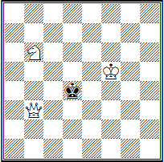
**W. Shinkman, 1885.** Weiß: **Kf5, Db3, Sb6 (3)** und Schwarz: **Kd4 (1)** — Matt in drei Zügen.

Das Problem wird durch einen ungewöhnlichen, schwer zu findenden ersten Zug gelöst — **1. Sa8! Kc5 2. Ke5 Kc6 3. Dd5#**.

Genau dieselbe Aufgabe veröffentlichte E. Suschkewitsch im Jahr 1954 in der belarussischen Zeitung "Svesda".

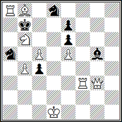

**3. Birnow, 1951.** Weiß: **Kd1, Dg3, Ta8, Tf3, Lb8, Sb6, Bb b4, c5, e5 (9)** — Schwarz: **Kb7, Lg5, Sa5, Sd8, Bb c4, e6, e7 (7)**; Matt in drei Zügen.

**1. Dg2 Sac6 2. Tf3** und **3. T3a7#**, **1... Sdc6 2. Tf8** und **3. Ta7#** und außerdem **1... Le3 2. Tf7** und **1... Kc6 2. Tb3**. Eine nicht schlecht konstruierte Aufgabe (insgesamt sechzehn Figuren), obwohl der erste Zug nicht ganz gelungen ist. Es stellte sich heraus, dass die stärkste weiße Figur nicht benötigt wird: Die Dame kann problemlos durch einen Läufer ersetzt werden, ohne dass sich am Spiel etwas ändert, nur der erste Zug würde schlechter werden.

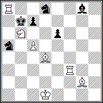

L. Loschinsky (nach S. Birnow), 1951. Weiß: **Kd1, Ta8, Tf3, Ld4, Lg2, Sb6, Bc5 (7)** und Schwarz: **Kb7, Lg8, Sa5, Sd8, Bb c7, e6 (6)** — Matt in drei Zügen.

In dieser Stellung wurde der erste Zug verbessert — **1. Le5!**, es kam eine dritte stille Variante hinzu — **1... c6 2. Td3!** und drei Figuren wurden eingespart.

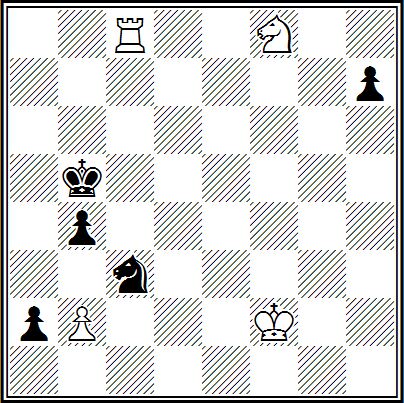

M. Liburkin, 1981. Weiß: **Kf2, Tc8, Sf8, Bb2 (4)** und Schwarz: **Kb5, Sc3, Bb a2, b4, h7 (5)** — Gewinn.

**1. Ta8 Sd1+ 2. Ke1 Sc3 3. Se6 Kc4 4. Sc5 Kxc5 5. Kd2 Sb1+ 6. Kc2 Sa3+ 7. bxa1! a1D 8. axb+ Kxb4 9. Txa1**, und Weiß gewinnt.

Schwarz kann jedoch nach *4. ...Sb5 5. Txa2 Kxc5 6. Kd2 Kc4 7. Ta8 Kb3 8. Kc1 Sc7 9. Th8 Se6 10. Txh7 Sc5!* ein Remis erreichen.

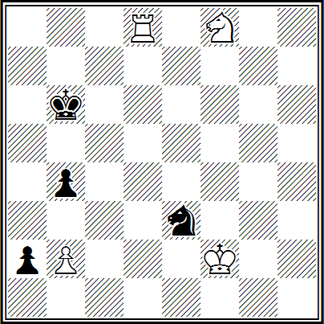

**M. Liburkin (Überarbeitung von W. Dolgow), 1983**. Weiß: **Kf2, Td8, Sf8, Bb2 (4)** und Schwarz: **Kb6, Se3, Bb a2, b4 (4)** — Gewinn.

Und hier gelang es, das originäre Spiel ohne Hinzufügen von Material zu bewahren: **1. Ta8 Sd1+ 2. Ke1 Sc3 3. Sd7+! Kb5 4. Sc1 Kxc5 5. Kd2 Sb1+ 6. Kc2 Sa3 7. bxa1 a1D 8. axb+** usw.

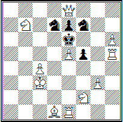

E. Spirin, 1979. Weiß: **Kc3, De8, Te1, Th5, Ld1, Sb7, Sf2, Bb c4, e5, g3, h6 (11)** und Schwarz: **Ke6, Sd7, Sf7, Bb e7, f5 (5)** — Matt in zwei Zügen.

**1. Se4!** — Zugzwang: **1... Sf— 2. Sg5#**, **1... Sd— 2. Sxc5#**, **1... Sxe5! 2. Sd8#** und **1... Sxe5! 2. Sbc5#**.

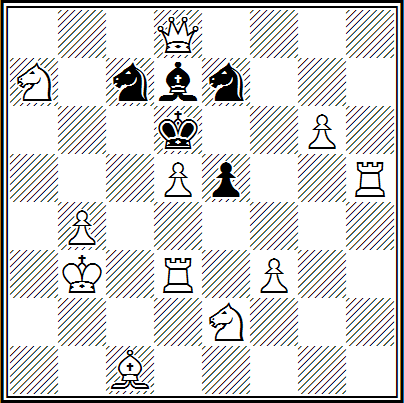

**P. Pechenkin, 1962.** Weiß: **Kb3, Dd8, Td3, Th5, Lc1, Sa7, Se2, Bb b4, d5, f3, g6 (11)** und Schwarz: **Kd6, Ld7, Sc7, Se7, Be5 (5)** — Matt in zwei Zügen.

**1. Sd4!** mit analogem Spiel — dies ist ein starker ideeller Vorgänger.

Nun aber zu den Defekten. Hier ist es notwendig, die Figuren auf dem Brett aufzustellen und die Stellungen selbstständig zu analysieren.

Eine Nebenlösung (Cook) ist eine Lösung einer Aufgabe (Studie), die sich von der Autorenlösung unterscheidet und bereits mit dem ersten Zug beginnt. Dieser Defekt ist der häufigste ungebetene "Gast" in Aufgaben und Studien, sowohl bei Anfängern als auch bei erfahrenen Autoren. Betrachten wir einige Beispiele.

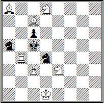

**W. Lukjanow, 1982**. Weiß: **Kd1, Tb4, La8, Lc7, Sd8, Se3, p. c3 (7)** und Schwarz: **Kc5, Sa5, Sd4, p. c6 (4)** — Matt in zwei Zügen.

Illusionäres Spiel *1... Sa — 2. Sb7X* und *1... Sd — 2. Se6X*, Lösung **1. L:c6!** — Zugzwang: **1... Sa — 2. Tc4X**, **1... Sd — 2. Tb5X** und **1... Sa:c6 2. Sb7X, 1... Sd:c6 2. Se6X**. Der hochkomplexe Plan stürzte nach **1. Tb6!** ein, d. h. aufgrund einer Nebenlösung.

Häufiger tritt dieser Defekt bei Aufgaben des Drei-Zug-Genres auf.

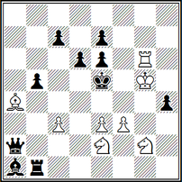

I. Storozhenko, 1981. Weiß: **Kg5, Tg6, La4, Se2, Sg2, pp. c3, e3, f3 (8)** und Schwarz: **Ke5, Da2, Tb1, La1, pp. b5, c7, d6, e6, e7, h4 (10)** — Matt in drei Zügen.

Falsche Fährten *1. Sd4 (f4)? D:g2+!*, *1. Sgf4? Tg1+!* und die Lösung **1. Kg4!** mit der Drohung **2. Tg5+!; 1... Dc4+ 2. Sd4!** (aber nicht **2. Sef4? d4!**) **2...Da6 3. Sd3X** und **1... Tb4+ 2. Sgf4! d4 3. Sd3X**.

Ein exzellenter erster Zug, das Spiel der weißen Springer ist fein differenziert, aber auch **1. Sg3! hg 2. Sf4!** ist möglich — eine Nebenlösung.

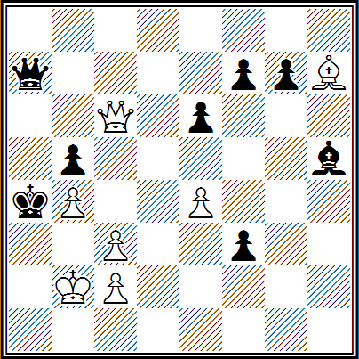

**W. Anisimow, 1981**. Weiß: **Kb2, Dc6, Lh7, pp. b4, c2, c3, e4 (7)** und Schwarz: **Ka4, Da7, Lh5, pp. b5, e6, f3, f7, g7 (8)** — Matt in fünf Zügen.

Es ist sehr schwierig, eine Bewertung gemäß dem Abschnitt für Mehrzuger vorzunehmen, insbesondere wenn die Macht der gegnerischen Seiten groß ist — hier ist das Beharren des Schiedsrichters, Defekte zu finden, immer gerechtfertigt, da diese in diesem Fall selten fehlen.

Nach dem Autor: **1. Lg8!! f2 2. D:e6! fe 3. L:e6 D(L)f7 4. Lb3+ D:b3 5. LbX** oder **1... Lg4 2. L:f7 Da5! 3. De5** (Drohung 4. ba) **3...Da8 4. Dg1! Dd5 5. Da7X**.

Diese Aufgabe wird dem "populären Genre der Rätsel-Aufgaben" zugeordnet. Leider ist das Rätsel durchschaubar, da auch **1. Lf5!** usw. möglich sind.

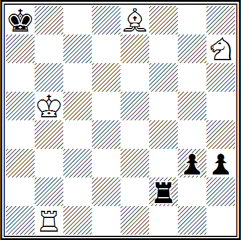

**W. Nowikow, 1980**. Weiß: **Kb5, Tb1, Le8, Sh7 (4)** und Schwarz: **Ka8, Tf2, pp. g3, h3 (4)** — Gewinn.

Aufgrund der Komplexität des Studien-Genres, sowohl bei der Komposition als auch bei der Analyse der Inhalte, ist das Finden von Defekten selbst für den renommiertesten Richter oder einen erfahrenen Löser erschwert.

Weiß führt, während er an der Grenze der Niederlage balanciert, präzise einen Mattangriff aus. Die Autorenlösung ist **1. Sg5 h2 2. Se4! g2 3. Lc6+ Ka7 4. Ta1+ Kb8 5. Ta8+ Kc7 6. Ta7+ Kd8! 7. Sd6 Tb2+ 8. Kc4! Tc2+ 9. Kd5 Td2+ 10. Ke5 Te2+ 11. Kf4! Tf2+ 12. Ke4 Te2+ 13. Kd3! Te3+ 14. Kd4!**, Gewinn — die Diagonale g1—d4 ist blockiert.

Keiner der Löser gab eine Nebenlösung an, aber es wurde eine gefunden: **1. Ka6! Ta2+ 2. Kb6 Kb8 3. Kc6+ Ka7 4. Kc7 Tc2+ 5. Lc6 T:c6+ 6. K:c6 g2 7. Sf6!** mit einem baldigen Matt.

Solche Wunder geschehen bei Wettbewerben zur Lösung von Studien.

Ein **Dual** ist eine partielle Lösung, d. h. die Möglichkeit, eine Aufgabe oder eine Studie in Varianten zu lösen, die ab dem zweiten oder einem späteren Zug vom Autorenzug abweichen.

Ein Dual in ideenreichen (thematischen) Varianten einer Aufgabe ist unzulässig. In einer Studie hingegen wird zwischen zulässigen und unzulässigen Dualen unterschieden, obwohl es auch hier keine einheitliche Meinung zu dieser Frage gibt. In zusätzlichen (nicht thematischen) Varianten sind Duale erlaubt, obwohl sie zweifellos den ästhetischen Eindruck des Werkes mindern.

Der geringste Prozentsatz an Dualen wurde in Zweizügern verzeichnet.

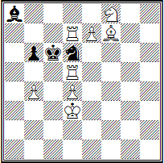

**W. Dubrowski**, 1979. Weiß: **Kd3, Td5, Td7, Lf7, Sf8, pp. b4, d4, e7 (8)** und Schwarz: **Kc6, La8, Sd6, p. b6 (4)** — Matt in zwei Zügen.

**1. Se6!** — Zugzwang: **1... K:d5 2. Sd8X, 1... K:d7 2. e8DX** und **1... Lb7 2. T7:d6X; 1... b5 2. T5:d6X**. Außerdem **1... Sb5 2. Sd8X** und **1... Sb7 2. b5X**. Doch bei einem indifferenten Sprung des schwarzen Springers treten Duale auf, das heißt, bei *1... S* sind sowohl *2. Sd8X* als auch *2. b5X* möglich.

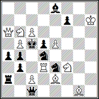

**J. Marker**, 1979. Weiß: **Kh7, Da6, Td3, Le2, Lg1, Sb6, Sf3, pp. b5, c2, c6, e5 (11)** und Schwarz: **Kc5, Dc1, Ta2, Le8, Sd4, Se3, pp. a4, b3, b4, d5, f7 (11)** — Matt in drei Zügen.

Eine strategisch sehr gehaltvolle Aufgabe: **1. Sc8!** mit der Drohung **2. Db6+! 1... Sdf5! 2. Td4! Sc4! 3. T:c4X** — aber Dual *2. Db6+* und **1... Sef5! 2. Te3! S:e2 3. Tc3X** — und wieder Dual *2. Td2!*.

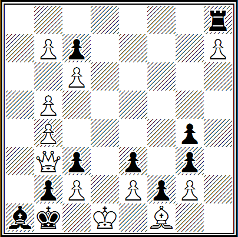

**S. Piwomar**, 1980. Weiß: **Kd1, Db3, Lf1, pp. b4, b5, b7, c2, c6, e2, g2, h7 (11)** und Schwarz: **Kb1, Th8, La1, pp. b2, c3, c7, e3, f2, g3, g4 (10)** — Matt in vierzehn Zügen.

**1. Dg8! T:g8 2. hgT! Ka2 3. Ta8+ Kb1 4. b6 cb 5. b8L! b5 6. La7! Ka2 7. L:e3+ Kb1 8. La7! Ka2 9. L:f2+ Kb1 10. c7 gf 11. c8S! g3 12. Sa7! Ka2 13. S:b5+ Kb1 14. S:c3X** — mit drei aufeinanderfolgenden verschiedenen Umwandlungen, aber es gibt Duale mit Matt in zwölf Zügen: *8. Ld2. cd 9. c4 bc 10. c7 c3 11. c8D c2+ 12. D:c2X* oder *10. c3 (e4) c3 11. Ld3 c2+ 12. L:c2X*.

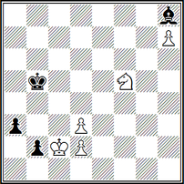

**Al. Kusnezow und W. Schanschin**, 1981. Weiß: **Kc2, Sf5, pp. d2, d3, h7 (5)** und Schwarz: **Kb5, Lh8, pp. a3, b2 (4)** — Remis.

Hier ist das Spiel durchdrungen von der Idee eines positionsbedingten Remis, das auf Motiven des Zugzwangs und des Patts beruht.

**1. Kb1! Ka4 2. Ka2 b1D+ 3. K:b1 Kb3 4. d4**, womit die offene Diagonale geschlossen wird.

Aber Schwarz spielt auf Zugzwang — **4. ... a2+! 5. Ka1 Ka3 6. d3 Lf6 7. h8D L:h8 8. Sg7!** — ... und gerät selbst in diesen.

**8. ... Kb3 9. Se6! Lf6 10. Sc5+**.

Das Schach ist die Folge des Zugzwangs.
**10. ... Kxa3 11. Se6! Le7 (was sonst?) 12. Sf4 Lf8 13. Se2! Lg7 14. Sc3! L:d4**, und dennoch ein Patt mit Bindung — aber nicht mehr des Bauern, sondern des Springers.

Alles bestens, aber es gibt ein Dual im Springer-Marsch zum Feld c3 — *12. Sc7 Kb3 13. Sb5 Lf6 14. Sc3!* und so weiter.

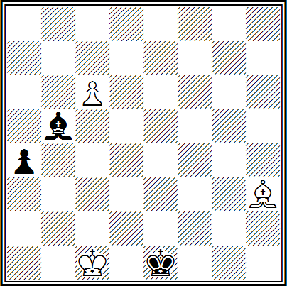

**A. Maximovskich**, 1981. Weiß: **Kc1, Lh3, p. c6 (3)** und Schwarz: **Ke1, Lb5, p. a4 (3)** — Gewinn.

Kein schwieriges, aber ein sehr angenehmes symmetrisches Spiel beider Seiten.

**1. c7 Sa6 2. Kb2! Kf2! 3. Ka3! Kg3! 4. Le6! Kf4 5. Kxa4 Ke5 6. Ka5! Kd6! 7. Kb6! Kxe6 8. Kxa6 Kd7 9. Kb7**, Gewinn.

Es gewinnt jedoch auch das banale *4. Lf1 Lc8 5. Kxa4 Kf4 6. Kb5 Ke5 7. Kb6 Kd6 8. Le2*, da der weiße König in das Feld b8 eindringt, und das ist bereits ein Dual.

**Unlösbarkeit** ist ein sehr selten vorkommender Defekt in Schachaufgaben und Studien, aber in der Regel auch ein schwer zu findender. Vor diesem Defekt ist kein Schachkomponist gefeit: weder der beginnende Problemist noch der erfahrene Studienkomponist.

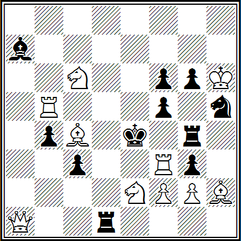

**Ju. Sushkov**, 1982. Weiß: **Kh6, Da1, Tb5, Tf3, Lc4, Lh2, Sc6, Se2, pp. f2, g2 (10)** und Schwarz: **Ke4, Td1, Tg4, La7, Sh5, pp. b4, c3, f5, f6, g3, g6 (11)** — Matt in zwei Zügen.

Illusorisches Spiel *1... Ld4 2. Ld5X* und *1... Td4 2. Te3X*, eine falsche Spur *1. S2d4?* mit der Drohung *2. Ld5X*, aber nicht *2. Te3X?*: *1... Sf4 2. Te3X* und *1... T:d4 2. De1X* — wird widerlegt durch *1... Lc5!*.

Die Autorenlösung ist **1. S6d4!** mit der Drohung **2. Te3X**, aber nicht *2. Ld5X?*: **1... gf 2. Ld5X** und **1... L:d4 2. Da8X** — funktioniert nicht wegen ***1... f4!***, das heißt, die Aufgabe ist unlösbar, inkorrekt.

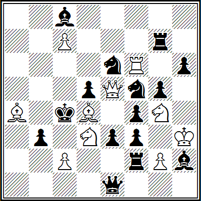

**V. Gladkikh**, 1979. Weiß: **Kh3, De5, Tf6, La4, Ld4, Sd3, Sg4, pp. c2, c7, g2 (10)** und Schwarz: **Kc4, De1, Tf2, Tg7, Lc8, Lh2, Se6, Sf5, pp. b3, d5, e3, f3, f4, g5, h6 (15)** — Matt in drei Zügen.

**1. Lb2!** mit der Drohung **2. Dd4+** und **3. Sge5X**: **1... Se— 2. T:f5!, 1... Sed4! 2. De6!** und **1... Sfd4! 2. Df5!**, aber nach ***1... Tc7!*** ist die Aufgabe nicht lösbar.

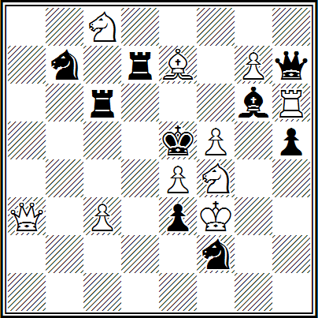

**L. Shilkov**, 1981. Weiß: **Kf3, Da3, Th6, Le7, Sc8, Sf4, pp. c3, e4, f5, g7 (10)** und Schwarz: **Ke5, Dh7, Tc6, Td7, Lg6, Sb7, Sf2, pp. e3, h5 (9)** — Matt in vier Zügen.

Der Autor setzte ein grandioses Vorhaben um — **1. Db4!** mit der Drohung **2. Db5+ Sc3 3. D:c5+: 1... Lf7 2. Td6! Tc:d6 3. Dd4+ T:d4 4. Lf6X** und **2...Td:d6 3. Lf6+ T:f6 4. Dd4X**; **1... Dg8 2. Ld6+ Tc:d6 3. D:d4+ T:d4 4. S:g6X** und **2...Td:d6 3. S:g6+ T:g6 4. Dd4X**, schließlich **1... Sd3 2. Dd6! Tc:d6 3. S:d3+ T:d3 4. Lf6X** und **2...Td:d6 3. Lf6+ T:f6 4. S:d3X** — aber nach ***1... D:g7!*** ist die Aufgabe nicht lösbar. So zerstört ein scheinbar harmloser Einwand der Schwarzen das prächtige Vorhaben des Problemisten.

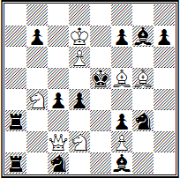

Das Gleiche geschah auch dem Großmeister V. F. Rudenko, 1982. Weiß: **Kd7, Dc2, Lf5, Lg5, Sb4, Sd2, pp. d6, f2 (8)** und Schwarz: **Ke5, Ta1, Ta3, Lf1, Lg7, Sc1, Sg3, pp. b7, c4, d4, f3, f7, h7 (13)** — Matt in vier Zügen.

**1. Le6!** (Drohung **2. De4! Se4 3. Sd3!** — Interferenz der schwarzen Figuren durch ein Springeropfer auf dem Interferenzfeld — und **4. Sxc4X** sowie **4. Sxf3X**) **1... Td3! 2. Sxc4 Ke4 3. Sd2+ Ke5 4. Dc5X** und **1... Ld3 2. Sxf3+ Ke4 3. Sd2+ Ke5 4. f4X** — mit Interferenz der schwarzen Figuren ohne Opfer einer weißen Figur am Schnittpunkt der schwarzen Figuren (das sogenannte Grimshaw-Thema) und der Öffnung der c- und f-Linien. Und außerdem **1... f5 2. Dd3!** (erneut Interferenz mit Figurenopfer — siehe Novotny-Thema) **2... Txd3 3. Sxc4+ Ke4 4. Ld5X** sowie **2... Lxd3 3. Sxf3+ Ke4 4. Ld5X**.

Jedoch weist auch dieses außerordentlich schwierige logische Problem eine Unlösbarkeit auf — ***1... Te3! 2. fxe3 Ld3!*** usw.

Große Schwierigkeiten beim Beweis der Unlösbarkeit ergeben sich in Studien analytischer Art, d. h. wenn die Unlösbarkeit durch mühsame Analysebeweise nachgewiesen werden muss. Überzeugen Sie sich selbst davon.

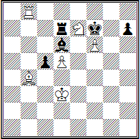

**A. Bor**, 1981. Weiß: **Kd3, Tb8, Lb4, Se7, Bauern d5, f6 (6)** und Schwarz: **Kf7, Td7, Ld6, Bauern c5, h7 (5)** — Gewinn.

In der Lösung des Autors endet der kombinatorische Kampf mit einem ökonomischen Matt: **1. Th8! Kxf6 2. Sg8+ Kg6! 3. Lc3 Le5! 4. Lxe5 Txd5+ 5. Ke4 Txe5! 6. Kxe5 Kg7** (der Turm ist gefangen, aber ...) **7. Sh6! Kxh8 8. Kf6 c4 9. Kf7 c3 10. Kf8 c2 11. Sf7X**.

Ein Gewinn nach ***3... Td8*** ist jedoch nicht ersichtlich, zum Beispiel: ***4. Le5 Lxe5 5. Se7 Kf6 6. Txd8 Kxe7 7. Tc8 Ld4 oder 4. Kc4 Te8 5. Lf6 Te3 6. Kb5 Lf8 7. Kc6 Lg7 8. d6! Lxh8 9. d7 Td3 10. Lxh8 Kf7! 11. Sf6 Ke7*** usw., womit letztendlich die Unlösbarkeit der Studie bewiesen ist.

**Unmöglichkeit der Stellung**. Ein kaum vorkommender und zudem schwer zu entdeckender Fehler in Schachkompositionen. Es kam vor, dass dieser Mangel an einer Aufgabe oder Studie erst nach vielen Jahren entdeckt wurde, während das fehlerhafte Werk bis dahin mehrfach nachgedruckt worden war. Zum Beispiel:

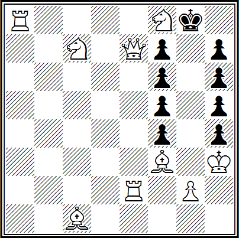

**Autor unbekannt, 19. Jahrhundert**. Weiß: **Kh3, De7, Ta8, Te2, Lc1, Lf3, Sc7, Sf8, Bauer g2 (9)** und Schwarz: **Kg8, Bauern f4, f5, f6, f7, h4, h5, h6, h7 (9)** — siehe Txet.

Diese Aufgabe ging seinerzeit durch die gesamte Schachwelt und begeisterte durch ihre Ungewöhnlichkeit. Sie trägt den Namen "Der schlaue Soldat" (in Russland ist diese Stellung unter dem Titel "Wie man unter den Zaren durch die Reihen trieb" bekannt), und die Aufgabenstellung lautete, Matt mit dem Bauern g2 in vierzehn Zügen zu setzen.

**1. Sd7+ Kg7 2. Tf8! Kg6 3. Se6! fxe6 4. Df7+ Kg5 5. Se5! fxe5 6. Le4! fxe4 7. Lc3! fxe3**. Eine Bauernmauer wurde verschoben.

**8. De7+! Kg6 9. Kh2! h3 10. g3 h4 11. g4 h5 12. g5 h6 13. Df6+ Kh7 14. g6X** — und schließlich ist die Bedingung erfüllt. Die Züge 14. Df7X und 14. Th8X verletzen nicht die Absicht des Autors.

Allerdings wurde im Laufe der Zeit eine noch kürzere Lösung des Problems gefunden: ***1. Sd7+ Kg7 2. Df8+ Kg6 3. Ta4 Kg5 4. Sd5 Kg6 5. Se7+ Kg5 6. Kh2 h3 7. Dg7+ Kh4 8. g3X***.

Leider ist diese berühmte Komposition mit dieser Bauernstellung künstlich und kann nicht aus der Ausgangsstellung der Figuren in einer Schachpartie entstehen: Auf dem Brett befinden sich alle acht schwarzen Bauern, aber wo ist der Bauer von a7? Er kann kein einziges der acht Felder erreichen, die von seinen Gefährten besetzt sind.

Hier sind einige weitere illegale (unmögliche) Positionen.

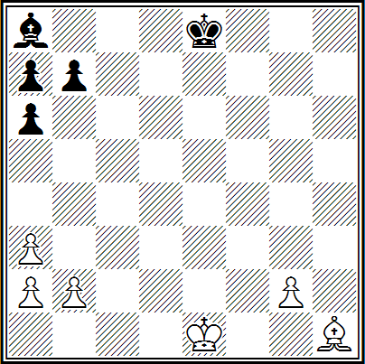

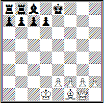

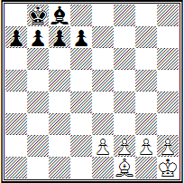

1. Weiß: **Ke1, Lh1, Bauern a2, a3, b2, g2 (6)** und Schwarz: **Ke8, La8, Bauern a6, a7, b7 (5)** — die Positionen der Läufer und der Bauern a2, a3, a6, a7 sind unmöglich.
2. Weiß: **Kd1, Dg1, Lf1, Bauern e2, f2, g2, h2 (7)** und Schwarz: **Ke8, Ta8, Tb8, Lc8, Bauern a7, b7, c7, d7 (8)** — die Positionen der weißen Dame und des schwarzen Turms b8 sind unmöglich.
3. Weiß: **Kh1, Lf1, Bauern e2, f2, g2, h2 (6)** und Schwarz: **Kb8, Lc8, Bauern a7, b7, c7, d7 (6)** — die Positionen beider Könige sind unmöglich. Natürlich können die Könige der gegnerischen Seiten bei dieser Stellung der Bauern und des Läufers nicht auf diese Felder gelangen. Natürlich sind auch andere Unkorrektheiten der Positionen möglich, aber darauf werden wir später noch eingehen.

Nun, da Sie illegale Positionen gelernt haben und sich eine gute Vorstellung davon machen können, versuchen Sie als Hausaufgabe, Positionen zu finden, die die Unmöglichkeit von Stellungen bei vorhandenen Springern auf dem Schachbrett illustrieren. Gibt es solche?

An den ersten Zug von Weiß werden hohe Anforderungen gestellt; in der Regel erzeugt er eine Drohung — die Möglichkeit eines Matts, das eine Verteidigung von Schwarz erfordert. Im Allgemeinen sollte die Drohung die einzige sein, außer in Fällen, in denen die Vielfalt der Drohungen Teil des Konzepts des Autors ist (siehe Themen von Novotny, Fleck, Rudenko, das Odessa-Thema, das Sambor-Thema und andere).

Züge von Weiß gelten als grob, wenn sie mit einem Schlag einhergehen. Insbesondere wenn eine Figur und kein Bauer von Schwarz geschlagen wird. Das Schlagen einer Figur im ersten Zug ist generell unzulässig. Schach im ersten Zug der Lösung kommt gelegentlich vor, aber im weiteren Verlauf der Variante ist mindestens ein "stiller" Zug obligatorisch.

Es ist unästhetisch, dem schwarzen König mit dem ersten Zug ein freies Feld zu nehmen. Falls dies nicht zu vermeiden ist, muss dem gegnerischen König ein neues Feld zur Verfügung gestellt werden. Noch besser ist es, wenn in der Aufgabe neue Felder für den schwarzen König frei werden, während die bereits freien Felder nicht weggenommen werden. Diese Anforderung wird in der folgenden Aufgabe besonders anschaulich illustriert.

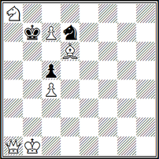
**L. Knotek. White Memorial Tournament, 1953, 1. Preis.** Weiß: **Kb1, Da1, Ld6, Sa8, pp. c4, c7 (6)** und Schwarz: **Kb7, Sd7, p. c5 (3)** — Matt in drei Zügen.

Mit dem glanzvollen Einzug **1. Dg7!** gewähren Weiß dem schwarzen König sofort drei (1) freie Felder, opfern einen Springer und ziehen scheinbar ihre stärkste Figur – die Dame – aus dem Spiel! Mehr noch, in der Hauptvariante führen sie ein neues Element der Schwächung ihrer eigenen Stellung ein, ausgedrückt durch die Umwandlung eines Bauern in einen Läufer – **1... Ka7 2. c8L! K:a8 3. Da1#**.

Um eine solche Lösung zu finden, ist manchmal große geistige Anstrengung erforderlich, aber welch ein Vergnügen man empfindet, wenn man das Ziel erreicht!

## THEMATIK VON SCHACHAUFGABEN UND STUDIEN

Der ideelle Reichtum moderner Schachaufgaben ist beeindruckend. Doch die gesamte Vielfalt ihrer Thematik basiert hauptsächlich auf einigen grundlegenden Ideen, deren verschiedene Kombinationen es ermöglichen, hochkomplexe Kombinationen auszuführen.

Aber nicht alle taktischen Ideen können gleichzeitig in den Inhalt einer Aufgabe einfließen; manchmal sind sie kaum wahrnehmbar und spielen eine ergänzende Rolle, zeitweise füllen sie den gesamten Inhalt des Werkes aus, das heißt, eine bestimmte taktische Idee bildet die Grundlage des künstlerischen Vorhabens.

In diesem Fall ist Weiß die aktive Seite, da die Initiative in ihrer Hand liegt und sie angreifen. Doch jede dieser Ideen hat ihre Gegenform (Schwarz ist aktiv), also eine defensive Form. Es gibt sechs davon.

**Blockierung** — eine Figur besetzt ein Feld, das für eine andere eigene Figur notwendig ist, oder ein Feld neben dem eigenen König, sodass dieser nicht auf dieses Feld ziehen kann. Man unterscheidet die Blockierung eines freien Feldes, die einfache und die komplexe Blockierung (mit teilweisem oder vollständigem Ausschluss einer Fernfigur, die auf dieses Feld wirkt) sowie die Obstruktion (in Aufgaben mit mehr als zwei Zügen und in Studien).

**Ablenkung** — eine gegnerische Figur wird von dem von ihr verteidigten Feld abgelenkt.

**Abschirmung** — die Wirklinie einer gegnerischen oder eigenen Figur wird blockiert.

**Freistellung** — in der Verteidigung zieht eine Figur von der Wirklinie einer anderen Fernfigur weg; man unterscheidet zwischen einfacher und komplexer Freistellung – das Somov-Thema.

**Fesselung** — eine bestimmte Figur kann sich nicht bewegen, da eine gegnerische Figur sonst eine wertvollere Figur schlagen würde, also aufgrund der Wirkung einer anderen Fernfigur, zum Beispiel auf den gegnerischen König, falls die ihn deckende Figur versuchen würde, wegzuziehen.

**Lösen der Bindung** – eine gefesselte Figur erlangt wieder Bewegungsfreiheit, beispielsweise indem eine andere Figur (eigene oder gegnerische) auf ein Feld zwischen der gefesselten Figur und dem König zieht (indirektes Lösen der Bindung) oder indem die bindende Figur die Bindungslinie verlässt (direktes Lösen der Bindung).

Schließlich steht in der Reihe der defensiven Ideen einer Aufgabe die Idee des **Schachs gegen den weißen König**, also die Bedrohung des gegnerischen Königs.

Diese grundlegenden taktischen Ideen haben jeweils ihre Gegenform: **Entblockung**, **Anlocken**, **Ausschaltung**, **Lösen der Bindung** (Binden), **Vermeidung eines Schachzuges** usw.

Betrachten wir diese grundlegenden taktischen Ideen an Beispielen.

**Nr. 53. E. Westbury, "Gazette Times", 1911, 1. Preis, Matt in 2 Zügen**  


Nr. 53. Die Idee der Ablenkung wird in fünf Varianten ausgeführt. **1. Sd5!** mit der Drohung **2. Te7#**: **1... g5 2. Dh6#, 1... Lg5 2. Sxg7#, 1... Sg5 2. Sf4#, 1... Tg5 2. De2#** und **1... Sc5 2. Sxd4#**. Diese Mattsetzungen wären jedoch nicht möglich, wenn die schwarzen Figuren ihren eigenen Läufer und ihre Dame nicht versperren würden.

**Nr. 54. H. Bartolovich, "Chic", 1968, 1. Preis, Matt in 2 Zügen**  


Nr. 54. Es wurden sieben Blockierungen von zwei Feldern realisiert – ein Task (Rekord). **1. Tx c7!** mit der Drohung **2. Tx e4#**; **1... Dxd4 2. Tb7#, 1... Tbd4 2. Txa7#, 1... Ted4 2. Tf5#, 1... Sxd4 2. Sd3#, 1... Txf4 2. Sc6#, 1... Sgf4 2. h8D#** und **1... gxf4 2. Sxf3#**.

In der hervorragend konstruierten Aufgabe (Nr. 55) gibt es fünf Varianten mit komplexer Blockierung. Eine komplexe Blockierung ist eine Kombination, bei der die durch die Blockierung eines Feldes einer schwarzen Figur für den eigenen König verursachte Schwächung dadurch ausgenutzt wird, dass eine weitreichende weiße Figur von diesem Feld ausgeschaltet wird.

**Nr. 55. A. Botacchi, "Alfiere di re", 1921, Matt in 2 Zügen**  


**1. Dh4!** mit der Drohung **2. Df6#**; **1... c5 2. Sf5#, 1... Sc4 2. Sge2#, 1... Tc5 2. Sd5#, 1... Td3 2. Sfe2#** und **1... Te3 2. Se6#**. Die letzten drei Varianten sowie die Variante **1... Tc6+ 2. Sg6#** mit der Versperrung des schwarzen Läufers a8 entstehen durch das Spiel derselben Figuren – des schwarzen Turms und der weißen Batterie, was ihnen eine besondere Geschlossenheit verleiht. Der schwarze Läufer wird noch zweimal versperrt – **1... d5 2. Sd3#** (wieder dieselbe Batterie!) und **1... c6 2. Te4#** (siehe IL Nr. 20).

**Nr. 56. O. Stocchi, Wettbewerb des Italienischen Verbands der Problemisten, 1937, 1. Preis, Matt in 2 Zügen**  


№ 56. Bei der Blockierung des freien Feldes e6 werden drei Mattmöglichkeiten möglich, jedoch werden jedes Mal zwei von ihnen durch die Interferenz einer schwarzen Figur pariert: **1. Lg8!** mit der Drohung **1. Tf5x**; **1... e6 2. Td4x** (aber nicht *2. Sb4x?* oder *2. Ta5x?*). **1... Le6 2. Ta5x** (aber nicht *2. Td4x?* oder *2. Sb4x?*) und **1... Te6 2. Sb4x** (aber nicht *2. Ta5x?* oder *2. Td4x?*).

**Nr. 57. L. Isajew, «Problemist», 1928, 1. Preis, Matt in 2 Zügen**  


Eine der grundlegenden taktischen Ideen – die Interferenz einer weißen Figur – (Nr. 57) – wird in drei Hauptvarianten dargestellt: **1. Sh3!** mit der Drohung **2. Db6x**— **1... Dd5 2. Sf6x, 1... Dd6 2. Sf6x** und **1... D:d7 2. Te5x**, die durch einen geometrisch präzisen Mechanismus des schwarzen Damenspiels verbunden sind.

**Komplexe Interferenz** oder **Somow-Thema** — eine Kombination, bei der die durch die Einschaltung einer weißen Figur auf ein Feld verursachte Schwächung dadurch ausgenutzt wird, dass eine andere weiße Figur von diesem Feld ausgeschaltet wird.

**Nr. 58. E. Somow-Nasimowitsch, «Schach», 1928, 3. Preis, Matt in 2 Zügen**  


Hier (Nr. 58) wird das Somow-Thema in drei Varianten ausgedrückt. Nach **1. f4!** führen die Verteidigungen gegen die Drohung **2. Te5x** zur Einschaltung weißer Figuren: **1... d6**, wobei die weiße Dame auf das Feld b6 einschaltet, und es wird möglich, den Läufer a4 von diesem Feld auszuschalten — **2. Tb5x**, **1... Ld6** — aufgrund der Einschaltung der weißen Dame auf e6 ist die Ausschaltung des weißen Turms e2 möglich — **2. Se3x**, **1... Te6** — aufgrund der Einschaltung des Läufers h8 auf dem Feld d4 ist die Ausschaltung des Turms b4 möglich — **2. c4x**.

Die Bindung, wie wir bereits erwähnt haben, kann entweder durch eine Halbfesselung oder durch die Selbstbindung eigener Figuren erfolgen.

**Halbfesselung** — eine Stellung auf dem Schachbrett, bei der zwei schwarze Figuren auf einer Linie zwischen einer weißen Fernfigur und dem schwarzen König stehen, und das Verlassen dieser Linie durch eine von ihnen zur Bindung der anderen führt.

**Nr. 59. A. Ellermann, «Good Companion», 1921, 1. Preis, Matt in 2 Zügen**  


Nr. 59. Die Halbfesselung wird in fünf Varianten und im Zusammenhang mit anderen taktischen Ideen realisiert: **1. Sd7!** mit der Drohung **2. Sb6x**: **1... D:e6 2. T:d6x, 1... D:f3 2. S:f6x, 1... Ld4+ 2. Sc5x, 2...Lf4 2. Dd1x** und **1... Lg3 2. f4x**.

Die Selbstbindung kann direkt sein, wenn eine schwarze Figur auf die Bindungslinie zieht, und indirekt — wenn der schwarze König selbst auf diese Linie zieht.

**Nr. 60. Z. Birnow, Wettbewerb des Sportkomitees von Swerdlowsk, 1946, 1.–2. Preis (geteilt), Matt in 2 Zügen**


Nr. 60. Nach **1. Sxd6!** droht **2. Tb5#**. Verteidigungen mit der schwarzen Dame führen zu ihrer direkten Selbstbindung: **1... Dxd6 2. Sc3#, 1... Dxd5 2. Sc4#** und **1... Dxe3 2. Sb5#**.

Eine indirekte Selbstbindung derselben Dame erfolgt in der Variante **1... Kxd5 2. e4#**. Und im Falle **1... De7 2. Se4#** liegt eine maskierte oder verborgene Selbstbindung vor, da die schwarze Figur, nachdem sie auf die Bindungslinie gelangt ist, frei bleibt und ihre Bindung erst nach dem Wegzug der weißen Figur von dieser Linie eintritt.

Das Thema der Überdeckung schwarzer Figuren ist das am weitesten verbreitete in der Komposition und weist zahlreiche Variationen auf. Beispielsweise wurde die Überdeckung in Kombination mit Ablenkung in einem Zwei-Züger (Nr. 53) betrachtet.

**Nr. 61. I. Schifman, "Brisbane Courier", 1929, 1. Preis, Matt in 2 Zügen**  


**Überdeckung** nach Art von **Grimshaw** (ohne Opfer am Schnittpunkt von Turm und Läufer) in Synthese mit dem Novotny-Thema (die Figur wird nun am Schnittpunkt geopfert) illustriert die folgende Aufgabe (Nr. 61): **1. Td5! Txd5 2. Lc4#** (Drohung) und **1... Lxd5 2. Df3#** — **Novotny-Kombination**. Die Hauptvarianten: **1... Td6 2. Sc4#, 1... Ld6 2. Td3#, 1... Te5 2. Sc8#** und **1... Le5 2. Tb5#** enden mit unkonventionellen Matts unter Verwendung der Grimshaw-Überdeckung.

Schließlich betrachten wir eine besondere Verteidigungsidee — Schachgebote gegen den weißen König.

**Nr. 62. C. Mansfield, "Good Companion", 1917, 1. Preis, Matt in 2 Zügen**  


Nr. 62. Ein effektiver erster Zug löst die thematische Figur und führt zu einer Serie von Schachs gegen den weißen König, die durch verschiedene taktische Momente erschwert werden: **1. Le4!** mit der Drohung **2. Sxc4#**: **1... Sxd6+ 2. Ld3#, 1... Se5+ 2. Td3#, 1... Sxe3+ 2. Sb5#** und **1... Sd2+ 2. Sc4#**.

Abschließend analysieren wir eine weitere Stellung desselben Autors, die wir aus dem Buch des Großmeisters W. F. Rudenko "Die Verfolgung des Themas" entnommen haben. In ihr wird eine Kombination eines ganzen Komplexes sowohl angreifender als auch verteidigender Ideen entwickelt.

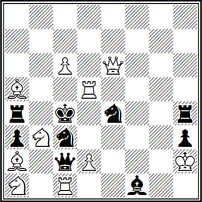

**C. Mansfield. "Hampshire Telegraph and Post", 1919, 1. Preis**. Weiß: **Kh2, De6, Tc1, Td5, La2, La5, Sa1, Sb3, Bauern c6, d2 (10)** und Schwarz: **Kc4, Dc2, Ta4, Th4, Lf1, Sc3, Se4, Bauern a3, h3 (9)** — Matt in zwei Zügen.

Das Problem wird durch den hervorragenden ersten Zug **1. Df5!** eröffnet, der die Drohung **2. Td4x** erzeugt, da die weiße Dame auf das Feld b5 aktiviert wird. Die Hauptvarianten: **1... Dd3 2. Sdx4x** und **1... Sb5 2. Sxc5x** enden mit effektvollen Batteriematten unter Verwendung von gleich zwei schwächenden Ideen: der Blockierung des Feldes d3 und der Bindung der schwarzen Dame. Den zentralen Varianten ähnlich sind **1... S:d5 2. D:f1x, 1... Se2 2. d3x** – mit der Blockierung des Feldes d5 und der Bindung der schwarzen Dame, der Verdeckung des schwarzen Läufers und der Entbindung des weißen Bauern.

Zwei andere Varianten sind einfacher: **1... D:d2+ 2. S:d2x** – Schach gegen den weißen König und Anlocken – dies ist ein Spezialfall der Ablenkung einer schwarzen Figur vom Schutz eines Feldes, definiert durch ihren Zug direkt auf dieses Feld.

Kennen Sie nun die Themen, die spezielle Bezeichnungen haben, obwohl der Inhalt jedes Schachwerks notwendigerweise auf bestimmten taktischen Ideen basiert, entweder in einer Komposition rekordartig ausgedrückt, d. h. eine Idee wird in ihr maximal verkörpert (dies ist eine Aufgabenkomposition/Task), oder das Werk enthält gleich mehrere taktische Momente.

Also, die Themen.

**Aserbaidschanisches Thema** (oder **Wladimirow-Thema**) – es ist verwandt mit dem Bann-Thema, aber darin erfolgen auf die Verteidigungen a—b die Matts A—B – die ersten Züge der Versuche. Dieses Thema wird wie folgt formuliert: Die Einleitungszüge der Versuche werden in der Lösung zu mattsetzenden Zügen als Antwort auf die Züge, welche eben diese Versuche widerlegten.

Wir merken an, dass dank des Vorschlags des sowjetischen Großmeisters Ya. G. Wladimirow, nach dessen Namen das betrachtete Thema zuvor benannt war, Gerechtigkeit wiederhergestellt wurde: nun hat sein Mechanismus die Bezeichnung "aserbaidschanisches Thema" erhalten, entsprechend dem Wohnort der drei Hauptautoren der Idee, die in Aserbaidschan leben.

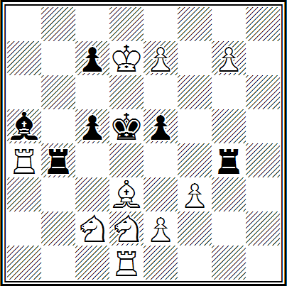

**R. Aliovsadsade, M. Vagidov, Ya. Wladimirow und I. Lukimowitsch. "Schach", 1977, Sonderpreis**. Weiß: **Kd7, Ta4, Td1, Ld3, Sc2, Sd2, pp. e2, e7, f3, g7 (10)** und Schwarz: **Kd5, Tb4, Tg4, La5, pp. c5, c7, e5 (7)** – Matt in zwei Zügen.

Falsche Fährten durch die Züge des weißen Springers *1. Sc4? (A)* und *1. Se4? (B)* werden durch die Züge der schwarzen Bauern entsprechend *1... c4! (v)* widerlegt. In der Lösung **1. Lb5!** mit der Drohung **2. Lc6x** erfolgen auf dieselben Züge der Schwarzen thematische Batteriematte **1... e4(a) 2. Sc4x (A) und 1... c4 (v) 2. Se4x(B)** mit einer Abfolge von Versuchen und Verteidigungen.

**Albino** – das viermalige Spiel eines weißen Bauern, der sich in seiner Ausgangsposition befindet.

**Nr. 63. H. Bartolović und N. Petrović, Spanischer Wettbewerb, 1963, 1. Preis, Matt in 2 Zügen**  


Im Zweizüger (Nr. 63) wurden zwei Albino-Mechanismen in Scheinspuren verwendet: *1. fe? S4e5!*, *1. f3? ed!*, *1. f4? S6e5!*, *1. fg? L:g3+!*, *1. dc? b3!*, *1. d3? Ta6+!*, *1. de? S4—!* und schließlich die Lösung **1. d4!** mit der Drohung **2. D:g4X — 1... S4— 2. D:e3X, 1... S6e5 (f4) 2. Sf4X, 1... b3 2. S:c3X** und **1... Ta6+ 2. L:a6X**.

**Anti-Getgart** ist ein Thema, das 1928 vom sowjetischen Komponisten S. Lewman entdeckt wurde und eine defensive Idee darstellt, die die Anti-Form der Getgart-Überdeckung ist.

**Nr. 64. A. Weinshtein, "Pionerskaja Pravda", 1931, 1. Preis, Matt in 2 Zügen**  


In der Aufgabe (Nr. 64) ist eine Synthese dieser beiden Kombinationen dargestellt. Nach **1. De8!**, wobei man sich gegen die Drohung **2. Sdf6X** verteidigt, befreien die Schwarzen ihren gefesselten Läufer g6 in der Hoffnung, dass Weiß diesen bei dem Versuch, die Drohung durchzuführen, entbindet – darin liegt der Kern der Anti-Getgart-Verteidigung. Der Zug **1... f5** führt jedoch zu einer Überdeckung desselben Läufers auf einer anderen Diagonale, wovon die Weißen Gebrauch machen, indem sie **2. Sef6X** spielen, wodurch der überdeckte Läufer entbunden wird – dies ist das Thema der Getgart-Überdeckung.

**Weiße Korrektur** ist ein Mechanismus, der vier Elemente einer Aufgabe zu einem zusammenhängenden Komplex synthetisiert: einen indifferenten ersten Zug einer weißen Figur; die durch diesen indifferenten Zug erzeugte Drohung; die Widerlegung der Drohung und einen präzisen, korrigierenden Zug derselben weißen Figur, der die Widerlegung ihres indifferenten Zuges verhindert.

**Nr. 65. T. H. Bwee, 1973, Matt in 2 Zügen**  


Nr. 65. Der indifferente Rückzug des weißen Springers "f" erzeugt die Drohung *2. Tf5X*, die jedoch von den Schwarzen durch die Verteidigung *1... Le6!* widerlegt wird. Dann muss der Springer präziser gespielt werden, in der Absicht, die Einschaltung der weißen Dame auf der vierten Reihe durch den schwarzen Läufer zu nutzen, zum Beispiel *1. Se7 (1... Le6 2. Sc6X)*. Und wieder, da der Springer das Feld e7 für seine Dame blockiert hat, haben die Schwarzen eine Widerlegung *1... Td5!*. Ebenso wenig geht *1. Sd4? Ld5!* — das Feld d4 ist blockiert, und *1. Sd6? T:c7!* (aber nicht *1... Lc6 — 2. Dd4X*) — das Feld d6 ist blockiert. In der Lösung **1. Se3!** bereiten die Weißen gegen die Verteidigung **1... Le6** eine neue mattsetzende Antwort **2. D:f4X** vor.

**Weiße Kombinationen** — die bedeutendste und originellste Entdeckung des sowjetischen Problemkomponisten M. Barulin (1927), bei der es sich um ein Zwei-Zug-Thema handelt: Die Wahl des weißen ersten Zuges aus zwei oder mehr auf den ersten Blick gleichwertigen Fortsetzungen, wobei der Mechanismus zur Unterscheidung der ersten Züge auf den in diesen Zügen enthaltenen schwächenden taktischen Momenten der Weißen beruht.

**Nr. 66. V. Tschepischny, Jubiläumswettbewerb, 1967, 4. Preis, Matt in 2 Zügen**  


Das Thema der weißen Kombinationen ist in Problem Nr. 66 originell umgesetzt. Hier sind die Drohungen und Versuche der Weißen, den schwächenden Moment der Widerlegung zu nutzen, in drei thematischen falschen Spuren zyklisch miteinander verknüpft: *1. T:b5?* mit der Drohung *2. Lf5X* und der Widerlegung *1... Sd4!* (kein *2. Sc5X*, da der Springer aufgrund des antikritischen Zuges des weißen Turms vom Feld e5 abgeschnitten ist); *1. Lg1?* mit der Drohung *2. Sc5X* und der Widerlegung *1... Lf3!* (kein *2. Sf2X* wegen des Feldes e3) und *1. Tf7?* mit der Drohung *2. Sf2X* und der Widerlegung *1... cb!* (kein *1. Lf5X* wegen des Feldes f3). Lösung: **1. Lg4!** mit der Drohung *2. Sf2X* und den Varianten **1... Sd4 2. Sc5X** und **1... cb 2. Lf5X**.

**Bristol-Thema** (Wegfreimachen) — entdeckt durch den englischen Problemkomponisten F. Heiley im Jahr 1861. Sein Kern liegt in der Freimachung einer Linie: Eine Figur macht durch einen Zug entlang ihrer Wirkungslinie den Weg für eine andere Figur frei, die sich in dieselbe Richtung bewegt.

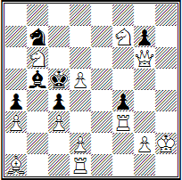

**F. Heiley. Bristol-Wettbewerb, 1861, 1. Preis**. Weiß: **Kh2, Dg6, Td1, Tf3, La1, Sb6, Sf7, pp. a3, c3, d2, d5, g2 (12)** und Schwarz: **Kc5, Lb5, Sb7, pp. a4, c4, f4, g7 (7)** — Matt in drei Zügen. **1. Th1!** — Zugzwang: **1... L— 2. Db1 Lb5 3. Dg1X**.

In drei Varianten der Stellung (Nr. 67) wird das **Anti-Bristol-Thema** realisiert — die schwarze Dame schließt dem Läufer, indem sie ihm entgegenzieht, den Weg zum benötigten Feld. **1. De2!** mit der Drohung **2. Df3+: 1... Dc3 2. S:b7, 1... Dd4 2. K:c7** und **1... De5 2. Sf7**: jeweils mit Matt 3. Sb6X oder 3. Se7X, da Schwarz den Zug 2...Lf6 nicht hat.

**Bukowiner Thema** — ein Thema des unorthodoxen Genres der Schachkomposition: In einer Aufgabe zum kooperativen Matt (laut Bedingung wirken in solchen Aufgaben die Schwarzen den Plänen von Weiß nicht entgegen, wie bei Aufgaben des gewöhnlichen Typs, sondern helfen ihnen im Gegenteil, den schwarzen König in einer vorgegebenen Anzahl von Zügen mattzusetzen; in der Regel beginnen sie auch die Lösung) wird ein beliebiges Feld in der Nähe des schwarzen Königs von einer weißen Figur kontrolliert, welche von Schwarz eliminiert wird, aber das kontrollierte Feld wird dann von Schwarz selbst blockiert. Autor ist der ukrainische Problemist, Doktor der physikalisch-mathematischen Wissenschaften N. I. Nagnibida (Stadt Czernowitz).

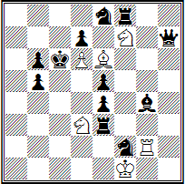

**N. Nagnibida, «Problemblad», 1979, 1. ehrende Erwähnung.** Weiß: **Kf1, Tg2, Le6, Sd3, Sf7, b d6 (6)** und Schwarz: **Kc6, Dh7, Te3, Tf8, Lg4, Se8, Sf2, bb b5, b6, d7, e4, e5 (12)** — kooperatives Matt in zwei Zügen (zwei Lösungen). **1. S: d3!** (die Figur, welche das Feld c5 kontrollierte, wurde geschlagen) **1... Td2. 2. Sc5!** (jetzt blockiert Schwarz dieses Feld selbst) **2...Ld5X.** Das Spiel ist in der zweiten Lösung analog: **1. L: e6! Tg6 2. Ld5! Sd8X.**

**Hamburger Thema** — eine logische Kombination, bei der die Widerlegung des Hauptplans im Versuchspiel und die durch ein vorbereitendes Manöver entstehende neue Verteidigung gegen den Hauptplan durch die Züge einer schwarzen Figur erfolgen, während das vorbereitende Manöver selbst durch den Zug einer anderen schwarzen Figur ausgeführt wird.

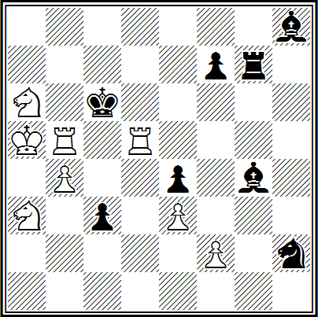

**1. Bremer, Deutscher Rundwettbewerb, 1948, 2. Preis**. Weiß: **Ka5, Tb5, Td5, Sa3, Sa6, bb b4, e3, f2 (8)** und Schwarz: **Kc6, Tg7, Lg4, Lh8, Sh2, bb c3, e4, f7 (8)** — Matt in drei Zügen.

Die falschen Fährten *1. Sc4?* und *1. Td4?* werden durch den schwarzen Turm widerlegt — entsprechend durch *1... Tg6!* und *1... Tg5!*. Nach **1. f4!**, wobei man sich gegen die Drohung **2. Tb6+ K:d5 3. Sc7X** verteidigt, öffnet Schwarz durch den Zug des Bauern f7 die siebte Reihe für seinen Turm. Jedoch wird beim Zug **1... f6** die sechste Reihe versperrt, und nach **2. Sc4** gegen **3. Td6X** schützt der Zug **2...Tg6** nicht mehr, aber es ist eine neue Verteidigung mit demselben Turm entstanden — **2...Td7**, auf die **3. Tdc5X** unter Ausnutzung der Blockierung des Feldes d7 folgt — das Hamburger Thema.

In der zweiten ideellen Variante versperrt Schwarz zuerst die fünfte Reihe und blockiert dann das Feld b7: **1... f5 2. Td4 Tb7 3. Tbc5X**.

**Zusatzverteidigung** — eine Art von Kombinationen in den Versuchen, bei der infolge mehrerer Züge von Schwarz die gleiche Schwächung entsteht und dadurch mehrere Matte möglich werden.

Die Auswahl eines einzigen möglichen Matts aus all diesen Möglichkeiten wird durch das Vorhandensein zusätzlicher Verteidigungsmomente in den Zügen von Schwarz bestimmt, die alle anderen Mattmöglichkeiten ausschließen.

**Nr. 68. L. Loschinski, Wettbewerb des Sportkomitees von Swerdlowsk, 1940, 1. Preis, Matt in 2 Zügen**  


Hier (Nr. 68) wird das Thema in einer Rekordzahl (im Sinne von Tasker) an Varianten präsentiert – nämlich fünf: **1. Da4!** mit der Drohung **2. Ld6#**, wobei die Besetzung des Feldes e4 durch die Dame abgedeckt wird: **1... fe 2. Da5#, 1... Txe4 2. b8D#, 1... Lxe4, Dxa1#, 1... Sxe4 2. Sc6#** und **1... Dxe4 2. h8D#**.

**Domination** – die Kontrolle über bestimmte Felder des Bretts, die dadurch für die angegriffene Figur oder Figuren des Gegners unzugänglich werden. Als Thema wird die Domination häufig von Studienkomponisten verwendet.

**Nr. 69. R. Réti, "Schach", 1928, 1. Preis, Gewinn**  


Nr. 69. **1. Kh6! Le5 2. Kg7! Lh2 3. c4! bc 4. e5! Lxe5! 5.bc Lxf6+ 6. gf Th8 7. Kxh8 Kd7 8. Kg8! Ke6 9. Kg7** mit Gewinn.

Eine schöne Studie, deren Wert nicht nur in der Endposition liegt, in der der König über den Turm dominiert, sondern auch im gesamten vorangegangenen feinen Spiel zur Erzeugung eines Zugzwangs. Die Endposition der Studie hat natürlich eine große praktische Bedeutung.

**Dresden-Thema** – eine logische Kombination, bei der die Widerlegung des Hauptplans im Probespiel und das vorbereitende Manöver durch Züge einer schwarzen Figur erfolgen, während die daraus resultierende neue Verteidigung gegen den Hauptplan durch den Zug einer anderen schwarzen Figur erfolgt.

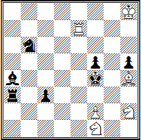

**B. Ebner. "Die Schwalbe", 1973, 2. Preis**. Weiß: **Kh8, Te7, Lh4, Sf1, Kh2, p. f2 (6)** und Schwarz: **Kf4, Ta3, La4, Sb6, pp. c3, f5, h5 (7)** — Matt in drei Zügen.

Die Durchführung jedes Hauptplans wird durch den schwarzen Läufer verhindert: *1. Sg3* mit den Drohungen *2. Se2#* und *2. Sxh5* schlägt nicht durch wegen *1... Ld1!*, und *1. Se3?* mit der Drohung *2. Sg2#* scheitert an *1... Lc6!*. Nach **1. Te6!** zwingen die schwarzen Verteidigungen gegen die Drohung **2. Lg3+ Kg5 3. f4#** die Blockierung des Läufers, zum Beispiel durch den Zug **1... c2**. Nun verhindert die Verteidigung **1... Ld1** die Durchführung des Hauptplans nicht mehr, führt aber zum Erscheinen einer neuen Verteidigung – **2... Txg3**, abgeschlossen durch **3. fxg3#** – das Dresden-Thema.

**Zumauern** ist eine Kombination, bei der die Wirkungslinie einer schwarzen Fernfigur durch den Zug einer anderen schwarzen Figur auf diese Linie eingeschränkt wird. Wenn die schwarze Fernfigur infolge eines solchen Zuges die Möglichkeit, sich zu bewegen, vollständig verliert, handelt es sich um ein vollständiges Zumauern dieser Figur. In allen anderen Fällen handelt es sich um ein teilweises Zumauern.

Nr. 70. **D. Grechkin "Schach in der UdSSR", 1931, 2.–3. ehrende Erwähnung, Remis**  


Nr. 70. **1. Sd6+ Kb4! 2. La5+!** Das überstürzte Schlagen des Bauern führt zum Verlust einer Figur: *2. S:f7? Lb5+ 3. Kb6 Tg6+ 4. K— Tg7*. **2...Kb5 3. S:f7 Lb5+ 4. Kb7 Tg7 5. b4+ Kb4**.

Auf andere Königszüge folgt ebenfalls 6. Kb6 mit Angriff auf den Läufer.

**6. Kb6 T:f7**, Patt.

Ein lebhaftes Einleitungsspiel führt zu einem schönen Patt mit einem zugemauerten weißen Läufer.

Verteidigung auf dem Lockfeld ist ein Komplex aus einer Drohung und zwei oder mehr Varianten, die so miteinander verknüpft sind, dass die Verteidigungszüge der Schwarzen in der Drohung zu Verteidigungen gegen sie in den ideellen Varianten werden.

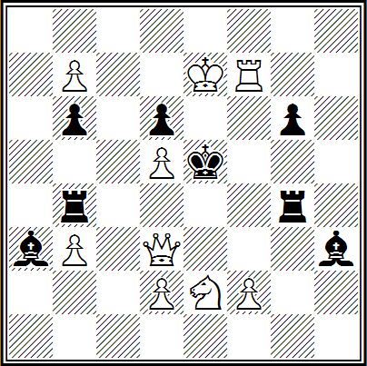

**L. Kubbel. "Schach in der UdSSR", 1939, 3. ehrende Erwähnung.** Weiß: **Ke7, Dd3, Tf7, Se2, pp. b3, b7, d2, d5, f2 (9)** und Schwarz: **Ke5, Tb4, Tg4, La3, Lh3, pp. b6, d6, g6 (8)** — Matt in drei Zügen.

Nach **1. Sc3!** drohen Weiß die schwarzen Türme auf das Feld e4 zu locken: **2. De3+ Tge4 3. f4X** oder **2...Tbe4 3. d4X** — mit Selbstbindung. Dieselben Züge der Schwarzen bilden die thematischen Varianten: **1... Tge4 2. b8D!** und **3. D:d6X** oder **3. Dh8X** (nicht *2...Tbf4*) und **1... Tbe4 2. b8S!** und **3. Sc6X** oder **3. Sd7X** (nicht *2...Tgc4*) — mit gegenseitigem Versperren der aufeinanderzubewegenden schwarzen Türme. Passend in den Inhalt fügen sich die falschen Fährten *1. b8D? Tbd4!* und 1. b8S? Tgd4! (Kommentar V. Rudenko).

Verteidigung auf dem Drohfeld ist ein Komplex aus einer Drohung und zwei oder mehr Varianten, die so verknüpft sind, dass die Verteidigungen der Schwarzen gegen die Drohung auf demselben Feld erfolgen, auf das im zweiten Zug der Drohung eine weiße Figur gelangt.

**Nr. 71. W. Granzhkovsky "Shakhy", 1947, 1. Preis, Matt in 3 Zügen**  


Nr. 71. Das erste dreivariante Drei-Züger zu diesem Thema. **1. Le8!** mit der Drohung **2. Sg4! — 3. S:h6X: 1... Tg4! 2. Sf7! T— 3. S:h6X, 1... Lg4! 2. Sc4! Lh3** und **3. S:e3X** und schließlich **1... g4! 2. Dd5! Kg5 3. S:f3X**. Die Drohung und die ersten zwei Varianten enden mit Modellmatts.

**Nitwelt-Verteidigung** — eine Kombination, bei der die Verteidigung der Schwarzen gegen eine Bedrohung durch eine Selbstfesselung erfolgt, mit dem Ziel, dass die Weißen die gefesselte schwarze Figur im Falle der Ausführung der Bedrohung direkt lösen.

Beim Nitwelt-Thema stellt diese Selbstfesselung ein von den Weißen genutztes Schwächungsmoment dar. Zur Nitwelt-Verteidigung gehört auch eine Kombination, bei der die Verteidigung gegen die Bedrohung durch den Zug einer bereits gefesselten schwarzen Figur entlang der Fesselungslinie erfolgt, mit demselben Ziel — dem direkten Lösen dieser gefesselten Figur durch die Weißen im Falle der Ausführung der Bedrohung.

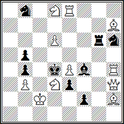

**P. Mussuri. "Aufgaben und Studien", 1929, 2. Preis**. Weiß: **Kc2, Dh3, Te8, Th4, Lh2, Lh7, Sd3, Sd8, pp. b3, d6, e4 (11)** und Schwarz: **Kd4, Tg6, Lf4, Sb8, Sh6, pp. b4, b5, e3, f2 (9)** — Matt in zwei Zügen.

**1. Dd7!** mit der Bedrohung **2. Da7#; 1... T:d6 2. Se6# und 1... L:d6 2. Le5#**.

**Schifman-Verteidigung** — eine Kombination, die sich von der Nitwelt-Verteidigung nur dadurch unterscheidet, dass anstelle des direkten Lösens ein indirektes Lösen verwendet wird.

Für die Zwei-Zug-Form ist charakteristisch, dass die Bedrohung, gegen die sich die Schwarzen nach Nitwelt verteidigen, immer durch den weißen Damenzug erfolgt, während die Bedrohung, gegen die sie sich nach Schifman verteidigen, durch eine weiße direkte Batterie erfolgt.

**Nr. 72. L. Isajew, "Schachblatt", 1930, Matt in 2 Zügen**  


In der Aufgabe (Nr. 72) wirken zwei schwarze Figuren auf die weiße Batterie ein; wenn die Wirkung einer dieser Figuren durch die Schwarzen selbst aufgehoben wird, setzen die Weißen matt, indem sie die Wirkung der anderen beseitigen: **1. Dc3!** mit der Bedrohung **2. Sdc5#; 1... L:d4 2. Sef4#** und **1... T:d4 2. Sg7#**. Zwei weitere Spielzüge der Batterie erfolgen mit Schach gegen den weißen König: **1... Ke4+ 2. Sg5#** und **1... Kxe2+ 2. Sdf4#**.

Der Kern des ideellen Komplexes dieser Aufgabe ist das Spiel der Batterie, wobei die ersten zwei Varianten durch eine originelle Kombination — die Schifman-Verteidigung — erschwert werden.

**Indisches Thema** — eine Kombination der Überdeckung weißer Figuren auf einem Feld, das zuvor von einer dieser Figuren überquert wurde, mit anschließendem Spiel der durch diese Figuren gebildeten Batterie. Das Thema erhielt seinen Namen nach der bekannten Stellung "Das Indische Problem", die von dem englischen Kapitlan G. Lowday aus Delhi gesandt und 1845 in europäischen Schachzeitschriften veröffentlicht wurde. Diese Aufgabe enthielt ein äußerst schwieriges Manöver und weckte allgegenwärtiges Interesse unter Schachspielern.

**Nr. 73. I. Kotz und K. Kokkelkorn, "Das Indische Problem", 1903, Matt in 4 Zügen**


Nr. 73. Ein sehr interessantes Vierzugproblem. Das indische Manöver wird in zwei Varianten ausgeführt: **1. ed c6 2. La2 c5 3. Tc4 Kb eb 4. T:c5#** und **1... e5 2. T:a4 c4 3. L:c4 Se (g) 4. Le6#**.

In jedem Fall spielt die weiße Fernfigur im zweiten Zug so, dass sie von einer anderen Figur verstellt werden kann, um ein Patt zu vermeiden. Ein solcher Zug wird als kritischer Zug bezeichnet.

**Kiewer Thema** — eine Synthese aus zwei Themen — weißen Kombinationen und der wiederholten Bedrohung (siehe schwarze Korrektur).

Einen großen Beitrag zur Entwicklung des Kiewer Themas haben die Kiewer Schachkomponisten B. Avsharov, E. Samotugov, A. Dzektzer und insbesondere B. Kowalenko (Region Kiew) und andere geleistet. Um jedoch der Gerechtigkeit halber zu sein, ist anzumerken, dass die Idee der Verbindung von weißen Kombinationen und schwarzer Korrektur viel früher vom deutschen Problemisten Z. Bremer entwickelt wurde.

**Nr. 74. Z. Bremer, "Schach-Express", 1949, Matt in 2 Zügen**  


Nr. 74. 1. Sc1? (Bedrohung 2. Sd5#) S4—!, 1. Sf2? S4— 2. Dc1#, aber 1... Sd2!; 1. Sf4? (Bedrohung wie zuvor) S6—!; 1. Se5? S6— 2. Lg5#, aber 1... Sf4! Richtig ist **1. Sc5!** und die Weißen haben keine Schwierigkeiten, ihren Plan umzusetzen. Die filigrane Konstruktion, vier falsche Fährten, ein exzellenter Einleitungszug, der dem schwarzen König später ein freies Feld einräumt, haben sich letztendlich durchgesetzt — das Problem wurde zu Recht in das FIDE-Album für die Jahre 1945–1955 aufgenommen.

**Ventil** — ein Mechanismus, der aus zwei schwarzen Figuren besteht, von denen eine, während sie die Wirkungslinie der zweiten Figur öffnet, diese gleichzeitig auf einer anderen Linie verstellt (einfaches Ventil); ein Mechanismus, der aus drei schwarzen Figuren besteht, von denen eine, während sie die Wirkungslinie der zweiten Figur öffnet, gleichzeitig die dritte Figur verstellt (doppeltes Ventil).

**Nr. 75. L. Isajev und S. Levman, "Chess Amateur", 1928, 1. Preis, Matt in 2 Zügen**  


Nr. 75. Nach **1. Sg5** öffnen die Schwarzen, um sich gegen die Bedrohung **2. Se6#** zu wehren, mit dem Springer ihre Dame — **1... Sb4 2. Sb5#, 1... Sc3 2. Td3#** und **1... Se3 2. Sf3#** — in diesen Varianten wird dieselbe Dame auf anderen Linien verstellt (Thema des einfachen Ventils); in den Varianten **1... Se7 2. Lc5#, 1... Sc7 2. Dc5#** und **1... Sf4 2. De4#** werden andere Figuren verstellt — Thema des doppelten Ventils. Letztlich eine Synthese der Grundform des Themas mit seiner Antiform.

**Versuchskombination** — die Wahl des exakt mattsetzenden Zuges, basierend auf dem Mechanismus der Trennung von zwei oder mehr möglichen Matten, die infolge einer durch den Zug von Schwarz verursachten Schwächung entstehen. Diese Trennung wird entweder durch einen defensiven taktischen Moment des schwarzen Zuges (Zusatzverteidigung) oder durch eine Schwächung von Weiß bewirkt, die unmittelbar mit dem Versuch, einen mattsetzenden Zug auszuführen, verbunden ist.

**№ 76. M. Barulin, «Bristol Times», 1930, Matt in 2 Zügen**  


№ 76. Nach **1. La5 d3** ist der schwarze Läufer f4 gefesselt, und die Frontbatterie kann mattsetzen. Der Läufer c6 hat zwei Möglichkeiten, den Turm freizuspielen; jedoch ist der Zug 2. Le4? ein Versuch, da der schwarze Läufer entbunden wird; die Lösung ist nur **2. Lf3X**. Ähnlich verhält es sich nach 1... Lc1: Nur **2. e3X** setzt matt, nicht aber 2. e4X? aufgrund der Entbindung des schwarzen Bauern.

**Springer-Rad** — ein Mechanismus des achtfachen Spiels eines weißen oder schwarzen Springers, der im Zentrum des Brettes steht.

**№ 77. C. Mansfield, Rundwettbewerb der British Chess Problem Society, 1958, 2. Preis, Matt in 2 Zügen**  


№ 77. In einem Meredith (eine Aufgabe oder Studie, bei der die Gesamtzahl der Figuren 8 bis 12 beträgt) finden sieben der acht möglichen Rückzüge des weißen Springers subtile Widerlegungen in den Zügen der schwarzen Dame: *1. Sf1? Da2!, 1. Sd1? Dc8!, 1. Sc2? Da1!, 1. Sc4? Da5!, 1. Sd5? De8!* (hier wird leider auch 1... Sg3 widerlegt), *1. Sf5? Dd8!* und *1. Sg4? Db8!*. Die Lösung ist der letzte Springerzug **1. Sg2!**. In den falschen Fährten ist das Thema des Springer-Rades originell umgesetzt.

**Festung** — ein Studien-Thema, eine Variante des positionellen Remis, bei der sich die schwächere Seite rettet, indem sie eine uneinnehmbare Position schafft. Vorgeschlagen wurde dies vom sowjetischen Studienkomponisten F. M. Simchovich.

**№ 78. I. Haschek, «Schach in der UdSSR», 1965, 4. Preis, Remis**  


№ 78. Die Festung wird durch einen Läufer mit Bauern gegen eine Dame gebildet, wobei der schwarze König aus dem Spiel ausgeschlossen ist. **1. Se5 e1D 2. Sg6+ hxg 3. L: d5**.

In der entstandenen Position ist der Läufer der Dame an Stärke ebenbürtig. Der Läufer erfüllt zwei Funktionen: Er verteidigt gegen Matt — Df1X und blockiert gleichzeitig den schwarzen König.

**3...Dc1 4. Kg2! Dd2+ 5. Kh3 Dd3! 6. Le4! Dd4 7. Ld5 Df2 8. Lc4 Dg1 9. Ld5**, Remis.
Der weiße König ist sicher in einer Pattfestung eingesperrt, während der Läufer subtil auf den Feldern d5, c4, e4 manövriert und den schwarzen König ständig gefangen hält.

**Kreuz** — ein Mechanismus des vierfachen Spiels einer Figur (König, Dame, Turm) in gleichen Abständen horizontal und vertikal.

**Nr. 79. V. Rudenko, "64 — Schachmagazin", 1980, 2. Preis, Matt in 3 Zügen**  


Nr. 79. **1. Sd5!** mit der Drohung **2. Sb6+ Ke8 3. Tf6# : 1... Ld6 2. T:c5+ Ke6 3. S:g5#, 1... Ld8+ 2. Tb6+ Kc8 3. Sd6#, 1... Lf8 2. Td6+ Kc8 3. Td8#** und **1... Lf6 2. Tc7+ Ke6 3. Sf4#** — als Antwort auf das vierfache Spiel des Läufers (das sogenannte **Sternchen** — ein Mechanismus des vierfachen Spiels einer Figur in gleichen Abständen diagonal) bewegt sich der weiße Turm viermal (**Turmkreuz**).

**Krim-Thema** — eine Synthese des Kiew-Themas mit zusätzlichen Verteidigungen, d. h. die Kombination von drei Themen — weißen Kombinationen, schwarzer Korrektur und zusätzlichen Verteidigungen.

**Nr. 80. A. Malyschew, Wettbewerb des Allsowjetischen Sportkomitees, 1948, 2. ehrende Erwähnung, Matt in 2 Zügen**  


Das Krim-Thema ist in Nr. 80 sehr deutlich dargestellt. Die dreifache Blockierung des Feldes c4 führt zu drei Varianten mit Kombinationen in den Versuchen: **1. Dg7!** mit der Drohung **2. Dd7# : 1... Dc4 2. f7#** (aber nicht *2. Se6#?* oder *2. Td5#*), **1... c4 2. Se6#** (aber nicht *2. Td5#?* oder *2. f7#*) und **1... Sc4 2. Td5#** (aber nicht *2. f7#?* oder *2. Se6#?*).

Die weißen Blockierungskombinationen finden sich in den falschen Fährten *1. Lf7? Dc4!*, *1. Le6? c4!* und *1. Ld5? Sc4!*.

**Lemberg-Thema** — ein zyklischer Wechsel der Art der Figuren, die an den thematischen Varianten beteiligt sind, sowie der Felder, die diese Figuren abwechselnd besetzen.

**Nr. 81. V. Zuev, Fünfter Allrussischer Wettbewerb, 1968, ehrende Erwähnung, Matt in 2 Zügen**  


Nr. 81. Nach **1. Kg8!** mit der Drohung **2. Df8#** ergibt sich folgendes Spiel: **1... Sd3 2. e4#, 1... e4 2. g4#** und **1... g4 2. Sd3#**.

Es ist leicht zu erkennen, dass erstens jede Variante mit dem Zug beginnt, mit dem die vorherige endet, und zweitens eine grafisch vollständige Einheit der aufeinanderfolgenden Züge besteht — unabhängig davon, ob Weiß oder Schwarz zieht.

**Moskau-Thema** — die Drohung eines Doppel-Schachs wird durch einen Zug von Schwarz pariert, der zwei Verteidigungsideen enthält.

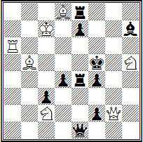
**V. Schif. Wettbewerb anlässlich des III. internationalen Turniers in Moskau, 1936, 1. ehrende Erwähnung**. Weiß: **Kc7, Dg2, Ta6, Lb5, Ld8, Sc2, Sh5 (7)** und Schwarz: **Kf5, De1, Te4, Te8, Lh7, pp. c3, d4, e7, f2, f4 (10)** — Matt in zwei Zügen.

Nach **1. Ta5!** droht **2. Ld7#** mittels eines Doppel-Schachs. Schwarz wehrt sich, indem ein Schach durch unmittelbares Blockieren der Linie pariert wird, während gegen den anderen durch das Einschalten einer schwarzen Figur verteidigt wird: **1... e5 2. Sg7#** und **1... Te6 2. Ld3#**. Zwei weitere Varianten liegen inhaltlich nahe: **1... e6 2. Dg5#** und **1... Te5 2. S:d4#** — in beiden Fällen erschwert durch Blockierung.

**Mchedruli** bedeutet übersetzt aus dem Georgischen "Springer-Thema": das systematische Zusammenspiel von Springern, die einen ewigen oder teilweisen Angriff auf den König und eine indirekte Drohung zum Gewinn einer Figur oder eines Tempos erzeugen. Entwickelt wurde dies vom Internationalen Großmeister G. A. Nadareishvili (Tiflis).

**Nr. 82. G. Nadareishvili, "Tschechoslowakisches Schach", 1965, 3. Preis, Gewinn**  


Nr. 82. **1. Sc8+!**

Nichts brachte Weiß *1. Sc6+ Kb7*. Nun ist es dem schwarzen König nicht erlaubt, auf das Feld b7 zu ziehen (*2. Sd6+ 3. Se4 h2 4. Sf2* — diese Möglichkeit, den Bauern aufzuhalten, muss auch im Weiteren beachtet werden). Schnell verliert *1... Ka8* wegen *2. S:b6+ Ka7* (*2...Kb7 3. Sc5+* usw.) *3. Sc8+ Ka8 (3... Ka6 4. Sc5+) 4. Kd6! h2 5. Kc7 h1D 6. Sdb6#*.

**1... Ka6 2. Sb8+ Ka5 3. Sc6+ Ka4.**

Die Fortsetzungen *3...Ka6 4. Sb4+* und *3...Kb5 4. Sd4+* erlaubten dem Springer, schnell die gefährliche Ecke zu erreichen.

**4. Sb6+ Ka3 5. Sc4+ Ka2.**

Falls *5. ...Ka4*, dann *6. Sb2+ Kb3 7. Sd1 h2 8. Sf2* usw.

**6. Sb4+ Ka1 7. Sd3**, und Weiß gewinnt.

Dies ist das erste Beispiel, in dem es dem Autor gelang, einen Gewinn nach dem Thema "Mchedruli" zu erzielen.

**Odessa-Thema** — das Abwechseln von mindestens zwei Drohungen und zwei Matten in den Varianten sowohl in den falschen Fährten als auch in der Lösung; das heißt, die Drohungen sind hier nicht bloß ein Hilfselement, sondern als eigenständige Varianten zu betrachten. Es wurde erstmals 1967 von den Odessaer Problemisten Ju. Gordian und V. Melnichenko entwickelt.

**Nr. 83. Ju. Gordian und V. Melnichenko, "Stella Polaris", 1968, 1. ehrende Erwähnung, Matt in 2 Zügen**  


Nr. 83. Durch das Entfesselndes ihres Bauern mit *1. Tg7?* drohen Weiß zwei Umwandlungen: *2. dc#* und *2. d8D#*. Die Verteidigungen *1... Db7* und *1... D:h8* differenzieren die Antworten der entfesselten weißen Dame — *2. Dc5#* und *2. Df4#*, doch *1... Sb6!* pariert diese falsche Fährte.

Deshalb lösen Weiß die Dame selbst **1. Tg6!**, sodass Schwarz, während er sich gegen beide thematischen Drohungen – **2. Dc5#** und **2. Df4#** – verteidigt, gezwungen ist, den weißen Bauern zu lösen: **1... Se7 2. dxc5#** und **1... Ne7 2. d8=D#**.

Diese Aufgabe war wahrscheinlich die erste, die den Anstoß zur Entwicklung dieser Idee gab. Obwohl in den Novotny-Überdeckungsmechanismen eine ähnliche Abfolge bereits früher verwendet wurde.

**Verzicht auf die Schlagmöglichkeit** – ein Thema in Endspielstudien und Mehrzugaufgaben: In der Lösung entsteht eine Position, in der eine Seite eine Figur des Gegners schlagen könnte, aber der richtige Zug in dieser Position ist der Verzicht auf diesen Schlag und ein anderer Zug.

**Nr. 84. W. Sawtschenko, Gedenkwettbewerb an K. Betiņš, 1968, 1. ehrende Erwähnung, Matt in 6 Zügen**  


Nr. 84. **1. Kb2! a1=D+ 2. Kc2!! Db1+ 3. Kd1!!** Schwarz lenkt den König, um sich gegen die Drohung *2. dxe5#* zu wehren, vom Feld c3 weg, aber Weiß schlägt die lästige Dame nicht und zieht sich auf das Feld d1 zurück, wonach dxe5+ und Be5# drohen. Schwarz kann das Matt nur um einen Zug verzögern: **3... D:c1+ 4. K:c1, 5. dxe5+** und **6. Be5#** oder **4... exd4+ 5. K:d2 und 6. e3#**.

**Pikenini** – ein Mechanismus des vierfachen Spiels eines schwarzen Bauern auf der siebten Reihe.

**Nr. 85. W. Jorgensen, "Bulletin der slowenischen Problemisten", 1961, Matt in 3 Zügen**  


Nr. 85. Hier verbindet sich die maximale Aktivität des schwarzen Bauern (Thema Pikenini) mit einem ähnlichen Spiel des weißen Bauern – dem Thema **Albino**. **1. Dh7!** mit der Drohung **2. T:g5+! Kf5 3. D:f5#. 1... exf4 2. Te5++ K:e5 3. d4#. 1... e6 2. Ta4+ K:a4 3. d3#. 1... exd4 3. K:d6+ Kd4 3. dxc5#** und **1... e5 2. T:f4++ K:f4 3. dxe5#**.

**Römisches Thema** – eine logische Kombination, bei der die Widerlegung des Hauptplans im Probespiel (Probespiel – eine Folge von aufeinanderfolgenden Zügen von Weiß und Schwarz, die es ermöglicht, die Hindernisse für die Ausführung des Hauptplans zu bestimmen), das vorbereitende Manöver und eine neue Verteidigung gegen den Hauptplan durch Züge derselben schwarzen Figur ausgeführt werden.

**Nr. 86. J. Kohtz und C. Kockelkorn, "Deutsches Wochenschach", 1905, Matt in 4 Zügen**  


Nr. 86. Eine Aufgabe, die ein neues Gebiet der Thematik in der Schachkomposition eröffnete. Sie wurde von den Autoren einem in Rom lebenden Freund gewidmet, weshalb ihr Thema den Namen "Römisch" erhielt.

Weiß hat einen starken Zug *1. De2!?*, um anschließend *2. Ld3* und *3. Dc2X* zu drohen. Schwarz kann dies jedoch durch Le7 — g5:e3 verhindern. Um dieses Hindernis zu beseitigen, opfert Weiß den Springer und lenkt den Läufer auf die benachbarte Diagonale ab: **1. Sd6 Lxd6**, woraufhin eine analoge Verteidigung sich als unzureichend erweist: **2. De2 Lf4 3. ef Kxd4 4. De5X**.

Das Wesen des Römischen Themas besteht in einer solchen Ablenkung einer schwarzen Figur, dass die Ausführung einer analogen Verteidigung anschließend zu einer entscheidenden Schwächung führt. Einer der Autoren der Aufgabe, I. Kotz, betrachtete dieses Thema als seine bedeutendste Entdeckung.

In einer Studie wurde das Römische Thema zum ersten Mal vom lettischen Großmeister G. K. Matison (1894–1932) realisiert. Als Beispiel für die Umsetzung des Römischen Themas in einer Studie führen wir ein Werk des Begründers der modernen künstlerischen Studie, des verdienten Künstlers der RSFSR A. A. Troitzki, an.


**A. Troitzki. "Deutsche Schachzeitung", 1913**. Weiß: **Kf7, Sc2, pp. g2, h2, h6 (5)** und Schwarz: **Kf4, Tf1, pp. a2, h4 (4)** — Gewinn.

**1. h7 Kg5+ 2. Ke7!**

Aber nicht *2. Kg7? Tb1 3. h8D Tb7+!*

**2...Te1+ 3. Kd7 Td1+ 4. Kc7 a1D 5. Sxa1 Tc1+ 6. Kb7 Tb1+**.

Ewiges Schach? Nein, der Turm muss auf eine parallele Linie überführt werden.

**7. Sb3! Txb3+ 8. Kc7 Tc3+ 9. Kd7 Td3+ 10. Ke7 Te3+ 11. Kf7**, und Weiß gewinnt. Siehe auch Diagramm Nr. 45.

**Rovno-Thema** — im Laufe der Lösung tauschen eine weiße und eine schwarze Figur gegenseitig ihre Plätze. Es ist offensichtlich, dass dieses Thema zur Umsetzung des Vorhabens eine minimale Anzahl von Zügen erfordert — drei.

Im Jahr 1968 demonstrierte N. A. Leontjewa, eine Problemistin aus Rovno, zum ersten Mal diese interessante Neuerung, die später die Bezeichnung Rovno-Thema erhielt.

**Nr. 87. W. Lukjanow, "Zmina", 1977, 1. ehrenhafte Erwähnung, Matt in 3 Zügen**  


Nr. 87. Hier ist sie durch das Dresdner Thema kompliziert. Die Versuche *1. Sd6?* und *1. Se3?* führen aufgrund der entsprechenden Verteidigungen mit dem schwarzen Turm *1... Tg3!* und *1... Txc6!* nicht sofort zum Ziel. Zuerst muss die Blockierung der Wirklinie des Turms durch den schwarzen Springer erzwungen werden, was durch den Zug **1. c7!** mit der Drohung **2. Sa5! Tg3 3. Sc6X** erreicht wird. Nun tauscht in den ideellen Varianten der weiße Springer den Platz mit seinem schwarzen Gegenspieler: **1... Se3 2. Sd6! Sc4 3. Sf5X** und **1... Sd6 2. Se3! Sc4 3. Sf5X**.

**Sambor-Thema** — in einer falschen Spur (einem Versuch) entstehen gleichzeitig drei oder mehr Drohungen, die sich in der Lösung in Matts gegen die Verteidigungen von Schwarz verwandeln. Eine zwingende Bedingung ist, dass diese Matts in der Ausgangsstellung nicht vorhanden sind, d. h. sie dürfen nicht vorbereitet sein.

An diesem interessanten und komplexen Thema arbeitete aktiv eine Gruppe von Schachkomponisten aus dem Bezirk Sambir in der Oblast Lwiw, angeführt von dem Schachkompositionsenthusiasten R. Zalokotsky. Dazu gehören E. Gavrilov, A. Mityushin, I. Soroka, V. Seredinsky und andere. Daher erhielt das Thema später nach ihrem Wohnort den Namen Sambor-Thema.

**Nr. 88. A. Mityushin und R. Fedorovich "Matt", 1979, Matt in 2 Zügen**  


Nr. 88. Hier wird das Sambor-Thema erstmals durch das Spiel einer Turmbatterie ausgedrückt. Nach *1. Lf6?* wird das Feld d4 besetzt, was es für Weiß ermöglicht, sofort drei Batterie-Mattdrohungen durch den Rückzug des Turms auf der e-Linie nach unten zu schaffen — *2. Te3#, 2. Te2#* und *2. Te1#*. Aufgrund von *1... Kg5!* bricht dies jedoch zusammen.

Die Lösung erfolgt durch den symmetrischen Zug des Läufers nach links: **1. Lb6!** — Zugzwang: **1... Tc3 2. Te3#, 1... Tc2 2. Te2# und 1... Tc1 2. Te1#**. Zusatzspiel: **1... S5— 2. Sc7#, 1... S7— 2. Sf6# und 1... Tc4 2. bxc#**.

**Systematische Ideen** — Ideen in einer Studie (seltener in einem Problem), bei denen eine oder mehrere Figuren in ihrer Bewegung ein bestimmtes, periodisch wiederkehrendes System bilden.


**G. Gasparyan. M. I. Tschigorin-Memorial, 1949–1950, 2. Preis**. Weiß: **Kg2, Lf6, Lf7, Sc5, B. a3 (5)** und Schwarz: **Ke2, Te3, Lb5, Lf8, B. a7 (5)** — Remis.

**1. Lh5+ Ke1 2. Lh4 Kd2 3. Lg5 Lxc5 4. Kf2 Kd3 5. Lg6+ Te4+ 6. Kf3 Lc6 7. a4! Kd4 8. Lf6 Te5+ 9. Kf4 Ld6 10. a5! Kd5 11. Lf7+ Te6+ 12. Kf5 Ld7 13. a6!** — Remis.

Eine analoge Stellung der acht beweglichen Figuren wiederholt sich viermal — nach dem 4., 7., 10. und 13. Zug von Weiß. Siehe auch Diagramm Nr. 35.

**Tagil-Thema** — Wechsel wiederholter Drohungen mit einem Wechsel der Matts gegen wiederholte Verteidigungen. Ende der 50er Jahre arbeitete eine Gruppe von Schachkomponisten aus Nizhni Tagil, darunter B. Nazarov, V. Maliy, F. Rossomacho und Ya. Rossomacho, intensiv an diesem Thema.

**Nr. 89. Ya. Rossomacho, Gedenkwettbewerb M. I. Tschigorin, 1949–1950. Ehrwerte Erwähnung, Matt in 2 Zügen**  


Nr. 89. Falsche Spur *1. Tc6?* mit der Drohung *2. Dc4#* und der Verteidigung *1... S3— 2. Dd3#*, aber Schwarz hat die Möglichkeit, sich auch gegen dieses Matt zu wehren, zum Beispiel *1... Sc5!* — dann folgt *2. Td6#*, und gegen *1... Sd4* folgt *2. Le4#*, widerlegt wird dies durch *1... b5!* Richtig ist **1. Te4!** mit derselben Drohung. Jetzt ändern sich die Antworten auf dieselben Verteidigungen zu **1... S3— 2. Db5#, 1... Sc5 2. Se3#** und **1... Sd4 2. Te5#**.

**Banny-Thema** (benannt nach dem sowjetischen Komponisten D. Banny) – die ersten Züge der Versuche (A—B) werden durch die Verteidigungen a—b widerlegt; in der Lösung erfolgen gegen die Verteidigungen a—b die Matts B—A mit Zügen, die in den Versuchen als Einleitungszüge fungierten. Das heißt, der Einleitungszug eines Versuchs wiederholt sich in der Lösung, wo er zum mattsetzenden Zug als Antwort auf die Widerlegung des zweiten Versuchs wird, und umgekehrt setzt der Einleitungszug des zweiten Versuchs in der Lösung gegen den widerlegenden Zug des ersten Versuchs matt.

**Nr. 90. D. Banny "Schach in der UdSSR", 1972, Matt in 2 Zügen**  


Nr. 90. *1. e3? Sc6! 1. e4? S:f3!* und **1. Df1!** mit der Drohung **2. Dc1#: 1... Sc6 2. e4# und 1... S:f3 2. e3#**.

**Bogdanov-Thema** – mattsetzende oder Zwischenzüge eines illusorischen Spiels werden zu den ersten Zügen einer thematischen falschen Spur und der Lösung, wobei sie zwingend gespielt werden müssen. Autor: E. Bogdanov (Lemberg).

**Nr. 91. E. Bogdanov, "Matt", 1981, 3. Preis, Matt in 2 Zügen**  


Nr. 91. Eine der ersten Aufgaben zum Bogdanov-Thema. In der Ausgangsposition sind Matts gegen die Abzüge der schwarzen Dame bereit: *1... Dg8 2. Sf7# (A), 1... Dc8 2. Sd7# (B)* und *1... Da6 2. Sc6# (C)*. Um die Drohung 2. T:e6# zu erzeugen, muss der Springer e5 ziehen. Aber wohin? *1. Sf7? (A)* — der erste mattsetzende Zug des illusorischen Spiels. — *1... Lg3 2. Sg5#* und *1... Sd8 2. S7d6#*, aber *1... L:f6!; 1. Sd7? (B)* — der zweite mattsetzende Zug des illusorischen Spiels! — *1... L:f6 2. S:f6#* und *1... Sd8 2. Sc5#*, aber *1... Lg3!*

Gelöst wird es durch **1. Sc6! (C)** — der dritte mattsetzende Zug des illusorischen Spiels: **1... L:f6 2. Sg3#** und **1... Sd8 2. Sfd6#** usw. Weitere Arbeiten an diesem Thema zeigten, dass es sich erfolgreich mit anderen Themen kombinieren lässt.


**E. Bogdanov und A. Vasilenko, "Głos ludu", 1983**. Weiß: **Kh7, Dh5, Tb6, Td7, Lg8, Be6, c7 (7)** und Schwarz: **Kf6, Ta8, La1, Bd6, f7 (5)** — Matt in zwei Zügen.

In der Meredith-Form wird die Idee ausgedrückt, das betrachtete Thema mit einem Wechsel nach dem Typ "erster Zug – Drohung" zu verbinden. Zuerst ist alles bereit: *1... K:e6 2. Tb6xd6+ (A)* und *1... d5 2. exf+ (B)*, dann ein falsches Spiel *1. Tb6xd6? (A)* — Drohung *2. exf+ (B)*; *1... Ta6 2. Sc8+* und *1... fxe 2. T:e6*, aber *1... Le5!* und schließlich die Lösung **1. exf! (B)** — Drohung **2. Tb6xd6+ (A); 1... Ta6 2. Df8+** und **1... Le5 2. Dg6+**.

**Brabec-Thema** — in den illusorischen Spielen und in der Lösung in zwei Varianten wechseln sich die Verteidigungsmotive zyklisch ab. Es wurde 1970 von dem tschechoslowakischen Problemkomponisten Juraj Brabec entdeckt.


**J. Brabec. «Slowakischer Schachbund», 1970, 1. Preis**. Weiß: **Kh5, Dc1, Tc4, Tg8, Le8, Le1, Se7, Sf7, Bd5, h2 (10)** und Schwarz: **Kf4, Ta3, Tf2, Le4, Lg7, Sh3, Bc7, f3, h7 (9)** — Matt in zwei Zügen.

*1. d6?* mit der Drohung *2. Sd5+: 1... Td2* (direkte Verteidigung) *2. Lg3+, 1... Ld4* (Lösen der Bindung) *2. Tg4+* — aber *1... c6!; 1. Lf5?* mit der Drohung *2. T:e4+: 1... Td2* (Lösen der Bindung) *2. Lg3+, 1... Ld4* (Blockierung) *2. Tg4+* — aber *1... Sg5!* und **1. Sf5!** mit der Drohung **2. D:e3+: 1... Td2** (Blockierung) **2. Lg3+** und **1... Ld4** (direkte Verteidigung) **2. Tg4+**.

**Visserman-Thema** — eine weiße Figur schlägt eine schwarze Figur auf einem thematischen Feld, was anschließend dadurch ausgenutzt wird, dass dieses Feld besetzt oder durch den Zug einer anderen weißen Figur durchquert wird.


**E. Visserman. «NVVG», 1946**. Weiß: **Kc7, Lf7, Lg5, Sd2, Se2, Bf2, h4 (7)** und Schwarz: **Ke5, Sb7, Bf4, f5, g6, g7 (6)** — Matt in vier Zügen.

**1. Lc4!** mit der Drohung **2. Lxf4+ Kf6 3. Lg5+ Ke5 4. f4+** — thematisches Feld f4: **1... f3 2. Sxf3+ Ke4 3. Sd2+ Ke5 4. f4+** — thematisches Feld f3.

**Getgard-Thema** — die Blockierung einer gefesselten schwarzen Figur durch eine andere schwarze Figur, wodurch die Weißen die Möglichkeit erhalten, diese gefesselte Figur indirekt zu lösen.

**Nr. 92. G. Getgard, «Allgemeine Handelsblatt», 1917, 3. ehrende Erwähnung, Matt in 2 Zügen**  


Nr. 92. Nach **1. Sg5!** mit der Drohung **2. Se4+** blockiert der schwarze Springer mit dem Zug **1... Sc5** seinen eigenen Läufer b6, und deshalb können die Weißen ihn lösen — **2. Sde6+**. Derselbe Springer führt eine Getgard-Blockierung des schwarzen Turms f2 aus — **1... Sd2 2. Sdf3+**. Zusätzliches Spiel — **1... S:g5 2. S:b3+** und **1... D:g5 2. T:b6+**.

**Dombrowski-Thema** — benannt nach dem sowjetischen Kompositionsmeister: In den Versuchen wird die Drohung A durch die Verteidigung "a" widerlegt und die Drohung B durch den Zug "b". In der Lösung führt die Verteidigung "a" zum Matt der Drohung A und entsprechend die Verteidigung "b" zum Matt der Drohung B. Die mattsetzenden Züge aus den Drohungen der Versuche gehen in der Lösung genau nach den Zügen der Schwarzen ein, die sie zuvor widerlegt hatten.

**№ 93. N. Nadeschdin, Wettbewerb in Finnland, 1972, 2. Preis, Matt in 2 Zügen**  


№ 93. Das gelungenste Beispiel für die dreifache Ausführung des Dombrowski-Themas. Die erste Phase *1. Sd4?* mit der Drohung *2. Lxe6* wird durch *1... c6!* widerlegt. Die zweite Phase *1. Dg4?* mit der Drohung *2. Sxe3* und der Widerlegung *1... e4!*. Die dritte Phase *1. De3?* mit der Drohung *2. Sxe7* und der Widerlegung *1... Lxd7!*.

Die Lösung ist **1. Kf6!** mit der Drohung **2. Dxe5**, wobei aufgrund der taktischen Sättigung (der König verlässt die Linie der Fesselung, zusätzliche Kontrolle der Felder e5 und e6) die ehemaligen Widerlegungen die Ursache für die zuvor gedrohten Matts werden — **1... c6 2. Lxe6, 1... e4 2. Sxe3** und **1... Lxd7 2. Sxe7**.

**Zakman-Thema** — erstens: in einer Problemstudie die Figurenverdoppelung durch ein Umwegmanöver anstelle eines kritischen Zuges; zweitens: in einer Studie versperrt ein schwarzer Bauer den Rückzug seines angegriffenen Läufers.

**№ 94. Z. Birnow, "Schach in der UdSSR", 1946, Gewinn**  


№ 94. **1. Tg5+ Kf8 2. Th5 Lc7 3. Kd7 Lb6 4. Tb5 La7 5. Ta5 Lb6 6. Ta8+ K— 7. Kc6**, und gewinnt.

**Zappas-Thema** — ein Feld in der Nähe des schwarzen Königs wird von drei weißen Figuren kontrolliert; in jedem der drei Versuche gibt eine der Figuren diese Kontrolle durch den ersten Zug auf, eine zweite durch den mattsetzenden Zug (in der Drohung oder in einer Variante). Die Verteidigung der Schwarzen besteht darin, die Kontrolle der dritten weißen Figur aufzuheben, damit das thematische Feld für den schwarzen König zugänglich wird.

**№ 95. B. Zappas, Rundwettbewerb, 1977, Matt in 2 Zügen**  


№ 95. *1. Dh1?* mit der Drohung *2. fx4* und der Widerlegung *1... b6!, 1. Se5?* mit der Drohung *2. Sxb6* und der Widerlegung *1... Lf4!, 1. Sc5?* mit der Drohung *2. Lxe4* und der Widerlegung *1... e5!* und schließlich **1. Sc5!** mit der Drohung **2. Lxe4** — das Zappas-Thema wird in den Verteidigungen gegen die Drohungen mit dem thematischen Feld d4 realisiert.

**Das Caprice-Thema** wurde vom Leningrader Schachkomponisten Ju. Suschkow vorgeschlagen und basiert auf dem Wechsel der Funktion desselben taktischen Elements, das in einer Phase eine defensive Rolle zum Abwehren einer schwarzen Bedrohung spielt und in einer anderen Phase die Weißen infolge ihres Einzuges schwächt. Wenn zum Beispiel die Schwarzen die Bedrohung einer Phase durch die Entbindung einer ihrer Figuren parieren, müssen die Weißen genau diese Figur in der zweiten Phase durch ihren Einzug entbinden.

**Nr. 96. Ju. Suschkow, "Schach", 1980, 2. Preis, Matt in 2 Zügen**  


Nr. 96. Die Versuche der Weißen *1. Kh4?* mit der Bedrohung *2. D:h2#* und *1. S:h2?* mit der Bedrohung *2. Dh4#* wehren die Schwarzen durch das Ausschalten weißer Figuren ab – des Turms a4 und des Läufers a1 – entsprechend durch *1... Tc4!* und *1... Db2!*. Mit dem hervorragenden Einzug **1. Sd4!** mit der Bedrohung **2. Se2#** schalten die Weißen beide Figuren selbst aus, was den Kern des Caprice-Themas ausmacht. Die Verteidigungen der Schwarzen gegen die Bedrohung basieren auf dem verborgenen Ausschalten derselben weißen Figuren, was mit der Aktivierung anderer weißer Figuren auf eines der thematischen Felder einhergeht – **1... Tc4 2. Dh4#** und **1... Db2 2. D:h2#**.

Betrachtet man die Bedrohungen und Widerlegungen der falschen Phasen im Verhältnis zu den Lösungsvarianten, lässt sich leicht feststellen, dass dieser Komplex insgesamt das Hannelius-Thema darstellt. Es sollte auf die Mängel in der Gestaltung des komplexen Vorhabens hingewiesen werden – das Vorhandensein von technischen Figuren, die in der unteren rechten Ecke des Brettes gedrängt sind, und, was besonders unerfreulich ist, die Möglichkeit, die Bedrohung in der Lösung nicht nur durch das subtile thematische Ausschalten *1... Db2*, sondern auch durch das lineare *1... Db5* (a6) abzuwehren. (Kommentar von Großmeister W. Rudenko.)

**Das Lewman-Thema** – in der Verteidigung beseitigen die Schwarzen die Bedrohung, indem sie vorab eine Linie blockieren, auf der eine weiße Figur agieren würde.

**Nr. 97. S. Lewman, "The Problemist", 1932, 2. Preis, Matt in 2 Zügen**  


Nr. 97. Hier wird das Thema in drei Varianten durchgeführt. Nach **1. Dc5!** parieren die Schwarzen die Bedrohung **2. D:e7#**, indem sie vorab die e-Linie auf dem Feld e6 blockieren und dadurch das Feld e5 freigeben: **1... e6 2. Tf4#, 1... Se6 2. T:g6#** und **1... Le6 2. D:d4#**.

In den ersten beiden Varianten ist das Lewman-Thema durch die Entbindung einer weißen Figur erschwert, während die erste und die dritte Variante eine Überdeckung nach Grimshow bilden. Die Aufgabe ist im Standardstil der strategischen Schule gut konstruiert.

**Loshinsky-Thema** — eine Kombination aus zwei oder mehr Varianten, in denen eine weiße Figur als Reaktion auf den Zug einer gleichartig ziehenden schwarzen Figur dieser entgegengeht oder sie auf derselben Linie verfolgt – siehe auch Nr. 20.


**L. Loshinsky. K. Gawrilow-Gedächtniswettbewerb, 1947—1948, 1. Preis**. Weiß: **Ke1, Da3, Tg3, Lf3, Lf4, Sb2, Sh4, pp. b5, c4, d3, e7, h7 (12)** — Schwarz: **Kd4, Da8, Ta6, Tg5, Le4, Sa2, pp. a5, f5 (8)**; Matt in drei Zügen.

Hier ist das Loshinsky-Thema in einem diagonalen Mechanismus – mit Läufern – ausgeführt. **1. Sa4!** mit der Drohung **2. Db2+ Kd3 3. Le2# 1... Ld5** (wodurch das Feld e4 freigegeben wird) **2. Le4** (aber nicht *2. Lxd5? Te6—!*) **2... fxe4 3. Dc5#** oder **2... Dc6 3. Sf3#. 1... Lc6 2. Ld5!**, aber nicht *2. Le4?* wegen *2... fxe4!* oder *2. Lxc6?* — *2... Qxc6!* und **1... Lb7 2. Lc6!**, aber nicht *2. Le4?* aufgrund von *2... fxe4!* und *2. Ld5?* oder *2. Lxb7?* wegen *2... Te6+!*

**Mlynka-Thema** — in der Stellung wechseln sich die Verteidigungsmomente von drei Varianten eines illusorischen Spiels oder einer falschen Fährte zyklisch in der Lösung ab.

**Nr. 98. K. Mlynka, «Tschechoslowakisches Schach», 1977, 1. Preis, Matt in 2 Zügen**  


Diagramm Nr. 98. *1. Te7?* mit der Drohung *2. Te3#: 1... Sd4* (Einschaltung einer schwarzen Figur) *2. Sd2#, 1... Se6* (Ausschaltung der drohenden Figur) *2. Qxc6#* und *1... f4* (Angriff) *2. Dh3#* wird durch *1... Te6!* widerlegt: die Lösung **1. Txb4!** mit der Drohung **2. Tf4#: 1... Sd4** (Ausschaltung der drohenden Figur) **2. Sd2#, 1... Se6** (Angriff) **2. Qxc6#** und **1... f4** (Einschaltung einer schwarzen Figur) **2. Dh3#**.

**Montreal-Thema** — in der Lösung entfernt sich der weiße König vom schwarzen und gibt ihm ein freies Feld. Der weiße König befreit dabei eine seiner Figuren, die eine Drohung erzeugt. Wenn der schwarze König das ihm überlassene Feld besetzt, muss das Matt durch eine andere Figur als diejenige gegeben werden, die die ursprüngliche Drohung erzeugt hat. In den Hauptvarianten fesseln Schwarz die befreite Figur der Weißen.

**Nr. 99. A. Kopnin, «Peugeot», 1962, 1. Preis, Matt in 2 Zügen**  


Diagramm Nr. 99. **1. Kf1!** mit der Drohung **2. e3#: 1... Ke3 2. Tc3#** und **1... Sc3 2. Td5#**, sowie **1... Sd6 2. Tc7#** und **1... Sc7 2. Tc6#**.

**Nissl-Thema** — die Weißen opfern im Laufe der Lösung eine bestimmte Figur und verwandeln anschließend ihren Bauern in eine Figur desselben Typs.

**Nr. 100. A. Popandopulo, «64», 1971, Matt in 7 Zügen**  


Diagramm Nr. 100. Funktioniert nicht sofort *1. Kg2? Lxe4+!* Richtig ist **1. Lc5! dxc5** (Läuferopfer) **2. d6 c4 3. d7 c3 4. d8L!** (und die Umwandlung des Bauern ebenfalls in einen Läufer) **4. ...c2 5. Lg5 c1D 6. Lxc1 L— 7. Lb2#**.

**Novotny-Thema** — ein Kompositionsthema, bei dem Weiß durch ein Figurenopfer auf einem kritischen Feld eine gegenseitige Verdeckung zweier weitreichender, verschiedenlaufender schwarzer Figuren auf dem Opferfeld bewirkt. Bei einer logischen Ausformung des Themas sind zwei thematische Drohungen nach dem Zug von Weiß auf dem Opferfeld erforderlich. In Dreizügern kann das Thema mit kritischen Zügen der schwarzen Figuren realisiert werden. Das Thema wurde 1854 entwickelt, obwohl festgestellt wurde, dass es bereits 1844 in einem Problem von J. Breads vorkam.

Eine Kombination der gegenseitigen Verdeckung zweier verschiedenlaufender schwarzer Figuren ohne ein weißes Figurenopfer wird als **Grimshaw-Thema** bezeichnet, welches von ihm im Jahr 1850 entdeckt wurde.

**Nr. 101. C. Mansfield, "Die Schwalbe", 1956, 1. Preis, Matt in 2 Zügen**  


Diagramm Nr. 101. Eines der ersten Beispiele, die die Wahl des richtigen Feldes zur Umsetzung des Novotny-Themas illustrieren. Versuche: *1. f4? e3!, 1. g3? Sc2!* und *1. g4? Sxf2!* Lösung: **1. f3!** mit den Drohungen **2. Dd1#** und **2. De3#**, die gegen die Verteidigungen **1... Txf3** und **1... Lxf3** durchgehen; in den Varianten **1... Lf4 2. Dxe4#** und **1... Tf4 2. Lxb3#** liegt ein Grimshaw-Thema vor.

Wenn die verdeckende Figur nach der Verdeckung ablenkbar ist (wie beim Plachutta-Thema – siehe), dann wird dieses Thema als **Brunner-Novotny-Thema** oder **Brunner-Plachutta-Thema** bezeichnet (entdeckt von E. Brunner im Jahr 1912).

**Nr. 102. E. Brunner "Münchener Neue Nachrichten", 1912, Matt in 3 Zügen**  


Diagramm Nr. 102. **1. S2e3! Txe3 2. Tf3+ Txf3 3. Tb6#** und **1 ...Lxe3 2. Tb6+ Lxb6 3. Tf3#**.

**Plachutta-Thema** — eine durch ein weißes Figurenopfer erzwungene Kombination der gegenseitigen Verdeckung zweier gleichlaufender schwarzer Figuren auf dem Opferfeld. Bei einer logischen Ausformung des Themas ist das Vorhandensein von zwei thematischen Drohungen nach dem Zug von Weiß auf dem Opferfeld erforderlich.

**Nr. 103. W. Shinkman "White Rooks", 1910, Matt in 3 Zügen**  


Diagramm Nr. 103. **1. d5! Dxd5 2. Ta8+ Dxa8 3. Tg8#** und **1... Lxd5 2. Tg8+ Lxg8 3. Ta8#**.

Eine Kombination der gegenseitigen Verdeckung zweier gleichlaufender schwarzer Figuren auf einem Feld ohne ein weißes Figurenopfer ist das **Wurzburg-Plachutta-Thema** (entdeckt vom Neffen von W. Shinkman, O. Wurzburg, im Jahr 1909).


**O. Wurzburg. "Zlatá Praha", 1909**. Weiß: **Kg8, Db7, Te8, Sf3, Sg7 (5)** und Schwarz: **Kf6, Tc4, Td3, Sa7, Sd8, pp. c7, g4, g5, g6 (9)**; Matt in drei Zügen.

Erstes Beispiel einer Plachutta-Interferenz ohne Opfer einer weißen Figur am Kreuzungspunkt. **1. Se5!** mit der Drohung **2. Db2!; 1... Tcd4 2. Dd5! T:d5 3. S:g4#** und **1... Tdd4 2. De4! T:e4 3. Sd7#**.

Die Kombination, bei der eine schwarze Figur eine gleichziehende eigene Figur blockiert, wird als **Holzhausen-Thema** bezeichnet.


**W. Holzhausen. "Rieger Tageblatt", 1908**. Weiß: **Kh1, Td7, Le1, Sf4, Sh5, p. f3 (6)** und Schwarz: **Ke5, Tb3, Tc5, Sa7, Lb1, Sa5, pp. c3, c4, c7, f5, f7 (11)**; Matt in drei Zügen.

Sofort *1. Lh4?* funktioniert nicht wegen *1... Tb6!* (Drohung *2. Lf6#*). Deshalb zwingen Weiß mit dem Zug **1. Lf2!** zuerst Schwarz dazu, den Turm b3 mit dem eigenen Turm zu blockieren — **1... Tb5**, um die Mattdrohung zu beseitigen, und erst dann wird das Vorhaben ausgeführt — **2. Lh4**. Der schwarze Turm b3 ist blockiert, und die Verteidigung **2... Tb6** gibt die Kontrolle über das Feld d5 auf, woraufhin möglich ist — **3. Td5#**.

**Zielpunkt-Thema** — eine logische Kombination, bei der ein vorbereitender Plan darauf basiert, eine schwarze Figur auf ein Feld zu locken, das von ihr und einer anderen schwarzen Figur kontrolliert wird (Zielpunkt), der zweite vorbereitende Plan auf der Aufhebung der Kontrolle dieses Feldes durch die zweite Figur, und der Hauptplan auf der Vernichtung der gelockten Figur durch Weiß.

**Nr. 104. G. Sander, "Kölner Stadtanzeiger", 1960, Matt in 3 Zügen**  


Diagramm Nr. 104. Die Versuche von Weiß, sofort mit der Dame an den Punkt der gegenseitigen Blockierung unterschiedlich ziehender schwarzer Figuren zu ziehen, *1. Db7?* und *1. Db4?*, werden entsprechend durch *1... Kh5!* und *1... Se8!* widerlegt, da in jedem Paar von Blockierungen eine mattsetzende Antwort fehlt. Erst durch das Locken der schwarzen Figuren mit dem Zug **1. Se4!** auf den Zielpunkt e4 erhält Weiß die Möglichkeit, einen seiner Hauptpläne durchzuführen: **1... Te4 2. Db7! Tb7 3. fxe4#** oder **2... Lb7 3. Sg7#** sowie **1... Le4 2. Db4! Lb4 3. fxe4#** oder **2... Tb4 3. Sd6#**.

**Fortsetzungsverteidigung** — eine komplizierte Zusatzverteidigung, bei der das Verteidigungsmoment des schwarzen Zuges nicht nur dazu dient, Matte zu trennen, sondern auch eine Drohung abzuwehren.

**Nr. 105. I. Bierbragger, "Trud", 1950, 2. Preis, Matt in 2 Zügen**  


Hier (Nr. 105) tritt das Thema der fortgesetzten Verteidigung in Kombination mit dem Thema der wiederkehrenden Drohung (schwarze Korrektur) auf. Nach **1. Sd6!** droht **2. Fe4#**. Schwarz aktiviert seine Figuren durch den Rückzug der Springer, wobei wiederkehrende Drohungen entstehen – **1... Sd— 2. Se5#** und **1... Se— 2. Td5#**. Während sie diese Drohungen parieren, können die schwarzen Springer nach f4 ziehen, doch dann werden Matte möglich, die die gegenseitige Blockierung der schwarzen Figuren nutzen. Die genaue Wahl des jeweiligen Matts bei jedem der Springerzüge wird durch die Wirkung der aktivierten schwarzen Figur bestimmt – **1... Sdf4 2. Fe3#** (aber nicht **2. Sf5#**?) und **1... Sef4 2. Sf5#** (aber nicht **2. Fe3#**?).

Das Verteidigungsmoment – die Aktivierung der schwarzen Figuren – widerlegt nicht nur die ursprüngliche Drohung, sondern sorgt auch für eine präzise Trennung der Matte – die fortgesetzte Verteidigung. Zusätzliches Spiel – **1... Sdc5 2. D:c4#**, **1... Sec5 2. Sb5#** und **1... Sc7 2. Sc6#**.

**Das Rice-Thema** – besteht in der Wahl zwischen zwei Systemen ideeller Varianten mit einer zweifachen Entbindung einer Figur, die durch den weißen Eröffnungszug gefesselt wurde, und basiert gewöhnlich auf dem Mechanismus des einfachen Spielwechsels.

**Nr. 106. J. Rice, Wettbewerb der British Chess Problem Union, 1957, 1. Preis, Matt in 2 Zügen**  


Diagramm Nr. 106. Das Schlagen des Bauern d5 mit dem weißen Springer im ersten Zug *1. S:d5?* mit der Drohung *2. Dc4#* erzeugt ideelle Varianten mit der Entbindung dieses Springers und einer präzisen Trennung der Matte – *1... Sc5 2. Sb4#* und *1... Se5 2. Sf4#* (Widerlegung *1... Lc3!*). Die Lösung ist das Schlagen mit der Dame **1. D:d5!** mit der Drohung **2. Te3#**, welche durch dieselben Züge entbunden wird – **1... Sc5 2. Dc4#** und **1... Se5 2. De4#**.

**Das Rudenko-Thema** – in einer mehrphasigen Aufgabe (mindestens zwei Varianten) drohen in einer der Phasen mehrere Matte, die in den anderen Phasen als Varianten auftreten, wobei das gegenseitige thematische Paar – der Zug Schwarz plus das Matt Weiß einer Phase – nicht in anderen Phasen realisiert werden darf, selbst wenn der ideelle Zug Schwarz in einer der Phasen keine Verteidigung gegen die Drohung in einer anderen Phase ist. Das heißt, Aufgaben mit Spielwechsel in Form des Rudenko-Themas zeichnen sich durch eine spezifische Verbindung zweier Phasen aus: Die mattsetzenden Züge der ideellen Varianten einer Phase werden zur thematischen Mehrfachdrohung in der zweiten Phase.
  
**Nr. 107. W. Rudenko, "Československý šach", 1956, Preis, Matt in 2 Zügen**  


Das erste Beispiel eines mehrphasigen Wechsels in Form des Rudenko-Themas (Nr. 107). Das anfängliche illusorische Spiel mit der Blockierung *1... T:e5 2. Dd7X* und *1... L:e5 2. Dc4X* in der falschen Fährte *1. Sd3?* mit der Drohung *2. T:f6X* wechselt zu Varianten mit der Grimshaw-Kombination — *1... Te5 2. Sf4X* und *1... Le5 2. Sc5X* (Widerlegung *1... Td5!*).

Gelöst durch **1. Te1!** mit zwei thematischen Drohungen — **2. Dd7X** und **2. Dc4X**, deren Verteidigungen zu einem neuen Wechsel der Matts und des thematischen Inhalts führen — **1... T:e5 2. Lf5X** und **1... L:e5 2. Dd6X**.

Es ist anzumerken, dass das anfängliche Spiel durch eine betonende falsche Fährte *1. Lg8?* mit der Drohung *2. Lf7X* offengelegt wird, die durch den Zug **1... Lb8!** widerlegt wird.

Folglich werden die Matts des scheinbaren Spiels in der Lösung zu Drohungen, und bei den konstanten Verteidigungen von Schwarz ändern sich die Matts in jeder der Phasen. Zwei Drohungen werden hier als eines der Mittel verwendet, um drei Phasen zu verbinden.

**Rukhlys-Thema** (oder Wechsel der Verteidigung) — sein Wesen besteht darin, dass dieselben mattsetzenden Züge von Weiß sowohl im illusorischen als auch im tatsächlichen Spiel erhalten bleiben, während sich nur die Züge von Schwarz ändern, auf die diese Matts folgen.

**Nr. 108. E. Rukhlys, Wettbewerb des Swerdlowsk-Komitees für körperliche Kultur und Sport, 1946, 1. Preis, Matt in 2 Zügen**  


Die Position im Diagramm Nr. 108 gab den Anstoß zu einer weitreichenden und umfassenden Ausarbeitung dieses Themas. In der Ausgangsposition gibt es ein fertiges Mattnetz bei der Blockierung der schwarzen Figuren auf dem Feld d4 — die Grimshaw-Kombination: *1... Td4 2. Sc3X* und *1... Ld4 2. De4X*. Es gibt auch eine falsche Fährte *1. Lf2?* mit der Drohung *2. Sb6X*, die diesen Mechanismus in Gang setzt und durch *1... Te3!* widerlegt wird.

Der Schlüsselzug **1. d4!** erzeugt dieselbe Drohung. Die mattsetzenden Züge **2. Sc3X** und **2. De4X** greifen nun bei neuen Verteidigungen — **1... Ld3** und **1... Td3** — ebenfalls unter der Grimshaw-Blockierung, aber bereits auf einem anderen Feld, das heißt, der Startpunkt der strategischen Kombination hat sich vom Feld d4 nach d3 verschoben. Diese zwei Varianten illustrieren das Rukhlys-Thema in seiner einfachen Form. In der Lösung gibt es jedoch auch einen Wechsel der Matts bei den vorherigen Zügen von Schwarz aus dem illusorischen Spiel — **1... T:d4 2. Sb4X** und **1... L:d4 2. Sf6X**.

Diese Variante des Themas, bei der auf die alten Züge von Schwarz neue Matten folgen und auf die neuen Verteidigungen die alten Matten folgen, erhielt die Bezeichnung der **vollständigen Form des Rukhlis-Themas**. Beachtenswert ist, dass im Westen genau diese Form als Rukhlis-Thema bezeichnet wird; wenn sich die Matten hingegen auf die früheren Verteidigungen nicht ändern, handelt es sich lediglich um das Thema der "Verschiebung" von Matten.

**Das Verdopplungsthema** — die sogenannte Terton-Verdopplung: Eine Fernfigur räumt mit einem kritischen Zug die Linie für eine andere Fernfigur; letztere besetzt ein kritisches Feld und bewegt sich anschließend in die entgegengesetzte Richtung der ersten Figur, wobei sie fortan deren Unterstützung nutzt. Hierin liegt der Unterschied zwischen dem Verdopplungsthema und dem Thema der einfachen Linienfreiräumung (wie beispielsweise der Loyd-Freiräumung), bei der die Figur, die die Linie geräumt hat, im weiteren Spiel nicht mehr teilnimmt.

Das Verdopplungsthema hat drei Varianten.

**Das Terton-Thema**, das er im Jahr 1856 entdeckte, sieht vor, dass die Verdopplung mit der stärkeren Figur vorne erfolgt.

**№ 109. I. Kotz und K. Kokkelcorn, "Indisches Problem", 1903, Matt in 4 Zügen**  


Diagramm № 109. Beispiel einer Terton-Verdopplung zweier weißer Türme. Würde man versuchen, die Türme sofort mit dem Zug *1.Tff5?* zu verdoppeln, fände Schwarz eine ausreichende Verteidigung mit *1... Sb7*. Daher muss die Figur, die sich bereits auf der Verdopplungslinie befindet, auf dieser zurückweichen, um der zweiten den Weg nach vorne zu machen — darin besteht das Terton-Manöver: **1. Tg5! Sb7 2. Tff5! f3 3. Lg7 Sc5 4. Txc5#**.

Doch was ist das wahre Ziel des Zuges *1. Tg5?* Ist es für die Lösung wirklich so wichtig, in welcher Reihenfolge die Türme auf der fünften Reihe stehen? Es stellt sich heraus, dass der Turmzug nach g5 nur erfolgt, um die Diagonale für den Läufer zu öffnen.

**Das Loyd-Terton-Thema** — die Verdopplung erfolgt, wenn die stärkere Figur einer schwächeren den Weg überlässt. Entdeckt von S. Loyd im Jahr 1856.

**№ 110. E. Zepler, L. F. Palizyn-Gedächtniswettbewerb, 1932, 3. Preis, Matt in 4 Zügen**  


Diagramm № 110. Schwarz droht, ein Patt herbeizuführen nach *1... Sb4+ 2. Txb4*. Weiß muss mit der Dame zurückweichen, um die Bedrohung des Feldes c2 aufzuheben. Auf *1.Dd6* würde jedoch *1... Se1! 2. Td7 Sd3 3. Dxd3* folgen, und erneut gäbe es ein Patt. Man muss dem Turm den Weg nach vorne machen — **1. Dd8! Se1 2. Td7 Sd3 3. Txd3 Sbc2 4. Tc3#**.

**Das Brunner-Terton-Thema** — die Terton-Verdopplung von Türmen erhielt den Namen dieses Themas.
**Nr. 111. E. Brunner, "Akademische Monatshefte", 1910, Matt in 3 Zügen**  


Diagramm Nr. 111. Um das Patt der Schwarzen aufzulösen, muss Weiß den Turm c4 wegzuziehen. Ein Probespiel mit dem Zug *1. Tf4?* erreicht dieses Ziel nicht — *1... K:c5 2. Tgg4 Kc6 3. Tc4+ Kd7!*. Daher muss der Turm weiter wegziehen und einen Terton-Zug **1. Th4!** ausführen, damit später der andere Turm auf c4 matt setzt und dabei den Läufer h3 auf dem Feld d7 blockiert — **1... K:c5 2. Tgg4 Kc6 3. Tc4#**.

**Stocchi-Thema** — eine dreivariante Wahl des mattsetzenden Zuges im Thema der Kombination in Versuchen.

**Nr. 112. O. Stocchi, Wettbewerb des Italienischen Verbandes für Problemkomponisten, 1937, 1. Preis, Matt in 2 Zügen**  


Diagramm Nr. 112. In der Aufgabe werden durch die Blockierung des freien Feldes e6 drei Matte möglich; jedoch werden jedes Mal zwei davon durch das Einschließen einer schwarzen Figur verhindert — **1. Lg8!** mit der Drohung **2. Tf5# : 1... e6 2. Td4#** (aber nicht *2. Sb4#?* oder *2. Ta5#?*), **1... Le6 2. Ta5#** (aber nicht *2. Td4#?* oder *2. Sb4#?*) und **1... Te6 2. Sb4#** (aber nicht *2. Ta5#?* oder *2. Td4#?*). Die Zusatzverteidigung wird durch drei schwarze Figuren ausgeführt — den Läufer f8, den Turm h4 und die Dame g1.

**Umnov-Thema** — ein Komplex aus zwei oder mehr Varianten, in denen eine weiße Figur auf das Feld einer zuvor weggezogenen schwarzen Figur zieht.

**Nr. 113. E. Umnov, Wettbewerb des Schachclubs des VTsSPS, 1938, 1. Preis, Matt in 3 Zügen**  


Diagramm Nr. 113. Nach **1. Lb4!** droht die Gewinnung des schwarzen Springers auf zwei Arten — mit dem Läufer oder mit dem Bauern.

In den ideellen Varianten werden nacheinander Obstruktion und indirekte Selbstbindung der schwarzen Figuren eingesetzt — **1... L:d4 2. Df6! K:d5 3. De5#** oder **2... L:f6 3. L:c5#** sowie **1... S:d4 2. Db5! K:d5 3. Dc8#** oder **2... S:b5 3. L:c5#**.

Das glanzvolle, taktisch gesättigte Spiel erforderte auch erhebliche technische Kompromisse: Der Eröffnungszug ist schwach, da er zwei passive weiße Figuren aktiviert und den schwarzen Springer bindet; zudem sind die zwei Drohungen unangenehm, insbesondere aufgrund der inhaltlichen Beschränkung auf zwei zentrale Varianten.

**Das Fedorovich-Thema** – Widerlegungen von mattsetzenden Zügen in Versuchen oder falschen Spuren werden zu Verteidigungen, gegen die Matte folgen, die nicht in der Ausgangsposition vorbereitet waren, aber in Versuchen oder falschen Spuren aus irgendeinem Grund, der durch die Verteidigung von Schwarz verursacht wird, unmöglich waren, was durch den Schlüsselzug der Lösung beseitigt wird. Autor – der samborische Problemkomponist R. Fedorovich (Pseudonym von R. F. Zalokotsky).


**R. Fedorovich. "Tscherwonyj Prapor", 1982**. Weiß: **Ka2, Da4, Tb6, Tf7, Lf8, Se4, Sf4, p. f3 (8)** und Schwarz: **Ke5, Dc7, Tg1, Lb7, Se1, pp. c6, d2, d7, e6 (9)**; Matt in zwei Zügen.

Um die Drohung *2. De4#* zu erzeugen, muss der Springer e4 zurückweichen. Aber wohin? Wenn *1. Sd6?*, um den Bauern d7 vom Zug d7—d5 zu stoppen, so ergibt sich die Antwort *1... c5!* mit der Aktivierung des Läufers b7 auf dem Mattfeld der Drohung, wodurch das Matt der Drohung selbst widerlegt wird. In dem Versuch, die Drohung aufrechtzuerhalten, blockiert der weiße Springer mit seinem Schlüsselzug einen anderen Bauern — c6, dessen Bewegung die erste widerlegte — *1. Sc5?* — aber *1... d5!*.

Beachten wir, dass bei dem Zug *1... c5* der Turm b6 auf das Feld d6 aktiviert wird, was den Gedanken nahelegte, Matt zu setzen — *2. Lg7#*, und bei — *1... d5* wird das Feld d5 blockiert, was den Springer f4 für ein bisher unmögliches Matt freigibt — *2. Sg6#*. Dann finden wir die Lösung mit dem Zug desselben Springers — **1. Sg3!**, wodurch der Turm g1 blockiert wird, was es erlaubt, gegen die Verteidigungs-Widerlegungen **1... c5** und **1... d5** die zuvor unmöglichen, d. h. vorgesehenen Matte ungehindert auszuführen — **2. Lg6#** und **2. Sg6#**.

**Fleck-Thema** — erstens: nach dem Schlüsselzug drohen die Weißen sofort drei Matte, aber durch die Ausführung der thematischen Verteidigung parieren die Schwarzen alle Mattdrohungen bis auf eine.

Zweitens: Synthese von wiederholten Drohungen und zusätzlicher Verteidigung. In der Stellung führen die Weißen eine wiederholte Drohung aus, und die Züge der Schwarzen trennen die Matte genau (zusätzliche Verteidigung).


**I. Banai. "Magyar sakkvilág", 1941, ehrenwerte Erwähnung**. Weiß: **Kh1, Da4, Td4, Tg7, Lg2, Sd3, Sh5, pp. b3, d6, e5, g4 (11)** und Schwarz: **Ke6, Da8, Tc7, Tf8, Ld8, Le8, Sc6, Sf7, pp. b4, e4 (10)**; Matt in zwei Zügen.

**1. L:e4!** mit der Drohung **2. Lf5# : 1... Sfd6 2. Ld5#** (aber nicht *2. Shf4#?*), **1... Sf:e5 2. Sc5#** (aber nicht *2. Sdf4#?*) und **1... Sc:e5 2. Sdf4#** (aber nicht *1. Sc5#?*).

Drittens: **Fleck-Karlström-Thema** — nach dem Schlüsselzug entstehen mehrere Drohungen: die Anzahl der Verteidigungen in der Stellung muss gleich der Anzahl der Drohungen sein, und im Spiel beseitigen sie sofort alle Drohungen, folglich sind die mattsetzenden Züge bereits andere.


**A. Karlström, "Problemisten", 1947**. Weiß: **Sc4, Dh6, Tg1, Tg4, Lg7, Sa6, Se7, Ba2, b2, b3, b4 (11)** und Schwarz: **Kd4, De5, Te4, Th7, Lh8, Sa8, Ba3, a5, d3 (9)**; Matt in zwei Zügen.

**1. Sc7!** und vier Drohungen **2. Sb5#, Sc6#, Se6#, Sf5#**: **1... K:c7 2. Db6#, 1... d2 2. D:d2#, 1... Tf4 2. D:f4#** und **1... T:g4 2. T:g4#**.

**Das Fro-Thema** — ein Thema der Wiedergeburt in einem retroanalytischen Spiel von mindestens drei umgewandelten Figuren.

Beachten wir, dass gemäß dem Schachkodex der UdSSR die retrograde Analyse zu den besonderen Arten der Komposition gehört, und das ist verständlich — denn entsprechend eben diesem Kodex wird an jedes Problem oder jede Studie die Grundforderung der Legalität der Stellung gestellt. Das heißt, eine Stellung gilt als legal, wenn sie aus der ursprünglichen Aufstellung der Figuren mittels einer Beweispartie erreicht werden kann. Die Überprüfung einer Stellung auf Legalität wird als retrograde Analyse bezeichnet.

**Nr. 114. A. Frolkin, "Probleembad", 1981, 3. ehrende Erwähnung, Wie entstand die Stellung?**  


Diagramm Nr. 114. Retrospiel: **1. f8D Lc4 2. Df5 Df7 3. Dh1, Df2, 4. Kh6 Ld3 5. Dc2 Lf5 6. gf Dg2 7. f6 Df2 8. f7 Dg2 9. f8L Df2 10. Lg7 Dg2 11. Ld4 Df2 12. Lc5 Dg2 13. Lb4 Df2 14. Kg7 Dd4+ 15. Kf8 De5 16. h6 Dg7+ 17. hg a5! 18. g8D ab 19. Df7 b3 20. Df1 bc 21. Dd1 cdS 22. Kg7 Kf2 23. Kf8 Kd3 24. Kf7 Kc5 25. Le8+ Kd7 26. T:d7+**.

Im Retrospiel wurden vier umgewandelte Figuren verwendet — ein weißer Läufer und zwei Damen sowie ein schwarzer Springer. Dies ist ein Rekord für Aufgaben ohne zusätzliche Retro-Bedingung.

Und hier ist die kritische Stellung dieser Aufgabe, d. h. die Stellung, mit der der Beweis ihrer Legalität beginnt.


Weiß: **Kg5, Db8, Ta1, Td6, Lc1, Ld7, Sh8, Ba2, b2, c3, d2, e2, f7, g4, h5 (15)** und Schwarz: **Kd8, De8, Tb7, Tc7, La7, Ld3, Sa8, Sc8, Ba6, b6, c6, d5, e6, e7, g6, h7 (16)**. Weiß ist am Zug.

**Das Hannelius-Thema** — benannt nach dem finnischen Problemist Jan Hannelius, ist eng verwandt mit dem Dombrowskis-Thema, aber bei ihm folgt auf die Verteidigung "a" ein Matt B und auf die Verteidigung "b" ein Matt der Drohung A. Bei diesem Thema erfolgt das Matt aus der Drohung in einem Versuch in der Lösung nach einem Zug, der den anderen Versuch widerlegt, und umgekehrt.

**Nr. 115. J. Hannelius, "Die Schwalbe", 1960, 2.–3. Preis, Matt in 2 Zügen**  


Diagramm Nr. 115. Das Thema ist vor dem Hintergrund einer weißen Korrektur ausgeführt. Die erste Phase *1. K4—?* mit der Drohung *2. Lc3#* und der Widerlegung *1... T:c5!*

Die zweite Phase *1. Sd2?* mit der Drohung *2. Td3#* und der Widerlegung *1... Lxc5!* In der Lösungsphase **1. Sd6!** mit der Drohung **2. Sb5#** folgt auf **1... Txc5** das Matt der Drohung der zweiten Phase **2. Td3#**, und auf **1... Lxc5** das Matt der Drohung der ersten Phase — **2. Lc3#**.

Im Dreizüger, schreibt Großmeister W. Rudenko, wurde der Mechanismus des Hannelius-Themas lange vor seiner formalen Entdeckung verwendet. Zum Beispiel entspricht jede Aufgabe zum Thema der Obstruktion mit Probespielen zwangsläufig auch dem Hannelius-Thema, sofern der zweite Zug Weiß als Zwischenzug betrachtet wird.

**Das Elbe-Thema** ist ein Komplex aus zwei logischen Themen, dem Dresdner und dem Hamburger Thema, die in eigenständigen Verzweigungen derselben Variante auftreten.

Dieses gehaltvolle, technisch schwer zu realisierende Thema ist in zwei Varianten im folgenden Dreizüger brillant umgesetzt.


**L. Loshinsky. "Die Schwalbe", 1971, 1.-2. Preis**. Weiß: **Kb4, Te7, Tg4, Le2, Le5, Sa6, Sd4, Bauern b6, c7, d3, g3, g6 (12)** und Schwarz: **Kd5, Te3, Th8, Le1, Bauern b4, e4, g7 (7)**; Matt in drei Zügen.

Die falschen Fährten *1. Ld1?* und *1. Tg5?* zeigen die Möglichkeiten der Schwarzen auf, die Vollendung der Hauptpläne von Weiß (das heißt die Drohungen *2. Lb3#* und *2. Td7#*) durch entsprechende Schläge auf d3 zu verhindern.

Daher bewirkt der Zug **1. Kb5!** mit der Drohung **2. dxe+ Txe4 3. Lc4#** eine gegenseitige Obstruktion der schwarzen Figuren auf diesem Feld: **1... exd 2. Ld1!**, falls **2... d2**, dann **3. Sxb4#** — Dresdner Thema; falls **2... Txe5**, dann **3. Td7#** — Hamburger Thema; **1... Txd3 2. Tg5!**, falls **2... Txd4**, dann **3. Lf4#** — Dresdner Thema; falls **2... e3**, dann **3. Lf3#** — Hamburger Thema.

**Das Ukrainische Thema** ist ein zyklischer Wechsel von Drohungen und Matten innerhalb einer Variante. Diese Idee wurde 1967 von S. A. Shedei aus Charkiw entwickelt.


**S. Shedei. "British Chess Magazine", 1970, 2. Preis**. Weiß: **Kf6, Dh3, Lb7, Sa3, Se6, Bauern c3, c5, c6 (8)** und Schwarz: **Ke4, Lh1, Sa1, Sa5, Bauern g2, h6 (6)**; Matt in zwei Zügen.

*1. La6?* mit der Drohung *2. Dd3# (A): 1... Kd5 2. Df3# (B)* — aber *1... Sc4!; 1. Sd4?* mit der Drohung *2. Df3# (B): 1... Kd5 2. Df5 (C)* — aber *1... g1S!* und **1. Sc4!** mit der Drohung **2. Df5# (C) — 1... Kd5 2. Dd3# (A)**.

Ein wichtiger Punkt ist hier die Bedingung: der defensive thematische Zug der Schwarzen muss in allen Phasen derselbe sein.


**W. Melnichenko. "64", 1968, 3. ehrende Erwähnung**. Weiß: **Kh6, Dc7, Tf7, Th5, Lg5, Lh3, Sd6, Se1, Bauern b2, b5, e6 (11)** und Schwarz: **Kd4, Ld3, Sa4, Bauern d5, e3, e4, e7, g6 (8)**; Matt in zwei Zügen.

*1. Kxg6?* mit der Drohung *2. Sf5# (A): 1... Ke5 2. Le3# (B)* — aber *1... Sc5!; 1. Txe7?* mit der Drohung *2. Lf6# (C): 1... Ke5 2. Sf5 (A)* — aber *1... e2!* und **1. Tf3!** mit der Drohung **2. Le3# (B) — 1... Ke5 2. Lf6#(C)**.

Es ist anzumerken, dass W. A. Melnichenko fälschlicherweise die Pionierrolle bei der Formulierung des ukrainischen Themas zugeschrieben wurde, da er seine Komposition zwei Jahre vor S. A. Shedey veröffentlichte. Dies wurde jedoch von W. A. Melnichenko selbst widerlegt, als er in dem Buch "Meister der Schachkomposition" die Geschichte der Entdeckung dieses Themas schilderte.

Gleichzeitig muss anerkannt werden, dass W. A. Melnichenko dennoch der Erste bei der Realisierung des Themas in seiner, so zu sagen, reinen Form war. Beispielsweise sind in der Aufgabe von S. A. Shedey sowie in vielen späteren Kompositionen zu diesem Thema bereits in der Ausgangsposition alle drei Matte für die thematische Verteidigung bereit, während in den Phasen die Auswahl erfolgt. Fehlen diese Matte hingegen, kann man von einem Thema des Wechsels in der Form der Auswahl sprechen.

Die eigentümliche Aufgabenidee blieb nicht unbemerkt. Sie wurde von V. Yerokhin aus Leningrad, Yu. Gordian aus Odessa, M. Gafarov aus Swerdlowsk, Yu. Antonov aus Wolgograd, dem Problematiker V. Timonin aus Tambow sowie anderen sowjetischen und ausländischen Komponisten intensiv und produktiv bearbeitet. Eine große Anzahl von Zweizügern zum ukrainischen Thema wurde in die FIDE-Alben aufgenommen.

**Nr. 116. Yu. Gordian, W. Melnichenko, W. Chepizhny und S. Shedey, "British Chess Magazine", 1969, 2. Preis, Matt in 2 Zügen**  


Diagramm Nr. 116. Ein überzeugendes Beispiel, das anschaulich die Modifikation des ukrainischen Themas in der zyklischen Form des Zagoruyko-Themas illustriert. In allen Phasen bleiben die ideellen Verteidigungen *1... Kd3* und *1... e5* erhalten. Im ersten illusorischen Spiel folgen nach *1. Kc6?* entsprechend die Antworten *2. Dg6#* und *2. Lc2#* (Widerlegung *1... L—!*), im zweiten illusorischen Spiel nach *1. Th3?* die Antworten *2. Sc5#* und *2. Dg6#* (Widerlegung — *1... Ld4!*), und in der Lösung **1. Te2!** (Zugzwang) — **1... Lc2#** und **2. Sc5#**.

**Nr. 117. M. Velimirović, Meisterschaft von Jugoslawien, 1977, 1. Platz, Matt in 3 Zügen**  


Diagramm Nr. 117. Hier wird dieselbe Idee in einer typisch dreizügigen Gestaltung umgesetzt. Das Anfangsspiel *1... Т:b2 2. Le6!* und *3. L:f5X* sowie *1... Da1 2. c8S!* und *3. Se7X* mit der Ablenkung des schwarzen Turms vom Feld f1 und der schwarzen Dame vom Feld b4 wird durch eine falsche Fährte *1. Ld6?* mit der Drohung *2. D:f6+: 1... Т:b2 2. c8S!* und *3. Se7X* (Ablenkung des Turms vom Feld e1) und *1... Da1 2. Sf3!* und *3. Sh4X* (Ablenkung der Dame vom Feld b4) ersetzt, welche durch die Verteidigung *1... Sd7!* widerlegt wird.

Den Zyklus der zweiten weißen Züge schließen die Lösungsvarianten **1.Lf4!** mit der Drohung **2. D:f6+ gf 3. Тg8X: 1... Т:b2 2. Sf3!** und **3. Sh4X** (Ablenkung des Turms vom Feld d1) sowie **1... Da1 2. Le6!** und **3. L:f5X** (Ablenkung der Dame vom Feld b5).

Das Ergebnis ist ein zyklischer Wechsel von drei weißen Antworten auf zwei konstante schwarze Züge.

**Fokales Thema** — eine Kombination zur Beseitigung der Kontrolle einer schwarzen Linienfigur über eines von zwei Feldern, die sie über verschiedene Linien verteidigt und die als fokale Felder bezeichnet werden.

**№ 118. W. Holzhausen, "Deutsche Wochenschach", 1909, Matt in 3 Zügen**  


Diagramm Nr. 118. In der Ausgangsposition ist die schwarze Dame an zwei Felder gefesselt – b7 und b3, die sogenannten fokalen Felder, von denen aus der weiße Springer Matt droht. Der Plan der Weißen besteht darin, die Dame von der gleichzeitigen Verteidigung beider Felder abzulenken. Der Versuch, sofort *1. Lc4?* zu spielen, wird durch die Antwort *1... Df3!* widerlegt – die Dame nutzt einen neuen Knotenpunkt, um beide gefährlichen Felder im Visier zu behalten. Die Weißen besetzen vorab die dritte Reihe – **1. c4!**, und erst nach **1... dxc** führen sie den Hauptplan aus – **2. Lc4!**.

**Französisch-Sowjetisches Thema** — jede thematische falsche Fährte erzeugt Schwächen bei den Weißen, welche die Schwarzen bei der Widerlegung ausnutzen.

**№ 119. J. Savournin, "Thèmes-64", 1971, 1.–3. Preis, Matt in 2 Zügen**  


Diagramm Nr. 119. Illusionäres Spiel *1... Tf2 2. Lb3X* und *1... b4 2. Ta5X*, falsche Fährten: *1. Sf5?* mit der Drohung *2. Da7X* wird durch *1... b4!* widerlegt, und *1. Sc4?* mit der gleichen Drohung durch *1... Tf2!*. Richtig ist **1. Sd5!** mit derselben Drohung: **1... Tf2 2. Sdc3X** und **1... b4 2. Sb6X**.

**Das Charkower Thema** (oder — **Thema der Legitimierung von Widerlegungen**) wurde vom Charkower Problemkomponisten A. Mochalkin vorgeschlagen. Seine Formulierung lautet: In einer Phase eines Zweizügers wird die Widerlegung eines falschen Pfades gleichzeitig durch mehrere Möglichkeiten durchgeführt, während in einer anderen Phase (dem falschen Pfad oder der Lösung) diese Widerlegungszüge zu thematischen Verteidigungen werden.


**A. Mochalkin und S. Shedey. "Chliborob Ukrainy", 1986**. Weiß: **Kh2, Db4, Ta4, Lh7, Se3, Sg4, pp. e5, g2, h4 (9)** und Schwarz: **Kf4, Dd4, Te4, p. f6 (4)**; Matt in zwei Zügen.

Dies ist ein Beispiel, das die Synthese des Themas der Legitimierung von Widerlegungen falscher Versuche mit klassischen Themen illustriert.

Nach *1. Dd6?* mit der Drohung *2. D:f6X* binden Schwarz im Verteidigungsfall seine Figuren nach Nitwelt — *1... D:e5* und *1... T:e5* — worauf Weiß *2. T:e4X* und *2. T:d4X* spielt. Dieses Spiel ist jedoch falsch aufgrund von *1... D:e3!* und *1... T:e3!*. Daher korrigieren die Weißen ihr Vorgehen und bilden eine Batterie **1. Dd2!** mit der Drohung **2. Df2X: 1... D:e5 2. T:e4X** und **1... T:e5 2. T:d4X** — die Verteidigungen sind erneut nach Nitwelt, während die Matte mit einem Verteidigungswechsel nach Rukhlish erfolgen.

**Schwarze Korrektur** — oder **wiederholte Bedrohung**: ein Mechanismus, der vier Elemente einer Aufgabe zu einem zusammenhängenden Komplex synthetisiert:

1. die Drohung;
2. einen indifferenten Zug einer schwarzen Figur, der gegen diese Drohung verteidigt;
3. ein neues Matt, das infolge der durch diesen indifferenten Zug verursachten Schwächung entsteht und als wiederholte Bedrohung bezeichnet wird;
4. einen präzisen Zug (Korrektur des indifferenten Zuges) derselben schwarzen Figur, der neben der ursprünglichen auch die wiederholte Bedrohung pariert und zu einer neuen, von den Weißen genutzten Schwächung führt.

**Nr. 120. L. Gugel, "64", 1929, 6. Preis, Matt in 2 Zügen**  


Diagramm Nr. 120. Durch die Anwendung des Mechanismus der schwarzen Korrektur wird in der Aufgabe ein komplexer Verbund taktischer Ideen realisiert. Nach **1. Td3!** droht **2. Sc3X**. Um diese Drohung abzuwehren, genügt es, den Springer f3 zu bewegen — der weiße Springer e2 wird dadurch gefesselt. Gleichzeitig wird jedoch auch der schwarze Turm e4 gefesselt, wodurch eine neue, wiederholte Bedrohung **2. S6f4X** entsteht. Um auch diese Drohung abzuwehren, befreit der schwarze Springer seinen Turm f5, was jedoch mit der Blockierung anderer schwarzer Figuren einhergeht — **1... Se5! 2. T:d4X** und **1... Sg5! 2. Se7X** — erneut mit der Bindung des Turms e4.

Hier enthalten die Züge von Schwarz zwei Verteidigungsmomente und darüber hinaus zwei Schwächungen; ihre Sättigung mit taktischen Ideen nimmt erheblich zu.

**Schweizer Thema** – ein logisches Thema, dessen Wesen darin besteht, dass der Ersatz der Verteidigungen gegen den Hauptplan auf dem Ersatz des Mattzuges im Hauptplan selbst basiert, resultierend aus der Durchführung eines Vorplans.

**Nr. 121. V. Timonin, "Komsomolskaja Pravda", 1971, 1. Preis, Matt in 3 Zügen**  


Diagramm Nr. 121. Die falsche Fährte **1. Dd7?** mit der Drohung **2. Da4** wird durch das Freimachen des Feldes h5 widerlegt – **1... T5h4!**, aber nicht **1... T3h4?** wegen **2. f6#**. Das vorbereitende Manöver **1. Sd3!** mit der Drohung **2. Se5+ Kh4 3. Tf4#** ermöglicht es Weiß, als Antwort auf **1... T3h4** den Hauptplan mit einem Ersatz des Mattzuges zu realisieren – **2. Dd7!** und **3. f6#**, während bei der Verteidigung dagegen **2... Th3** die ursprüngliche Drohung **3. Da4#** ausgeführt werden kann.

Somit erfolgt im Vergleich zum Probespiel ein Wechsel zwischen der Drohung und dem Mattzug bei der Verteidigung gegen die Drohung.

Zweiter Ideenkomplex: **1. Sd7?** mit der Drohung **2. Db4#** – aber **1... T3h4!** (Wenn **1... T5h4?**, dann **2. Sf6#**). Richtig ist **1. Sd3! T5h4 2. Sd7!** und **3. Sf6#** oder **2... Th5 3. Db4#** – dies verbindet sich mit dem ersten Teil durch die gegenseitige Obstruktion der schwarzen Türme.

**Das Shedei-Thema** – in einem mehrphasigen Problem wird der Mattzug von Weiß aus einer der Phasen in jeder folgenden Phase zum Matt, jedoch gegen andere Verteidigungen von Schwarz. Autor: Internationaler Meister S. A. Shedei (Charkiw).


**S. Shedei. "Schach", 1963, 1.–2. Preis**: Weiß – **Kh6, Db7, Ta3, Ld1, Le1, Sc3, Sd2, B. c5, d4, d6, e6, f5, g4 (13)** und Schwarz – **Kf4, Tb8, Tf2, Lh2, Sh3, B. c6, g2, h4, h7 (9)**; Matt in zwei Zügen (der thematische Zug von Weiß ist hervorgehoben).

**1... Ke3 2. Se2#** und **1... Kg3 2. Sd5#**. **1. D: c6?** (Drohung **2. Sd5#**) Tb3! und **1. Dg7!** mit der Drohung **2. De5#**: **1... Ke3 2. Sd5#** und **1... Kg3 2. Se2#**.

## PRAKTIKUM FÜR SCHACHKOMPONISTEN

Der Leser hat sich mit dem Wesen von Schachkompositionen, den formalen und künstlerischen Anforderungen an sie vertraut gemacht, kennt einige der von Komponisten am häufigsten verwendeten Themen und Ideen und hat im Allgemeinen die Methodik zur Lösung von Problemen und Studien kennengelernt.

Bereichert durch diese Kenntnisse sollte ein Liebhaber der Komposition, sofern in ihm ein Funke schöpferischen Geistes brennt, natürlich versuchen, selbst ein Problem oder eine Studie zu entwerfen.

Das bedeutet jedoch nicht, dass eine Komposition sofort beim ersten Versuch gelingt, sobald man mit ihrer Konstruktion beginnt, oder dass sie ebenso interessant und vollkommen wird wie jene, die man in diesem Buch gesehen und gelöst hat. Keine Empfehlungen können als universelles Rezept für den großen "Sprung" eines beginnenden Konstrukteurs dienen.

Im Laufe seines Lebens als Schachkomponist stößt ein Problemsteller oder Studienkomponist in seinem Schaffen auf eine Reihe erstaunlicher, schwer erklärbarer Phänomene: eine Komposition entstand über mehrere Jahre, eine andere innerhalb eines Tages, eine dritte erforderte mehrere Wochen oder Monate zur Ausarbeitung.

Welche Faktoren bestimmen solche Phänomene? Es gibt viele Erklärungen. Dazu gehören die Rückkehr zu verworfenen Positionen oder zu Ideen mit schwieriger Ausarbeitung, die großen Aufwand erforderten.

Und dann gibt es glückliche Geistesblitze, bei denen eine Idee augenblicklich in Form einer fertigen Komposition entsteht; in den meisten Fällen werden dabei Positionen geschaffen, deren Feinschliff nur geringen Aufwand und Zeit für die abschließende Prüfung auf Fehler sowie die Annahme der Aufgabe oder Studie als fertiges Kunstwerk erfordert.

Es muss sofort darauf hingewiesen werden, dass es nicht so einfach ist, das Stellen von Aufgaben oder Studien zu lehren. Es ist jedoch möglich, einem Schachspieler, der sich der kompositorischen Arbeit widmen möchte, die Technik des Konstruierens näherzubringen, den Denkprozess eines Komponisten teilweise offenzulegen und so weiter.

Jeder Problemsteller hat seine eigene Methode des Konstruierens. Einige entwerfen Skizzen der geplanten Aufgaben bereits im Kopf, andere müssen unbedingt eine Position auf dem Brett vor sich haben, um die Figuren sehen zu können; wieder andere stellen beim Beginn einer Aufgabe eine bereits fertige eigene oder fremde Komposition auf und bauen darauf auf.

Einige ausreichend erfahrene Problemsteller stellen die Hauptfiguren willkürlich auf das Brett, bevor sie das Schema der zukünftigen Aufgabe entwerfen.

Und so anschaulich haben uns die Autoren Ja. G. Wladimirow, R. M. Kofman und E. I. Umnow in dem Buch "Großmeister der Schachkomposition" eine Szene des Aufgabenstellens von L. I. Loschinsky dargestellt.

"Einem Außenstehenden mussten die ersten Phasen der Arbeit an einer Aufgabe unverständlich und sogar absurd erscheinen. Loschinsky nahm den ‚Batja‘ (Vaterchen), wie er den schwarzen König liebevoll nannte, setzte ihn auf das Brett und überlegte dann, während seine Finger darüber glitten, die möglichen Züge von Weiß und Schwarz."

"Manchmal war der König einige Minuten lang allein. Dann fielen die Figuren wie Hagelkörner auf das Brett, bewegten sich schnell, wurden umgestellt... dann wurden plötzlich alle, natürlich außer "Vater", vom Brett genommen, und alles wiederholte sich von vorn...".

Den Plan eines oder anderen Vorhabens erfasst der internationale Großmeister W. F. Rudenko sofort. Man sagt, dass während der Vorbereitung auf das Turnier der Komponisten sozialistischer Länder die Mitglieder der sowjetischen Nationalmannschaft lange an dem Schema eines Zweizugers zum Thema Novotny arbeiteten.

Da kam Valentin Fedorowitsch hinzu, blickte auf das Brett, überlegte kurz — und... ging auf den Balkon. Nach drei oder vier Minuten kehrte er zum Brett zurück und stellte schnell eine fertige Aufgabe auf, in der unser Plan vollständig umgesetzt war, und das noch mit solch interessanten "Zusatzvarianten", die den Mitgliedern der Nationalmannschaft gar nicht bewusst waren".

Dennoch empfehlen wir dem angehenden Komponisten, vor allem zuerst die Handlung der zukünftigen Aufgabe, die Schlagkraft des Schemas und den "Spielverlauf" des Plans auf dem Brett zu prüfen.

Angenommen, Sie haben vor, Batteriematte mit der Ausschaltung der schwarzen Dame über mehrere Linien nach ihren kritischen Zügen darzustellen. Sie planen noch nicht die genaue Anzahl der Varianten, aber für das vermutete Maximum zentralisieren wir die Batterie-Damen-Basis: Weiß — **Td2, Sd3** und Schwarz — **Kd6, Dd4**. Wenn es uns nun gelingt, die schwarze Dame zu zwingen, sich "in alle sechs Richtungen" zu bewegen, könnten folgende Varianten entstehen — **1... Da1 2. Sb2#, 1... Dg7 2. Se5#, 1... Da4 2. Sf4#, 1... Da4 2. Sb4#, 1... Da7 2. Sc5# und 1... Dg1 2. Sf2#**. Wie lässt sich dies jedoch realisieren?

Es ist klar, dass eine Drohung geschaffen werden muss, da die Dame sonst nicht gehorcht. Am realistischsten erscheint eine Drohung vom Feld d7, zum Beispiel mit der Dame. Wir versuchen, dem schwarzen König die notwendigen Felder zu nehmen. Wir stellen die weiße Dame nach b7 — hier kontrolliert sie die Position gut und hält das Ziel der Drohung im Visier. Auf dem Feld g6 fixieren wir den weißen Springer, und das Feld e6 nehmen wir zumindest mit dem Läufer g8 weg.

Und womit kontrollieren wir das Feld c5, ohne der schwarzen Dame den Weg zu versperren? Dieses Feld wird vom Läufer auf g1 gedeckt; gleichzeitig stellen wir einen schwarzen Läufer auf das Feld a3, damit sein weißer Gegenspieler im gegebenen Fall nicht auf dem Feld c5 matt setzt, und auf das Feld g3 einen schwarzen Bauern — um *1... Lh2+* zu verhindern.

Es ist etwas schwierig, eine Drohung zu kreieren, aber wenn man eine Figur vom Feld d7 wegzuziehen... Ja, richtig, versetzen wir den Läufer g8 nach d7, denn von hier aus kontrolliert er immer noch das Feld e6. *1. Lc8!* — könnte die Lösung sein, aber es gibt auch *1. Lf5*. Wir ersetzen erfolgreich den Bauern g3 durch einen schwarzen Springer, aber es gibt ein Matt in einem Zug — *1. Dc6#* und es ist nicht ersichtlich, wie man diese Nebenlösung vermeiden kann. Der schwarze Turm ab würde die Drohung mit dem Zug *1 ...Ta7* parieren. Wir verschieben die gesamte Position nach rechts — und nun haben wir selbst ohne Bauer und Springer *1. Lh2+* vermieden. Wir platzieren den schwarzen Turm auf a6 und fügen einen schwarzen Bauern auf dem Feld a7 hinzu.

Es scheint, als ob das Problem fertig ist: Weiß — **Dc7, Te2, Le7, Lh1, Se3, Sh6** und Schwarz — **Ke6, De4, Tab, Lb3, Sh3, p. a7**.

**1. Ld8!** mit der Drohung **2. De7#**, gegen die die Züge **1... Db7, 1... Db4, 1... Dh7** und **1... Dh4** verteidigen, worauf **2. Sd5#, 2. Sc4#, 2. Sf5# und 2. Sg4#** mit Matten durch eine entdeckte Batterie folgen. Die Züge **1... Db1** und **1... D:h1** sind keine Verteidigungen gegen die Drohung.

Somit ist es uns gelungen, nur vier von sechs Varianten in einem Meredith-Problem darzustellen. Aber beeilen Sie sich nicht, die Position in Ihr Kompositionsheft einzutragen, und erst recht nicht, das Problem zur Veröffentlichung an eine Zeitung oder Zeitschrift zu senden. Suchen Sie nach Fehlern. Möglicherweise findet sich in dieser Position auch eine Nebenlösung. Und tatsächlich — nach **1. L:e4!** entstehen sofort drei (Trial) Mattdrohungen — **2. Lf5#, 2. Dd6# und 2. Ld5#**. Um die Nebenlösung zu eliminieren, stellen wir einen weiteren schwarzen Turm auf, zum Beispiel auf a1. Es macht den Anschein, als ob alles in Ordnung wäre. Zwar ist der Meredith-Effekt verloren gegangen, aber ein "Teufels-Meredith" (Gesamtzahl der Figuren — 13) ohne weiße Bauern ist ebenfalls nicht schlecht.

Und wo ist der weiße König?

Ihn müssen wir auf das Brett setzen, obwohl er für die Umsetzung des Plans völlig überflüssig ist. Aber da das Problem wie eine Position aus einer gespielten Partie wirken soll, geht es ohne König nicht.

Und hier ist die neue Sorge: Wo versteckt man den König, damit er niemandem im Weg steht? In dieser Situation gibt es keinen Platz. Man muss weitere Figuren hinzufügen, um ihn abzuschirmen. Wir nehmen den Turm a1 weg und setzen stattdessen schwarze Bauern auf a2, c3 und f2, einen schwarzen Springer auf b1 und den weißen König auf a1. Es ergibt sich folgende Position: Weiß — **Ka1, Dc7, Te2, Le7, Lh1, Se3, Sh6 (7)** und Schwarz: **Ke6, De4, Ta6, Lb3, Sb1, Sh3, pp. a2, a7, c3, f2 (10)**; Matt in zwei Zügen.

Das ist die Menge an Material, die für die Einsperrung "Seiner Majestät" benötigt wurde. Nein, die Stellung muss dennoch "bereinigt" werden. Vor allem, wenn man den weißen König nach c1 zieht, entfernen wir den Bauern a2 und setzen an dessen Stelle den Läufer von b3, nehmen den Springer b1 und den Bauern f2 weg, und verschieben den Bauern c3 nach c2. Nachdem man das Brett um 180 Grad gedreht hat, verschieben wir den Läufer a8 nach b7 und fügen einen schwarzen Bauern auf b6 hinzu.

**Nr. 122. V. Melnichenko, 1982, Matt in 2 Zügen**  


Nun gibt es keine Mängel mehr, und die Stellung enthält bereits 15 Figuren; wahrscheinlich lässt sich nichts weiter einsparen. Siehe Diagramm Nr. 122 – die Lösung der Aufgabe ist **1. Le1!** mit der Drohung **2. Dd2#**.

Und doch ist es kaum zu glauben, dass vier thematische Varianten das maximale Maß sind. Was wäre, wenn man in einer fünften Variante die Fesselung der Dame nutzen würde?

Hier ist ein grobes Schema: Weiß – **Ka2, Db2, Tg5, Sc3, Sf5 (5)** und Schwarz: **Kc5, De5 (2)**. Die Drohung *2. Db5#* wird durch die Züge der Dame pariert: *1... Db8, 1... De8, 1... D:c3, 1... De2* und *1... Dh2* – ebenfalls mit Fesselung – *2. Sd6#, 2. Se7, 2. Sd4#, 2. Se3# und 2. Sg3#*. Nun müssen alle Felder um den schwarzen König abgedeckt, alle möglichen Mängel beseitigt und der Schlüsselzug gesetzt werden – *1. Db2!*

Nach einer einfachen Überlegung erhalten wir folgende Stellung: Weiß – **Ka2, Dd2, Td8, Tg5, Lh1, Sc3, Sf5, Bauern a3, a5 (9)** und Schwarz – **Kc5, De5, Tc4 (3)**. Die Lösung kann durch den Damenzug *1. Dd2–b2* erfolgen, das heißt, die Dame steht in der Ausgangsstellung auf d2. Aber das Feld d4 muss erneut abgedeckt werden, damit in der Variante *1... De8 2. Se7#* nicht *1... Kd4* möglich ist. Dies erreichen wir, indem wir den weißen Läufer nach h8 stellen. Nun ist jedoch auch *1. L:e5* möglich – was bereits eine Nebenlösung darstellt. Das Hinzufügen eines schwarzen Läufers auf f8 und eines Springers auf a8 beseitigt diese Nebenlösung; zudem pariert der Springer die zweite Drohung – *2. Db6#*.

Die Aufgabe ist nun endlich fertig, es sind keine Mängel mehr erkennbar. Damit es keinen Hinweis auf eine "Verteidigung" wie *1... D:h8 2. Sg7#* gibt, ist es ratsam, den Läufer h8 nach f6 zu verschieben.

**Nr. 123. V. Melnichenko, 1982, Matt in 2 Zügen**  


Folglich ist Nr. 123 ein zweizügiges Problem (Task): fünf solcher thematischer Varianten sind die maximale Anzahl für das gewählte Schema.

Der Prozess der Aufstellung der Aufgabe war in diesem Fall nicht kompliziert. Auf dem Brett war, wie man so sagt, bereits ein arbeitendes Schema vorhanden. Der Rest war eine Frage der Technik. Und allerdings ebenfalls eine einfache.

Sie haben bemerkt, dass beim Konstruieren von Aufgaben Techniken wie die Brettdrehung, das Verschieben von Figuren nach rechts-links, oben-unten, das Ersetzen bestimmter Figuren durch andere usw. weit verbreitet sind. Im Grunde ist die weiße Dame in einer Aufgabe eine sehr aggressive Figur für den Schlüsselzug. In diesem Zwei-Züger kann sie durch einen Turm ersetzt werden, und durch bestimmte Umstellungen, "Zähmungen" usw. gelangt man zur folgenden Position: Weiß – **Ka2, Dg5, Ta6, Td2, Lf6, Sc3, Sf5, p. a3 (8)** und Schwarz – **Kc5, De5, Th6, Lg1, Lh5, Sh1, pp. b5, c4, f7 (9)**; Matt in zwei Zügen – dann erscheint 1. Tb2! als ein weniger offensichtlicher Schlüsselzug.

**№ 124. C. Mansfield, "The Problemist", 1953, 4. Preis, Matt in 2 Zügen**  


№ 124 ist ein Springer-Zwei-Züger. Der englische internationale Meister der Schachkomposition J. Rice, der den Entstehungsprozess mit einer "versteckten Kamera" aufgezeichnet hat, teilt seine Überlegungen mit.

"Wahrscheinlich hat der Komponist zu Beginn folgendes Grundgerüst der Aufgabe aufgestellt: Weiß – **De8, Tc8, Td8, Ld4, Sd7 (5)** und Schwarz – **Kd3, Lh7, Sa5 (3)**, wobei der erste Zug der Lösung bereits erfolgt ist. Die Drohung sollte 2. De3# sein, und die thematischen Verteidigungen 1... Sc4 und 1... Le4 mit den Matten 2. Sc5# und 2. Se5# durch eine komplexe Blockierung und Matten einer maskierten Batterie. Natürlich reicht dies für eine gute Aufgabe nicht aus. Es wäre besser, wenn man noch ein paar Matten mit demselben taktischen Moment – der Blockierung – realisieren könnte, beispielsweise durch das Schlagen des thematischen Läufers d4.

Diese Idee wird zum Ausgangspunkt der weiteren Arbeit des Komponisten an der Aufgabe. Da in dem Schema die weiße Dame involviert ist, muss sie aktiviert werden. Und es bietet sich natürlich an, die Dame für das Matt bei der Blockierung des freien Feldes d4 einzubinden. Eines der Matten ist offensichtlich – 2. De2#.

Um die Felder leichter zu besetzen usw., ist es am besten, das Brett gegen den Uhrzeigersinn zu drehen. Eine schwarze Bauer auf f5 hinzufügen, damit die Verteidigung 1... fxe5 mit dem Matt 2. Dg5# möglich ist.

Von wo aus könnte die Dame noch matt setzen? Vom Feld c7? Nein, dann würde sie einfach nur die Dame schlagen. Aber wenn man die Dame nach b5 verschiebt, kann man 2. Dxb8# spielen.

Jetzt, wo das Schema klarer hervortritt, ist es an der Zeit, über den ersten Zug nachzudenken. Von wo aus kann der Läufer nach e4 ziehen, um die zweite Blockierungsvariante zu schaffen (beachten Sie, dass die blockierende Figur nur ein Läufer sein darf).

Wir sind also zu folgender Position gelangt: Weiß — **Db5, Ta3, Ta4, La8, Sb4 (5)** und Schwarz — **Kf4, Lb8, Lh1, Sd1, b. f5 (5)**; Matt in zwei Zügen — **1. Le4!** mit der Drohung **2. Dxf5#** — genau so muss der Schlüsseltzug aussehen, doch zuvor entdecken wir unerwartet eine weitere Mattmöglichkeit **2. Dxb8#**. Glücklicherweise lässt sich dieser Mangel leicht beheben, indem man den weißen Läufer nach b7 verschiebt.

Um das Feld g5 zu kontrollieren, ist es am besten, den weißen König nach h6 zu stellen. Den Springer d1 verschieben wir nach f1 — nun versperrt er den weißen Turm auf e3. Die Felder g3 und g4 "füllen" wir mit schwarzen Bauern auf. Übrigens sollte eine Überfülle an weißen Bauern vermieden werden; man sollte einen schwarzen Bauern nicht durch einen weißen ersetzen; zum Beispiel verschlechtert ein weißer Bauer auf h3 anstelle eines schwarzen auf g4 nur das Gesamtbild des Werks.

Auf das Schlagen des Läufers mit dem König finden wir gleich vier Antworten. Wäre auf dem Feld a4 eine schwarze Figur aktiv, müsste man diese ausschalten; folglich wäre der einzige Mattzug der Springerzug.

Es ist leicht zu erkennen, dass wenn man den Turm a3 nach c3 verschiebt (besser als nach b3, um eine zu starke Ballung von Figuren auf einer Linie zu vermeiden) und einen schwarzen Turm auf a1 hinzufügt, bei 1... Kxe4 nur 2. Sa2# matt setzt. Dieses Mattbild passt gut in das Konzept — die maskierte Batterie wird zu einer direkten Batterie.

Nun ist es an der Zeit, nach Nebenlösungen und anderen Mängeln der Position zu suchen. Der Angriff mit der Dame — 1. De2 — droht mit beiden thematischen Matts — 2. Sd3# und 2. Sd5#. Der englische Großmeister behob diesen Mangel durch das Hinzufügen eines schwarzen Turms auf f2 und das Verschieben des Läufers nach g2, um 1... Th2+ zu eliminieren. Eine weitere Nebenlösung 1. Lc8 eliminiert den schwarzen Springer auf f8.

Nun ist die Aufgabe fertig!

In dieser Form wurde sie 1953 in der Zeitschrift der British Chess Problem Society "The Problemist" veröffentlicht und später mit dem vierten Preis ausgezeichnet.

Ihre vollständige Lösung lautet — **1. Le4!** mit der Drohung **2. Dxf5#: 1... Se3 2. Sd3#, 1... Le5 2. Sd5#, 1... Lxe4 2. Dxb8#, 1... fxe4 2. Dg5#** und **1... Kxe4 2. Sa2#**.

Auf diese Weise haben wir die Entstehung der Komposition Schritt für Schritt nachvollzogen. Wenn sie bereits gedruckt ist und man sie in ihrem Aufbau und Inhalt kennenlernt, sieht man natürlich nicht, wie viele verschiedene Schwierigkeiten der Komponist überwinden musste; kurz gesagt, wie sehr er die Position "drehen" musste und welche vielfältigen technischen Kniffe er anwenden musste.

Wie jeder kreative Prozess trägt auch das Erstellen von Schachaufgaben und Studien die Prägung von Individualität, obwohl diesem Prozess auch allgemeine Gesetzmäßigkeiten eigen sind.

Um ein Werk der Schachkunst zu schaffen, muss der Problemist oder Étudist das Thema der zukünftigen Komposition kennen, das optimale Schemen-Gerüst für die Aufgabe oder Étude wählen, präzise die Art der thematischen Figuren für den maximalen Ausdruck der Idee auswählen und die Anzahl der ideellen Varianten bestimmen. Und schließlich, unter Berufung auf seine Gelehrsamkeit und sein gesamtes technisches Arsenal, muss er die Idee mit größtmöglicher Materialökonomie ausarbeiten und ideelle falsche Fährten in den Plot der Komposition einbauen.

Aus meiner eigenen Erfahrung und langjährigen Praxis in der Arbeit mit Anfängern bin ich zu dem Schluss gekommen, dass ein Schachspieler jeder Qualifikationsstufe, der sich mit dem Komponieren von Aufgaben und Études befassen möchte, die ersten Schritte in der Schachkomposition mit dem Konstruieren von Blockaufgaben mit einem Wartezug beginnen sollte, wobei die einfachsten taktischen Ideen – Ablenkung oder Blockierung – in den Inhalt des Werks einfließen.

In der Regel folgt darauf die Erstellung einer Serie ähnlicher Werke, was den zukünftigen Meister (und sicherlich unwillkürlich) gemäß dem Grundgesetz der Methodik – vom Einfachen zum Schweren – zur Erstellung einer Blockaufgabe führen wird, bei der der Übergang vom Zugzwang zur Drohung mit Änderung eines Mattes, zweier Matte usw. erfolgt, und vor allem mit der Einbeziehung komplexerer und interessanterer Ideen in den Inhalt der Aufgabe – wie Halbfesselung, Überdeckung oder Schachzüge gegen den weißen König usw.

Die Leichtigkeit beim Erlernen des Konstruierens solcher Werke erklärt sich dadurch, dass in der Ausgangsposition solcher Aufgaben für Weiß bereits Matte auf jeden Zug von Schwarz bereitstehen und der Komponist schlichtweg einen solchen "ruhigen", "überflüssigen" Zug finden muss, nach dem dieses gesamte System in Bewegung gesetzt wird.

Hier muss berücksichtigt werden, dass die Entscheidung des Komponisten, die Idee zu verkomplizieren, in der Regel zu einer Verschlechterung der Form der Komposition, ihres Aufbaus und ihrer Konstruktion führt. Mit anderen Worten: Wer ein Werk der Schachkunst schafft, muss ein harmonisches Zusammenspiel von Inhalt und Form der Aufgabe oder Étude erreichen.

Zu diesem Zweck können kleine "Tricks" – technische Kniffe – eingesetzt werden. Diese unterteilen sich in drei Gruppen: konstruktive, taktische und thematische.

Zu den Konstruktionsmethoden gehören die sogenannten grundlegenden Methoden wie die Brettdrehung und die Positionsverschiebung (vollständig oder teilweise) sowie Methoden speziellerer Art – die Änderung oder das Hinzufügen von Material, die Fesselung von Figuren; in einer Endspielstudie kommen hinzu die Patt-Vorbereitung für den König, das Einmauern einer Figur, die konstruktive Vorbereitung von Patt oder Matt usw.

**Brettdrehung** um 90 oder 180 Grad erfolgt, um die Bewegungsrichtung der Bauern zu ändern, wodurch ein Feld (oder eine Figur) angegriffen wird (oder nicht mehr angegriffen wird); es dient dazu, einem Bauern die Umwandlung zu ermöglichen oder ihm diese Möglichkeit zu nehmen (dies gilt ebenso für das En Passant).

Die **Positionsverschiebung** (vollständig oder teilweise) wird angewandt, um den Wirkungsbereich der Figuren einzuschränken oder zu erweitern, und bei Bauern, um ihnen die Möglichkeit des En Passant oder der Umwandlung zu nehmen.

**Beim Austausch einer Figur**, beispielsweise einer starken Figur gegen eine schwache (Dame gegen Turm und Läufer, Läufer gegen Bauer usw.), erreicht der Komponist eine gewisse Materialökonomie, je nachdem, in welcher Richtung die Dame wirken sollte bzw. der Läufer durch einen Bauern ersetzt wurde, um nur ein benachbartes Feld auf der Diagonale anzugreifen statt die gesamte Diagonale.

Dem **Hinzufügen von Material** sollte der Komponist bei der Erstellung eines Werkes sehr vorsichtig gegenüberstehen. Dies ist nur dann gerechtfertigt, wenn das Hinzufügen von Material die Komposition durch interessante Varianten erheblich bereichert, welche die Idee betonen, und das Spiel subtiler, dynamischer und gehaltvoller macht.

Ein **Zwischenschach** (eine Serie von Schachgeboten) liegt vor, wenn eine Figur, bevor sie ihre Hauptfunktion in einem Problem oder einer Studie erfüllt, nebenbei ein Schach oder eine Serie von Schachgeboten gibt.

Es wird angenommen, dass Methoden wie die konstruktive Vorbereitung von Matt oder Patt, das Einführen oder Entfernen eines Schlages, das Figurenopfer, der indirekte Angriff oder das Anlocken keiner besonderen Erläuterung bedürfen – sie kommen häufig auch im praktischen Spiel vor.

Von den strategischen Methoden wendet der Komponist am häufigsten die **Methode der Initiativeübergabe** an. Ebenfalls sehr populär ist eine eigenartige Methode wie der **materielle Vorteil**.

Das Wesen der **Technik des Transfers des thematischen Spiels** besteht darin – wie der internationale Meister der Schachkomposition A. O. Herbstman in seinem Buch "Ausgewählte Schachstudien" schreibt –, eine bestimmte Idee, die das künstlerische Ziel in einem Schachwerk bildet und die Grundlage seines Inhalts darstellt, als Mittel zum Ausdruck einer anderen Idee zu verwenden, also eine bestimmte Idee als bloßes Mittel einzusetzen.

Zum Beispiel kann ein solches Mittel die Übertragung der Idee der Figurenbindung aus dem Hauptspiel vieler Studien in eine thematische falsche Fährte sein, während das Ziel (die Pointe des Spiels), sein thematischer Höhepunkt, eine völlig andere Idee ist – die Idee des "Verzichts auf den Schlag"; oder beispielsweise wird dieselbe Bindungsidee in die Einleitung verlagert, während im Hauptspiel die Idee der figürlichen Feldkorrespondenz ausgeführt wird.

Beispiele für eine Synthese von Ideen können die Synthese eines positionellen Remis und eines Patts sein, wenn beispielsweise die konstruktive Vorbereitung eines Patt-Zufluchtsortes mit Hinzufügen des dafür notwendigen Materials und die Verschiebung des weißen Königs in den Bereich des bevorstehenden Patts erfolgt; oder die Synthese von Ideen des Hauptspiels und einer thematischen falschen Fährte.

Was die Methoden der Studienkomposition betrifft, so ist es hier wahrscheinlich notwendig, sich an der Meinung des herausragenden tschechoslowakischen Großmeisters R. Réti zu orientieren, der sagte:

"Es gibt zwei Arten von Studienkomponisten:

1. dies sind diejenigen, die interessante Stellungen studieren, diejenigen auswählen, die besondere Aufmerksamkeit verdienen, und ihnen eine künstlerische Form verleihen, die ökonomisch und in ihrem Ziel rein ist;
2. dies sind Komponisten, die von einer bestimmten Endstellung ausgehen (z. B. Matt, Patt, Zugzwang usw.) und ein einleitendes Spiel daranfügen...".

Übrigens wird die von R. Réti genannte zweite Methode der Studienkomposition als Technik der "Retroanalyse" bezeichnet, und für ihre Umsetzung ist in der Regel die Anwendung eines ganzen Komplexes anderer Techniken erforderlich.

Betrachten wir einige Beispiele für diese Kompositionsmethoden. Die ersten beiden wurden aus der Zeitschrift "64-Schachmagazin" aus dem Jahr 1981 entnommen.


_ **Capablanca—Steiner. Los Angeles, 1933**. Weiß: **Kh1, Dh5, Ta1, Tf1, Sh4, Ba2, c2, c3, d3, e4, g2, h2 (12)** — Schwarz: **Kg7, Dd8, Ta8, Tg8, Se7, Ba7, b7, c6, e5, e6, f6, h7 (12)**; Weiß am Zug.
In dieser Stellung durchbrach der Ex-Weltmeister überraschend mit einem Turmopfer die Verteidigung seines Gegners — **1. Tf6! Kxf6 2. Tf1+ Kf5 3. Nxf5! exf5 4. Rxf5+ Ke7 5. Qf7+ Kd6 6. Tf6+ Kc5 7. Qxb7 Qb6 8. Rxc6+! Qxc6 9. Qb4#**.

**Nr. 125. B. Olympiev, Jubiläumswettbewerb von J. Beck, 1981–1982, 1. ehrende Erwähnung, Gewinn**  


Dieser Moment aus einer Praxispartie wurde bereits in einer Studie (Nr. 125) verewigt. Hier haben die Schwarzen drei Bauernüberschuss, was die Weißen dazu zwingt, Notmaßnahmen zu ergreifen.

**1. Rxc6! Kxc6 2. Rxc2+ Kd6 3. Db6+ Kd5!** Auf *3...Ke7* folgt *4. Rc7+ Kf8 5. Qxf6*.

**4. Db7+! Kd6!** Falls *4... Kd4*, dann *5. Rd2+ Kc5 6. Dc7+ Kb5 7. Rb2+*.

**5. Dc7+ Kd5.** Im Falle von *5...Ke6* folgt — *6. Rc6+ Kf5 7. Dg7 Dg8 8. Rxf6+ Ke4 9. Db7+ Dd5 10. f3+ Kd4 11. Db6+ Kc3 12. Rc6+* oder *7...Rxh3 8. Rxf6+ Ke4 9. Dg2+ Kd4 10. Rd6+ Kc3 11. Qxh3+ Kb4 12. Rb6+ Kc4 13. Db3+ Kc5 14. De3+ Kc4 15. Kc1 Kd5 16. Dd2+* und der schwarze König kann dem Mattnetz nicht entkommen.

**6. Rd2+ Ke6 7. Rd6+ Kf5 8. Dg7 Dg6 9. Rxf6+ Qxf6 10. Dg4#**.

Die folgenden zwei Beispiele aus dem Buch von A. O. Herbstman "Ausgewählte Schachstudien" präsentieren wir Ihnen.


Weiß: **Kc2, Ta6 (2)** — Schwarz: **Ke8, Tf4, Sc1, Sc4 (4)**; Remis.

Vor uns liegt das Finale einer Studie mit der Idee eines positionellen Remis zum Thema des ewigen Angriffs: Der Springer c1 kann nicht nach a2 zurückweichen, da dieses Feld unter direktem Angriff des Turms steht; das Feld e2 ist ihm aufgrund eines indirekten Angriffs des Turms nicht zugänglich — Te6+ und Txe2 mit Remis; die Felder b3 und d3 stehen unter der Kontrolle des Königs.

Da der Springer keinen Rückzugsort hat, muss er verteidigt werden — Tf1; dann greift der König den zweiten Springer an — Kc3; es ist leicht zu sehen, dass der Springer c4 in einer ebenso beklagenswerten Lage ist wie sein Kamerad auf c1, obwohl er frei steht: alle ihm verfügbaren Felder — in diesem Fall das Maximum für einen Springer, also acht Felder — sind angegriffen: a3, a5, b2, b6, d2, d6 stehen unter direktem Angriff, während e3 und c5 unter indirektem Angriff stehen; er hat keinen Rückzugsort.

Folglich haben die Schwarzen nur einen Zug, der ihren theoretisch für einen Gewinn ausreichenden Materialvorteil bewahrt, einen Zug, der den Springer c4 verteidigt — Tf4; woraufhin Weiß erneut Kc2 spielt, mit einem ewigen Angriff des Königs auf beide Springer des Gegners: Das "Pendel" des Turms (Tf1—f4—f1) wird vom gegnerischen König (Kc2—c3—c2) "nachgeahmt".

Wir versuchen, ausgehend von dieser Stellung, die Züge in umgekehrter Reihenfolge aufzubauen, durch die sie entstanden sein könnte. Der Springer c4 steht zu frei; es ist unwahrscheinlich, dass man ihn auf dieses Feld zwingen konnte. Anders verhält es sich mit dem Springer c1: Er konnte von Feld a2 hierher gelangen, um sich dem Angriff des weißen Königs zu entziehen; platzieren wir Letzteren auf a4 und den Springer auf a2, ergibt sich ein kleines Spiel: *1. Kb3 Sc1+ 2. Kc2* usw.

Der indirekte Turmschlag – Te6 – ist möglich, weil der schwarze König auf e8 steht; ließe sich der König nicht, indem man ihn an den vertikalen Rand des Bretts auf der Königsseite stellt, durch Turmschachs auf dieses Feld locken?

Platzieren wir den schwarzen König auf h7 in der Erwartung, die Schachs zu beenden, wenn der König e8 erreicht. Nun muss ein Mechanismus zum Anlocken konstruiert werden, sodass der schwarze König, während er sich dem schachgebenden Turm nähert, erstens nicht über die sechste Reihe "entkommt" und zweitens genau auf dem Feld e8 landet und nicht auf einem anderen Feld.

Den Zugang des schwarzen Königs zur sechsten Reihe kann man blockieren, indem man auf a6 eine leichte schwarze Figur platziert, zumindest einen Läufer, der im Falle eines Rückzugs des Königs auf die sechste Reihe mit Schach geschlagen wird; Weiß muss dementsprechend eine leichte Figur hinzufügen, um das Gleichgewicht der Kräfte zu wahren, und dabei versuchen, dass diese nicht nur eine statische materielle Kompensation für den Läufer darstellt, sondern auch bestimmte spielerische Funktionen erfüllt.

Nach dem Ausprobieren verschiedener Möglichkeiten wird der Komponist zu folgender Stellung gelangen: Er platziert einen weißen Springer auf f4 und verschiebt den schwarzen Turm, der dieses Feld besetzte, nach d4, damit dieser – da der schwarze Läufer auf a6 unter dem Angriff des weißen Turms steht – ständig den Springer f4 angreift; Letzterer nimmt dem schwarzen König, indem er eine "Gabel" auf e6 oder ein Schach auf a6 droht, die schwarzen Felder h8, g7, f8, e7 weg und zwingt ihn, unter Turmschachs in einem weißen Zickzackkurs genau auf das Feld e8 zu ziehen; gleichzeitig fungiert der Springer f4, genau wie der Läufer a6, als "Köder" für den Turm und wird von diesem geschlagen, nachdem der weiße Turm den König nach e8 gelockt und den Läufer a6 geschlagen hat. Den Turm auf a8 verschob man, nachdem der schwarze Läufer auf diesem Feld erschienen war.

Also, Remis: **1. Ta7+ Kg8 2. Ta8+ Kf7 3. Ta7+ Ke8 4. Txa6 Txf4** und weiter ist uns bekannt **5. Kb3 Sc1+ 6. Kc2** usw.

Wenn wir den "Köder"-Trick wiederholen, platzieren wir einen weißen Bauern auf dem Feld h7, verschieben den schwarzen König nach h6 und den weißen Turm nach h8 – wir erhalten eine Studie mit einer Einleitung, die um einen Zug verlängert ist.
**Nr. 126. S. Birnow, "Sowjetische Schachstudie", 1955, Remis**  


Nr. 126. **1. Ta8 K:h7 2. Ta7+ Kg8 3. Ta8+ Kf7 4. Ta7+ Ke8 5. T:a6 T:f4 6. Kb3 Sc1+ 7. Kc2 Tf1 8. Kc3 Tf4 9. Kc2 Tf1**, positionelles Remis.

Es ist gut möglich, dass der Prozess des künstlerischen Denkens des Meisters aus Wolgograd bei der Entwicklung der von ihm gefundenen Idee etwas andere Züge hatte, aber man kann nicht zweifeln, dass er in diesem Fall von der Endstellung ausging, über die er mittels Retroanalytik, d. h. in umgekehrter Reihenfolge, das Einleitungsspiel aufbaute, wobei er gleichzeitig technische Mittel einsetzte – die Jagd auf eine Figur (6. Kb3), den "Köder" (es gibt drei in der Studie – den Läufer ab, den Springer f4 und den Bauern h7), das Anlocken und den indirekten Schlag.

Werfen wir nun einen Blick in die Werkstatt des Internationalen Großmeisters G. M. Kasparyan.


Die Stellung — Weiß: **Kg3, Te7 (2)** und Schwarz: **Kh5, Sg5, pp. g6, h6 (4)** — ist bemerkenswert, da hier ein gegenseitiger Zugzwang entsteht: Der Zug von Weiß führt zum Remis, der Zug von Schwarz zum Gewinn. Der Großmeister erkennt sie als außergewöhnlich an und begann mit ihrer weiteren Entwicklung: Er verschob den Turm nach a6, den Springer nach b7 und den Bauern g6 nach h7, fügte einen weißen Springer auf f3 und einen schwarzen Läufer auf d7 hinzu, und erreichte so die Schaffung eines interessanten Einleitungsspiels:

**1. Se5 Le8 2. Te6! Lg6 3. S:g6 hxg6 4. Tb6 Kd8 5. Td6 Kf7 6. Td7 Kg5 7. Te7** mit Gewinn.

Doch durch eine geringfügige Änderung, die darin bestand, den weißen Springer durch einen weißen Läufer zu ersetzen, und durch geringfügige Verschiebungen in der Stellung (weißer König auf h2, Turm auf d8, schwarzer Läufer auf g2 und der weiße auf b1), gelang es ihm, die Lösung zu verlängern:

**1. Tf8! Lc6 2. Tf6! Le8 3. Kg3 Lg6 4. L:g6+ hxg6 5. Tb6 Kd8 6. Td6 Kf7 7. Td7** usw.

Ein solches Spiel beeindruckt den Großmeister jedoch nicht; er sucht erneut und findet: Indem er den Turm nach c4 und den schwarzen Läufer nach e2 verschob, erreichte er das dynamischste Spiel in der Studie, die beim Wettbewerb der Zeitung "Uraler Arbeiter" im Jahr 1946 den 2. und 3. Preis gewann. Hier ist seine endgültige Lösung.

Die Unkoordiniertheit der schwarzen Figuren erlaubt es Weiß trotz materieller Gleichwertigkeit, einen zunehmenden Druck aufzubauen, der in einer interessanten Zugzwangsposition gipfelt.

**1. Te4 Lf3**. Die beste Chance für Schwarz. Andere Rückzüge des Läufers führen zu einem schnellen Verlust. Zum Beispiel: *1... Lf1 2. Kg3 Kg5 3. Te5+ Kf6 4. Tf5+*, oder *1... Ld1 2. Kg3 Kg5 3. Tb4 Kd6 (d8) 4. Td4*, oder schließlich *1... La6 2. Te6 Lc4 3. Te5+ K— 4. Te4 |-*, und Weiß gewinnt.

**2. Tf4 Lc6!** Auch hier ist große Vorsicht seitens Schwarz geboten, um nicht sofort in eine hoffnungslose Lage zu geraten, zum Beispiel: *2...Ld1 3. Kg3 Sd6 4. Td4*, oder *2...Le2 3. Kg3 Sd6 4. Tf6*, oder *2...Lg4 3. Kg3 Ld7 4. Tf6! Sg5 5. Tb6 Sc5 6. Td6 Le6 7. Tc6* mit Gewinn, und falls *5...Sa5, dann 6. Td6 Lc6 7. Te6!*, und Weiß gewinnt.

**3. Tf6!** Verlockend, aber schwach ist *3. Kg3? Sd6 4. Td4 Sf7 5. Kf4 Sg5 6. Lf5 Le4!* mit Remis.

**3...Le8**. Falls *3...Ld7*, dann *4. Kg3 Sg5 5. Tb6* mit Gewinn einer Figur.

**4. Kg3 Lg6 5. L:g6+ hxg6**. Die Jagd auf den schwarzen Läufer endete mit seinem Abtausch. Nun scheint es, dass Schwarz einen gewissen Erfolg erzielt hat – die Bauern verdoppelt –, aber Weiß nutzt die ungünstige Stellung des schwarzen Springers aus, um Schwarz neue Schwierigkeiten zu bereiten, wobei der Bauer auf g6 gerade eine negative Rolle spielen wird.

**6. Tb6 Sd8 7. Td6 Sf7**. Oder *7...Sb7 8. Td7*, und Weiß gewinnt.

**8. Td7 Sg5**. Es hilft auch nicht *8...Se5 9. Td5* oder *8...Sh8 9. Th7* usw.

**9. Te7!**, und Weiß gewinnt, da Schwarz am Zug ist.

Interessante Überlegungen zur Komposition von Studien mit einem "statischen" Finale äußerte ein weiterer herausragender sowjetischer Studienkomponist, ebenfalls Internationaler Großmeister, W. A. Korolkow, in einem Artikel mit dem Titel "Technologie der Schachstudie", der 1968 in der Zeitschrift "Problem" (Jugoslawien) veröffentlicht wurde.

Nehmen wir an, — schreibt er, — dass wir eine Studie mit folgendem Patt-Finale konstruieren wollen: Weiß — **Ka1 (1)** und Schwarz — **La3, Sc3 (2)**. Das heißt, in der Endposition ist es bei weißem Zug Patt. Wie ist dies zustande gekommen? Es ist klar, dass weder der Läufer noch der Springer von Schwarz die von ihnen besetzten Felder "freiwillig" betreten haben: den letzten Zug mussten sie mit einer Schlagfigur ausführen.

Um die Gestaltung des Einleitungsspiels zu erleichtern, drehen wir das Brett um 90 Grad und erhalten folgende Position: Weiß — **Ka8** und Schwarz — **Sc6, Lc8**. Wenn wir den Läufer auf das Feld a6 stellen und einen weißen Bauern auf c7 hinzufügen, erhalten wir den letzten Zug c7–c8D und La6:c8 – Patt. Fügen wir auf dem Feld d7 einen schwarzen Bauern hinzu, sehen wir, dass der letzte Zug von Schwarz davor Sb8–c6 sein muss...


Wenn wir die Arbeit in ähnlicher Weise fortsetzen, können wir eine solche Studie erhalten — **W. Korolkow, "Schach", 1929**: Weiß — **Kb7, La4, b. c6 (3)** und Schwarz — **Kh7, Le4, Sb8, bb. d4, d7 (5)**. Remis: **1. Lc2 d3 2. L:d3 L:d3 3. Lc7 La6+ 4. Ka8 Sc6 5. c8D L:c8** — Patt.

So wurde eine Studie entworfen, die den grundlegenden Anforderungen an die Konstruktion eines Werkes der Schachkunst genügt. Bei der Arbeit daran hatten wir jedoch die Möglichkeit, einen anderen Weg einzuschlagen und andere Optionen für die Gestaltung des einleitenden Spiels zu nutzen.

Welche Mittel zu wählen sind, welches zusätzliche Material hinzukommen soll und wie das einleitende Spiel zu entfalten ist – all dies hängt von den kreativen Ansätzen, dem Geschmack, der Erfahrung und schließlich von der Technik des Komponisten ab. Er muss Dutzende von Möglichkeiten ausprobieren, bevor er ein zufriedenstellendes Spiel findet. Eine sorgfältige Analyse ist unerlässlich, und es bedarf großen Könnens, um in jeder Stellung die "Retro-Fortsetzung" zu wählen, die die größten Möglichkeiten für die Gestaltung des einleitenden Spiels eröffnet.

Natürlich geht ein Komponist bei der Arbeit an einer Studie nicht immer so "langsam" vor, indem er einen nach dem anderen die "vorherigen" Züge jeder Seite sucht. Nein, oft – und diese Methode ist die kreativste – sucht und findet er eine lange Zugfolge, die durch eine gemeinsame Idee verbunden ist und eine ganze Kombination bildet, die manchmal sehr komplex und tiefgreifend ist. Eine reiche Vorstellungskraft und Intuition spielen dabei eine große Rolle, doch der kreative Prozess basiert dennoch auf der Anwendung grundlegender technischer Methoden der Studienkomposition.

Betrachten wir zum Beispiel, wie der Kampf in der gerade besprochenen Studie verläuft. Das Ziel des Zuges 1. Lc2 ist die Entbindung des Bauern c6, um diesen zu aktivieren – zu diesem Zweck opfern die Weißen einen Läufer, indem sie den gegnerischen Läufer binden und ihn gleichzeitig bedrohen. Um seinen eigenen Läufer auf eine stärkere Position zu bringen, opfern die Schwarzen mit 1... d3 ihrerseits einen Bauern. Der weiße Zug 2. Lxd3 ist die logische Fortsetzung der von ihnen begonnenen Kombination, die den Gegenzug 2... Lxd3 hervorruft. Mit 3. c7 erzeugen sie eine doppelte Bedrohung durch die Umwandlung des Bauern auf den Feldern b8 und c8. Durch 3... La6+ greifen die Schwarzen den weißen König an und nehmen mit Tempo eines der Umwandlungsfelder des weißen Bauern unter Beschuss; nach 4. Ka8 beseitigen sie mit 4... Sc6 auch die zweite Umwandlungsbedrohung.

Schließlich steigern die Weißen mit 5. c8=D ihre materiellen Kräfte drastisch und zwingen die Schwarzen, die neu entstandene Dame zu schlagen, was nach 5... Lxc8 zum Patt führt. Die Absicht der Weißen, ihre Figuren zu liquidieren und für den König ein Patt-Zufluchtsort zu schaffen, wurde durch eine aufeinanderfolgende Reihe von "Schlägen" und taktischen Drohungen verwirklicht.

Zweifellos hat jede Studie ihr eigenes besonderes Schema, das sie von anderen Schemata unterscheidet, was primär auf die Bauernstruktur zurückzuführen ist. Die Stellung der Bauern in Studien ist, genau wie in einer praktischen Partie, von großer Bedeutung.

Die Bauernkonfiguration bestimmt die defensiven und offensiven Möglichkeiten einer Position. Die Analyse von Positionen mit einer bestimmten Bauernstellung kann die Besonderheiten der Lage aufzeigen und als Material für die Entstehung und Entwicklung von Studienideen dienen. Die Ausarbeitung solcher baulich verwandter Positionen kann für den Komponisten positive Ergebnisse liefern. Hier ist lediglich eine akribische analytische Arbeit erforderlich.

Wir führen ein Beispiel für die Ausarbeitung verwandter Positionen an – vom Moment der Entdeckung der ursprünglichen Idee über die Identifizierung zusätzlicher Feinheiten bis hin zur endgültigen Gestaltung der Komposition, wie es vom bekannten sowjetischen Klassiker der Bauernstudie M. A. Zinar umgesetzt wurde.


Als er eines Tages die Aufmerksamkeit auf eine Studie von A. Votava lenkte, die 1954 in der Zeitung "Deutsche Schachzeitung" veröffentlicht wurde: Weiß – **Kg6, b. h2 (2)** und Schwarz – **Ka4, bb. c7, d5 (3)** für den Gewinn, und nachdem er deren Lösung analysiert hatte – **1. Kg5! d4 2. Kg4 d3 3. Kg3 c5 4. h4 c4 5. h5 Ka3 6. h6 d2 7. Kxd2 (c2)** mit Gewinn, interessierte sich M. A. Zinar für den neugierigen Plan des Autors. In der Studie in Form einer Miniatur wurde ein dreifacher Verzicht auf das Schlagen realisiert.


Und alles wäre hervorragend gewesen, doch M. Zinar bemerkte eine große ideelle Ähnlichkeit mit dem Studienquartett des Begründers der Bauernstudie N. D. Grigoryev (Jahr 1928): Weiß – **Ke1, b. h2 (2)** und Schwarz – **Ka2, b. c7 (2)**. Gewinn: **1. Kd2! Kb2!** (*1... Kb3 2. h4 c5 3. Kc1* mit Gewinn) **2. Kd3! Kb3 3. Kd4! Kb4 4. h4 b5+ 5. Ke3!** (Manöver des Gegenschachs) **5...Kb3** (Schwarz verliert den Tempo, da der Vorteil des Schachs nicht genutzt wurde) **6. h5 c4 7. h6 c3 8. h7 c2 9. Kd2! Kb2 10. h8D+** und Schwarz wird keine Dame erhalten.

Folglich kann man in der Studie von A. Votava auch mit **2. Kxd4 Kb3 3. h4 c5+** fortfahren und dann nach Grigoryev: **4. Ke3! Kb3 5. h5 c4 6. h6 c3 7. h7 c2 8. Kd2! Kb2 9. h8D+** usw.

Wenn man nun, um die Nebenlösung zu vermeiden, die Diagonale a1 — h8 durch das Hinzufügen von Bauern sperrt — einen weißen auf f6 und einen schwarzen auf f7 —, so stellt sich heraus, dass es überhaupt keinen Gewinn gibt: *7...Kb2 8. h7 c3+ 9. Ke2 c2 10. h8D c1D* mit Remis.

Das bedeutet, das Feld a3 muss unzugänglich gemacht werden, was wir durch die Verschiebung der gesamten Stellung um eine Linie nach rechts erreichen, ergänzt durch einen weißen Bauern auf a2 und seinen schwarzen Gegenspieler auf a5. Doch die Studie ist erneut nicht lösbar, da der schwarze König, indem er vom Feld a4 nach b4 zieht, nun rechtzeitig in das Quadrat des h-Bauern gelangt.

Man könnte diesen Mangel durch das Hinzufügen eines weißen Bauern auf f5 beheben, doch dann ergibt sich nach 1. Ke7 ein verdächtiges Damenendspiel. Selbst das Versetzen des schwarzen Bauern auf a3 gleicht die Chancen der Parteien nicht aus, da Schwarz ein neues Anliegen bekäme – das Gegenspiel gegen den Bauern a2.

Wir blockieren die Diagonale a1—h8 auf eine andere Weise: wir platzieren schwarze Bauern auf e7 und f6 sowie einen weißen auf f5. Nun verschwindet der erste Verzicht auf die Schläge, da der Bauer e5 gedeckt ist, und auf *1. Kd5* kann *1... Kc3 2. h4 Kd3 3. h5 e4* mit Remis gespielt werden.

Wir entfernen den ersten Zug der Lösung und gelangen zur Stellung: Weiß — **Kd5, Bb. a2, f5, h2 (4)** und Schwarz — **Kb4, Bb. a5, d7, e4, e7, f6 (6)**.

Lösung — **1. Kd4! e3! 2. Kd3! e2 3. Kxe2 Kc3 4. h4!** (Nach *4. Kd1?* gelangt der schwarze König rechtzeitig in das Quadrat des Bauern) **4...Kc2 5. Ke3!** (Das heißt, nun wie in der Studie von N. Grigorjew) **5...Kc3 6. Ke4! Kc4 7. h5 d5+ 8. Kf3! d4 9. h6 d3 10. h7 d2 11. Ke2 Kc3 12. Kd1** mit Gewinn.

Das Ergebnis: die Idee von A. Votava ohne Anfang plus die Idee von N. Grigorjew ohne Ende. Ja, aber für die Verbindung zweier beschnittener Ideen wurde ein hoher Preis gezahlt – fünf technische Bauern! Wäre es nicht besser, die Blockierung der Diagonale durch eine Verlängerung des Weges des h-Bauern zu ersetzen?


In der Studie von M. Zinar, veröffentlicht in der Zeitung "Radsjanska Ukrajina" im Jahr 1986: Weiß — **Kd5, Bb. a2, a4, b5, g2, h3 (6)** und Schwarz — **Kb4, Bb. a5, b6, d7, e4, h6 (6)**, ist der Weg des Randbauern verlängert. Doch das kostete "ein kleines Vermögen" – auf dem Brett befinden sich nicht mehr fünf, sondern ganze sieben technische Bauern: zwei für die Verlängerung des Weges und der Bauer a4 zur Beseitigung des Gegenspiels gegen den a-Bauern.

Wenn Sie fragen: Warum den Bauern nicht einfach nach a7 versetzen und auf zusätzliches Material verzichten? Die Antwort finden Sie in den Anmerkungen zum zweiten Zug von Schwarz in der Lösung. Sie lautet: es ergab sich eine neue technische Variante. Zudem gewährleisten die Bauern b5 und b6 den Gewinn im vierten Zug, während man sich erneut vom ersten Verzicht auf die Schläge trennen musste. Obwohl der Bauer auf dem Feld e5 nicht mehr gedeckt wäre, würde man bei seiner Platzierung dort und dem König auf d6 auf eine Nicht-Lösbarkeit stoßen – *1. Kd5* und nach *1... d6! 2. g4 Kc3 3. h4 Kd3 4. g5 hxg5 5. hxg5 e4* – Remis.

Richtig: **1. Kd4! e3 2. Kd3! e2**.
Das Spiel endet mit Matt bei *2...d5 3. g4 d4 4. h4 Kc5 5. g5 hxg 6. h5! g4 7. h6 e2 8. Kxe2 g3 9. h7 d3+ 10. Kxd3 g2 11. h8D g1D 12. De5+ Kb4 13. Dc3+ Kxa4 14. Db3#* oder *4...Ka3 5. g5 hxg 6. hxg Kb2 7. g6 e2 8. Kxe2 Kc2 9. g7 d3+ 10. Ke3 d2 11. g8D d1D 12. Db3+* mit Gewinn.

**3. Kxe2 Kc3 4. g4.**

Auch 4. h4 ist möglich — ein weiterer "Pluspunkt"!

**4...Kc2.**

Oder *4...Kd4 5. Kf3! Ke5 6. h4* mit Gewinn dank eines entfernten Freibauern.

**5. Ke3! Kc3 6. Ke4! Kc4 7. h4 d5+ | 8. Kf3! Kc3 9. g5 hxg 10. h5! d4 11. h6 d3 12. h7 d2 13. h8D+** und Weiß gewinnt.

Hier ist es bereits besser, wenn auch nicht so wie in der Studie von N. Grigorjew, aber das Anlocken des Königs unter Schach sowie das Hinzufügen von zwei technischen Bauern unnötiger Varianten rechtfertigt durchaus die Arbeit des Studienkomponisten am Entwurf.

Wir fahren fort mit der Betrachtung einfacher Beispiele für die Bearbeitung von Studienpositionen, die wir aus dem kreativen Labor eines Klassikers der weltweiten Schachkomposition entnommen haben — unseres Landsmanns L. I. Kubbel. Dieser Artikel wurde erstmals in der Sammlung "Probleme und Studien" Nr. 4 und 5 aus den Jahren 1928–1930 veröffentlicht, hat aber bis heute nichts an Aktualität verloren.

Wir möchten zum Beispiel eine Studie mit folgendem Patt-Finale konstruieren: Weiß — Kd1 (1) und Schwarz — Kb3, De3 (2).

Stellen wir uns vor, dass die schwarze Dame einen Zug vor dieser Stellung auf h3 (g3, c3) stand und Weiß einen Turm irgendwo auf der e-Linie hatte, zum Beispiel auf e8. Sie führten das Spiel zum genannten Patt durch den Zug Te3+ Dxe3 — Patt.

Versuchen wir nun, diese Patt-Kombination zu vertiefen, ohne neue Figuren hinzuzufügen; mit anderen Worten: Wir versuchen, mit dem vorhandenen Material eine Art Einleitung zu entwerfen.

Es ist leicht zu erkennen, dass man mit den vorhandenen Figuren keinen Zug der schwarzen Dame nach h3 (g3, c3) oder des schwarzen Königs nach b3 erzwingen kann. Wenn man beispielsweise den schwarzen König auf b2 stellt, muss er nach Te2+ nicht nach b3 ziehen, sondern kann zumindest in die Ecke nach a1 ausweichen. Eine Verschiebung der gesamten Stellung (manchmal ein sehr wirksames Mittel) nach links hilft ebenfalls nicht, da der schwarze König auch dann nach a1 ziehen würde.

Folglich muss man andere Wege wählen. Hier kommen uns gleich zwei technische Kniffe zu Hilfe — die Brettrotation und die Bauernumwandlung. Dann erhalten wir die folgende Stellung: Weiß — Ka5, Th4 (2) und Schwarz — Kc7, b c2 (2).

Hier haben wir die Möglichkeit, durch die Umstellung des weißen Turms von h4 auf d6 (d8) oder b6 (b8) einen Zug für Weiß hinzuzufügen, nämlich Td4 oder Tb4; nach c1D folgt dann Tc1+ mit dem von uns beabsichtigten Patt.

Durch die von uns durchgeführten Manipulationen wurde ein wichtiger Tempo-Vorteil für die Verlängerung der Lösung gewonnen, da Schwarz bereits zu Beginn keinen Damen besitzt und diese erst aus einem Bauern bilden muss.

**Bauernumwandlung** ist ein sehr wertvolles, spezifisches Etudenmotiv.

Wie bereits erwähnt, kann in der gerade betrachteten Position der weiße Turm nach b6 (b8) oder d6 (d8) verschoben werden.

In Fällen, in denen die Wahl zwischen mehreren Möglichkeiten besteht, müssen die Positionen sorgfältig geprüft werden, um diejenige auszuwählen, die für eine weitere Vertiefung der Kombination am günstigsten ist.

In diesem Fall spricht die "hängende" Position des weißen Turms gegen seine Verschiebung nach d6 (d8, b8), während die Verschiebung nach b6, wo er vom König gedeckt ist, die Möglichkeit bietet, das Spiel um einen weiteren Zug zu verlängern. Dies wird erreicht durch die Verschiebung des Turms nach d6 (a6) und des schwarzen Königs nach b7. Dann ergibt sich bereits eine kleine Etude mit einer Lösung in drei Zügen.


Weiß: **Ka5, Td6 (2)** und Schwarz: **Kb7, b. c2 (2)** — Remis: *1. Tb6+* (Aber nicht *1. Td7? Kb8!* mit Gewinn für Schwarz) *1 ...Kb7 2. Tb4 c1D 3. Tc4+ D:c4*, Patt.

Es gibt jedoch einen anderen Weg zur Vertiefung dieser Etude, wenn man die Position des schwarzen Königs auf c7 und des weißen Turms auf b6 als Ausgangspunkt nimmt. Die Idee besteht im Übergang zu seitlichen Schachgeboten mit dem Turm. Versuchen wir dies durch die Verschiebung des weißen Turms nach b7 und des schwarzen Königs nach d6 umzusetzen.

Die Lösung lautet *1. Tb6+*, und falls nun *1... Kb7*, dann *2. Tb4* usw.; falls jedoch *1... Kd5*, dann *2. Tb5+ Kd4 3. Tb4+ Kd3 4. Tb3+* mit ewigem Schach, da auf *4... Kd2* dann *5. Tb2* folgt. Das Problem ist jedoch, dass Schwarz mit *1... Kd7! 2. Tb7+ Kb8!* antworten und gewinnen kann.

Hier bietet sich die Gelegenheit, die zu Beginn erwähnte technische Methode anzuwenden: die Positionsverschiebung, jedoch nicht vollständig, sondern teilweise.

Die Etude wird korrigiert, indem die Könige und der Turm um ein Feld nach oben verschoben werden, d. h. der weiße König nach a6, der schwarze nach d7 und der weiße Turm nach b8. Dabei stellt sich heraus, dass diese neue Position eine weitere Vertiefung durch die Verschiebung des weißen Turms nach b7 und des schwarzen Königs nach d8 zulässt. Dann ergibt sich folgende Position: Weiß — **Ka6, Tb7 (2)** und Schwarz — **Kd8, b. c2 (2)**; Remis — *1. Tb8+ Kd7* (Falls *1... Kb7*, dann *2. Tb7+ Kb6 3. Tb8!*) *2. Tb7+ Kb8 3. Tb5* usw., *2... Kd6 3. Tb6+ Kd5 4. Tb5+* usw.

Vergleicht man diese Stellung mit der vorherigen, müssen wir einen erheblichen Fortschritt in der Bearbeitung des gewählten Themas anerkennen: die Hauptvariante (Patt) umfasst nun vier Züge (statt drei), und zudem wurde ein Nebenspiel mit ewigem Schach hinzugefügt.

Gleichzeitig ist zu sagen, dass bei diesem Material anscheinend nicht mehr erreicht werden kann, doch genügt das Hinzufügen eines weißen Bauern, um der Studie einen neuen Inhalt zu verleihen und sie erheblich zu vertiefen.

**№ 127. L. Kubbel, 1928, Remis**  


In der Studie (№ 127) kann der schwarze König weder im ersten noch im zweiten Zug auf die c-Linie (c7, c8) ziehen, da die Antwort Tb4 folgt; daher begibt er sich auf eine Reise entlang der d-Linie.

**1. Tb8+ Kd7 2. Tb7+ Kd6 3. Tb6+ Kd5 4. Tb5+ Kd4 5. Tb4+ Kxd3 6. Tb3+ Kd4 7. Tb4+ Kd5 8. Tb5+ Kd6 9. Tb6+ Kd7 10. Tb7+ Kc8 11. Tb5! c1=D 12. Tc5+ Dxc5** — Patt.

Nachdem der schwarze König die weiße Stütze – den Bauern d3 – beseitigt hat, kehrt er auf demselben Weg zurück, um auf c8 oder c7 den Schachs des lästigen Turms zu entgehen. Doch hier stellt sich heraus, dass dieses Manöver (offensichtlich das einzige, wenn Schwarz ewigem Schach ausweichen will) auch den Weißen genutzt hat; nachdem sie ihren Bauern verloren haben, erhielten sie die Möglichkeit, eine Pattkombination mit Turmopfer durchzuführen. Der bescheidene Bauer d3 hat eine große Wirkung erzielt: Er half dabei, eine einfache Pattkombination in eine Studie mit einer zwölfzugigen (!) Lösung zu verwandeln.

Kommen wir nun zum zweiten Ansatz beim Komponieren von Studien: Wir nehmen nicht die Endstellung als Grundlage, sondern eine bestimmte Idee, deren Ausführung das Ziel der Studie ist, unabhängig von der finalen Position.

Versuchen wir, eine Studie über das Gewinnen einer schwarzen Figur durch einen entdeckten (Batterie-)Schach zu entwerfen. Zunächst müssen Sie die Hauptakteure festlegen. Von weißer Seite wählen wir die schwächste Batterie: Läufer plus Bauer, deren Opfer die stärkste schwarze Figur sein soll – die Dame. Die Dame muss gezwungen werden, in die Feuerlinie zu ziehen; dies gelingt am leichtesten durch einen Angriff auf sie. Als angreifende weiße Figur bestimmen wir den Turm. Nachdem wir die Rollenverteilung damit abgeschlossen haben, können wir zum Entwurf des Schemas unserer gewählten Idee übergehen.

Hier ist eines der möglichen Schemas: Weiß – **Kh1, Tg2, Ld5, b. c4 (4)** und Schwarz – **Kb6, Da7, b. c7 (3)**. Weiß spielt *1. Ta2!* und auf *1... Dax2 folgt 2. c5+*, falls jedoch Db8, dann 2. Ta8 oder Tb2+. Diese Dualität ist leicht zu beseitigen, aber das soll uns im Moment nicht beschäftigen.

Der Entwurf der Studie steht, nun folgt ein anderer, nicht weniger wichtiger Teil der Arbeit: das Einleitungsspiel muss erdacht werden; gleichzeitig werden auch die Position des weißen Königs und die Form des materiellen Vorteils festgelegt, die Weiß für den Gewinn in der ideellen Variante benötigt.

Vertiefen wir die vorliegende Position. Es ist schwierig, die schwarze Dame auf a7 zu ersetzen, aber könnte man den schwarzen König nach b7 und den weißen Läufer, sagen wir, nach e6 stellen und Schach auf d5 geben? Bei näherer Betrachtung zeigt sich, dass dies durchaus möglich ist: Wenn 1... Kc8, dann folgt 2. Lc6 Kd8 3. Re2 und 4. Re8X; wenn 1... Kb8, dann folgt 2. Rg8; auf 1... Ka8 folgt 2. Ra2+ und auf 1... c6 – 2. Rg7+. Somit ist der erste Schritt getan, und das sogar sehr erfolgreich: Es ist eine ganze Reihe von Nebenvarianten entstanden.

Doch was ist als Nächstes zu tun? Nach kurzem Überlegen entdecken wir eine neue interessante Möglichkeit: Wenn wir einen schwarzen Bauern auf d6 platzieren, den weißen König nach d3 bringen und den Läufer etwa nach f5 verschieben, können wir nach 1. Le4+ den Zug d6–d5 provozieren, der den Läufer auf die gewünschte Diagonale bringt, da 1... Kb6 wegen Matt (2. Rb2+ Kc5 3. Rb5X) oder des Verlusts der Dame (2... Ka8 oder a5 3. Ra2+) nicht spielbar ist.

Damit können wir die schöpferische Arbeit beenden; es bleibt nur noch das technische Finish, was keinerlei Mühe erfordert: Durch das Hinzufügen eines weißen Bauern auf c3 schützen wir den weißen König vor dem Schach der schwarzen Dame und sichern den Gewinn für Weiß in der Hauptvariante.

**Nr. 128. L. Kubbel, "64", 1927, ehrende Erwähnung, Gewinn**  


Die endgültige Stellung der Studie (Nr. 128): **1. Lf3+ d5! 2. Lxd5+ Kb6 3. Ra2! Dxa2 4. c5+** und **5. Lxa2** mit Gewinn.

Somit sehen wir, dass wir, nachdem wir uns für eine Idee entschieden haben, zuerst (gedanklich) die geeigneten Figuren für deren Ausarbeitung festlegen und dann das entsprechende Schema erstellen müssen. Danach beginnt die analytische Arbeit (die Untersuchung der in der Stellung verborgenen Möglichkeiten), genau wie bei der Ausarbeitung einer bereits festgelegten Endposition.

Im Gegensatz zu Letzterer sollte dieses Schema jedoch keinesfalls endgültig oder unveränderlich sein; im Gegenteil, es muss, falls es nicht anders geht, so modifiziert werden, wie es für die Schaffung eines interessanten Spiels am sinnvollsten ist. Dabei wird empfohlen, sich nicht auf ein einziges Schema zu beschränken, sondern mehrere Schemen zu entwerfen und aus diesen das flexibelste für die Vertiefung der beabsichtigten Idee auszuwählen...

Um unsere Ausführungen fortzuführen, ziehen wir einige Schlussfolgerungen. Unter den zahlreichen Wegen und Methoden zur Verfeinerung des technischen Könnens im Bereich der Schachkompositionen sind die folgenden am weitesten verbreitet:

1. Rekonstruktion der Stellung anhand ihrer Lösung.
2. Beseitigung von Mängeln der Komposition.
3. Thematischer Wettbewerb.
4. Wettbewerb zur Verbesserung der Komposition – deren Rekonstruktion.

In letzter Zeit gewinnt die Methode zur Verbesserung des technischen Könnens beim Entwerfen von Schachproblemen und Studien an Popularität, die darin besteht, Kombinationsmomente aus praktischen Partien zu nutzen. In Finnland wurde 1981 sogar ein internationaler Wettbewerb ausgetragen, bei dem die Teilnehmer aufgefordert wurden, Kombinationsmotive, die von einer praktischen Partie inspiriert waren, zu verkörpern oder weiterzuentwickeln.

Wir sind der Ansicht, dass von den genannten Methoden zur Verbesserung der persönlichen Kompositionstechnik die zweite Methode – die Beseitigung von Mängeln der Komposition – für angehende Problem- oder Studienkomponisten die fruchtbarste ist. Dies wird dadurch gerechtfertigt, dass erstens der Schachspieler eine bereits fertige Stellung vor Augen hat und zweitens ihren Mangel kennt; folglich bleibt ihm nur, mithilfe seiner Fantasie und der bereits erworbenen Fähigkeiten ein vollwertiges Werk der Schachkunst zu schaffen.

Wir bieten Ihnen ein eigenartiges Praktikum für Schachkomponisten an. Im ersten Teil sind inkorrekte (mangelhafte) Kompositionen aufgeführt, und allerdings aller Hauptarten der Komposition; im zweiten Teil finden sich die korrigierten Arbeiten. Nach der selbstständigen Beseitigung des jeweiligen Mangels kann der angehende Studien- oder Problemkomponist seine Stellung mit der im Buch angegebenen Stellung vergleichen.

### Aufgabe Nr. 1. Nebenlösung beseitigen

**Nr. 129. F. Davidenko 1980 Matt in 2 Zügen**  


Diagramm Nr. 129. **1. Db5!** — Zugzwang: **1... Sb — 2. D:b1X** und **1... Sc2! 2. Tb4X**, **1... Sf— 2. Df5X** und **1... Se4! 2. Tf2X**, **1... Sd2 2. Te1X**. Nebenlösung — *1. Kf3*.

**Nr. 130. W. Shinkman 1885 Matt in 4 Zügen**  


Diagramm Nr. 130. **1. Th7!** (um die siebte Reihe zu räumen) **1... d2 2. Ta8!** (um die a-Linie zu räumen) **2...d3 3. Da7!!** und **4.Dg7X**. Nebenlösung — *1. Te7! d2 2. Te5! d3 3. T:b4! Kd4 (:b4) 4. D:b2 (Da5)X*.


**I. Kuliss und M. Marandjuk, 1982**. Weiß: **Kb1, Db8, Tf1, Tg5, Le6, Lg1, Ke5, Sf4, b. g3 (9)** und Schwarz: **Ke4, De7, La8, Lc3, Sf6, bb. c5, c7, d3, d7 (9)** — Matt in zwei Zügen. **1... c6 2. Lf5X, 1. Dh8? Kh7 2. Lf5X — 1... Dh7!, 1. Db5? c4 2. Lf5X**, aber **1... Dd6!, 1. Db2! Ld2 2. Lf5X**. Vierfacher Wechsel der Verteidigung mit einer Falle der weißen Dame. Alternativlösung — *1. Lh3*.

**Nr. 131. V. Kopajew 1982 Matt in 3 Zügen**  


Nr. 131. **1. Le5!** mit der Drohung **2. De8+ Ld7 3. D:d7X: 1... Dg6+ 2. T:g6+hg 3. Tc3X** oder **2...Sf6+ 3. Tf:f6X, 1... Sf6+ 2. T:f6— T:f6 3. Tc2X, 1... Df5 2. Tc3+ S:c3 3. Tg6X** und **1... De5 2. Tc2+ Dc3 3. Tf:c3X** — zyklischer Wechsel von vier weißen Zügen. Alternativlösung — *1.Tc2+*.


**A. Spirin, 1981**. Weiß: **Ke2, Dg6, Tb4, Lf8, Sb1, Sb6, bb. b7, c4, e4, g5 (10)** und Schwarz: **Kd4, La3, bb. b2, b3, c5, d5, d7, e5, e6 (9)** — Matt in drei Zügen. Die Idee des Autors ist sehr originell. *1. b8D? L:b4 2. Ld6*, aber *1... Lb 2. Dd6* — Patt und *1. b8S? L:d7*, aber *1... L:b4*. Richtig ist **1. b8L! cb 2. Sbd6!** und **3. Lc5X**, **1... L:b4 2. Lfd6!** und **3. L:e5X**. Man kann die Aufgabe jedoch auch mit anderen Zügen lösen, zum Beispiel *1. T:b3, 1. Ld6, 1. Df7, 1.Df6* usw.

**Nr. 132. M. Kusnezow, 1981, Matt in 4 Zügen**  


Nr. 132. **1. Lc7!** mit der Drohung **2. Lb3: 1... Dg8 2. Td5+ Ke6 3. Te5+ Kf7 4. Le8X, 1... T:e2 2. Tc6+ Kd4 3. Tc4+ Ke3 4. Lb6X** und **Kf4 4. Td4X** — drei Varianten mit Fernblockade der Felder g8, e2, g5. Jedoch löst auch *1. Lb3*.


**A. Kusowkow, 1982**. Weiß: **Kh2, Df6, Lf2, Lg6, Sc5, Sd1, bb. f5, g3, h4 (9)** und Schwarz: **Kg4, Da7, Ta3, Te8, La1, Lc2, Sb5, Sd4, bb. c6, c7, e2, e4, f3, g5, h6 (15)** — Matt in vier Zügen. **1. Sd7!** mit der Drohung **2. D:g5+ hg 3. Sf6X: 1... Se6 2. Ld4! D:d4. 3. Se6+** und **2...L:d4 3. Se3+**, **1... Sb3 2. Dd4! D:d4. 3. Sf6+** und **2...L:d4 3. Se3+**. Alternativlösung — *1. Df7!*


**S. Sucharew, 1982**. Weiß: **Ke2, Le3, Lg4, Sf6, bb. b4, e4, g2, h6 (8)** und Schwarz: **Kh8, La6, bb. a7, b5, b6, b7, e5, f7, g6, h7 (10)** — Matt in acht Zügen. **1. Ke1! g5 2. Ld1! g4 3. Lc1! g3 4. La4 ba 5.b5**, und weiter die Route des Läufers 6—8. La3—f8—g7. Alternativlösung — *1. Lf2 g5 2. Lh5 g4 3. Lh4 g3 4. Sd7* usw.


**M. Liburkin, "64", 1935**. Weiß: **Kf5, Tc7, Th7, Lg5, bb. b5 e4 (6)** und Schwarz: **Kg1, Dh1, Lh2, bb. b6, b7, e5, f2, f3, f6, g2, g3 (11)** — Gewinn. Eine der ersten Studien, in der Weiß auf die Umwandlung eines schwarzen Bauern in einen Läufer oder Springer mit einer entsprechenden Gegenumwandlung in einen Springer bzw. Läufer antwortet.

**1. Tc1+ f1S**.

Oder *1... f1D 2. Le3+* und *3. Thc7*.

**2. Le3+ f2 3. Lc5 bc 4. b6 c4 5. Th8 c3 6. Ta8 c2 7. Ta6 ba 8. b7 a5 9. b8L!**

Schlecht ist *9. b8D?* — siehe den sechzehnten Zug von Weiß.

**9. ...a4 10. La7 a3 11. Le3 a2 12. Ke6! f5 13. K:e5 fe 14. K:e4 a1D 15. T:a1 c1D 16. L:c1.**
Spiele Weiß *9. b8D?*, jetzt wäre es für Schwarz Patt.

**16. ...Sd2 17. L:d2-+ f1D 18. Le3X.**

Wäre *1... f1L*, so wäre das Spiel bis zum neunten Zug dasselbe, und dann *9. b8S! a4 10. Sa6 a3 11. Sc5 a2 12. Sb3 a1D 13. T:a1 c1D 14. S:c1 La6 15. Se2X*.

Leider hat die Studie eine Nebenlösung — *1. Tc1+(K) 2. Le3+ f2 3. Lf4 ef 4. Thc7 f3 5. T7c6 bc 6. bc b5 7. c7 b4 8. c8S b3. 9. Tb1 b2 10. e5 fe 11. Sd6 e4 12. Sb5 e3 13. Sd4 e2 14. S:f3X*. Zudem ist in der zweiten Variante auch 9. b8L möglich. (Anmerkung von R. Kofman).


**W. Karpow, 1980**. Weiß: **Kc1, Dg8, Tb5, Td1, Le3, Lf5, Sa7, Sh5, b b3, c5, d4, f6 (12)** und Schwarz: **Kd5, Le8, Lg3, Sc4, Se6, b a3, d7 (7)** — Matt in zwei Zügen.

Die falsche Fährte *1. Lf4?* mit der Drohung *2. c6X: 1... Se5 2. deX, 1... Sd6 2. cdX* und *1... Lf7 2. Da8X* wird widerlegt durch *1... Sd2!*. Die Lösung ist **1. f7!** mit der Drohung **2. Sf6X**: **1... S:d4 2. feX, 1... Sc5 2. feSX** und **1... Le5 2. Dg2X**.

Nebenlösung — *1. Sf4*.


**E. Spirin, 1980**. Weiß: **Ka8, Dg4, Tc8, Sg1, Sg5, b c2, d2, f4 (8)** und Schwarz: **Kd4, Te1, Th3, La2, Lh8, Sf2, b d5, e3, h7 (9)** — Matt in zwei Zügen. Falsches Spiel *1. Df5?* mit den Drohungen *2. Se6X* und *2. c3X* wird widerlegt durch *1... ed!*, *1. Df3?* mit der Drohung *2. Se6X*: *1... ed 2. c3X* — *1... Th6!*, und *1. De2?* mit der Drohung *2. c3X*: *1... ed 2. Se6X* — *1... Tc1!*; die Lösung ist **1. Dd7!** mit der Drohung **2. Da7X**: **1... Kd3 2. c3X** und **1... Ke4 2. Se6X**, **1... Th6 2. S1f3X** und **1... Tb1 2. Se2X**.

Nebenlösung — *1. D:h3*.


**N. Iwanow und Ya. Russomacho, 1980**. Weiß: **Kf2, Dd8, Te3, Th5, Le3, Ld5, Sf4, Sg2, b c4, e2, g4 (11)** und Schwarz: **Kc5, Dd4, Tf5, Tf6, Lc5, Lh7, b c7, e4, e6, f7 (10)** — Matt in drei Zügen. **1.Lc6!** mit der Drohung **2.L:d4+ L:d4 3.D:c7X**: **1... Th6 2.Kf1!** (droht **3.Te4X**) **2...Tf:h5 3. Sd3X** und **1... Ld6 2. Kg1!** (droht **3.Sd3X**) **2...D:c3 3.T:e4X**, außerdem **1... D:c3 2.D:f4+ Kd4 3. T:e4X** oder **2...Ld6 3.Sd3X**.

Nebenlösung — *1. Kg1*.

**Nr. 133. W. Andrejew, 1982, Matt in 2 Zügen**  


Diagramm Nr. 133. Zuerst *1... Kd4 2.Td2X* und *1... L:a3 2. Df1X*, nach *1. Dg6? K:d4 2. Dd6X* und *1... L:a3 2. Da6X*, aber *1... Te3!*. Richtig ist **1. Dg8!** mit der Drohung **2. Dc4X**: **1... K:d4 2. Dd8X** und **1... L:a3 2. D:b3X**.

Nebenlösung — *1. Td7*.


**A. Lobusow, 1980**. Weiß: **Kh8, Dd2, Tg4, Le8, Lg7, Sb7, Se4, b a4 (8)** und Schwarz: **Kd5, Da3, Tc8, Td6, Ld3, Ld8, b c5, c6, e7, h6 (10)** — Matt in drei Zügen. **1. Df4!** mit der Drohung **2. D:d6+ ed 3. Lf7X**: **1... c4 2. Lf7+ e6 3. Df5X**, **1... Lc7 2. Df5+ e5 3. Sf6X** und **1... Tc7 2. Sf6+ ef 3. D:d6X**.

Nebenlösung — *1. Dh2*.


**Ю. Marker, 1980**. Weiß: **Kg3, Dc1, Te6, Tf5, Lb1, Lh8, Se7, Sg7, Bauern a4, b4, c4, g5 (12)** und Schwarz: **Kd4, Df6, Te5, Lh1, Se8, Sh3, Bauern b3, c6, g4 (9)** — Matt in drei Zügen. **1. Sc8!** mit der Drohung **2. Dd2+**: **1... Tb5! 2. Te4+! Lxe4 3. Se6#** und **1... Te2 2. Td5+! Lxd5 3. Sf5#**. **1... Dxg5 2. Td6+! Sxd6 3. Se6#** und **1... Dd8 2. Tf4+! Sxf4 3. Sf5#**.

Alternative Lösung — *1. Tf6*.

**Nr. 134. A. Sewastjanow, 1980, Matt in 3 Zügen**  


Diagramm Nr. 134. **1.Sg3!** — Zugzwang: **1... Kxg3 2. 0-0! Kxh3 3. Tf3#** und **1... Ke3 2. Sf5+ Kf3 3. 0-0#**, zudem **1... Kg2 2. Le2 Kxg3 3. Tg4#**.

Alternative Lösung — *1. Tg1*.

**Nr. 135. A. Poletajew, 1982, Matt in 3 Zügen**  


Diagramm Nr. 135. **1. Dc1! Kb4 2. Tg5 Kb3 3. Tb5#**, **1... Kd4 2. Tg5 Kd3 3. Td5#**, **1... Kb6 2. Da3!**, **1... Kd6 2. De3!** und **3. Tg6#**.

Alternative Lösung — *1. Df8*.


**M. Marandyuk, 1980**. Weiß: **Kd2, Tc1, Td7, La3, Sc4, Sc5, Bauern b5, c7, e3, e7, f2 (11)** und Schwarz: **Kd5, Ta6, Te8, Sd6, Bauern a4, d3, e4, f3, h6 (9)** — Matt in vier Zügen.

**1. Kc3!** — Zugzwang! **1... Tb6 2. Td1!** mit der Drohung **3. Txd3+ exd 4. e4#** — **2...Txg7 3. c8S!** und **4. Sxb6 (:e7)#** und **1... Te6 2. Th1!** mit der Drohung **3. Th5#** —
**2...Td8 3. c8D!** und **4. Dxc6(g8)#**.

Alternative Lösung — *1. Td8*, und es gibt keine Verteidigung gegen **2. c8D**, zum Beispiel **1... Txd8 2. exdD** oder **2. cxdD** und **3. c8D** oder **3. e8D**.

**Nr. 136. W. Nikitin, 1980, Matt in 6 Zügen**  


Nr. 136. **1. Df5! Kg2 2. Db1! Kxh3 3. Df5+ Kg2 4. Df3+ Kg1 5. Dh3** (kein Bauer auf h3) **5. ...Kxh1 6. Df1#.**

Alternative Lösung — *1. De4 Kf1 2. Dxe3 Ke1 3. Dd3! Kf1 4. Dd1+ Kg2 5. e3* (oder e4) *Kxh3 6. Df3#.*


**S. Sucharew, 1980**. Weiß: **Kc6, Ta3, Td1, Lb3, Lb4, Bauern a2, c2, d4, f6 (9)** und Schwarz: **Kb1, La1, Sc1, Bauern b2, b5, c3, c7, d2, d6, f7 (10)** — Matt in neun Zügen.

Die beabsichtigte Lösung: **1. Ta5! d5 2. Lf8! b4 3. a3 bxa 4. Lh6! a2 5. Lxd2 cxd 6. c4 dxc 7. La4 c3 8. Tc5** (der Sinn von 1. Ta5!) **8. ...c2 9. Lxc2#**.

Alternative Lösung — *1. Ta8 d5 2. Lxc3 b4 3. Te8* (oder Tg8) *bxc 4. Te6* (oder Tg6) *und 5. f7, 6. f8D, 7. a4, 8. Da3 und 9. Da2#.*

**Nr. 137. N. Tschebanow, 1980, Matt in 7 Zügen**  


Nr. 137. **1. Sf7! Kxg4 2. Sh6+ Kh4 3. Sf5+ Kg4 4. Se3+ Kh4 5. Sf3! Kxh3 6. Sg2 h4 7. Sf4#** und **1... hxg 2. Sf4 g3 3. Sf3 g2 4. Se4! Kg4 5. f3+ Kg3 6. Se3 Kh4 7. Lf2#**.

Alternative Lösung — *1. f4 hxg 2. Sg5 Kh5 3. Lc5! Kh6 4. Lf8 Kh5 5. Se4 Kh4 6. Sf6 g3 7. Sf3(g6)#*.


**A. Begdzhanov, 1982.** Weiß: **Ka1, Dh8, Se2, Sf6, Ba2, a4, a5, b3 (5)** und Schwarz: **Ke5, Ba2, a4, a5, b3** — Matt in fünf Zügen. **1. Sc3!** Zugzwang: **1... Kd6 2. Dc8 Ke5 3. Se4 Kf4 4. Dc5! Kf3 5. Df2X, 1... Kf4 2. Dh3! Ke5! 3. Sd5 Kd6 4. De3! Kc6 5. Db6X, 1... Ke6 2. Se4! Kc5 3. Dc8! Kf4 4. Dc5 Kf3 5. Df2X** oder **2...Kf3 3. Dh2! Ke6 4. Dh5! Ke7 5. De8X, 1... Kf5 2. Sd5 Ke6 3. Dh3! Kd6 4. De3! Kc6 5. Db6X** oder **2...Kc6 3. Db8! Kf5 4. De8! Kg5 5. Dh5X**, außerdem **1... Kd4 2. Sfd5+ Kc5 3. De5! Kc4 4. Sb4! ab 5. Dd5X** oder **2...Kc3 3. Dh4+ Kc5 4. Df4! Kc6 5. Dc7X** oder **3...Kd3 4. Dg4! Kd2 5. Dd1X**.

Nebenlösung — *1. Sg3!*


**J. Gordian, 1982.** Weiß: **Kg2, Tc3, Te6, Ld2, Sd8, Se3, Be2, f3, h4 (9)** und Schwarz: **Kf4, Db1, Ta4, Ld1, Le5, Sg8, Bc6, d5, f6, f7, g6 (11)** — Matt in vier Zügen. **1. Tc5!** mit der Drohung **2. S:d5 Kf5 3. T:f6+!** und **4. Se7X**: **1... Ta7! 2. Sc2+! Kf5 3. e4+! de 4. Sd6X**. und **1... Db7 2. Sc4+! Kf5 3. e4+! de 4. Sd6X**.

Nebenlösung — *1. Le1*.

**№ 138. L. Topko, 1982, Remis**  


№ 138. **1. Dg6! Sf5+-! 2. Kg1 Tg7 3. Tf6+! Kg8 4. D:g7+ S:g7 5. Lf7+! Kh8 6. Lg6! Dg8!** (sonst *7. Tf8X*) **7. Lf7! Dh7!** (sonst *8. Tb6X*) **8. Lg6**, mit einem positionellen Remis.

Es wurde jedoch eine Nebenlösung gefunden — *1. Db4!* — Gegenbatterie.

**№ 139. A. Lobusov, 1980, Matt in 2 Zügen**  


№ 139. *1. Dd8?* mit den Drohungen *2. Tc5X, 2. Tb5X* und *2. Ta5X*: *1... Tf4 2. Td4X*, *1... Tf3 2. Td3X* und *1... Tf2 2. Td2X*, aber *1... Td7!* Korrekt **1. f4!** mit den Drohungen **2. Td4X, 2. Td3X** und **2. Td2X**: **1... Tc7 2. Tc5X**, **1... Tb7 2. Tb5X** und **1... Ta7 2. Ta5X**.

Nebenlösung — *1. Sd7.*


**V. Sitnikov, 1982**. Weiß: **Ke1, Df8, Td3, Tf1, La7, Lh7, Se7, Sf2 (8)** und Schwarz: **Ke5, Da6, Tg6, Th6, La2, Sb7, Sb8, Bb5, c3, e6, h4 (11)** — Matt in zwei Zügen. Zunächst *1... Dd6 2. Te3X* und *1... Kd6 2. Ld4X*, als falsche Fährte *1. Sd5?* mit der Drohung *2. Df4X: 1... L:d5 2. Ld4X* und *1... ed 2. Te3X* — aber *1... Da4!* und in der Lösung **1. Se4!** mit der Drohung **2. Df4X: 1... K: e4 2. Te3X** und **1... Tf6 2. Ld4X**!

Nebenlösung — *1. Td4*.


**V. Gladkikh, 1979**. Weiß: **Kh3, De5, Tf6, La4, Ld4, Sd3, Sg4, Bc2, c7, g2 (10)** und Schwarz: **Kc4, De1, Tf2, Tg7, Lc8, Lh2, Se6, Sf5, Bb3, d5, e3, f3, f4, g5, h6 (15)** — Matt in drei Zügen. **1. Lb2!** mit der Drohung **2. Dd4!** und **3. Sge5X**: **1... Se— 2. T:f5** und **1... Sf— 2. T:e6**, **1... Sed4! 2. De6!** und **1... Sfd4! 2. Df5!**

Nebenlösung — *1. L: b3+*.

**№ 140. V. Kapusta, 1982, Matt in 3 Zügen**  


№ 140. **1. Sc8!** — Zugzwang: **1... Le5 2. Db7! Td5 3. Dh7X, 1... Lf4 2. Dh1 Tf3 3. Dh7X** und **1... d5 2. De1! L: e1 3. Sd6X**, außerdem **1... S— 2. Db4**.

Nebenlösung — *1. T: g4* und *1. Df1*.


**A. Lobusov, 1982**. Weiß: **Kf1, Dg4, Td3, Th5, Lh6, Kg2, Sh4, b. e2 (8)** und Schwarz: **Ke4, Ta6, Tf6, Lb7, Le1, Sg1, Kh8, bb. a5, b2, c3, d4, f4, h2 (13)** — Matt in drei Zügen.

**1. Lg7!** mit der Drohung **2. Df5+! T:f5 3. T:d4X: 1... Lc8 2. T:d4+! K:d4 3. D:f4X, 1... Lf2 2. D:f4+! T:f4 3. Te5X** und **1... Td6 2. Te5+! K:e5 3. Df5X**.

Nebenlösung — *1. T:d4+* und *1. Sf3*.


**F. Davidenko, 1981**. Weiß: **Ka2, Dg2, Ta5, Td6, Lb5, Lf4, Sd5, Sf7, b. e7 (9)** und Schwarz: **Kf5, Da7, Ta8, Th5, Lh2, Sh3, bb. ab, d2, e4, g5, g7, h4 (12)** — Matt in drei Zügen.

Illusionäres Spiel *1... L:f4 2. Ld7* und *3. Se3X* oder *1... S:f4 2. Se3+* und *3. Ld7X*. Lösung **1. Ta4!** mit der Drohung **2. D:e4+ Kg4 2. Se5X: 1... L:f4 2. Se3+ und 3. Ld7X und 1... S:f4 2. Ld7+ und 3. Se3X**.

Nebenlösung — *1. Le2*.

**№ 141. M. Matous, 1980, Remis**  


№ 141. **1. c7 Lf5.**

Wenn *1... Tc2*, dann *2. Tc6! L:c6 3. c8D Lg5 4. Kd4 L:d8 5. Dg4+ Tg2 6. Dd1+* usw.

**2. Th5! Td3+!**

Auf *2...Tc2* folgt *3. T:f5 Lb4 4. Se6 a3 5. Sd4! Tc3+ 6. Ke2 a2 7. Sf3+ Kg2 8. Tg5+ Kh3 9. Sg1+*, mit ewigem Schach.

**3. Ke2 T:d8 4. cdT!!**

Sehr unerwartet!

**4. ...Lg4 5. Ke1!**,

und die Verzweigung:

I. **5. ...Lb4 6. Td2 L:g5**. Wenn *6. ...L:d2+ 7. K:d2 L:h5 8. Kc1*, und die Farbe des Eckfeldes a1. Oder II. **5. ...L:d8** (Auf *5. ...L:h5* folgt *6. Tg8+ Kh2 7. Th8+*) **6. Tg5+! L:g5**, mit zwei Patt-Stellungen.

Nebenlösung — *2. Tg6+ Tg2* (oder *2...L:g6 1. c8D Lg5+ 4. Kf3 Tf2+ 5. Kg3 La4 6. Dc5*) *3. Se6! L:e6 4. T:e6 Lc5 5. Kd3 Tg8 6. Tg6+!* usw.

**№ 142. N. Rezvov, 1980, Gewinn**  


№ 142. **1. Tb8 Da7!**

Wenn *1... b1D*, dann *2. Lb6+ K:g7 3. Ld4X*.

**2. Tc8 Dg1+**.

Auf *2...Dd7* ist stark *3. Lf6+! D:c8 4. Sf5+ Kg8 5. Se7+ Kg8 6. S:c8 f2 7. Kh6! f1D 8. Lg7+ Kg8 9. Se7X*.

**3. Kf6 Dd4+ 4. Kf7! D:g7 5. Ke6!**

Effektvoll! — *5. ...D:g6 6. Lf6+ Kh7 7. Th8X*.

**5. ...Dg8+ 6. Ke5 De8+!**

Gegenopfer!

**7. L:e8 b1D 8. Lg6! Da1+ 9. Kf5 Kg7**.

Auf *9. ...Db1* folgt das bekannte *10. Ke6!*

**10. Tc7+ Kg8**.

Schwach ist auch *10. ...Kf8* wegen *11. Le7+ Kg8 12. Lh7+! K:h7 13. Lf6+* und *14. L:a1*.

**11. Lh7+ Kf8 12. Le7+ Ke8 13. Lg6X**.

Gewinnt jedoch auch *1. Te3*, zum Beispiel: *1... Da4* (Oder *1... Da6 2. Lf6!*) *2. Sf5 b1D 3. Lf6+ Kg8 4. Sh6+ Kf8 5. L:b1 f2 6. Tc3 Df4+ 7. K:f4 f1D+ 8. Kg5 Dg1+ 9. Sg4 D:b1 10. Tc8+ Kf7 11. Se5+ Ke6 12. Tc6X*, ebenfalls mit mattendem Finale.

### Aufgabe Nr. 2. Das Dual beseitigen

**№ 143. I. Kavnatsky, F. Kapustin und L. Lyubashevsky, 1981, Matt in 3 Zügen**  


№ 143. **1. Ke1!** mit der Drohung **2. Se2+: 1... Le6 2. Dd1!** (nicht *2...Se6* und *2...Td6*) und **3. Dd4X, 1... Se6 2. De2!** (nicht *2...Le6* und *2...Tc6*) und **3. Dc4X, 1... Te6 2. D:f5!** (nicht *2...Se6* und *2...L:f5*) und **3. Dc5X**. Jedes Mal — mit Obstruktion und Blockade.

Dual — nach *1. Ke1 Le6* sind sowohl *2. De2* als auch *2. Dd1* möglich.


**J. Gashev, 1980**. Weiß: **Ke8, De3, Ld2, Lh7, Sc6, Sd6, p. c3 (7)** und Schwarz: **Kd1, Tf1, Lh8, pp. a2, b2, f7, g2, h2 (8)** — Matt in sieben Zügen. **1. Ld3!** mit der Drohung **2. De2#: 1... g1S! 2. Se4!** (droht *3. Sf2+*) **2...h1S! 3. Le1** (droht *4. Dd2#*) **3... b1S! 4. Sb4** (neue Drohung *5. Lc2#*) **4... a1S! 5. Lc2+ Sxc2 6. Dd3+ Kc1 7. Dxc2#** oder **6... Kc1 7. Sxc2#**.

Dual — *2. Lxf1 a1D 3. Ld3! Da8+ 4. Kd7!*


**B. Gelpernas, 1980**. Weiß: **Kg8, Db4, Ld5 (3)** und Schwarz: **Ka1, Sf2, pp. a4, b5, d6, d7, f6, g3, h2 (9)** — Matt in einundzwanzig Zügen.

**1. Dd2! Kb1 2. La2+ Ka1 3. Lf7! Kb1!** (die Fortsetzung 3...d5 verkürzt die Lösung) **4. Lg6+ f5!** (sehr schlecht *4. ...Ka1?* wegen *5. Dc1 Ka2 6. Lf7+ d5 7. Lxd5#*) **5. Lxf5+ Ka1 6. Db4!** — die erste Pendelbewegung... **6...Ka2 7. Lb1+ Ka1 8. Lg6! Ka2 9. Lf7+ d5** (Auch hier ist *9...Ka1 10. Da3+ Kb1 11. Lg6+ Se4 12. Lxe4#* schwach) **10. Ld5+ Ka1 11. Dd2!** — die zweite... **11... Kb1 12. La2+ Ka1 13. Lf7! Kb1 14. Lg6+ Sd3! 15. Lxd3+ Ka1 16. Db4!** — und die dritte... — **16... Ka2 17. Lb1+ Ka1 18. Le4 Ka2 19. Ld5+ Ka1 20. Da3+ Kb1 21. Le4#**.

Es gibt ein Dual — *15. Dxd3+ Kb2 16. Dd2+ Ka3 17. Lf7 d5 18. Lxd5 b4 19. Da2#*.


**S. Machno, 1979**. Weiß: **Kc7, La5, La8, Sd6, Sf8, pp. d2, e3, g4, g5 (9)** und Schwarz: **Ke5, Lc1, Lc2, Sa2, Sh8, pp. c4, d5, g7 (8)** — Matt in neun Zügen.

**1. Lb6!** mit der Drohung **2. Ld4#: 1... Lb2 2. d4+ cxd** (en passant) **3. Sc4+ Ke4 4. Sd2+** (unter Ausnutzung der Blockade des Feldes d3) **4...Ke5 5. Lc5! Sf7! 6. Sg6+ Ke6 7. Sf4+** (unter Ausnutzung der Blockade des Feldes f7) **7...Ke5 8. Lf8** (Dual — *8. Sf3+ Ke4 9. Lxd5#*) und **9. Lxg7#**.

Zudem ist nach *2. Kd7!* Matt in acht Zügen möglich — *2...La4 3. Ke7 Lb5 4. Kd7! Lxd7 5. d4+! cxd 6. Sc4+ Ke4 7. Sd2+* und *8. Lc7#*.

**Nr. 144. V. Novikov, 1981, Gewinn**  


Nr. 144. **1. c5!** (aber nicht *1. b7? f3 2. Sc6 Lg3*) **1... Lxc5** (aber nicht *1... ab? 2. c6*) **2. b7 f3 3. Sa6 f2 4. Sxc5+ Ka5!** (Bei *4... Ka3* wird Matt einen Zug früher erreicht *5. b8D f1D 6. Db3#*) **5. Sb3+ Ka6!** (Andernfalls *6. Sd2*) **6. Kc6! f1D 7. b8S#**.

Leider gibt es ein unangenehmes Dual — *3. Sd7* usw.


**V. Udartsev, 1982**. Weiß: **Kc1, Dc5, Td8, Lf2, Sc7, Sg3, pp. b3, d4, e3, f4 (10)** und Schwarz: **Kd3, Te4, La5, Sc4, Sd6, pp. b5, c2, c3, e7, f3, f5 (11)** — Matt in drei Zügen. **1. Sa6!** mit der Drohung **2. Dxc4+: 1. ...Txe3 2. Dxf5+ Kxd4 3. De4#** oder **2...Sxf5 3. Sxc5#** — und in der Variante **1... Sxe3 2. Dxb5+ Kxd4 3. Dc4#** gibt es ein Dual — nach *2...Kxd4* sind sowohl *3. Dc4#* als auch *3. Dd5#* möglich. Wenn *2...Sxb5*, dann *3. Sxc5#*.


**W. Udartsew, 1982**. Weiß: **Kb6, Df3, Tb5, Tc6, La3, Sa7, Sf7, Bd2, d3, e2, c4 (11)** und Schwarz: **Kd4, Dg1, Tb1, Th6, Lf8, Lh7, Sh3 (7)** — Matt in zwei Zügen. Die Scheinvariante **1. Ka6?** mit der Drohung **2. Txd5**: **1... Th5 2. Txc4** und **1... Td6 2. Lxc5** wird widerlegt durch **1... Dg5!**, und **1. Kb7?** mit der Drohung **2. Txc4**: **1... Tc1 2. Txd5** und **1... Dc1 2. Txe3** — aber **1... Tb4!** und **1. Tb2?** mit der Drohung **2. Sxb5**: **1... Th5 1. Txc4** und **1... Tx b2+ 2. Lxb2** — aber **1... Dg5!**. Die Lösung ist **1. Tf6!** mit der Drohung **2. Sxc6**: **1... Tc1 2. Txd5** und **1... Dc1 2. Txe3**.

Jedoch wird der falsche Weg *1. Ka6?* durch eine Dualität widerlegt — das geplante *1... Dg5!* und das unvorhergesehene *1... Sf4!*.

**№ 145. M. Liburkin, "Trud", 1950, Gewinn**  


№ 145. **1. Lf8!** mit der Drohung **2. Lxg7: 1... Tg2+ 2. Kh6 Tg1 3. La3 Tg2 4. Lb4 Tg3 5. Lc5 Tg4 6. Ld6 Tg5 7. Le7**, und Weiß gewinnt.

Die Scheinvariante *1. Lc5? Td2 2. Lb4 Tc2* und *3. Tc6+* führt zu einem Remis. Dualen sind *3. Lc5 Td1 4. La3 Td2 5. Lb4* usw. oder *4. Lc5 Tg4 5. Ld6!*.


**M. Liburkin. "1234 modern endgame studies", 1938**. Weiß: **Ka2, Td1, Ba6, c6, d4, d7, e6, f3, g6, h3 (10)** und Schwarz: **Kh1, Sg1, Ba7, c5, c7, d2, e7, g2, g7, h2 (10)** — Gewinn. Eine Studie mit fünf Bauernumwandlungen in Springer.

**1. d8S! cxd.**

Schwarz spielt auf Patt, da auf *1... c4* die Züge *2. Sf7* (b7), dann *3. Sg5* (c5) und *4. Se4!* folgen würden.

**2. Sf7 d3 3. Sh6 gh 4. g7 h5 5. g8S! h4 6. Sf6 ef 7. e7 f5 8. e8S! f4 9. Sd6 cd 10. c7 d5 11. c8S! d4 12. Sb6 ab 13. a7 b5 14. a8S!**

Der fünfte weiße Bauer wurde zum Springer umgewandelt! Das abschließende Spiel ist ebenfalls bemerkenswert — nun werden drei schwarze Bauern zu Damen umgewandelt.

**14 ...b4 15. Sb6 b3+ 16. Ka3 b2 17. Sc4 (a4) b1D 18. تخb1 d1D 19. تخd1 d2 20. Sb2.**

Oder *20. Sxd2 d3 21. Se4* und *22. Sxf2*.

**20...d3 21. Ta1 d1D 22. Sxd1 Se2 23. Sxf2.**

Es ist jedoch eine Abweichung von der Absicht des Autors möglich — Dualen: *4. f4* (statt *4. g7*) *4. ...h5 5. f5 h4 6. f6 ef 7. e7 f5 8. e8S f4 9. Sf6 f3 10. Sg4* und *11. Sxf2* oder *3. Sd6* anstelle von *3. Sh6* mit analogischen Varianten.

**№ 146. M. Liburkin, "64", 1930, Gewinn**  


№ 146. Die Stellung lässt keinen besonderen Kampf erwarten, da der Bauer auf den ersten Blick durch den Turm aufgehalten wird.

**1. d7 Td1 2. Sf5+.**

Ein tückisches Schach! Es stellt sich heraus, dass der König nur zwei Ausweichfelder hat — *2...Kg4 3. Se3+*. Hier gehen beide Hauptvarianten ihren Lauf:

**2...Kh5 3. Sf6+.**

Und wieder hat Schwarz zwei Möglichkeiten, das Spiel fortzusetzen:

**3...Kg5 4. Sd6! Txd6 5. Se4+ und 6. Sxd6**, oder

**3...Kg6 4. Sd5 Txd5 5. Se7+ und 6. Sxd5.**

Zweite Variante: **2...Kh3 3. Sg5+ Kh2 4. Sd4! Txd4 5. Sf3+** und **6. Sxd4**.
Eine überraschende Entdeckung des Autors! Leider ist die letzte Variante durch eine Zugumstellung gestört: es ist zunächst *4. Kf3+* und dann *5. Kd4* möglich, es handelt sich also um eine Dual (Anmerkungen zu dieser und der vorherigen Studie vom internationalen Meister und verdienten Trainer der RSFSR R. M. Kofman).

### Aufgabe Nr. 3. Unlösbarkeit beheben

**№ 147. L. Silaew, 1982, Gewinn**  


№ 147. **1. Ld4+!**

Ein spektakulärer Beginn! Nicht *1... K:d4 2. De5+ Kd3 3. Sc5 Kc4* (Wenn *3...Kd2*, dann *4. Db2 Ke1 5. Dc3 Kd1 6. Db3* oder *3...Kc2 4. De2 Kc3 5. Dd3+ Kb4 6. Dd4+*) *4. S:a4 D:a4 5. D:f4* und *6. D:a4*.

**1... T:d4 2. Dc5+ Kd3.**

Schlecht ist *2...Tc4? 3. D:c4+! K:c4 4. Sb6+*.

**3. Se5 Ke4!**

Um den Zug f2—f3 zu erzwingen.

**4. f3 Ke3 5. Dc3+ Ke2 6. D:d4 Dg8+ 7. Sg4.**

Sofort!

**7. ...K:f3.**

Der weiße Springer geht verloren, aber...

**8. Kf1!!!**

Möglich ist auch *8. Df2+!*.

**8. ...D:g4.**

Wenn *8. ...K:g4*, dann *9. Dg1+*. Auf *8. ...Dg5* folgt *9. Se5 Kg3 10. Dg1+* und *11. Dh2#* oder *8. ...De6 9. Se5 Kg3 10. Df2 Kh3 11. Dg2 Kh4 12. Sf3* und *13. Dg5#*.

**9. Dd3#.**

Schön, aber nach *3...Ke2!* und *4. D:d4 Dg8+ 5. Kh2 Dh7+ 6. Kg2 f3 7. Kg3 Dg7+ 8. Kf4 Dh8+ 9. Kg5 Dg7+ 10. Kf5 Df8+ 11. Kg6 Dg8+ 12. Kf6 Df8+ 13. Ke6 De8+ 14. Kd6 Dd8+ 15. Sd7* wird das Remis durch das ruhige *15. ...Kf1!* erreicht, d. h. die Studie ist nicht lösbar.

**№ 148. G. Nadareishvili, 1982, Remis**  


№ 148. **1. d7 Se5+ 2. Kg3! S:d7 3. Ld5+ K— 4. Kf2 Ld3 5. Ke3 Lf5 6. Kf4 Lh3 7. Kg3 Lh1 8. Kf2 Lh3 9. Kg3** — positionelles Remis.

Aber nach *5. ...Sc5!* gelingt es Weiß nicht, sich zu retten, d. h. die Studie hat keine Lösung.

**№ 149. M. Liburkin, 1938, Gewinn**  


№ 149. **1. f7+ K:f7 2. gf+**.

Je nach Königzug verzweigt sich das Spiel nun in drei Varianten:

I. **2...K:h7 3. f8S+!**,

II. **2...Kh8 3. f8T+!** (*3. f8D+?* führt nach *3...K:h7 4. L:h5 Te1+ 5. Kf2 Th1+ 6. K:f1* zum Patt),

III. **2...Kg7 3. f8L+! K:h7 4. L:h5**, und sie gewinnen.

In der ersten Variante jedoch ist die Studie nach *3...Kg7 4. L:h5 T:g2 (Te5, Te7)!* nicht lösbar.


**G. Amiryan, 1982**. Weiß: **Kf5, De2, Sh3, pp. b3, c2, d4, e6 (7)** und Schwarz: **Kg3, Dh1, Tc6, La3, Sd7, pp. c3, f7, g2 (8)** — Gewinn.

**1. De3+ Kh2 2. Sg1— 3. Sf3+ Kg3 4. Se5+ Kh2 5. Sg4#, 2...Tc5 3. dc L:c5 4. Sf3+ Kg3 5. Sd4+! Kh2 6. Df4+ Kg1 1. Se2#, 2...Lc1 3. Kg4 f5+ 4. Kh4 Se5 5. de Tc4+ 6. bc L:e3 2. Sf3#** und **2...D:g1 3. Dh6+ Kg3 4. Df4+ Kh3 5. Dg4+ Kh2 6. Dh4#**.

Nach *1... Kh4! 2. Sg1 fe+* jedoch ist die Studie nicht lösbar.


**E. Enkin, 1981**. Weiß: **Kg3, Te8, Ld7, Sc1, pp. d3, e2, f3, g6, h5 (9)** und Schwarz: **Kf6, Dh6, La8, Lg7, Se1, pp. b6, c6, d4, e3, g5 (10)** — Matt in sechzehn Zügen.

**1. Te6+ Kf5 2. T:e3+ Kf6 3. Te6+ Kf5 4. e4+! de 5. T:e3+ Kf6 6. Te6+ Kf5 7. T:e1+ Kf6 8. Te6+ Kf5.**

Nach der Eliminierung des Springers muss der Läufer auf das Feld d4 gelockt und der Bauer c6 geschlagen werden.

**9. d4! Lxd4 10. Txc6+ Ke5 11. Sd3+ Kd5 12. Sb4+ Ke5 13. Te6+ Kf5**. Und schließlich der Hauptplan. **14. Txb6 Ke5 15. Sd3+ Kd5 16. Le6#** — das korrekte Matt. Aber nach *9...Le5+!* ist das Problem nicht lösbar.


**W. Shanshin, 1982**. Weiß: **Kg3, Dg4, Tc1, Td8, Le7, Se2, Se8, Bc7, f2 (9)** und Schwarz: **Ke5, Ta7, Th5, Lb6, Lb7, Sh7, Sh8, Bb4, d3, d4, f7, h3 (12)** — Matt in zwei Zügen. *1. Sf4?* mit der Drohung *2. Sxd3#*, aber *1... La6!* und laut Autor *1. Sd6!?*, doch aufgrund von *1... f5!* ist die Aufgabe nicht lösbar.


**W. Sychev**, 1979. Weiß: **Ka2, De5, Lb7, Lc3, Sa3, Sg4, Bb2 (7)** und Schwarz: **Kd3, Dh2, Td6, Th5, Ld7, Lg5, Sf5, Sg3, Bc4, c7, d2, f2, h6 (13)** — Matt in drei Zügen. **1. Lf3!** mit der Drohung **2. De3+** und **3. Se5#**. **1... Le3!** (auf *1... Lb5* folgt *2. Df4!*) **2. Db5! Lxb5 3. Se5#** und **1... Se3!** (Wenn *1... Sf7*, dann *2. Dc5!*) **2. Dd4+! Txd4 3. Se5#**.

Nicht lösbar aufgrund von *1... Sd4*.

**Nr. 150. A. Chumakov, 1979, Matt in 4 Zügen**  


Nr. 150. **1. Kf4 f6 2. Da7+ La6 3. Ld1! Kb5 4. Dc5#** und **1... Ka6 2. Lc8+ Ka5 3. Da7+ La6 4. Dax6#**.

Aber nach *1... Ka4!* ist die Aufgabe nicht lösbar.

**Nr. 151. S. Zakharov und L. Mitrofanov, 1979, Gewinn**  


Nr. 151. **1. d6 Lc6(?) 2. d7! Lxd7 3. Ld5+ Kg1 4. Kc2! h2 5. a7 a2 6. Kb2 a3+!**

Bevor sie beginnen, den Läufer mit dem Läufer zu jagen, verstärken die Schwarzen ihre Position maximal.

**7. Ka1! Le6! 8. La8!!**

Plötzlich Zugzwang!

**8. ...Lc4! 9. Le4!!**

Römische Idee! — der schwarze Läufer muss nach d3 gelockt werden.

**9. ...Ld3 10. Lh1! Kxh1 11. a8D+ Kg1 12. Dg8+**, und der Gewinn — die Dame nähert sich und schlägt mit Schach den ungünstig platzierten Läufer.

Ein Gewinn ist jedoch nicht möglich nach dem präzisen *1... Kf1 2. Ld5 a2! 3. Lxa2 Lc6 4. d7 h2!* oder *2. Kc2 Lc6 3. d7 h2! 4. Lc4 Kf2 5. d8D h1D*.

**Nr. 152. V. Yurzinov, 1981, Gewinn**  


Nr. 152. **1. Te4! Txe4 2. b7 Te1 3. Kb2! Te2+ 4. Kc3 Te3+ 5. Kd2! Td3+! 6. Kxd3 Se5+ 7. Kd4!? Sc6+ 8. Kc5! Sb8 9. Kd5 Sa6 10. a4** (Tempo gewonnen) **10. ...Sb4+ 11. Kc5 Sa6+ 12. Kb6 Sb8 13. a5 Kxe6 14. a6 Kd6 15. a7** mit Gewinn.

Aber erstens gewinnt *7. Ke4! Sc6 8. Kd5 Sb4+ 9. Kc5 Sa6+ 10. Kb6 Sb8 11. Ka7* usw.; zweitens führt *7. Kd4?* zu einem Remis aufgrund von *7. ...Kxe6*; drittens ist ein Gewinn nicht ersichtlich nach *4. ...Txa2 5. b8D Sf6 6. Db7+ Kxe6 7. Db3+ Sd5 8. Kd4 Ta5* usw.

### Aufgabe Nr. 4. Stellen Sie die Positionen anhand der Lösung wieder her

**Nr. 153. C. Mansfield, Wettbewerb der Britischen Schachföderation, 1974, 1. Preis, Matt in 2 Zügen**  


№ 153. Der unerwartete Einzug **1. Le7!** erzeugt eine Bedrohung mit dem Spiel einer indirekten Batterie **2. Lf6X**. Bei einem Schach gegen den weißen König **1... Ke6+** (schwarze direkte Batterie!) bilden dieselben weißen Figuren eine direkte Batterie — **2. Lg5X**. Bei einem Schach **1... Kd4+** wirkt eine kombinierte weiße Batterie — **2. Lf5X**. (Hier bildet der Läufer mit dem einen Turm eine direkte Batterie und mit dem anderen Turm eine indirekte). Auf die Schlagung auf b7 folgen neue schöne Batteriematte unter Ausschaltung schwarzer Figuren — **1... Db7 2. Ld3X** und **1... Lb7 2. Lc2X**.

№ 154. In der betrachteten Aufgabe erzeugt der Zug *1. Le6?!* sofort eine Batteriebedrohung *2. Kc3X*, gegen die die ideellen Verteidigungen 1... L:c4+ 2. K:c4X, 1... S:e4 2. K:e4X, 1... Sb4+ 2. D:b4X und 1... D:e5 2. f8DX sind. Aufgrund der einzigen, aber ausreichenden Antwort der Schwarzen 1... Sf3! ist dieser weiße Zug jedoch ein thematischer falscher Weg. Indem Weiß zuerst **1. Kc3!** spielt, ändern sich sowohl die Bedrohung **2. Le6X** als auch die mattsetzenden Antworten auf alle vier ideellen Verteidigungen der Schwarzen (die sogenannte Spieländerung): **1... L:c4 2. L:c4X, 1... S:e4+ 2. L:e4X, 1... Sb4 2. Lc5X** und **1... D:e5+ 2. fxeX**. Darüber hinaus können die Schwarzen sich auch mit dem Zug **1... L:c6** wehren, worauf sofort zwei Matte möglich sind — **2. L:c6X** und **2. T:c6X**, mithin eine Dualität. Kann man diese vermeiden?

№ 155. Direkt lineare Lösungsversuche *1. Db6?* mit der kurzen Bedrohung *2. Dg1X* und *1. Dd5? — 2. Dh1X* werden auf die einzige Weise pariert — durch ein Schach gegen den weißen König — *1... Tc6+!*, sie sind also falsche Wege. Mit dem Zug *1. De6?* kann eine Bedrohung *2. De1X* erzeugt werden, in der ein konstruktives Element zum Einsatz kommt — der Verdoppelungsmechanismus (dieser wird durch zwei auf einer Linie stehende Figuren gebildet, wobei die mattsetzende Figur von der zweiten unterstützt wird). Auch dieser Versuch wird durch den Zug des schwarzen Turms nach c6 widerlegt, der aufgrund der Zerstörung des Fesselungsmechanismus möglich wurde.

Es ist offensichtlich, dass, wenn im Verdoppelungsmechanismus die vordere Figur ein weißer Turm und die unterstützende Figur die Dame wäre, die Verteidigung *1... Tc6* dem Matt auf c1 nicht mehr im Wege stünde. Folglich erzeugen die Weißen, indem sie den Turm über das Feld e6 mit einem der drei scheinbar gleichwertigen Züge — *1. Te3, 1. Te4* oder *1. Te5* — bewegen, die Bedrohung *2. De6!* und *3. Te1X*.

Zum Ziel führt nur **1. Te5!** mit den ideellen Varianten, die dem Vorhaben des Autors zugrunde liegen — **1... Lc4 2. Db6!** und **3. Dg1#**, **1... Sc6 2. Dd5!** und **3. Dh1#**, in denen die weiße Dame zweimal den schwarzen Turm entbindet, indem sie die Unmöglichkeit ausnutzt, dem weißen König Schach zu geben. Die übrigen Züge — *1. Te3?* und *1. Te4?*, die entsprechend durch *1... Lc4!* und *1... Sc6!* widerlegt werden, zusammen mit dem Versuch *1. De6?* — sind untrennbar mit dem gesamten Inhalt verbunden und stellen thematische falsche Fährten dar.

№ 156. Nach **1. Tf5!** (droht **2. Dc7+ Tc6 3. D:c6#**) führt die Verteidigung **1... Te5** zur Bildung einer frontalen Halbfesselung des schwarzen Turms und Springers: **2. Df4! Te4 3. Dc7#** oder **2... S:f4 3. L:e7#**. Wenn der schwarze König auf ein freies Feld weicht, geraten dieselben Figuren in eine diagonale Halbfesselung: **1... Kc4 2. Dh1! Te5 3. Dc1#, 2... Sc3 3. Dc6#** oder **2... Sb4 3. Dc4#**.

Ein schwerwiegender Mangel der Aufgabe sind die Duals in der zweiten ideellen Variante bei anderen Zügen des schwarzen Springers — *2... Se3 3. Dc6#* und *3. De4#*, *2... Sf4 3. Dc6#*, *3. De4#* und *3. Dc1#*.

Unangenehm ist auch der Dual im zweiten Zug nach der offensichtlichen Verteidigung *1... Tc6+ 2. T:d5+* und *2. Dh1*, sowie die Einbeziehung der "abseits" stehenden weißen Dame im ersten Zug bei gleichzeitiger Bindung des aktiven schwarzen Springers, insbesondere wegen der im Ausgangsgefüge auffälligen Schlagung des weißen Turms *1... S:d4*.

Können die aufgeführten Schwächen der Aufgabe behoben werden?

№ 157. Obwohl hier der Mattzug in allen drei ideellen Varianten identisch ist, gelten die Mattpositionen selbst als Echo-Matts, da sich die Stellung der Figuren in jedem Fall entsprechend ändert.

**1. Lg7!** mit der Drohung **2. De4+: 1... Ld3 2. Se8+** (zweite Drohung) **2... Ke6 3. Sc7+ Kd6 4. Df8#, 1... Kd4 2. S:d7+ Kc4 3. Sb6+ Kc5 4. Df8#** und **1... d5 2. Se4+ Ke6 3. Sc5+ Kd6 4. Df8#**.

Den Eindruck trübt geringfügig der weiße Bauer a5, der nur in einer der Varianten eine Rolle spielt. Besonders unangenehm ist, dass beim Ausweichen des schwarzen Königs auf das freie Feld e6 neben der mit dem korrekten Matt endenden Fortsetzung **2. De4+ Kf7 3. De8+ K:g7 4. Sh5#** ein Dual *3. Lh8!* mit dem unvermeidlichen *4. De8#* möglich ist.

Können diese Mängel behoben werden?

№ 158. Der Hauptplan *1. Dc2* und *2. Dc6#* ist aufgrund offensichtlicher Hindernisse — Züge des schwarzen Turms oder Läufers nach c3 — nicht sofort ausführbar. Weiß muss beide schwarzen Figuren zwingen, das kritische Feld c3 zu überqueren, was durch zwei nacheinander durchgeführte vorbereitende Pläne erreicht wird: **1. Db1! Lb2 2. Dh7! Tb3**.

Nun widerlegen die früheren Verteidigungen der Schwarzen den Hauptplan nicht mehr.
**3. Dc2!**, — da sich die Möglichkeit ergibt, den kritischen Charakter der vorangegangenen Züge zu nutzen: **3...Tc3 4. Df5x** und **3...Lc3 4. Dxg2x** — mit einer Grimshaw-Kombination auf dem kritischen Feld c3.

Die Kommentare zu den Positionen Nr. 153–158 haben wir aus dem Buch des internationalen Großmeisters W. F. Rudenko "Die Verfolgung des Themas" (1983) entnommen. Zur folgenden Studie schlagen wir Anmerkungen eines anderen sowjetischen internationalen Großmeisters, G. M. Kasparyan, vor.

Nr. 159. Alle Hoffnungen der Weißen auf Rettung hängen mit dem Bauern zusammen. **1. c7 Sb5!** Wenn nun *2. Tc6*, dann *2...Tc8* und *3...Sxc7* mit Gewinn.

**2. Te3!** Es stellt sich heraus, dass die Weißen nur durch das Opfer eines Bauern auf Rettung hoffen können.

**2...Sxc7+ 3. Kc6 Sa6! 4. Kb5! Sc7+ 5. Kc6 La5.** Schwarz hat seine Kräfte erfolgreich umgruppiert, aber dennoch...

**6. Th3+!** Verlierend wäre *6. Te5? Tg6+ 7. Kb7 Lb6.*

**6...Kg7 7. Th5! Ta8 8. Kb7**. Der weiße König fühlt sich inmitten der schwarzen Figuren ausgezeichnet.

**8...Kf6**. Auf *8...Ta6* antworten die Weißen mit *9. Tc5*.

**9. Tc5 Se6!** Schwarz beginnt Aktivität zu zeigen.

**10. Th5!** Wenn *10. Td5?*, dann *10...Ld8*, und Schwarz gewinnt.

**10...Kg6 11. Te5! Sc7.** Es ist unumgänglich.

**12. Tc5 Tb8+! 13. Ka7**. Wenn *13. Kxb8?*, dann *13...Sa6+* mit Gewinn.

**13...Ta8+ 14. Kb7 Se6 15. Te5 Tb8+! 16. Ka6!** Auf *16. Ka7?* folgt *16...Lb6+*.

**16...Ta8+ 17. Kb7 Sc7 18. Tc5**, und Remis.

Nr. 160. Der Springer muss in der Ecke versteckt werden, um Unannehmlichkeiten zu vermeiden.

**1. Sa1 Kf6 2. Le8 Ld6+ 3. Ke3 Lxh2 4. Kd2 Sb2 5. Kc3 La4.** Wenn *5...Le5+*, dann *6. d4!*

**6. Lh5 Sd1+ 7. Kb4 Sh2 8. Kc3 Kg5.** Der König drängt den Läufer aus einer günstigen Position.

**9. Lf3!** Der Läufer findet ein passendes Feld.

**9...Kf4 10. Lh5 Kg5 11. Lf3 Ld1 12. Lc6! Sa4+ 13. Kd2 Sb2 14. Kc3 La4 15. Lf3**, und Remis.

Möglich ist auch eine andere symmetrische Fortsetzung *8...Ld1 9. Le8 Ke7 10. Lc6! Kd6 11. Le6 Ke7 12. Le6 Sa4 13. Kd2* usw., ebenfalls mit Remis.

Nr. 161. Nach **1. Kd2** kann der Springer nicht mehr nach c3 ziehen, um den Turm anzugreifen, wegen *2. Td3* (Drohung, den Springer mit dem Turm und anschließend den Bauern zu schlagen). *2...Lf4+ 3. Ke1*, und der Läufer kann nicht auf g3 schachgeben. Nach *1... Sc1* hingegen kann der Turm den Springer vom Feld c5 aus nicht erreichen: das Feld a3 ist frei, und Schwarz setzt nach zwei Schachgeben mit dem Läufer die Dame. Es ist auch nicht möglich, sofort *1... Lf4+* zu spielen, im Vertrauen darauf, dass der Bauer durch eine Gabel geschützt ist, da die Weißen nach *2. Kxe2 Sc3+ 3. Kf3 (d3) Sxd5 4. Ke4!* dennoch eine der Figuren gewinnen und sich retten. Als einer der Momente, die die Unwiderlegbarkeit der Komposition ausmachen, ist diese Episode hervorragend.

Nach **1... Sf1** kann die Drohung zweier Schachs mit dem Läufer bei gleichzeitiger Umwandlung des Bauern in eine Dame weder durch den Zug *2. Td4* wegen einer neuen Gabel auf b3, noch durch *2. Tf5*, worauf *2... Lg3* folgt und der Zug *3. Tf1* nicht möglich ist, noch natürlich durch *2. Td3* unter den Schlag des Springers, und schließlich auch nicht durch *2. Tg5* aufgrund von *2... Lf4+* abgewehrt werden; jeder dieser Einwände ist für sich genommen gewöhnlich, aber dass sie hier alle zusammen auftreten, erweckt den Eindruck von Zauberei. So viele Verteidigungsmöglichkeiten, und jede einzelne wird pariert!

Doch das ist noch nicht alles. **2. Tb5+ Ka2**. Auch hier kann man sich nicht durch den Zug *2. Tb4* vor der schrecklichen Drohung zweier Schachs retten, da *3... a1D+ 4. Kxe1* folgt und der Gabelschlag die Weißen erneut trifft. Was für ein zäges Spiel der Schwarzen. In welch dichtem Netz aus Fallen müssen die Weißen navigieren!

Es ist notwendig, **3. Ta5+** zu spielen, aber nun lässt der König den Turm nicht mehr nach a4 gelangen. **3... Kb3!** Interessant ist jedoch, dass bei *3... Kb2* die Weißen nur durch *4. Ta4!* gerettet werden, aber keinesfalls durch *4. Tf5 Sb3+!* (*4... La3 5. Tf2!*) *5. Kxe2* und erneut eine Gabel, und wenn *5. Ke1*, dann *5... Sd4!* (Aber nicht *5... Lg3+ 6. Kxe2 Sd4+ 7. Kf3 Sxf5 8. Kg4!*, und ein zweites Mal auf anderen Feldern greifen die Weißen, nachdem sie den Turm verloren haben, mit dem König zwei Figuren der Schwarzen an, wobei sie eine davon gewinnen; dies allein hätte für eine Studie genügt!) *6. Tg5*, und zum sechsten Mal trifft die fatale Gabel die Weißen.

Folglich nur **4. Ta4**. Nun ist gegen *4... Lc7* nicht sofort *5. Te4* zu spielen, was schlecht wäre wegen *5... La5*, sondern vorab *5. Tb4+ Ka3*, und wenn der Springer ungeschützt ist, *6. Te4* mit Remis.

**4. Tf5**. Jetzt ist dies bereits möglich, da das Feld b3 für den Springer unzugänglich ist. Gleichzeitig ist durch Tf3+ das Feld g3 für den Läufer nicht mehr erreichbar. Was für eine verblüffende, sich ständig ändernde und niemals reißende Interdependenz.

**4... Ld6(c7) 5. Tf3+** und wenn **5... Kb2**, dann **6. Tf2 Lb4(a5)+ 7. Ke3**.

Infolge des fünften Zuges der Schwarzen und der Antwort der Weißen ist der Bauer gefesselt. Zwar können die Schwarzen nun Qualität gewinnen, mit Springer und Bauer zurückbleiben, sodass den Weißen nichts anderes übrig bliebe, als aufzugeben. Aber auf **7... Lc5(b6)** folgt **8. Kd2!!** und nach **8... Lxf2** ist es für die Weißen Patt.

Hier sieht man, welche unerwartete Rettungsressource die Weißen ganz am Ende des Kampfes finden, nachdem sie glücklich all den Gefahren ausgewichen sind, die an jeder Ecke auf sie lauerten.

Aber das ist noch nicht alles!

Hätten die Schwarzen **5... Ka4** gespielt (*5... Kb4* schließt die Diagonale für den Schach mit dem Läufer, und *6. Tf2* beendet den Kampf mit Remis), so würde **6. Te3** folgen (wäre der schwarze König auf b2, wäre der Zug *6. Te3* wegen *6... Lb4 (a5)+* unmöglich, und man müsste den Turm ohne Gegenwert hergeben).

Jetzt jedoch gehen die Weißen nach **6...Lf4** der Fesselung aus, indem sie sekundär den Turm opfern **7. Ke1!! Lxe3**, und retten sich sekundär durch ein sauberes, ökonomisches Patt!

### Haben Sie richtig korrigiert

Zu Diagramm Nr. 129. Einen schwarzen Bauern nach g3 setzen.

Zu Diagramm Nr. 130. Einen weißen Bauern nach d5 setzen.

Zum Zweizüger von I. Kuliss und M. Marandjuk: einen schwarzen Bauern auf das Feld g4 setzen.

Zu Diagramm Nr. 131. Den Läufer von b2 nach f6 verschieben.

Zur Aufgabe von A. Spirin. Überarbeitung: Weiß — **Kg7, Tb3, Lb1, Lf8, Sb4, Sb6, B. b7, c4, d2, e4 (10)** und Schwarz — **Kd4, La3, Le8, B. b2, c5, d7, e5, e6 (8)**; Matt in drei Zügen — die Lösung bleibt dieselbe.

Zu Diagramm Nr. 132. Den weißen König von c2 nach b3 und den weißen Läufer von b8 nach c7 verschieben. Thema der Fernblockade — durch den Einsatz eines Batterie-Mechanismus wird eine "ultraferne" Blockade der Felder g8 und e2 gezeigt. **1. Kc2!** mit der Drohung **2. Lb3. 1... Dg8 2. Td5+ Ke6 3. Te5+ Kf7 4. Le8#**, **1... Txe2 2. Tc6+ Kd4 3. Tc4+ Ke3 4. Lb6#** und **1... Sxg5 2. Sc4+ Kxe4 3. Sg3+ Kf4 4. Td4#**.

Zum Vierzüger von A. Kuzovka: den Läufer c2 nach g8 verschieben und an seine Stelle einen schwarzen Bauern setzen.

Zur Aufgabe von S. Sucharew. Überarbeitung: Weiß — **Kd1, Le3, Lg4, Sf6, B. b4, c5, g3, h2, h3, h6 (10)** und Schwarz — **Kh8, La6, B. a7, b5, b6, b7, e6, f7, g6, h7 (10)**; Matt in acht Zügen — **1. Ke1!** usw. Aber es gibt auch *1. cxb*.

Zur Studie von M. Liburkin. Überarbeitung: Weiß — **Kf5, Tc8, Th7, Lh6, B. b5, e4 (6)** und Schwarz — **Kg1, Dh1, Th2, Lh3, B. b6, b7, e5, f2, f3, g2, g3, g4 (12)**; Gewinn — **1. Tc1+ f1S** (oder *1... f1L*) **2. Le3+ f3 3. Lc5 bxc 4. b6 c4 5. Th8 c3 6. Ta8 c2 7. Ta6 bxa 8. b7 a5 9. b8L!** oder **9. b8S!** und gewinnt. Und es gibt wieder *1. Td7! f1S 2. Td1!* Junger Freund, wage die Korrektur!

Zum Zweizüger von W. Karpow: den weißen König nach c3 verschieben und anstelle des Läufers g3 einen schwarzen Bauern nach g5 setzen.

Zum Zweizüger von E. Spirin: einen schwarzen Bauern auf das Feld h2 setzen.

Zu Diagramm Nr. 133. Den weißen König von a8 nach h6 verschieben.

Zum kollektiven Dreizüger von N. Iwanow und J. Rossomacho: anstelle des weißen Bauern c4 einen schwarzen Bauern nach c6 setzen. Nun ist die Lösung 1. Lxc6.

Zur Aufgabe von A. Lobussow: einen schwarzen Bauern auf das Feld g3 setzen.

Zum Dreizüger von Ju. Marker: einen schwarzen Bauern nach b7 setzen — dann gibt es 1... Sxg7!

Nr. 134. Den Läufer d3 entfernen, den Springer von h3 nach c3 verschieben und auf h3 einen weißen Bauern hinzufügen: die Variante ändert sich — *1... Kg2 2. Ke2 Kxg3 3. Tg4#*.

Nr. 135. Den Turm von g3 nach g8 verschieben.

M. Marandjuk korrigiert seinen Vierzieher durch das Verschieben des weißen Königs von d2 nach c3 und des Turms c1 nach a1; anstelle des Läufers a3 fügt er weiße Bauern auf a3 und b4 hinzu und entfernt den schwarzen Bauern a4, in der Annahme, dass nur 1. a4 usw. löst. Es gibt jedoch auch **1. Td1!** mit der Drohung **2. T:d3+ ed 3. e4X: 1... T:e7 2. c8D Ta6 (b6) 3. Db7+** oder **3. Dg8+**. Versuchen Sie auch hier Ihr Glück bei der Korrektur.

Nr. 136. Weiße Dame f3 nach f8 verschieben.

Zum Neunzieher von S. Sucharew: den schwarzen Bauern c7 entfernen und den weißen Bauern f6 nach g5 sowie den schwarzen f7 nach g6 verschieben. Sowohl die konzeptionelle Idee als auch das Spiel bleiben erhalten.

Nr. 137. Die gesamte Stellung um eine Reihe nach oben verschieben — **1. Sf8!**

Zum Fünfzieher von A. Begdjanow: den Springer e2 nach b5 verschieben.

Zum Vierzieher von Ju. Gordian: einen schwarzen Springer auf h1 hinzufügen.

Nr. 138. Weiße Dame nach g6 verschieben, die Lösung beginnt mit dem schwarzen Zug 1... Sf5+! und verläuft dann wie beim Autor.

Nr. 139. Überarbeitung: Weiß — **Kc1, Dg8, Tc2, Te5, La1, Ch7, Se6, Sf5 (8)** und Schwarz — **Kf6, Tf7, Tg6, Sc8, Sh8 (5)**; Matt in zwei Zügen — **1. Tf2!**

Zum Problem von W. Sitnikow. Überarbeitung: Weiß — **Ke1, Df8, Td2, Tf1, La7, Ch7, Se7, Sf2, b. c2 (3)** und Schwarz — **Ke5, Db8, Tg6, Th6, Lb3, Sa8, Sc8, bb. d7, e6, h4 (10)**; Matt in zwei Zügen — Lösung unverändert.

Zum Problem von W. Gladkich. Überarbeitung: Weiß — **Kh3, De5, Tf6, Lc2, Ld4, Sd3, Sg4, bb. a2, a4, c7, f7, g2 (12)** und Schwarz — **Kc4, De1, Tf2, Tg7, Lc8, Ch2, Se6, Sf5, bb. d5, e3, f3, f4, g5, h6 (14)**; Matt in drei Zügen — Lösung wie bisher.

Nr. 140. Überarbeitung: Weiß — **Kf8, Db1, Tf6, Tg5, Lg1, Sc8 (6)** und Schwarz — **Ke4, Td3, Lg3, Sa2, bb. d6, e6, g4 (7)**; Matt in drei Zügen — **1. La7!** usw.

Zum Problem von A. Lobusow. Überarbeitung: Weiß — **Kf1, Dg4, Th5, Td3, Lh6, Sg2, b. e2 (7)** und Schwarz — **Ke4, Ta6, Tf6, Lb7, Le1, Sf8, Sg1, bb. b5, c3, d4, f4, h2 (12)**; Matt in drei Zügen — Lösung unverändert.

Zum Dreizieher von F. Dawidenko: den Turm a8 nach b8 verschieben.

Nr. 141. Überarbeitung: Weiß — Kd1, Th2, Ld6, b. c7 (4) und Schwarz — Kg1, Te3, Le7, Lf5, bb. a4, a5 (6); Remis — 1. Th5! Td3+! 2. Ke2 und weiter wie in der Autorenidee.

Nr. 142. Weißen Turm nach b5 und schwarzen Dame nach d7 verschieben. Lösung unverändert.

Nr. 143. Schwarzen Dame auf h8 hinzufügen.

Zum Siebenzieher von Ju. Gaschew: den schwarzen Läufer nach f6 verschieben, den schwarzen Bauern f7 entfernen und einen weißen Bauern auf f4 hinzufügen. Lösung — wie beim Autor.

Zum Mehrzieher von B. Gelpernas: einen schwarzen Turm auf h3 und einen schwarzen Bauern auf h6 hinzufügen.

Zum Problem von S. Machno. Überarbeitung: Weiß — **Kc7, Lb8, Le6, Sd6, Sf8, bb. d2, e3, g5 (8)** und Schwarz — **Ke5, Lc1, Le8, Sf2, bb. c4, f5, g4, h2 (9)**; Matt in neun Zügen — jetzt löst **1. La7**, und weiter wie beim Autor.

Nr. 144. Weißen König von d5 nach d7 verschieben.
Zum Drei-Züger von W. Udartsew: den weißen Bauern f4 entfernen.

Zur Aufgabe von W. Udartsew. Überarbeitung: Weiß — **Kf7, Dc3, Te7, Tf6, Lc5, Lc8, Sd2, Sg8, Bb5, d4 (10)** und Schwarz — **Kd5, Da2, Ta7, Tf1, Lg1, Lh3, Sc1, Bg2, g3 (9)**; Matt in zwei Zügen — **1. Tf3!**

Nr. 145. Überarbeitung: Weiß — **Kf6, La3, Lh7 (3)** und Schwarz — **Kh8, Tc8, Bc6, h5 (4)**; Gewinn — **1. Kg6 Tg8+ (1... Tb8 1. Le7) 2. Kh6 Tg2 3. Lb4 (aber nicht 3. Lc5 Td2 4. Lb4 Td4 5. Lc3 c5) 3...Tg3 4. Lc5 Tg4 5. Ld6 Tg5 6. Le7 Tf5 7. Lxf5.**

Zur Studie von M. Liburkin. Überarbeitung: Weiß — **Kd5, Ta1, Lh7, Ba6, c6, d7, c6, g6 (8)** und Schwarz — **Kh2, Dh1, Tg2, Lg1, Ba7, c7, e7, f2, f6, g3, g7, h3 (12)**; Gewinn — **1. Tf1 f5 2. d8S! f4 3. Sf7 f3 4. Sh6 gh 5. g7 h5 6. g8S! h4 7. Sf6 ef 8. e7 f5 9. e8S! f4 10. Sd6 cd 11. Ke6 d5 12. c7 d4 13. c8S! d3 14. Sb6 d2 15.Lc2 ab 16. a7 b5 17. a8S!**

Nr. 146. Überarbeitung: Weiß — **Ka7, Se7, Sh7, Bd7 (4)** und Schwarz — **Kh4, Td1, Sa3 (3)**; Gewinn — **1. Sf5+ Kh5 2. Sf6+ Kg6 3. Sd5 Sb5— 4. Kb6! Txd5 5. Se7+** oder 2...Kg5 3. Sd6 Sb5+ 4. Kb8! Txd6 5. Se4+.

Im Falle *4. ...Sd4* gewinnt *5. Se4+! Kg6 6. Sc3 Sc6+ 7. Kc7 Txd6 8. Kxd6 Sd8 9. Kc7 Sf7 10. Se4 Kg7 11. Sd6 Kg7 12. Kc8 Se6 13. Sf5+* und *14. Sd4*. Wenn *5. ...Kf4*, dann *6. Ke7!*

Zweite Variante: **1... Kh3 2. Sg5+ Kh2 3. Sd4** (jetzt nicht *3. Sf3+? Kh1! 4. S3(5)d4 Sb5+ 5. Kb6 Sxd4 6. d8D Tb1+ 7. Ka6 Ta1+ 8. Kb7 Tb1+ 9. Kc8 Tb8+! 10. Kxb8 Sc6+*) **3...Sb5+ 4. Kb6! Txd4 5. Sf3+**. Wenn *4...Sxd4*, dann *5. d8D Tb1+ 6. Kc5 Tc1+ 7. Kd5*.

Nr. 147. Überarbeitung: Weiß — **Kg1, De1, Se4, Bf3 (4)** und Schwarz — **Ke5, Da8, Td6 (3)**; Gewinn — **1. Dc3+ Td4 2. Dc7+ Ke6 3. Db6+ Ke5 4. Df6+ Kd5 5. Dd6+ Kc4 6. Dc5+ Kd3 7. Sf2! Ke3 8. Dc3+ Ke2 9. Dxd4 Dg8+ 10. Sg4! Kxf3 11. Kf1! Dxg4 12. Dd3X.**

Nr. 148. Überarbeitung: Weiß — **Kf4, Lc5, Bc6 (3)** und Schwarz — **Kh6, Lc3, Sa5, Sf6 (4)**; Remis — **1. c7 Sd5+ 2. Ke4 Sxc7 3. Kd3 Le5 4. Ke4 Lc3 5. Kd3 Sd5 6. Le3+! K— Lc2** oder **5. ...Le6 6. Ke4 Sc4 7. Le3+! K— 8. Lf4.**

Nr. 149. Den weißen König nach f2 verschieben, den schwarzen Turm nach f1, anstelle des Bauern g2 einen weißen Läufer nach g3 stellen; Gewinn — **1. f7 Sxf7 2. gf+ Kh8 3. f8T!** (aber nicht *3. f8D+? Kxh7 4. Lxh5 Tf1+ 5. Kxf1* — Patt) **3...Kg7 4. c8L+! Kxh7 5. Lxh5** oder **2...Kxh7 3. f8S+! Kg7 4. Lxh5 Th1 5. Se6+ Kf6 6. Sf4**.

Zur Studie von G. Amirjan. Überarbeitung: Weiß — **Kf5, De3, Sh3, Bc2, d4 (5)** und Schwarz — **Kh2, Dh1, Ta2, Tc7, La3, Bc3, f7, g2, h7 (9)**; Gewinn — jetzt **1. Sg1** usw.

Zum Mehrzüger von E. Enkin: den Läufer g7 nach c3 verschieben und auf g7 einen schwarzen Bauern hinzufügen.

Zur Aufgabe von W. Schanschin. Überarbeitung: Weiß — **Kh2, Df7, Tc4, Ld8, Sf5, Sh5, pp. d2, d5 (8)** und Schwarz — **Ke5, Da4, Lb1, Lf8, Sc7, Sg2, pp. b4, d6, e3, f4, h4 (11)**; Matt in zwei Zügen. Zuerst *1... Le4 2. d4x* und *1... L:f5 2. Lf6x*, die falsche Fährte *1. Sd4?* mit der Drohung *2. Sf3x: 1... Ke4 2. Df5x, 1... Le4 2. Lf6x* und *1... Dd1 2. Sc6x* wird widerlegt durch *1... Sf5!* Lösung **1. Sf6!** mit der Drohung **2. Sg4x: 1... K:f5 2. Dh5x, 1... L:f5 2. d4x** und **1... Dd1 2. Sd7x**.

Zum Dreizüger von W. Sytschow: anstelle des Läufers d7 die schwarzen Bauern a6 und g6 hinzufügen.

Nr. 150. Die Dame von g1 nach f2 verschieben.

Nr. 151. Den ersten Zug entfernen, die Lösung mit 1. d7 usw. beginnen.

Nr. 152. Überarbeitung: Weiß — **Ka2, Te3, pp. a3, b6, e5 (5)** und Schwarz — **Kd7, Tc4, Sf3, p. c3 (4)**; Gewinn — **1. e6+ Ke7 2. T:c3! T:c3 3. b7 Tc2+ 4. Kb1! Tc3 5. Kb2 Tb3+! 6. K:b3 Sd4+ 7. Kc4 (b4) Sc6 8. Kc5!** usw.

Nr. 153. **C. Mansfield ("British Chess Federation", 1974, 1. Preis)**: Weiß — **Kh5, De8, Te1, Th4, Lc5, Le4, Sb7, Sg8, p. e6 (9)** und Schwarz — **Kc5, Db2, Tc6, Td5, La6, Sh8, pp. c3, f3, h6 (9)**; Matt in zwei Zügen — **1. Le7!** mit der Drohung **2. Lf6x**.

**Nr. 154. F. Salazar, I. FIDE-Mannschaftsturnier, 1975, 2. Platz, Matt in 2 Zügen**  


Nr. 154. **F. Salazar (I. FIDE-Mannschaftsturnier, 1975, 2. Platz)**: Weiß — **Kd3, Dd2, Tc4, Te8, Ld5, Le3, Se5, pp. c6, e2, e4, f4, f5, f7 (13)** und Schwarz — **Kd6, Dg7, Lb5, Sa6, Sg5, pp. b3, c7 (7)**; Matt in zwei Zügen — **1. Kc3!** mit der Drohung **2. Le6x**.

Die Aufgabe lässt sich leicht korrigieren, indem der weiße Bauer e2 entfernt und die schwarzen Bauern b7 und f3 hinzugefügt werden, wobei die thematische falsche Fährte durch *1... L:c6!* widerlegt wird.

**Nr. 155. F. Chlubna, "Die Schwalbe", 1978, 1. Preis, Matt in 3 Zügen**  


Nr. 155. **F. Chlubna ("Die Schwalbe", 1978, 1. Preis)**: Weiß — **Kh6, Db3, Te8, Th2, Lb1, pp. d2, f4, g3 (8)** und Schwarz: **Kd1, Tc2, La6, Sa7, pp. b2, b7, d3 (7)**; Matt in drei Zügen — die falschen Fährten *1. Db6?* mit der Drohung *2. D:1x* und *1. Dd5?* mit der Drohung *2. Dh1x* werden gleichermaßen durch *1... Tc6+!* widerlegt, und *1. Te3?* durch *1... Lc4!* sowie *1. Te4?* durch *1... Sc6!*.

Gelöst wird sie durch **1. Te6!** mit der Drohung **2. De6!** und **3. Te1x**.

Das Schema dieser Aufgabe wird durch drei weiße Figuren gebildet: König h6, Dame b3, Turm e8 — und vier schwarze: König d1, Turm c2, Läufer a5 und Springer a7. Das wesentliche Merkmal des Schemas ist das Vorhandensein eines Mechanismus zur Fesselung des schwarzen Turms in der Ausgangsstellung und die Möglichkeit, mit diesem dem weißen König Schach zu geben, falls die weiße Dame die Fesselungslinie verlässt.

Zu den notwendigen ideellen Figurenvarianten in Mattbildern gehören der weiße Turm h2, der das Feld d2 kontrolliert, und der schwarze Bauer d3, der die Wirkungslinie des schwarzen Läufers vom Feld f1 versperrt.

Die übrigen Figuren sind technisch: der weiße Bauer d2 schränkt die Beweglichkeit des schwarzen Turms auf der zweiten Reihe ein und verhindert die Verteidigung 2...d2, der weiße Läufer b1 kontrolliert das Feld c2, falls der befreite schwarze Turm wegzieht, die weißen Bauern f4 und g3 verhindern, dass die eigene Dame die erste Reihe von den entsprechenden Linien aus angreift, der schwarze Bauer b7 verhindert Unlösbarkeiten bei Verteidigungen mit dem schwarzen Läufer von b7 und c8, und der schwarze Bauer b2 blockiert das Feld, falls der schwarze König nach e1 zieht, in Stellungen mit der weißen Dame auf e6 und d5.

**№ 156. A. Guljajew, Match Moskau — Leningrad, 1933, 1. Platz, Matt in 3 Zügen**  


№ 156. **A. Guljajew (Match Moskau—Leningrad, 1933, 1. Platz)**: Weiß — **Ka3, Dh2, Tf4, Ld8, Lg8, Sa7, Sb5, Bauern f2, g5 (9)** und Schwarz — **Kc5, Dh8, Tc6, Sd5, Bauern a5, b6, d3, e7, f6, h4 (10)**; Matt in drei Zügen — **1. Tf5!** mit der Drohung **2. Dc7+**. Mit einfachen Mitteln lassen sich die Duals in der Aufgabe kaum vermeiden – sie sind weitgehend charakteristisch für das gewählte Schema.

**№ 157. I. Kesl, "Zlatá Praha", 1892, Matt in 4 Zügen**  


№ 157. I. Kesl ("Zlatá Praha", 1892): Weiß — **Kb8, Df3, Lf8, Sf6, Bauer a5 (5)** und Schwarz — **Kc5, Lb5, Sc2, Sh6, Bauern c6, d7, h7 (7)**; Matt in vier Zügen — **1. Lg7!** mit der Drohung **2. De4+**. Die genannten Mängel können wie folgt behoben werden.

W. Rudenko ("Verfolgung des Themas", 1983): Weiß — **Kb7, Df3, Lf8, Sf6 (4)** und Schwarz — **Kc5, Ta8, Tb1, Lc1, Sa7, Sb8, Bauern b5, d7, h6, h7 (10)**; Matt in vier Zügen — **1. Lg7!** mit der Drohung **2. Dc4+**. Es scheint, dass das Hinzufügen zweier schwarzer Figuren die Behebung der genannten Mängel vollkommen rechtfertigt.

**№ 158. G. Bincer, "Die Schwalbe", 1930, 1. Preis, Matt in 4 Zügen**  


№ 158. G. Bincer ("Die Schwalbe", 1930, 1. Preis): Weiß — **Kg8, Dg6, Te8, Sa5, Se6, Bauer f4 (6)** und Schwarz — **Kd5, Th3, Ld4, Bauern d6, f6, g2, g4, h4 (8)**; Matt in vier Zügen — **1. Db1! Lb2 2. Dh7! Tb3 3. Dc2! Tc3 4. Df5#** oder **3...Lc3 4. D:g2#**.

**№ 159. Ju. Baslow, Wettbewerb des Schachverbandes der Armenischen SSR zum 50. Jahrestag der Oktoberrevolution, 1967, 1. Preis, Remis**  


№ 159. Ju. Baslow (Wettbewerb des Schachverbandes der Armenischen SSR zum 50. Jahrestag der Oktoberrevolution, 1967, 1. Preis): Weiß — **Kd5, Te6, p. c6 (3)** und Schwarz — **Kh8, Tg8, Lc3, Sa3 (4)**; Remis — **1. c7 Sb5! 2. Te3! Sxc7+ 3. Kc6 Sa6! 4. Kb5! Sc7+ 5. Kc6 La5 6. Th3+! Kg7 7. Th5! Ta8 8. Kb7 Kf6 9. Tc5 Se6! 10. Th5 Kg6 11. Te5 Sc7 12. Tc5 Tb8+! 13. Ka7 Ta8+ 14. Kb7 Se6 15. Te5 Tb8+! 16. Ka6! Ta8+ 17. Kb7 Sc7 18. Tc5**, Remis.

**№ 160. N. Kondratjuk und W. Jakowenko, VI. sowjetische Mannschaftsmeisterschaft im Schachkomposition, 1969, 1. Platz, Remis**  


№ 160. N. Kondratjuk und W. Jakowenko (VI. sowjetische Mannschaftsmeisterschaft im Schachkomposition, 1969, 1. Platz): Weiß — **Kf4, Lg6, Sb3, Sh2, p. d3 (5)** und Schwarz — **Ke7, Ld1, Lf8, Sa4, p. c7 (5)**; Remis — **1. Sa1 Kf6 2. Le8 Ld6+ 3. Ke3 Lxh2 4. Kd2 Sb2 5. Kc3 Sa4 6. Lh5 Sd1+ 7. Kb4 Sb2 8. Kc3 Kg5 9. Lf3! Kf4 10. Lh5 Kg5 11. Lf3 Ld1 12. Lc6! Sa4+ 13. Kd2 Sb2 14. Kc3 Sa4 15. Lf3**, Remis oder **8. ...Ld1 9. Le8 Ke7 10. Lc6! Kd6 11. Le8 Ke7 12. Lc6 Sa4+ 13. Kd2** usw., ebenfalls mit Remis.

**№ 161. H. Mattison, "Schachblatt", 1927, 1.–2. Preis, Remis**  


№ 161. H. Mattison ("Schachblatt", 1927, 1.–2. Preis): Weiß — **Kd3, Td5 (2)** und Schwarz — **Kb1, Lh2, Sa2, p. e2 (4)**; Remis.

Hier ist die "durchgehende Wirkung" der Studie: **1. Kd2 Sc1 2. Tb5+ Ka2 3. Ta5+ Kb3! 4. Tf5! Ld6 (c7) 5. Tf3+ Kb2 6. Tf2 Lb4 (a5)+ 7. Ke3 Lc5 (b6) 8. Kd2!! Lxf2**. Patt für Weiß! Aber Schwarz konnte im fünften Zug nicht Kb2, sondern **5. ...Ka4** spielen. Dann würde folgen **6. Te3 Lf4 7. Ke1!! Lxe3**, und es wäre erneut Patt für Weiß!

Das Durchdringen aller Winkel und Verstecke dieser Studie, in die der Autor blicken muss, stellt eine ganze Schule der kompositorischen Meisterschaft dar. Wir hoffen, dass derjenige, der nicht zu faul ist, diesen Weg mit uns zu gehen, die aufgewendete Zeit nicht bereuen wird. Darüber hinaus ergibt sich der Charakter der Kommentare daraus, dass sie sich gleichzeitig sowohl an die Löser als auch an die Komponisten richten.

Schauen wir uns also genauer an, wie die Unwiderlegbarkeit dieses zweifachen Patt-Finales in einer sechsfiguren-Miniatur sichergestellt wurde; durch welche geschickte Anordnung so weniger Figuren, ohne das geringste zusätzliche Material, es gelang, alle möglichen Widerlegungen der Studie und Nebenlösungen auszuschließen. Bei einer leicht und ökonomisch konstruierten Studie wird das Scheitern zahlreicher Versuche, die Lösung des Autors zu umgehen, oft ebenfalls durch "Studienhafte" Mittel, also indirekte Drohungen, begründet. Die Beziehung zwischen der kleinen Gruppe der "Akteure" muss vielseitig begründet und in jeder Hinsicht geprüft sein. Jeder dieser "freien" Züge auf einem freien Brett – und es sind nicht wenige – erweist sich wie durch ein Wunder als unfähig, die gegenseitige Abhängigkeit zu stören, wobei hier jedes, selbst das kleinste Detail, von Bedeutung ist, da ohne es das gesamte Gebäude sofort in sich zusammenbricht.

So ist beispielsweise die Gabel auf c3 nach *1. Ke2* an sich schon ein Fund für den Aufbau der Ausgangsposition. Dass jedoch nach *1. Tb5+ Kc1* die Gabel bestehen bleibt und der Bauer e2 immer noch nicht geschlagen werden kann, ist bereits ein doppeltes Fund, das eine Verknüpfung bildet. Und dass nach *2. Tc5+* (einem weiteren Versuch mit einem Schach von der Gabel aus) *2...Kd1* der Bauer e2 bereits nicht mehr geschlagen werden kann, bindet die Figuren in Verbindung mit den genannten Gabeln so eng zu einem Komplex zusammen, wie es die maximale Sparsamkeit der Mittel erfordert.

---

## Anhang

Liebe junge Freunde! Nun habt ihr das Lesen des Buches beendet. Und wer von euch möchte nicht den Olymp der Schachkomposition erklimmen? Um seine Gipfel zu erreichen, müssen die folgenden Anforderungen erfüllt werden, die in der Einheitlichen allunionalen Sportklassifikation für die Jahre 1985–1988 vorgesehen sind:

### Großmeister der UdSSR in Schachkomposition

1. zweimal den 1. Platz in einer der Abteilungen zweier aufeinanderfolgender Einzelmeisterschaften der UdSSR belegen;
2. dreimal den 1. Platz in einer beliebigen Anzahl von Abteilungen dreier aufeinanderfolgender Meisterschaften der UdSSR belegen;
3. den Titel eines internationalen Großmeisters der Schachkomposition erwerben und einmal den 1. Platz in einer der Abteilungen der Einzelmeisterschaft der UdSSR belegen.

### Meister des Sports der UdSSR in Schachkomposition

1. die Plätze 1–5 bei der Einzelmeisterschaft der UdSSR belegen,
2. zweimal den 6. Platz bei der Einzelmeisterschaft der UdSSR belegen,
3. den 1. Platz in einem allunionalen Turnier der Meisterkandidaten belegen,
4. den Titel eines internationalen Meisters der Schachkomposition erwerben.

### Kandidat des Meisters des Sports in Schachkomposition

1. die Plätze 6–8 bei der Einzelmeisterschaft der UdSSR belegen,
2. die Plätze 1–3 bei der Einzelmeisterschaft einer Sowjetrepublik sowie der Städte Moskau und Leningrad belegen und dabei entweder einen Meister des Sports der UdSSR oder drei Meisterkandidaten des Sports übertreffen – bei einer Teilnahme von mindestens 10 Komponisten, die mindestens die erste Klasse besitzen.

### Erste Klasse in Schachkomposition

1. sich das Recht auf die Teilnahme am Finale der Einzelmeisterschaft der UdSSR erwerben,
2. die Plätze 1–4 bei der Einzelmeisterschaft einer Sowjetrepublik sowie der Städte Moskau und Leningrad belegen.

### Zweite Klasse in Schachkomposition

1. einen Preisplatz in einem Wettbewerb zur Komposition von Problemen und Studien belegen,
2. die Plätze 4–8 an einem der Bretter bei der Mannschaftsmeisterschaft der UdSSR belegen,
3. die Plätze 1–3 an einem der Bretter bei der Mannschaftsmeisterschaft einer Sowjetrepublik sowie der Städte Moskau und Leningrad belegen.

### Dritte Klasse in Schachkomposition

1. eine Auszeichnung in einem Wettbewerb oder einem anderen Kompositionsleistungsvergleich erringen.

### Bedingungen für die Erfüllung der Klassenanforderungen

1. Bei der Verleihung von Titeln und der Klasse des Meisterkandidaten in Schachkomposition werden zwingend die künstlerischen Leistungen von 50 Werken (für Großmeister), 25 Werken (für Meister des Sports) und 15 Werken (für Meisterkandidaten des Sports) berücksichtigt.
2. Es gilt das Prinzip der sequenziellen Verleihung der Klassen: III. Klasse, II. Klasse, I. Klasse, Meisterkandidat des Sports und Meister des Sports. Bewerber für den Titel "Großmeister der UdSSR" müssen den Titel eines Internationalen Meisters der Schachkomposition besitzen.
3. Die Titel "Großmeister der UdSSR in Schachkomposition" und "Meister des Sports der UdSSR in Schachkomposition" werden vom Komitee für körperliche Kultur und Sport beim Ministerrat der UdSSR auf Vorschlag des Schachverbandes der UdSSR verliehen.
4. Die Klasse "Meisterkandidat des Sports in Schachkomposition" wird vom Komitee für körperliche Kultur und Sport beim Ministerrat der UdSSR auf Vorschlag der Schachverbände der Sowjetrepubliken sowie der Städte Moskau und Leningrad verliehen.
5. Die erste Klasse wird von den Sportkomitees der Sowjetrepubliken sowie der Städte Moskau und Leningrad auf Vorschlag der republikanischen Kommissionen sowie der Kommissionen für Komposition der Städte Moskau und Leningrad verliehen.
6. Die zweite und dritte Klasse werden von den Kommissionen für Schachkomposition der Sowjetrepubliken sowie der Städte Moskau und Leningrad verliehen.

### Lösungen der Probleme und Studien

Für Wettbewerbe zum Lösen von Aufgaben, Studien sowie Stellungen (mit mindestens zehn Aufgaben) werden folgende Grade verliehen:

1. erster Grad — den drei Preisträgern des Präsenz-Allunionswettbewerbs,
2. zweiter Grad — für das Lösen aller Aufgaben in Allunions- und Republikwettbewerben (Präsenz- und Fernwettbewerbe),
3. dritter Grad — für das Lösen aller Aufgaben in beliebigen Wettbewerben oder sechzig Prozent der Aufgaben in Allunions- und Republikwettbewerben (Präsenz- und Fernwettbewerbe).

## VERWENDETE LITERATUR

1. Averbach Ju. L. Wie man Schachstudien löst. — M.: Fizkultura i sport, 1957. — 54 S.
2. Averkin O. N., Bron W. A. Auf der Suche nach der Schachwahrheit. — Swerdlowsk: Sred.-Ural. ki. Verlag, 1979. — 160 S.
3. Archakow W. M. Schachkomposition in der Ukraine. — Kiew: Sdorowja, 1986. — 168 S.
4. Archakow W. M. Schachmosaik. — Kiew: Sdorowja, 1984. — 136 S.
5. Bondarenko F. S. Galerie der Schachstudienkomponisten. — M.: Fizkultura i sport, 1968. — 304 S.
6. Bondarenko F. S. Entwicklung der Schachstudie. — Kiew: Sdorowja, 1982. — 232 S.
7. Bondarenko F. S. Entstehung der Schachstudie. — Kiew: Sdorowja, 1980. — 176 S.
8. Bondarenko F. S. Triumph der sowjetischen Schachstudie. — Kiew: Sdorowja, 1984. — 176 S.
9. Wladimirow J. G., Kofman R. M., Umnow E. I. Großmeister der Schachkomposition. — M.: Fizkultura i sport, 1980. — 304 S.
10. Wladimirow J. G., Fokin Ju. G. Leonid Kubbel. — M.: Fizkultura i sport, 1984. — 384 S.
11. Herbstman A. O. Ausgewählte Schachstudien. — M.: Fizkultura i sport, 1964. — 200 S.
12. Gorgiew T. B. Ausgewählte Studien. — M.: Fizkultura i sport, — 152 S.
13. Gurwich A. S. Studien. — M.: Fizkultura i sport, 1961. — 190 S.
14. Ausgewählte Kompositionen / Hrsg. R. M. Kofman. — M.: Fizkultura i sport, 1985. — 368 S.
15. Kasparyan G. M. Positionelles Remis. — M.: Fizkultura i sport, 1977. — 144 S.
16. Kasparyan G. M. Geheimnisse des Studienkomponisten. — Eriwan: Ajastan, 1984. — 208 S.
17. Kostjew A. N. Schachlektionen. — M.: Fizkultura i sport, — 208 S.
18. Kofman R. M. Ausgewählte Studien von S. Kaminer und M. Liburkin. — M.: Fizkultura i sport, 1981. — 160 S.
19. Kusnezow A. G. Farben des Schachspektrums. — M.: Fizkultura i sport, 1980. — 96 S.
20. Rudenko W. F. Verfolgung des Themas. — M.: Fizkultura i sport, — 432 S.
21. Die sowjetische Schachstudie / Hrsg.: A. P. Kazanzew u. a. — M.: Fizkultura i sport, 1955. — 464 S.
22. Umnow E. I. Auf den Wegen des Schachschaffens. — M.: Fizkultura i sport, 1983. — 320 S.
23. Umnow E. I. Das moderne Schachproblem. — M.: Fizkultura i sport, 1967. — 200 S.
24. Umnov E., I. Was ist Schachkomposition. — Moskau: Phyz-kultura i sport, 1954. — 164 S.
25. Umnov E. I. Schachaufgaben des 20. Jahrhunderts, 1901 — 1944. — Moskau: Phyz-kultura i sport, 1966. — 176 S.
26. Schaposchnikow A. G. 60 kleine Schachaufgaben. — Gorki: Wolgo-Wjatsky Buchverlag, 1982. — 16 S.
27. Schachaufgabe / Hrsg.: R. M. Kofman, E. I. Umnov. — Moskau: Phyz-kultura i sport, 1951. — 344 S.
28. Schachkomposition. 1977—1982 / Hrsg.: W. I. Tschepischny. — Moskau: Phyz-kultura i sport, 1983. — 256 S.
29. Schachlexikon / Hrsg.: G. M. Geiler. — Moskau: Phyz-kultura i sport, 1964. — 618 S.
30. Eiwasowa Z. Z. Königinnen der Schachkomposition. — Baku: Azerneschr, 1986. — 196 S.
31. Jakowlew J. P., Wachlakow J. N. Perm im Schach. — Perm: Buchverlag, 1984. — 180 S.

## PERSONENVERZEICHNIS

- Abu-Naim — № 2
- Andrejew W. — № 133
- Arulaid A. — № 31
- Baslow J. — № 159
- Bayer C. — № 18
- Banny J. — № 90
- Bartolović X. — № 54, № 63
- Barulin M. — № 76
- Bwee T. X. — № 65
- Binzer G. — № 158
- Birbrager I. — № 105
- Birnow Z. — № 45, № 60, № 94, № 126
- Bogdanow E. — № 91
- Botakki A. — № 55
- Breyer I. — № 38
- Bremer Z. — № 74
- Brunner E. — № 102, № 111
- Weinschtein A. — № 64
- Velimirović M. — № 117
- Westbury E. — № 53
- Wladimirow J. — № 25
- Galitzki A. — № 16, № 17
- Holzhausen W. — № 118
- Horwitz B. — № 32, № 39
- Gordian J. — № 83, № 116
- Granschkowski W. — № 71
- Gretschkin D. — № 70
- Grigoriejew N. — № 33
- Gugel L. — № 120
- Guljajew A. — № 156
- Gurgenidze B. — № 31
- Gurgenidze D. — № 50
- Getgart G. — № 92
- Dawidenko F. — № 129
- Damiano — № 6
- Zander G. — № 104
- Zappas B. — № 95
- Sacharow S. — № 151
- Sachodjkin G. — № 23
- Zujew W. — № 81
- Isajew L. — № 57, № 72, № 75
- Jørgensen W. — № 85
- Kawnatski I. — № 143
- Kaem J. — № 29, № 30
- Kazanzew A. — № 22, № 48
- Kapusta W. — № 140
- Kapustin F. — № 143
- Kasparyan G. — № 52
- Keres P. — № 34
- Kesl I. — № 157
- Kling I. — № 32, № 39
- Kockelkorn C. — № 73, № 86, № 109
- Kondratjuk N. — № 160
- Kopajew W. — № 131
- Koppin A. — № 99
- Kopping P. — № 67
- Kohtz J. — № 73, № 86, № 109
- Kofman R. — № 42
- Kralin N. — № 46
- Krjutschkow — № 47
- Kubbel L. — № 40, № 127, № 128
- Kusnezcow M. — № 132
- Labourdonnais L. Sh. — № 12
- Lasker Ed. — № 27
- Lasker Em. — № 35
- Lewman S. — № 75, № 97
- Liburkin M. — № 28, № 145, № 146, № 149
- Lipton M. — № 26
- Lobusow A. — № 139
- Loyd S. — № 41
- Lolli D. — № 10
- Loschinski L. — № 20, № 21, № 68
- Lukjanow W. — № 87
- Lucena X. R. — № 5
- Ljuschewski L. — № 143
- Malyschew A. — № 80
- Mattison H. — № 161
- Matousch M. — № 141
- Melnichenko W. — № 37, № 83, № 116, № 122, № 123
- Mendgeim J. — № 11
- Mitrofanov L. — Nr. 151
- Mityushin A. — Nr. 88
- Mlynka K. — Nr. 98
- Mansfield C. — Nr. 19, Nr. 62, Nr. 77, Nr. 101, Nr. 124, Nr. 153
- Nadareishvili G. — Nr. 51, Nr. 82, Nr. 148
- Nadezhdin N. — Nr. 93
- Nikitin V. — Nr. 136
- Novikov V. — Nr. 144
- Olympiev B. — Nr. 125
- Opochensky K. — Nr. 34
- Petrov A. — Nr. 13
- Petrović N. — Nr. 63
- Platov V. und M. — Nr. 24
- Poletaev A. — Nr. 135
- Popandopulo A. — Nr. 100
- Rice J. — Nr. 106
- Rezvov N. — Nr. 142
- Réti R. — Nr. 43, Nr. 69
- Rossomacho Ya. — Nr. 89
- Rudenko V. — Nr. 30, Nr. 37, Nr. 79, Nr. 107
- Rukhlys E. — Nr. 108
- Savournin Zh. — Nr. 119
- Savchenko V., — Nr. 84
- Salazar F. — Nr. 154
- Salvio A. — Nr. 7
- Sevastyanov A. — Nr. 134
- Silaev L. — Nr. 147
- Somov-Nasimovich E. — Nr. 49, Nr. 58
- Stamma F. — Nr. 8
- Stokki O. — Nr. 56, Nr. 112
- Sushkov Yu., — Nr. 36, Nr. 96
- Timonin V. — Nr. 121
- Thomas D. — Nr. 27
- Topko L. — Nr. 138
- Troitsky A. — Nr. 44
- Umnov E. — Nr. 113
- Fedorovich R. — Nr. 88
- Philidor F. — Nr. 9
- Froalkin A. — Nr. 114
- Hannelius Ya. — Nr. 115
- Haschek I. — Nr. 78
- Chlubna F. — Nr. 155
- Zepler E. — Nr. 110
- Chebanov N. — Nr. 137
- Chepizhny V. — Nr. 66, Nr. 116
- Chumakov A. — Nr. 150
- Shedey S. — Nr. 116
- Shinkman V. — Nr. 103, Nr. 130
- Shifman I. — Nr. 61
- Shumov I. — Nr. 1.5
- Ellermann A. — Nr. 59
- Yurzinov V. — Nr. 152
- Yakovenko V. — Nr. 160
- Jaenisch K. — Nr. 14
- Kompositionen unbekannter Autoren — Nr. 1, Nr. 3, Nr. 4
