# ПЕРВЫЕ ШАГИ В ШАХМАТНОЙ КОМПОЗИЦИИ

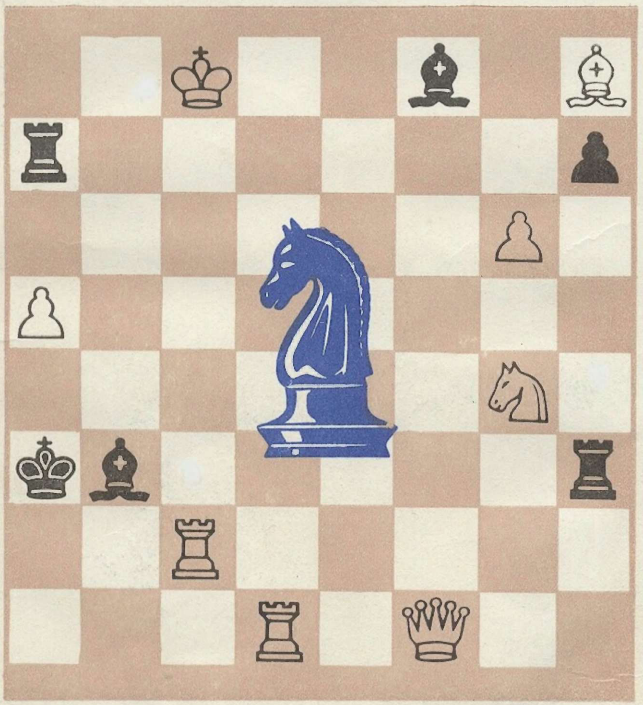

> В. М. АРЧАКОВ

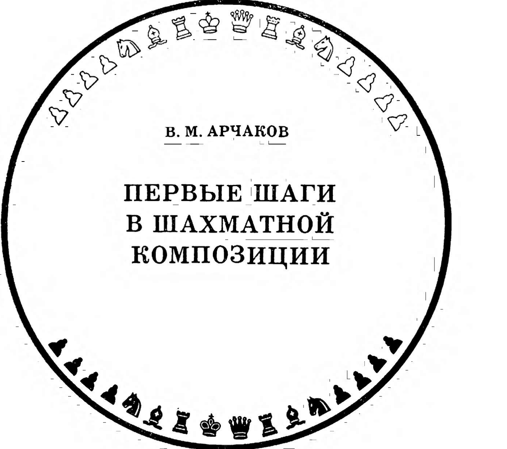

> КИЕВ «РАДЯНСЬКА ШКОЛА» 1987
> 75.581 A88
> АРЧАКОВ В. М. Первые шаги в шахматной композиции.— Киев:Рад.
> шк., 1987. —144 с.— (Когда сделаны уроки).— 25 к. 150 000 экз.
> В книге рассказывается об истории развития, эстетике и этике, тематике шахматной композиции, а также технике составления шахматных задач и этюдов.
> Рассчитана на учащихся среднего и старшего школьного возраста, широкий круг читателей.
> Рукопись рецензировали: судья республиканской категории А. Б. Молдаванский, международный арбитр и мастер спорта СССР В. А. Мельниченко.

## УСЛОВНЫЕ ОБОЗНАЧЕНИЯ

| Условные обозначения | Значение                   |
| -------------------- | -------------------------- |
| ++                   | двойной шах                |
| +                    | шах                        |
| X                    | мат                        |
| =                    | безразличный ход           |
| ==                   | ничейная позиция           |
| :                    | взятие                     |
| !                    | хороший ход                |
| !!                   | прекрасный ход             |
| ?                    | плохой ход или ложный след |
| 0—0                  | короткая рокировка         |
| 0—0—0                | длинная рокировка          |
| ИЛ                   | использованная литература  |

$$
A \frac{4802000000—329}{M 210(04)—87} ** 352—87
$$

© Издательство «Радянська школа», 1987

## ОТ АВТОРА

Меня часто спрашивают, как я начал составлять шахматные композиции? Естественно, прежде всего научился играть в шахматы. Потом был чемпионом школы, аэроклуба, батальона, училища и т. д. Одновременно с практической игрой занимался решением задач и этюдов. Первую задачу составил, прочитав книгу В. Н. Панова «Шахматы для начинающих». Отослал на конкурс газеты «Юный ленинец» и получил ответ, что мое «произведение» имеет несколько побочных решений (о существовании которых я не подозревал), но замысел интересен. «Продолжайте работать», — ободрила редакция.

Красота шахматных комбинаций, глубина задачных идей открылись после внимательного изучения сборника «Шахматная задача». Наряду с этим окончательно утвердился в убеждении, что составительская квалификация будет повышаться тем быстрее, чем лучше решаешь задачи и этюды: их разбор и анализ незамедлительно скажутся на ускорении технического совершенствования начинающего шахматного композитора.

Чтобы научиться составлять шахматные задачи и этюды, необходимо:

1. Быть квалифицированным шахматистом-практиком. Это облегчит начинающему составителю обнаружить дефекты композиции и быстро их устранить.
2. Уметь решать и анализировать шахматные задачи и этюды.
3. Знать обязательные и художественные требования шахматной композиции, эстетические и этические нормы составления шахматного произведения.
4. Изучить задачную и этюдную тематику шахматной композиции.
5. Обладать достаточными техническими навыками составительства, так как общеизвестно, что техническое мастерство позволяет осуществлять самые сложные замыслы, что высокое техническое искусство — это умение найти оптимальную схему для экономичного воплощения идеи.

Переломный момент в жизни шахматного композитора наступает тогда, когда, воспитанный на творчестве других, он уже сам начинает воспитывать своим творчеством любителей шахмат.

Скажу откровенно, предложение написать книгу по составлению шахматных задач и этюдов заставило меня задуматься. Ведь, если вопросы решения шахматных композиций уже в значительной степени освещены в литературе (скажем, в книгах «Как решать шахматные задачи» А. П. Гуляева, «Как решать шахматные этюды» Ю. Л. Авербаха), то по их составлению материала мало.

На тему составления этюда удалось найти лишь статью «Об этюдной композиции» в книге А. О. Гербстмана «Избранные шахматные этюды» и статью гроссмейстера В. А. Королькова «Технология шахматного этюда», опубликованную в официальном журнале Постоянной комиссии по шахматной композиции при ФИДЕ «Проблем» в феврале 1968 года. Уже при подготовке рукописи к изданию приобрел великолепную книгу международного гроссмейстера Г. М. Каспаряна «Тайны этюдиста».

По составлению задач в моем распоряжении была лишь статья международного гроссмейстера Л. И. Лошинского «Турнир-конкурс трехходовых задач» из сборника «Шахматная задача» (1951). И только в процессе работы над этой книгой мне посчастливилось встретиться с трудом еще одного известного гроссмейстера В. Ф. Руденко — «Преследование темы» (1983), в котором интересующий меня материал помещен в первой части «Шахматная композиция».

Вышеперечисленные и другие труды помогли мне в написании этой книги, а комментарии из них, представляющие большой интерес для начинающего шахматного композитора, почти полностью или частично сохранены нами в оригинале с соответствующими ссылками на авторство.

Книга, вобравшая в себя сведения из истории развития шахматной композиции, формальные и художественные требования к ней, тематику и технику ее составления, является по существу первым пособием для тех, кто хочет научиться составлять шахматные задачи и этюды.

В книге приводятся основные и наиболее актуальные темы. Для их характеристики даются лишь типичные примеры, понятные делающему первые шаги в шахматной композиции. Автор стремился к популярному изложению материала, доступному всем любителям шахмат.

Книга не претендует на полноту информации. Даже непрерывно ныряя в глубину оксана, невозможно извлечь все жемчужины. Допускаем, что у некоторых читателей может возникнуть мнение, что те или иные задачи, этюды следовало бы дать в другом тематическом разделе. Но многие композиции столь многоидейны по содержанию, что с одинаковым основанием могут быть рассмотрены в разных творческих аспектах.
Если моя книга в какой-то мере поможет начинающему шахматному композитору проложить тропинку в поэзию шахмат, я буду считать, что свою задачу выполнил.

## КОМПОЗИЦИЯ — ПОЭЗИЯ ШАХМАТ

Шахматная композиция, то есть составление шахматных задач и этюдов, базируется на средствах и правилах практической игры и представляет собой своеобразную область творчества. Она раскрывает красоту шахматных комбинаций, постоянно развивающуюся и привлекающую все новых любителей мудрой игры.

Композицию образно называют поэзией шахмат. Ибо она отражает практику шахматной игры так, как искусство реальную жизнь. Настоящий шахматный композитор заставляет фигуры делать максимум возможного на шахматной доске, выявлять еще не раскрытую их силу, всесторонне использует законы и правила этой древней игры. Именно эти творческие черты в полной мере присущи советским шахматным композиторам. Осваивая и развивая лучшие традиции всех школ и направлений, они в то же время стремятся эффективно сочетать новаторство с эстетическими принципами и простыми методами выражения идей.

Зарождение шахматной композиции относят к рубежу VIII—IX веков, когда впервые были сделаны попытки составления мансуб («мансуба» — дословно с арабского означает «то, что было воздвигнуто, учреждено, устроено», то есть в нашем понятии — составлено). Характерной особенностью мансуб была, прежде всего, близость к практической партии. С современной точки зрения они представляются наивными по содержанию, легкими для решения и примитивными конструктивно, с форсированной игрой, рассчитанными исключительно на внешний эффект.

**№ 1. Мат Дилярам, Стамбульский манускрипт, 1140, Мат в 5 ходов**  
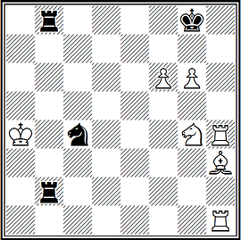

Пожалуй одной из первых мансуб и, без сомнения, наиболее знаменитой явилась арабская задача (диаграмма № 1), носящая поэтическое название «мат Дилярам». Вот какая легенда объясняет ее название.

Некий вельможа, страстный шахматист, необычайно уверенный в своих шахматных талантах, проиграл все свое состояние, и, одержимый азартом, побился об заклад, что он все же победит противника, и в качестве последней ставки предложил в заклад любимую жену — красавицу Дилярам.

Но счастье отвернулось, казалось, окончательно от него, и партия пришла к позиции, где король белых должен получить мат. В отчаянии искал вельможа возможности спасения и уже готов был сдаться. Но в самый последний момент Дилярам удалось случайно взглянуть на доску, и она шепнула своему незадачливому мужу: «Пожертвуй оба руха (то есть ладьи) и спаси меня!».

Терять было нечего, и белые послушно сыграли **1. Лh8+! Kp:h8 2. Сf5+** (по правилам того времени слоны-алфилы могли ходить лишь через одно поле по диагонали, но зато и перескакивать через фигуры) **2... Kpg8**.

Позиция как будто возвратилась к исходной, но **3. Лh8+ Кр:h8 4. g7+ Kpg8 5. Kh6X**. Спасено все...

Конечно никто не может подтвердить достоверности этого предания. Иначе история шахмат с полным основанием признала бы красавицу Дилярам пионером шахматной композиции среди женщин. Но в другом эта история вполне достоверна: она позволяет предположить, что мансубы были не окончаниями игранных партий, а специально составленными позициями.

**№ 2. Абу-Наим, IX век, Мат в 3 хода**  
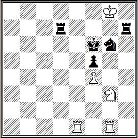

Мансуба (№ 2) составлена почти тысячу двести лет назад и найдена в старинных арабских рукописях Аль-Адли (IX век): **1. Kh5+! Л: h5 2. Л: g6+ Кр: g6 3. Ле6Х**.

Шахматная композиция делится на ортодоксальную, неортодоксальную, сказочную и особые виды композиции. Ортодоксальная композиция полностью основана на цели (мат королю), материале (доски и фигуры) и средствах шахмат (правила игры).

Забегая вперед, скажем, что школа советской шахматной композиции развивается как неотъемлемая часть общешахматного движения и основным ее направлением является ортодоксальная композиция. Поэтому, в дальнейшем будем рассматривать преимущественно ортодоксальную область шахматной композиции.

По заданию различают два вида композиции — задачи и этюды.

Шахматная задача — это искусственная позиция на доске, в которой одна сторона (как правило — белые) дает другой стороне (черным) мат в определенное число ходов. Поэтому в задачах важно не число фигур и не сила сторон. У черных может быть только король, а у белых — вся их армия, однако не это предопределяет успех белых. Главное, найти замаскированный способ заматовать неприятельского короля в заданное число ходов.

Шахматный этюд также искусственная позиция, но в отличие от задачи более близко стоящая к окончанию практической партии. В этюде начинают белые (если в условии не оговорено, что первый ход делают черные), но заданием является не мат в строго определенное количество ходов, а выигрыш (решающий перевес) или достижение ничьей. Количество ходов (в отличие от задач) не обусловливается конкретным числом. Повышенные требования предъявляются к начальному положению этюда. Оно должно максимально напоминать позицию из реально игранной партии.

Решить этюд гораздо труднее, чем задачу. Хороший этюд обычно сугубо индивидуален, и для отыскания его решения требуется как определенное знание теории, так и творческая интуиция. Решение этюда, по сравнению с анализом позиции из партии, облегчается тем, что в практической партии шансы обеих сторон далеко не всегда ясны, а в этюде белые имеют математически точный, неизбежный при всех попытках путь (хотя и единственный) к выигрышу или ничьей.

**№ 3. «Цивис Болонис», XIII век, Мат в 2 хода**  
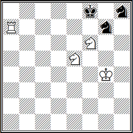

Специфика этюда стает глубже понятной из истории его развития, прослеживаемой со Средневековья. Его шахматное наследие дошло до нас благодаря двум итальянским манускриптам — «Бонус Социус» и «Цивис Болоние». Почти все композиции сборников имели решение, заканчивающееся матом, то есть по нашему делению должны быть отнесены к задачам. На диаграмме № 3 — одна из них: **1. Лf7+ Кр:f7 2. Kg6X**.

**№ 4. «Цивис Болонис», XIV век, Выигрыш**  
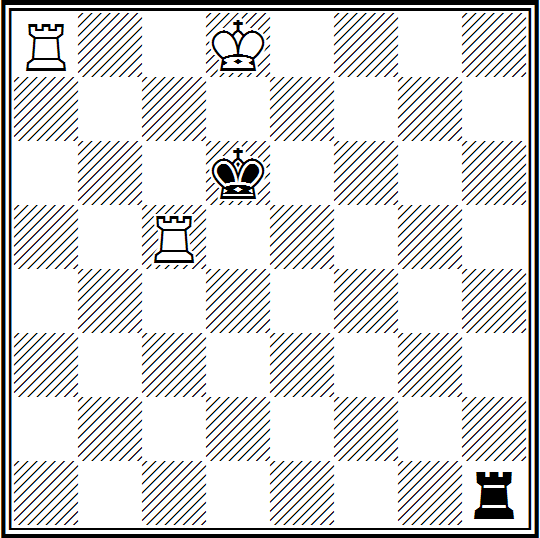

Поэтому не удивительно, что, перелистав страницы этих двух энциклопедий, можно найти только один этюд (№ 4), правда, ставший классическим: **1. Лh5!! Л:h5 2. Ла6+ Кр: c5 3. Ла5+** и **4. Л:h5** с выигрышем.

После появления «Бонус Социус» и «Цивис Болоние» минует еще два века, но в композиции почти не происходит перемен. Европейские задачи фактически представляли собой те же мансубы, только под другим названием. Поэтому можно считать, что мансубы просуществовали почти до середины XIX века, когда произошло их четкое и формальное подразделение на задачи и этюды. Правда, еще в трактате Х. Р. Лусены (XV век) встречаются вполне этюдные даже с современной точки зрения позиции как по построению, так и по решению.

**№ 5. Х. Р. Луссена, XV век, Выигрыш**  
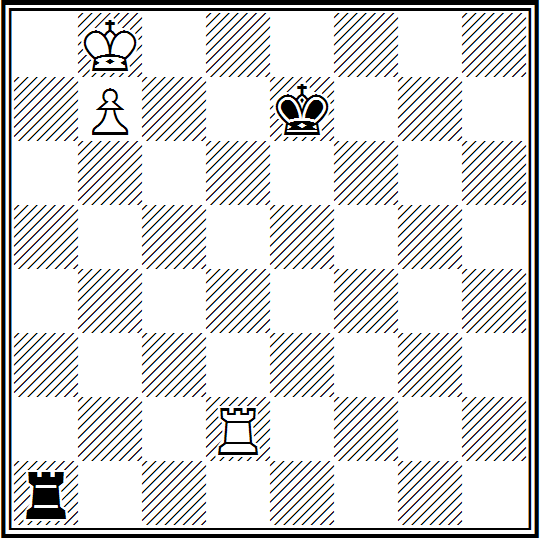

№ 5. Белые добиваются победы благодаря точному выбору вступительного хода: **1. Лd4!** (Только так!) **1... Ла2 2. Крс7 Лс2+ 3. Крb6 Лb2+ 4. Крс6 Лс2+ 5. Крb5 Лh2 6. Лh4**, и выигрывают.

**№ 6. Дамиано, XVI век, Выигрыш**  
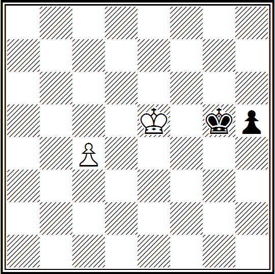

Начало XVI века ознаменовалось появлением второго печатного труда, излагавшего новые правила игры. Трактат назывался «Эта книга учит играть в шахматы и содержит задачи». Автором его был португальский аптекарь Дамиано. Вот одно из произведений (№ 6), взятое из трактата: **1. с5 h4 2. с6 h3 3. с7 h2 4. с8Ф h1Ф 5. Фg8+ Крh6 6. Фh8+** с выигрышем.

Начало следующего, XVII столетия, связано с именем Дж. Полерио, который считается основоположником итальянской шахматной школы, и его последователями — П. Каррера и А. Сальвио.

**№ 7. А. Сальвио, 1634, Мат в 4 хода**  
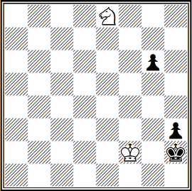

На диаграмме № 7 — задача с необычным условием: белые начинают и дают мат в 4 хода; начинают черные и они же получают мат, но уже в 8 ходов; А — **1. Кf6 Крh1 2. Кg4 h2! 3. Крf1 g5 4. Кf2X** и Б — **1... Крh1 2. Кf6 Крh2 3. Кg4+Крh1 4. Крf1 g5 5. Крf2 h2 6. Кe3 g4 7. Кf1 g3+ 8. К:g3X**.

Задачи с эндшпильным соотношением сил встречались еще до Сальвио, но именно он рельефно подчеркнул близость их к концовкам практических партий.

В первой половине XVIII века большую известность приобрел Ф. Стамма. Несмотря на противоречивые оценки его творчества, значение Стаммы в развитии композиции огромно: восточная мансуба воскресла, обрела второе дыхание.

**№ 8. Ф. Стамма, 1737, Выигрыш**  
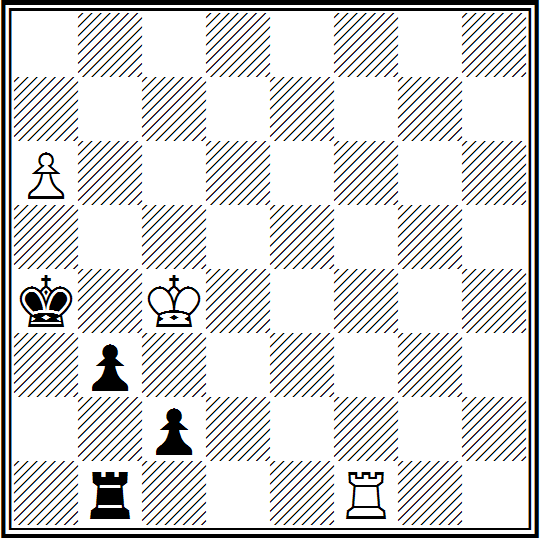

№ 8. Осуществлена комбинационная жертва: **1. Лс1! Л: с1 2. а7 Крa3 3. Крс3! Крa2 4. а8Ф+ Крb1 5. Фа3** с неизбежным **6. Фb2X**.

Основатель французской комической оперы Франсуа-Андре Даникан-Филидор еще более прославился как шахматист. В 1749 году он выпускает книгу «Анализ шахматной игры». Ни одна шахматная книга не обладала еще такой счастливой судьбой: за последние 200 лет она издавалась более ста раз.

**№ 9. Ф. Филидор, 1749, Выигрыш**  
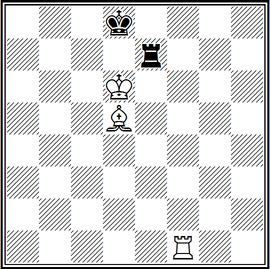

В позиции (№ 9), считавшейся ничейной, Филидором найден вариант, ведущий белых к победе: **1. Лf8+ Ле8 2. Лf7 Ле2 3. Лh7 Ле3 4. Лd7+ Кре8 5. Ла7 Крf8 6. Лf7+ Кре8 7. Лf4! Крd8 8. Се4! Кре8 9. Сg6 Крd8 10. Лf8+** и выигрывают.

**№ 10. Д. Лолли, 1763, Выигрыш**  
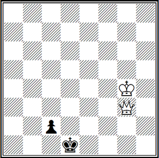

На диаграмме № 10 изображен этюд-квартет (то есть четырехфигурный), помещенный в третьей части книги Д. Лолли «Наблюдения по теории и практике шахматной игры». Решение его несложно, но запоминающееся: **1. Фb3 Крd2 2. Фb2 Крd1 3. Крf3! Крd2 4. Крf2 Крd1 5. Фd4+** и белые выигрывают.

Следующая четырехходовка — белые: **Kpd8, Фа7, Лf5, Лh7, Cb1, пп. а3, b2, е5** (8); черные: **Kpg8, Фb5, Лg4, Лg5, Са4, пп. с5, d5, f6, g7**(9) — неизвестного автора помещена в одном из турецких манускриптов: **1. Фf7+! Кр:f7 2. Л:f6+ Kpg8 3. Лh8+ Кр:h8 4. Лf8X**.

Период до середины XIX века был синтетическим для шахматной задачи и этюда, но позже у них определятся автономные пути развития. Здесь необходимо отметить немецкого шахматиста и композитора Ю. Мендгейма, автора нескольких книг. Наиболее значительная из них «Задачи для шахматистов», содержащая восемьдесят два произведения.

**№ 11. Ю. Мендгейм, 1832, Ничья**  
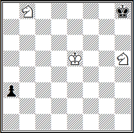

№ 11. Находка, привлекшая внимание и современников: **1. Kd7 a2 2. Kd:f6 a1Ф+ 3. Крe6** — и ничья.

Ю. Мендгейм, первым осознавший красоту правильных матов, усиленно разрабатывал и актуальную до сих пор игру батареи, то есть такого положения двух фигур одного цвета на одной линии, когда уход с нее впередистоящей фигуры (по имени которой и называется батарея) включает действие дальнобойной фигуры: белые **Kpg1, Фе3, Ла3, Се5, Cg2, Kd4, пп. а5, f2**(8); черные — **Крa7, Фg6, Лf8, Лg8, Cb8, Cc8, Kb4, пп. а6, b7, d5, e6** (11). Мат в девять ходов — **1. Кb5++ Крa8 2. Фа7+! С:а7 3. Кс7+ Крb8 4. К:а6++ Крa8 5. Кс7+ Крb8 6. К:d5+ Крa8 7. Кb6+ С:b6 8. ab+ Кa6 9. Л:а6X**.

К 1836 г. относится и основание первого в мире шахматного журнала «Паламед», издателем которого был Луи-Шарль Лабурдоне — один из сильнейших шахматистов того времени.

**№ 12. Л. Ш. Лабурдоне «Паламед», 1837, Мат в 6 ходов**  
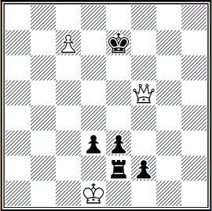

№ 12. Положение белых таково, что требуются экстренные меры: **1. с8К+! Крe8 2. Фg6+ Крf8 3. Фf6+Kpg8 4. Кe7+-** с матом в два хода.

Любопытна и символическая задача патриотического содержания первого русского шахматного мастера Александра Дмитриевича Петрова (1794—1867) под названием «Бегство Наполеона из Москвы в Париж», опубликованная в журнале «Паламед» в 1838 году (впервые эта задача в несколько ином виде была напечатана в книге А.Д.Петрова «Шахматная игра, приведенная в систематический порядок», увидевшей свет еще в 1824 году) — белые: **Kph2, Фh1, Cg6, Ke2, Kf1, пп.c2, c5, d4(8)**; черные **Kpb1, Лf4, Лf6, Ce3, Ka5, Kd8, пп.a4, b2, c4, c7, e6, f2, g4, g7(14)** — мат в четырнадцать ходов.

Это была, вероятно, первая в мире оригинальная задача, относящаяся к числу символических скакографических произведений шахматной композиции. (Слово «скакография» образовано от двух греческих: scacho — шахматы и grapho — пишу.) «Скакография,— писал русский мастер И. С. Шумов,— есть искусство изображения на шахматной доске различных предметов или отвлеченных представлений. Словно своеобразные шахматные «эхо» откликались символические задачи на различные события в политической и военной жизни России XIX века.

В приводимой задаче изображено бегство Наполеона из Москвы в Париж. Поле a1 изображает Москву, h8 — Париж, белые кони — русскую кавалерию, черный король — Наполеона. Шахматная судьба черного короля b1 очень напоминает бесславный конец французского императора, растерявшего свою разноплеменную армию в безбрежных просторах России.

Преследование короля белыми копями напоминает беспрерывную погоню за императором русской кавалерии Платова. И будто для усугубления иронии одинокий черный король на своем долгом пути нередко встречает остатки своего войска (кони a5 и d8, пешки a4, c4, c7), которым уже не до спасения владыки. Задача не решается, а демонстрируется.

**1. Kd2++ Кра2 2. Кс3+ Кра3 3. Kdb1+ Kpb4 4. Ka2+ Kpb5 5. Kbc3+ Кра6.**

В этот момент к мату приводит ход — *6. Фа8Х*. Однако делать этот ход нельзя. Оказывается, матовать сейчас, на шестом ходу... рано, так как, по условию, задача должна решаться в четырнадцать ходов.

Стремясь быть возможно ближе к исторической истине, Петров этим «запрещением» сумел блестяще осуществить в задаче еще одну идею: он тонко намекнул на неиспользованную возможность захватить Наполеона в плен при переправе через реку Березину (как известно, это произошло по вине бездарных командиров Чичагова и Витгенштейна, которых Наполеон ввел в заблуждение ложным маневром).

Диагональ a8—h1 изображает реку Березину. Когда черный король, в результате атаки белых коней, оказался на поле a6, можно было дать ему сразу мат ходом *6. Фа8Х*, но вместо этого кони оттеснили короля дальше на поле h8. А. Д. Петров в примечании к шестому ходу белых пишет: «Ферзем следовало преградить путь Наполеону, тогда бы он не ушел в Париж, и был бы ему шах и мат».

Итак, вместо *6. Фа8Х* надо играть **6. Kb4+.**

Далее продолжается «погоня»: **6...Кра7 7. Kb5+ Kpb8 8. Ка6+ Крс8** (французские войска отброшены за Березину) **9. Ка7+ Kpd7 10. Kb8+ Kpe7 11. Kc8+ Kpf8 12. Kd7+ Kpg8 13. Ke7+Kph8**, и русская армия победоносно заканчивает войну — **14. Kpg2X**.

Остроумное произведение А. Д. Петрова явилось одним из лучших образцов символической шахматной задачи на военный сюжет. Оно быстро получило всемирную известность. Многие поколения лучших русских и иностранных мастеров шахматной композиции на этой задаче учились изображать военные маневры на шахматной доске. Правда, кое-кому такая задача может показаться легкой забавой. Но вспомним, что она в свое время облетела шахматные журналы всего мира и остается популярной и поныне.

Таким образом, А. Д. Петров был не только первым русским шахматным маэстро, но и первым шахматным композитором.

**№ 13. А. Д. Петров, 1846, Мат в 6 ходов**  
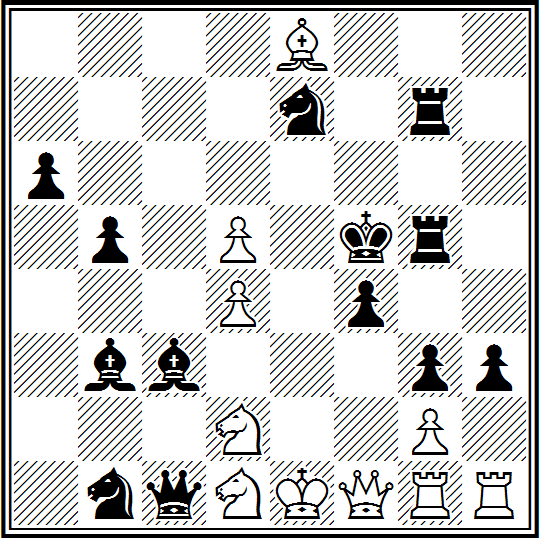

№ 13. **1. Ф:f4+! Kp:f4 2. Лf1+ Kpg4 3. Лf4+!** (Две эффектные жертвы в стиле Стаммы.) **3...Кр:f4 4. O-O+!** (Короткая рокировка!) **4...Kpg4 5. Ke3+ Kph4 6. Kf3X**.

Кроме А. Д. Петрова, в России в XIX веке пользовались большой известностью как авторы интересных композиций К. А. Яниш, И. С. Шумов и особенно А. В. Галицкий.

Крупнейший русский мастер и композитор прошлого века К. А. Яниш одну из своих задач назвал «Железная клетка Тамерлана» — белые: **Kpd1, Фd6, Лd5, Лg6, Ch3, Ke8, Kf7, пп. а7, е2, f2 (10)**; черные: **Kpe4, Фа2, Са3, Cd3**, пп. **с4, с5, d7, с3, е6, f4, g4, g7 (12)** — спертый мат в десять ходов. Вот каким образом черный король попадает в заточение: **1. f3+ gf 2. ed+ cd 3. Cf5+ ef 4. Ле6+ de 5. Лd4+ cd 6. a8C+Фd5 7. C:d5+ ed 8. Kf6+ gf 9. Фе5+ fe 10. Kg5X** — король в клетке!

Так при помощи старинной комбинации на спертый мат К. А. Яниш символически запечатлел жестокое обращение среднеазиатского завоевателя Тамерлана (Тимура) со своими пленниками.

**№ 14. К. Яниш, 1837, Мат в 15 ходов**  
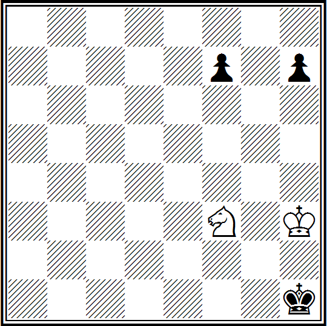

№ 14. **1. Kpg3 f5 2. Kpf2 f4 3. Kpf1 h5 4. Kpf2 h4 5. Kpf1 h3 6. Ke5!** (Как раз вовремя! Иначе черные запутаются.) **6...Kph2 7. Kpf2 Kph1 8. Kg4 f3 9. Kpf1 f2 10. K:f2+ Kph2 11. Ke4 Kph1 12. Kpf2 Kph2 13. Kd2 Kph1 14. Kf1 h2 15. Kg3X**.

Русский мастер И. С. Шумов особую известность получил своими скахографическими композициями. Причем, если символические произведения А. Д. Петрова и К. А. Яниша носили эпизодический характер в их многогранном творчестве, И. С. Шумов много лет упорно и настойчиво работал над созданием символических задач совершенно сознательно. Об этом свидетельствует его книга, вышедшая в свет в начале 1867 года под интригующим названием «Собрание скахографических и других шахматных задач, в том числе полный шахматный букварь, — маты политические, юмористические и фантастические...»

Например, следующая задача — белые: **Kph3, Лf1, Cc4, Kd3, пп. d5, e4, f3, g2 (8)** и черные: **Kpa2, Cg1, Kb3, пп. a3, b4, c5, d6, e5, f2, f4, g3 (11)** — мат в восемь ходов. Она опубликована в 1878 году в журнале «Всемирная иллюстрация» и в ней автор стремится отобразить один из важнейших этапов русско-турецкой войны — героический переход русских воинов через Балканский хребет.

Картинно расположенные фигуры и пешки изображают непрерывную полосу препятствий труднопроходимого хребта. Чего стоит цепочка черных пешек. Автор задачи сочинил к этой композиции такие стихи:

```text
Герои перешли Балканы!
Ужасный путь их не был скор:
Мороз, и турки, и бураны —
Все вражьи силы грозных гор,
Соединясь в преграды злые,
Стремились тщетно восемь дней
Расстроить силы удалые,
Остановить богатырей.
Побеждена сама природа!
А дальше — все возьмет булат!
Но здесь мы до восьмого хода
Дойдем легко — и черным мат.
```

Решение развивается так. С первого до седьмого хода белый король движется по «горной цепи»: **1. Kpg4—f5—e6—d7—c6—b5—a4**. А черные? За это время они лишь беспомощно передвигают своего слона с поля g1 на h2 и с h2 на g1. И, наконец, на восьмом ходу следует решающий удар — **8. C:b3X**.

Русская армия, «роль» которой на шахматной доске «исполнил» белый король, объявила «мат» турецкому паше.

**№ 15. И. Шумов, 1878, Мат в 4 хода только конем**  
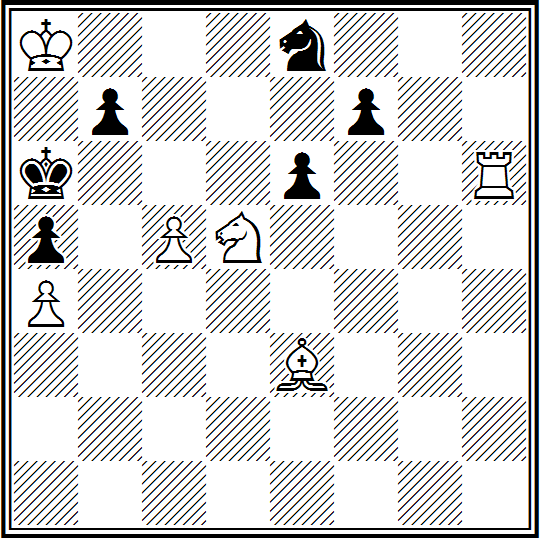

Вот еще одна, но уже ортодоксальная композиция И. С. Шумова (№ 15): **1. Лf6 b5 2. cb ed 3. b7+ и 4. b8KX**. Соль задачи в том, что мат на четвертом ходу дается не тем конем, который на доске, а вновь появившимся.

Выдающийся проблемист А. В. Галицкий стоял у истоков зарождения современной шахматной задачи в России. Для него характерно стремление к художественной форме, при соблюдении всех конструктивных требований, с красивым неочевидным решением, создавать в задачах яркие, интересные комбинации.

**№ 16. А. Галицкий, «Шахматный листок», 1892, 1-й приз, Мат в 2 хода**  
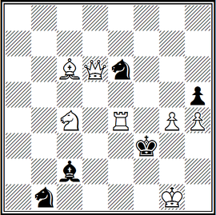

Например (№ 16), с трудным эффектным главным вариантом: **1. Са4!** (цугцванг) — **1... С:е4 2. Cd1X**, содержащим засаду белого слона.

**№ 17. А. Галицкий, «Стратежи», 1911, Мат в 3 хода**  
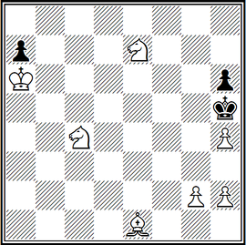

Задача (№ 17), характерна парадоксальной жертвой коня. Прямолинейное *1. Ке3(5)?* или *1. h3?* приводит к пату. Маневром **1. Кb6** белые подготавливают на ход **1... Kpg4** ответ **2. Kbd5 Kph5 3. Kf6X** или **2...h5 3. h3X**, а после **1... ab** используют распатование **2. h3 b5 3. g4X**.

Меняясь по содержанию и форме, в разные периоды развития шахматная композиция в одном оставалась неизменной: она поэтически, художественно обобщала принципы и законы развития шахматной игры. Вот почему каждой исторической эпохе развития композиции, ее идейного содержания и технического воплощения присущи свой стиль, почерк, творческий уровень.

Все виды шахматного искусства — практическая игра и композиция — формируются одними и теми же принципами, едиными правилами и законами, проверенными временем. Но несмотря на общность и связь практической игры с композицией, каждая определяет собственные средства творчества, говорит на своем художественном языке.

Для примера сопоставим партию, сыгранную в кулуарах международного турнира в Лондоне в 1851 году, и задачу (№ 18).

**А. Андерсен — Л. Кизерицкий**
**Королевский гамбит**

Этой партии посвящены сотни страниц в шахматных журналах и книгах. Она характерна для манеры игры Андерсена. Кизерицкий ставил все время мелкие ловушки, Андерсен же стремился любой ценой получить перевес в развитии фигур и тем самым создать предпосылки для комбинации.

**1. e4 e5 2. f4 ef 3. Сc4 Фh4+ 4. Крf1 b5.**

Польский мастер Лионель Кизерицкий был выдающимся шахматистом своего времени, прославившимся необычными тактическими идеями. Это — одна из них: возвращая гамбитную пешку, черные допускают атаку белого слона на поле f7, но открывают своим фигурам линии ферзевого фланга.

**5. С:b5 Кf6 6. Кf3 Фh6 7. d3 Кh5.**

Черные уже угрожают перехватить инициативу. Нельзя *8. Крg1* (избегая *8...Кg3+*) из-за *8...Фb6+*.

**8. Кh4 Фg5?**

Этот маневр, обусловленный соответствующими тактическими соображениями, белые опровергают неожиданной жертвой фигуры. Правильно было *8...g6!*, не допуская коня на поле f5 и угрожая *9...Сe7*, а в случае *9. g4 Кf6! 10. Kg2 Фh3 11. С:f4 К:g4* черные получают контригру (указано мастером Я. Нейштадтом).

**9. Кf5 c6.**

Вот в чем заключается замысел черных: если слон отступит (а как играть иначе?), то последует *10...d5!* с активной контригрой.

**10. g4! Кf6 11. Лg1!**

Сильнодействующий способ — жертвуя фигуру, белые препятствуют намерениям соперника и навязывают ему отступление по всему фронту.

**11... cb 12. h4 Фg6 13. h5 Фg5 14. Фf3 Кg8 15.С:f4 Фf6 16. Кc3.**

Вот в чем состоит идея Андерсена: за фигуру он получил огромное преимущество в развитии фигур, которое само собой открывает разнообразные возможности атаки. У черных же нет достаточной защиты.

**16. ... Сc5.**

Позже этот ход критики осудят, ибо белые могли просто и убедительно ликвидировать давление путем *17. d4!* Так что ж посоветовать черным? Ведь и другие продолжения ничуть не лучше. Это хоть ставит перед соперником кое-какие проблемы. Вот минусы замедленного развития черных! То, что они пришли к такому положению, очень плохо рекомендует их игру. Андерсен же, верный своему принципу — всегда нападать, не считается с дальнейшими материальными потерями.

**17. Кd5?!**

Начало красивого замысла, который предусматривает жертву обоих ладей. Но ход *17. d4* проще, лучше и давал черным контр-шансы.

**17. ... Ф:b2 18. Cd6!**

Красивый ход. Белые предлагают жертву обеих ладей ради того, чтобы загнать черного короля в матовую сеть. Нельзя *18...C:d6* из-за мата в четыре хода. (Дальнейшие два хода во многих руководствах ошибочно приводятся в обратном порядке.)

**18. ... C:g1?**

Черные также до конца верны своему принципу — брать что возможно, так как жертва ведь может оказаться и ошибочной. Однако, потеря времени, связанная с этим ходом, губительна для черных. Контршансы черные могли заполучить путем *18...Ф:a1+ 19. Кре2 Фb2!* Теперь же атака белых неотразима.

**19. e5!!**

Отрезая черного ферзя от защиты пункта g7.

**19. ... Ф:a1+ 20. Кре2 Ка6?**

Черные защищают пункт с7, препятствуя явной угрозе мата (*21. К:g7+ и 22. Сс7X*), но не замечают, что белые одновременно создали и вторую — замаскированную. Отразить обе угрозы можно было посредством лучшей защиты *20...Са6*. Однако и в этом случае, как доказал основоположник русской шахматной школы Михаил Иванович Чигорин, она бесполезна, ибо белые также добивались перевеса после *21. Кс7+Крd8 22. К:а6 Сb6 23. Ф:а8* и т. д. с неотразимыми угрозами.

**21. К:g7+ Крd8 22. Фf6+ К:f6**

Жертва ферзя отвлекает коня от защиты пункта е7.

**23. Се7X**.

Заключительная комбинация глубока и эффектна. Через семьдесят лет выдающийся чехословацкий гроссмейстер Рихард Рети напишет: «Бессмертная партия, несмотря на ее многочисленные ошибки. Так как ее ошибки были ошибками, свойственными тому времени, а ее бессмертная красота заключается в бессмертных идеях Андерсена».

**№ 18. К. Байер, «Эра», 1856, 1-й приз, Мат в 9 ходов**  
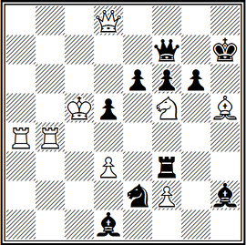

№ 18. **1. Лb7! Ф:b7 2. C:g6+ Кр:g6 3. Фg8+ Кр:f5 4.Фg4+ Кре5 5. Фh5+ Лf5 6. f4+ C:f4 7. Ф:e2+ C:e2 8. Ле4+ de**.

Итак, последовательно пожертвованы все фигуры белых, и в финале белого короля поддерживает единственная уцелевшая пешка, которая и наносит решающий удар — **9. d4X**. Как видим, оба вида шахматного творчества соответствуют одной эпохе — расцвету комбинационного периода. В практической партии использовано все богатство идей, планов и элементов тактики. В задаче конечная цель игры также мат, а критериями оценки художественных качеств ее являются — экономичность, единственность решения, полное и исчерпывающее представление комбинации.

«Внутреннее содержание задачи,— писал немецкий проблемист Ф. Клетт в своем сборнике «Шахматная задача» еще в 1878 году,— состоит в комбинации, то есть цепи идей и заключений, которые с неизбежной последовательностью, развиваясь друг из друга по нормам шахматных законов, приводят к конечному результату — мату. Ценность комбинации обусловливается, с одной стороны, ее трудностью, с другой — красотой».

Все так. Но в чем же различие между произведением практической игры и композицией?

В практической партии борются два противника, в то время как процесс творчества в композиции состоит в создании позиций с определенным заданием для одной из сторон, в которых в художественной форме реализована та или иная идея. В ней как бы максимально концентрируются идеи практической игры, которые в чистом виде, наверное, никогда б не встретились в партии за шахматной доской. Об этом ярко сказано чемпионом мира по шахматам А. А. Алехиным в предисловии к сборнику задач и этюдов Ф. Лазара (1928 г.):

«... Мне глубоко симпатична самая идея композиции. Я был бы счастлив творить совсем один, без необходимости, как это случается в партии, сообразовывать свой план с планом противника, чтобы достичь чего-нибудь представляющего ценность.

Ах, этот противник, этот навязанный вам сотрудник. Всякий раз его представления о красоте расходятся с вашими, а средства (сила, воображение, техника) так часто оказываются недостаточными для активного содействия вашим намерениям. Сколько разочарований приносит он истинному художнику в шахматном деле, стремящемуся не к одной лишь победе, но прежде всего к созданию произведения, имеющего непреходящую ценность.

Какое страдание (неведомое ни в какой другой области искусства или науки) чувствовать, что ваша мысль, ваша фантазия неотвратимо скованы, в силу природы вещей, мыслью и фантазией другого, слишком часто посредственными и всегда глубоко различными от ваших...

Дыхание истинного искусства, освобожденного от всего того, что связано с нашей субъективной личностью, с радостной полнотой выражается в творчестве композитора: в его (единолично им созданной) задаче, в его этюде».

И все же основанием существования композиции служит реальная шахматная игра.

«Для шахматной задачи как произведения искусства,— писал основоположник шахматной задачи в России А. В. Галицкий,— природу, реальную жизнь основывает шахматная партия. Как природа — мир красок и звуков — дает элементы, материал для произведения живописи, музыки, так и из шахматной игры мы берем элементы для задачи, материал для ее построения».

Неразрывная связь композиции и партии заключается не только в общности игровой дисциплины, во взаимном проникновении и обогащении идеями и комбинациями, но и, как во всяком подлинном искусстве, — в эмоциональном и эстетическом воздействии на чувства и мысли человека. И эта специфическая особенность шахматного искусства присуща обоим его видам: практике и составительству, свобода воспитательная сила шахматного искусства — в культурном, содержательном творческом общении.

Все многообразие общешахматного движения, в процессе которого участвует человек и которое воздействует на человека, выражается творческим подходом к шахматному искусству: человек познается во всей широте его интересов и связей с шахматным миром.

Так, например, результат сыгранной партии выражает чувства и отношение человека к шахматам.

Что же касается шахматной композиции, то в силу специфических особенностей, ей присущи свои законы логического и исторического порядка. В процессе развития она выработала целый арсенал свойственных ей художественных принципов, идей, тем и т. д.

Как уже отмечалось, окончательно шахматная композиция, как самостоятельная область творчества, сформировалась в середине прошлого века. Этот период считается начальным этапом формирования ряда школ, направлений и стилей. Чуть позже произошло конкретно четкое формирование трех самостоятельных направлений задачной композиции: *чешской*, *немецкой* и *английской* школ.

Для произведений чешской школы характерным является наличие в них не менее трех вариантов, завершаемых правильными матами, то есть в качестве первостепенного элемента задачи принималось сочетание красивых матовых позиций, которые одновременно являются чистыми и экономичными. *Чистый мат* — мат в задаче или этюде, когда все поля недоступны королю по единственной причине: они заняты своими же фигурами или по одному разу атакованы фигурами соперника. *Экономичный мат* — мат в задаче или этюде, в котором принимают участие все фигуры, за исключением белых короля и пешек ввиду их малой подвижности.

Для задач немецкой (или старонемецкой) школы главным элементом признавалась эффектная, четко выполненная в одном основном варианте комбинация, сопровождаемая жертвами белых фигур и завершаемая, как правило, правильным матом.

В отличие от немецкой английская школа основным жанром признавала именно двухходовую задачу. Принципиальными требованиями этой школы являются разнообразие и широта игры при максимально возможной конструктивной четкости. А их-то проще и нагляднее всего выполнить в двухходовой форме.

Но с того времени произошел критический пересмотр взглядов на содержание задач старонемецкой и английской школ. Этот пересмотр оказался чрезвычайно плодотворным и способствовал появлению новых, ныне самых распространенных направлений задачной композиции, получивших название логической и стратегической школ.

Если же обратиться к непосредственному процессу создания композиции, то мы заметим, что он заключается в избрании идеи или темы и поиске средств ее конструктивного воплощения. Прежде всего рассмотрим три задачи: двух-, трех- и многоходовку.

**№ 19. К. Мэнсфилд, «Ахедрес Архентино», 1927, Мат в 2 хода**  
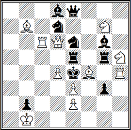

Диаграмма № 19. Задачу составил английский международный гроссмейстер композиции Коминс Мэнсфилд (1896–1984). Прекрасный первый ход **1. Фе7!** — ферзь будто отдаляется от театра действий — с угрозой **2. Л: е6Х**. Возникает ряд тонких вариантов: **1... К: g7 2. Лf6Х, 1... К: f4 2. Лс3Х, 1... К: d4 2. Лс4Х, 1... Кес5 2. Л: с5Х, 1... Кdс5 2. Кf6Х, 1... Кс7 2. Л: с7Х, 2...Кpd5+ 2. Лс2Х** и **1... Лd5 2. С: g5Х**.

Обратите внимание на роль белого ферзя — его позиция как бы цементирует всю игру. В задаче реализована идея полусвязки: после хода одной из черных фигур, которые находятся между черным королем и белым ферзем, другая оказывается связанной.

**№ 20. Л. Лошинский, I чемпионат СССР, 1947, 1-е место, Мат в 3 хода**  
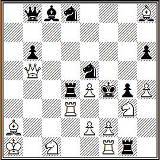

№ 20. После скрытого вступления **1. Фb!!** (в засаду) грозит **2. Kh5+ Kp: e4 3. Ле3Х**. Черные защищаются, освобождая поле d4: **1... Лd5 2. Лd4!!** и **3. Kh5X** или **3. edX**; **1... Лd6 2. Лd5!!** — снова по пятам черной ладьи — **3. Kh5X** или **3. C: e5X**, **1... Лd7 2. Лd6!!** — белая ладья будто магнитом притягивается.

Однако содержание ее не исчерпывается приведенными вариантами, на движения черной ладьи по горизонтали **1... Лс4, 1... Лb4** и **1... Ла4** снова белая ладья становится рядом — **2. Лс3, 2. Лb3** и **2. Ла3** с последующим **3. Kh5X**.

**№ 21. Л. Лошинский, «Шахматная Москва», 1964, 1-й приз, Мат в 6 ходов**  
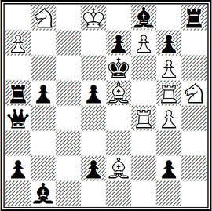

№ 21. Проанализировав решение этой шестиходовки, хочется сказать: «Сказка стала реальностью!» На шахматной доске четыре черных ферзя — неимоверно грозная сила, однако и она не может предотвратить мат черному королю: **1. Kd7 g1Ф 2. Cc7 a1Ф 3. Cf3 d1Ф** и **4. Лd4** — на пересечение линий действия черных ферзей. Теперь, если **4. ...Фd4**, то **5. C:d5+ Ф:d5 6. Kf4X**; на **4. ...Фа1:d4** последует **5. Kc5+ Ф: c5 6. Ле5Х**; в случае **4. ...Фd:d4** решает **5. Kf4+ Ф:f4 6. C:d5X** и, наконец, **4. ...Фg:d4 5. Ле5+ Ф:e5 6. Kc5X**.

**№ 22. А. Казанцев, «Проблем», 1967, 1-й приз, Выигрыш**  
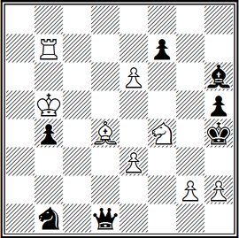

Словно выхвачена из партии № 22: **1. e7! Ка3+ 2. Kpb6 Kc4+ 3. Kpc5 Фа4 4. Л:b4 Фа7+ 5. Kp:c4 Ф:e7** — черные, казалось бы, добились своего — надежда белых — будущий ферзь, уничтожен. Но ... **6. Kg6+! fg 7. Cf6+! Ф:f6 8. Kpd5+ Kpg5 9. h4+ Kpf5 10. g4+ hg 11. Лf4+ C:f4 12. e4X** — все фигуры пожертвованы, а матует одна из двух оставшихся пешек.

**№ 23. Г. Заходякин, «Шахматный листок», 1930, 1-й приз, Ничья**  
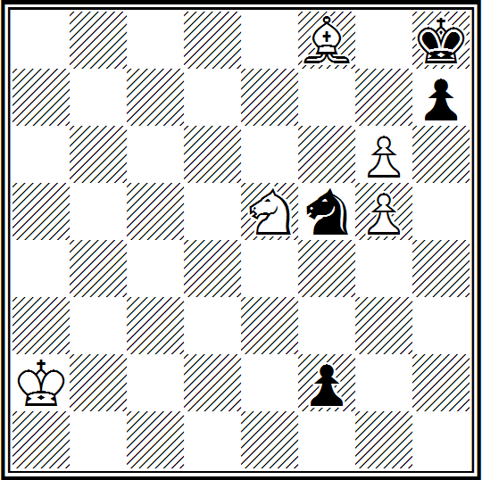

№ 23. Воспрепятствовать повышению в чине черного пехотинца белые не имеют возможности. Ну и пусть... **1. g7+ K: g7 2. Kf7+ Kpg8 3. Cc5! f1Ф 4. Kh6+ Kph8 5. Cd6!!** — и ничья. Фантастическое взаимодействие белых фигур: слон контролирует черного коня, пешка защищает коня, а конь слона и пешку. Например, **5. ...K— 6. Ce5+ Kg7 7. Cd6**.

Как видим, те идеи, которые в практической игре встречаются лишь одиночно, иногда нечетко проявляются, а временами и вовсе, так сказать, не выделяются из ее фона, в композиции реализуются полно, выпукло.

Следовательно, для того, чтобы задача или этюд стали произведениями искусства, от автора требуется творческое воображение, ясный идейный замысел и большое мастерство его воплощения. Только в этом случае произведение будет волновать и вдохновлять любителя шахмат, так как в подлинном произведении художественная форма неотрывна от тематического содержания.

Как показал опыт классиков шахматной композиции братьев Платовых, А. А. Троицкого, Л. И. Куббеля, Г. Рипка, и других, возможности обогащения техники составления задач и этюдов новыми приемами поистине неисчерпаемы. Технические приемы, применяемые проблемистами, и этюдистами, способствовали художественному выполнению замысла, положенного в основу произведения.

Понять сказанное поможет анализ двух позиций, вошедших в золотой фонд шахматного искусства. Одна из них — замечательный этюд братьев Платовых, составленный еще до Великой Октябрьской социалистической революции, другая — четырехходовка гроссмейстера СССР Я. Г. Владимирова, занявшая второе место на VIII чемпионате Советского Союза по шахматной композиции.

**№ 24. В. и М. Платовы, «Ригаер тагеблатт», 1909, 1-й приз, Выигрыш**  
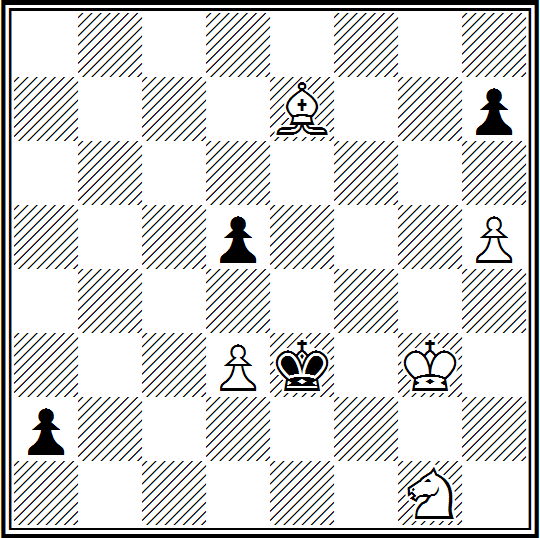

№ 24. Этот этюд известен тем, что на него обратил внимание и дал ему высокую оценку Владимир Ильич Ленин.

Решение мы приводим с комментариями мастера спорта по шахматной композиции А. С. Гурвича из его книги «Этюды» (1961):

«В этюде всего 4—5 ходов, но как глубоко и остро надо мыслить, чтобы найти их. Представьте себе, что это положение случилось в партии: следовательно, заранее неизвестно, что здесь имеется оригинальная возможность выигрыша.

Шахматист, мыслящий банально, после вступительного хода *1. Cf6* и очевидного *1... d4* сразу увидит, что его материальное превосходство иллюзорно. так как черная пешка неминуемо превращается в ферзя, но тут же опыт подскажет ему комбинацию, с помощью которой можно выиграть новообращенного ферзя. Он обязательно сыграет *2. Kf3* и после *2...a1Ф* торжествующе ответит *3. C:d4+ Ф:d4 4. K:d4 Kp:d4*.

Сравнительно легко ликвидировав главную опасность, наш шахматист живо смекнет, что противнику нужно еще потерять темп на взятие пешки d3, чем можно воспользоваться, чтобы выиграть черную пешку h7 и затем провести свою в ферзи. Но после *5. Kpg4 Kp:d3 6. Kpg5 Kpe4 7. Kph6 Kpf5 8. Kp:h7 Kpf6* выясняется, что выигрыша нет, так как на *9. h6* (иначе пешка пропадает) следует *9. ...Kpf7* и белый король заперт. Так в этой позиции оказывается бессильной привычная, шаблонная комбинация.

Но не так движется свежая, острая, упрямая и глубокая мысль, которая умеет цепляться за невидимое.

После **1. Cf6 d4** следующий ход белых **2. Ke2!!** нашему шахматисту покажется только капризом. Ведь здесь конь выполняет ту же роль, что и на поле f3 — производит второе нападение на пешку d4, а то, что он при этом становится под удар короля, практического значения не имеет, так как брать коня нельзя из-за 3. C:d4. Но когда после **2...a1Ф** белые «рассудку вопреки» играют **3. Kc1!!**, отказываясь от спасительного 3. C:d4+, и, более того, еще раз подставляя коня, то «мировоззрению» шаблонно мыслящего шахматиста наносится сильнейший удар.

Что же, однако, получилось на доске? Если взять коня, то выигрывается ферзь, уже не на большой, а на другой диагонали и с сохранением слона. Не брать? Но при положении коня на c1 ход слона на g5 — это не шах, а... мат. Совершенно неожиданный, поразительно красивый мат в центре доски.

Однако ход черных, они могут двигаться ферзем или королем. Увы, используя единственную возможность для выхода короля из матовой сети (на d2), черные попадают под коневую вилку (*4. Кb3+*) и теряют ферзя. Если же они защищаются от мата ходом **3...Фа5** — больше им неоткуда взять под обстрел поле g5,— то только теперь следует **4. C:d4+** и возьмет ли король слона или отступит на d2, коневая вилка на b3 опять приносит белым победу.

Какой богатый комплекс красивых идей таится в четырехходовой игре этой простой и легкой позиции: мат, кажущийся нереальным, так призрачно его появление,— и четыре разных выигрыша ферзя, причем каждый из них не тот, что бросается в глаза в начальной позиции.

Насколько же труднее найти два чудодейственных хода 2. Ke2 и 3. Kc1, чем рассчитать до конца всю десятиходовую ничейную комбинацию. А если бы кому-либо в практической борьбе посчастливилось проникнуть в тайны этой позиции и закончить ее в свою пользу, то какая из «вечнозеленых» партий могла бы стать с ней рядом?!

А вот как прокомментировал шедевр братьев Платовых тогдашний чемпион мира по шахматам доктор Эм. Ласкер:

«Каждый шахматист должен получить величайшее удовольствие от этого этюда. Почему? Потому ли, что выигрыш достигается соблюдением строжайшей экономии средств? Потому ли, что обладающие большей подвижностью и сопротивлением фигуры черных при всех попытках, как по какому-то волшебству, становятся жертвой слабых фигур белых? Или потому, что белые во что бы то ни стало стремятся избежать ничьей? Может быть, по существу радует нас то, что банальное, обыкновенное побеждается здесь силой мысли».

Четырехходовка — труднейший жанр современной задачи, сочетающий широту трехходовки с глубиной многоходовой комбинации. Технические трудности составления подобных задач очень велики. Чтобы преодолеть их, нужно обладать виртуозной техникой (что под силу не каждому композитору).

**№ 25. Я. Владимиров, «Проблеемблад», 1966, 1-й приз, Мат в 4 хода**  
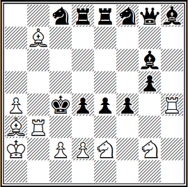

Здесь (№ 25) представлен головоломный замысел — циклическая перемена ходов белых в решении. Прекрасный вступительный ход **1. Крb1!!** органически связан с угрозой **2. Лb4+ Крс5 3. Лb5+** и 4. **Лс5Х**. Основные варианты: **1... Kd7 2. Лс3+ dc 2. Ке3+ fe 4. d3Х, 1... Ке6 2. d3+ ed 3. Лс3+ dc 4. Ке3Х** и **1... Ле5 2. Ке3+ fe 3. d3+ ed 4. Лс3Х**.

Необходимо заметить: в первом варианте — вторым ходом белых является четвертый ход белых третьего варианта, третьим — второй, четвертым — третий. Аналогию наблюдаем во втором варианте относительно первого, а в третьем — относительно второго. Это и характеризует циклическую перемену ходов белых в решении.

Действительно, трудность решения определяется глубиной замысла, неброскостью игры, тихими, нефорсированными ходами, которые должны создавать впечатление ослабления позиции белых. Комбинацию украшают жертвы сильнейших фигур, трудные первый и последующие ходы продолжения, чистота и экономичность финала.

**№ 26. М. Липтон, 1960, Мат в 2 хода**  
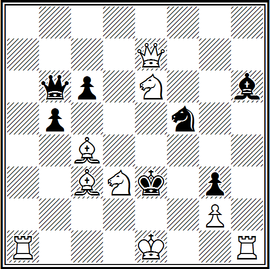

Посмотрите задачу (№ 26), попытка решить которую короткой рокировкой *1. 0–0?!* с угрозой *2. Ле1Х*:*1... Кре4+ 2. Кс5Х* и *1... Кре2+ 2. Kd4Х* не проходит из-за *1... bc*. А сальто с ладьей в другую сторону приводит к успеху — **1. 0–0–0!** с прежней угрозой: **1... Кре4+ 2. Kg5Х** и **1... Кре2+ 2. Kf4Х**.

Казалось бы, эта фантастическая позиция вообще возможна только в композиции. Разве в практической партии возникнет хотя бы приблизительно подобное положение? Однако партия между американским мастером Эд. Ласкером и англичанином Д. Томасом (№ 27) вводит нас в мир невероятного.

**№ 27. Эд. Ласкер — Д. Томас, Лондон, 1911, Ход белых**  
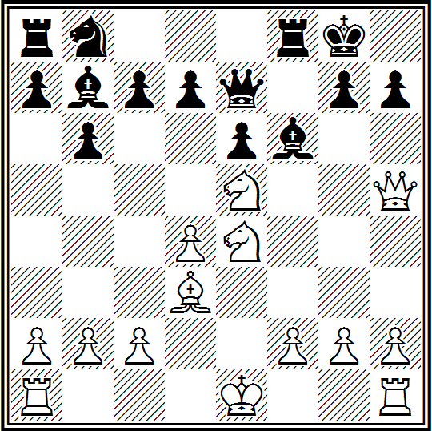

В этой позиции белые, пожертвовав ферзя (!), «втягивают» черного «монарха» в рукопашную и загоняют его в тыл, где он и капитулирует: **11. Ф:h7+!! Кр:h7 12. К:f6++ Крh6** (Но не *12...Крh8* ввиду *13. Kg6Х*) **13. Keg4+ Крg5 14. h4+ Крf4 15. g3+ Крf3 16. Се2+** (После *16. Крf1!* черные получали мат на один ход раньше, но ведь это не композиция, где необходимо матовать неприятельского короля в заданное количество ходов) **16. ...Kg2 17. Rh2+ Kg1 18. O-O-Ox!** или **18. Kd2x.**

Но и это еще не все. Выясняется, можно было дать мат еще раньше и... тоже рокировкой, но уже короткой. Нужно было на четырнадцатом ходу играть *14. f4+ Kрxf4 15. g3+ Kрf3 16. O-Ox!* (А также *16. Лf1+ Kрg2 17. Лf2+ Kрg1 18. O-Ox*).

Практическая игра и композиция взаимообогащают одна другую. Может возникнуть вопрос: есть ли смысл шахматистам-практикам знакомиться с произведениями композиторов? Безусловно. Это развивает комбинационное зрение, позволяя применить в партии задачные и этюдные идеи.

**№ 28. М. Либуркин, «Шахматы в СССР», 1934, 1-й почетный отзыв, Выигрыш**  
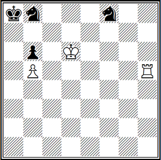

В этом этюде (№ 28) белые выигрывают, если сумеют разменять ладью на обоих черных коней. Но осуществить такой «выгодный» размен оказывается не так просто: **1. Лh8 Кfd7 2. Крc7 Kрa7** (Выжидательный ход.) **3. Лe8!! Кf6! 4. Л:b8 Ke8+** (Коня нельзя брать из-за пата!) **5. Kрd7!!** (Но черные не сдаются) **5. ...Kc7!** (И здесь следует эффектный финал.) **6. Лa8+! K:a8 7. Kрc8 Kc7 8. K:c7!**, наконец-то белые разменяли ладью.

Заметим, что эта позиция сложилась после пятого хода в легкой партии прославленных гроссмейстеров в Берлине в 1914 году. Партия закончилась так, как показано в этюде. Х.-Р. Капабланка одержал победу над Эм. Ласкером. Вдохновенный художник шахмат М. С. Либуркин превратил ее в выдающееся произведение.

**№ 29. Ю. Каем-NN, Днепропетровск, 1956, Ход черных**  
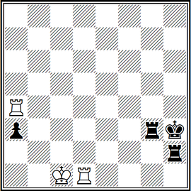

В одной из партий (№ 29), в которой белыми играл днепропетровский кандидат в мастера Ю. Каем, после **1... a2** белых спасла этюдная возможность пата — **2. Лa3 Л:a3 3. Лd3+! Л:d3**, пат.

**№ 30. Ю. Каем и В. Руденко, «Шахматы в СССР», 1957, Ничья**  
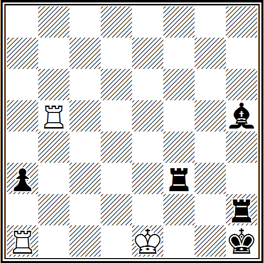

Шахматист-практик сказал эту концовку будущему международному гроссмейстеру по композиции В. Ф. Руденко и вскоре появился этюд (№ 30). После **1. O-O-O+! Kg2 2. Rg5+ Bg4! 3. Rx g4+ Kh3 4. Ra4 a2** и возникла знакомая патовая позиция (№ 29).

**№ 31. А. Арулайд — Б. Гугенидзе, Ворошиловград, 1955, Ход белых**  
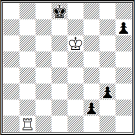

Довольно часто приходится слышать от шахматистов о пользе задач и этюдов в практической игре.

Позиция (№ 31) встретилась в партии, сыгранной на турнире в Ворошиловграде в 1955 году. «Испугавшись» грозных черных пешек, стремящихся превратиться в ферзей, белые сдались. Однако у них имелся путь к спасению: **1. Kpd6! Kpc8 2. Лс1+ Kpb7 3. Лb1+Kpa6 4. Kpc6 Kpa5 5. Kpc5 Kpa4 6. Kpc4 Kpa3 7. Kpc3 Kpa2 8. Лf1! h5 9. Kpd3 h4 10. Kpe3 h3 11. Kpf3** с ничьей.

**№ 32. Б. Горвиц и И. Клинг, 1851, Ничья**  
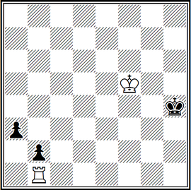

А ведь идея такого плана была указана еще за сто лет с лишним до этой партии, в этюде (№ 32): **1. Kpf4 Kph3 2. Kpf3 Kph2 3. Kpe3!** и т. д.

Международный гроссмейстер Л. А. Полугаевский в качестве «забавного казуса» приводит окончание партии двух сильных гроссмейстеров Л. Любоевичча (белые) из Югославии и американского шахматиста У. Брауна, сыгранной на международном турнире в Амстердаме в 1972 году — белые: **Кра5, п. b3 (2)** и черные: **Крс6, п. f7 (2)** — ход черных.

После *39. ...f5? 40. Крb4* последовало соглашение на ничью, которую оба партнера считали закономерным результатом. Казус, по мнению Л. А. Полугаевского, заключался в том, что... один из болельщиков указал, что посредством **39. ...Крd5!** черные достигают выигрыша: **40. b4 f5 41. b5 f4 42. b6 Крс6 43. Краб f3 44. b7 f2 45. b8Ф f1Ф+ 46. Кра5 Фа1+** или **40. Крb4 Крd4** и у белых нет защиты.

**№ 33. Н. Григорьев 1928 Выигрыш**  
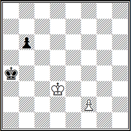

Не вызывает сомнения, что гроссмейстеры не были знакомы с этюдом (№ 33), а вот любитель, по-видимому, знал его. Ведь эта позиция является почти зеркальным отражением этюда Н. Д. Григорьева, но только с переменой цветов.

**1. Крd4! b5**.

Не помогает *1... Крb5 2. Крd5. Краб 3. f4! Крb7 4. f5 Крс7 5. Крe6! Крd8 6. Крf7 b5 7. f6 b4 8. Крg7 b3 9. f7* и т. д.

**2. f4 b4 3. f5 b3 4. Крс3 Кра3 5. f6 b2 6. f7 b1Ф 7. f8Ф+**.

На *7...Крa4* последует *8. Фа8+ Крb5 9. Фb8+* с выигрышем.

**7...Крa2 8. Фа8Х**.

**№ 34. Опоченский — П. Керес Буэнос-Айрес, 1939 Ход черных**  
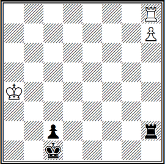

Диаграмма № 34. Окончание партии К. Опоченский — П. Керес, которая была сыграна на Олимпиаде в Буэнос-Айресе в 1939 году: **1... Крb2 2. Лb8+ Крa2! 3. Лс8 Лh4+ 4. Крa5 Крb2 5. Лb8+ Кра3 6. Лс8 Лh5+ 7. Крa6 Крb4 8. Лb8+ Крa4 9. Лс8 Лh6+ 10. Крa7 Л:h7-+**

Возможно, тогда еще молодому Паулю Кересу пришлось бы поломать голову прежде, чем привести партию к победному финалу, если б он не знал известного этюда Эм. Ласкера — диаграмма № 35.

**№ 35. Эм. Ласкер, «Дойчес вохеншах», 1890, Выигрыш**  
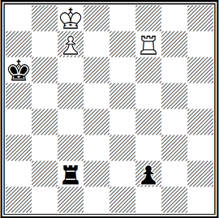

Это классический этюд в области ладейных окончаний. Систематическое движение, возникающее здесь, имеет большое практическое значение. Без этого этюда теория ладейных эндшпилей не была бы столь полной.
Задание кажется трудно выполнимым, ибо черная пешка сильна. Между прочим, если бы король черных был расположен на поле а7, все попытки белых выиграть оказались бы тщетными. Небольшая разница в положении короля ведет к роковым последствиям.

**1. Крс8—b8!** Медлить нельзя. После *1. Лf3 Кра7!* черным уже ничего не страшно.

**1... Лс2—b2+ 2. Крb8—а8 Лb2—с2 3. Лf7—f6+ Кра6—а5.** Здесь и далее черный король отступает по вертикали «а», чтобы иметь возможность шаховать по вертикали «b». Пойти на b5 нечего и думать. Тут же последует **4. Крb7** и борьба заканчивается.

**4. Кра8—b8(b7) Лс2—b2+ 5. Крb8—а7 Лb2—с2 6. Лf6—f5+ Кра5—а4. 7. Кра7— b7.** Можно, конечно, и 7. Крb6, но против эту несдуваемую соринку на чистом лике этюда.

**7...Лс2—b2+ 8. Крb7—а6 Лb2—с2 9. Лf5—f4+ Кра4—а3 10. Кра6—b6.** Грозит *11. Л:f2*.

**10... Лс2—b2+ 11. Крb6—а5.** Хорошая работа. Король успевает подстраховать пешку и активно участвует в атаке.

**11... Лb2—с2 12. Лf4—f3+ Кра3—а2 13. Лf3:f2! Лс2:f2 14. с7—с8Ф**, и выигрывают. Победа.

Следовательно, П. П. Кересу помог этюдный рецепт Эм. Ласкера. Да наш выдающийся гроссмейстер и сам активно занимался композицией, опубликовав с 1929 года около 180 задач и 30 этюдов. Неоднократно выходил победителем на очень авторитетных соревнованиях. А на первом чемпионате Советского Союза по шахматной композиции он занял 3-е место в этюдном разделе.

Перекликаются с алехинскими мысли П. П. Кереса относительно композиции:

«Композиция — это область, которая всегда привлекала большое внимание любителей шахмат. Здесь есть возможность осуществлять свои идеи без вмешательства партнера-соперника и, значит, полная свобода творчества. Известно, что каждый шахматист, будь то начинающий или многоопытный, чувствует особое удовольствие, когда после длительных раздумий ему посчастливится найти решение какой-нибудь хитрой позиции — «орешка»...».

Для того, чтобы быть шахматным композитором, недостаточно «жилки созидателя» или интереса к шахматной игре. Недостаточно также, скажем, качеств, необходимых для отличного математика или физика. Композиция — это, на наш взгляд,— прежде всего искусство, ибо она представляет собой творческий процесс.

Шахматный композитор, в отличие, например, от литератора и художника, должен «строить» свои произведения экономно: не «расточительствуя», использовать такой материал — пешки и фигуры — каков необходим для выбранной схемы задачи или этюда, устранения дефектов, а для души — удовлетворенность. Да и выбор схемы должен осуществляться простейшим вариантом — чего достичь нелегко.

А твердость, воля, способность преодолевать трудности, вырабатывать усидчивость, терпение — обязательные качества настоящего композитора. О том же, что он должен иметь творческое воображение, не приходится и говорить. Ведь без этого невозможно достижение целей шахматной композиции.

Вспоминаются наивные опасения собственного начального пути, когда казалось, что маститые композиторы уже успели все сделать, все изобрести. Уже давно были определены жанры, открыты темы. А я по-прежнему открывал открытое. Однако, дальнейшая практическая деятельность доказала, как бесконечно заблуждался. Оказалось, одни идеи выдвигаются для того, чтобы открыть новые, еще более сложные.

Когда первая двухходовка получилась, овладело неодолимое стремление составить вторую. Потом захотелось «сконструировать» трехходовку, многоходовку и, наконец, этюд.

Поставить перед собой цель, искать, находить и ошибаться, экспериментировать, радоваться и огорчаться, и, наконец — торжество победы. Это ли не великое удовлетворение. А испытывает его каждый, кто в поиске, а особенно, кто находит новое, неизведанное. И чем труднее дается цель, тем больше удовлетворения, когда она достигнута.

От первой мансубы до современных задач и этюдов пройдена огромная дистанция. Шахматная композиция довольно широко представлена в печати. В каждой области нашей страны работают шахматные комиссии и федерации, в нашем распоряжении первоклассные здания-клубы, в которых занимаются миллионы любителей шахмат, помощь опытных тренеров.

## ОБЯЗАТЕЛЬНЫЕ И ХУДОЖЕСТВЕННЫЕ ТРЕБОВАНИЯ ШАХМАТНОЙ КОМПОЗИЦИИ

Уже упоминалось, что в процессе развития композиции выработались художественные и формальные требования к шахматным произведениям, знание которых необходимо составителю и решателю.

Задача или этюд считаются правильными, если они имеют решение, и решение единственное, а расположение фигур в них может получиться в игре из начального их положения. Вот несколько примеров.

**№ 36. Ю. Сушков 1981 Мат в 2 хода**  
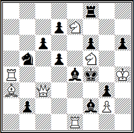

№ 36. Вначале угроза *2. Ng6X*, возникающая после *1. Nf-?*, опровергается ходом *1... d4* с развязыванием слона e4 (на *1... Rg8* следует *2. Qf6X*). Поэтому белые играют точнее *1. Nd6!?*, пытаясь сохранить угрозу и вариант (после *1... d4* теперь проходит *2. R: e4X*). Однако *1... Nd4!* — слон снова развязан. Наконец, скорректированный ход *1. N: g3!?* опровергается третьим развязыванием слона *1... Bd4!*

Белые тогда отказываются от возможности дать мат 2. Ng6X и поэтому сами развязывают того же слона — **1. Nd4!** с угрозой **2. Ne2X**, перекрывая ферзя, матующего в варианте **1... Rg8** и предоставляя черному королю свободное поле. Но теперь уже черные, играя **1... Ke5**, предоставляют белым возможность сделать ход **2. Ng6X**. На **1... N:d4** и **1... B:d4** следуют маты **2. Bd6X** и **2. Q:g3X**. Если **1... Bd3**, то **2. Ne6X**.

Парадоксальность задачи усиливается еще и тем, что вступительный ход делается как раз на то поле, на котором черные пред-отвращают реализацию намерений белых.

**№ 37. В. Мельниченко и В. Руденко «Шахматы», 1980, 1-й приз Мат в 3 хода**  
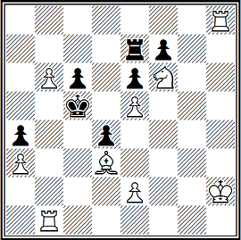

№ 37. Авторы создали классическое произведение на современную тему Владимирова (или азербайджанскую тему) в трех вариантах. Заслуга составителей еще и в том, что им удалось известную двухходовую тему разработать в специфически трехходовой форме при легкой конструкции, остроумно мотивируя парадокс изменения порядка ходов.

Попытки *1. Ла8?*, *1. Лb8?*, *1. Лс8?* черные опровергают ходами *1... Ла7!*, *1... Лb7!* и *1... Лс7!*, после чего не годится *2. е4?* из-за взятия на проходе.

В решении после **1.е4!** — цугцванг, первые ходы из попыток следуют на ходы, ранее опровергавшие попытки: **1... Ла7 2. Ла8!, 1... Лb7 2. Лb8!** и **1... Лс7 2. Лс8!** и черные снова в цугцванге, ибо потеряли право взятия на проходе (если же 1... de**, то 2. Лh4! с неотразимым 3. Лс4Х**). Известное правило шахматной игры явилось основой перемены игры в задаче.

**№ 38. И. БреЙер, 1938, Мат в 5 ходов**  
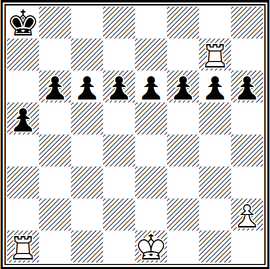

А здесь (№ 38) естественность позиции придает расположение всех восьми черных пешек. Да и задание — мат в пять ходов — кажется почти невыполнимым. На самом деле: прямолинейное 1. Лd1 или 1. Лс1 не приводит к цели, ибо подвергшаяся нападению пешка немедленно становится под защиту своего собрата.

Осаду пешечных бастионов необходимо вести с другой стороны доски — **1. 0-0-0!** Рокировка в задачах допускается, если нет доказательства, что король или ладья покидали первоначальные поля. **1... d5** — естественная защита, но теперь возможен несложный типичный прием прорыва пешечной цепи: **2. Лf1! f5 3. Ле1** и в пешечной крепости образуется брешь, так как пешка е6 незащитима
и проходит победное: **4. Л:е6 (е5)** с неотвратимым **5. Ле8Х**.

**№ 39. Б. Горвиц и И. Клинг, 1851, Выигрыш**  
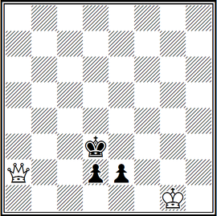

Ну, а этюдная позиция (№ 39), как мы уже упоминали, должна максимально походить на окончание действительно сыгранной партии.

Две черные пешки неудержимо рвутся к первой горизонтали, и, кажется, вот-вот станут грозной силой — превратятся в ферзи. Но белые принимают экстренные меры и выигрывают:

**1. Фa6+! Крe3 2. Фe6+ Крf3 3. Фf5+ Крe3 4. Фf2+ Крd3 5. Фf3+** с последующим **6. Ф:e2!** Если **2...Крd3**, то **3. Фf5+ Крd4 4. Фf4+ Крd3 5. Фf3+** и **6. Ф:e2** также с выигрышем.

Рассмотренные произведения всех основных жанров композиции свидетельствуют о том, что единственность, четкость и чистота решения являются главными критериями полноценности шахматного творения — задачи или этюда.

Важнейшими художественными требованиями к композиции являются: выразительность замысла, экономичность и красота решения. Они определяются принципами единства формы и содержания и гармонического соответствия идейного замысла и средств, использованных для его воплощения.

Выразительность замысла заключается в четком выделении тематических вариантов, воплощающих замысел автора. Композиция, в которой этот замысел выражен в максимальном количестве идейных вариантов, называется рекордной задачей или рекордным этюдом, то есть задача-таск и этюд-таск.

**Г. Баев, 1930**. Белые: **Краб, Фh6, Лb1, Лh4, Cg3, Cg8, Kc2, Kc5, пп. b4, c7, e7 (11)** и черные: **Kpd5, Ле1, Лg5, Cf6, Kf7, Kg4, пп. c4, c6, e6 (9)** — мат в два хода.

Рассматриваемый пример — задача-рекорд (иными словами — тасковая задача) — шесть перекрытий черных фигур на одном поле. Из-за сложности замысла проблемисту (составителю задач) пришлось прибегнуть к превращению на первом ходу пешки в коня: **1. c8K!** с угрозой **2. Kb6X** — **1... e5 2. C:f7X, 1... Kge5 2. Лd4X, 1... Ce5 2. Ф:e6X, 1... K7e5 2. C:e6X, 1... Лge5 2. Фd2X и 1... Леe5 2. Лd1X**.

**Л. Лошинский, 1940**. Белые: **Крез, Фс3, Ла1, Лд3, Се7, Ch1, Ке4, Кf5, пп. c5, d2, g4 (11)** и черные: **Крh2, Ла8, Са2, пп. b7, c2, d6, e5, g5, h3 (9)** — мат в три хода.

Тоже задача-таск. В шести вариантах (это максимум возможного!) представлена тема клапана: черный слон, открывая путь ладье к полю а1, выключает ее действие по другим линиям.

**1. Лс1!** с угрозой **2. Сf3** и **3. Лh1X**: **1... Cb3 2. Л:d6 и 3. Ф:e5X, 1... Cc4 2. Ке:d6, 1... Cd5 2. cd, 1... Ce6 2. C:d6, 1... Cf7 2. Кf:d6, 1... Cg8 2. Крf2 и 3. Л:h3X**.

Кажется, что фигуры белых как будто недостаточно нагружены, но это не так: все они либо перекрывают линии, либо держат поля, либо играют по меньшей мере в двух вариантах.

**В. Савченко. «Шахматная Москва», 1970, 1-й приз.** Белые: **Кре1, Ла1, Са4, Са7, Кf6, Кh5, пп. а2, b2, c4, c6, d5, f2, h4 (13)** и черные: **Кре5, Фf8, Ch3, Кf1, Кf7, пп. а3, а6, d6, f4, f5, g6, h2 (12)** — мат в восемь ходов.

Не проходит *1. Лd1?* из-за *1... Kd2 2. Л:d2 h1Ф+!* На первый взгляд, мало что меняет и **1. 0—0—0**, так как появился новый шах— **1... ab+**, и нельзя *2. Кр:b2 Фb8+!* или *2. Крb1 Kd2+!*

Но теперь предприняли неожиданное **2. Kc2! b1Q+ 3. Kc3 Qb2+ 4. Kd3!** в третий раз отказывая от взятия ферзя! Угрозы **5. Nd7x** и **5. Re1+** вынуждают к еще одной жертве ферзя, которую белые уже принимают: **4. ...Qe2+ (4. ...Qa3+ 5. Bb3) 5. Kxe2 f3+ (5. ...Ng3+ 6. Kd3 Bf1+ 7. Rxf1) 6. Ke1.**

Король вернулся в первоначальное положение, но в позиции черных появилась «слабость» — поле f3 оказалось блокированным, и после **6. ...Nd2** следует **7. Nd7+ Ke4 8. Bc2x.** Исключительно эффективная и четко выполненная логическая комбинация!

**В. Корольков, 1929**. Белые: **Kh1, Qf8, Rc2, Bc5, Bd7, пп. a7, b2, b6, b7, d4, f7, h2 (12)** и черные: **Kd1, Be2, Na2, пп. b4, f2, h3 (6)** — выигрыш.

У белых колоссальный перевес в силах, но их монарху грозят маты, и начинается яростная атака.

**1. Rd2!+ Kc1**. Если *1... Kxd2*, то *2. Qh6+* и *3. Qxh3*, сразу ликвидируя все угрозы.

**2. Rd1!+ Kxd1 3. Ba4+ b3!** Предусмотрительно переводя слона с диагонали a4-e8 на диагональ a2-g8. Значительно слабее 3...Ke1 4. Bxb4+ Nc3 5. Bxc3+ Kf1 6. Bb5 Bxb5, и надо защищать поле c6 — 7. Qc8! и знакомое 8. Qh3+.

**4. Bxb3+ Ke1 5. Bb4+ Nc3!** Тонкость жертвы станет ясной после одиннадцатого хода черных.

**6. Bxc3+ Kf1**. Появились первые признаки пата — нет *7. Bd5? Bf3+ 8. Bxf3*, пат.

**7. Bc4! Bxc4 8. Qc5!** Надо защищать поле d5 — вот зачем *3...b3!*

**8... Bd3 9. Qb5!** Ряды белых тают.

**9... Bxb5 10. b8N!** — и тут же пополняются новыми бойцами!

**10... Bd3! 11. a8B!!** Но не *11. a8Q? Be4+ 12. Qxe4*, пат.

**11... Be2!** Грозит *12...Bf3+ 13. Bxf3*, пат. Ясен дополнительный смысл жертвы *5...Nc3!* — это не только «сброс материала» ради запатования, но завлечение белого слона на поле c3, где он зажат с обеих сторон своими же пешками b2 и d4 и не может поэтому рас-патовать черного короля, покинув диагональ a5-e1.

**12. f8R!!**, и выигрыш (нет *12... Bf3 13. Rxf3*, и свободно поле e2). Три белые пешки подряд превратились в разные слабые фигуры! И застыли на доске, напоминая о загадках, заданных черными белым, напоминая об изобретательной схватке сторон (см. ИЛ № 19).

Надо сказать, что в настоящее время известно более трехсот тем композиции, однако все они основываются только на семи основных тактических идеях: блокирование полей у черного короля, включение на эти поля белых фигур, отвлечение, перекрытие, связывание черных фигур (путем самосвязывания или полусвязывания), развязывание белых фигур и шахи белому королю.

Но поскольку построение тасковых композиций, в которых какая-либо идея воплощается в максимальном числе вариантов, как правило, приводит к созданию громоздких, малохудожественных произведений, представляющих в большей степени технический интерес, то, естественно, это противоречит принципу выразительности, экономичности формы. Ибо экономичность формы вынуждает автора выполнить свой замысел минимальными средствами. В свою очередь, общие принципы экономичности формы подразделяются еще на три подпринципа: экономичности начальной позиции, игры и финала.

**№ 40. Л. Куббель, 1939, Мат в 2 хода**  
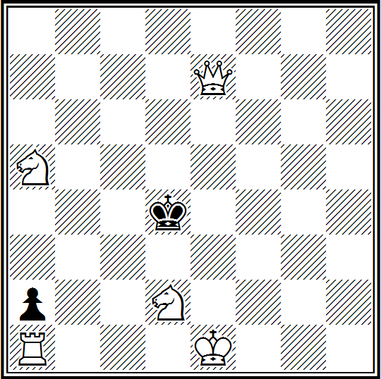

Например, экономичность начальной позиции характеризуется участием всех фигур в решении. Здесь (№ 40) в миниатюрной форме реализована идея длинной рокировки белых в соединении с шахом королю: **1. O-O-O! a1Ф+ 2. Кb1#** и **1... Kрc3 2. Кe4#**.

**№ 41. С. Лойд, 1857, Мат в 3 хода**  
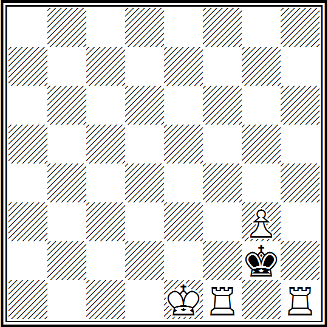

Фигуры, предназначенные для устранения побочных решений, дуэлей, нерешаемости и т. д., являются техническими и играют вспомогательную роль. Например (№ 41), решение задачи-малютки (общее число фигур не более пяти): **1. Rf4!** — цугцванг: **1... Kxg3 2. O-O! Kh3 3. Rf1#** и **1... Kxh1 2. Kf2 Kh2 3. Rh4#** — очень интересно. Но для чего здесь пешка g3? Оказывается, без нее задача имела бы побочные решения *1. Rfg1+ Kf3 2. Rh4 Ke3 3. Rg3#* и *1. Rhg1+ Kh2 2. Rg8 и 3. Rh1#*. Значит, это техническая фигура, устраняющая дефект задачи.

Следовательно, составителю необходимо добиваться уменьшения числа технических фигур, использования всех белых фигур в тематических вариантах и тем самым обеспечивать легкость построения шахматного произведения.

**№ 42. Р. Кофман, 1939, Мат в 3 хода**  
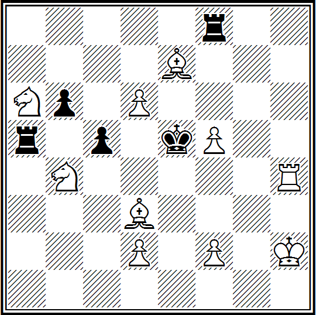

В простой форме (№ 42) автору удалось впервые в трехходовке с правильными матами тему сложного блокирования провести в трех вариантах: **1. Bc2! Ra6 2. d4+ (угроза) cxd3 3. f4#**, **1... c4 2. Nc6+ Kd5 3. Be4#** и **1... cxb2 2. Nxb4 Rf5 3. Re4#**.

Здесь строго выполнены принципы экономичности формы: впечатляет экономия средств и особенно непринужденность построения.

**№ 43. Р. Рети, 1928, Ничья**  
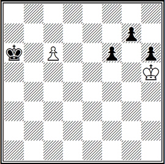

Последнее требование — максимальное приближение начального положения к позиции практической партии — непременно должно выполняться при составлении этюдов. В качестве примера к сказанному как нельзя лучше подходит знаменитый этюд чешского гроссмейстера Р. Рети (№ 43), напоминающий окончание партии, отложенной в безнадежном положении. Но, как это ни удивительно, единственная белая пешка делает ничью против трех связанных проходных пешек соперника.

**1. Kpg6 Kpb6 2. Kp:g7 h5 3. Kp:f6 h4 4. Kpe5 h3 5. Kpd6 h2 2. c7**, и ничья. Не меняет дела и **1... h5 2. Kp:g7! h4 3. Kp:f6 Kpb6 4. Kpe5! Kp:c6 5. Kpf4 h3 6. Kpg3 h2 7. Kp:h2** — король догоняет пешку на пороге ее превращения.

Основным критерием, характеризующим экономичность игры в задаче является соответствие числа ходов решения замыслу композиции. То есть, если для полного выражения идеи требуется только три хода, проведение замысла в жанре многоходовок совсем неоправдано.

**А. Попандопуло. «Вечірній Київ», конкурс, посвященный 1500летию г. Киева, 1982, 3-й почетный отзыв**. Белые: **Kph6, Лb8, Лd8, Са8, п. е6 (5)** и черные: **Кра6, Фd3, Ла4, Лa5, Cb1, Cc5, Kh5, пп. а7, b5, c7, d5, e7, e5, f5, g5 (15)** — мат в пятнадцать ходов.

Готовые в начальной позиции две белых батареи не могут нанести решающего удара — им не хватает размаха. Но если бы отсутствовала белая пешка еб, то возможно было рождение третьей разноименной батареи, которая и решила б исход борьбы. Все батареи — две вспомогательные и главная — играют дважды.

**1. Cb7+ Kpb6 2. Cc8+ Kpc6 3. Cd7+ Kpd6.** (На 6. ...Кр — последует 7. Лf8X.) **6. Cc8+ Kpc6 7. Cb7+ Kpb6 8. C: d5+ Kpa6** — король вернулся на исходное положение. **9. Лd6+! cd 10. Ce6 Фе4 11. Cc8+ Фb7 12. Л:b7 Ce4 13. Лb8+ Cb7 14. Л:b7 и 15. Лb8X**.

Итак, основная игра (форсированный маневр белых) завершается эффектной жертвой ладьи, а вот финальная часть решения носит искусственно продленный малоинтересный характер. Спрашивается: зачем понадобилось известному советскому многоходовику к основной идее прикладывать «инородное тело»?

Что же касается экономичности игры в этюде, то она не нарушается при искусственном удлинении решения и возвращается через несколько ходов к авторскому. Причем, в этюде все фигуры должны максимально выявлять свои возможности (имеется ввиду их подвижность, динамика и т. д.), то есть их коэффициент полезного действия надо довести до высшего предела.

**№ 44. А. Троицкий, Чемпионат СССР, 1929, 7-е место, Выигрыш**  
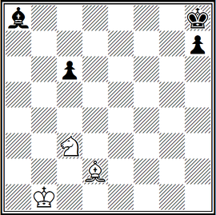

№ 44. Чрезвычайно редко в мировой шахматной литературе встречаются позиции, в которых задание выиграть вызвало бы такое недоумение, как в рассматриваемом этюде. При ничейном соотношении скромных сил враждующие фигуры находятся на максимальном расстоянии друг от друга, и не видно никаких признаков их взаимозависимости. Все наличные силы на доске свободны.

Неужели же в этом мертво-ничейном эндшпиле заключена какая-нибудь тайна? Непостижимо. А между тем, **1. Ch6!**, и над черным королем сразу нависает угроза мата. Если он немедленно не покинет своего угла, а вместо этого будет сделан ход слоном или пешкой, то матовая сеть возникнет немедленно.

Например: *1... c5* (или *1... Cb7 2. Ke4*) *2. Kb5*, и на любой ответ белые, сыграв *3. Kd6!*, будут держать вражеского короля под «домашним арестом» на клетках h8 и g8, пока торжествующий белый король не подоспеет к месту казни: *3... C— 4. Kpc2 Kpg8 5. Kpd2 Cf3 6. Kpe3 Cc6 (g2) 7. Kpf4 c4 8. Kpe5 c3 9.Kpf6 Cd7* (Грозило *10. Kf5* или *10. Kc8* и *11. Ke7—*) *10. Ke4 c2 11. Kpe7 C— (11... c1Ф 12. Kf6+ Kph8 13. C: c1 C— 14. Kpf8) 12. Kf6+ Kph8 13. Kpf8 и 14. Cg7X*, или *9... Ch3! 10. Ke4 c2 11. Kpe7 c1Ф 12. Kf6+ Kph8 13. C: c1 Kpg7 14. Kh5+ Kpg6 15. Kf4+* и выигрывают.

Следовательно, черные обязаны, не теряя времени, играть **1... Kpg8** и после **2. Ke4**, пока не поздно, вырваться королем на волю. Но после **2...Kpf7** белые кардинально меняют весь план игры и переносят свою атаку с угла h8 на a8!

Мы видели, как при движении слона или пешки «с» белые быстро парализовали вражеского короля и пешку «h». Когда же первые два темпа черные использовали для бегства короля, белые ходом 3. Kc5** сразу парализуют слона a8 и пешку «с», не успевших тронуться с места. Конь энергично борется на два фронта, в критический момент выбирая тот из них, на котором соперник замешкается.

Теперь цель белых заключается в том, чтобы выиграть слона, для чего они должны одновременно выполнять три стратегические задачи:

1. не пускать черного короля на подмогу к своему слону;
2. не дать черному королю возможности согнать белого коня с ключевой позиции;
3. обезвредить сильный контршанс черных, связанный с продвижением пешки «h», которая теперь призвана играть ту же роль «освободителя», какую в матовых вариантах пыталась сыграть пешка «с».

**3...Kpg6.**

Черным нет никакого смысла играть *3... Кре8*, так как после *4. Cg5 h5 5. Ch4* они должны вернуться к главному варианту, потеряв два темпа. На *4...h6* белые могут ответить даже взятием пешки, пропустить черного короля на с8, а слоном стать на f4, взяв под контроль поля b8 и с7.

В этом положении черный слон не сможет вырваться из плена через пункт b7: поле с8 блокировано собственным королем, пункт а6 контролируется конем, и точно так же, как в матовых вариантах, блокированный король должен был топтаться на полях g8 и h8, теперь блокированный слон принужден топтаться на полях а8 и b7, пока к нему не подойдет белый король и не уничтожит его.
Таким образом, и в этом углу сопротивление безнадежно. Черный король мог бы помочь здесь своему слону только в том случае, если бы ему удалось, обойдя всю доску, попасть на поле b6, после чего слон через b7 и с8 вырывается на свободу.

**4. Cf8 h5! 5. Крс2 Крf5 6. Cd6! Крg4 7.Kpd2 Крf3 8. Крe1 Крg2**. Ожесточенная борьба перенеслась в третий угол доски!

**9. Се7 Крg3 10. Крf1 Крf3**. Надежды на пешку «h» тоже провалились, и черные ищут еще один и уже последний путь к спасению.

**11. Cd6 Крe3 12. Се5!** Не пуская короля через d4 на с4.

**12...Kpd2 13. Крg2 Крс2 14. Крh3 Крb1**. Вот куда забирается король в поисках лазейки к «арестованному» слону!

**15. Крh4 Крa2 16. Кр: h5 Крa3**.

Последняя надежда, но...

**17. Сс3!**

Черные терпят поражение в четвертом углу доски. Они вынуждены пуститься в такой же безотрадный обратный путь королем, не смея приблизиться к своему обреченному слону, так как белый слон в нужный момент одним ходом сводит на нет многоходовые маневры черного короля, а белый без помехи приближается к полю а8.

Грандиозный этюд! Располагая чрезвычайно ограниченными силами, белые устанавливают железную власть над всей доской, дают бой противнику на всех ее участках — как в центре, так и на краях, и всюду утверждают свою гегемонию.

По масштабу игры, который может быть достигнут координацией действий короля лишь с двумя легкими фигурами на свободной доске, — непревзойденное произведение! (Комментарии — см. ИЛ № 13).

А теперь сравните следующие два этюда.

**Г. Каспарян, 1936**. Белые: **Kpf4; Ле7, Kd8, п. h4 (4)** и черные: **Kpg6, п. f2 (2)** — выигрыш.

**1. h5+! Kph6!**

Нет *1... Kp:h5 2. Лh7+* и *3. Лh1, 1... Kpf6 2. Лf7X*.

**2. Kf7+ Kp:h5.**

Если *2...Kph7*, то *3. Kg5+ Kpg8 4. Ле8+ Kpg7 5. h6+ Kpg6 6. Kpg4! If6 7. Ле6+ Фf6 8. Л :f6+ Kp :f6 9. Kph5*.

**3. Ле5+ Kph4!**

На *3...Kpg6* последует *4. Лg5+ Kp f7 5. Лf5+ и 6. Kpg4* или *4. ...Kph7 5. Лh5+ и 6. Лh1*.

**4. Kg5! f1Ф+ 5. Kf3+ Kph3 6. Лh5+ Kpg2 7. Лh2X.**

Элегантный финальный мат предварен неплохим вступлением с жертвами белой пешки, белые ладья и конь занимают позиции для заключительной атаки (ходы, начиная с 3. Ле5+), черный король приходит на роковое поле g2. Но конфликтная ситуация одна и та же — ладья не может задержать пешку, находясь на соседней линии «е», контригры черных нет — есть безыдейное лавирование королем. Есть вступительная игра, нет игры идеей, нет равноправия сторон в борьбе!

**№ 45. З. Бирнов, 1947, Выигрыш**  
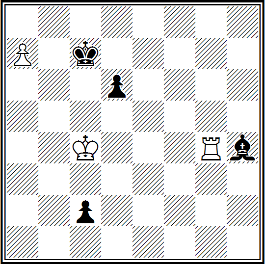

№ 45. **1. Лg7+ Kpb6 2. a8K++!!**

Только так. Любое другое продолжение лишает белых инициативы.

**2...Кра6.**

Любопытно, что черные сразу попали в матовую сеть. И на a5 и на c6 они были бы немедленно наказаны, причем в мате на поле c6 печальную роль для черных сыграла бы их пешка d6, которая намерена участвовать в борьбе и еще покажет себя.

**3. Kc7+ Kpa5!**

На *3... Kpb6* следует *4. Kd5+ Кра6 (c6) 5. Kb4+* и *6. K:c2*. Если же *3...Kpa7 (b7)*, то *4. Ke6+*, беря под обстрел поле g5, и затем *5. Лg1* с выигрышем, так как слон лишен хода на g5.

**4. Лg1.**

Казалось бы все, но борьба только начинается.

**4. ...Cg5!**

Угрожая превращением пешки, черные обязывают белых принять жертву. Но для чего? Ведь слон берется с шахом, и ладья возвращается на g1. А вот посмотрим.

**5. Л:g5+ d5+!**

Острое слово! На шах черные ответили шахом и вторично обязывают белых принять жертву.

**6. Л:d5+,**

после чего ладья уже не может вернуться на первую линию, чтобы задержать пешку (римская идея!).

**6. ...Кра4.**

Конечно, не *6. ...Крb5 7. Лb5+ Кр:с7 8. Лс5+* и *9. Крb5 (d5)*. Теперь же атака белых закончилась и, оставшись с единственной пешкой, черные как будто добились своего: ее превращение в ферзя нельзя предотвратить. Однако и у белых тоже есть свое острое слово. После

**7. Кb5 с1Ф+.**

они в свою очередь на шах отвечают шахом, но более грозным!

**8. Кс3+ Кра3 9. Ла5+ Крb2 10. Ла2Х.**

Превращение пешки в коня, жертвы черных фигур, римская идея, встречные шахи с обеих сторон, наконец, эффектный мат — удивительно, как все это гармонически слилось в очаровательной миниатюре 3. Бирнова (см. ИЛ № 13).

«Больше только на одну исходную единицу, а какими новыми яркими красками заиграл этюд. Тут и приятно связанное с финалом вступление (появление белого коня), и подлинно идейная игра (создающая конфликт, приводящая к отмеченному соседству линий движения белой ладьи и черной пешки), и тот же экономный правильный мат (разрешающий спор между белыми и черными» (комментарий международного мастера Ап. Кузнецова).

Следующие примеры характеризуют возможности нахождения вступительной игры без добавления дополнительного материала.

**Р. Рети, 1925**. Белые: **Крf5, Лf1, Сс4 (3)** и черные: **Крh2, п. g3 (2)** — выигрыш.

**1. Лf3!**

В «засаду» за пешкой g3 по третьей горизонтали.

**1... g2 2. Сf1!** В «засаду» за пешкой g2 по диагонали f1—h3.

**2...g1Ф 3. Лh3X.**

Разгадка ясная и эффектная. И нужно ли вступление?

**№ 46. Н. Кралин, 1963, Выигрыш**  
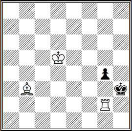

№ 46. Те же персонажи, что и у Р. Рети.

**1. Лf2!!**

Выглядит парадоксально, ибо позволяет черной пешке двинуться вперед с темпом.

**1... g3 2. Лf3!**

«Засада» по Рети.

**2...Крh2!**

Ясно, что слабо *2...Крg4? 3. Крe4 g2 4. Сe6+ Крh4 5. Лh3+, 6. Лg3+ и 7. Л:g2*; затейливей вариант *2...Крh4!? 3. Лf4+ Крg5 (3...Крh3 4. Сс4 g2 5. Сf1) 4. Крe4 g2 5. Лf8! g1Ф6. Лg8+ и 7. Л:g1*.

**3. Сс4! g2 4. Сf1!**

«Засада» по Рети.

**4. ... g1Ф 5. Лh3X.**

Явно лучше: и решение труднее (1. Лf2!!), и черный король попадает на матовое поле (2...Крh2!), и динамика этюда выше — ходит черный король, по два хода делают белые ладья и слон, черная пешка двигается не дважды, а трижды, и обусловленность хода 1. Лf2! красивая — надо защитить поле f1, на которое стремится слон (см. ИЛ № 19).

Чтобы финальная позиция получилась экономичной, необходимо, чтобы в ней участвовало как можно больше оставшихся на доске фигур. Это обстоятельство должно использоваться шахматными композиторами при конструировании композиций, которые заканчиваются правильными матовыми позициями. В них соблюдаются требования чистоты мата (у черного короля контролируется каждое поле только по одной причине — либо занято собственной фигурой, либо однажды атаковано белой) и экономичности мата (когда в создании матовой картины участвуют все белые фигуры, оставшиеся на доске, кроме короля и пешек ввиду их малой подвижности).

**№ 47. С. Крючков, 1927, Мат в 3 хода**  
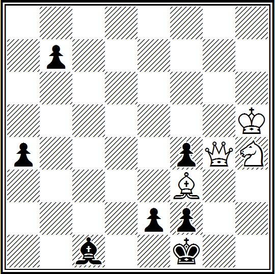

Здесь (№ 47) мат в варианте **1. Сс6 e1Ф 2. Cg2+ Крg1 3. Кf3X** — чистый и экономичный — все поля вокруг черного короля отняты по одному разу: поле f2 заблокировано собственной пешкой, а остальные атакованы белыми по одному разу (мат чистый); в создании матовой картины участвуют все белые фигуры, за исключением короля — мат экономичный.

В варианте **1... e1К 2. Cb5+ Кd3 3. Фd1X** — мат тоже правильный: ибо белый слон за счет связки коня активно участвует в матовой картине, опровергая 3...Ке1! То есть, весьма существенно, когда в создании мата или пата участвует белая фигура, связывающая и блокирующая поле у черного короля.

Условность правильного мата заключается в том, что, если это только возможно, черные обязаны делать ходы, которые ведут к созданию правильного матового положения.

Например, здесь в варианте-угрозе взятие слона: **1... bc 2. Кf3!** и **3. Фh3X** или **2...e1Ф 3. Кh2X** — то есть два чистых и экономичных мата. А всего, следовательно, три варианта с четырьмя правильными матами (см. ИЛ № 27).

При составлении этюдов должно выполняться требование максимального приближения начального положения к позиции практической игры. Предлагаем вашему вниманию два этюда.

**В. Мандинян, 1915–1946**. Белые: **Крb1, Кh5, пп. b3, b6, c2, g7 (6)** и черные: **Крg5, Ла4, Ла5, Са3, Са6, пп. b2, b4, b5, b7 (9)** — выигрыш.

**1. Kg3 Kph6 2. g8Л Kph7 3. Лg5 Kph6 4. Лg4 Kph7 5. Kf5 Kph8 6. Kh6 (e7) Kph7 7. Kg8 Kph8 8. Лg6 Kph7 9. Лg3 Kph8 10. c4 Kph7** (Если черные возьмут пешку, то 11. Kf6 с последующим матом на g8.) **11. c5 Kph8 12. c6 Kph7 13. c7**, и выигрывают.

**В. Корольков, 1936**. Белые: **Kph3, Фd4, Лf1, Лg1, Cg3, пп. f2, f4, g5, h2, h6 (10)** и черные: **Kph5, Лd1, Cc2, Kh4, пп. e6, f3, g2, g6, h7 (9)** — выигрыш.

**1. Фc5 Cf5+ 2. Ф:f5 ef 3. Ле1 Лc1 4. Лd1 Лb1 5. Лc1** (Если 5. Лg1, то 5. ...g1K+ 6. Л:g1 Kg2, и черные спасаются) **5. ...Лa1 6. Лb1 Л:b1 7. Л:b1 g1Ф 8. Л:g1 Kg2 9. Л:g2 fg 10. Kp:g2**, и выигрывают.

Теперь сравните рассмотренные этюды с двумя следующими.

**№ 48. А. Казанцев, 1947—1948, Ничья**  
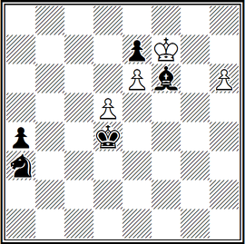

№ 48. В простой позиции перед нами классический фигурный материал.

**1. d6.**

Единственный шанс, чтобы обессилить черного слона одновременно борьбой с двумя проходными пешками.

**1... Kb5 2. de Kpe5.**

Теперь оба поля превращения белых пешек под контролем черных: h8 — слоном, а e8 — угрозой вилки на d6; пешка же «а» беспрепятственно двинется вперед.

**3. e8K!**

Первая неожиданность. Конь не только парирует угрозу вилки, но и нападает на слона, у которого единственное поле для отступления.— h8.

**3...Ch8 4. h7 a3 5. Kpg8 Kp:c6 6. Kp:h8 Kpf7.**

Положение белых стало совсем безнадежным.

**7. Kd6+!**

Дальновидная мысль.

**7. ...Kpf8 8. K:b5 a2 9. Kd4!**

И в этом «безвыходном» положении белый конь занимает позицию, с которой он достигает и поле a1 и f8. Теперь же для белых открывается еще одна возможность «этюдного» спасения.

**9. ...a1Л! 10. Ke6+ Kpf7 11. Kd8+ Kpg8! 12. Kpg8 Лa8.**

И третья пешка не может превратиться в ферзя. Но белые под конец опять-таки применяют свою грандиозную комбинацию: превращают пешку в коня.

**13. h8K+! Kph5 14. Khf7,** и сражение кончилось миром.

В простой, легкой и естественной первоначальной позиции постепенно раскрывается редкостная по богатству содержания и красоте игра (см. ИЛ № 21).

**№ 49. Е. Сомов-Насимович, «Мадьяр шаквилаг», 1928, Ничья**  


№ 49. **1. Kpd3 Cb2 2. Лg2 Ca1 3. Лg1 Cc2+**.

Иначе белая ладья вечно нападает на черного слона.

**4. Kpc4 Kb3**.

Чернопольный слон защищен, но теперь ладья начинает преследование белопольного.

**5. Лg2 Ka5+.**

Если *5. ..Cd1 6. Лg1 Cc2 7. Лg2*. Черные находят новые возможности продолжить борьбу.

**6. Kpb5 Kc6!**

Вот контршанс черных: обе черные фигуры неуязвимы — *7. Kp4 c6? Ce4+* или *7. Л:c2? Kd4+*, и выигрывают.

**7. Лg1! Cd4**.

Иначе гибнет конь.

**8. Лс1! Сез**.

У черных нет ничего лучшего, но при положении слона на е3 белым удается разменять ладью за две фигуры черных.

**9. Л:с2 Kd4+ 10. Kpc4 K:c2 11. Kpd3 — ничья**.

Оба выдающихся произведения этюдного искусства, нисколько не уступающих по своим достоинствам друг другу, оригинальны по замыслу, полны неожиданностей, обоюдоострой и тонкой игры, чрезвычайно эффектны в кульминационных моментах и при всем том предельно экономичны и естественны в исходных позициях.

Красота решения в задаче или этюде достигается скрытыми, труднонаходимыми ходами (маневрами) обеих сторон. В этюде красивым считается решение, достигаемое динамичной, жертвенной и тонкой игрой, сопровождаемое сильными ложными следами. Желательно добиваться органического единства вступительной игры и финала.

Московский международный мастер по шахматной композиции А. Г. Кузнецов более подробно и доходчиво об этом положении пишет в своей книге «*Цвета шахматного спектра*» (1980). По его мнению, стержнем этюда является главный (авторский, идейный, основной) вариант решения, который должен выделяться среди остальных особой красотой и эффективностью, глубиной и тонкостью, быть как бы рельефным.

С ним связаны, его поддерживают и обусловливают варианты побочные (когда от главного варианта пытаются отойти белые). И несмотря на то, что побочные и доказательные варианты имеют особенности, вызывающие существенно различные мнения, вывод ясен: логикой первых управляет принцип решаемости, вторых — принцип единственности решения. Отсутствие в этюде побочных вариантов делает его решение скучным, без них этюды приобретают неживой, чертежный вид.

**№ 50. Д. Гургенидзе, 1970, Ничья**  


№ 50. **1. Кра3!!**

Конь в осаде, и терять даже один темп неразумно: *1. Крb2? Крf7!* и белый король не поспевает в квадрат пешки «h», а почему нельзя *1. Крb3?* — видно из главного варианта решения.

**1... Кре6!**

Теперь в случае *1... Крf7 2. Крb4 Крg7 3. Кр: b5 Кр: h7 4. Крс4*, ничья — побочный вариант.

**2. Кf8+! Крf5! 3. Кd7 h5 4. Кс5 h4 5. Кb3!**

Вот разгадка предпочтения хода 1. Кра3 перед ходом 1. Крb3!

**5. ...h3 6. Кd2 h2.**

Теоретический побочный вариант: *6. ...Крf4 7. Кf1 Крf3 8. Крb4 Крf2 9. Кh2 Крg2 10. Kg4 Крg3 11. Ке3*, и выручает вилка — *11... h2 12. Кf1+ и 13. К:h2*.

**7. Кf1! h1Ф 8. Kg3+ и 9. К: h1,**

благополучно завершая кругосветный круиз через всю доску.

Итак, побочные варианты в этюдах на выигрыш или ничью должны как минимум отвечать заданию, причем во втором случае возможен и выигрыш белых.

Другое дело доказательные варианты. Их трудность, сложность, глубина, вроде бы, только усиливают звучание главного варианта, а значит, основной идеи. Однако, не все так просто.

**№ 51. Г. Надарейшвили, 1950, Выигрыш**  


№ 51. **1. g6 Крf6! 2. g7 Ch7! 3. e4!!**

Пока что два непонятных хода — и за черных, и за белых...

**3...Кf3 4. e5+! К:e5.**

Конь перебрался в центр.

**5. Кр:h7 Кf3 (f7) 6. g8Ф Kg5+! 7. Ф: g5+! Кр: g5 8. h6 c4.**

Если *8. ...Крf6*, то *9. Крg8* и ферзь пройдет с шахом.

**9. Крg7 c3 10. h7 c2 11. h8Ф c1Ф 12. Фh6+ и 13. Ф:c1.**

Вот когда выяснилась глубина парадоксального *3. e4!!* — свободна диагональ h6—c1.

Вначале этот этюд был опубликован без пешки с7, отсутствие которой допускало доказательный вариант: *3. Кр:h7 Кf3 4. g8Ф Kg5+ 5. Ф:g5+ Кр:g5 6. h6 c4 7. Крg7 c3 8. h7 c2 9. h8Ф c1Ф 10. Фh6+ Крg4 11. Ф:e6+ Крf3 12. Фf5+! Крe2 13. e4 c_* неплохими шансами на победу.

Указанный доказательный вариант здесь связан не идейно, а формально. И правильно поступил автор, добавив эту пешку, что ведет к простой ничьей в этом варианте, тем самым отсекая утомительную аналитичность.

**№ 52. Г. Каспарян, 1949, Ничья**  


№ 52. **1. Ch5+ Крe1 2. Ch4+ Крd2 3. Cg5 C:c5 4. Крf2.**

Это исходная позиция будущего систематического движения.

**4. ...Крd3 5. Cg6+ Ле4+ 6. Крf3 Cc6.**

Выглядит естественным *7. Cc1?*, но после *7. ...Крc2! 8. Cg5 C:a3 9. C:e4+ C:e4+ 10. Кр:e4 a5 11. Крd4 Крb3!* — проигрыш.

**7. a4!**

Закончен первый шаг систематического движения.

**7. ...Крd4 8. Cf6+ Ле5+ 9. Крf4 Cd6 10. a5!**

Закончен второй шаг. Опять проигрыш — *10. Cc2? a5! 11. Cd1 Cd5 12. Cg7 Cc4 13. Cf3 Cb3 14. Cc6 Cd5!*

**10. ...Крd5 11. Cf7+ Ле6+ 12. Крf5 Cd7 13. a6!**

Снова на цвет слона, защищающего ладью! В случае *13. Cc3? Cc5 14. Ce5 a6! 15. Cg8 Cb4 16. Cc7 Крс6* черные опять выигрывали.

Теперь же сделан шаг третий, позиция повторялась в четвертый и последний раз — позиционная ничья.

А вот здесь доказательные варианты органически слиты с главным, управляя движением скромной пешки «а», чье участие в систематическом движении придает особую прелесть игре.

Следовательно, формальных доказательных вариантов, только обеспечивающих корректность этюда, отсутствие в нем побочных решений, необходимо избегать. А вот идейные доказательные варианты, пусть даже длинные и трудные, необходимы, ибо они придают главному решению тонкость и глубину, всему же этюду в целом — широту и даже объемность!

В задаче, как сказано в Шахматном кодексе, особенно с малым числом ходов, красивым считается решение, в котором ходы белых не содержат значительного усиления их позиции или разительного ослабления позиции черных, ограничения свободы и подвижности их фигур. Поэтому предпочтительнее ходы тихие — без шахов, взятия фигур, отнятия полей у черного короля и т. д. Красивым вступительным ходом считается ход, создающий видимость ослабления белых и, наоборот, усиления черных. Поэтому нежелательно объявление шаха черному королю, отсутствие ответа на шах белому королю в начальной позиции, превращение пешки в ферзя.

Дефектами задачи и этюда считаются: побочное решение, дуаль, нерешаемость и невозможность позиции. Выявить эти дефекты, естественно, должен и шахматист-решатель. Для составителя же важно, кроме всего перечисленного, еще и то, чтобы созданное им произведение не имело предшественника.

Предшественниками называются ранее опубликованные композиции, замысел (идея), схема и оформление которой в той или иной степени совпадают с замыслом, схемой и оформлением вновь публикуемой композиции.

Факт наличия предшественника устанавливается путем сопоставления дат действительного выхода в свет печатных органов, где обе композиции опубликованы впервые. При этом не имеет значения, знает или нет автор новой композиции старую.

Различают: **полный предшественник** — идея, схема и конструкция обеих композиций совпадают полностью (в этом случае новая композиция теряет право на существование); **частичный предшественник** — идея и схема совпадают, конструкция — различна.

Композиция, имеющая частичного предшественника, может быть признана как шахматное произведение и опубликована при условии указания фамилии старого автора «А» и нового «Б». При незначительном улучшении старой композиции (уменьшение числа фигур, устранение дефекта и т.д.), новая композиция публикуется под фамилией «А», ниже которой указывается «Переработка Б». При существенном улучшении старой композиции новая композиция публикуется под фамилией «Б», ниже которой указывается: «По А». Причем, новая композиция (исправление или переработка старой), по согласованию с автором старой композиции, может быть опубликована как совместное произведение «А+Б».

**Идейный предшественник** — композиция, либо частично совпадающая по замыслу, либо отличающаяся по схеме (характеру тематических фигур). Композиция, имеющая идейного предшественника, может самостоятельно существовать, если ее идея по сравнению со старой выражена:

1. с другими тематическими фигурами;
2. в большем числе вариантов;
3. в сочетании с другими идеями, правильными матами, тематическими ложными следами, иллюзорной игрой;
4. со значительными обогащением игры, улучшением построения и т. д.

А теперь несколько примеров.

**В. Шинкман, 1885.** Белые: **Крf5, Фb3, Кb6 (3)** и черные: **Крd4 (1)** — мат в три хода.

Задача решается необычным, труднонаходимым первым ходом — **1. Ка8! Крс5 2. Крe5 Крс6 3. Фd5Х**.

В точности такую же задачу опубликовал в белорусской газете «Звязда» в 1954 году Э. Сушкевич.

**3. Бирнов, 1951.** Белые: **Крd1, Фg3, Ла8, Лf3, Сb8, Кb6, пп. b4, с5, е5 (9)** — черные: **Крb7, Сg5, Ка5, Кd8, пп. с4, е6, е7 (7)**; мат в три хода.

**1. Фg2 Кас6 2. Лf3** и **3. Л3а7Х**, **1... Кdс6 2. Лf8** и **3. Ла7Х** и еще **1... Се3 2. Лf7** и **1... Крс6 2. Лb3**. Неплохо построенная задача (всего шестнадцать фигур), хотя и не совсем удачен первый ход. Выяснилось, что самая сильная белая фигура не нужна: ферзя вполне можно заменить слоном, и ничего в игре не изменится, толь-ко первый ход станет хуже.

Л. Лошинский (по З. Бирнову), 1951. Белые: **Крd1, Ла8, Лf3, Сd4, Сg2, Кb6, п. с5 (7)** и черные: **Крb7, Сg8, Ка5, Кd8, пп. с7, е6 (6)** — мат в три хода.

В этой позиции улучшился первый ход — **1. Се5!**, появился третий тихий вариант — **1... с6 2. Лd3!** и сэкономлено три фигуры.

М. Либуркин, 1981. Белые: **Крf2, Лс8, Кf8, п. b2 (4)** и черные: **Крb5, Кс3, пп. а2, b4, h7 (5)** — выигрыш.

**1. Ла8 Кd1+ 2. Крe1 Кс3 3. Кe6 Крс4 4. Кс5 Кр: с5 5. Крd2 Кb1+ 6. Крс2 Ка3+ 7. ba! a1Ф 8. ab+ Кр: b4 9. Л: а1**, и выигрывают.

Однако черные могут добиться ничьей после *4. ...Кb5 5. Л: а2 Кр: с5 6. Крd2 Крс4 7. Ла8 Крb3 8. Крс1 Кс7 9. Лh8 Кe6 10. Л: h7 Кс5!*

**М. Либуркин (переработка В. Долгова), 1983**. Белые: **Крf2, Лd8, Кf8, п. b2 (4)** и черные: **Крb6, Кe3, пп. а2, b4(4)** — выигрыш.

А здесь без добавления материала удалось сохранить авторскую игру: **1. Ла8 Кd1+ 2. Крe1 Кс3 3. Кd7+! Крb5 4. Кс1 Кр: с5 5. Крd2 Кb1+ 6. Крс2 Ка3 7. ba a1Ф 8. ab+** и т. д.

Е. Спирин, 1979. Белые: **Крс3, Фe8, Лe1, Лh5, Сd1, Кb7, Кf2, пп. с4, е5, g3, h6 (11)** и черные: **Крe6, Кd7, Кf7, пп. е7, f5 (5)** — мат в два хода.

**1. Кe4!** — цугцванг: **1... Кf— 2. Кg5Х, 1... Кd— 2. Кeс5Х, 1... Кf: е5! 2. Кd8Х** и **1... Кd: е5! 2. Кbс5Х**.

**П. Печенкин, 1962.** Белые: **Крb3, Фd8, Лd3, Лh5, Сc1, Ка7, Кe2, пп. b4, d5, f3, g6 (11)** и черные: **Крd6, Сd7, Кс7, Кe7, п. е5 (5)** — мат в два хода.

**1. Кd4!** с аналогичной игрой — это сильный идейный предшественник.

Ну, а теперь о дефектах. Здесь необходимо расставить фигуры на доске и проанализировать позиции самостоятельно.

Побочное решение — решение задачи (этюда) способом, отличным от авторского и начинающимся с первого хода. Этот дефект самый частый непрошенный «гость» задач и этюдов, причем, как начинающих, так и маститых авторов. Рассмотрим несколько примеров.

**В. Лукьянов, 1982**. Белые: **Крd1, Лb4, Сa8, Сc7, Кd8, Кe3, п. с3 (7)** и черные: **Крс5, Ка5, Кd4, п. с6 (4)** — мат в два хода.

Иллюзорная игра *1... Ка — 2. Кb7Х* и *1... Кd — 2. Кe6Х*, решение **1. С:с6!** — цугцванг: **1... Кa — 2. Лс4Х**, **1... Кd — 2. Лb5Х** и **1... Кa:с6 2. Кb7Х, 1... Кd:с6 2. Кe6Х**. Сложнейший замысел рухнул после **1. Лb6!**, то есть из-за побочного решения.

В большей степени этот дефект встречается в задачах трехходового жанра.

И. Стороженко, 1981. Белые: **Kpg5, Лg6, Са4, Ke2, Kg2, пп. с3, е3, f3 (8)** и черные: **Кре5, Фа2, Лb1, Са1, пп. b5, с7, d6, е6, е7, h4 (10)** — мат в три хода.

Ложные следы *1. Kd4 (f4)? Ф: g2+!*, *1. Kgf4?Лg1+!* и решение **1. Kpg4!** с угрозой **2. Лg5+!; 1... Фс4+ 2. Kd4!** (но не **2. Kef4? d4!**) **2...Фa6 3. Kd3X** и **1... Лb4+ 2. Kgf4! d4 3. Kd3X**.

Отличный вступительный ход, тонко дифференцирована игра белых коней, но возможно и **1. Kg3! hg 2. Kf4!** — побочное решение.

**В. Анисимов, 1981**. Белые: **Kpb2, Фс6, Ch7, пп. b4, с2, с3, е4 (7)** и черные: **Kpa4, Фа7, Ch5, пп. b5, е6, f3, f7, g7 (8)** — мат в пять ходов.

Очень сложно осуществить присуждение по разделу многоходовок, особенно если велика мощь противоборствующих сторон — здесь всегда оправданно настойчивы попытки арбитра обнаружить дефекты, которые в данном случае редко отсутствуют.

По автору: **1. Cg8!! f2 2. Ф:е6! fe 3. С:е6 Ф(С)f7 4. Cb3+ Ф:b3 5. CbX** или **1... Cg4 2. С:f7 Фa5! 3. Фe5** (угроза 4. ba) **3...Фa8 4. Фg1! Фd5 5. Фa7X**.

Эту задачу относят к «популярному жанру задач-загадок». К сожалению, загадка прозрачна, ибо возможно и **1. Cf5!** и т. д.

**В. Новиков, 1980**. Белые: **Kpb5, Лb1, Ce8, Kh7 (4)** и черные: **Kpa8, Лf2, пп. g3, h3 (4)** — выигрыш.

Ввиду сложности этюдного жанра как при составлении, так и при анализе содержания произведений отыскание в них дефектов затруднено даже для самого авторитетного судьи или решателя со стажем.

Белые, балансируя на грани поражения, точно проводят матовую атаку. Авторское решение — **1. Kg5 h2 2. Ke4! g2 3. Cc6+ Kpa7 4. Лa1+ Kpb8 5. Лa8+ Kpc7 6. Лa7+ Kpd8! 7. Kd6 Лb2+ 8. Kpc4! Лc2+ 9. Kpd5 Лd2+ 10. Kpe5 Лe2+ 11. Kpf4! Лf2+ 12. Kpe4 Лe2+ 13. Kpd3! Лe3+ 14. Kpd4!**, выигрыш — диагональ g1—d4 перекрыта.

Никто из решавших не указал побочного решения, но оно было найдено: **1. Kpa6! Лa2+ 2. Kpb6 Kpb8 3. Kpc6+ Kpa7 4. Kpc7 Лc2+ 5. Cc6 Л: c6+ 6. Kp: c6 g2 7. Kf6!** с недалеким матом.

Вот какие чудеса происходят на конкурсах по решению этюдов.

**Дуаль** — частичное решение, то есть возможность решения задачи или этюда в вариантах со второго или последующих ходов, отличных от авторского.

Дуаль в идейных (тематических) вариантах задачи недопустима. В этюде, правда, различают допустимые и недопустимые дуали, хотя, опять же, единого мнения по этому вопросу нет. В дополнительных (не тематических) вариантах дуали разрешаются, хотя безусловно снижают эстетическое впечатление от произведения.

Самый малый процент дуалей зарегистрирован в двухходовках.

**В. Дубровский**, 1979. Белые: **Kpd3, Лd5, Лd7, Cf7, Kf8, пп. b4, d4, e7 (8)** и черные: **Kpc6, Ca8, Kd6, п. b6 (4)** — мат в два хода.

**1. Ке6!** — цугцванг: **1... Кр:d5 2. Kd8X, 1... Кр:d7 2. е8ФХ** и **1... Cb7 2. Л7:d6X; 1... b5 2. Л5:d6X**. Еще **1... Kb5 2. Kd8X** и **1... Kb7 2. b5X**. А вот при безразличном отскоке черного коня появляются дуали, то есть при *1... К* — возможно как *2. Kd8X*, так и *2. b5X*.

**Ю. Маркер**, 1979. Белые: **Kph7, Фа6, Лd3, Се2, Cg1, Kb6, Kf3, пп. b5, c2, c6, e5 (11)** и черные: **Kpc5, Фc1, Ла2, Се8, Kd4, Ke3, пп. a4, b3, b4, d5, f7 (11)** — мат в три хода.

Стратегически очень насыщенная задача: **1. Кс8!** с угрозой **2. Фb6+! 1... Kdf5! 2. Лd4! Kc4! 3. Л:c4X** — но дуаль *2. Фb6+* и **1... Kef5! 2. Ле3! К:e2 3. Лc3X** — и снова дуаль *2. Лd2!*

**С. Пивовар**, 1980. Белые: **Kpd1, Фb3, Cf1, пп. b4, b5, b7, c2, c6, e2, g2, h7 (11)** и черные: **Kpb1, Лh8, Ca1, пп. b2, c3, c7, e3, f2, g3, g4 (10)** — мат в четырнадцать ходов.

**1. Фg8! Л:g8 2. hgЛ! Кра2 3. Ла8+ Kpb1 4. b6 cb 5. b8C! b5 2. Ca7! Kpa2 7. C:e3+ Kpb1 8. Ca7! Kpa2 9. C:f2+ Kpb1 10. c7 gf 11. c8K! g3 12. Ka7! Kpa2 13. K:b5+ Kpb1 14. K:c3X** — с тремя последовательными различными превращениями, но есть дуали с матом в двенадцать ходов: *8. Cd2. cd 9. c4 bc 10. c7 c3 11. c8Ф c2+ 12.  Ф:c2X* или *10. c3 (e4) c3 11. Cd3 c2+ 12. C:c2X*.

**Ал. Кузнецов и В. Шаньшин**, 1981. Белые: **Kpc2, Kf5, пп. d2; d3, h7 (5)** и черные: **Kpb5, Ch8, пп. a3, b2 (4)** — ничья.

Здесь игра пронизана идеей позиционной ничьей, которая держится на мотивах цугцванга и пата.

**1. Kpb1! Kpa4 2. Kpa2 b1Ф+ 3. Kp:b1 Kpb3 4. d4**, — закрывая зиящую диагональ.

Но черные играют на цугцванг — **4. ... a2+! 5. Kpa1 Kpa3 6. d3 Cf6 7. h8Ф C:h8 8. Kg7!** — ... и сами в него попадают.

**8. ... Kpb3 9. Ke6! Cf6 10. Kc5+**.

Шах — следствие цугцванга.

**10. ... Kpa3 11. Ke6! Ce7 (а что иначе?) 12. Kf4 Cf8 13. Ke2! Cg7 14. Kc3! C:d4**, и все-таки пат со связкой — но уже не пешки, а коня.

Все хорошо, но есть дуаль в марше коня к полю с3 — *12. Кс7 Kpb3 13. Kb5 Cf6 14. Kc3!* и т. д.

**А. Максимовских**, 1981. Белые: **Kpc1, Ch3, п. с6 (3)** и черные: **Kpe1, Cb5, п. a4 (3)** — выигрыш.

Не сложная, но очень приятная симметричная игра сторон.

**1. с7 Са6 2. Kpb2! Kpf2! 3. Kpa3! Kpg3! 4. Ce6! Kpf4 5. Kp:a4 Kpe5 6. Kpa5! Kpd6! 7. Kpb6! Kp:e6 8. Kp:a6 Kpd7 9. Kpb7,** выигрыш.

Выигрывает, однако, и банальное *4. Cf1 Cc8 5. Kp:a4 Kpf4 6. Kpb5 Kpe5 7. Kpb6 Kpd6 8. Ce2*, ибо белый король проникает на поле b8, а это уже дуаль.

**Нерешаемость** — это очень редко встречающийся дефект шахматных задач и этюдов, но и, как правило, труднонаходимый. От этого дефекта из шахматных композиторов никто не застрахован: ни начинающий проблемист, ни умудренный опытом этюдист.

**Ю. Сушков**, 1982. Белые: **Kph6, Фа1, Лb5, Лf3, Cc4, Ch2, Kc6, Ke2, pp. f2, g2 (10)** и черные: **Kpe4, Лd1, Лg4, Ca7, Kh5, pp. b4, c3, f5, f6, g3, g6 (11)** — мат в два хода.

Иллюзорная игра *1... Cd4 2. Cd5X* и *1... Лd4 2. Ле3Х*, ложный след *1. K2d4?* с угрозой *2. Cd5X*, но не *2. Ле3Х?*: *1... Kf4 2. Ле3Х* и *1... Л:d4 2. Фе1Х* — опровергается *1... Cc5!*

Авторское решение — **1. K6d4!** с угрозой **2. Ле3Х**, но не *2. Cd5X?*: **1... gf 2. Cd5X** и **1... C:d4 2. Фа8Х** — не проходит из-за ***1... f4!***, то есть задача нерешаема, некорректна.

**В. Гладких**, 1979. Белые: **Kph3, Фе5, Лf6, Ca4, Cd4, Kd3, Kg4, pp. c2, c7, g2 (10)** и черные: **Kpc4, Фе1, Лf2, Лg7, Cc8, Ch2, Ke6, Kf5, pp. b3, d5, e3, f3, f4, g5, h6 (15)** — мат в три хода.

**1. Cb2!** с угрозой **2. Фd4+** и **3. Kge5X**: **1... Ke— 2. Л:f5!, 1... Ked4! 2. Фе6!** и **1... Kfd4! 2. Фf5!**, но после ***1... Лc7!*** задача не решается.

**Л. Шилков**, 1981. Белые: **Kpf3, Фа3, Лh6, Ce7, Kc8, Kf4, pp. c3, e4, f5, g7 (10)** и черные: **Kpe5, Фh7, Лc6, Лd7, Cg6, Kb7, Kf2, pp. e3, h5 (9)** — мат в четыре хода.

Автор осуществил грандиозный замысел — **1. Фb4!** с угрозой **2. Фb5+ Kc3 3. Ф:c5+: 1... Cf7 2. Лd6! Лc:d6 3. Фd4+ Л:d4 4. Cf6X** и **2...Лd:d6 3. Cf6+ Л:f6 4. Фd4X**; **1... Фg8 2. Cd6+ Лc:d6 3. Ф:d4+ Л:d4 4. К:g6X** и **2...Лd:d6 3. К:g6+ Л:g6 4. Фd4X**, наконец, **1... Kd3 2. Фd6! Лc:d6 3. К:d3+ Л:d3 4. Cf6X** и **2...Лd:d6 3. Cf6+ Л:f6 4. К:d3X** — но после ***1... Ф:g7!*** задача не решается. Вот так, казалось бы, безобидное возражение черных рушит великолепный замысел проблемиста.

Аналогичное постигло и гроссмейстера В. Ф. Руденко, 1982. Белые: **Kpd7, Фc2, Cf5, Cg5, Kb4, Kd2, pp. d6, f2 (8)** и черные: **Kpe5, Ла1, Ла3, Cf1, Cg7, Kc1, Kg3, pp. b7, c4, d4, f3, f7, h7 (13)** — мат в четыре хода.

**1. Ce6!** (угроза **2. Фе4! К:e4 3. Kd3!** — перекрытие черных фигур с жертвой коня на поле перекрытия — и **4. К:c4X** и **4. К:f3X**) **1... Лd3! 2. К:c4 Kpe4 3. Kd2+ Kpe5 4. Фc5X** и **1... Cd3 2. К:f3+ Kpe4 3. Kd2+ Kpe5 4. f4X** — с перекрытием черных фигур без жертвы белой фигуры на точке пересечения черных фигур (так называемая тема Гримшоу) и освобождением линий «с» и «f». И еще **1... f5 2. Фd3!** (снова перекрытие с жертвой фигуры — см. тема Новотного) **2...Л:d3 3. К:c4+ Kpe4 4. Cd5X** и **2...С:d3 3. К:f3+ Kpe4 4. Cd5X**.

Однако и эта исключительно сложная логическая задача имеет нерешаемость — ***1... Ле3! 2. fe Cd3!*** и т. д.

Большие затруднения в доказательстве нерешаемости решающий встречает в этюдах аналитического толка, то есть когда приходится доказывать нерешаемость путем утомительных выкладок анализа. Вот убедитесь в сказанном сами.

**А. Бор**, 1981. Белые: **Kpd3, Лb8, Cb4, Ke7, pp. d5, f6 (6)** и черные: **Kpf7, Лd7, Cd6, pp. c5, h7 (5)** — выигрыш.

В авторском решении комбинационная схватка заканчивается экономичным матом: **1. Лh8! Кр:f6 2. Kg8+ Kpg6! 3. Cc3 Ce5! 4. С:e5 Л:d5+ 5. Kpe4 Л:e5! 6. Кр:e5 Kpg7** (ладья поймана, но ...) **7. Kh6! Kp:h8 8. Kpf6 c4 9. Kpf7 c3 10. Kpf8 c2 11. Kf7X**.

Однако не видно выигрыша после ***3...Лd8***, например: ***4. Се5 С: е5 5. Ke7 Kpf6 6. Л:d8 Kp:e7 7. Лс8 Cd4 или 4. Kpc4 Ле8 5. Cf6 Ле3 6. Kpb5 Cf8 7. Kpc6 Cg7 8. d6! C:h8 9. d7 Лd3 10. C:h8 Kpf7! 11. Kf6 Kpe7*** и т. д., то есть, таким образом, в конце концов, доказана-таки нерешаемость этюда.

**Невозможность позиции**. Почти не встречающийся дефект шахматных композиций, причем, труднообнаруживаемый. Случалось, что этот изъян задачи или этюда находили спустя много лет, а до этого дефектное произведение несколько раз перепечатывалось. Например.

**Автор неизвестен, XIX век**. Белые: **Kph3, Фe7, Лa8, Лe2, Сc1, Cf3, Kc7, Kf8, п. g2 (9)** и черные: **Kpg8, пп. f4, f5, f6, f7, h4, h5, h6, h7 (9)** — см. текст.

Эта задача в свое время обошла весь шахматный мир, восхищая своей необычностью. Она называется «Хитрый солдат» (в России эта позиция известна под названием «Как при царях сквозь строй гоняли»), а заданием было — дать мат пешкой g2 в четырнадцать ходов.

**1. Kd7+ Kpg7 2. Лf8! Kpg6 3. Ke6! fe 4. Фf7+ Kpg5 5. Ke5! fe 6. Ce4! fe 7. Cc3! fe**. Одна стенка пешек передвинута.

**8. Фе7+! Kpg6 9. Kph2! h3 10. g3 h4 11. g4 h5 12. g5 h6 13. Фf6+ Kph7 14. g6X** — и, в конце концов, условие выполнено. Ходы 14. Фf7X и 14. Лh8X не нарушают замысла автора.

Правда, со временем было найдено и более короткое решение задачи: ***1. Kd7+ Kpg7 2. Фf8+ Kpg6 3. Ла4 Kpg5 4. Kd5 Kpg6 5. Ke7+ Kpg5 6. Kph2 h3 7. Фg7+ Kph4 8. g3X***.

К сожалению, эта знаменитая композиция с таким расположением пешек искусственна, не может возникнуть из начального положения фигур в шахматной партии: на доске все восемь черных пешек, но где пешка с а7? Она не может попасть ни на одно из восьми полей, занимаемых ее собратьями.

Вот еще несколько нелегальных (невозможных) позиций.

1. Белые: **Kpe1, Ch1, пп. а2, а3, b2, g2 (6)** и черные: **Kpe8, Ca8, пп. а6, а7, b7 (5)** — невозможны позиции слонов и пешек а2, а3, а6, а7.
2. Белые: **Kpd1, Фg1, Cf1, пп. е2, f2, g2, h2 (7)** и черные: **Kpe8, Ла8, Лb8, Cc8, пп. а7, b7, c7, d7 (8)** — невозможны позиции белого ферзя и черной ладьи b8.
3. Белые: **Kph1, Cf1, пп. е2, f2, g2, h2 (6)** и черные: **Kpb8, Cc8, пп. а7, b7, c7, d7 (6)** — невозможны позиции обоих королей. Конечно же никак не могут попасть короли соперничающих сторон на эти поля при таком положении пешек и слона. Возможны, естественно, и другие некорректности позиций, но о них речь еще впереди.

Теперь, когда вы уже усвоили и хорошо себе представляете нелегальные позиции, попробуйте, в качестве домашнего задания поискать позиции, которые бы иллюстрировали невозможность положений при нахождении на шахматной доске коней. Есть ли таковые?

Высокие требования предъявляются к первому ходу белых, обычно создающему угрозу — возможность мата, требующего от черных защит. Как правило, угроза должна быть единственной, кроме тех случаев, когда множественность угроз входит в замысел автора (см. темы Новотного, Флека, Руденко, одесскую, самборскую и другие).

Ходы белых грубы, если они сопровождаются взятием. Особен но если у черных берется фигура, а не пешка. Взятие фигуры на первом ходе вообще недопустимо. Шахи на первом ходе решения иногда встречаются, но дальше в варианте обязателен хотя бы один «тихий» ход.

Неэстетично вступительным ходом отнимать свободное поле у черного короля. А уж если этого избежать нельзя, необходимо предоставить королю соперника новое поле. Еще лучше, если в за даче для черного короля освобождаются новые поля, а прежние свободные — не отнимаются. Это требование исключительно на глядно иллюстрируется в следующей задаче.

**Л. Кнотек. Конкурс памяти Уайта, 1953, 1-й приз.** Белые: **Крb1, Фa1, Cd6, Ка8, пп. с4, с7 (6)** и черные: **Крb7, Kd7, п. с5 (3)** — мат в три хода.

Великолепным вступлением **1. Фg7!** белые предоставляют черному королю сразу три (1) свободных поля, жертвуют коня и, казалось бы, выводят из игры свою самую сильную фигуру — ферзя! Более того, в главном варианте они приносят новый элемент ослаб ления своей позиции, выраженный превращением пешки в слона — **1... Кра7 2. с8С! Кр:а8 3. Фа1Х**.

Чтобы отыскать такое решение порой от решателя требуется большое напряжение мысли, но зато какое удовольствие получаешь, достигнув цели!

## ТЕМАТИКА ШАХМАТНЫХ ЗАДАЧ И ЭТЮДОВ

Идейное богатство современной шахматной задачи впечатляюще. Однако, все разнообразие ее тематики основывается, главным образом, на нескольких фундаментальных идеях, различные сочетания которых позволяют осуществлять сложнейшие комбинации.

Но не все сразу тактические идеи могут входить в содержание задачи, порой они чуть заметны и играют дополнительную роль, иногда заполняют собой все содержание произведения, то есть одна какая-либо тактическая идея является основой авторского замысла.

В данном случае активной стороной являются белые, так как инициатива в их руках, они атакуют. Но каждая из этих идей имеет свою антиформу (активны черные), то есть защитительную. Их шесть.

**Блокирование** — фигура занимает поле, необходимое для другой своей фигуры или же поле возле своего короля, в результате чего он не может стать на это поле. Различают блокирование свободного поля, простое и сложное (с частичным или полным выключением дальнобойной фигуры, действующей на это поле) и обструкцию (в задачах с числом ходов более двух и в этюдах).

**Отвлечение** — фигура соперника отвлекается от защищаемого ею поля.

**Перекрытие** — перекрывается линия действия неприятельской или своей фигуры.

**Включение** — в защите фигура уходит с линии действия другой дальнобойной фигуры, различают простое и сложное включение — тема Сомова.

**Связывание** — определенная фигура не может двигаться, поскольку фигура соперника побьет более ценную фигуру, то есть из-за действия другой дальнобойной фигуры, к примеру, на короля соперника, если прикрывающая его фигура попыталась бы уйти.

**Развязывание** — связанная фигура получает свободу действия благодаря, например, попаданию другой фигуры (своей или соперника) на поле между связанной фигурой и королем (косвенное развязывание) или уходу связывающей фигуры с линии связки (прямое развязывание).

Наконец, особо в ряду защитительных идей в задаче стоит идея — **шах белому королю**, то есть угроза королю соперника.

Эти основные тактические идеи имеют свою антиформу, соответственно: **разблокирование**, **привлечение** (завлечение), **выключение**, **развязывание** (связывание), **предотвращение шаха** и т. д.

Рассмотрим на примерах эти основные тактические идеи.

**№ 53. Э. Вестбери, «Газетт таймс», 1911, 1-й приз, Мат в 2 хода**  


№ 53. Идея отвлечения проводится в пяти вариантах. **1. Kd5!** с угрозой **2. Ле7Х**: **1... g5 2. Ф:h6X, 1... Cg5 2. K:g7X, 1... Kg5 2. Kf4X, 1... Лg5 2. Ф:e2X** и **1... Кс5 2. К:d4X**. Однако эти маты не были бы возможными, если бы черные фигуры не перекрывали своих слона и ферзя.

**№ 54. Х. Бартолович, «Чик», 1968, 1-й приз, Мат в 2 хода**  


№ 54. Осуществлено семь блокирований двух полей — таск (рекорд). **1. Л:с7!** с угрозой **2. Л:е4Х**; **1... Ф:d4 2. Лb7Х, 1... Лbd4 2. Л:а7Х, 1... Ле:d4 2. Лf5Х, 1... К:d4 2. Kd3X, 1... Л:f4 2. Кс6Х, 1... Kg:f4 2. h8ФХ** и **1... gf 2. Ke:f3X**.

В прекрасно построенной задаче (№ 55) — пять вариантов со сложным блокированием. Сложное блокирование — комбинация, в которой ослабление, вызванное блокированием поля черной фигурой для своего короля, используется посредством выключения от этого поля дальнобойной белой фигуры.

**№ 55. А. Ботакки, «Альфиере ди ре», 1921, Мат в 2 хода**  


**1. Фh4!** с угрозой **2. Фf6Х**; **1... с5 2. Kf5X, 1... Кс4 2. Kge2X, 1... Лс5 2. Kd5X, 1... Лd3 2. Kfe2X** и **1... Ле3 2. Ке6Х**. Три последних варианта и вариант **1... Лс6+ 2. Kg6X** с перекрытием черного слона а8 создаются игрой одних и тех же фигур — черной ладьи и белой батареи, что придает им особую цельность. Черный слон перекрывается еще дважды — **1... d5 2. Kd3X** (опять та же батарея!) и **1... с6 2. Ле4Х** (см. ИЛ № 20).

**№ 56. О. Стокки, Конкурс Итальянского союза проблемистов, 1937, 1-й приз, Мат в 2 хода**  


№ 56. При блокировании свободного поля е6 становятся возможными три мата, однако всякий раз два из них парируются включением черной фигуры: **1. Cg8!** с угрозой **1. Лf5Х**; **1... е6 2. Лd4Х** (но не *2. Kb4X?* или *2. Ла5Х?*). **1... Се6 2. Ла5Х** (но не *2. Лd4X?* или *2. Кb4X?*) и **1... Ле6 2. Кb4X** (но не *2. Ла5Х?* или *2. Лd4X?*).

**№ 57. Л. Исаев, «Проблемист», 1928, 1-й приз, Мат в 2 хода**  


Одна из основных тактических идей — включение белой фигуры — (№ 57) — представлена в трех главных вариантах: **1. Кh3!** с угрозой **2. ФебХ**— **1... Фd5 2. Kf6X, 1... Фd6 2. f6X** и **1... Ф:d7 2. Ле5Х**, объединенных геометрически четким механизмом игры черного ферзя.

**Сложное включение** или **тема Сомова** — комбинация, в которой ослабление, вызванное включением на поле белой фигуры, используется посредством выключения от этого поля другой белой фигуры.

**№ 58. Е. Сомов-Насимович, «Шахматы», 1928, 3-й приз, Мат в 2 хода**  


Здесь (№ 58) тема Сомова выражена в трех вариантах. После **1. f4!** защиты от угрозы **2. Ле5Х** приводят к включению белых фигур: **1... d6**, на пункт сб включился белый ферзь, и оказывается возможным выключить от этого поля слона а4 — **2. Лb5Х**, **1... Cd6** — из-за включения белого ферзя на еб возможно выключение белой ладьи е2— **2. КезХ**, **1... Ле6** — из-за включения слопа h8 на поле d4 возможно выключение ладьи b4 — **2. с4Х**.

Связывание, как мы уже сказали, может осуществляться либо полусвязкой, либо самосвязыванием собственных фигур.

**Полусвязка** — такое положение на шахматной доске, когда две черные фигуры расположены на
одной линии между белой дальнобойной фигурой и черным королем, а уход одной из них с этой линии приводит к связыванию другой.

**№ 59. А. Эллерман, «Гуд компеньон», 1921, 1-й приз, Мат в 2 хода**  


№ 59. Полусвязка осуществлена в пяти вариантах и в комплексе с другими тактическими идеями: **1. Kd7!** с угрозой **2. Kb6X**: **1... Ф:е6 2. Л:d6X, 1... Ф:f3 2. K:f6X, 1... Cd4+ 2. Kec5X, 2...Cf4 2. Фd1X** и **1... Cg3 2. f4X**.

Самосвязка может быть прямой, когда черная фигура ходит на линию связи, и косвенной — когда черный король сам идет на эту линию.

**№ 60. З. Бирнов, Конкурс Свердловского спорткомитета, 1946, 1—2-й призы (на равных), Мат в 2 хода**  


№ 60. После **1. К:d6!** грозит **2. Лb5Х**. Защиты черным ферзем приводят к его прямому самосвязыванию: **1... Ф:d6 2. Кс3Х, 1... Ф:d5 2. Кс4Х** и **1... Ф:е3 2. Кb5Х**.

Косвенное самосвязывание того же ферзя осуществляется в варианте **1... Кр:d5 2. е4Х**. А в случае **1... Фе7 2. Ке4Х** осуществлено замаскированное или скрытое самосвязывание, ибо черная фигура, попав на линию связи, осталась свободной, а ее связывание произошло только после ухода с этой линии белой фигуры.

Тема перекрытия черных фигур самая распространенная в композиции и имеет множество вариаций. Например, перекрытие в комбинации с отвлечением рассмотрено нами в двухходовке (№ 53).

**№ 61. И. Шифман, «Брисбан курир», 1929, 1-й приз, Мат в 2 хода**  


**Перекрытие** по типу **Гримшоу** (без жертвы на пересечении ладьи и слона) в синтезе с темой Новотного (фигура теперь уже жертвуется на точке пересечения) иллюстрирует следующая задача (№ 61): **1. Лd5! Л:d5 2. Сс4Х** (угроза) и **1... С:d5 2. Фf3Х** — **комбинация Новотного**. Главные варианты: **1... Лd6 2. Кс4Х, 1... Cd6 2. Лd3Х, 1... Ле5 2. Кс8Х** и **1... Се5 2. Лb5Х** завершаются нестандартными матами с использованием перекрытия Гримшоу.

Наконец, рассмотрим особую защитительную идею — шахи белому королю.

**№ 62. К. Мэнсфилд, «Гуд компенсьн», 1917, 1-й приз, Мат в 2 хода**  


№ 62. Эффектный первый ход развязывает тематическую фигуру и приводит к серии шахов белому королю, осложненных разнообразными тактическими моментами: **1. Се4!** с угрозой **2. К:с4Х**: **1... К:d6+ 2. Cd3X, 1... Ке5+ 2. Лd3X, 1... К:е3+ 2. Кb5X** и **1... Kd2+ 2. Кс4Х**.

В заключение проанализируем еще одну позицию этого же автора, взятую нами из книги гроссмейстера В. Ф. Руденко «Преследование темы». В ней разработано сочетание целого комплекса как атакующих, так и защитительных идей.

**К. Мэнсфилд. «Хэмпшир телеграф энд пост», 1919, 1-й приз**. Белые: **Крh2, Фе6, Лс1, Лd5, Са2, Са5, Ка1, Кb3, пп. с6, d2 (10)** и черные: **Крс4, Фс2, Ла4, Лh4, Cf1, Кс3, Ке4, пп. а3, h3 (9)** — мат в два хода.

Задачу открывает превосходный первый ход **1. Фf5!**, создающий угрозу **2. Лd4Х** благодаря включению белого ферзя на пункт b5. Основные варианты: **1... Фd3 2. Kd4X** и **1... Кb5 2. Кс5Х** завершаются эффектными батарейными матами при использовании сразу двух ослабляющих идей: блокирования поля d3 и связывания черного ферзя. Близки к центральным вариантам **1... К:d5 2. Ф:f1X, 1... Ке2 2. d3X** — с блокированием поля d5 и связыванием черного ферзя, перекрытием черного слона и развязыванием белой пешки.

Два других варианта более простые: **1... Ф:d2+ 2. К:d2X** — шах белому королю и привлечение — это частный случай отвлечения черной фигуры от защиты поля, определяемый ее ходом непосредственно на это поле.

А теперь познакомьтесь с темами, имеющими специальные названия, хотя содержание любого шахматного произведения обязательно зиждется на каких-либо тактических идеях, либо выраженных в одной композиции рекордно, то есть одна идея воплощена в ней максимально (это — композиция-таск), либо в содержание произведения входит сразу несколько тактических моментов.

Итак, темы.

**Азербайджанская тема** (или **тема Владимирова**) — близка теме Банного, но в ней на защиты а—b проходят маты А—В — первые ходы попыток. Эта тема формулируется так: вступительные ходы попыток становятся в решении матующими в ответ на ходы, опровергавшие эти же попытки.

Заметим, что благодаря предложению советского гроссмейстера Я. Г. Владимирова, именем которого ранее называлась рассматриваемая тема, восстановлена справедливость: теперь ее механизм получил наименование — азербайджанская тема, по месту жительства трех основных авторов идеи, живущих в Азербайджане.

**Р. Алиовсадзаде, М. Вагидов, Я. Владимиров и И. Лукимович. «Шахматы», 1977, специальный приз**. Белые: **Kpd7, Ла4, Лd1, Cd3, Kc2, Kd2, пп. е2, е7, f3, g7 (10)** и черные: **Kpd5, Лb4, Лg4, Ca5, пп. с5, с7, е5 (7)** — мат в два хода.

Ложные следы ходами белого коня *1. Кс4? (А)* и *1. Ке4? (В)* опровергаются ходами черных пешек соответственно *1... с4! (в)*. В решении **1. Сb5!** с угрозой **2. Сс6Х** на те же ходы черных проходят тематические батарейные маты **1... е4(а) 2. Кс4Х (А) и 1... с4 (в) 2. Ке4Х(В)** с чередованием попыток и защит.

**Альбино** — четырехкратная игра белой пешки, находящейся в исходном положении.

**№ 63. Х. Бартолович и Н. Петрович, Испанский конкурс, 1963, 1-й приз, Мат в 2 хода**  


В двухходовке (№ 63) использовано два механизма альбино в ложных следах: *1. fe? K4e5!*, *1. f3? ed!*, *1. f4? K6e5!*, *1. fg? C:g3+!*, *1. dc? b3!*, *1. d3? Ла6+!*, *1. de? K4—!* и, наконец, решение **1. d4!** с угрозой **2. Ф:g4Х — 1... К4— 2. Ф:е3Х, 1... К6е5 (f4) 2. Kf4X, 1... b3 2. К:с3Х** и **1... Ла6+ 2. С:а6Х**.

**Антигетгарт** — тема, открытая советским композитором С. Левманом в 1928 году, представляющая собой защитительную идею, являющуюся антиформой гетгартовского перекрытия.

**№ 64. А. Вайнштейн, «Пионерская правда», 1931, 1-й приз, Мат в 2 хода**  


В задаче (№ 64) представлен синтез этих двух комбинаций. После **1. Фе8!**, защищаясь от угрозы **2. Kdf6X**, черные открывают своего связанного слона g6, расчитывая на то, что белые, пытаясь осуществить угрозу, его развяжут — в этом состоит суть защиты антигергарт. Однако ход **1... f5** приводит к перекрытию этого же слона по другой диагонали, чем белые и пользуются, играя **2. Кеf6Х** с развязыванием перекрытого слона — в этом состоит тема гетгартовского перекрытия.

**Белая коррекция** — механизм, синтезирующий во взаимосвязанный комплекс четыре элемента задачи: безразличный вступительный ход белой фигуры; угрозу, создаваемую этим безразличным ходом; опровержение угрозы и точный, корректирующий ход той же белой фигуры, препятствующий опровержению ее безразличного хода.

**№ 65. Т. Х. Бви, 1973, Мат в 2 хода**  


№ 65. Безразличный отход белого коня «f» создает угрозу *2. Лf5Х*, которая, однако, опровергается черными защитой *1... Се6!* Тогда необходимо играть конем более точно, с намерением использовать включение черным слоном белого ферзя по четвертой горизонтали, например *1. Ке7 (1... Се6 2. Кс6Х)*. И снова, ввиду того что конь заблокировал поле е7 для своего ферзя, у черных находится опровержение *1... Лd5!* Нельзя и *1. Kd4? Cd5!* — заблокировано поле d4 и *1. Kd6? Л:с7!* (но не *1... Cc6 — 2. Фd4Х*) — заблокировано поле d6. В решении **1. Ке3!** на защиту **1... Се6** белые подготавливают новый матующий ответ **2. Ф:f4Х**.

**Белые комбинации** — наиболее важное и оригинальное открытие советского проблемиста М. Барулина (1927 г.), которое представляет собой двухходовую тему: выбор вступительного хода белых из двух или более на первый взгляд равноценных продолжений, причем механизм разделения вступительных ходов основывается на ослабляющих белых тактических моментах, содержащихся в этих ходах.

**№ 66. В. Чепижный, Юбилейный конкурс, 1967, 4-й приз, Мат в 2 хода**  


Оригинально выполнена тема белых комбинаций (№ 66). Здесь угрозы и попытки белых использовать ослабляющий момент опровержения циклически взаимосвязаны между собой в трех тематических ложных следах: *1. Л:b5?* с угрозой *2. Cf5X* и опровержением *1... Kd4!* (нет *2. Кс5Х*, так как из-за антикритического хода белой ладьи она оказывается отключенной от пункта е5); *1. Cg1?* с угрозой *2. Кс5Х* и опровержением *1... Cf3!* (нет *2. Kf2X* из-за пункта е3) и *1. Лf7?* с угрозой *2. Kf2X* и опровержением *1... cb!* (нет *1. Cf5X* из-за пункта f3). Решение: **1. Cg4!** с угрозой *2. Kf2X* и вариантами **1... Kd4 2. Кс5Х** и **1... cb 2. Cf5X**.

**Бристольская тема** (тема прокладки пути) — открыта английским проблемистом Ф. Хили в 1861 году. Ее сущность заключается в освобождении линии — фигура, двигаясь по линии своего действия, освобождает путь другой фигуре, движущейся в том же направлении.

**Ф. Хили. Бристольский конкурс, 1861, 1-й приз**. Белые: **Kph2, Фg6, Лd1, Лf3, Ca1, Kb6, Kf7, пп. а3, с3, d2, d5, g2 (12)** и черные: **Крс5, Сb5, Kb7, пп. а4, с4, f4, g7 (7)** — мат в три хода. **1. Лh1!** — цугцванг: **1... С— 2. Фb1 Сb5 3. Фg1X**.

В трех вариантах позиции (№ 67) осуществляется **антибристольская тема** — черный ферзь, двигаясь навстречу слону, закрывает ему путь к нужному полю. **1. Фе2!** с угрозой **2. Фf3+: 1... Фс3 2. К:b7, 1... Фd4 2. Кр:с7** и **1... Фе5 2. Kf7**: каждый с матами 3. Кb6X или 3. Ке7Х, ибо у черных нет хода 2...Сf6.

**Буковинская тема** — тема неортодоксального жанра шахматной композиции: в задаче на кооперативный мат (по условию в таких задачах черные не противодействуют замыслам белых, как в задачах обычного типа, а наоборот, помогают им создать мат черному королю в заданное число ходов и, как правило, они же начинают решение) какое-либо поле возле черного короля контролируется белой фигурой, которую черные ликвидируют, но контролировавшееся поле сами же блокируют. Автор — украинский проблемист, доктор физико-математических наук Н. И. Нагнибида (г. Черновцы).

**Н. Нагнибида. «Проблеемблад», 1979, 1-й почетный отзыв.** Белые: **Kpf1, Лg2, Се6, Kd3, Kf7, п. d6 (6)** и черные: **Крс6, Фh7, Ле3, Лf8, Cg4, Ke8, Kf2, пп. b5, b6, d7, e4, e5 (12)** — кооперативный мат в два хода (два решения). **1. К: d3!** (побита фигура, контролировавшая поле с5) **1... Лd2. 2. Кс5!** (теперь черные сами блокируют это же поле) **2...Cd5X.** Аналогична игра и во втором решении: **1. С: е6! Лg6 2. Cd5! Kd8X.**

**Гамбургская тема** — логическая комбинация, в которой опровержение главного плана в пробной игре и появляющаяся в результате подготовительного маневра новая защита от главного плана осуществляются ходами одной черной фигуры, а сам подготовительный маневр — ходом другой черной фигуры.

**1. Бремер. Немецкий круговой конкурс, 1948, 2-й приз**. Белые: **Кра5, Лb5, Лd5, Ка3, Ка6, пп. b4, е3, f2 (8)** и черные: **Крс6, Лg7, Cg4, Ch8, Kh2, пп. с3, е4, f7 (8)** — мат в три хода.

Ложные следы *1. Кс4?* и *1. Лd4?* опровергает черная ладья — соответственно *1... Лg6!* и *1... Лg5!* После **1. f4!**, защищаясь от угрозы **2. Лb6+ Кр:d5 3. Кс7Х**, черные открывают седьмую горизонталь для своей ладьи движением пешки f7. Однако при ходе **1... f6** перекрывается шестая горизонталь, и после **2. Кс4** от **3. Лd6Х** ход **2...Лg6** уже не защищает, но появилась новая защита той же ладьей — **2...Лd7**, на которую следует **3. Лdc5Х** с использованием блокирования поля d7 — гамбургская тема.

Во втором идейном варианте черные сначала перекрывают пятую горизонталь, а потом блокируют поле b7: **1... f5 2. Лd4 Лb7 3. Лbc5Х**.

**Добавочная защита** — представляет собой разновидность комбинаций в попытках и заключается в том, что в результате нескольких ходов черных создается одинаковое ослабление, и становятся возможными несколько матов.

Выбор из всех этих матов одного единственно возможного определяется наличием в ходах черных добавочных защитительных моментов, делающих невозможными все остальные маты.

**№ 68. Л. Лошинский, Конкурс Свердловского спорткомитета, 1940, 1-й приз, Мат в 2 хода**  


Здесь (№ 68) тема представлена в рекордном (тасковом) числе вариантов — пяти: **1. Фа4!** с угрозой **2. Сd6Х**, включающей ферзя на поле е4: **1... fe 2. Фа5Х, 1... Л: е4 2. b8ФХ, 1... С: е4, Ф: а1Х, 1... К: е4 2. Кс6Х** и **1... Ф: е4 2. h8ФХ**.

**Доминация** — контроль над определенными полями доски, которые вследствие этого оказываются недоступными атакованной фигуре или фигурам соперника. Как тема доминация часто используется этюдистами.

**№ 69. Р. Рети, «Шахматы», 1928, 1-й приз, Выигрыш**  


№ 69. **1. Kph6! Ce5 2. Kpg7! Ch2 3. c4! bc 4. e5! C:e5! 5.bc C:f6+ 6. gf Лh8 7. Kp:h8 Kpd7 8. Kpg8! Kpe6 9. Kpg7** с выигрышем.

Красивый этюд, ценность которого заключается не только в финальной позиции, где король доминирует над ладьей, но и во всей предшествовавшей тонкой игре на создание цугцванга. Финальная же позиция этюда само собой имеет большое практическое значение.

**Дрезденская тема** — логическая комбинация, в которой опровержение главного плана в пробной игре и подготовительный маневр осуществляется ходами одной черной фигуры, а возникающая новая защита от основного плана — ходом другой черной фигуры.

**Б. Эбнер. «Ди швальбе», 1973, 2-й приз**. Белые: **Kph8, Ле7, Ch4, Kf1, Kh2, п. f2 (6)** и черные: **Kpf4, Ла3, Са4, Kb6, пп. с3, f5, h5 (7)** — мат в три хода.

Проведению каждого главного плана препятствует черный слон: *1. Kg3* с угрозами *2. Ke2X* и *2. K:h5* не проходят из-за *1... Cd1!*. а *1. Ke3?* с угрозой *2. Kg2X* — ввиду *1... Cc6!* После же **1. Ле6!** защиты черных от угрозы **2. Cg3+ Kpg5 3. f4X** вынуждают перекрытие слона, скажем, ходом **1... с2**. Теперь защита **1... Cd1** осуществлению главного плана не препятствует, но приводит к появлению новой защиты — **2...Л:g3**, завершаемая **3. fgX**, — дрезденская тема.

**Замурование** — комбинация ограничения линии действия дальнобойной черной фигуры ходом на эту линию другой черной фигуры. Если в результате такого хода дальнобойная черная фигура полностью лишается возможности двигаться — это полное замурование этой фигуры. В остальных случаях — замурование частичное.

№ 70. **Д. Гречкин «Шахматы в СССР», 1931, 2—3-й почетный отзывы, Ничья**  


№ 70. **1. Kd6+ Kpb4! 2. Ca5+!** Поспешное взятие пешки приводит к проигрышу фигуры: *2. K:f7? Cb5+ 3. Kpb6 Лg6+ 4. Kp— Лg7*. **2...Kpc5 3. K:f7 Cb5+ 4. Kpb7 Лg7 5. b4+ Kpc4**.

На другие ходы королем также следует 6. Kpb6 с нападением на слона.

**6. Kpb6 Л:f7**, пат.

Живая вступительная игра приводит к красивому пату с замурованным белым слоном.

Защита на поле привлечения — комплекс угрозы и двух или более вариантов, взаимосвязанных таким образом, что защитительные ходы черных в угрозе становятся защитами от нее в идейных вариантах.

**Л. Куббель. «Шахматы в СССР», 1939, 3-й почетный отзыв.** Белые: **Крe7, Фd3, Лf7, Ке2, пп. b3, b7, d2, d5, f2 (9)** и черные: **Крe5, Лb4, Лg4, Са3, Ch3, пп. b6, d6, g6 (8)** — мат в три хода.

После **1. Кс3!** белые грозят привлечь черные ладьи на поле е4: **2. Фе3+ Лge4 3. f4X** или **2...Лbe4 3. d4X** — с самосвязыванием. Эти же ходы черных образуют тематические варианты: **1... Лge4 2. b8Ф!** и **3. Ф:d6X** или **3. Фh8X** (нет *2...Лbf4*) и **1... Лbe4 2. b8К!** и **3. Кс6Х** или **3. Kd7X** (нет *2...Лgc4*) — со взаимными перекрытиями движущихся навстречу друг другу черных ладей. Хорошо вписываются в содержание ложные следы *1. b8Ф? Лbd4!* и 1. b8К? Лgd4! (Комментарий В. Руденко).

Защита на поле угрозы — комплекс угрозы и двух или более вариантов, связанных таким образом, что защиты черных от угрозы проводятся на том же поле, на которое вторым ходом угрозы попадает белая фигура.

**№ 71. В. Гранжжковский «Шахы», 1947, 1-й приз, Мат в 3 хода**  


№ 71. Первая трехвариантная трехходовка на данную тему. **1. Се8!** с угрозой **2. Kg4! — 3. К:h6X: 1... Лg4! 2. Kf7! Л— 3.К:h6X, 1... Cg4! 2. Kc4! Ch3** и **3. К:е3Х** и, наконец, **1... g4! 2. Фd5! Kpg5 3. К:f3X**. Угроза и два первых варианта оканчиваются правильными матами.

**Защита Нитвельта** — комбинация, в которой защита черных от угрозы осуществляется посредством самосвязывания, преследующего цель прямого развязывания белыми связавшейся черной фигуры в случае проведения угрозы.

В теме Нитвельта это самосвязывание является используемым белыми ослабляющим моментом. К защите Нитвельта относится и комбинация, в которой защита от угрозы выполняется движением уже связанной черной фигуры по линии связки, преследующим ту же цель — прямого развязывания белыми этой связанной фигуры в случае осуществления угрозы.

**П. Муссури. «Задачи и этюды», 1929, 2-й приз**. Белые: **Крс2, Фh3, Ле8, Лh4, Ch2, Ch7, Kd3, Kd8, пп. b3, d6, e4 (11)** и черные: **Kpd4, Лg6, Cf4, Kb8, Kh6, пп. b4, b5, e3, f2 (9)** — мат в два хода.

**1. Фd7!** с угрозой. **2. Фа7Х: 1... Л:d6 2. Ке6Х и 1... С:d6 2. Се5Х**.

**Защита Шифмана** — комбинация, которая отличается от защиты Нитвельта только тем, что вместо прямого развязывания здесь используется косвенное.

Для двухходовой формы характерно, что угроза, от которой черные защищаются по Нитвельту, всегда выполняется белым ферзем, а угроза, от которой черные защищаются по Шифману, — белой прямой батареей.

**№ 72. Л. Исаев, «Шахматный листок», 1930, Мат в 2 хода**  


В задаче (№ 72) на белую батарею действуют две черные фигуры; когда действие одной из них уничтожается самими черными, белые матуют, ликвидируя действие другой: **1. Фс3!** с угрозой **2. Кdc5Х; 1... С:d4 2. Кеf4Х** и **1... Л:d4 2. Kg7Х**. Еще две игры батареи проходят с шахами белому королю: **1... Кре4+ 2. Kg5Х** и **1... Кр:e2+ 2. Kdf4Х**.

Основным стержнем идейного комплекса этой задачи является игра батареи, причем два первых варианта осложнены оригинальной комбинацией — защитой Шифмана.

**Индийская тема** — комбинация перекрытия белых фигур на поле, через которое предварительно переходит одна из них, с последующей игрой образованной этими фигурами батареи. Тема получила название по известной позиции «индийская задача», присланной из Дели английским капелланом Г. Ловдеем и опубликованной в 1845 году в европейских шахматных журналах. Задача эта содержала чрезвычайно трудный маневр и вызвала повсеместный интерес среди шахматистов.

**№ 73. И. Котц и К. Коккелькорн, «Индийская задача», 1903, Мат в 4 хода**  


№ 73. Очень интересная четырехходовка. Индийский маневр осуществляется в двух вариантах: **1. ed c6 2. Сa2 c5 3. Лс4 Креb 4. Л:c5Х** и **1... е5 2. Л:а4 c4 3. С:c4 Кpe (g) 4. Сe6Х**.

В каждом случае на втором ходу для избежания пата белая дальнобойная фигура играет так, чтобы ее могла перекрыть другая фигура. Такой ход называется критическим.

**Киевская тема** — синтез двух тем — белых комбинаций и повторной угрозы (см. черная коррекция).

В разработку киевской темы большой вклад внесли киевские шахматные композиторы Б. Авшаров, Е. Самотугов, А. Дзекцер и особенно Б. Коваленко (Киевская область) и другие. Однако, справедливости ради, отметим, что идея соединения белых комбинаций и черной коррекции разрабатывалась намного раньше немецким проблемистом З. Бремером.

**№ 74. З. Бремер, «Шах-экспресс», 1949, Мат в 2 хода**  


№ 74. 1. Кс1? (угроза 2. Kd5X) K4—!, 1. Kf2? K4— 2. Фс1Х, но 1... Kd2!; 1. Kf4? (угроза прежняя) K6—!; 1. Ke5? K6— 2. Cg5X, но 1... Kf4! Правильно **1.Кс5!** и у белых нет сложностей для осуществления своего замысла. Ажурная конструкция, четыре ложных следа, отменный вступительный ход, предоставляющий черному королю свободное поле позже все же взяли свое — задача справедливо была включена в Альбом ФИДЕ за 1945—1955 годы.

**Клапан** — механизм, образованный двумя черными фигурами, одна из которых, открывая линию действия второй фигуры, одновременно перекрывает ее по другой линии (простой клапан); механизм, образованный тремя черными фигурами, одна из которых, открывая линию действия второй фигуры, одновременно перекрывает третью фигуру (двойной клапан).

**№ 75. Л. Исаев и С. Левман, «Чесс аматер», 1928, 1-й приз, Мат в 2 хода**  


№ 75. После **1. Kg5**, защищаясь от угрозы **2. Ке6Х**, черные открывают конем своего ферзя — **1... Kb4 2. Kb5X, 1... Кс3 2. Лd3Х** и **1... Ке3 2. Kf3Х** — в этих вариантах осуществлено перекрытие того же ферзя по другим линиям (тема простого клапана); в вариантах **1... Ке7 2. Сс5Х, 1... Кс7 2. Фс5Х** и **1... Kf4 2.Фе4Х** перекрываются другие фигуры — тема двойного клапана. В итоге синтез основной формы темы с ее антиформой.

**Комбинация в попытках** — выбор точного матующего хода, основанный на механизме разделения двух и более возможных матов, появляющихся в результате вызванного ходом черных ослабления. Это разделение обеспечивается либо защитительным тактическим моментом хода черных (добавочная защита), либо ослаблением белых, непосредственно связанным с попыткой выполнения матующего хода.

**№ 76. М. Барулин, «Бристоль таймс», 1930, Мат в 2 хода**  


№ 76. После **1. Са5 d3** связан черный слон f4 и может матовать фронтальная батарея. У слона с6 две возможности открыть ладью, однако ход 2. Се4? является попыткой из-за развязывания черного слона, решает только **2. Cf3X**. Аналогично и после 1... Cc1 матует только **2. е3Х**, но не 2. е4Х? из-за развязывания черной пешки.

**Коневое колесо** — механизм восьмикратной игры белого или черного коня, расположенного в центральной части доски.

**№ 77. К. Мэнсфилд, Круговой конкурс Британского союза проблемистов, 1958, 2-й приз, Мат в 2 хода**  


№ 77. В мередите (задача или этюд, общее количество фигур в которых составляет 8—12) семь из восьми возможных отступлений белого коня находят тонкие опровержения в ходах черного ферзя: *1. Kf1? Фа2!, 1. Kd1? Фс8!, 1. Kc2? Фа1!, 1. Kc4? Фа5!, 1. Kd5? Фе8!* (здесь, к сожалению, опровергает и 1... Kg3), *1. Kf5? Фd8!* и *1. Kg4? Фb8!* Решает последний ход коня **1. Kg2!** В ложных следах оригинально воплощена тема коневого колеса.

**Крепость** — этюдная тема, являющаяся разновидностью позиционной ничьей и заключающаяся в том, что слабейшая сторона спасается, создавая неприступную позицию. Предложена советским этюдистом Ф. М. Симховичем.

**№ 78. И. Хашск, «Шахматы в СССР», 1965, 4-й приз, Ничья**  


№ 78. Крепость образуют слон с пешками против ферзя с выключением из игры черного короля. **1. Ке5 е1Ф 2. Kg6+ hg 3. C: d5**.

В создавшейся позиции слон по силе равен ферзю. Слон выполняет две функции: защищает от мата — Фf1X и одновременно блокирует черного короля.

**3...Фс1 4. Kpg2! Фd2+ 5. Kph3 Фd3! 6. Се4! Фd4 7. Cd5 Фf2 2. Сс4 Фg1 9. Cd5**, ничья.

Белый король надежно заточен в патовой крепости, а слон тонко маневрирует на полях d5, с4, е4, все время держа взаперти черного короля.

**Крест** — механизм четырехкратной игры одной фигуры (короля, ферзя, ладьи) на равноудаленные расстояния по горизонтали и вертикали.

**№ 79. В. Руденко, «64 — Шахматное обозрение», 1980, 2-й приз, Мат в 3 хода**  


№ 79. **1. Kd5!** с угрозой **2. Kb6+ Кре8 3. Лf6X: 1... Cd6 2. Л: с5+ Кре6 3. К: g5X, 1... Cd8+ 2. Лb6+ Крс8 3. Kd6X, 1... Cf8 2. Лd6+ Крс8 3. Лd8X** и **1... Cf6 2. Лс7+Кре6 3. Kf4X** — в ответ на четырехкратную игру слона (так называемую **звездочку** — механизм четырехкратной игры одной фигуры на равноудаленные расстояния по диагоналям) четырежды движется белая ладья (**ладейный крест**).

**Крымская тема** — синтез киевской темы с добавочными защитами, то есть сочетание трех тем — белых комбинаций, черной коррекции и добавочных защит.

**№ 80. А. Малышев, Конкурс Всесоюзного спорткомитета, 1948, 2-й почетный отзыв, Мат в 2 хода**  


Очень четко представлена крымская тема (№ 80). Трехкратное блокирование поля с4 приводит к трем вариантам с комбинациями в попытках: **1. Фg7!** с угрозой **2.Фd7X: 1... Фс4 2. f7X** (но не *2. Ке6Х?* или *2. Лd5X*), **1... с4 2. Ке6Х** (но не *2. Лd5X?* или *2.f7X*) и **1... Кс4 2. Лd5X** (но не *2. f7X?* или *2. Ке6Х?*).

Белые комбинации блокирования проходят в ложных следах *1. Cf7? Фс4!*, *1. Се6? с4!* и *1. Cd5? Кс4!*

**Львовская тема** — циклическое чередование типа фигур, участвующих в тематических вариантах, а также полей, на которые эти фигуры поочередно попадают.

**№ 81. В. Зуев, Пятый – Всероссийский конкурс, 1968, почетный отзыв, Мат в 2 хода**  


№ 81. После **1. Kpg8!** с угрозой **2. Фf8X** возникает такая игра: **1... Kd3 2. e4X, 1... e4 2. g4X** и **1... g4 2. Kd3X**.

Легко заметить, что, во-первых, каждый вариант начинается ходом, которым заканчивается предыдущий, а, во-вторых, графически полное единство смежных ходов — вне зависимости ходят ли белые или черные.

**Московская тема** — угроза двойного шаха парируется ходом черных, содержащим две защитительные идеи.

**В. Шиф. Конкурс, посвященный III международному турниру в Москве, 1936, 1-й почетный отзыв**. Белые: **Крс7, Фg2, Ла6, Сb5, Cd8, Кс2, Kh5 (7)** и черные: **Kpf5, Фе1, Ле4, Ле8, Ch7, пп.с3, d4, е7, f2, f4 (10)** — мат в два хода.

После **1. Ла5!** грозит **2. Cd7X** посредством двойного шаха. Черные защищаются тем, что один шах парируют непосредственным закрытием линии, а от другого защищаются включением черной фигуры: **1... е5 2. Kg7X** и **1... Ле6 2.Cd3X**. Близки к основному содержанию и две дополнительные игры: **1... е6 2. Фg5X** и **1... Ле5 2. К:d4X** — в сбоих случаях осложненные блокированием.

**Мхедрули** — в переводе с грузинского означает «коневая»: систематическое взаимодействие коней, создающих вечное или частичное нападение на короля и косвенную угрозу выигрыша фигуры или темпа. Разработана международным гроссмейстером Г. А. Надарейшвили (Тбилиси).

**№ 82. Г. Надарейшвили, «Чехословенски шах», 1965, 3-й приз, Выигрыш**  


№ 82. **1. Кс8+!**

Ничего не давало белым *1. Кс6+ Крb7*. Теперь же черному королю недозволено отойти на поле b7 (*2. Kd6+ 3. Ke4 h2 4. Kf2* — эту возможность задержать пешку надо иметь в виду и в дальнейшем). Быстро проигрывает *1... Кра8* из-за *2. Кс:b6+ Кра7* (*2...Крb7 3. Кс5+* и т. д.) *3. Кс8+ Кра8 (3... Кра6 4. Кс5+) 4. Крd6! h2 5. Крс7 h1Ф 6. Kdb6X*.

**1... Кра6 2. Кb8+ Кра5 3. Кс6+ Кра4.**

Продолжения *3...Кра6 4. Кb4+* и *3...Крb5 4. Kd4+* позволяли коню быстро добраться до опасного угла.

**4. Кb6+ Кра3 5. Кс4+ Кра2.**

Если *5. ...Кра4*, то *6. Кb2+ Крb3 7. Kd1 h2 8. Kf2* и т. д.

**6. Кb4+ Кра1 7. Kd3**, и выигрывают.

Это первый пример, в котором автору удалось достичь выигрыша на тему «мхедрули».

**Одесская тема** — чередование в ложных следах и решении не менее двух угроз и двух матов в вариантах, то есть угрозы здесь не просто вспомогательный элемент, их надо воспринимать как вариант. Впервые разработана одесскими проблемистами Ю. Гордианом и В. Мельниченко в 1967 году.

**№ 83. Ю. Гордиан и В. Мельниченко «Стелла поларис», 1968, 1-й почетный отзыв Мат в 2 хода**  


№ 83. Развязывая свою пешку ходом *1. Лg7?*, белые угрожают двумя ее превращениями *2. dcKX* и *2. d8ФХ*. Защиты *1... Фb7* и *1... Ф:h8* дифференцируют ответы развязываемого белого ферзя — *2. Фс5Х* и *2. Фf4Х*, но *1... Кb6!* парирует этот ложный след.

Поэтому белые сами развязывают ферзя **1. Лg6!**, чтобы черные, защищаясь от обоих тематических угроз — **2. Фс5Х** и **2. Фf4Х**, вынуждены были развязать белую пешку: **1... Се7 2. dcKX** и **1... Ке7 2. d8ФХ**.

Эта задача, вероятно, первая, давшая толчок к разработке идеи. Хотя в механизмах с перекрытиями Новотного подобное чередование использовалось и ранее.

**Отказ от взятия** — тема в этюдном и многоходовом жапрах: в решении возникает позиция, в которой одна из сторон может побить фигуру соперника, но правильным в данной позиции будет отказ от ее взятия и другой ход.

**№ 84. В. Савченко Конкурс памяти К. Бетиньша, 1968, 1-й почетный отзыв Мат в 6 ходов**  


№ 84. **1. Kpb2! a1Ф+ 2. Kpc2!! Фb1+ 3. Kpd1!!** Черные, защищаясь от угрозы *2. deX*, отвлекают короля от поля с3, но белые не берут назойливого ферзя, укрываясь на поле d1, после чего грозит de+ и Ce5X. Черные могут отсрочить мат лишь на один ход: **3...Ф:c1+ 4. Kp:c1, 5. de+** и **6. Ce5X** или **4... ed+ 5. Kp:d2 и 6. e3X**.

**Пикенини** — механизм четырехкратной игры находящейся на седьмой горизонтали черной пешки.

**№ 85. В. Иоргенсен, «Бюллетень словенских проблемистов», 1961, Мат в 3 хода**  


№ 85. Здесь максимальная активность черной пешки (тема пикенини) сочетается с подобной игрой белой пешки — темой **альбино**. **1. Фh7!** с угрозой **2. Л:g5+! Kf5 3. Ф:f5X. 1... ef 2. Ле5 ++ Kp:e5 3. d4X. 1... e6 2. Ла4+ K:a4 3. d3X. 1... ed 3. K:d6+ Kpd4 3. dcX** и **1... e5 2. Л:f4++ Kp:f4 3. deX**.

**Римская тема** — логическая комбинация, в которой опровержение главного плана в пробной игре (пробная игра — совокупность последовательных ходов белых и черных, позволяющая определить препятствия к выполнению главного плана), подготовительный маневр и новая защита от главного плана осуществляются ходами одной и той же черной фигуры.

**№ 86. И. Котц и К. Коккелькорн, «Дойчес вохеншах», 1905, Мат в 4 хода**  


№ 86. Задача, открывшая новую область тематики по шахматной композиции. Она была посвящена авторами своему другу, проживавшему в Риме, почему ее тема и получила название римской.

У белых есть сильный ход *1. Фе2!?*, чтобы затем угрожать *2. Cd3* и *3. Фс2Х*. Однако черные могут этому воспрепятствовать путем Се7 — g5:e3. Чтобы устранить препятствие, белые жертвуют коня и отвлекают слона на соседнюю диагональ: **1. Kd6 C:d6**, после чего аналогичная защита оказывается недостаточной: **2. Фе2 Cf4 3. ef Kp:d4 4. Фе5Х**.

Сущность римской темы состоит в таком отвлечении черной фигуры, что осуществление аналогичной защиты затем приводит к решающему ослаблению. Один из авторов задачи И. Котц считал эту тему своим самым значительным открытием.

В этюде римскую тему впервые осуществил латвийский гроссмейстер Г. К. Матисон (1894—1932). В качестве примера этюдного воплощения римской темы приводим произведение основоположника современного художественного этюда заслуженного деятеля искусств РСФСР А. А. Троицкого.

**А. Троицкий. «Дойче шахцайтунг», 1913**. Белые: **Kpf7, Kc2, пп. g2, h2, h6 (5)** и черные: **Kpf4, Лf1, пп. а2, h4 (4)** — выигрыш.

**1. h7 Kpg5+ 2. Kpe7!**

Но не *2. Kpg7? Лb1 3. h8Ф Лb7+!*

**2...Ле1+ 3. Kpd7 Лd1+ 4. Kpc7 a1Ф 5. K: a1 Лc1+ 6. Kpb7 Лb1+**.

Вечный шах? Нет, ладью нужно перевести на параллельную линию.

**7. Kb3! Л: b3+ 8. Kpc7 Лc3+ 9. Kpd7 Лd3+ 10. Kpe7 Ле3+ 11. Kpf7**, и выигрывают. См. также диаграмму № 45.

**Ровенская тема** — в процессе решения белая фигура и черная взаимно меняются местами. Очевидно, что эта тема для воплощения замысла требует минимального количества ходов — три.

В 1968 году Н. А. Леонтьева, проблемистка из Ровно, впервые продемонстрировала эту интересную новинку, получившую позднее название ровенской темы.

**№ 87. В. Лукьянов, «Зміна», 1977, 1-й почетный отзыв, Мат в 3 хода**  


№ 87. Здесь она осложнена дрезденской темой. Попытки *1. Kd6?* и *1. Ke3?* сразу не ведут к цели из-за соответствующих защит черной ладьей *1... Лg3!* и *1... Л:c6!* Надо сначала вынудить перекрытие линии действия ладьи черным конем, что достигается ходом **1. c7!** с угрозой **2. Ka5! Лg3 3. Kc6X**. Теперь в идейных вариантах белый конь обменивается местом со своим черным оппонентом: **1... Ke3 2. Kd6! Kc4 3. Kf5X** и **1... Kd6 2. Ke3! Kc4 3. Kf5X**.

**Самборская тема** — в ложном следе (попытке) возникает сразу три и более угроз, которые в решении трансформируются в маты на защиты черных. Обязательное условие — в начальной позиции эти маты отсутствуют, то есть не должны быть подготовленными.

Над этой интересной и сложной темой активно работала группа шахматных композиторов из Самборского района Львовской области, которую возглавляет энтузиаст шахматной композиции Р. Залокоцкий. Это — Е. Гаврилов, А. Митюшин, И. Сорока, В. Серединский и другие. Поэтому впоследствии по их месту жительства тема получила название самборской.

**№ 88. А. Митюшин и Р. Федорович «Мат», 1979, Мат в 2 хода**  


№ 88. Здесь впервые самборская тема выражена при игре ладейной батареи. После *1. Сf6?* подхватывается пункт d4 и это позволяет белым создать сразу три батарейные угрозы мата отступлением ладьей по вертикали «е» вниз — *2. Ле3Х, 2. Ле2Х* и *2. Ле1Х*. Однако из-за *1... Kg5!* все это рушится.

Решает же симметричное движение слона влево: **1. Сb6!** — цугцванг: **1... Лс3 2. Ле3Х, 1... Лс2 2. Ле2Х и 1... Лс1 2. Ле1Х**. Дополнительная игра: **1... К5— 2. Кс7Х, 1... К7— 2. Кf6Х и 1... Лс4 2. bcX**.

**Систематические идеи** — идеи в этюде (реже в задаче), заключающиеся в том, что одна или несколько фигур в своем движении образуют определенную периодически повторяющуюся систему.

**Г. Каспарян. Мемориал М. И. Чигорина, 1949–1950, 2-й приз**. Белые: **Kpg2, Cf6, Cf7, Kc5, п. а3 (5)** и черные: **Кре2, Ле3, Сb5, Cf8, п. а7 (5)** — ничья.

**1. Ch5+ Kpe1 2. Ch4 Kpd2 3. Cg5 C:c5 4. Kpf2 Kpd3 5. Cg6+ Ле4+ 6. Kpf3 Cc6 7. a4! Kpd4 8. Cf6 Ле5+ 9. Kpf4 Cd6 10. a5! Kpd5 11. Cf7+ Ле6+ 12. Kpf5 Cd7 13. a6!** — ничья.

Аналогичная позиция восьми движущихся фигур повторяется четыре раза — после 4, 7, 10 и 13 ходов белых. См. еще диаграмму № 35.

**Тагильская тема** — перемена повторных угроз с переменой матов на повторные защиты. В конце 50-х годов над темой активно работала группа нижнетагильских шахматных композиторов Б. Назаров, В. Малий, Ф. Россомахо и Я. Россомахо.

**№ 89. Я. Россомахо Конкурс памяти М. И. Чигорина, 1949–1950. Похвальный отзыв Мат в 2 хода**  


№ 89. Ложный след *1. Лс6?* с угрозой *2. Фс4Х* и защитой *1... К3— 2. Фd3Х*, но у черных есть возможность защититься и от этого мата, например, *1... Кс5!*, — тогда *2. Лd6Х*, а на *1... Кd4* последует *2. Се4Х*, опровергается *1... b5!* Правильно **1. Ле4!** с той же угрозой. Теперь на те же защиты меняются **1... К3— 2. Фb5Х, 1... Кс5 2. Ке3Х** и **1... Кd4 2. Ле5Х**.

**Тема Банного** (по имени советского композитора Д. Банного) — первые ходы попыток (А—Б) опровергаются защитами а—b, в решении на защиты а—b проходят маты Б—А — ходами, которые в попытках выступали как вступительные, то есть вступительный ход одной попытки повторяется в решении, где он становится матующим ходом в ответ на опровержение второй попытки, и наоборот, вступительный ход второй попытки в решении матует на опровергающий ход первой попытки.

**№ 90. Д. Банный «Шахматы в СССР», 1972, Мат в 2 хода**  


№ 90. *1. е3? Кс6! 1. е4? К:f3!* и **1. Фf1!** с угрозой **2. Фс1Х: 1... Кс6 2. е4Х и 1... К:f3 2. е3Х**.

**Тема Богданова** — матующие или промежуточные ходы иллюзорной игры становятся первыми ходами тематического ложного следа и решения с обязательной игрой в них. Автор — Е. Богданов (Львов).

**№ 91. Е. Богданов, «Мат», 1981, 3-й приз, Мат в 2 хода**  


№ 91. Одна из первых задач на тему Богданова. В начальной позиции готовы маты на отходы черного ферзя: *1... Фg8 2. Кf7Х (А), 1... Фс8 2. Кd7Х (В)* и *1... Фа6 2. Кс6Х (С)*. Чтобы создать угрозу 2. Л:е6Х, нужно отойти конем е5. Но куда? *1. Кf7? (А)* — первый матующий ход иллюзорной игры. — *1... Сg3 2. Кg5Х* и *1... Кd8 2. К7d6Х*, но *1... С:f6!; 1. Кd7? (В)* — второй матующий ход иллюзорной игры! — *1... С:f6 2. К:f6Х* и *1... Кd8 2. Кс5Х*, но *1... Сg3!*

Решает **1. Кс6! (С)** — третий матующий ход иллюзорной игры: **1... С:f6 2. Кg3Х** и **1... Кd8 2. Кfd6Х** и т. д. Дальнейшая работа над темой показала, что она может удачно сочетаться с другими темами.

**Е. Богданов и А. Василенко, «Глас люду», 1983**. Белые: **Крh7, Фh5, Лb6, Лd7, Cg8, пп. е6, с7 (7)** и черные: **Крf6, Ла8, Са1, пп. d6, f7 (5)** — мат в два хода.

В форме мередита выражена идея соединения рассматриваемой темы с чередованием по типу «первый ход — угроза». Вначале все готово: *1... Кр:е6 2. Лb6:d6X (А)* и *1... d5 2. efX (В)*, потом ложная игра *1. Лb6:d6? (А)* — угроза *2. efX (В)*; *1... Ла6 2. с8КХ* и *1... fe 2. Л:е6*, но *1... Се5!* и, наконец, решение **1. ef! (В)** — угроза **2. Лb6:d6X (А); 1... Ла6 2. f8ФХ** и **1... Се5 2. Фg6Х**.

**Тема Брабеца** — в иллюзорных играх и в решении в двух вариантах защитительные моменты циклически чередуются. Раскрыта в 1970 году чехословацким проблемистом Юраем Брабцом.

**Ю. Брабец. «Словацкий шахматный союз», 1970, 1-й приз**. Белые: **Крh5, Фс1, Лс4, Лg8, Се8, Се1, Ке7, Кf7, пп. d5, h2 (10)** и черные: **Крf4, Лез, Лf2, Се4, Cg7, Kh3, пп. с7, f3, h7 (9)** — мат в два хода.

*1. d6?* с угрозой *2. Kd5X: 1... Лd2* (прямая защита) *2. Cg3X, 1... Cd4* (развязывание) *2. Лg4X* — но *1... с6!; 1. Cf5?* с угрозой *2. Л:е4Х: 1... Лd2* (развязывание) *2. Cg3X, 1... Cd4* (перекрытие) *2. Лg4X* — но *1... Kg5!* и **1. Kf5!** с угрозой **2. Ф:е3Х: 1... Лd2** (перекрытие) **2. Cg3X** и **1... Cd4** (прямая защита) **2. Лg4X**.

**Тема Виссермана** — белая фигура бьет черную на тематическом поле, что затем используется путем занятия этого поля или его пересечения ходом другой белой фигуры.

**Э. Виссерман. «НВВБГ», 1946**. Белые: **Крс7, Cf7, Cg5, Kd2, Ke2, пп. f2, h4 (7)** и черные: **Кре5, Кb7, пп. f4, f5, g6, g7 (6)** — мат в четыре хода.

**1. Сс4!** с угрозой **2. С:f4+ Крf6 3. Cg5+ Кре5 4. f4X** — тематическое поле f4: **1... f3 2. К:f3+ Кре4 3. Kd2+ Кре5 4. f4X** — тематическое поле f3.

**Тема Гетгарта** — перекрытие связанной черной фигуры другой черной фигурой, в результате которого белые получают возможность косвенно развязать эту связанную фигуру.

**№ 92. Г. Гетгарт, «Альгемайн хандельблад», 1917, 3-й почетный отзыв, Мат в 2 хода**  


№ 92. После **1. Kg5!** с угрозой **2. Ке4Х** черный конь ходом **1... Кс5** перекрывает своего слона b6, и поэтому белые могут развязать его — **2. Kde6X**. Этот же конь осуществляет гетгартовское перекрытие черной ладьи f2 — **1... Kd2 2. Kdf3X**. Дополнительная игра — **1... К:g5 2. К:b3X** и **1... Ф:g5 2. Л:b6X**.

**Тема Домбровскиса** — по имени советского мастера композиции: в попытках угроза А опровергается защитой «а», угроза В — ходом «b». В решении на защиту «а» проходит мат угрозы А и, соответственно, на защиту «b» — мат угрозы В. Матующие ходы из угроз попыток проходят в решении именно после опровергавших их ранее ходов черных.

**№ 93. Н. Надеждин, Конкурс в Финляндии, 1972, 2-й приз, Мат в 2 хода**  


№ 93. Самый удачный пример трехкратного выполнения темы Домбровскиса. Первая фаза *1. Kd4?* с угрозой *2. Се6Х* опровергается *1... с6!* Вторая фаза *1. Фg4?* с угрозой *2. Ке3Х* и опровержением *1... е4!* Третья фаза *1. Фе3?* с угрозой *2. Ке7Х* и опровержением *1... С:d7!*

Решает **1. Крf6!** с угрозой **2. Ф:е5Х**, за счет тактической насыщенности которого (уход короля с линии связки, дополнительный контроль полей е5 и е6) бывшие опровержения становятся причиной появления грозивших матов — **1... с6 2. Се6Х, 1... е4 2. Ке3Х** и **1... С:d7 2. Ке7Х**.

**Тема Закмана** — первая: в задаче сдвоение фигур путем обходного маневра вместо критического хода; вторая: в этюде черная пешка закрывает отступление своему атакованному слону.

**№ 94. З. Бирнов, «Шахматы в СССР», 1946, Выигрыш**  


№ 94. **1. Лg5+ Крf8 2. Лh5 Сс7 3. Крd7 Сb6 4. Лb5 Са7 5. Ла5 Сb6 6. Ла8+ Кр— 7. Крс6**, и выигрывают.

**Тема Заппаса** — одно поле около черного короля контролируют три белые фигуры; в каждой из трех попыток одна из фигур устраняет этот контроль в результате вступительного хода, вторая — на матующем ходу (в угрозе или варианте). Защита черных состоит в ликвидации контроля третьей белой фигуры, чтобы тематическое поле стало доступным черному королю.

**№ 95. Б. Заппас, Круговой конкурс, 1977, Мат в 2 хода**  


№ 95. *1. Фh1?* с угрозой *2. f4Х* и опровержением *1... b6!, 1. КЗе5?* с угрозой *2. Кb6Х* и опровержением *1... Cf4!, 1. К7с5?* с угрозой *2. Се4Х* и опровержением *1... е5!* и, наконец, **1. КЗс5!** с угрозой **2. Се4Х** — тема Заппаса осуществлена в защитах от угроз при тематическом поле d4.

**Тема каприза** — предложена ленинградским шахматным композитором Ю. Сушковым и базируется на перемене функции одного и того же тактического момента, который в одной фазе играетcроль защитительного для парирования черными угрозы, а в другой — ослабляющего белых в результате их вступительного хода. Например, если угрозу одной фазы черные парируют развязыванием своей фигуры, то эту же фигуру белые обязаны во второй фазе развязать своим вступительным ходом.

**№ 96. Ю. Сушков, «Шахматы», 1980, 2-й приз, Мат в 2 хода**  


№ 96. Попытки белых *1.Kh4?* с угрозой *2. Ф:h2X* и *1. К:h2?* с угрозой *2. Фh4X* черные отражают выключением белых фигур — ладьи а4 и слона а1 — соответственно *1... Лс4!* и *1... Фb2!* Отличным вступлением **1. Kd4!** с угрозой **2. Ke2X** белые сами выключают обе фигуры, что и составляет сущность темы каприза. Защиты черных от угрозы построены на скрытном выключении тех же белых фигур, которое сопровождается включением других белых фигур на одно из тематических полей — **1... Лс4 2. Фh4X** и **1... Фb2 2. Ф:h2X**.

Рассматривая угрозы и опровержения ложных фаз относительно вариантов решения, нетрудно убедиться, что этот комплекс в целом представляет собой тему Ханнелиуса. Следует указать на шероховатости в оформлении сложного замысла — наличие скученных в правом нижнем углу доски технических фигур и, что особенно неприятно, возможность защиты от угрозы в решении не только тонким тематическим выключением *1... Фb2*, но прямолинейным *1... Фb5* (а6). (Комментарий гроссмейстера В. Руденко.)

**Тема Левмана** — в защите черные устраняют угрозу, предварительно перекрыв линию, по которой будет действовать белая фигура.

**№ 97. С. Левман, «Проблемист», 1932, 2-й приз, Мат в 2 хода**  


№ 97. Здесь тема проведена в трех вариантах. После **1. Фс5!** угрозу **2. Ф:е7Х** черные парируют, заранее перекрывая линию «е» на поле е6 и освобождая, таким образом, поле е5: **1... е6 2.Лf4X, 1... Ке6 2. Л:g6X** и **1... Се6 2. Ф:d4X**.

В первых двух вариантах тема Левмана осложнена развязыванием белой фигуры, а первый и третий образуют перекрытие по Гримшоу. Задача построена хорошо в стандартном стиле стратегической школы.

**Тема Лошинского** — комплекс двух и более вариантов, в которых белая фигура в ответ на ход равноходящей черной фигуры движется ей навстречу или преследует ее по одной и той же линии — см. еще № 20.

**Л. Лошинский. Конкурс памяти К. Гаврилова, 1947—1948, 1-й приз**. Белые: **Крe1, Фа3, Лg3, Сf3, Сf4, Кb2, Кh4, пп. b5, c4, d3, e7, h7 (12)** — черные: **Крd4, Фа8, Ла6, Лg5, Се4, Ка2, пп. а5, f5 (8)**; мат в три хода.

Здесь тема Лошинского выполнена в диагональном механизме — со слонами. **1. Ка4!** с угрозой **2. Фb2+ Кр:d3 3. Се2Х: 1... Cd5** (разблокируя поле е4) **2. Се4** (но не *2. С:d5? Ле6—!*) **2... fe 3. Фс5Х** или **2... Фс6 3. Кf3Х. 1... Cc6 2. Cd5!**, но не *2. Се4?* из-за *2... fe!* или *2. С:с6?* — *2... Ф:с6!* и **1... Cb7 2. Сс6!**, но не *2. Се4?* ввиду *2... fe!* и *2. Cd5?* или *2. С:b7?* из-за *2...Ле6+!*

**Тема Млынки** — в позиции защитные моменты трех вариантов иллюзорной игры или ложного следа циклически чередуются в решении.

**№ 98. К. Млынка, «Чехословенски шах», 1977, 1-й приз, Мат в 2 хода**  


Диаграмма № 98. *1. Ле7?* с угрозой *2. Ле3Х: 1... Kd4* (включение черной фигуры) *2. Kd2X, 1... Ке6* (выключение грозящей фигуры) *2. Ф:с6Х* и *1... f4* (нападение) *2. Фh3Х* опровергается *1... Ле6!*: решение **1. Л:b4!** с угрозой **2. Лf4Х: 1... Kd4** (выключение грозящей фигуры) **2. Kd2X, 1... Ке6** (нападение) **2. Ф:с6Х** и **1... f4** (включение черной фигуры) **2. Фh3Х**.

**Тема Монреаль** — в решении белый король удаляется от черного и предоставляет ему свободное поле. Белый король при этом развязывает одну из своих фигур, которая создает угрозу. Если черный король занимает предоставленное ему поле, то мат должен быть дан другой фигурой, а не той, что создала первоначальную угрозу. В главных вариантах черные связывают развязанную фигуру белых.

**№ 99. А. Копнин, «Пежо», 1962, 1-й приз, Мат в 2 хода**  


Диаграмма № 99. **1. Kpf1!** с угрозой **2. e3X: 1... Кре3 2. Лс3Х** и **1... Кс3 2. Лd5X**, еще **1... Kd6 2. Лс7Х** и **1... Кс7 2. Лс6Х**.

**Тема Ниссля** — белые в процессе решения жертвуют ту или иную фигуру, а затем превращают свою пешку в фигуру того же самого типа.

**№ 100. А. Попандопуло, «64», 1971, Мат в 7 ходов**  


Диаграмма № 100. Сразу не проходит *1. Kpg2? С:e4+!* Правильно **1. Сс5! dc** (пожертвован слон) **2. d6 c4 3. d7 c3 4. d8С!** (и превращение пешки тоже в слона) **4. ...с2 5. Cg5 c1Ф 6. С:c1 С— 7. Сb2Х**.

**Тема Новотного** — тема композиции, заключающаяся в том, что белые жертвой фигуры на критическом поле вызывают взаимное перекрытие двух дальнобойных разноходящих черных фигур на поле пожертвования. При логическом оформлении темы требуется появление двух идейных угроз после хода белых на поле пожертвования. В трехи многоходовках тема может быть осуществлена с критическими ходами черных фигур. Тема разработана в 1854 году, хотя установлено, что она встретилась еще в 1844 году в задаче Ю. Бредс.

Комбинация взаимного перекрытия двух разноходящих черных фигур без жертвы белой фигуры носит название **темы Гримшоу**, открытой им в 1850 году.

**№ 101. К. Мэнсфилд, «Ди швальбе», 1956, 1-й приз, Мат в 2 хода**  


Диаграмма № 101. Один из первых примеров, иллюстрирующих выбор правильного поля для осуществления темы Новотного. Попытки: *1. f4? e3!, 1. g3? Kc2!* и *1. g4? K:f2!* Решение: **1. f3!** с угрозами **2. Фd1Х** и **2. Фе3Х**, которые проходят на защиты **1... Л:f3** и **1... С:f3**; в вариантах **1... Cf4 2. Ф:e4X** и **1... Лf4 2. С:b3X** — тема Гримшоу.

Если после перекрытия перекрывающая фигура отвлекается (как в теме Плахутты — см.), то эта тема носит название темы **Бруннера-Новотного** или **Бруннера-Плахутты** (открыта Э. Бруннером в 1912 году).

**№ 102. Э. Бруннер «Мюнхенер нойе нахрихтен», 1912 Мат в 3 хода**  


Диаграмма № 102. **1. К2е3! Л:е3 2. Лf3+ Л:f3 3. Лb6X** и **1 ...С:е3 2. Лb6+ С:b6 3. Лf3X**.

**Тема Плахутты** — вынуждаемая жертвой белой фигуры комбинация взаимного перекрытия двух равноходящих черных фигур на поле пожертвования. При логическом оформлении темы требуется наличие двух идейных угроз после хода белых на поле пожертвования.

**№ 103. В. Шинкман «Уайт рукс», 1910 Мат в 3 хода**  


Диаграмма № 103. **1. d5! Ф:d5 2. Ла8+ Ф:а8 3. Лg8X** и **1... С:d5 2. Лg8+ С:g8 3. Ла8Х**.

Комбинация взаимного перекрытия двух равноходящих черных фигур на одном поле без жертвы белой фигуры — это тема **Вюрцбурга-Плахутты** (открыта племянником В. Шинкмана О. Вюрцбургом в 1909 году).

**О. Вюрцбург. «Злата Прага», 1909**. Белые: **Kpg8, Фb7, Ле8, Kf3, Kg7 (5)** и черные: **Kpf6, Лс4, Лd3, Ка7, Kd8, пп. с7, g4, g5, g6 (9)**; мат в три хода.

Первый пример перекрытия Плахутты без жертвы белой фигуры на точке пересечения. **1. Ке5!** с угрозой **2. Фb2!; 1... Лсd4 2. Фd5! Л:d5 3. К:g4X** и **1... Лdd4 2. Фе4! Л:е4 3. Kd7X**.

Комбинация перекрытия черной фигурой своей равноходящей фигуры называется **темой Гольцгаузена**.

**В. Гольцгаузен. «Ригаер тагеблат», 1908 г.** Белые: **Kph1, Лd7, Се1, Kf4, Kh5, п. f3 (6)** и черные: **Кре5, Лb3, Лс5, Са7, Сb1, Ка5, пп. с3, с4, с7, f5, f7 (11)**; мат в три хода.

Сразу *1. Ch4?* не проходит из-за *1... Лb6!* (угроза *2. Cf6X*). Поэтому белые ходом **1. Cf2!** сначала вынуждают черных перекрыть ладью b3 своей же ладьей — **1... Лb5** ввиду ликвидации угрозы мата, а уж теперь только осуществляют задуманное— **2. Ch4**. Черная ладья b3 перекрыта, а защита **2... Лb6** снимает контроль над полем d5, после чего возможно — **3. Лd5X**.

**Тема прицельного пункта** — логическая комбинация, один подготовительный план которой основан на привлечении черной фигуры на поле, контролируемое ею и другой черной фигурой (прицельный пункт), второй подготовительный план — на устранении контроля этого поля со стороны второй фигуры, а главный план — на уничтожении белыми привлеченной фигуры.

**№ 104. Г. Зандер, «Кельнер штадтанцайге», 1960, Мат в 3 хода**  


Диаграмма № 104. Попытки белых сразу стать своим ферзем в точку взаимного перекрытия разноходящих черных фигур *1. Фb7?* и *1. Фb4?* опровергаются соответственно *1... Kh5!* и *1... К:e8!*, так как в каждой паре перекрытий не хватает одного матующего ответа. И только привлекая черные фигуры ходом **1. Ке4!** в прицельный пункт е4, белые получают возможность провести один из своих главных планов: **1... Л:е4 2. Фb7! Л:b7 3. feX** или **2...С:b7 3. К:g7X** и **1... С:е4 2. Фb4! С:b4 3. feX** или **2...Л:b4 3. Kd6X**.

**Тема продолженной защиты** — усложненная добавочная защита, в которой защитительный момент хода черных используется не только для разделения матов, но и для парирования угрозы.

**№ 105. И. Бирбрагер, «Труд», 1950, 2-й приз, Мат в 2 хода**  


Здесь (№ 105) тема продолженной защиты проходит в сочетании с темой повторной угрозы (черной коррекции). После **1. Kd6!** грозит **2. Фе4Х**. Черные включают свои фигуры, отступая конями, при этом появляются повторные угрозы — **1... Kd— 2. Се5Х** и **1... Ке— 2. Лd5Х**. Парируя эти угрозы, черные кони могут сыграть на f4, но тогда становятся возможными маты с использованием перекрытия черных фигур. Точный выбор определенного мата при игре каждого из коней обусловливается действием включенной черной фигуры — **1... Kdf4 2. Фе3Х** (но не **2. Kf5X**?) и **1... Kef4 2. Kf5X** (но не **2. Фе3Х**?).

Защитительный момент — включение черных фигур — не только опровергает первоначальную угрозу, но и обеспечивает точное разделение матов — продолженная защита. Дополнительная игра — **1... Кdс5 2. Ф: с4Х**, **1... Кес5 2. Кb5Х** и **1... Кс7 2. Кс6Х**.

**Тема Райса** — заключается в выборе одной из двух систем идейных вариантов с двукратным развязыванием связавшейся вступительным ходом белой фигуры и обычно базируется на механизме простой перемены игры.

**№ 106. Д. Райс, Конкурс Британского шахматного союза проблемистов, 1957, 1-й приз, Мат в 2 хода**  


Диаграмма № 106. Взятие первым ходом пешки d5 белым конем *1. К:d5?* с угрозой *2. Фс4Х* создает идейные варианты с развязыванием этого коня и точным разделением матов — *1... Кс5 2. Кb4Х* и *1... Ке5 2. Кf4Х* (опровержение *1... Сс3!*). Решает взятие ферзем **1. Ф:d5!** с угрозой **2. Ле3Х**, который развязывается теми же ходами — **1... Кс5 2. Фс4Х** и **1... Ке5 2. Фе4Х**.

**Тема Руденко** — в многофазной (не менее чем два варианта) задаче в одной из фаз грозят несколько матов, которые в других фазах проходят в вариантах, причем взаимная тематическая пара— ход черных плюс мат белых одной фазы — не должна реализовываться в других фазах, даже если идейный ход черных в одной из фаз не является защитой от угрозы в другой фазе. То есть, задачи с переменой игры в форме темы Руденко характеризует специфическая связь двух фаз: матующие ходы идейных вариантов одной фазы становятся тематической множественной угрозой во второй фазе.
  
**№ 107. В. Руденко, «Чехословенски шах», 1956, приз, Мат в 2 хода**  


Первый пример многофазной перемены в форме темы Руденко (№ 107). Начальная иллюзорная игра с блокированием *1... Л:е5 2. Фd7Х* и *1... С:е5 2. Фс4Х* в ложном следе *1. Kd3?* с угрозой *2. Л:f6Х* меняется на варианты с комбинацией Гримшоу — *1... Ле5 2. Кf4Х* и *1... Се5 2. Кс5Х* (опровержение *1... Лd5!*).

Решает **1. Ле1!** с двумя тематическими угрозами — **2. Фd7Х** и **2. Фс4Х**, защиты от которых приводят к новой перемене матов и тематического содержания — **1... Л:е5 2. Сf5Х** и **1... С:е5 2. Фd6Х**.

Следует отметить, что начальную игру выявляет подчеркивающий ложный след *1. Cg8?* с угрозой *2. Сf7Х*, опровергаемый ходом **1... Cb8!**

Следовательно, маты кажущейся игры в решении становятся угрозами, а на постоянные защиты черных — маты меняются в каждой из фаз. Две угрозы здесь используются как один из приемов для связывания трех фаз.

**Тема Рухлиса** (или перемена защит) — сущность ее заключается в том, что одни и те же матующие ходы белых сохраняются и в иллюзорной и в действительной играх, а меняются лишь ходы черных, на которые эти маты следуют.

**№ 108. Е. Рухлис, Конкурс Свердловского комитета физической культуры и спорта, 1946, 1-й приз, Мат в 2 хода**  


Позиция на диаграмме № 108 явилась толчком к широкой и всесторонней разработке данной темы. В начальном положении имеется готовая сеть матов при перекрытии черных фигур на поле d4 — комбинация Гримшоу: *1... Лd4 2. Кс3Х* и *1... Сd4 2. Фе4Х*. Имеется и ложный след *1. Сf2?* с угрозой *2. Кb6Х*, приводящий этот механизм в действие и опровергаемый путем *1... Ле3!*

Вступительный ход **1.d4!** создает ту же угрозу. Матующие ходы **2. Кс3Х** и **2.Фе4Х** теперь проходят на новые защиты — **1... Сd3** и **1... Лd3** — также при перекрытии Гримшоу, но уже на другом поле, то есть точка начала осуществления стратегической комбинации переместилась с поля d4 на d3. Вот эти два варианта иллюстрируют тему Рухлиса в ее простой форме. Но в решении есть перемена матов и на прежние ходы черных из иллюзорной игры — **1... Л:d4 2. Кb4Х** и **1... С:d4 2. Кf6Х**.

Такая разновидность темы, когда на старые ходы черных проходят новые маты, а старые маты следуют на новые защиты, получила наименование **полной формы темы Рухлиса**. Заметим, что на Западе именно такая форма называется темой Рухлиса, если же на прежние защиты маты не меняются, то это просто тема «перемещения» матов.

**Тема сдвоения** — так называемая тема тертоновского сдвоения: дальнобойная фигура критическим ходом освобождает линию для дальнобойной фигуры, последняя занимает критическое поле и затем движется в направлении, обратном движению первой фигуры, пользуясь в дальнейшем ее поддержкой. В этом отличие темы сдвоения от темы простого освобождения линии (как, например, лойдовского), где освободившая линию фигура уже в дальнейшей игре участия не принимает.

Тема сдвоения имеет три разновидности.

**Тема Тертона**, открытая им в 1856 году, — сдвоение осуществляется с сильной фигурой впереди.

**№ 109. И. Коц и К. Коккелькорн, «Индийская задача», 1903, Мат в 4 хода**  


Диаграмма № 109. Пример тертоновского сдвоения двух белых ладей. Если попытаться сразу сдвоить ладьи ходом *1.Лff5?*, то у черных найдется достаточная защита *1... Kb7*. Поэтому фигура, уже находящаяся на линии сдвоения, должна отступить по ней, чтобы пропустить вперед вторую — в этом и состоит маневр Тертона: **1. Лg5! Kb7 2. Лff5! f3 3. Cg7 Kc5 4. Л:c5X**.

Но какова истинная цель хода *1. Лg5?* Действительно ли для решения так важно, в какой последовательности ладьи будут стоять на пятой горизонтали? Оказывается, ход ладьей на g5 сделан только для того, чтобы открыть диагональ слону.

**Тема Лойда-Тертона** — сдвоение осуществляется, когда сильная фигура уступает дорогу более слабой. Открыта С. Лойдом в 1856 году.

**№ 110. Э. Цеплер, Конкурс памяти Л. Ф. Палицына, 1932, 3-й приз, Мат в 4 хода**  


Диаграмма № 110. Черные грозят запатоваться после *1... Kb4 + 2. Л:b4*. Белым необходимо отступить ферзем, снимая удар с поля с2. Однако на *1.Фd6* последует *1... Ke1! 2. Лd7 Kd3 3. Ф:d3*, и снова пат. Надо пропустить вперед ладью — **1. Фd8! Ke1 2. Лd7 Kd3 3. Л:d3 Kpc 2 4. Лc3X**.

**Тема Бруннера-Тертона** — тертоновское сдвоение ладей получило такое название темы.

**№ 111. Э. Бруннер, «Академише монатсхефте», 1910, Мат в 3 хода**  


Диаграмма № 111. Чтобы распатовать черных, белым надо увести ладью с4. Пробная игра с ходом *1. Лf4?* цели не достигает— *1... Кр:c5 2. Лgg4 Kpc6 3. Лc4+ Kpd7!* Поэтому ладья должна уйти дальше, сделать тертоновский ход **1. Лh4!**, чтобы в дальнейшем матовала на с4 другая ладья, включающая слона h3 на поле d7 — **1... Кр:с5 2. Лgg4 Крс6 3. Лс4Х**.

**Тема Стокки** — трехвариантный выбор матующего хода в теме комбинации в попытках.

**№ 112. О. Стокки, Конкурс Итальянского союза проблемистов, 1937, 1-й приз, Мат в 2 хода**  


Диаграмма № 112. В задаче при блокировании свободного поля е6 становятся возможными три мата, однако всякий раз два из них парируются включением черной фигуры — **1. Cg8!** с угрозой **2. Лf5Х: 1... е6 2. Лd4Х** (но не *2. Кb4Х?* или *2. Ла5Х?*), **1... Се6 2. Ла5Х** (но не *2. Лd4Х?* или *2. Кb4Х?*) и **1... Ле6 2.Кb4Х** (но не *2. Ла5Х?* или *2. Лd4Х?*). Добавочную защиту осуществляют три черные фигуры — слон f8, ладья h4 и ферзь g1.

**Тема Умнова** — комплекс двух и более вариантов, в которых белая фигура совершает ход на место ранее ушедшей черной фигуры.

**№ 113. Е. Умнов, Конкурс шахматного клуба ВЦСПС, 1938, 1-й приз, Мат в 3 хода**  


Диаграмма № 113. После **1. Сb4!** грозит взятие черного коня двумя способами — слоном или пешкой.

В идейных вариантах последовательно используются обструкция и косвенное самосвязывание черных фигур — **1... С:d4 2. Фf6! Кр:d5 3. Фе5Х** или **2...С:f6 3. С:с5Х** и **1... К:d4 2. Фb5! Кр:d5 3. Фс8Х** или **2...К:b5 3. С:с5Х**.

Яркая, тактически насыщенная игра потребовала и значительных технических издержек: слаб вступительный ход с вводом в действие двух пассивных белых фигур и связыванием черного коня, неприятны две угрозы, особенно из-за ограничения содержания рамками двух центральных вариантов.

Тема Федоровича — опровержения матующих ходов в попытках или ложных следах в решении становятся защитами, на которые следуют маты, не заготовленные в начальной позиции, но и невозможные в попытках или ложных следах по какой-либо причине, вызванной защитой черных, ликвидируемой вступительным ходом решения. Автор — самборский проблемист Р. Федорович (псевдоним Р. Ф. Залокоцкого).

**Р. Федорович. «Червоный прапор», 1982**. Белые: **Кра2, Фа4, Лb6, Лf7, Cf8, Ке4, Kf4, п. f3 (8)** и черные: **Кре5, Фс7, Лg1, Сb7, Ke1, пп. с6, d2, d7, е6 (9)**; мат в два хода.

Чтобы создать угрозу *2. Фе4Х*, необходимо отступить конем е4. Но куда? Если *1. Kd6?*, стопоря пешку d7 от хода d7—d5, то находится возражение *1... с5!* с включением слона b7 на матовое поле угрозы, ликвидирующее мат самой угрозы. Пытаясь сохранить угрозу, белый конь своим вступительным ходом стопорит другую пешку — с6, движение которой опровергало первую, — *1. Кс5?*— но *1... d5!*

Заметим, при ходе *1... с5* включается ладья b6 на пункт d6, что наводило на мысль объявить мат — *2. Cg7X*, а при — *1... d5* блокируется поле d5, высвобождающее коня f4 для невозможного пока мата — *2. Kg6X*. Тогда находим решение ходом того же коня — **1. Kg3!**, перекрывая ладью g1, что позволяет на защиты-опровержения **1... с5** и **1... d5** беспрепятственно осуществить ранее невозможные, то есть предполагаемые маты — **2. Cg6X** и **2. Kg6X**.

**Тема Флека** — первая: после вступительного хода белые угрожают сразу тремя матами, но, осуществляя тематическую защиту, черные парируют все матовые угрозы, кроме одной.

Вторая: синтез повторных угроз и добавочной защиты. В позиции белые проводят повторную угрозу, а ходы черных точно разделяют-маты (добавочная защита).

**И. Банаи. «Мадьяр шакквилаг», 1941 г., почетный отзыв**. Белые: **Kph1, Фа4, Лd4, Лg7, Cg2, Kd3, Kh5, пп. b3, d6, е5, g4 (11)** и черные: **Кре6, Фа8, Лс7, Лf8, Cd8, Ce8, Kc6, Kf7, пп. b4, е4 (10)**; мат в два хода.

**1. С:е4!** с угрозой **2. Cf5X: 1... Kfd6 2. Cd5X** (но не *2. Khf4X?*), **1... Kf:е5 2. Kc5X** (но не *2. Kdf4X?*) и **1... Kc:е5 2. Kdf4X** (но не *1. Kc5X?*).

Третья: **тема Флека-Карлстрема** — после вступительного хода возникает несколько угроз: число защит в позиции должно быть равно числу угроз, и в игре они сразу устраняют все угрозы, а следовательно матующие ходы уже другие.

**А. Карлстрем. «Проблемистен», 1947 г**. Белые: **Кра4, Фh6, Лg1, Лg4, Cg7, Ка6, Ке7, пп. а2, b2, b3, b4 (11)** и черные: **Kpd4, Фе5, Ле4, Лh7, Ch8, Ка8, пп. а3, а5, d3 (9)**; мат в два хода.

**1. Кс7!** и четыре угрозы **2. Kb5, Kc6, Ke6, Kf5X**: **1... K:c7 2. Фb6X, 1... d2 2. Ф:d2X, 1... Лf4 2. Ф:f4X** и **1... Л:g4 2. Л:g4X**.

**Тема Фролкина** — тема возрождения в ретроаналитической игре не менее трех превращенных фигур.

Заметим, что согласно Шахматному кодексу СССР, ретроградный анализ относится к особым видам композиции, и это понятно — ведь в соответствии с этим же Кодексом к каждой задаче или этюду выдвигается основное требование — легальности позиции. То есть, позиция считается легальной, если к ней можно прийти из первоначального расположения фигур при помощи доказательной партии. Проверка позиции на легальность и называется ретроградным анализом.

**№ 114. А. Фролкин, «Проблеемблад», 1981, 3-й почетный отзыв, Как получилась позиция?**  


Диаграмма № 114. Ретроигра: **1. f8Ф Cc4 2. Фf5 Фf7 3. Фh1, Фf2, 4. Kph6 Cd3 5. Фc2 Cf5 6. gf Фg2 7. f6 Фf2 8. f7 Фg2 9. f8C Фf2 10. Cg7 Фg2 11. Cd4 Фf2 12. Cc5 Фg2 13. Cb4 Фf2 14. Kpg7 Фd4+ 15. Kpf8 Фе5 16. h6 Фg7+ 17. hg a5! 18. g8Ф ab 19. Фf7 b3 20. Фf1 bc 21. Фd1 cdK 22. Kpg7 Kf2 23. Kpf8 Kd3 24. Kpf7 Kc5 25. Ce8+ Kd7 26. Л:d7+**.

В ретроигре взяты четыре превращенные фигуры — белые слон и два ферзя и черный конь. Это рекорд для задач без дополнительного ретроусловия.

А вот критическая позиция этой задачи, то есть позиция, с которой начинается доказательство ее легальности.

Белые: **Kpg5, Фb8, Ла1, Лd6, Cc1, Cd7, Kh8, пп. а2, b2, c3, d2, e2, f7, g4, h5 (15)** и черные: **Kpd8, Фе8, Лb7, Лc7, Ca7, Cd3, Ka8, Kc8, пп. а6, b6, c6, d5, e6, e7, g6, h7 (16)**. Ход белых.

**Тема Ханнелиуса** — по имени финского проблемиста Яна Ханнелиуса, близка теме Домбровскиса, но в ней на защиту «а» следует мат В, а на защиту «b» — мат угрозы А. В этой теме мат из угрозы в одной попытке проходит в решении после хода, опровергающего другую попытку, и наоборот.

**№ 115. Я. Ханнелиус, «Ди швальбе», 1960, 2—3-й призы, Мат в 2 хода**  


Диаграмма № 115. Тема выполнена на фоне белой коррекции. Первая фаза *1. K4—?* с угрозой *2. Cc3X* и опровержением *1... Л:c5!*

Вторая фаза *1. Kd2?* с угрозой *2.Лd3Х* и опровержением *1... С: с5!* В фазе решения **1. Kd6!** с угрозой **2. Kb5X** на **1... Л:с5** следует мат угрозы второй фазы **2. Лd3Х**, а на **1... С:с5** — мат угрозы первой фазы — **2. Сс3Х**.

В трехходовом жанре, — пишет гроссмейстер В. Руденко, — механизм темы Ханнелиуса встречался задолго до его формального открытия. Например, любая задача на тему обструкции с пробными играми обязательно отвечает и теме Ханнелиуса при условии, что второй ход белых следует рассматривать как промежуточный.

**Тема Эльбы** — комплекс двух логических тем, дрезденской и гамбургской, проходящих в самостоятельных разветвлениях одного и того же варианта.

Эта содержательная, технически трудная для воплощения тема блестяще выполнена в двух вариантах в следующей трехходовке.

**Л. Лошинский. «Ди швальбе», 1971 г., 1-2 призы**. Белые: **Кра4, Ле7, Лg4, Се2, Се5, Ка6, Kd4, пп. b6, с7, d3, g3, g6 (12)** и черные: **Kpd5, Ле3, Лh8, Се1, пп. b4, е4, g7 (7)**; мат в три хода.

Ложные следы *1. Cd1?* и *1. Лg5?* выявляют возможности черных воспрепятствовать завершению главных планов белых (то есть угрозы *2. Сb3Х* и *2. Лd7Х*) посредством соответствующих взятий на d3.

Поэтому ходом **1. Kpb5!** с угрозой **2. de+ Л:е4 3. Сс4Х** вызывается взаимная обструкция черных фигур на этом поле: **1... ed 2. Cd1!**, если **2...d2**, то **3. К:b4Х** — дрезденская тема; если **2...Л:е5**, то **3. Лd7Х** — гамбургская тема; **1... Л:d3 2. Лg5!**; если **2...Л:d4**, то **3. Сf4Х** — дрезденская тема; если **2...е3**, то **3. Сf3Х** — гамбургская тема.

**Украинская тема** — циклическое чередование угроз и матов варианта. Эту идею разработал харьковчанин С. А. Шедей в 1967 году.

**С. Шедей. «Бритиш чесс мэгезин», 1970 г., 2-й приз**. Белые: **Kpf6, Фh3, Сb7, Ка3, Ке6. пп с3. с5. с6 (8)** и черные: **Кре4, Ch1, Ка1. Ка5, пп. g2, h6 (6)**; мат в два хода.

*1. Са6?* с угрозой *2. Фd3Х (А): 1... Kpd5 2. Фf3Х (Б)* — но *1... Кс4!; 1. Kd4?* угрозой *2. Фf3Х (Б): 1... Kpd5 2. Фf5 (В)* — но *1... g1K!* и **1. Кс4!** с угрозой **2. Фf5Х (В) — 1... Kpd5 2. Фd3Х (А)**.

Важным моментом здесь является условие: защитительный тематический ход черных должен быть одним и тем же во всех фазах.

**В. Мельниченко. «64», 1968 г., 3-й почетный отзыв**. Белые: **Kph6, Фс7, Лf7, Лh5, Сg5, Ch3, Kd6, Ke1, пп. b2, b5, е6 (11)** и черные: **Kpd4, Cd3, Ка4, пп. d5, е3, е4, е7, g6 (8)**; мат в два хода.

*1. Кр:g6?* с угрозой *2. Kf5X (А): 1... Кре5 2. С:е3Х (Б)* — но *1... Кс5!; 1. Л:е7?* с угрозой *2. Сf6Х (В): 1... Кре5 2. Kf5 (А)* — но *1... е2!* и **1. Лf3!** с угрозой **2. С:е3Х (Б) — 1... Кре5 2. Сf6X(В)**.

Отметим, что В. А. Мельниченко ошибочно приписывалось лидерство в первенстве выражения украинской темы на том основании, что он на два года раньше С. А. Шедея опубликовал свою композицию. Однако опроверг это и сам В. А. Мельниченко, рассказав об истории открытия данной темы на страницах книги «Мастера шахматной композиции».

Вместе с тем следует признать, что В. А. Мельниченко все же был первым в реализации темы, так сказать, в чистом ее виде. Например, в задаче С. А. Шедея да и многих последующих композициях на эту тему уже в начальной позиции на тематическую защиту готовы все три мата, а в фазах происходит их выбор. Когда же эти маты отсутствуют, можно говорить о теме перемены в форме выбора.

Своеобразная задачная идея не осталась незамеченной. Над ней много и плодотворно работали ленинградец В. Ерохин, одессит Ю. Гордиан, свердловчанин М. Гафаров, волгоградец Ю. Антонов, тамбовский проблемист В. Тимонин и другие советские и зарубежные составители. Большое число двухходовок на украинскую тему было отобрано в Альбомы ФИДЕ.

**№ 116. Ю. Гордиан, В. Мельниченко, В. Чепижный и С. Шедей, «Бритиш чесс мэгезин», 1969, 2-й приз, Мат в 2 хода**  


Диаграмма № 116. Убедительный пример, наглядно иллюстрирующий модификацию украинской темы в циклической форме темы Загоруйко. Во всех фазах сохраняются идейные защиты *1... Крd3* и *1... е5*. В первой иллюзорной игре после *1. Крс6?* на них соответственно следуют ответы *2. Фg6Х* и *2. Сс2Х* (опровержение *1... С—!*), во второй иллюзорной игре после *1. Лһ3?* — ответы *2. Кс5Х* и *2. Фg6Х* (опровержение — *1... Сd4!*), а в решении **1. Ле2!** (цугцванг) — **1... Сс2Х** и **2.Кс5Х**.

**№ 117. М. Велимирович, Чемпионат Югославии, 1977, 1-е место, Мат в 3 хода**  


Диаграмма № 117. Здесь этот же замысел реализован в типично трехходовом оформлении. Начальную игру *1... Л:b2 2. Се6!* и *3. С:f5Х* и *1... Фа1 2. с8К!* и *3. Ке7Х* с отвлечением черной ладьи от пункта f1 и черного ферзя от пункта b4 меняет ложный след *1. Сd6?* с угрозой *2. Ф:f6+: 1... Л:b2 2. с8К!* и *3. Ке7Х* отвлечение ладьи от пункта е1 и *1... Фа1 2. Кf3!* и *3. Кh4Х* (отвлечение ферзя от пункта b4), опровергаемый защитой *1... Кd7!*

Замыкают цикл вторых ходов белых варианты решения **1.Cf4!** с угрозой **2. Ф:f6+ gf 3. Лg8X: 1... Л:b2 2. Kf3!** и **3. Kh4X** (отвлечение ладьи от пункта d1) и **1... Фа1 2. Се6!** и **3. С:f5X** (отвлечение ферзя от пункта b5).

В результате — циклическое чередование трех ответов белых на два сохраняющихся хода черных.

**Фокальная тема** — комбинация устранения контроля черной линейной фигуры над одним из двух защищаемых ею по разным линиям полей, называемых фокальными.

**№ 118. В. Гольцгаузен, «Дойче вохеншах», 1909, Мат в 3 хода**  


Диаграмма № 118. В начальном положении черный ферзь привязан к двум полям— b7 и b3, называемыми фокальными, с которых грозит матом белый конь. План белых состоит в отвлечении ферзя от одновременной защиты обоих полей. Попытка сыграть сразу *1. Сс4?* опровергается ответом *1... Фf3!* — ферзь использует новый узловой пункт, чтобы держать под прицелом оба опасных поля. Белые предварительно перекрывает третью горизонталь — **1. с4!** и только после **1... dc** осуществляют основной план — **2. Сс4!**

**Французско-советская тема** — каждый тематический ложный след создает ослабления у белых, что черные при опровержении используют.

**№ 119. Ж. Савурнен, «Тем-64», 1971, 1—3-й призы, Мат в 2 хода**  


Диаграмма № 119. Иллюзорная игра *1... Лf2 2. Сb3X* и *1... b4 2. Ла5Х*, ложные следы: *1. Kf5?* с угрозой *2. Фа7Х* опровергается *1... b4!*, а *1. Кс4?* с прежней угрозой — по причине *1... Лf2!* Правильно **1. Kd5!** с той же угрозой: **1... Лf2 2. Kdс3X** и **1... b4 2. Kb6X**.

**Харьковская тема** (или — **тема легализации опровержений**) — предложена харьковским проблемистом А. Мочалкиным. Ее формулировка: в одной из фаз двухходовой задачи опровержение ложного следа осуществляется одновременно несколькими возможностями, а в другой фазе (ложном следе или решении) эти ходы-опровержения становятся тематическими защитами.

**А. Мочалкин и С. Шедей. «Хлібороб України», 1986 г**. Белые: **Kph2, Фb4, Ла4, Ch7, Ke3, Kg4, пп. е5, g2, h4 (9)** и черные: **Kpf4, Фd4, Ле4, п. f6 (4)**; мат в два хода.

Это пример, иллюстрирующий синтез темы легализации опровержений ложных попыток с классическими темами.

После *1. Фd6?* с угрозой *2. Ф:f6X* черные защищаясь, связывают свои фигуры по Нитвельту, — *1... Ф:е5* и *1... Л:е5* — на что белые играют *2. Л:е4Х* и *2. Л:d4X*. Однако эта игра ложна ввиду *1... Ф:е3!* и *1... Л:е3!* Тогда белые корректируют свои действия, создавая батарею **1. Фd2!** с угрозой **2. Фf2X: 1... Ф:е3 2. Л:е4Х** и **1... Л:е3 2. Л:d4X** — защиты снова по Нитвельту, а маты — с переменой защит по Рухлису.

**Черная коррекция** — или **повторная угроза**: механизм, синтезирующий во взаимосвязанный комплекс четыре элемента задачи:

1. угрозу;
2. защищающий от нее безразличный ход черной фигуры;
3. новый мат, появляющийся в результате вызванного этим безразличным ходом ослабления и называющийся повторной угрозой;
4. точный ход (коррекция безразличного хода) той же черной фигуры, парирующий помимо первоначальной также повторную угрозу и приводящий к новому используемому белыми ослаблению.

**№ 120. Л. Гугель, «64», 1929, 6-й приз, Мат в 2 хода**  


Диаграмма № 120. За счет применения механизма черной коррекции в задаче осуществлен сложный комплекс тактических идей. После **1. Лd3!** грозит **2. Кс3Х**. Для защиты от этой угрозы достаточно уйти конем f3 — белый конь е2 окажется связанным. Но при этом связывается одновременно и черная ладья е4 и возникает новая, повторная угроза **2. К6f4Х**. Для защиты и от этой угрозы черный конь развязывает свою ладью f5, что, однако, сопровождается перекрытием других черных фигур — **1... Ке5! 2. Л: d4X** и **1... Kg5! 2. Ке7Х** — опять со связкой ладьи е4.

Здесь в ходах черных содержится два защитительных момента и, кроме того, — два ослабляющих, насыщенность их тактическими идеями существенно возрастает.

**Швейцарская тема** — логическая тема, сущность которой заключается в том, что замена защит от главного плана основана на замене в результате проведения предварительного плана матующего хода в самом главном плане.

**№ 121. В. Тимонин, «Комсомольская правда», 1971, 1-й приз, Мат в 3 хода**  


Диаграмма № 121. Ложный след **1. Фd7?** с угрозой **2. Фа4** опровергается разблокированием поля h5 — **1... Л5h4!**, но не **1... Л3h4?** из-за **2. f6X**. Предварительный маневр **1. Kd3!** с угрозой **2. Ке5+ Крh4 3. Лf4X** дает возможность белым в ответ на **1... Л3h4** реализовать главный план с заменой матующего хода — **2. Фd7!** и **3. f6X**, а при защите от него **2...Лh3** — осуществить начальную угрозу **3. Фа4Х**.

Таким образом, по сравнению с пробной игрой происходит чередование угрозы и матующего хода при защите от угрозы.

Второй идейный комплекс: **1. Kd7?** с угрозой **2. Фb4X** — но **1... Л3h4!** (Если **1... Л5h4?**, то **2. Kf6X**). Правильно **1. Kd3! Л5h4 2. Kd7!** и **3. Kf6X** или **2...Лh5 3. Фb4X** — объединяется с первым взаимной обструкцией черных ладей.
Шедея тема — в многофазной задаче матующий ход белых одной из фаз становится матом в каждой следующей фазе, но уже на другие защиты черных. Автор — международный мастер С. А. Шедей (Харьков).

**С. Шедей. «Шахматы», 1963 г., 1—2 призы**: белые — **Крh6, Фb7, Ла3, Cd1, Ce1, Kc3, Kd2, пп. с5, d4, d6, с6, f5, g4 (13)** и черные — **Крf4, Лb8, Лf2, Сb2, Кh3, пп. с6, g2, h4, h7 (9)**; мат в два хода (тематический ход белых выделен).

**1... Кре3 2. Ке2Х** и **1... Крg3 2. Kd5X**. **1. Ф: с6?** (угроза **2. Kd5X**) Лb3! и **1. Фg7!** с угрозой **2. Фе5Х**: **1... Кре3 2. Kd5X** и **1... Крg3 2. Ке2Х**.

## ПРАКТИКУМ ШАХМАТНОГО КОМПОЗИТОРА

Читатель познакомился с сущностью шахматных композиций, формальными и художественными требованиями к ним, знает некоторые темы и идеи, наиболее часто используемые композиторами, в общих чертах познал методику решения задач и этюдов.

Обогащенный этими знаниями, любитель композиции, если в нем есть огонек творческого начала, естественно, должен попытаться и сам составить задачу или этюд.

Но это не значит, что стоит ему начать конструировать композицию, как она тут же, с первого захода, получится, выйдет такой же интересной, совершенной, какие он видел и решал в этой книге. Любые рекомендации не смогут служить универсальным рецептом для большого «скачка» начинающего составителя.

За время шахматно-композиторской жизни проблемист или этюдист встречается с рядом удивительных, труднообъяснимых явлений в своем творчестве: одна композиция создавалась им в течение нескольких лет, другая — в течение дня, третья — требовала для разработки нескольких недель или месяцев.

Какие факторы определяют такие явления? Объяснений много. Это и возвращение к заброшенным позициям либо к идеям с трудной обработкой, потребовавшим большого труда.

А бывают счастливые озарения, когда идея возникает мгновенно в виде готовой композиции; и в большинстве случаев создаются такие позиции, шлифовка которых требует незначительных усилий и времени на окончательную проверку на дефектность и принятие задачи или этюда как готового художественного произведения.

Необходимо сразу же предупредить, что научить составлять задачи или этюды не так легко. Другое дело, что можно подвести шахматиста, желающего заняться композиционным творчеством, к познанию техники составления, частично раскрыть перед ним процесс мышления композитора и т. д.

У каждого проблемиста — свой метод составления. Одни уже в уме строят наброски задуманных задач, другие же обязательно должны иметь перед собой хотя бы какую-нибудь позицию на доске, чтобы можно было видеть фигуры; третьи, садясь составлять задачу, расставляют готовую свою или чужую композицию. И отталкиваются от нее.

Некоторые, достаточно опытные проблемисты, прежде чем строить схему будущей задачи, произвольно ставят на доске основные фигуры.

А вот как красочно в книге «Гроссмейстер шахматной композиции» ее авторы Я. Г. Владимиров, Р. М. Кофман и Е. И. Умнов представили нам сценку составления задач Л. И. Лошинским.

«Постороннему наблюдателю начальные этапы работы над задачей должны были казаться непонятными и даже нелепыми. Лошинский брал «батю», как он любовно величал черного короля, водружал его на доску, а затем, бегая по ней пальцами, прикидывал возможные ходы белых и черных.

Порой король находился в одиночестве несколько минут. Потом, на доску, словно град, сыпались фигуры, которые быстро передвигались, переставлялись... затем все вдруг, кроме, конечно, «бати», снимались с доски, и все повторялось сначала...».

Моментально схватывает схему того или иного замысла международный гроссмейстер В. Ф. Руденко. Говорят, что во время подготовки к матчу композиторов социалистических стран члены сборной Советского Союза долго бились над схемой двухходовки на тему Новотного.

Тут подошел Валентин Федорович, взглянул на доску, что-то прикинул — и... вышел на балкон. Через три-четыре минуты возвратился к доске и быстро поставил готовую задачу, в которой был полностью осуществлен наш замысел, да еще с такими интересными «вариантами-довесками», о которых члены сборной команды и не подозревали».

И все же, рекомендуем начинающему композитору прежде всего прикинуть на доске сюжет будущей задачи, ударную силу схемы, «по игре» замысла.

Например, вы задумали представить батарейные маты с отключением черного ферзя по нескольким линиям после его критических ходов. Вы пока не планируете количество вариантов, но для предполагаемого их максимума централизуем батарейно-ферзевую основу: белые — **Лd2, Кd3** и черные — **Крd6, Фd4**. Теперь, если нам удастся заставить черного ферзя двигаться «на все шесть сторон», то могут получиться такие варианты — **1... Фа1 2. Кb2Х, 1... Фg7 2. Кe5Х, 1... Фа4 2. Кf4Х, 1... Фа4 2. Кb4Х, 1... Фа7 2. Кc5Х и 1... Фg1 2. Кf2Х**. Как же это осуществить?

Ясно, что надо создать угрозу, иначе ферзь выйдет из повиновения. Реальнее всего выглядит угроза с поля d7, скажем, ферзем. Пробуем отнять необходимые поля у черного короля. Ставим белого ферзя на b7 — здесь он хорошо держит позицию и прицел к пункту угрозе. На поле g6 пригвоздим белого коня, а поле е6 отнимем хотя бы слоном g8.

А чем держать поле с5, чтобы не закрыть путь черному ферзю? Это поле будет подхвачено слоном на g1, сразу и черного слона на поле а3 ставим, чтобы его белый оппонент не матовал при случае на поле с5, а на поле g3 — черную пешку — предотвращаем *1... Ch2+*.

Трудновато создать угрозу, но если бы увести с поля d7 фигуру... Да, правильно, переставим слона g8 на d7, ведь отсюда он все равно держит поле е6. *1. Сс8!* — может решать, но есть и *1. Сf5*. Удачно заменяем пешку g3 черным конем, но есть мат в один ход — *1. Фc6Х* и не видно, как от этого побочного решения избавиться. Черная ладья аb будет парировать угрозу ходом *1 ...Ла7*. Передвигаем всю позицию вправо — и теперь даже без пешки и коня избавились от *1. Ch2+*. Ставим черную ладью на а6 и добавляем черную пешку на поле а7.

Кажется задача готова: белые — **Фс7, Ле2, Се7, Cgh1, Кe3, Кh6** и черные — **Кре6, Фе4, Лаб, Сb3, Кh3, п. а7**.

**1. Cd8!** с угрозой **2. Фе7Х**, от которой защищают ходы **1... Фb7, 1... Фb4, 1... Фһ7** и **1... Фһ4**, на что следует **2. Kd5X, 2. Кс4Х, 2. Kf5X и 2. Kg4X** с матами вскрытой батареей. А ходы **1... Фb1** и **1... Ф: h1** — не являются защитами от угрозы.

Таким образом, нам удалось представить только четыре варианта из шести в задаче-мередите. Но не спешите записывать позицию в свою творческую тетрадь, а тем более, отсылать задачу для публикации в газету или журнал. Поищите дефекты. Возможно, и побочное решение в этой позиции найдется. Так оно и есть — после **1. С: е4!** возникает сразу три (триаль) угрозы матов — **2. Cf5X, 2. Фd6X и 2. Cd5X**. Для устранения побочного решения поставим еще одну черную ладью, например, на а1. Впечатление такое, будто бы все в порядке. Правда, пропал мередит, но и «чертов мередит» (общее число фигур — 13) без белых пешек — тоже неплохо.

А где же белый король?

Его-то мы должны поставить на доску, хотя он совершенно не нужен для реализации замысла. Но, поскольку задача должна напоминать позицию из игранной партии, то без короля никак нельзя.

И вот новая забота: куда спрятать короля, чтобы он никому не мешал? В данной ситуации — некуда. Придется еще добавлять фигуры для его ограждения. Снимаем ладью а1, а вместо нее ставим черные пешки на а2, с3 и f2, черного коня на b1 и белого короля — на а1. Получилась такая позиция: белые — **Кра1, Фс7, Ле2, Се7, Ch1, Ке3, Кh6 (7)** и черные: **Кре6, Фе4, Ла6, Сb3, Кb1, Кh3, пп. а2, а7, с3, f2 (10)**; мат в два хода.

Вот сколько понадобилось материала для заточения «его величества». Нет, надо все-таки «почистить» позицию. Тем более, что переставив белого короля на с1, убираем пешку а2 и на се место передвигаем слона с b3, снимаем коня b1 и пешку f2, пешку с3 смещаем на с2. Повернув доску на 180 градусов, переставляем слона а8 на b7 и добавляем черную пешку на b6.

**№ 122. В. Мельниченко, 1982, Мат в 2 хода**  


Теперь дефектов нет, а позиция содержит уже 15 фигур и, вероятно, сэкономить ничего больше не удастся. Смотрите диаграмму № 122 — решение задачи **1. Се1!** с угрозой **2. Фd2X**.

И все же, не верится, что четыре тематических варианта — это максимум возможного. А что, если в пятом варианте использовать связывание ферзя?

Вот примерная схема: белые — **Кра2, Фb2, Лg5, Кс3, Кf5 (5)** и черные: **Крс5, Фе5 (2)**. Угрозу *2. Фb5Х* парируют ходы ферзя: *1... Фb8, 1... Фе8, 1... Ф:с3, 1... Фе2* и *1... Фh2* — тоже со связкой — *2. Kd6X, 2. Ke7, 2. Kd4X, 2. Ke3X и 2. Kg3X*. Теперь надо подхватить все поля у черного короля, устранить все возможные дефекты и сделать вступительный ход — *1. Фb2!*

После несложного рассуждения получаем такую позицию: белые — **Кра2, Фd2, Лd8, Лg5, Ch1, Кс3, Кf5, пп. а3, а5 (9)** и черные — **Крс5, Фе5, Лс4 (3)**. Решение можно сделать ходом ферзя *1. Фd2—b2*, то есть, ферзь в исходной позиции стоит на d2. Но поле d4 нужно подхватить еще раз, чтобы в варианте *1... Фе8 2. Ке7Х* не было *1... Kpd4*. Этого добиваемся, поставив белого слона на h8. Но теперь возможно и *1. С:е5* — а это уже побочное решение. Добавление черных слона на f8 и коня — на а8 устраняет его, конь, кроме того, парирует и вторую угрозу — *2. Фb6X*.

Задача, наконец-то, готова, дефектов не видно. Для того, чтобы и намека не было на «защиту» *1... Ф:h8 2. Kg7X*, желательно переставить слона h8 на f6.

**№ 123. В. Мельниченко, 1982, Мат в 2 хода**  


Следовательно, № 123 — двухходовка-таск: пять подобных тематических вариантов — максимальное количество для избранной схемы.

Процесс составления задачи в данном случае был несложным. На доске, как говорят, уже стояла рабочая схема. Остальное было делом техники. Притом, опять же, несложной.

Вы заметили такие распространенные при конструировании задач приемы, как поворот доски, передвижение фигур вправо-влево, вверх-вниз, замена одних фигур другими и т. д. Вообще-то, белый ферзь в задаче — весьма агрессивная фигура для вступительного хода. В этой двухходовке его можно заменить ладьей и, сделав определенные перестановки, «укрощения» и т. д., придти к следующей позиции: белые — **Кра2, Фg5, Ла6, Лd2, Cf6, Кс3, Kf5, п. а3 (8)** и черные — **Крс5, Фе5, Лh6, Cg1, Ch5, Kh1, пп. b5, c4, f7 (9)**; мат в два хода — тогда 1. Лb2! кажется менее очевидным вступлением.

**№ 124. К. Мэнсфилд, «Проблемист», 1953, 4-й приз, Мат в 2 хода**  


№ 124 — задача рыцаря двухходовки. Английский международный мастер по шахматной композиции Д. Райс, «скрытой камерой» заснявший процесс ее рождения, делится своими соображениями.

«Вероятно, композитор для начала поставил такой костяк задачи: белые — **Фе8, Лс8, Лd8, Cd4, Kd7 (5)** и черные — **Kpd3, Ch7, Ка5 (3)**, где уже сделан первый ход решения. Угроза должна быть 2. Фе3Х, а тематическими защитами 1... Кс4 и 1... Се4 с матами 2. Кс5Х и 2. Ке5Х со сложным блокированием и матами замаскированной батареей. Конечно, этого недостаточно для хорошей задачи. Вот если бы еще осуществить пару матов с тем же тактическим моментом — блокированием, предположим, взятием тематического слона d4.

Эта идея и становится отправной точкой дальнейшей работы композитора над задачей. Поскольку в схеме задействован белый ферзь, его надо активизировать. И само собой напрашивается подключить ферзя для матования при блокировании свободного поля d4. Один из матов прозрачен — 2. Фе2Х.

Для более легкого подхвата полей и т. д. лучше всего повернуть доску против часовой стрелки. Добавить черную пешку на f5, чтобы была защита 1... fe с матом 2. Фg5Х.

Откуда еще может матовать ферзь? С поля с7? Нет, тогда он будет просто бить ферзя. А вот переставив ферзя на b5, можно играть 2. Ф:b8Х.

Теперь же, когда яснее вырисовалась схема, пора подумать и о первом ходе. Откуда слон может пойти на е4, создавая второй вариант блокирования (обратите внимание, что блокирующей фигурой должен быть только слон).

Итак, пришли к такой позиции: белые — **Фb5, Ла3, Ла4, Са8, Kb4 (5)** и черные — **Kpf4, Cb8, Ch1, Kd1, п. f5 (5)**; мат в два хода — **1. Се4!** с угрозой **2. Ф:f5Х** — именно таким нужно сделать вступительный ход, но до этого неожиданно обнаруживаем и другую возможность мата **2. Ф:b8Х**. К счастью, от этого недостатка легко избавиться, переставив белого слона на b7.

Чтобы держать поле g5, лучше всего белого короля водрузить на h6. Коня d1 переставляем на f1 — теперь он перекрывает белую ладью на е3. Поля g3 и g4 «забиваем» черными пешками. Кстати, нужно избегать обилия белых пешек, не заменять черную пешку белой; например, белая пешка h3 вместо черной g4 только портит картину произведения.

На взятие слона королем обнаруживаем сразу четыре ответа. Вот если бы на поле а4 действовала черная фигура, то ее нужно было бы отключить, следовательно, матовал бы единственный ход коня.

Легко увидеть, что если переставить ладью а3 на с3 (лучше, чем на b3, не такая скученность фигур на одной линии) и добавить черную ладью на а1, на 1... Кр:е4 матует только 2. Ка2Х. Эта матовая картина хорошо вписывается в замысел — замаскированная батарея становится прямой.

Ну, а сейчас пора поискать побочные решения и другие изъяны позиции. Атака ферзем — 1. Фе2 — и грозят оба тематических мата — 2. Kd3X и 2. Kd5X. Английский гроссмейстер избавился от этого недостатка добавлением черной ладьи на f2 и смещением слона на g2, чтобы ликвидировать 1... Лh2+. Еще одно побочное решение 1. Сс8 — устраняет черный конь на f8.

Вот когда задача готова!

В таком виде она и была опубликована в журнале Британского общества шахматных композиторов «Проблемист» в 1953 году и впоследствии отмечена четвертым призом.

Ее полное решение — **1. Се4!** с угрозой **2. Ф:f5Х: 1... Ке3 2. Kd3X, 1... Се5 2. Kd5X, 1... С:е4 2. Ф:b8X, 1... fe 2. Фg5X** и **1... Кр:е4 2. Ка2Х**.

Таким образом, мы проследили шаг за шагом возникновение композиции. Когда она напечатана и знакомишься с ее построением и содержанием, то, конечно, не видишь, сколько проблемисту пришлось преодолеть различных сложностей; одним словом, сколько пришлось «покрутить» позицию, какие разнообразные технические приемы пришлось применить.

Как и любой творческий процесс, составление шахматных задач и этюдов несет в себе печать индивидуальности, хотя этому процессу свойственны и общие закономерности.

Чтобы создать произведение шахматного искусства, проблемист или этюдист должен знать тему будущей композиции, выбрать оптимальную схему-каркас задачи или этюда, точно избрать тип тематических фигур для максимального выражения замысла, определить число идейных вариантов. И, наконец, призвав на помощь свою эрудицию и весь свой технический арсенал, оформить замысел с предельной экономией фигурного материала, включив в сюжет композиции идейные ложные следы.

Из собственного опыта и многолетней практики в работе с начинающими проблемистами я пришел к выводу, что для шахматиста любой квалификации, желающего заняться составительством задач и этюдов, первые шаги в шахматной композиции нужно начинать с конструирования задач-блоков с выжидательным ходом, включая в содержание своего опуса найпростейшие тактические идеи — отвлечение или блокирование.

Причем, после этого, как правило, последует создание серии подобных произведений, что повлечет будущего мастера (и, наверняка, непроизвольно), согласно основному закону методики — от простого к сложному, к составлению задачи-блока с переходом от цугцванга к угрозе с переменой одного мата, двух и т. д., а главное, с включением в содержание задачи уже более сложных и интересных идей — полусвязки, перекрытия или шахов белому королю и т. д.

Легкость восприятия конструирования подобных произведений объясняется тем, что в первоначальной позиции таких задач у белых уже готовы маты на каждый ход черных и составителю, просто-напросто, нужно найти такой «тихий», «лишний» ход, после которого бы вся эта система пришла в движение.

Здесь необходимо учесть, что если составитель решил усложнить замысел, то это, как правило, ведет к ухудшению формы композиции, ее построения, конструкции. Иными словами, создающий произведение шахматного искусства, должен добиваться гармонического сочетания содержания и формы задачи или этюда.

Для этого могут использоваться маленькие «хитрости» — технические приемы. Они делятся на три группы: конструктивные, тактические и тематические.

К конструктивным приемам относятся такие, называемые основными, как вращение доски и передвижка позиции (полная или частичная) и приемы более частного характера — изменение или добавление материала, связка фигур; а в этюде плюс еще — запатование короля, замурование фигуры, конструктивная подготовка пата или мата и т. д.

Вращение доски на 90 или 180 градусов производится для того, чтобы изменить направление движения пешек, тем самым ставится (или снимается) поле (или фигура) под удар; предоставить возможность пешке превратиться или отнять у нее эту возможность (также и в отношении взятия на проходе).

К передвижке позиции (полной или частичной) прибегают для ограничения или расширения сферы действия фигур, а для пешек — лишить возможности взятия на проходе или превращения.

При замене фигуры, например, сильную фигуру слабой (ферзя ладьей и слоном, слона — пешкой и т. д.), в зависимости от того, в каком направлении должен был бы действовать ферзь, слона — пешкой, чтобы поставить под удар соседнее поле по диагонали, а не на всю диагональ — составитель добивается определенной экономии материала.

К добавлению материала при создании произведения композитор должен относиться весьма осторожно. Оно будет оправдано в том случае, когда добавление материала значительно обогатит композицию интересными вариантами, подчеркивающими идею, сделает игру тоньше и динамичнее, содержательней.

Промежуточный шах (серия шахов) — какая-либо фигура, прежде чем выполнить свою основную функцию в задаче или этюде, попутно объявляет шах или серию шахов.

Думается, такие приемы, как конструктивная подготовка мата или пата, введение или устранение взятия, жертва фигуры, косвенный удар, завлечение — особых пояснений не требуют — они нередко встречаются и в практической игре.

Из стратегических приемов чаще всего композитор применяет прием передачи инициативы. Весьма популярен и такой своеобразный прием, как материальный перевес.

Сущность приема переноса идейной игры заключается в том, чтобы, как пишет в своей книге «Избранные шахматные этюды» международный мастер по шахматной композиции А. О. Гербстман, сделать определенную идею, образующую художественную цель в шахматном произведении, составляющую основу его содержания, средством для выражения другой идеи, воспользоваться определенной идеей как приемом.

Например, таким средством может быть перенесение из основной игры многих этюдов в тематический ложный след идеи привязывания фигуры, а целью (пуантой игры), ее идейной кульминацией является совершенно иная идея — идея «отказа от взятия», или, скажем, та же идея привязывания переносится во вступление, а в основной игре проводится идея фигурного соответствия полей.

Примерами синтеза идей могут быть синтез позиционной ничьей и пата, когда, например, проводится конструктивная подготовка патового убежища с добавлением необходимого для этого материа-ла и передвижка белого короля в район предстоящего пата; или синтез идей основной игры и тематического ложного следа.

Следовательно, что касается методов составления этюдов, то здесь, вероятно, необходимо руководствоваться мнением выдающегося чехословацкого гроссмейстера Р. Рети, который говорил:

«Существует два рода этюдных композиторов:

1. это те, которые изучают интересные позиции, выделяют среди них заслуживающие особого внимания и придают последним художественную форму, экономичную и чистую по цели;
2. это те композиторы, которые исходят от какого-то заключительного положения (например, мата, пата, цугцванга и т. д.) и приделывают к нему вступительную игру...».

Между прочим, второй метод составления этюдов, указанный Р. Рети, называется приемом «ретроанализа» и для его осуществления обычно бывает необходимо использовать целый комплекс других приемов.

Рассмотрим несколько примеров на эти методы составления. Первые два взяты нами из журнала «64-Шахматное обозрение» за 1981 год.

_ **Капабланка—Штейнер. Лос-Анджелес, 1933**. Белые: **Kph1, Фh5, Ла1, Лf1, Kh4, пп. а2, с2, с3, d3, е4, g2, h2 (12)** — черные: **Kpg7, Фd8, Ла8, Лg8, Ke7, пп. а7, b7, с6, е5, е6, f6, h7 (12)**; ход белых.

В этой позиции экс-чемпион мира неожиданно жертвой ладьи разрушил оборону соперника — **1. Л:f6! Кр:f6 2. Лf1+ Kf5 3. К:f5! ef 4. Л:f5+ Кре7 5. Фf7+ Kpd6 6. Лf6+ Крс5 7. Ф:b7 Фb6 8. Л:c6+! Ф:c6 9. Фb4X**.

**№ 125. Б. Олимпиев, Юбилейный конкурс Й. Бека, 1981–1982, 1-й похвальный отзыв, Выигрыш**  


Этот момент из практической партии воплощен уже в этюде (№ 125). Здесь у черных три лишние пешки, что заставляет белых применить экстренные меры.

**1. Л:с6! Кр:с6 2. Л:с2+ Kpd6 3. Фb6+ Kpd5!** На *3...Кре7* последует *4. Лс7+ Kpf8 5. Ф:f6*.

**4. Фb7+! Kpd6!** Если *4... Kpd4*, то *5. Лd2+ Крс5 6. Фс7+ Kpb5 7. Лb2+*.

**5. Фс7+ Kpd5.** В случае *5...Кре6* последует — *6. Лс6+ Kpf5 7. Фg7 Фg8 8. Л:f6+ Kpe4 9. Фb7+ Фd5 10. f3+ Kpd4 11. Фb6+ Крс3 12. Лс6+* или *7...Л:h3 8. Л:f6+ Kpe4 9. Фg2+ Kpd4 10. Лd6+ Крс3 11. Ф:h3+ Kpb4 12. Лb6+ Крс4 13. Фb3+ Крс5 14. Фе3+ Крс4 15. Крс1 Kpd5 16. Фd2+* и черному королю не избежать матовой сети.

**6. Лd2+ Креб 7. Лd6+ Kpf5 8. Фg7 Фg6 9. Л:f6+ Ф:f6 10. Фg4X**.

Следующие два примера предлагаем вам из книги А. О. Гербстмана «Избранные шахматные этюды».

Белые: **Крс2, Ла6 (2)** — черные: **Кре8, Лf4, Кс1, Кс4 (4)**; ничья.

Перед нами финал этюда с идеей позиционной ничьей на тему вечного нападения: конь с1 не может отступить на а2, так как это поле находится под прямым ударом ладьи; поле е2 не доступно ему из-за косвенного удара ладьи — Ле6+ и Л:е2 с ничьей; поля b3 и d3 находятся под контролем короля.

Поскольку коню отступать некуда, его нужно защитить — Лf1; тогда король нападает на второго коня — Крс3; нетрудно убедиться, что конь с4 находится в таком же плачевном положении, как и его собрат на с1, хотя и стоит свободно: все доступные ему поля, в данном случае коневой максимум, предел — восемь полей, атакованы — а3, а5, b2, b6, d2, d6 — находятся под прямым ударом, а — е3 и с5 — под косвенным, отступать ему некуда.

Следовательно, у черных есть лишь один ход, сохраняющий их теоретически достаточный для выигрыша материальный перевес, ход, защищающий коня с4 — Лf4; в ответ на что белые играют снова Крс2 с вечным нападением короля на обоих коней противника: «маятник» ладьи (Лf1—f4—f1) «обезьянничает» неприятельский король (Крс2—с3—с2).

Попытаемся исходя из этой позиции наращивать в обратном порядке ходы, в результате которых она могла получиться. Конь с4 стоит слишком свободно, его вряд ли можно было заставить пойти на это поле. Другое дело конь с1: он мог попасть сюда с поля а2, спасаясь от нападения белого короля; поместим последнего на а4, а коня на а2, получается небольшая игра: *1. Крb3 Кс1+ 2. Крс2* и т. д.

Косвенный удар ладьи — Ле6 — возможен благодаря тому, что черный король находится на е8; нельзя ли, поставив короля на вертикальный край доски королевского фланга, завлечь его на это поле шахами ладьи?

Поместим черного короля на h7, рассчитывая прекратить шахи, когда король попадает на е8. Теперь нужно сконструировать механизм завлечения так, чтобы черный король, приближаясь к шахующей ладье, во-первых, не «убежал» бы через шестую горизонталь, во-вторых, попал бы именно на поле е8, а не на какое-либо другое поле.

Перекрыть черному королю доступ на шестую горизонталь можно путем постановки на аб легкой черной фигуры, хотя бы слона, который в случае отхода короля на шестую горизонталь будет взят с шахом; белым, соответственно, нужно будет добавить для сохранения равновесия в силах легкую фигуру и постараться при этом, чтобы она была не только статической материальной компенсацией за слона, но и выполняла определенные игровые функции.

Перепробовав различные возможности, составитель придет к такой позиции: он поместит на поле f4 белого коня, а черную ладью, занимавшую это поле, переставит на d4, чтобы она, поскольку черный слон на аб находится под ударом белой ладьи, постоянно атаковала коня f4; последний, угрожая «вилкой» на еб или шахом на аб, отнимет у черного короля черные поля — h8, g7, f8, е7, — вынуждая его отправиться под шахами ладьи белым зигзагом именно на поле е8; вместе с тем конь f4, как и слон аб, явится «приманкой» для ладьи и будет взят ею после того, как белая ладья завлечет короля на е8 и возьмет слона аб. Ладью же на а8 переставили после того, как на этом поле появился черный слон.

Итак, ничья: **1. Ла7+ Kpg8 2. Ла8+ Kpf7 3. Ла7+ Kpe8 4. Л:а6 Л:f4** и далее уже известно нам **5. Kpb3 Kc1+ 6. Kpc2** и т. д.

Повторив прием «приманки», поместим на поле h7 белую пешку, переставив черного короля на h6 и белую ладью на h8 — получим этюд со вступлением, удлиненным на один ход.

**№ 126. З. Бирнов, «Советский шахматный этюд», 1955, Ничья**  


№ 126. **1. Ла8 Кр: h7 2. Ла7+ Kpg8 3. Ла8+ Kpf7 4. Ла7+ Kpe8 5. Л:а6 Л:f4 6. Kpb3 Kc1+ 7. Kpc2 Лf1 8. Kpc3 Лf4 9. Kpc2 Лf1**, позиционная ничья.

Вполне вероятно, что процесс художественного мышления волгоградского мастера при разработке найденной им идеи имел несколько иные контуры, но можно не сомневаться, что исходил он в данном случае из заключительной позиции, над которой приемом ретроанализа, то есть в обратном порядке, надстроил вступительную игру, попутно воспользовавшись техническими приемами — преследованием фигуры (б. Kpb3), «приманкой» (их в этюде три — слон аб, конь f4 и пешка h7), завлечением, косвенным ударом.

А сейчас заглянем в мастерскую международного гроссмейстера Г. М. Каспаряна.

Позиция — белые: **Kpg3, Ле7 (2)** и черные: **Kph5, Kg5, пп. g6, h6 (4)** — замечательна тем, что здесь возникает взаимный цугцванг: ход белых — ничья, ход черных — выигрыш. Гроссмейстер признает ее исключительной и приступил к ее дальнейшей разработке: ладью переставил на а6, коня — на b7, а пешку g6 — на h7, добавив белого коня на f3 и черного слона на d7, таким образом добился создания интересной вступительной игры:

**1. Ке5 Се8 2. Ле6! Cg6 3. К:g6 hg 4. Лb6 Kd8 5. Лd6 Kf7 6. Лd7 Kg5 7. Ле7** с выигрышем.

Но, осуществив легковесную операцию, выразившуюся в замене белого коня белым же слоном, и произведя незначительные перестановки в позиции (белого короля на h2, ладью на d8, черного слона на g2, а белого — на b1), сумел удлинить решение:

**1. Лf8! Сс6 2. Лf6! Се8 3. Kpg3 Cg6 4. C:g6+ hg 5. Лb6 Kd8 6. Лd6 Kf7 7. Лd7** и т. д.

Такая игра, однако, не импонирует гроссмейстеру, он снова ищет и находит: переставив ладью на с4 и черного слона на е2, добивается наиболее динамичной игры в этюде, который на конкурсе газеты «Уральский рабочий» в 1946 году завоевывает 2-й и 3-й призы. Вот его окончательное решение.

Разобщенность черных фигур, несмотря на материальное равенство, позволяет белым создать нарастающее давление, завершающееся интересной позицией цугцванга.

**1. Ле4 Cf3**. Лучший шанс черных. Остальные отступления слона ведут к быстрому проигрышу. Например: *1... Cf1 2. Kpg3 Kpg5 3. Ле5+ Kpf6 4. Лf5+*, или *1... Cd1 2. Kpg3 Kpg5 3. Лb4 Kd6 (d8) 4. Лd4*, или, наконец, *1... Са6 2. Ле6 Сс4 3. Ле5+ Кр— 4. Ле4 |-*, и выигрывают.

**2. Лf4 Сс6!** Опять требуется большая осмотрительность со стороны черных, чтобы не очутиться сразу в безнадежном положении, например: *2...Cd1 3. Kpg3 Kd6 4. Лd4*, или *2...Се2 3. Kpg3 Kd6 4. Лf6*, или *2...Cg4 3. Kpg3 Cd7 4. Лf6! Kpg5 5. Лb6 Kc5 6. Лd6 Се6 7. Лс6* с выигрышем, а если *5....Ка5, то 6. Лd6 Сс6 7. Ле6!*, и выигрывают.

**3. Лf6!** Соблазнительно, но слабо *3. Kpg3? Kd6 4. Лd4 Kf7 5. Kpf4 Kg5 6. Cf5 Ce4!* с ничьей.

**3...Се8**. Если *3...Cd7*, то *4. Kpg3 Kpg5 5. Лb6* с выигрышем фигуры.

**4. Kpg3 Cg6 5. C:g6+ hg**. Преследование черного слона завершилось его разменом. Теперь кажется, что черные достигли некоторого успеха — раздвоили пешки, но белые, используя неудачное положение черного коня, создают черным новые трудности, причем пешка на g6 как раз будет играть отрицательную роль.

**6. Лb6 Kd8 7. Лd6 Kf7**. Или *7...Kb7 8. Лd7*, и выигрывают.

**8. Лd7 Kg5**. Не помогает и *8...Ке5 9. Лd5* или *8...Kh8 9. Лh7* и т. д.

**9. Ле7!**, и белые выигрывают, так как очередь хода за черными.

Любопытные мысли при составлении этюдов со «статичным» финалом высказал в статье «Технология шахматного этюда», опубликованной в журнале «Проблем» (Югославия) в 1968 году, другой выдающийся советский этюдист, тоже международный гроссмейстер В. А. Корольков.

Предположим, — пишет он,— что мы хотим построить этюд с таким патовым финалом: белые — **Кра1 (1)** и черные — **Са3, Кс3 (2)**. То есть, в заключительной позиции белым, при их ходе, пат. Каким же образом он получился? Ясно, что ни слон, ни конь черных не пошли на занимаемые ими поля «добровольно»: последний ход они должны были осуществить со взятием.

Для того, чтобы облегчить создание вступительной игры, повернем доску на 90 градусов и получим такую позицию: белые — **Кра8** и черные — **Кс6, Сс8**. Переставив слона на поле а6 и добавив белую пешку с7, получим заключительный ход с7 — с8Ф и Са6:с8 — пат. Добавив же на поле d7 черную пешку, увидим, что перед этим последний ход черных должен быть Кb8 — с6...

Продолжая работу аналогичным образом, можем получить такой этюд — **В. Корольков, «Шахматы», 1929**: белые — **Крb7, Са4, п. с6 (3)** и черные — **Крh7, Се4, Кb8, пп. d4, d7 (5)**. Ничья: **1. Сс2 d3 2. С:d3 С:d3 3. С7 Са6+ 4. Кра8 Кс6 5. с8Ф С:с8** — пат.

Итак, составлен этюд, удовлетворяющий основным требованиям построения произведения шахматного искусства. Но при работе над ним мы имели возможность пойти по другому пути, использовать для создания вступительной игры другие возможности.

Какие средства избрать, какой дополнительный материал добавить, как развернуть вступительную игру — все это зависит от творческих установок, вкуса, опыта и, наконец, от техники составителя. Десятки возможностей должен он перепробовать, прежде чем найдет удовлетворительную игру. Необходим тщательный анализ, требуется большое умение для того, чтобы в каждом положении избрать «ретропродолжение», открывающее наибольшие возможности для создания вступительной игры.

Конечно, не всегда композитор при работе над этюдом движется так «медленно», отыскивая один за другим «предыдущие» ходы каждой из сторон. Нет, часто — и такой метод является наиболее творческим — он ищет и находит длинную серию ходов, объединенных единым замыслом и составляющих целую комбинацию, иногда весьма сложную и глубокую. Богатое воображение и интуиция играют при этом большую роль, но творческий процесс все же базируется на применении основных технических приемов составления этюдов.

Например, как протекает борьба в этюде, который только что рассмотрели. Целью хода 1. Сс2 является развязывание пешки с6 с тем, чтобы ее активизировать — для этого белые жертвуют слона, связывая неприятельского слона с угрозой побить его. Для перевода своего слона на более сильную позицию, черные ходом 1... d3 в свою очередь жертвуют пешку. Ход белых 2. С:d3 — логическое продолжение начатой ими комбинации, вызывающее ответный ход 2...С:d3, а играя 3. с7, они создают двойную угрозу превращением пешки на полях b8 и с8. Посредством 3...Са6+ черные атакуют белого короля и с темпом берут под обстрел одно из полей превращения белой пешки, а после 4. Кра8 ходом 4...Кс6 избавляются и от второй угрозы превращения.

Наконец, играя 5. с8Ф, белые резко увеличивают свои материальные силы, вынуждая черных уничтожить новоявленного ферзя, что после 5...С:с8 приводит к пату. Замысел белых, заключавшийся в том, чтобы ликвидировать свои фигуры, а для короля устроить патовое убежище, они выполнили благодаря последовательному ряду «ударов» и тактических угроз.

Безусловно, каждый этюд имеет свою особую схему, отличающую ее от других схем, обусловленную главным образом пешечной структурой. Расположение пешек в этюдах, подобно как и в практической партии, имеет большое значение.

Пешечная конфигурация определяет защитительные и атакующие возможности позиции. Анализ позиций с определенным пешечным расположением может выявлять особенности положения и служить материалом для возникновения и развития этюдных идей. Разработка таких родственных по построению положений может дать положительные результаты в работе композитора. Здесь только нужна кропотливая аналитическая работа.

Приведем пример по разработке родственных позиций с момента обнаружения первичной идеи, выявления дополнительных тонкостей и до окончательного оформления композиции, что было исполнено известным советским классиком пешечного шахматного этюда М. А. Зинаром.

Как-то обратив внимание на этюд А. Вотавы, опубликованный в газете «Дойче шахцайтунг» в 1954 году: белые — **Крс6, п. h2 (2)** и черные — **Кра4, пп. с7, d5 (3)** на выигрыш, и проанализировав его решение — **1. Крс5! d4 2. Крс4 d3 3. Крс3 с5 4. h4 с4 5. h5 Кра3 6. h6 d2 7. Кр:d2 (с2)** с выигрышем, М. А. Зинар заинтересовался любопытным замыслом автора. В этюде в форме малютки был осуществлен трехкратный отказ от взятия.

И все было бы превосходно, но М. Зинар заметил большую идейную схожесть с этюдным квартетом основоположника пешечного шахматного этюда Н. Д. Григорьева (1928 год): белые — **Кре1, п. h2 (2)** и черные — **Кра2, п. с7 (2)**. Выигрыш: **1. Крd2! Крb2!** (*1... Крb3 2. h4 с5 3. Крс1* с выигрышем) **2. Крd3! Крb3 3. Крd4! Крb4 4. h4 b5+ 5. Кре3!** (Маневр контршаха) **5...Крb3** (Черные, не использовав выгоду шаха, теряют темп) **6. h5 с4 7. h6 с3 8. h7 с2 9. Крd2! Крb2 10. h8Ф+** и у черных не появится ферзь.

Следовательно, в этюде А. Вотавы можно продолжать и **2. Кр: d4 Кb3 3. h4 с5+** и далее по Григорьеву: **4. Кре3! Крb3 5. h5 с4 6. h6 с3 7. h7 с2 8. Крd2! Крb2 9. h8Ф+** и т. д.

Если теперь, избавляясь от побочного решения, перекрыть диагональ а1 — h8 добавлением пешек — белой на f6 и черной на f7, то окажется, что выигрыша вообще нет: *7...Крb2 8. h7 с3+ 9. Кре2 с2 10. h8Ф с1Ф* с ничьей.

Значит, надо сделать поле а3 недоступным, чего добиваемся смещением всей позиции на одну вертикаль вправо с добавлением белой пешки а2 и ее черной оппонентки а5. Но этюд снова не решается, так как черный король, сместившись с поля а4 на b4, теперь
уже успевает попасть в квадрат пешки «h».

Можно ликвидировать и этот дефект добавлением белой пешки f5, но тогда возникает подозрительный ферзевый эндшпиль после 1. Кре7. Даже перестановка черной пешки на а3 не уравнивает шансы сторон, ибо у черных появится новая забота — контригра против пешки а2.

Перекрываем диагональ а1—h8 иным способом: водружаем черные пешки на е7 и f6, а белую — на f5. Теперь исчез первый отказ от взятия, так как пешка е5 оказалась под защитой, а на *1. Kpd5* можно играть и *1... Крс3 2. h4 Kpd3 3. h5 е4* с ничьей.

Снимаем первый ход решения и приходим к позиции: белые — **Kpd5, пп. а2, f5, h2 (4)** и черные — **Kpb4, пп. а5, d7, е4, е7, f6(6)**.

Решение — **1. Kpd4! е3! 2. Kpd3! е2 3. Кр:е2 Крс3 4. h4!** (После *4. Kpd1?* черный король успевает в квадрат пешки) **4...Крс2 5. Кре3!** (То есть, теперь как в этюде Н. Григорьева) **5...Крс3 6. Кре4! Крс4 7. h5 d5+8. Kpf3! d4 9. h6 d3 10. h7 d2 11. Кре2 Крс3 12. Kpd1** с выигрышем.

В итоге: замысел А. Вотавы без начала плюс замысел Н. Григорьева без конца. Да, но ведь на соединение двух усеченных идей потребовалась дорогая цена — пять технических пешек! Не лучше ли заменить перекрытие диагонали на удлинение маршрута пешки «h»?

В этюде М. Зинара, опубликованном в газете «Радянська Україна» в 1986 году: белые — **Kpd5, пп. а2, а4, b5, g2, h3 (6)** и черные — **Kpb4, пп. а5, b6, d7, е4, h6 (6)**, путь крайней пешки удлинен. Но это обошлось в «копеечку» — на доске уже не пять, а целых семь технических пешек: две для удлинения маршрута, а пешка а4 — для устранения контригры против пешки «а».

Если спросите: почему бы для этого не переставить пешку на а7 и обойтись без добавления материала — ответ найдете в примечаниях ко второму ходу черных в решении. А он таков — появился новый технический вариант. Кроме того, пешки b5 и b6 обеспечивают выигрыш на четвертом ходу, а с первым отказом от взятия снова пришлось расстаться. Хотя пешка на поле е5 не будет уже защищена, но поставь ее туда, а короля на d6, найдется нерешаемость — *1. Kpd5* и после *1... d6! 2. g4 Крс3 3. h4 Kpd3 4. g5 hg 5. hg е4* — ничья.

Правильно: **1. Kpd4! е3 2. Kpd3! е2**.

Матом завершается игра при *2...d5 3. g4 d4 4. h4 Kpc5 5. g5 hg 6. h5! g4 7. h6 е2 8. Кр:е2 g3 9. h7 d3+ 10. Кр:d3 g2. 11. h8Ф g1Ф 12. Фе5+ Kpb4 13. Фс3+ Кр:а4 14. Фb3Х* или *4...Кра3 5. g5 hg 6. hg Kpb2 7. g6 е2 8. Кр:е2 Крс2 9. g7 d3+ 10. Кре3 d2 11. g8Ф d1Ф 12. Фb3+* с выигрышем.

**3. Кр:е2 Крс3 4. g4.**

Можно и 4.h4 — еще один «плюс»!

**4...Крс2.**

Или *4. ...Kpd4 5. Kpf3! Кре5 6. h4* с выигрышем благодаря отдаленной проходной пешке.

**5. Кре3! Крс3 6. Кре4! Крс4 7. h4 d5+ | 8. Крf3! Крс3 9. g5 hg 10. h5! d4 11. h6 d3 12. h7 d2 13. h8Ф+** и белые выигрывают.

Здесь уже лучше, правда, не так как в этюде Н. Григорьева, но завлечение короля под шах, добавление двух технических пешек ненужных вариантов вполне оправдывает работу этюдиста над замыслом.

Продолжим рассмотрение простых примеров обработки этюдных позиций, взятых нами из творческой лаборатории классика мировой шахматной композиции — нашего соотечественника Л. И. Куббеля. Впервые эта статья была опубликована в сборнике «Задачи и этюды» № 4 и 5 за 1928—1930 годы, но и доныне не потеряла своей актуальности.

Например, мы хотим построить этюд со следующим патовым финалом: белые — Крd1 (1) и черные — Крb3, Фе3 (2).

Представим себе, что за один ход до этого положения черный ферзь стоял на h3 (g3,c3), а у белых была ладья где-нибудь на линии «е», например, на е8. Они свели игру к указанному пату ходом Ле3+ Ф:е3 — пат.

Постараемся теперь углубить эту патовую комбинацию, не прибавляя новых фигур, другими словами — попытаемся придумать с существующим материалом какое-нибудь вступление.

Не трудно видеть, что вызвать ход черного ферзя на h3 (g3, c3) или черного короля на b3 с имеющимися фигурами нельзя. Если, например, поставить чёрного короля на b2, то он после Ле2+ не обязан пойти на b3, а может уйти хотя бы в угол на а1. Делу не поможет также передвижка всей позиции (иногда очень хорошее средство) влево, так как и тогда черный король уйдет на а1.

Следовательно, нужно действовать другими способами. И тут нам приходят на помощь сразу два технических приема — вращение доски и превращение пешки. Тогда получим следующую позицию: белые — Крa5, Лh4 (2) и черные — Крс7, п. с2 (2).

Здесь мы имеем возможность путем перестановки белой ладьи с h4 на d6 (d8) или b6 (b8) добавить один ход белых, а именно Лd4 или Лb4, затем на с1Ф следует Лс1+ с задуманным нами патом.

В результате проделанных нами манипуляций выигран важный темп для удлинения решения, так как у черных нет ферзя уже в самом начале, а они должны образовать его из пешки.

**Превращение пешки** — очень ценный, специфический этюдный прием.

Как мы уже сказали, в только что рассмотренной позиции можно переставить белую ладью на b6 (b8) или d6 (d8).

В тех случаях, когда имеется выбор между несколькими возможностями, необходимо тщательно рассмотреть положения, чтобы избрать ту из них, которая более удобна для дальнейшего углубления комбинации.

В данном случае «висячее» положение белой ладьи говорит против ее перестановки на d6 (d8, b8), тогда как перестановка на b6, где она защищена королем, дает возможность удлинить игру еще на один ход. Достигается это перестановкой ладьи на d6 (а6) и черного короля на b7. Тогда уже получается небольшой этюд с трехходовым решением.

Белые: **Кра5, Лd6 (2)** и черные: **Крb7, п. с2 (2)** — ничья: *1. Лb6+* (Но не *1. Лd7? Крс8!* с выигрышем у черных) *1 ...Крс7 2. Лb4 с1Ф 3. Лс4+ Ф:с4*, пат.

Есть, однако, и другой путь для углубления этого этюда, если взять за отправную точку положение черного короля на с7 и белой ладьи на b6. Идея его заключается в переходе на боковые шахи ладьей. Попытаемся осуществить ее перестановкой белой ладьи на b7 и черного короля на d6.

Решение *1. Лb6+*, и если теперь же *1... Крс7*, то *2. Лb4* и т. д., если же *1... Крd5, то 2. Лb5+ Крd4 3. Лb4+ Крd3 4. Лb3+* с вечным шахом, так как на *4...Крd2* последует *5. Лb2*. Беда, однако, в том, что черные могут ответить *1... Крd7! 2. Лb7+ Крс8!* и выигрывают.

Здесь нам представляется случай воспользоваться техническим приемом, упомянутым в начале: передвижкой позиции, но не полной, а частичной.

Этюд исправляется перестановкой королей и ладьи на одно поле вверх, то есть белого короля на а6, черного — на d7, белой ладьи — на b8. Попутно выясняется, что эта новая позиция допускает дальнейшее углубление путем перестановки белой ладьи на b7 и черного короля на d8. Тогда получается такая позиция: белые — **Кра6, Лb7(2)** и черные — **Крd8, п. с2 (2)**; ничья — *1. Лb8+ Крd7* (Если *1... Крс7*, то *2. Лb7+ Крс6 3. Лb8!*) *2. Лb7+ Крс8 3. Лb5* и т. д., *2...Крd6 3. Лb6+ Крd5 4. Лb5+* и т. д.

Сравнивая эту позицию с предыдущей, мы должны признать значительный прогресс в обработке избранной темы: основной (патовый) вариант обнимает теперь четыре хода (вместо трех), и, кроме того, к нему добавлена побочная игра с вечным шахом.
Вместе с тем надо сказать, что большего при данном материале, по-видимому, достигнуть нельзя, но достаточно добавления одной белой пешки для того, чтобы влить в этюд новое содержание и значительно углубить его.

**№ 127. Л. Куббель, 1928, Ничья**  


В этюде (№ 127) черный король ни на первом, ни на втором ходу не может пойти на линию «с» (с7, с8) ввиду ответа Лb4, поэтому он отправляется в путешествие по линии «d».

**1. Лb8+ Крd7 2. Лb7+ Крd6 3. Лb6+ Крd5 4. Лb5+ Крd4 5. Лb4+ Кр: d3 6. Лb3+ Крd4 7. Лb4+ Крd5 8. Лb5+ Крd6 9. Лb6+ Крd7 10. Лb7+ Крс8 11. Лb5! с1Ф 12. Лс5+ Ф: с5** — пат.

Уничтожив опору белых — пешку d3, черный король возвращается тем же путем, чтобы на с8 или с7 уйти от шахов назойливой ладьи. Но тут оказывается, что этот маневр (очевидно, единственный, если черные хотят избежать вечного шаха) принес пользу и белым; избавившись от своей пешки, они получили возможность провести патовую комбинацию с жертвой ладьи. Скромная пешка d3 сделала большое дело: она помогла превратить патовую, элементарную комбинацию в этюд с двенадцатиходовым (!) решением.

Теперь ознакомимся со вторым подходом составления этюдов: за основу берем не конечное положение, а какую-нибудь идею, выражение которой и является целью составления этюда независимо от финальной позиции.

Попытаемся составить этюд на тему выигрыша черной фигуры вскрытым (батарейным) шахом. Прежде всего вам необходимо установить главных «действующих лиц». Со стороны белых возьмем слабейшую батарею: слон плюс пешка, жертвой которой должна быть сильнейшая черная фигура — ферзь. Ферзь надо вынудить пойти на линию огня; это достигается легче всего путем нападения на него. Атакующей его белой фигурой назначим ладью. Покончив таким образом с распределением ролей, мы можем перейти к построению схемы избранной нами идеи.

Вот одна из возможных схем: белые — **Kph1, Лg2, Cd5, п. с4 (4)** и черные — **Крb6, Фа7, п. с7 (3)**. Белые играют *1. Ла2!* и на *1... Ф:а2 2. с5+*, если же Фb8, то 2. Ла8 или Лb2+. Эта дуаль легкоустранима, но сейчас не это должно нас занимать.

Схема этюда готова, впереди другая, не менее важная, часть работы: надо придумать вступительную игру; попутно определяется также место белого короля и форма материального перевеса, необходимого белым для выигрыша в идейном варианте.

Углубимся в приведенную позицию. Заменить черного ферзя на а7 трудновато, но нельзя ли переставить черного короля на b7, а белого слона, скажем, на е6 и объявить шах на d5? При ближайшем рассмотрении оказывается, что это вполне возможно: если 1... Крс8, то 2. Сс6 Крd8 3. Ле2 и 4. Ле8Х, если 1... Крb8, то 2. Лg8, на 1... Краб следует 2. Ла2+ и на 1... с6 — 2. Лg7+. Таким образом, первый шаг сделан и даже весьма удачно: получился целый ряд побочных игр.

Но что предпринимать дальше? После некоторого раздумья мы обнаруживаем новую интересную возможность: поставив на d6 черную пешку, водворив белого короля на d3 и переставив слона примерно на — f5, мы можем после 1. Се4+ вызвать ход d6—d5, переводящий слона на желательную нам диагональ, так как нельзя играть 1... Крb6 из-за мата (2. Лb2+ Крс5 3. Лb5Х) или потери ферзя (2...Краб или а5 3. Ла2+).

На этом можем закончить творческую работу; остается только завершить техническую отделку, что не требует никаких усилий: добавив белую пешку на с3, защищаем белого короля от шаха черного ферзя, и обеспечиваем выигрыш белых в главном варианте.

**№ 128. Л. Куббель, «64», 1927, похвальный отзыв, Выигрыш**  


Окончательное положение этюда (№ 128): **1. Cf3+ d5! 2. C:d5+ Крb6 3. Ла2! Ф:а2 4. с5+** и **5. С:а2** с выигрышем.

Таким образом, мы видим, что избрав какую-нибудь идею, мы должны прежде всего наметить (мысленно) подходящие для ее обработки фигуры и затем составить соответствующую схему. После чего начинается такая аналитическая работа (изучение скрытых в положении возможностей), как и при обработке какой-либо заранее установленной конечной позиции.

В отличие от последней эта схема, однако, ни в коем случае не должна быть чем-то окончательным, не подлежащим изменению; наоборот, ее нужно, если без этого не обойтись, видоизменять так, как это наиболее целесообразно для создания интересной игры. При этом не рекомендуется ограничиваться одной только схемой, а составить несколько схем и из них выбрать наиболее гибкую для углубления задуманной идеи...

Продолжая наше повествование, сделаем некоторые выводы. Среди множества способов и методов отработки технического мастерства в составлении шахматных композиций самыми распространенными являются следующие:

1. Восстановление позиции по ее решению.
2. Устранение дефектов композиции.
3. Тематический конкурс.
4. Конкурс по улучшению композиции — их реконструкция.

В последнее время приобретает популярность метод совершенствования технического мастерства при конструировании шахматных задач и этюдов, как использование комбинационных моментов из практических партий. В Финляндии в 1981 году был даже проведен международный конкурс, в котором участникам предлагалось воплотить или развить комбинационные мотивы, навеянные практической партией.

Нам представляется, что из названных методов совершенствования личной техники составительства, наиболее плодотворным для начинающего проблемиста или этюдиста является второй способ — устранение дефектов композиции. Это оправдывается тем, что, во-первых, шахматист наглядно видит уже готовую позицию; во-вторых, знает ее дефект, а следовательно, ему остается за счет фантазии и уже приобретенных навыков, создать полноценное произведение шахматного искусства.

Предлагаем вам своеобразный практикум шахматного композитора. В первой части его даны некорректные (дефектные) композиции, причем всех основных видов композиции; во второй — исправленные работы. После самостоятельного устранения того или иного дефекта, начинающий этюдист или проблемист может сверить свою позицию с позицией, приведенной в книге.

### Задание № 1. Устранить побочное решение

**№ 129. Ф. Давиденко 1980 Мат в 2 хода**  


Диаграмма № 129. **1. Фb5!** — цугцванг: **1... Кb — 2. Ф:b1X** и **1... Кс2! 2. Лb4X**, **1... Kf— 2. Фf5X** и **1... Ke4! 2. Лf2X**, **1... C:d2 2. Ле1Х**. Побочное решение — *1. Крf3*.

**№ 130. В. Шинкман 1885 Мат в 4 хода**  


Диаграмма № 130. **1. Лh7!** (освобождая седьмую горизонталь) **1... d2 2. Ла8!** (освобождая вертикаль «а») **2...d3 3. Фа7!!** и **4.Фg7Х**. Побочное решение — *1. Ле7! d2 2. Ле5! d3 3. Л:b4! Крd4 (:b4) 4. Ф:b2 (Фa5)X*.

**И. Кулис и М. Марандюк, 1982 г**. Белые: **Крb1, Фb8, Лf1, Лg5, Се6, Cg1, Ke5, Kf4, п. g3 (9)** и черные: **Крe4, Фe7, Ca8, Cc3, Кf6, пп. с5, с7, d3, d7 (9)** — мат в два хода. **1... с6 2. Cf5X, 1. Фh8? Kh7 2. Cf5X — 1... Фh7!, 1. Фb5? с4 2. Cf5X**, но **1... Фd6!, 1. Фb2! Cd2 2. Cf5X**. Четырехкратная перемена защит с засадой белого ферзя. Побочное решение — *1. Ch3*.

**№ 131. В. Копаев 1982 Мат в 3 хода**  


№ 131. **1. Се5!** с угрозой **2. Фе8+ Cd7 3. Ф:d7X: 1... Фg6+ 2. Л:g6+hg 3. Лс3Х** или **2...Кf6+ 3. Лf:f6X, 1... Кf6+ 2. Л:f6— Л:f6 3. Лс2Х, 1... Фf5 2. Лс3+ К:с3 3. Лg6Х** и **1... Фе5 2. Лс2+ Фс3 3. Лf:с3Х** — циклическое чередование четырех ходов белых. Побочное решение — *1.Лс2+*.

**А. Спирин, 1981**. Белые: **Крe2, Фg6, Лb4, Cf8, Кb1, Кb6, пп. b7, c4, e4, g5 (10)** и черные: **Крd4, Са3, пп. b2, b3, c5, d5, d7, e5, e6 (9)** — мат в три хода. Замысел автора очень оригинален. *1. b8Ф? С:b4 2. Cd6*, но *1... Cb 2. Фd6* — пат и *1. b8К? С:d7*, но *1... С:b4*. Правильно **1. b8С! cb 2. Cbd6!** и **3. Сс5Х**, **1... С:b4 2. Cfd6!** и **3. С:e5Х**. Однако можно решать задачу и другими ходами, например, *1. Л:b3, 1. Cd6, 1. Фf7, 1.Фf6*, и т. д.

**№ 132. М. Кузнецов, 1981, Мат в 4 хода**  


№ 132. **1. Сс7!** с угрозой **2. Сb3: 1... Фg8 2. Лd5+ Крe6 3. Ле5+ Крf7 4. Се8Х, 1... Л:e2 2. Лс6+ Крd4 3. Лс4+ Крe3 4. Сb6Х** и **Крf4 4. Лd4Х** — три варианта с далеким блокированием полей g8, e2, g5. Однако решает и *1. Cb3*.

**А. Кузовков, 1982**. Белые: **Крh2, Фf6, Cf2, Cg6, Кс5, Кd1, пп. f5, g3, h4 (9)** и черные: **Крg4, Фа7, Ла3, Ле8, Са1, Сс2, Кb5, Кd4, пп. с6, с7, e2, e4, f3, g5, h6 (15)** — мат в четыре хода. **1. Кd7!** с угрозой **2. Ф:g5+ hg 3. Кf6Х: 1... Ке6 2. Cd4! Ф:d4. 3. Ке6+** и **2...С:d4 3. Ке3+**, **1... Кb3 2. Фd4! Ф:d4. 3. Кf6+** и **2...С:d4 3. Ке3+**. Побочное решение — *1. Фf7!*

**С. Сухарев, 1982**. Белые: **Крe2, Сe3, Cg4, Кf6, пп. b4, e4, g2, h6 (8)** и черные: **Крh8, Са6, пп. а7, b5, b6, b7, e5, f7, g6, h7 (10)** — мат в восемь ходов. **1. Крe1! g5 2. Cd1! g4 3. Cc1! g3 4. Ca4 ba 5.b5**, и далее маршрут слона 6—8. Са3—f8—g7. Побочное решение — *1. Cf2 g5 2. Ch5 g4 3. Ch4 g3 4. Кd7* и т. д.

**М. Либуркин, «64», 1935**. Белые: **Крf5, Лс7, Лh7, Cg5, пп. b5 e4 (6)** и черные: **Крg1, Фh1, Ch2, пп. b6, b7, e5, f2, f3, f6, g2, g3 (11)** — выигрыш. Один из первых этюдов, в котором на превращение черной пешки в слона или коня белые отвечают встречным превра-щением в коня и, соответственно, в слона.

**1. Лс1+ f1К**.

Или *1... f1Ф 2. Сe3+* и *3. Лhс7*.

**2. Сe3+ f2 3. Сс5 bc 4. b6 c4 5. Лh8 c3 6. Ла8 c2 7. Ла6 ba 8. b7 a5 9. b8С!**

Плохо *9. b8Ф?* — см. шестнадцатый ход белых.

**9. ...a4 10. Са7 а3 11. Сe3 а2 12. Крe6! f5 13. Кр:e5 fe 14. Кр: e4 a1Ф 15. Л: a1 c1Ф 16. С: c1.**

Сыграй белые *9. b8Ф?*, сейчас черным был бы пат.

**16. ...Кd2 17. С: d2-+ f1Ф 18. Сe3X.**

Если бы *1... f1С*, то до девятого хода игра та же, а затем *9. b8К! а4 10. Ка6 а3 11. Кс5 а2 12. Кb3 а1Ф 13. Л:а1 с1Ф 14. К:с1 Са6 15. Ке2Х*.

К сожалению, этюд имеет побочное решение — *1. Лс1+(К) 2. Се3+ f2 3. Cf4 ef 4. Лhс7 f3 5. Л7с6 bc 6. bc b5 7. c7 b4 8. c8К b3. 9. Лb1 b2 10. e5 fe 11. Kd6 e4 12. Kb5 e3 13. Kd4 e2 14. K:f3X*. Кроме того, во втором варианте возможно и 9. b8С. (Примечание Р. Кофмана).

**В. Карпов, 1980**. Белые: **Крс1, Фg8, Лb5, Лd1, Се3, Cf5, Ка7, Kh5, пп. b3, c5, d4, f6 (12)** и черные: **Kpd5, Се8, Cg3, Kc4, Ke6, пп. а3, d7 (7)** — мат в два хода.

Ложный след *1. Cf4?* с угрозой *2. с6Х: 1... Ке5 2. dеХ, 1... Kd6 2. cdX* и *1... Cf7 2. Фа8Х* опровергается *1... Kd2!* Решает **1. f7!** с угрозой **2. Kf6X**: **1... K:d4 2. feX, 1... Kc5 2. feKX** и **1... Се5 2. Фg2X**.

Побочное решение — *1. Kf4*.

**Е. Спирин, 1980**. Белые: **Кра8, Фg4, Лс8, Kg1, Kg5, пп. с2, d2, f4 (8)** и черные: **Kpd4, Ле1, Лh3, Са2, Ch8, Kf2, пп. d5, e3, h7 (9)** — мат в два хода. Ложная игра *1. Фf5?* с угрозами *2. Ке6Х* и *2. с3Х* опровергается *1... ed!*, *1. Фf3?* с угрозой *2. Ке6Х*: *1... ed 2. c3X* — *1... Лh6!*, а *1. Фе2?* с угрозой *2. с3Х*: *1... ed 2. Ке6Х* — *1... Лс1!*; решение **1. Фd7!** с угрозой **2. Фа7Х**: **1... Kd3 2. c3X** и **1... Ke4 2. Ке6Х**, **1... Лh6 2. K1f3X** и **1... Лb1 2. Ke2X**.

Побочное решение — *1. Ф:h3*.

**Н. Иванов и Я. Рссомахо, 1980**. Белые: **Kpf2, Фd8, Ле3, Лh5, Се3, Cd5, Kf4, Kg2, пп. с4, е2, g4(11)** и черные: **Крс5, Фd4, Лf5, Лf6, Сс5, Ch7, пп. с7, е4, е6, f7(10)** — мат в три хода. **1.Сс6!** с угрозой **2.С:d4+ С:d4 3.Ф:с7Х**: **1... Лh6 2.Kpf1!** (грозит **3.Ле4Х**) **2...Лf:h5 3. Kd3X** и **1... Cd6 2. Kpg1!** (грозит **3.Kd3X**) **2...Ф:с3 3.Л:е4Х**, еще **1... Ф:с3 2.Ф:f4+ Kpd4 3. Л:е4Х** или **2...Cd6 3.Kd3X**.

Побочное решение — *1. Kpg1*.

**№ 133. В. Андреев, 1982, Мат в 2 хода**  


Диаграмма № 133. Вначале *1... Kpd4 2.Лd2X* и *1... С:а3 2. Фf1X*, после *1. Фg6? Кр:d4 2. Фd6X* и *1... С:а3 2. Фа6Х*, но *1... Ле3!* Правильно **1. Фg8!** с угрозой **2. Фс4Х**: **1... Кр:d4 2. Фd8Х** и **1... С:а3 2. Ф:b3X**.

Побочное решение — *1. Лd7*.

**А. Лобусов, 1980**. Белые: **Kph8, Фd2, Лg4, Се8, Cg7, Kb7, Ke4, п. а4 (8)** и черные: **Kpd5, Фа3, Лс8, Лd6, Cd3, Cd8, пп. с5, с6, е7, h6 (10)** — мат в три хода. **1. Фf4!** с угрозой **2. Ф:d6+ ed 3. Cf7X**: **1... c4 2. Cf7+ е6 3. Фf5X**, **1... Cc7 2. Фf5+ е5 3. Kf6X** и **1... Лс7 2. Kf6+ ef 3. Ф:d6X**.

Побочное решение — *1. Фh2*.

**Ю. Маркер, 1980**. Белые: **Kpg3, Фс1, Ле6, Лf5, Сb1, Ch8, Ke7, Kg7, пп. а4, b4, c4, g5 (12)** и черные: **Kpd4, Фf6, Ле5, Ch1, Ke8, Kh3, пп. b3, c6, g4 (9)** — мат в три хода. **1. Кс8!** с угрозой **2. Фd2+**: **1... Лb5! 2. Ле4+! С:е4 3. Ке6Х** и **1... Ле2 2. Лd5+! С:d5 3. Kf5X**. **1... Ф:g5 2. Лd6+! K:d6 3. Ke6X** и **1... Фd8 2. Лf4+! K:f4 3. Kf5X**.

Побочное решение — *1. Л5:f6*.

**№ 134. А. Севастьянов, 1980, Мат в 3 хода**  


Диаграмма № 134. **1.Kg3!** — цугцванг: **1... Кр:g3 2. 0—0! Кр:h3 3. Лf3Х** и **1... Кре3 2. Kf5+ Крf3 3. 0—0Х**, еще **1... Крg2 1. Се2 Кр:g3 3. Лg4Х**.

Побочное решение — *1. Лg1*.

**№ 135. А. Полетаев, 1982, Мат в 3 хода**  


Диаграмма № 135. **1. Фс1! Крb4 2. Лg5 Крb3 3. Лb5Х**, **1... Крd4 2. Лg5 Крd3 3. Лd5Х**, **1... Крb6 2. Фа3!**, **1... Крd6 2. Фе3!** и **3. Лg6Х**.

Побочное решение — *1. Фf8*.

**М. Марандюк, 1980**. Белые: **Крd2, Лс1, Лd7, Са3, Кс4, Кс5, п. п. b5, c7, e3, e7, f2 (11)** и черные: **Крd5, Ла6, Ле8, Кd6, пп. а4, d3, e4, f3, h6 (9)** — мат в четыре хода.

**1. Крс3!** — цугцванг! **1... Лb6 2. Лd1!** с угрозой **3. Л:d3+ ed 4. e4X** — **2...Л:g7 3. c8K!** и **4. К:b6 (:e7)X** и **1... Ле6 2. Лh1!** с угрозой **3. Лh5X** —
**2...Лd8 3. c8Ф!** и **4. Ф:c6(g8)X**.

Побочное решение — *1. Лd8*, и нет защиты от **2. c8Ф**, например, **1... Л:d8 2. edФ** или **2. cdФ** и **3. c8Ф** или **3. e8Ф**.

**№ 136. В. Никитин, 1980, Мат в 6 ходов**  


№ 136. **1. Фf5! Крg2 2. Фb1! Кр:h3 3. Фf5+ Крg2 4. Фf3+ Крg1 5. Фh3** (нет пешки h3) **5. ...Кр:h1 6. Фf1X.**

Побочное решение — *1. Фе4 Крf1 2. Ф:e3 Крe1 3. Фd3! Крf1 4. Фd1+ Крg2 5. e3* (или e4) *Кр:h3 6. Фf3X.*

**С. Сухарев, 1980**. Белые: **Крс6, Ла3, Лd1, Сb3, Сb4, пп. а2, с2, d4, f6, (9)** и черные: **Крb1, Са1, Кс1, пп. b2, b5, c3, c7, d2, d6, f7 (10)** — мат в девять ходов.

Автором задумано: **1. Ла5! d5 2. Cf8! b4 3. a3 ba 4. Ch6! a2 5. C:d2 cd 6. c4 dc 7. Ca4 c3 8. Лc5** (смысл 1. Ла5!) **8. ...c2 9. C:c2X**.

Побочное решение — *1. Ла8 d5 2. С:c3 b4 3. Ле8* (или g8) *bc 4. Ле6* (или g6) *и 5. f7, 6. f8Ф, 7. a4, 8. Фа3 и 9. Фа2Х.*

**№ 137. Н. Чебанов, 1980, Мат в 7 ходов**  


№ 137. **1. Kf7! Кр:g4 2. Kh6+ Крh4 3. Kf5+ Крg4 4. Ke3+ Kph4 5. Kpf3! Kp: h3 6. Kg2 h4 7. Kf4X** и **1... hg 2. Kf4 g3 3. Kpf3 g2 4. Kpe4! Kpg4 5. f3+ Kpg3 6. Kpe3 Kph4 7. Cf2X**.

Побочное решение — *1. f4 hg 2. Kg5 Kph5 3. Cc5! Kph 6. 4. Cf8 Kph5 5. Ke4 Kph4 6. Kf6 g3 7. Kf3(g6)X*.

**А. Бегджанов, 1982.** Белые: **Кра1, Фh8, Ке2, Кf6, пп. а2, а4, а5, b3 (5)** и черные: **Крe5, пп. a2, a4, a5, b3** — мат в пять ходов. **1. Кс3!** цугцванг: **1... Kpd6 2. Фс8 Кре5 3. Ксе4 Kpf4 4. Фс5! Kpf3 5. Фf2X, 1... Kpf4 2. Фh3! Кре5! 3. Kcd5 Kpd6 4. Фе3! Крс6 5. Фb6X, 1... Кре6 2. Ксе4! Крс5 3. Фс8! Kpf4 4. Фс5 Kpf3 5. Фf2X** или **2...Kpf3 3. Фh2! Кре6 4. Фh5! Кре7 5. Фе8X, 1... Kpf5 2. Kcd5 Кре6 3. Фh3! Kpd6 4. Фе3! Крс6 5. Фb6X** или **2...Крс6 3. Фb8! Kpf5 4. Фе8! Kpg5 5. Фh5X**, еще **1... Kpd4 2. Kfd5+ Крс5 3. Фе5! Крс4 4. Кb4! ab 5. Фd5X** или **2...Крс3 3. Фh4+ Крс5 4. Фf4! Крс6 5. Фс7Х** или **3...Kpd3 4. Фg4! Kpd2 5. Фd1X**.

Побочное решение — *1. Kg3!*

**Ю. Гордиан, 1982.** Белые: **Kpg2, Лс3, Ле6, Cd2, Kd8, Ke3 пп. е2, f3, h4 (9)** и черные: **Kpf4, Фb1, Ла4, Cd1, Се5, Kg8, пп. с6, d5, f6, f7, g6 (11)** — мат в четыре хода. **1. Лс5!** с угрозой **2. К:d5 Kpf5 3. Л:f6+!** и **4. Ke7X**: **1... Ла7! 2. Кс2+! Kpf5 3. е4+! de 4. Kd6X**. и **1... Фb7 2. Кс4+! Kpf5 3. е4+! de 4. Kd6X**.

Побочное решение — *1. Ce1*.

**№ 138. Л. Топко, 1982, Ничья**  


№ 138. **1. Фg6! Кf5+-! 2. Kpg1 Лg7 3. Лf6+! Kpg8 4. Ф:g7+ K:g7 5. Cf7+! Kph8 6. Cg6! Фg8!** (иначе *7. Лf8X*) **7. Cf7! Фh7!** (иначе *8. Лb6X*) **8. Cg6**, с позиционной ничьей.

Однако нашлось побочное решение — *1. Фb4!* — контрбатарея.

**№ 139. А. Лобусов, 1980, Мат в 2 хода**  


№ 139. *1. Фd8?* с угрозами *2. Лс5Х, 2. Лb5Х* и *2. Ла5Х*: *1... Лf4 2. Лd4Х*, *1... Лf3 2. Лd3Х* и *1... Лf2 2. Лd2Х*, но *1... Лd7!* Правильно **1. f4!** с угрозами **2. Лd4Х, 2. Лd3Х** и **2. Лd2Х**: **1... Лс7 2. Лс5Х**, **1... Лb7 2. Лb5Х** и **1... Ла7 2. Ла5Х**.

Побочное решение — *1. Kd7.*

**В. Ситников, 1982**. Белые: **Кре1, Фf8, Лd3, Лf1, Са7, Ch7, Ке7, Кf2 (8)** и черные: **Кре5, Фаб, Лg6, Лh6, Са2, Кb7, Кb8, пп. b5, с3, еб, h4 (11)** — мат в два хода. Вначале *1... Фd6 2. Ле3Х* и *1... Kd6 2. Cd4X*, в ложном следе *1. Kd5?* с угрозой *2. Фf4X: 1... С:d5 2. Cd4X* и *1... ed 2. Ле3Х* — но *1... Фа4!* и решении **1. Ке4!** с угрозой **2. Фf4X: 1... Кр: е4 2. Ле3Х** и **1... Лf6 2. Cd4X**!

Побочное решение — *1. Лd4*.

**В. Гладких, 1979**. Белые: **Крh3, Фе5, Лf6, Са4, Cd4, Kd3, Kg4, пп. с2, с7, g2 (10)** и черные: **Крс4, Фе1, Лf2, Лg7, Сс8, Ch2, Кеб, Kf5, пп. b3, d5, е3, f3, f4, g5, h6 (15)** — мат в три хода. **1. Сb2!** с угрозой **2. Фd4!** и **3. Kge5X**: **1... Ке— 2. Л:f5** и **1... Кf— 2. Л:е6**, **1... Ked4! 2. Фе6!** и **1... Kfd4! 2. Фf5!**

Побочное решение — *1. С: b3+*.

**№ 140. В. Капуста, 1982, Мат в 3 хода**  


№ 140. **1. Кс8!** — цугцванг: **1... Се5 2. Фb7! Лd5 3. Фh7X, 1... Cf4 2. Фh1 Лf3 3. Фh7X** и **1... d5 2. Фе1! С: е1 3. Kd6X**, еще **1... К— 2. Фb4**.

Побочное решение — *1. Л: g4* и *1. Фf1*.

**А. Лобусов, 1982**. Белые: **Крf1, Фg4, Лd3, Лh5, Ch6, Kg2, Кh4, п. е2 (8)** и черные: **Кре4, Лаб, Лf6, Сb7, Се1, Kg1, Kh8, пп.а5, b2, с3, d4, f4, h2 (13)** — мат в три хода.

**1. Cg7!** с угрозой **2. Фf5+! Л:f5 3. Л:d4X: 1... Сс8 2. Л:d4+! Кр: d4 3. Ф:f4X, 1... Cf2 2. Ф:f4+! Л:f4 3. Ле5Х** и **1... Лd6 2. Ле5+! Кр:е5 3. Фf5X**.

Побочное решение — *1. Л: d4+* и *1. Кf3*.

**Ф. Давиденко, 1981**. Белые: **Крa2, Фg2, Ла5, Лd6, Сb5, Сf4, Kd5, Kf7, п. е7 (9)** и черные: **Крf5, Фа7, Ла8, Лh5, Ch2, Kh3, пп. аб, d2, е4, g5, g7, h4 (12)** — мат в три хода.

Иллюзорная игра *1... С:f4 2. Cd7* и *3. Ке3Х* или *1... К:f4 2. Ке3+* и *3. Cd7X*. Решение **1. Ла4!** с угрозой **2. Ф:е4+ Кpg4 2. Ке5Х: 1... С:f4 2. Ке3+ и 3. Cd7X и 1... К:f4 2. Cd7+ и 3. Ке3Х**.

Побочное решение — *1. Се2*.

**№ 141. М. Матоуш, 1980, Ничья**  


№ 141. **1. с7 Cf5.**

Если *1... Лс2*, то *2. Лс6! С:с6 3. с8Ф Cg5 4. Kpd4 C:d8 5. Фg4+ Лg2 6. Фd1+* и т. д.

**2. Лh5! Лd3+!**

На *2...Лс2* последует *3. Л:f5 Cb4 4. Ке6 а3 5. Kd4! Лс3+ 6. Кре2 а2 7. Kf3+ Kpg2 8. Лg5+ Kph3 9. Kg1+*, с вечным шахом.

**3. Кре2 Л: d8 4. cdЛ!!**

Весьма неожиданно!

**4. ...Cg4 5. Кре1!**,

и разветвление:

I. **5. ...Cb4 6. Лd2 С:g5**. Если *6. ...С:d2+ 7. Кр:d2 С:h5 8. Крс1*, и цветность угла а1. Или II. **5. ...С:d8** (На *5. ...С:h5* последует *6. Лg8+ Kph2 7. Лh8+*) **6. Лg5+! С:g5**, с двумя патами.

Побочное решение — *2. Лg6+ Лg2* (или *2...С: g6 1. с8Ф Cg5+ 4. Kpf3 Лf2+ 5. Kpg3 Ca4 6. Фс5*) *3. Ке6! С: е6 4. Л:е6 Сс5 5. Kpd3 Лg8 6. Лg6+!* и т. д.

**№ 142. Н. Резвов, 1980, Выигрыш**  


№ 142. **1.Лb8 Фа7!**

Если *1... b1Ф*, то *2. Сb6+ Кр:g7 3. Cd4X*.

**2. Лс8 Фg1+**.

На *2...Фd7* сильно *3. Cf6+! Ф:с8 4. Kf5+ Kpg8 5. Ke7+ Kpg8 6. K:c8 f2 7. Kph6! f1Ф 8. Cg7+ Kpg8 9. Ke7X*.

**3. Kpf6 Фd4+ 4. Kpf7! Ф: g7 5. Kpe6!**

Эффектно! — *5. ...Ф:g6 6. Cf6+ Kph7 7. Лh8X*.

**5. ...Фg8+ 6. Кре5 Фе8+!**

Контржертва!

**7. С: е8 b1Ф 8. Cg6! Фа1+ 9. Kpf5 Kpg7**.

На *9. ...Фb1* следует знакомое *10. Кре6!*

**10.  Лс7+ Kpg8**.

Слабо и *10. ...Крf8* ввиду *11. Сe7+ Крg8 12. Ch7+! Кр:h7 13. Сf6+* и *14. С:a1*.

**11.  Ch7+ Крf8 12. Сe7+ Крe8 13. Сg6Х**.

Выигрывает, однако, и *1. Ле3*, например: *1... Фа4* (Или *1... Фа6 2. Сf6!*) *2. Кf5 b1Ф 3. Сf6+ Крg8 4. Кh6+ Крf8 5. С:b1 f2 6. Лс3 Фf4+ 7. Кр:f4 f1Ф+ 8. Крg5 Фg1+ 9. Кg4 Ф:b1 10. Лс8+ Крf7 11. Кe5+ Крe6 12. Лс6Х*, тоже с матовым финалом.

### Задание № 2. Устранить дуаль

**№ 143. И. Кавнатский, Ф. Капустин, и Л. Любашевский, 1981, Мат в 3 хода**  


№ 143. **1. Крe1!** с угрозой **2. Кe2+: 1... Сe6 2. Фd1!** (нет *2...Кe6* и *2...Лd6*) и **3. Фd4Х, 1... Кe6 2. Фе2!** (нет *2...Сe6* и *2...Лс6*) и **3. Фс4Х, 1... Ле6 2. Ф:f5!** (нет *2...Кe6* и *2...С:f5*) и **3. Фс5Х**. Каждый раз — с обструкцией и перекрытием.

Дуаль — после *1. Крe1 Сe6* возможно как *2. Фе2*, так и *2. Фd1*.

**Ю. Гашев, 1980**. Белые: **Крe8, Фе3, Сd2, Ch7, Кс6, Кd6, п. с3 (7)** и черные: **Крd1, Лf1, Ch8, пп. а2, b2, f7, g2, h2 (8)** — мат в семь ходов. **1. Сd3!** с угрозой **2. Фе2Х: 1... g1К! 2. Кe4!** (грозит *3. Кf2+*) **2...h1К! 3. Сe1** (грозит *4. Фd2Х*) **3... b1К! 4. Кb4** (новая угроза *5. Сс2Х*) **4... а1К! 5. Сс2+ К:с2 6. Фd3+ Крс1 7. Ф:с2Х** или **6... Крс1 7. К:с2Х**.

Дуаль — *2. С:f1 а1Ф 3. Сd3! Фа8+ 4. Крd7!*

**Б. Гельпернас, 1980**. Белые: **Крg8, Фb4, Сd5 (3)** и черные: **Крa1, Кf2, пп. а4, b5, d6, d7, f6, g3, h2 (9)** — мат в двадцать один ход.

**1. Фd2! Крb1 2. Са2+ Крa1 3. Сf7! Крb1!** (продолжение 3...d5 сокращает решение) **4. Сg6+ f5!** (очень плохо *4. ...Крa1?* из-за *5. Фс1 Крa2 6. Сf7+ d5 7. С:d5Х*) **5. С: f5+ Крa1 6. Фb4!** — первое маятниковое колебание... **6...Кра2 7. Cb1+ Кра1 8. Cg6! Кра2 9. Cf7+ d5** (И здесь слабо *9...Кра1 10. Фа3+ Крb1 11. Cg6+ Ке4 12. С: e4X*) **10. Cd5+ Кра1 11. Фd2!** — второе... **11... Крb1 12. Ca2+ Кра1 13. Cf7! Крb1 14. Cg6+ Kd3! 15. С:d3+ Кра1 16. Фb4!** — и третье... — **16... Кра2 17. Cb1+ Кра1 18. Ce4 Кра2 19. Cd5+ Кра1 20. Фа3+ Крb1 21. Ce4X**.

Есть дуаль — *15. Ф: d3+ Крb2 16. Фd2+ Кра3 17. Cf7 d5 18. С: d5 b4 19. Фа2Х*.

**С. Махно, 1979**. Белые: **Крс7, Са5, Са8, Kd6, Kf8, пп. d2, e3, g4, g5 (9)** и черные: **Кре5, Сс1, Сс2, Ка2, Kh8, пп. с4, d5, g7 (8)** — мат в девять ходов.

**1. Cb6!** с угрозой **2. Cd4X: 1... Cb2 2. d4+ cd** (на проходе) **2. Kc4+ Кре4 4. Kd2+** (используя блокирование поля d3) **4...Кре5 3. Cc5! Kf7! 6. Кg6+ Кре6 7. Kf4+** (используя блокирование поля f7) **7...Кре5 8. Cf8** (дуаль — *8. Kf3+ Кре4 9. С: d5X*) и **9. С:g7X**.

Кроме того, после *2. Kpd7!* мат ставится в восемь ходов — *2...Са4 3. Кре7 Сb5 4. Kd7! С: d7 5. d4+! cd 6.Kc4+ Кре4 7. Kd2+* и *8. Сс7Х*.

**№ 144. В. Новиков, 1981, Выигрыш**  


№ 144. **1. c5!** (но не *1. b7? f3 2. Kc6 Cg3*) **1... C:c5** (но не *1... ab? 2. c6*) **2. b7 f3 3. Ka6 f2 4. K:c5+ Кра5!** (При *4... Кра3* мат достигается на ход раньше *5. b8Ф f1Ф 6. Фb3X*) **5. Kb3+ Кра6!** (Иначе *6. Kd2*) **6. Крс6! f1Ф 7. b8KX**.

К сожалению, есть неприятная дуаль — *3. Kd7* и т. д.

**В. Ударцев, 1982**. Белые: **Крс1, Фс5, Лd8, Cf2, Кс7, Кg3, пп. b3, d4, e3, f4 (10)** и черные: **Kpd3, Ле4, Са5, Кс4, Kd6, пп. b5, с2, с3, e7, f3, f5 (11)** — мат в три хода. **1. Ка6!** с угрозой **2. Ф: с4+: 1. ...Л: e3 2. Ф: f5+ Кр: d4 3. Фе4Х** или **2...К: f5 3. Кс5Х** — а в варианте **1... К: e3 2. Ф: b5+ Кр: d4 3. Фс4Х** есть дуаль — после *2...Кр: d4* возможно как *3. Фс4Х*, так и *3. Фd5Х*. Если *2...К: b5*, то *3. Кс5Х*.

**В. Ударцев, 1982**. Белые: **Крb6, Фf3, Лb5, Лс6, Са3, Ка7, Kf7, пп. d2, d3, e2, c4 (11)** и черные: **Kpd4, Фg1, Лb1, Лh6, Cf8, Ch7, Kh3 (7)** — мат в два хода. Ложная игра **1. Крa6?** с угрозой **2. Лd5Х**: **1... Лh5 2. Лс4Х** и **1... Лd6 2. Сс5Х** опровергается **1... Фg5!**, а **1. Крb7?** с угрозой **2. Лс4Х**: **1... Лс1 2. Лd5Х** и **1... Фс1 2. Фе3Х** — но **1... Лb4!** и **1. Лb2?** с угрозой **2. Кb5Х**: **1... Лh5 1. Лс4Х** и **1... Л: b2+ 2. С: b2Х** — но **1... Фg5!** Решает **1. Лf6!** с угрозой **2. Кс6Х**: **1... Лс1 2. Лd5Х** и **1... Фс1 2. Фе3Х**.

Однако ложный след *1. Крa6?* опровергается дуалью — запланированным *1... Фg5!* и непредвиденным *1... Kf4!*.

**№ 145. М. Либуркин, «Труд», 1950, Выигрыш**  


№ 145. **1. Cf8!** с угрозой **2. Cg7X: 1... Лg2+ 2. Крh6 Лg1 3. Са3 Лg2 4. Cb4 Лg3 5. Сс5 Лg4 6. Cd6 Лg5 7. Се7**, и выигрывают.

Ложный след *1. Сс5? Лd2 2. Сb4 Лс2* и *3. Лс6+* с ничьей. Дуали — *3. Сс5 Лd1 4. Са3 Лd2 5. Сb4* и т. д. или *4. Сс5 Лg4 5. Cd6!*

**М. Либуркин. «1234 модерн эндгейм стюдес», 1938**. Белые: **Кра2, Лd1, пп. а6, с6, d4, d7, е6, f3, g6, h3 (10)** и черные: **Кph1, Kg1, пп. а7, с5, с7, d2, е7, g2, g7, h2 (10)** — выигрыш. Этюд с пятью превращениями пешек в коней.

**1. d8K! cd.**

Черные играют на пат, так как на *1... с4* последует *2. Kf7* (b7), затем *3. Kg5* (с5) и *4. Ke4!*

**2. Kf7 d3 3. Kh6 gh 4. g7 h5 5. g8K! h4 6. Kf6 ef 7. e7 f5 8. e8K! f4 9. Kd6 cd 10. c7 d5 11. c8K! d4 12. Kb6 ab 13. a7 b5 14. a8K!**

Пятая пешка белых превратилась в коня! Заключительная игра также заслуживает внимания — теперь три черные пешки превращаются в ферзей.

**14 ...b4 15. Kb6 b3+ 16. Кра3 b2 17. Кс4 (а4) b1Ф 18. Л:b1 d1Ф 19. Л:d1 d2 20. Kb2.**

Или *20. К:d2 d3 21. Ке4* и *22. Kf2X*.

**20...d3 21. Ла1 d1Ф 22. К:d1 Ке2 23. Kf2X.**

Однако возможно отклонение от авторского замысла — дуали: *4. f4* (вместо *4. g7*) *4. ...h5 5. f5 h4 6. f6 ef 7. e7 f5 8. e8K f4 9. Kf6 f3 10. Kg4* и *11. К:f2X* или *3. Kd6* вместо *3. Kh6* с аналогичными вариантами.

**№ 146. М. Либуркин, «64», 1930, Выигрыш**  


№ 146. Позиция не предвещает особой борьбы, ведь пешка, на первый взгляд, задерживается ладьей.

**1. d7 Лd1 2. Kf5+.**

Коварный шах! Выясняется, что у короля лишь два поля для отступления — *2...Kpg4 3. Ke3+*. Здесь берут начало оба основных варианта:

**2...Kph5 3. Kf6+.**

И снова у черных две возможности продолжать игру:

**3...Kpg5 4. Kd6! Л:d6 5. Ke4+ и 6. К:d6, или**

**3...Kpg6 4. Kd5 Л:d5 5. Ke7+ и 6. K:d5.**

Второй вариант: **2...Kph3 3. Kg5+ Kph2 4. Kd4! Л:d4 5. Kf3+** и **6. K:d4**.

Удивительная авторская находка! К сожалению, последний вариант испорчен перестановкой ходов: возможно сначала *4. Kf3*+, а затем *5. Kd4*, то есть — дуаль (Примечания к этому и предыдущему этюдам международного мастера спорта и заслуженного тренера РСФСР Р. М. Кофмана).

### Задание № 3. Устранить нерешаемость

**№ 147. Л. Силаев, 1982, Выигрыш**  


№ 147. **1. Cd4+!**

Эффектное вступление! Нет *1... Кр:d4 2. Фе5+ Kpd3 3. Kc5 Kpc4* (Если *3...Kpd2*, то *4. Фb2 Kpel 5. Фc3 Kpd1 6. Фb3* или *3...Kpc2 4. Фе2 Kpc3 5. Фd3+ Kpb4 6. Фd4+*) *4. K:a4 Ф:a4 5. Ф:f4* и *6. Ф:a4*.

**1... Л:d4 2. Фc5+ Kpd3.**

Плохо *2...Лc4? 3. Ф:c4+! Кр:c4 4. Kb6+*.

**3. Ke5 Kpe4!**

Вынуждая ход f2—f3.

**4. f3 Kpe3 5. Фc3+ Kpe2 6. Ф:d4 Фg8+ 7. Kg4.**

Сразу же!

**7. ...Кр:f3.**

Белый конь гибнет, но...

**8. Kpf1!!!**

Возможно и *8. Фf2+!*

**8. ...Ф:g4.**

Если *8. ...Кр:g4*, то *9. Фg1+*. На *8. ...Фg5* последует *9. Ke5 Kpg3 10. Фg1+* и *11. Фh2X* или *8. ...Фе6 9. Ke5 Kpg3 10. Фf2 Kph3 11. Фg2 Kph4 12. Kf3* и *13. Фg5X*.

**9. Фd3X.**

Красиво, но после *3...Kpe2!* и *4. Ф:d4 Фg8+ 5. Kph2 Фh7+ 6. Kpg2 f3 7. Kpg3 Фg7+ 8. Kpf4 Фh8+ 9. Kpg5 Фg7+ 10. Kpf5 Фf8+ 11. Kpg6 Фg8+ 12. Kpf6 Фf8+ 13. Kpe6 Фе8+ 14. Kpd6 Фd8+ 15. Kd7* ничья достигается тихим *15. ...Kpf1!*, то есть этюд не решается.

**№ 148. Г. Надарейшвили, 1982, Ничья**  


№ 148. **1. d7 Ke5+ 2. Kpg3! K:d7 3. Cd5+ Kp— 4. Kpf2 Cd3 5. Kpe3 Cf5 6. Kpf4 Ch3 7. Kpg3 Ch1 8. Kpf2 Ch3 9. Kpg3** — позиционная ничья.

Но после *5. ...Kc5!* белым не удается спастись, то есть этюд не имеет решения.

**№ 149. М. Либуркин, 1938, Выигрыш**  


№ 149. **1. f7+ K:f7 2. gf+**.

Теперь в зависимости от хода королем игра разветвляется на три продолжения:

I. **2...Кр:h7 3. f8K+!**,

II. **2...Крh8 3. f8Л+!** (*3. f8Ф+?* приводит после *3...Кр:h7 4. С:h5 Ле1+ 5. Крf2 Лh1+ 6. Кр:f1* к пату),

III. **2...Крg7 3. f8С+! Кр:h7 4. С:h5**, и выигрывают.

Однако в первом варианте после *3...Крg7 4. С:h5 Л:g2 (Ле5, Ле7)!* — этюд не решается.

**Г. Амирян, 1982**. Белые: **Крf5, Фе2, Кh3, пп. b3, c2, d4, e6 (7)** и черные: **Крg3, Фh1, Лс6, Са3, Кd7, пп. c3, f7, g2 (8)** — выигрыш.

**1. Фе3+ Крh2 2. Кg1— 3. Кf3+ Крg3 4. Ке5+ Крh2 5. Кg4X, 2...Лс5 3. dc С:с5 4. Кf3+ Крg3 5. Кd4+! Крh2 6. Фf4+ Крg1 1. Ке2Х, 2...Сс1 3. Крg4 f5+ 4. Крh4 Ке5 5. de Лс4+ 6. bc С:е3 2. Кf3Х** и **2...Ф:g1 3. Фh6+ Крg3 4. Фf4+ Крh3 5. Фg4+ Крh2 6. Фh4Х**.

Однако после *1... Крh4! 2. Кg1 fe+* этюд не решается.

**Э. Энкин, 1981**. Белые: **Крg3, Ле8, Сd7, Кс1, пп. d3, e2, f3, g6, h5 (9)** и черные: **Крf6, Фh6, Са8, Сg7, Ке1, пп. b6, c6, d4, e3, g5 (10)** — мат в шестнадцать ходов.

**1. Ле6+ Крf5 2. Л:е3+ Крf6 3. Ле6+ Крf5 4. е4+! de 5. Л:е3+ Крf6 6. Ле6+ Крf5 7. Л:е1+ Крf6 8. Ле6+ Крf5.**

После устранения коня, надо привлечь на поле d4 слона и уничтожить пешку с6.

**9. d4! С:d4 10. Л:с6+ Крe5 11. Кd3+ Крd5 12. Кb4+ Крe5 13. Ле6+ Крf5**. И, наконец, главный план. **14. Л:b6 Крe5 15. Кd3+ Крd5 16. Сe6Х** — правильный мат. Но после *9...Се5+!* задача не решается.

**В. Шаньшин, 1982**. Белые: **Крg3, Фg4, Лс1, Лd8, Се7, Ке2, Ке8, пп. с7, f2 (9)** и черные: **Крe5, Ла7, Лh5, Сb6, Сb7, Кh7, Кh8, пп. b4, d3, d4, f7, h3 (12)** — мат в два хода. *1. Кf4?* с угрозой *2. К:d3Х*, но *1... Са6!* и по автору *1. Кd6!?*, но ввиду *1... f5!* задача не решается.

**В. Сычев**, 1979. Белые: **Крa2, Фе5, Сb7, Сс3, Ка3, Кg4, п. b2 (7)** и черные: **Крd3, Фh2, Лd6, Лh5, Сd7, Сg5, Кf5, Кg3, пп. с4, с7, d2, f2, h6 (13)** — мат в три хода. **1. Cf3!** с угрозой **2. Фе3+** и **3. Ке5Х**. **1... Се3!** (на *1... Сb5* последует *2. Фf4!*) **2. Фb5! С:b5 3. Ке5Х** и **1... Ке3!** (Если *1... Кf7*, то *2. Фс5!*) **2. Фd4+! Л:d4 3. Ке5Х**.

Не решается из-за *1... Kd4*.

**№ 150. А. Чумаков, 1979, Мат в 4 хода**  


№ 150. **1. Крf4 f6 2. Фа7+ Са6 3. Cd1! Крb5 4. Фс5Х** и **1... Крa6 2. Сс8+ Крa5 3. Фа7+ Са6 4. Ф:а6Х**.

Но после *1... Крa4!* — задача не решается.

**№ 151. С. Захаров и Л. Митрофанов, 1979, Выигрыш**  


№ 151. **1. d6 Сс6(?) 2. d7! С:d7 3. Cd5+ Крg1 4. Крс2! h2 5. а7 а2 6. Крb2 а3+!**

Прежде чем начать преследовать слона слоном, черные предельно усиливают позицию.

**7. Крa1! Се6! 8. Са8!!**

Вдруг цугцванг!

**8. ...Сс4! 9. Се4!!**

Римская идея! — слона черных надо завлечь на d3.

**9. ...Cd3 10. Ch1! Кр: h1 11. а8Ф+ Крg1 12. Фg8+**, и выигрыш — ферзь приближается и с шахом забирает неудачно расположенного слона.

Однако нет выигрыша после тонкого *1... Крf1 2. Cd5 а2! 3. С: а2 Сс6 4. d7 h2!* или *2. Крс2 Сс6 3. d7 h2! 4. Сс4 Крf2 5. d8Ф h1Ф*.

**№ 152. В. Юрзинов, 1981, Выигрыш**  


№ 152. **1. Ле4! Л:е4 2. b7 Ле1 3. Крb2! Ле2+ 4. Крс3 Ле3+ 5. Крd2! Лd3+! 6. Кр:d3 Ке5+ 7. Крd4!? Кс6+ 8. Крс5! Кb8 9. Крd5 Ка6 10. а4** (Темп выигран) **10. ...Кb4+ 11. Крс5 Ка6+ 12. Крb6 Кb8 13. а5 Кр:е6 14. а6 Крd6 15. а7** с выигрышем.

Но, прежде всего, выигрывает *7. Крe4! Кс6 8. Крd5 Кb4+ 9. Крс5 Ка6+ 10. Крb6 Кb8 11. Крa7* и т. д.; во-вторых, *7. Крd4?* ведет к ничьей из-за *7. ...Кр:е6*; в-третьих, не видно выигрыша после *4. ...Л:а2 5. b8Ф Кf6 6. Фb7+ Кр:е6 7. Фb3+ Кd5 8. Крd4 Ла5* и т. д.

### Задание № 4. Восстановите позиции по решению

**№ 153. К. Мэнсфилд, Конкурс Британской шахматной федерации, 1974, 1-й приз, Мат в 2 хода**  


№ 153. Неожиданное вступление **1. Се7!** создает угрозу с игрой косвенной батареи **2. Cf6X**. При шахе белому королю **1... Кр:е6+** (черная прямая батарея!) те же белые фигуры образуют прямую батарею — **2. Cg5X**. При шахе **1... Крd4+** играет совмещенная белая батарея — **2. Cf5X**. (Это слон с одной ладьей составляет прямую батарею, а с другой ладьей — косвенную). На взятие на b7 следуют новые красивые батарейные маты с выключением черных фигур — **1... Ф:b7 2. Cd3X** и **1... C:b7 2. Cc2X**.

№ 154. В рассматриваемой задаче ход *1. Се6?!* сразу же создает батарейную угрозу *2. Крс3Х*, от которой идейными защитами являются 1... С:с4+ 2. Кр:с4Х, 1... К:е4 2. Кр:е4Х, 1... Кb4+ 2. Ф:b4X и 1... Ф:е5 2. f8ФХ. Однако из-за единственного, но достаточного ответа черных 1... Кf3! этот ход белых является тематическим ложным следом. Играя сначала **1. Крс3!**, белые меняют и угрозу **2. Се6Х**, и матующие ответы на все четыре идейные защиты черных (так называемая перемена игры): **1 ...С:с4 2. С:с4Х, 1... К:е4+ 2. С:е4Х, 1... Кb4 2. Сс5Х** и **1... Ф: е5+ 2. feX**. Помимо этого, черные могут защищаться и ходом **1... С:с6**, на что возможны сразу два мата — **2. С:с6Х** и **2. Л:с6Х**, то есть дуаль. Можно ли от нее избавиться?

№ 155. Прямолинейные попытки решения *1. Фb6?* с короткой угрозой *2. Фg1X* и *1. Фd5? — 2. Фh1X* парируются единственным способом — шахом белому королю — *1... Лс6+!*, то есть являются ложными следами. Ходом *1. Фе6?* можно создать угрозу *2. Фе1Х*, в которой использован конструктивный элемент — механизм сдвоения (его образуют две расположенные на одной линии одноходящие фигуры, причем объявляющая мат фигура поддерживается второй из них). И эту попытку опровергает ход черной ладьи на с6, ставший возможным вследствие разрушения механизма связки.

Очевидно, что если бы в механизме сдвоения передней фигурой оказалась белая ладья, а поддерживающей — ферзь, мату на с1 защита *1... Лс6* уже не препятствовала бы. Следовательно, перейдя ладьей через поле е6 любым из трех кажущихся равноценными ходов — *1. Ле3, 1. Ле4* и *1. Ле5* белые создадут угрозу *2. Фе6!* и *3. Ле1Х*.

К цели ведет только **1. Ле5!** с идейными вариантами, лежащими в основе авторского замысла — **1... Сс4 2. Фb6!** и **3. Фg1Х**, **1... Кс6 2. Фd5!** и **3. Фh1Х**, в которых белый ферзь дважды развязывает черную ладью, используя невозможность объявить шах белому королю. Остальные ходы — *1. Ле3?* и *1. Ле4?*, опровергаемые соответственно *1... Сс4!* и *1... Кс6!*, вместе с попыткой *1. Фе6?* — неотделимы от всего содержания и являются тематическими ложными следами.

№ 156. После **1. Лf5!** (грозит **2. Фс7+ Лс6 3. Ф:с6Х**) защита **1... Ле5** приводит к образованию фронтальной полусвязки черных ладьи и коня: **2. Фf4! Ле4 3. Фс7Х** или **2...К:f4 3. С:е7Х**. При отходе черного короля на свободное поле эти же фигуры оказываются в диагональной полусвязке: **1... Крс4 2. Фh1! Ле5 3. Фс1Х, 2...Кс3 3. Фс6Х** или **2...Кb4 3. Фс4Х**.

Серьезнейший недостаток задачи — дуали во втором идейном варианте на другие ходы черного коня — *2...Ке3 3. Фс6Х* и *3. Фе4Х*, *2...Кf4 3. Фс6Х*, *3. Фе4Х* и *3. Фс1Х*.

Неприятна и дуаль на втором ходу после очевидной защиты *1... Лс6+ 2. Л: d5+* и *2. Фh1*, а также включение вступительным ходом стоящего «на отшибе» белого ферзя при одновременном связывании активного черного коня, особенно из-за наличия в начальном положении бросающегося в глаза взятия белой ладьи *1... К: d4*.

Можно ли устранить перечисленные слабости задачи?

№ 157. Хотя здесь матующий ход во всех трех идейных вариантах одинаков, сами матовые позиции считаются эхо-матами, так как расположение фигур в каждом случае соответствующим образом меняется.

**1. Сg7!** с угрозой **2. Фе4+: 1... Сd3 2. Ке8+** (вторая угроза) **2...Кре6 3. Кс7+ Крd6 4. Фf8Х, 1... Крd4 2. К: d7+ Крс4 3. Кb6+ Крс5 4. Фf8Х** и **1... d5 2. Ке4+ Кре6 3. Кс5+ Крd6 4. Фf8Х**.

Несколько снижает впечатление белая пешка а5, участвующая лишь в одном из вариантов. Особенно неприятно, что при уходе черного короля на свободное поле е6 кроме оканчивающегося правильным матом продолжения **2. Фе4+ Крf7 3. Фе8+ Кр: g7 4. Кh5Х** возможна дуаль *3. Сh8!* с неизбежным *4. Фе8Х*.

Можно ли устранить эти недостатки?

№ 158. Главный план *1. Фс2* и *2. Фс6Х* сразу не осуществим из-за очевидных препятствий — ходов черных ладьи или слона на с3. Белые должны заставить обе черные фигуры перейти через критическое поле с3, что достигается двумя последовательно проводимыми подготовительными планами: **1. Фb1! Сb2 2. Фh7! Лb3**.

Теперь прежние защиты черных не опровергают главный план

**3. Фс2!**, — так как появляется возможность использовать критический характер предыдущих ходов: **3...Лс3 4. Фf5X** и **3...Сс3 4. Ф:g2X** — с комбинацией Гримшоу на критическом поле с3.

Комментарии к позициям № 153—158 взяты нами из книги международного гроссмейстера В. Ф. Руденко «Преследование темы» (1983). К следующему этюду предлагаем примечания другого советского международного гроссмейстера Г. М. Каспаряна.

№ 159. Все надежды белых на спасение связаны с пешкой. **1. с7 Кb5!** Если теперь *2. Лс6*, то *2...Лс8* и *3...К:с7* с выигрышем.

**2. Ле3!** Выясняется, что лишь жертвой пешки белые могут надеяться на спасение.

**2...К:с7+ 3. Крс6 Ка6! 4. Крb5! Кс7+ 5. Крс6 Са5.** Черные успешно перегруппировали свои силы, но все же...

**6. Лh3+!** Проигрывало *6. Ле5? Лg6+ 7. Крb7 Сb6.*

**6...Крg7 7. Лh5! Ла8 8. Крb7**. Белый король чувствует себя отлично среди черных фигур.

**8...Крf6**. На *8...Ла6* белые ответят *9. Лс5*.

**9. Лс5 Ке6!** Черные начинают проявлять активность.

**10. Лh5!** Если *10. Лd5?*, то *10...Сd8*, и черные побеждают.

**10...Крg6 11. Ле5! Кс7.** Приходится.

**12. Лс5 Лb8+! 13. Кра7.** Если *13. Кр: b8?*, то *13...Ка6+* с выигрышем.

**13...Ла8+ 14. Крb7 Ке6 15. Ле5 Лb8+! 16. Кра6!** На *16. Кра7?* последует *16...Сb6+*.

**16...Ла8+ 17. Крb7 Кс7 18. Лс5**, и ничья.

№ 160. Коня необходимо упрятать в углу во избежание неприятностей.

**1. Ка1 Крf6 2. Се8 Сd6+ 3. Крe3 С: h2 4. Крd2 Кb2 5. Крс3 Са4.** Если *5...Се5+*, то *6. d4!*

**6. Сh5 Kd1+ 7. Крb4 Кh2 8. Крс3 Крg5.** Король вытесняет слона с удобной позиции.

**9. Сf3!** Слон находит себе подходящее поле.

**9...Крf4 10. Сh5 Крg5 11. Сf3 Сd1 12. Сс6! Ка4+ 13. Крd2 Кb2 14. Крс3 Са4 15. Сf3**, и ничья.

Возможно и другое симметричное продолжение *8...Сd1 9. Се8 Кре7 10. Сс6! Крd6 11. Се6 Кре7 12. Се6 Ка4 13. Крd2* и т. д., тоже с ничьей.

№ 161. После **1. Крd2** конь уже не может идти на с3 с нападением на ладью из-за *2. Лd3* (угроза взять ладьей коня, а потом пешку). *2...Сf4+ 3. Крe1*, и слон не может шаховать на g3. После же *1... Кс1* попасть ладьей на коня с поля с5 нельзя: поле а3 свободно, и черные после двух шахов слоном ставят ферзя. Сразу же играть *1... Сf4+*, пользуясь тем, что пешка защищена вилкой, тоже нельзя, так как после *2. Кр:е2 Кс3+ 3. Крf3 (d3) К:d5 4. Крe4!* белые все-таки завоевывают одну из фигур и спасаются. Как один из моментов, образующих неопровержимость композиции, этот эпизод прекрасен.

После **1... Кс1** угроза двух шахов слоном с превращением пешки в ферзя не может быть отражена ни ходом *2. Лd4* из-за новой вилки на b3, ни *2. Лf5*, на что следует *2...Cg3* и нет хода *3. Лf1*, ни, конечно, *2. Лd3* под удар коня, ни, наконец, *2. Лg5* ввиду *2...Cf4+*; каждое из этих возражений само по себе обыкновенно, но то, что они наличествуют здесь все вместе, производит впечатление колдовства. Столько возможностей защититься, и каждая из них парируется!

Но и этого мало. **2. Лb5+ Кра2**. И здесь еще нельзя защититься от страшной угрозы двух шахов ходом *2. Лb4* из-за *3...a1Ф+ 4. Кр:e1*, и вилочный удар опять настигает белых. Какая цепкая игра черных. В какой густой сети ловушек приходиться белым лавировать!

Необходимо играть **3. Ла5+**, но теперь король уже не пускает ладью на а4. **3...Крb3!** Любопытно, однако, что на *3...Крb2* белых спасает только *4. Ла4!*, но никак не *4. Лf5 Кb3+!* (*4...Са3 5. Лf2!*) *5. Кр:e2* и снова вилка, а если *5. Крe1*, то *5...Kd4!* (Но не *5...Cg3+ 6. Кр:e2 Kd4+ 7. Крf3 К: f5 8. Крg4!*, и второй раз на других полях белые, потеряв ладью, нападают королем на две фигуры черных с завоеванием одной из них; одного этого достаточно было бы для этюда!) *6. Лg5*, и в шестой раз фатальная вилка настигает белых.

Значит, только **4. Ла4**. Теперь на *4...Сс7* не сразу *5. Ле4*, что плохо из-за *5...Са5*, а предварительно *5. Лb4+ Кра3*, и когда конь не защищен, *6. Ле4* с ничьей.

**4. Лf5**. Сейчас это уже возможно, так как поле b3 недоступно коню. В то же время вследствие Лf3+ слопу стало недоступно поле g3. Какая поразительная, постоянно меняющаяся и нигде не рвущаяся взаимозависимость.

**4...Cd6(c7) 5. Лf3+** и если **5...Крb2**, то **6. Лf2 Cb4(a5)+ 7. Крe3**.

В результате пятого хода черных и ответного белых пешка оказалась связанной. Правда, черные могут теперь выиграть качество, остаться с конем и пешкой, и белым не останется ничего иного, как сдаться. Но на **7...Cc5(b6)** — следует **8. Крd2!!** и после **8...С:f2** белым пат.

Вот какой неожиданный спасительный ресурс находят белые в самом конце борьбы, после того как они счастливо обошли все опасности, подстерегавшие их на каждом шагу.

Но и это еще не все!

Если бы черные сыграли **5...Крa4** (*5...Крb4* закрывает диагональ для шаха слоном, и *6. Лf2* завершает борьбу ничьей), то последовало бы **6. Ле3** (при положении черного короля на b2 ход *6. Ле3* был бы невозможен из-за *6...Cb4 (a5)+*, и ладью пришлось бы отдать ни за что).

Теперь же после **6...Cf4** белые уходят от связки, вторично жертвуя ладьей **7. Крe1!! С:e3**, и вторично спасаются чистым экономичным патом!

### Правильно ли вы исправили

К диаграмме № 129. Добавить черную пешку на g3.

К диаграмме № 130. Добавить белую пешку на d5.

К двухходовке И. Кулиса и М. Марандюка: добавить черную пешку на поле g4.

К диаграмме № 131. Переставить слона b2 на f6.

К задаче А. Спирина. Переработка: белые — **Kpg7, Лb3, Cb1, Cf8, Kb4, Kb6, пп. b7, c4, d2, e4 (10)** и черные — **Kpd4, Ca3, Ce8, пп. b2, c5, d7, e5, e6 (8)**; мат в три хода — решение остается прежним.

К диаграмме № 132. Переставить белого короля с c2 на b3 и белого слона с b8 на c7. Тема отдаленного блокирования — благодаря использованию батарейного механизма показано «сверхдальнее» блокирование полей g8 и e2. **1. Kpc2!** с угрозой **2. Cb3. 1... Фg8 2. Лd5+ Kpe6 3. Ле5+ Kpf7 4. Ce8X, 1... Л:e2 2. Лc6+ Kpd4 3. Лc4+ Kpe3 4. Cb6X** и **1... K:g5 2. Kc4+ Kp:e4 3. Kg3+ Kpf4 4. Лd4X**.

К четырехходовке А. Кузовка: слона c2 переставить на g8, а на его место добавить черную пешку.

К задаче С. Сухарева. Переработка: белые — **Kpd1, Ce3, Cg4, Kf6, пп. b4, c5, g3, h2, h3, h6 (10)** и черные — **Kph8, Ca6, пп. a7, b5, b6, b7, e6, f7, g6, h7 (10)**; мат в восемь ходов — **1. Kpe1!** и т. д. Но есть и *1. cb*.

К этюду М. Либуркина. Переработка: белые — **Kpf5, Лc8, Лh7, Ch6, пп. b5, e4 (6)** и черные — **Kpg1, Фh1, Лh2, Ch3, пп. b6, b7, e5, f2, f3, g2, g3, g4 (12)**; выигрыш — **1. Лc1+ f1K** (Или *1... f1C*) **2. Ce3+ f3 3. Cc5 bc 4. b6 c4 5. Лh8 c3 6. Ла8 c2 7. Ла6 ba 8. b7 a5 9. b8C!** или **9. b8K!** и выигрывают. И снова есть *1. Лd7! f1K 2. Лd1!* Юный друг, дерзни исправить!

К двухходовке В. Карпова: переставить белого короля на c3, а вместо слона g3 добавить черную пешку на g5.

К двухходовке Е. Спирина: добавить черную пешку на поле h2.

К диаграмме № 133. Белого короля с a8 переставить на h6.

К коллективной трехходовке Н. Иванова и Я. Россомахо: вместо белой пешки c4 поставить черную пешку на c6. Теперь решает 1. С: c6.

К задаче А. Лобусова: добавить черную пешку на поле g3.

К трехходовке Ю. Маркера: добавить черную пешку на b7 — тогда есть 1... K: g7!

№ 134. Снять слона d3, коня с h3 переставить на c3, а на h3 добавить белую пешку: меняется вариант — *1... Kpg2 2. Kpe2 Kp:g3 3. Лg4X*.

№ 135. Переставить ладью с g3 на g8.

Свою четырехходовку М. Марандюк исправляет перестановкой белого короля с d2 на c3 и ладьи c1 на a1, вместо слона a3 добавляет белые пешки a3 и b4, снимает черную пешку a4, полагая, что решает только 1. a4 и т. д. Но есть и **1. Лd1!** с угрозой **2. Л:d3+ ed 3. e4X: 1... Л:e7 2. c8Ф Ла6 (b6) 3. Фb7+** или **3. Фg8+**. Вот и здесь попробуйте свои силы в исправлении.

№ 136. Переставить белого ферзя f3 на f8.

К девятиходовке С. Сухарева: снять черную пешку c7 и переставить белую пешку f6 на g5, а черную f7 на g6. И идейный замысел и игра сохраняются.

№ 137. Всю позицию поднять на одну горизонталь — **1. Кf8!**

К пятиходовке А. Бегджанова: переставить коня е2 на b5.

К четырехходовке Ю. Гордиана: добавить черного коня на h1.

№ 138. Переставить белого ферзя на g6, решение начать ходом черных 1... Кf5+! и далее по автору.

№ 139. Переработка: белые — **Крс1, Фg8, Лс2, Ле5, Са1, Ch7, Ке6, Кf5 (8)** и черные — **Крf6, Лf7, Лg6, Кс8, Кh8 (5)**; мат в два хода — **1. Лf2!**

К задаче В. Ситникова. Переработка: белые — **Крe1, Фf8, Лd2, Лf1, Са7, Ch7, Ке7, Кf2, п. с2 (3)** и черные — **Крe5, Фb8, Лg6, Лh6, Сb3, Ка8, Кс8, пп. d7, е6, h4 (10)**; мат в два хода — решение без изменений.

К задаче В. Гладких. Переработка: белые — **Крh3, Фе5, Лf6, Сс2, Сd4, Кd3, Кg4, пп. а2, а4, с7, f7, g2 (12)** и черные — **Крс4, Фе1, Лf2, Лg7, Сс8, Ch2, Ке6, Кf5, пп. d5, е3, f3, f4, g5, h6 (14)**; мат в три хода — решение прежнее.

№ 140. Переработка: белые — **Крf8, Фb1, Лf6, Лg5, Сg1, Кс8 (6)** и черные — **Крe4, Лd3, Сg3, Ка2, пп. d6, е6, g4 (7)**; мат в три хода — **1. Са7!** и т. д.

К задаче А. Лобусова. Переработка: белые — **Крf1, Фg4, Лh5, Лd3, Сh6, Кg2, п. е2 (7)** и черные — **Крe4, Ла6, Лf6, Сb7, Се1, Кf8, Кg1, пп. b5, с3, d4, f4, h2 (12)**; мат в три хода — решение без изменений.

К трехходовке Ф. Давиденко: переставить ладью а8 на b8.

№ 141. Переработка: белые — Крd1, Лh2, Сd6, п. с7 (4) и черные — Крg1, Ле3, Се7, Сf5, пп. а4, а5 (6); ничья — 1. Лh5! Лd3+! 2. Крe2 и далее как в авторском замысле.

№ 142. Переставить белую ладью на b5, а черного ферзя на d7. Решение без изменений.

№ 143. Добавить черного ферзя на h8.

К семиходовке Ю. Гашева: черного слона переставить на f6, снять черную пешку f7 и добавить белую пешку на f4. Решение — авторское.

К многоходовке Б. Гельпернаса: добавить черную ладью на h3 и черную пешку на h6.

К задаче С. Махно. Переработка: белые — **Крс7, Сb8, Се6, Кd6, Кf8, пп. d2, е3, g5 (8)** и черные — **Крe5, Сс1, Се8, Кf2, пп. с4, f5, g4, h2 (9)**; мат в девять ходов — теперь решает **1. Са7**, а далее — по автору.

№ 144. Переставить белого короля с d5 на d7.

К трехходовке В. Ударцева: снять белую пешку f4.

К задаче В. Ударцева. Переработка: белые — **Крf7, Фс3, Ле7, Лf6, Сс5, Сс8, Кd2, Кg8, пп. b5, d4 (10)** и черные — **Крd5, Фа2, Ла7, Лf1, Сg1, Ch3, Кс1, пп. g2, g3 (9)**; мат в два хода — **1. Лf3!**

№ 145. Переработка: белые — **Крf6, Са3, Ch7 (3)** и черные — **Крh8, Лс8, пп. с6, h5 (4)**; выигрыш — **1. Крg6 Лg8+ (1... Лb8 1. Се7) 2. Крh6 Лg2 3. Сb4 (но не 3. Сс5 Лd2 4. Сb4 Лd4 5. Сс3 с5) 3...Лg3 4. Сс5 Лg4 5. Сd6 Лg5 6. Се7 Лf5 7. С: f5.**

К этюду М. Либуркина. Переработка: белые — **Крd5, Ла1, Ch7, пп. а6, с6, d7, с6, g6 (8)** и черные — **Крh2, Фh1, Лg2, Cg1, пп. а7, с7, е7, f2, f6, g3, g7, h3 (12)**; выигрыш — **1. Лf1 f5 2. d8К! f4 3. Кf7 f3 4. Kh6 gh 5. g7 h5 6. g8К! h4 7. Kf6 ef 8. e7 f5 9. e8К! f4 10. Kd6 cd 11. Кре6 d5 12. с7 d4 13. с8К! d3 14. Кb6 d2 15.Cc2 ab 16. a7 b5 17. a8К!**

№ 146. Переработка: белые — **Кра7, Ке7, Kh7, п. d7 (4)** и черные — **Крh4, Лd1, Ка3 (3)**; выигрыш — **1. Кf5+ Крh5 2. Кf6+ Крg6 3. Kd5 Кb5— 4. Крb6! Л:d5 5. Ке7+** или 2...Крg5 3. Kd6 Кb5+ 4. Крb8! Л:d6 5. Ке4+.

В случае *4. ...Kd4* выигрывает *5. Кfе4+! Крg6 6. Кс3 Кс6+ 7. Крс7 Л:d6 8. Кр:d6 Kd8 9. Крс7 Кf7 10. Ке4 Крg7 11. Кd6 Крg7 12. Крс8 Ке6 13. Кf5+* и *14. Кd4*. Если *5. ...Крf4*, то *6. Крe7!*

Второй вариант: **1... Крh3 2. Кg5+ Крh2 3. Kd4** (теперь нельзя *3. Кf3+? Крh1! 4. К3(5)d4 Кb5+ 5. Крb6 К:d4 6. d8Ф Лb1+ 7. Кра6 Ла1+ 8. Крb7 Лb1+ 9. Крс8 Лb8+! 10. Кр:b8 Кс6+*) **3...Кb5+ 4. Крb6! Л:d4 5. Кf3+**. Если *4...К:d4*, то *5. d8Ф Лb1+ 6. Крс5 Лс1+ 7. Крd5*.

№ 147. Переработка: белые — **Крg1, Фe1, Ke4, п. f3 (4)** и черные — **Крe5, Фа8, Лd6 (3)**; выигрыш — **1. Фс3+ Лd4 2. Фс7+ Крe6 3. Фb6+ Крe5 4. Фf6+ Крd5 5. Фd6+ Крс4 6. Фс5+ Крd3 7. Кf2! Крe3 8. Фс3+ Крe2 9. Ф:d4 Фg8+ 10. Кg4! Кр:f3 11. Крf1! Ф:g4 12. Фd3X.**

№ 148. Переработка: белые — **Крf4, Сс5, п.с6 (3)** и черные — **Крh6, Сс3, Ка5, Кf6 (4)**; ничья — **1. с7 Кd5+ 2. Крe4 К:с7 3. Крd3 Се5 4. Крe4 Сс3 5. Крd3 Kd5 6. Се3+! Кр— Сс2** или **5. ...Се6 6. Крe4 Кс4 7. Се3+! Кр— 8. Сf4.**

№ 149. Переставить белого короля на f2, черную ладью — на f1, вместо пешки g2 поставить белого слона на g3; выигрыш — **1. f7 К:f7 2. gf+ Крh8 3. f8Л!** (но не *3. f8Ф+? Кр:h7 4. С:h5 Лf1+ 5. Кр:f1* — пат) **3...Крg7 4. с8С+! Кр:h7 5. С:h5** или **2...Кр:h7 3. f8К+! Крg7 4. С:h5 Лh1 5. Ке6+ Крf6 6. Кf4**.

К этюду Г. Амиряна. Переработка: белые — **Крf5, Фe3, Kh3, пп. с2, d4 (5)** и черные — **Крh2, Фh1, Ла2, Лс7, Са3, пп. с3, f7, g2, h7 (9)**; выигрыш — теперь **1. Кg1** и т. д.

К многоходовке Э. Энкина: переставить слопа g7 на с3, а на g7 добавить черную пешку.

К задаче В. Шаньшина. Переработка: белые — **Крh2, Фf7, Лс4, Cd8, Кf5, Kh5, пп. d2, d5 (8)** и черные — **Крe5, Фа4, Сb1, Сf8, Кс7, Kg2, пп. b4, d6, e3, f4, h4 (11)**; мат в два хода. Вначале *1... Се4 2. d4X* и *1... С:f5 2. Сf6X*, ложный след *1. Kd4?* с угрозой *2. Кf3X: 1... Крe4 2. Фf5X, 1... Се4 2. Сf6X* и *1... Фd1 2. Кс6Х* опровергается *1... Кf5!* решение **1. Кf6!** с угрозой **2. Кg4X: 1... Кр:f5 2. Фh5X, 1... С:f5 2. d4X** и **1... Фd1 2. Kd7X**.

К трехходовке В. Сычева: вместо слона d7 добавить черные пешки на а6 и g6.

№ 150. Переставить ферзя с g1 на f2.

№ 151. Снять первый ход, начать решение с 1. d7 и т. д.

№ 152. Переработка: белые — **Кра2, Ле3, пп. а3, b6, e5 (5)** и черные — **Крd7, Лс4, Кf3, п. с3 (4)**; выигрыш — **1. е6+ Крe7 2. Л:с3! Л:с3 3. b7 Лс2+ 4. Крb1! Лс3 5. Крb2 Лb3+! 6. Кр:b3 Кd4+ 7. Крс4 (b4) Кс6 8. Крс5!** и т. д.

№ 153. **К. Мэнсфилд («Бритиш чесс федерашн», 1974, 1-й приз)**: белые — **Крh5, Фe8, Ле1, Лh4, Сс5, Се4, Кb7, Кg8, п. е6 (9)** и черные — **Крс5, Фb2, Лс6, Лd5, Са6, Кh8, пп. с3, f3, h6 (9)**; мат в два хода — **1. Се7!** с угрозой **2. Сf6Х**.

**№ 154. Ф. Салазар, I командный турнир ФИДЕ, 1975, 2-е место, Мат в 2 хода**  


№ 154. **Ф. Салазар (I командный турнир ФИДЕ, 1975, 2-е место)**: белые — **Крd3, Фd2, Лс4, Ле8, Сd5, Се3, Ке5, пп. с6, е2, е4, f4, f5, f7 (13)** и черные — **Крd6, Фg7, Сb5, Ка6, Кg5, пп. b3, с7 (7)**; мат в два хода — **1. Крс3!** с угрозой **2. Се6Х**.

Задача легко исправляется снятием белой пешки е2 и добавлением черных пешек b7 и f3, при этом тематический ложный след опровергается посредством *1... С:с6!*

**№ 155. Ф. Хлубна, «Ди швальбе», 1978, 1-й приз, Мат в 3 хода**  


№ 155. **Ф. Хлубна («Ди швальбе», 1978, 1-й приз)**: белые — **Крh6, Фb3, Ле8, Лh2, Сb1, пп. d2, f4, g3 (8)** и черные: **Крd1, Лс2, Са6, Ка7, пп. b2, b7, d3 (7)**; мат в три хода — ложные следы *1. Фb6?* с угрозой *2. Ф:1Х* и *1. Фd5?* с угрозой *2. Фh1Х* опровергается одинаково *1... Лс6+!*, а *1. Ле3?* — *1... Сс4!* и *1. Ле4?* — *1... Кс6!*

Решает же **1. Ле6!** с угрозой **2. Фе6!** и **3. Ле1Х**.

Схему данной задачи образуют три белые фигуры: король h6, ферзь b3, ладья е8 — и четыре черные: король d1, ладья с2, слон а5 и конь а7. Принципиальный признак схемы — наличие механизма связки черной ладьи в начальном положении и возможность объявления ею шаха белому королю в случае ухода белого ферзя с линии связки.

К числу необходимых в матовых картинах идейных вариантов фигур относятся белая ладья h2, контролирующая поле d2, и черная пешка d3, перекрывающая линию действия черного слона от пункта f1.

Остальные фигуры — технические: белая пешка d2 ограничивает подвижность черной ладьи по второй горизонтали и препятствует защите 2...d2, белый слон b1 контролирует поле с2 в случае ухода развязанной черной ладьи, белые пешки f4 и g3 мешают своему ферзю атаковать первую горизонталь с соответствующих вертикалей, черная пешка b7 избавляет от нерешаемостей при защитах черным слоном с b7 и с8, черная пешка b2 блокирует поле при уходе черного короля на е1 в позициях с белым ферзем на е6 и d5.

**№ 156. А. Гуляев, Матч Москва — Ленинград, 1933, 1-е место, Мат в 3 хода**  


№ 156. **А. Гуляев (Матч Москва—Ленинград, 1933, 1-е место)**: белые — **Кра3, Фh2, Лf4, Cd8, Cg8, Ка7, Кb5, пп. f2, g5 (9)** и черные — **Крс5, Фh8, Лс6, Кd5, пп. а5, b6, d3, е7, f6, h4 (10)**; мат в три хода — **1. Лf5!** с угрозой **2. Фс7+**. Простыми приемами дуали в задаче вряд ли возможно устранить — они во многом присущи избранной схеме.

**№ 157. И. Кесл, «Злата Прага», 1892, Мат в 4 хода**  


№ 157. И. Кесл («Злата Прага», 1892): белые — **Крb8, Фf3, Cf8, Кf6, п. а5 (5)** и черные — **Крс5, Сb5, Кс2, Кh6, пп. с6, d7, h7 (7)**; мат в четыре хода — **1. Cg7!** с угрозой **2. Фе4+**. Указанные недостатки можно устранить следующим образом.

В. Руденко («Преследование темы», 1983): белые — **Крb7, Фf3, Cf8, Кf6 (4)** и черные — **Крс5, Ла8, Лb1, Сс1, Ка7, Кb8, пп. b5, d7, h6, h7 (10)**; мат в четыре хода — **1. Cg7!** с угрозой **2. Фс4+**. Кажется добавление двух черных фигур вполне оправдывает устранение указанных недостатков.

**№ 158. Г. Бипцер, «Ди швальбе», 1930, 1-й приз, Мат в 4 хода**  


№ 158. Г. Бинцер («Ди швальбе», 1930, 1-й приз): белые — **Кpg8, Фg6, Ле8, Ка5, Кe6, п. f4 (6)** и черные — **Крd5, Лh3, Cd4, пп. d6, f6, g2, g4, h4 (8)**; мат в четыре хода — **1. Фb1! Сb2 2. Фh7! Лb3 3. Фс2! Лс3 4. Фf5X** или **3...Сс3 4. Ф:g2X**.

**№ 159. Ю. Базлов, Конкурс шахматной федерации Армянской ССР, посвященный 50-летию Октябрьской революции, 1967, 1-й приз, Ничья**  


№ 159. Ю. Базлов (Конкурс шахматной федерации Армянской ССР, посвященный 50-летию Октябрьской революции, 1967, 1-й приз): белые — **Крd5, Ле6, п. с6 (3)** и черные — **Крh8, Лg8, Сс3, Ка3 (4)**; ничья — **1. с7 Кb5! 2. Ле3! К:с7+ 3. Крс6 Ка6! 4. Крb5! Кс7+ 5. Крс6 Са5 6. Лh3+! Кpg7 7. Лh5! Ла8 8. Крb7 Крf6 9. Лс5 Ке6! 10. Лһ5. Крг6 11. Ле5 Кс7 12. Лс5 Лb8+! 13. Кра7 Ла8+ 14. Крb7 Ке6 15. Ле5 Лb8+! 16. Кра6! Ла8+ 17. Крb7 Кс7 18. Лс5**, ничья.

**№ 160. Н. Кондратюк и В. Яковенко, VI командное первенство СССР по шахматной композиции, 1969, 1-е место, Ничья**  


№ 160. Н. Кондратюк и В. Яковенко (VI командное первенство СССР по шахматной композиции, 1969, 1-е место): белые — **Крf4, Сg6, Кb3, Кһ2, п. d3 (5)** и черные — **Крe7, Сd1, Сf8, Ка4, п. с7 (5)**; ничья — **1. Ка1 Крf6 2. Се8 Сd6+ 3. Крe3 С:h2 4. Крd2 Кb2 5. Крc3 Са4 6. Сһ5 Кd1+ 7. Крb4 Кb2 8. Крc3 Крg5 9. Сf3! Крf4 10. Сһ5 Крg5 11. Сf3 Сd1 12. Сс6! Ка4+ 13. Крd2 Кb2 14. Крc3 Са4 15. Сf3**, ничья или **8. ...Сd1 9. Се8 Крe7 10. Сс6! Крd6 11. Се8 Крe7 12. Сс6 Ка4+ 13. Крd2** и т. д., тоже с ничьей.

**№ 161. Г. Матисон, «Шахматный листок», 1927, 1—2 призы, Ничья**  


№ 161. Г. Матисон («Шахматный листок», 1927, 1—2 призы): белые — **Крd3, Лd5 (2)** и черные — **Крb1, Сһ2, Ка2, п. е2 (4)**; ничья.

Вот «сквозное действие» этюда: **1. Крd2 Кс1 2. Лb5+ Кра2 3. Ла5+ Крb3! 4. Лf5! Сd6 (с7) 5. Лf3+ Крb2 6. Лf2 Сb4 (а5)+ 7. Крe3 Сс5 (b6) 8. Крd2!! С:f2**. Белым пат! Но черные могли сыграть на пятом ходу не Крb2, а **5. ...Кра4**. Тогда последовало бы **6. Ле3 Сf4 7. Крe1!! С:е3**. и белым снова пат!

Проникновение во все уголки и закоулки этого этюда, в которые должен заглянуть автор, представляет собой целую школу композиторского мастерства. Надеемся, что тот, кто не поленится пройти с нами этот путь, не пожалеет о затраченном времени. Более того, характер комментариев обусловлен тем, что он адресуется одновременно и к решателям и к составителям.

Итак, присмотримся; как была обеспечена неопровержимость этого двухпатового финала в шестифигурной миниатюре, каким искусным расположением столь малочисленных фигур, без малейшего дополнительного материала, удалось устранить все возможные опровержения этюда и побочные решения. При легко, экономично построенном этюде несостоятельность множества попыток обойти авторское решение часто мотивируется тоже «этюдными» средствами, косвенными угрозами. Взаимоотношение маленькой группы «действующих лиц» должно быть многосторонне обосновано и всячески проверено. Любое из них «свободных» движений на свободной доске — а их немало, — каким-то чудом оказывается бессильным нарушить взаимозависимость, причем здесь уже каждая, даже самая мелкая, деталь значительна, ибо без нее сразу рушится все здание.

Так, как вилка на с3 после *1. Кр:е2* сама по себе находка для построения исходной позиции, но то, что после *1. Лb5+ Крс1* вилка сохраняется и пешку е2 все еще нельзя брать, — это уже двойная находка, образующая сцепление, а то, что после *2. Лс5+* (еще одной попытки с шахом от вилки) *2...Крd1* пешку е2 уже нельзя взять, в совокупности с указанными вилками, связывает фигуры в единый комплекс так тесно, как этого требует максимальная экономия средств.

---

Юные друзья! Вот вы и закончили чтение книги. Ну, а кто из вас не хочет покорить шахматно-композиторский Олимп? Для достижения его вершин необходимо выполнить следующие разрядные требования, предусмотренные Единой всесоюзной спортивной классификацией за 1985—1988 годы:

### Гроссмейстер СССР по шахматной композиции

1. занять 1-е место дважды в одном из разделов двух последовательных личных чемпионатов СССР;
2. занять 1-е место трижды в любом числе разделов трех последовательных чемпионатов СССР;
3. получить звание международного гроссмейстера по шахматной композиции и занять один раз 1-е место в одном из разделов личного чемпионата СССР.

### Мастер спорта СССР по шахматной композиции

1. занять 1—5-е места на личном чемпионате СССР,
2. занять 6-е место дважды на личном чемпионате СССР,
3. занять 1-е место во всесоюзном турнире кандидатов в мастера спорта,
4. получить звание международного мастера по шахматной композиции.

### Кандидат в мастера спорта по шахматной композиции

1. занять 6—8-е места на личном чемпионате СССР,
2. занять 1—3-е места на личном чемпионате союзной республики, городов Москвы и Ленинграда, опередив одного мастера спорта СССР или трех кандидатов в мастера спорта — при участии не менее 10 композиторов не ниже первого разряда.

### Первый разряд по шахматной композиции

1. завоевать право участия в финале личного чемпионата СССР,
2. занять 1—4-е места на личном чемпионате союзной республики, городов Москвы и Ленинграда.

### Второй разряд по шахматной композиции

1. занять призовое место в конкурсе составления задач и этюдов,
2. занять 4—8-е места на одной из досок на командном чемпионате СССР,
3. занять 1—3-е места на одной из досок на командном чемпионате союзной республики, городов Москвы и Ленинграда.

### Третий разряд по шахматной композиции

1. занять место с отличием в конкурсе или другом соревновании по композиции.

### Условия выполнения разрядных требований

1. При присвоении званий и разряда кандидата в мастера по шахматной композиции обязательно учитываются творческие показатели по 50 произведениям (для гроссмейстеров), по 25 произведениям (для мастера спорта) и по 15 произведениям (для кандидатов в мастера спорта).
2. Соблюдается принцип последовательности присвоения разрядов: III, II, I разряд, кандидат в мастера спорта и мастер спорта. Соискатель звания «Гроссмейстер СССР» должен иметь звание международного мастера по шахматной композиции.
3. Звания «Гроссмейстер СССР по шахматной композиции» и «Мастер спорта СССР по шахматной композиции» присваиваются Комитетом по физической культуре и спорту при Совете Министров СССР по представлению Шахматной федерации СССР.
4. Разряд «Кандидат в мастера спорта по шахматной композиции» присваивается Комитетом по физической культуре и спорту при Совете Министров СССР по представлению шахматных федераций союзных республик, городов Москвы и Ленинграда.
5. Первый разряд присваивается спорткомитетами союзных республик, городов Москвы и Ленинграда по представлению республиканских комиссий, городов Москвы и Ленинграда по композиции.
6. Второй и третий разряды присваиваются комиссиями по шахматной композиции союзных республик, городов Москвы и Ленинграда.

### Решения задачи и этюдов

По конкурсам решения задач и этюдов, а также позиций (не менее чем с десятью заданиями) присваиваются:

1. первый разряд — трем призерам очного всесоюзного соревнования,
2. второй разряд — за решение всех заданий во всесоюзных и республиканских очных и заочных конкурсах,
3. третий разряд — за решение всех заданий в любых конкурсах или шестидесяти процентов заданий во всесоюзных и республиканских очных и заочных конкурсах.

## ИСПОЛЬЗОВАННАЯ ЛИТЕРАТУРА

1. Авербах Ю. Л. Как решать шахматные этюды. — М.:Физкультура и спорт, 1957. — 54 с.
2. Аверкин О. Н., Брон В. А. В поисках шахматной истины. — Свердловск:Сред.-Урал. ки. изд-во, 1979. — 160 с.
3. Арчаков В. М. Шахматная, композиция на Украине. — Киеві Здоров’я, 1986. — 168 с.
4. Арчаков В. М. Шахматная мозаика. — Киев: Здоров’я, 1984. — 136 с.
5. Бондаренко Ф. С. Галерея шахматных этюдистов. — М.:Физкультура и спорт, 1968. — 304 с.
6. Бондаренко Ф. С. Развитие шахматного этюда. — Киев: Здоров’я, 1982. — 232 с.
7. Бондаренко Ф. С. Становление шахматного этюда. — Киев: Здоров’я, 1980. — 176 с.
8. Бондаренко Ф. С. Триумф советского шахматного этюда. — Киев: Здоров’я, 1984. — 176 с.
9. Владимиров Я. Г., Кофман Р.М., Умнов Е.И. Гроссмейстер шахматной композиции. — М.:Физкультура и спорт, 1980. — 304 с.
10. Владимиров Я. Г., Фокин Ю. Г. Леонид Куббель. — М.:Физкультура и спорт, 1984. — 384 с.
11. Гербстман А. О. Избранные шахматные этюды. — М.:Физкультура и спорт, 1964. — 200 с.
12. Горгиев Т. Б. Избранные этюды. — М.:Физкультура и спорт, —152 с.
13. Гурвич А. С. Этюды. — М.:Физкультура и спор/, 1961. —190 с.
14. Избранные композиции / Сост. Р. М. Кофман. — М. 2 Физкультура и спорт, 1985. — 368 с.
15. Каспарян Г. М. Позиционная ничья. — М.:Физкультура и спорт, 1977. — 144 с.
16. Каспарян Г. М. Тайны этюдиста. — Ереван:Айастан, 1984. — 208с.
17. Костьев А. Н. Уроки шахмат. — М.:Физкультура и спорт, — 208 с.
18. Кофман Р. М. Избранные этюды С. Каминера и М. Либуркина. — М.:Физкультура и спорт, 1981. — 160 с.
19. Кузнецов А. Г. Цвета шахматного спектра. — М.:Физкультура и спорт, 1980. — 96 с.
20. Руденко В. Ф. Преследование темы. — М.:Физкультура и спорт, — 432 с.
21. Советский шахматный этюд/ Сост.:А. П. Казанцев и др. — М.:Физкультура и спорт, 1955. — 464 с.
22. Умнов Е. И. Путями шахматного творчества. — М.:Физкультура и спорт, 1983. — 320 с.
23. Умнов Е. И. Современная шахматная задача,— М.:Физкультура и спорт, 1967. — 200 с.
24. Умнов Е, И. Что такое шахматная композиция. — М.:Физкультура и спорт, 1954. — 164 с.
25. Умнов Е. И. Шахматная задача XX века, 1901 — 1944. — М.:Физкультура и спорт, 1966. — 176 с.
26. Шапошников А. Г. 60 шахматных задач-малюток. — Горький: Волго-Вятское кн. изд-во, 1982. — 16 с.
27. Шахматная задача / Сост.: Р. М. Кофман, Е. И. Умнов. — М.:Физкультура и спорт, 1951. — 344 с.
28. Шахматная композиция. 1977—1982 / Сост. В. И, Чепижный. — М.:Физкультура и спорт, 1983. — 256 с.
29. Шахматный словарь / Сост. Г. М. Гейлер, — М.:Физкультура и спорт, 1964. — 618 с.
30. Эйвазова 3. 3. Королевы шахматной композиции. — Баку:Азернешр, 1986. — 196 с.
31. Яковлев Ю. П., Вахлаков Ю. Н. Пермь шахматная. — Пермь:Кн. изд-во, 1984, — 180 с.

## ИМЕННОЙ УКАЗАТЕЛЬ

Абу-Наим — № 2
Андреев В. — № 133
Арулайд А. — № 31
Базлов Ю. — № 159
Байер К. — № 18
Банный Д. — № 90
Бартолович X. — № 54, № 63
Барулин М. — № 76
Бви T. X. — № 65
Бинцер Г. — № 158
Бирбрагер И. — № 105
Бирнов 3. — № 45, № 60, № 94, № 126
Богданов Е. — № 91
Ботакки А. — № 55
Брейер И. — № 38
Бремер 3. — № 74
Бруннер Э. — № 102, № 111
Вайнштейн А. — № 64
Велимирович М. — № 117
Вестбери Э. — № 53
Владимиров Я. — № 25
Галицкий А. — № 16, № 17
Гольцгаузен В. — № 118
Горвиц Б. — № 32, № 39
Гордиан Ю. — № 83, № 116
Гранжковский В. — № 71
Гречкин Д. — № 70
Григорьев Н. — № 33
Гугель Л. — № 120
Гуляев А. — № 156
Гургенидзе Б. — № 31
Гургенидзе Д. — № 50
Гетгарт Г. — № 92
Давиденко Ф. — № 129
Дамиано — № 6
Зандер Г. — № 104
Заппас Б. — Ха 95
Захаров С. — № 151
Заходя кин Г. — № 23
Зуев В. — № 81
Исаев Л. — № 57, № 72, № 75
Йоргенсен В. — № 85
Кавнатский И. — № 143
Каем Ю. — № 29, № 30
Казанцев А. — № 22, № 48
Капуста В. — № 140
Капустин Ф. — № 143
Каспарян Г. — № 52
Керес П. — № 34
Кесл И. — № 157
Клинг И. — № 32, № 39
Коккелькорн К. — № 73, № 86, № 109
Кондратюк Н. — № 160
Копаев В. — № 131
Коппин А. — № 99
Коппинг П. — № 67
Котц И. — № 73, № 86, № 109
Кофман Р. — № 42
Кралин Н. — № 46
Крючков — № 47
Куббель Л. — № 40, № 127, № 128
Кузнецов М. — № 132
Лабурдоне Л. Ш. — № 12
Ласкер Эд. — № 27
Ласкер Эм. — № 35
Левман С. — № 75, № 97
Либуркин М. — № 28, № 145, № 146, № 149
Липтон М. — № 26
Лобусов А. — № 139
Лойд С. — № 41
Лолли Д. — № 10
Лошинский Л. — № 20, № 21, № 68
Лукьянов В. — № 87
Лусена X. Р. — № 5
Любашевский Л. — № 143
Малышев А. — № 80
Матисон Г. —№ 161
Матоуш М. — № 141
Мельниченко В. — № 37, № 83, № 116, № 122, № 123
Мендгейм Ю. — № 11
Митрофанов Л. — № 151
Митюшин А. — № 88
Млынка К. — № 98
Мэнсфилд К. — № 19, № 62, № 77, № 101, Аз 124, № 153
Надарейшвили Г. — № 51, № 82, № 148
Надеждин Н. — № 93
Никитин В. — № 136
Новиков В. — № 144
Олимпиев Б. — № 125
Опоченский К. — № 34
Петров А. — № 13
Петрович Н. — № 63
Платовы В. и М. — № 24
Полетаев А. — № 135
Попандопуло А. — № 100
Райс Д. — № 106
Резвов Н. — № 142
Рети Р. — № 43, № 69
Россомахо Я. — № 89
Руденко В. — № 30, № 37, № 79, № 107
Рухлис Е. — № 108
Савурнен Ж. — № 119
Савченко В,— № 84
Салазар Ф. — № 154
Сальвио А. — № 7
Севастьянов А. — № 134
Силаев Л. — № 147
Сомов-Насимович Е. — № 49, № 58
Стамма Ф. — № 8
Стокки О. — № 56, № 112
Сушков Ю,— № 36, № 96
Тимонин В. — № 121
Томас Д. — № 27
Топко Л. — № 138
Троицкий А. — № 44
Умнов Е. — №113
Федорович Р. — № 88
Филидор Ф. — № 9
Фролкин А. — № 114
Ханнелиус Я. — № 115
Хашек И. — № 78
Хлубна Ф. — № 155
Цеплер Э. — №110
Чебанов Н. — № 137
Чепижный В. — № 66, № 116
Чумаков А. — № 150
Шедей С. — № 116
Шинкман В. — № 103, № 130
Шифман И. — № 61
Шумов И. — № 1.5
Эллерман А. — № 59
Юрзинов В. — № 152
Яковенко В. — № 160
Яниш К. — № 14
Композиции неизвестных авторов — № 1, № 3, № 4
